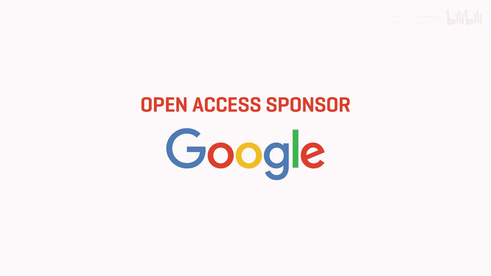
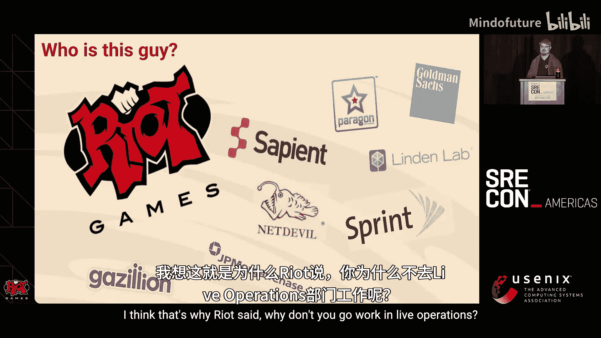
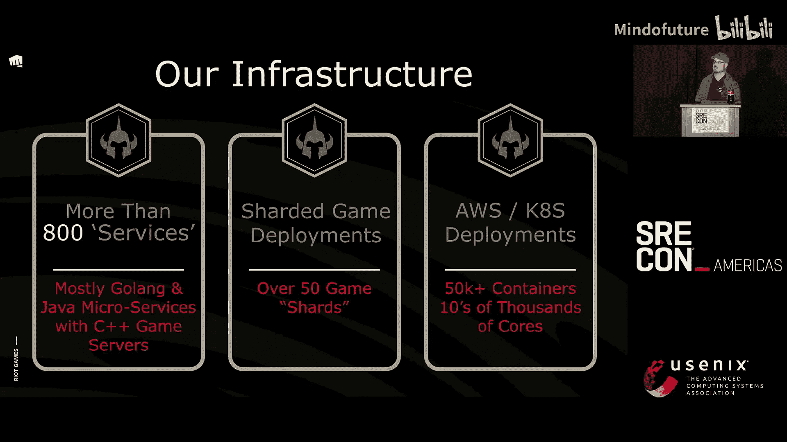
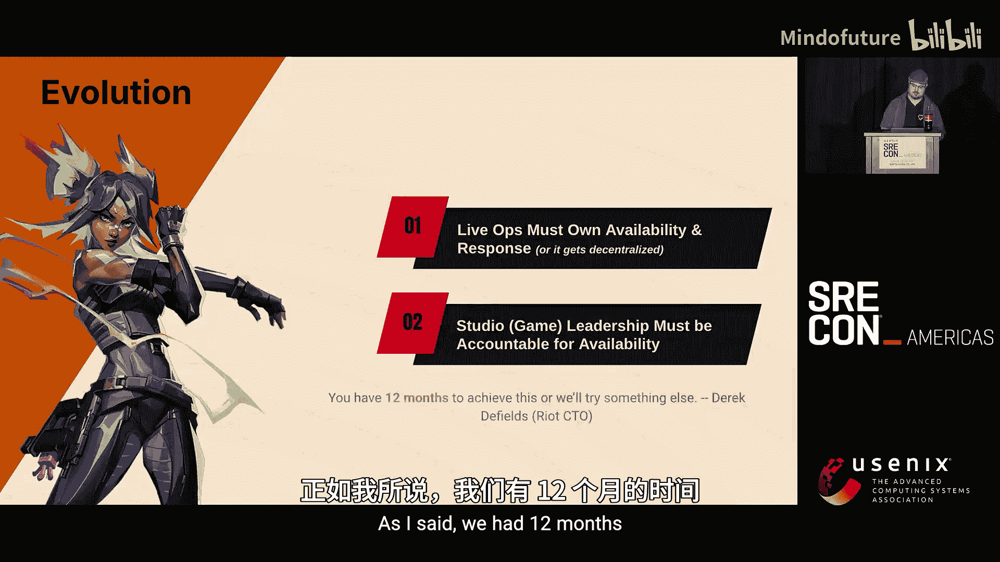
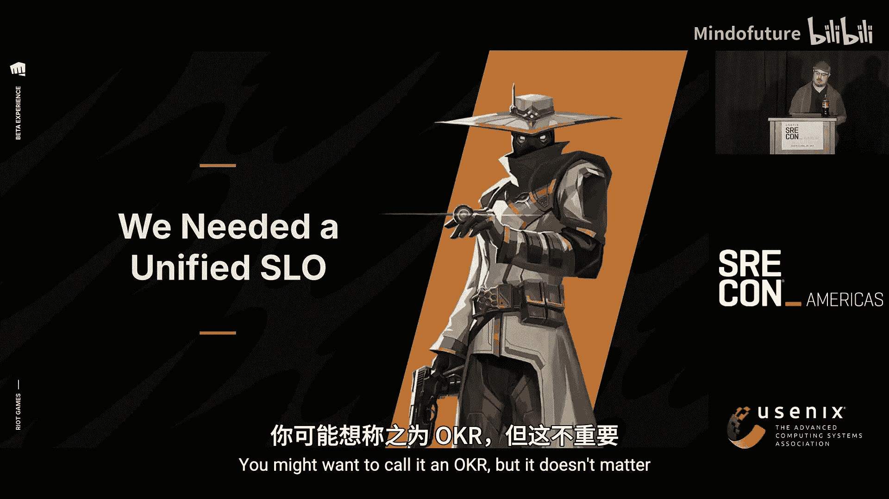
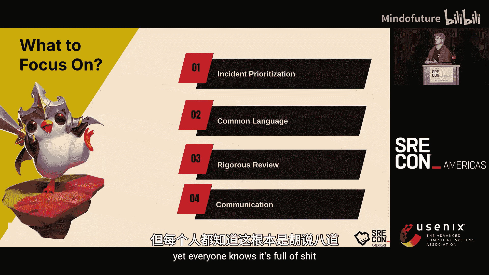
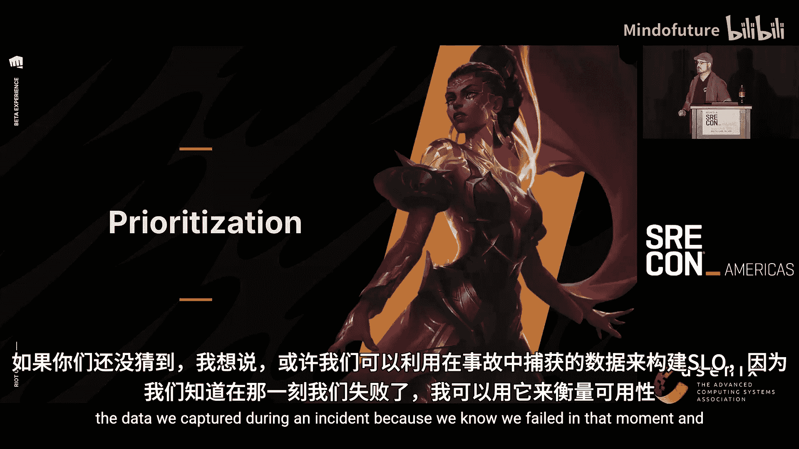
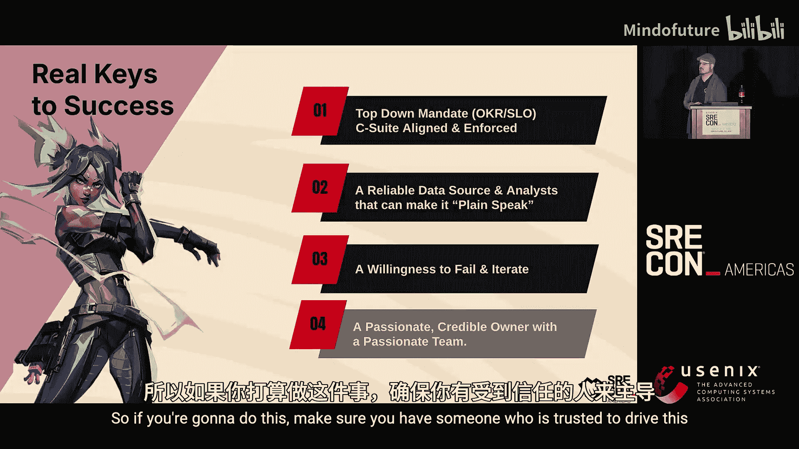
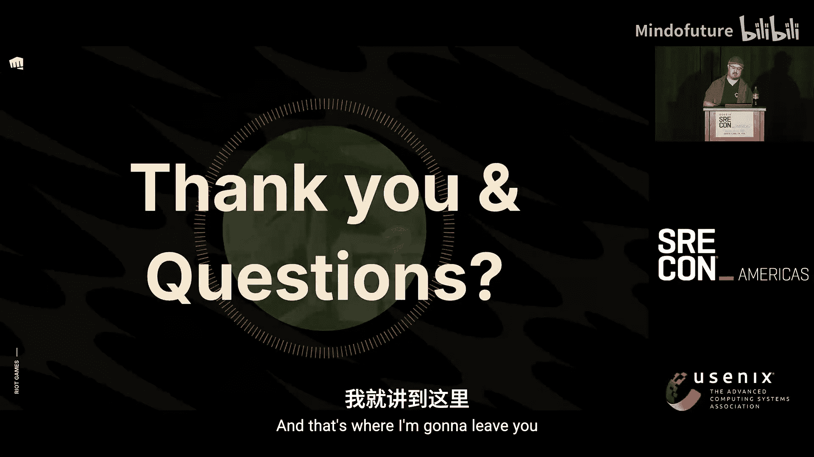
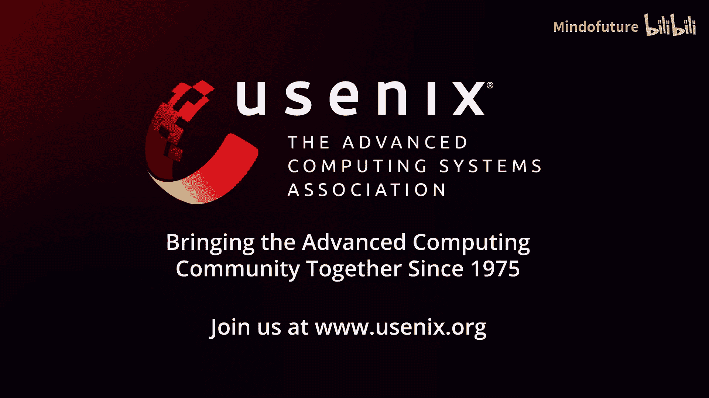

# 026：以玩家为中心的可用性度量——Riot Games如何改变其文化

## 概述

在本节课中，我们将学习Riot Games如何从一个缺乏统一可用性度量标准的公司，转变为建立一套以玩家体验为核心的可用性度量体系。我们将了解他们面临的挑战、设计的解决方案，以及这一变革如何重塑了公司的文化和响应机制。

---

## 章节 1：背景与挑战

上一节我们概述了课程内容，本节中我们来看看Riot Games在2020-2021年面临的困境。

Riot Games是一家以《英雄联盟》、《无畏契约》等竞技游戏闻名的多游戏工作室。其核心文化是“玩家至上”。然而，在2020年疫情初期，玩家数量激增，公司从单一游戏转向多游戏运营，运维团队压力巨大，出现了严重的倦怠问题。

一个根本性的问题是：**Riot Games运行了超过10年，却没有一个统一的、标准的游戏可用性度量数字**。公司领导层无法获得关于某天、某周或某月可用性的一致报告。对于一个信奉“玩家至上”的公司来说，这是一个严重的问题。

这种“玩家至上”的文化，在事件管理过程中反而成了一种阻碍。虽然能轻易召集30人处理问题，但很难确保召集的是“正确的”30人。公司的“完全责任制”文化导致团队只专注于自己负责的服务，而非整个游戏体验。这造成了一种“合理推诿”的环境，没有人对玩家的整体游戏体验负责。

因此，Riot Games的CTO给新成立的运维团队设定了一个目标：**在12个月内，定义并实施一个全公司认可的可用性度量标准**。这个标准必须得到游戏高管领导的认可，他们必须相信这个数字，并认为它能影响其产品。

---

## 章节 2：放弃技术方案，回归基本原则

上一节我们介绍了Riot面临的度量挑战，本节中我们来看看他们为何放弃了纯粹的技术解决方案。

团队最初的想法是建立一个技术仪表板，展示所有800多个服务的红绿状态，并按依赖关系汇总到游戏层面。然而，这条路被证明行不通。

**原因在于**：
1.  **度量标准不统一**：由于“完全责任制”，每个服务都以不同的方式度量其可用性。
2.  **改造成本过高**：统一所有服务的度量方式需要改造整个技术栈，预计需要两年时间才能达到80%的采用率，而团队只有12个月。
3.  **不符合玩家视角**：玩家不关心单个服务是否宕机。他们关心的是能否在想要的时候，以想要的方式与游戏互动。

因此，团队决定放弃从技术栈入手的方案，回归基本原则，利用现有资源快速构建度量体系。

**以下是他们拥有的关键资产**：
*   **强烈的责任感文化**：可以加以利用。
*   **告警系统**：虽然嘈杂，但能发现问题。
*   **出色的事件报告**：团队擅长记录和追踪事件。
*   **玩家支持团队**：作为后备，能快速反馈玩家问题。
*   **卓越的实时指标**：特别是**实时并发玩家数（CCU）** 数据，这是公司业务的核心，所有人都信任。

团队意识到，或许可以利用事件期间捕获的数据来构建SLO，因为他们确切地知道在事件发生时服务出现了故障。

---

## 章节 3：建立共同语言：事件优先级

上一节我们确定了利用现有数据构建度量的方向，本节中我们来看看建立共同沟通框架的第一步——定义事件优先级。

在“玩家至上”的文化中，生产环境的任何问题都可能被视为紧急事件。团队需要一种共同语言来讨论影响，而不是争论技术分类。

他们摒弃了基于服务“关键/非关键”的分类方式，因为这种分类常引发“我非关键为何被呼叫”的争论，耽误故障恢复。

**新的优先级体系完全基于对玩家的影响程度**：

以下是新的优先级定义：
*   **优先级 1（P1）**：影响 **50%** 或以上玩家基数。这被视为严重失败。
*   **优先级 2（P2）**：影响 **15% 至 50%** 的玩家基数。
*   **优先级 3（P3）**：影响 **1% 至 15%** 的玩家基数。
*   **优先级 4（P4）**：影响 **少于 1%** 的玩家基数。

这种分类方式将对话焦点从“哪个服务坏了”转移到“多少玩家受到了影响”，为整个公司提供了讨论问题严重性的通用框架。

---

## 章节 4：定义玩家体验类别

上一节我们统一了事件严重性的衡量标准，本节中我们进一步细化，定义玩家体验的具体问题类别。

仅知道影响了多少玩家还不够，还需要知道影响了玩家的“什么”体验。团队将所有游戏问题归纳为三个核心类别，每个类别下再细分：

**以下是三个核心玩家体验类别及其子类**：
1.  **连接游戏**：包括登录、更新游戏。如果失败，玩家根本无法进入游戏。
2.  **商业交易**：
    *   **支付处理**：使用信用卡购买虚拟货币。
    *   **内容获取**：使用虚拟货币购买皮肤等内容。
3.  **核心游戏体验**（最复杂，共识为6个子类）：
    *   **匹配**：与其他玩家组队。
    *   **游戏进行**：游戏内体验，如断线、崩溃。
    *   **终局奖励**：游戏结束后获取奖励。
    *   **聊天与语音**：玩家间的交流。
    *   **组队**：与朋友一起游戏。
    *   **库存/账户信息**：读取玩家的账户数据和资产。

通过结合**优先级（影响范围）** 和**体验类别（影响内容）**，团队能够用简洁的语言描述任何事件。例如，“韩国、大洋洲和欧洲《无畏契约》的匹配和库存读取出现P1事件，持续60分钟”，这足以让了解此框架的人明白问题的严重性。

---

## 章节 5：灵感来源与度量公式设计

上一节我们建立了描述问题的语言，本节中我们来看看如何将这些数据转化为一个可信的可用性度量数字。

团队需要设计一个SLO（服务水平目标）。传统的SLO基于错误率或延迟，但Riot缺乏统一的技术栈来实现这一点。他们从电力公司获得了灵感：电力公司通过“用户供电分钟数”来度量可靠性，少数用户短时间停电不会影响整体SLO，但大规模停电就会。

Riot拥有类似的实时数据：**并发玩家数（CCU）**。团队提出了一个创新概念：**服务玩家分钟数**。

**度量公式的核心思想如下**：
1.  **总服务玩家分钟数（预期）**：将每个区域、每个游戏每分钟的CCU相加，得到一个月内预期服务的总玩家分钟数。这通过计算滚动平均值来预估任何时间点应服务的玩家数。
    *   `总预期分钟数 = Σ(所有区域所有游戏每分钟的CCU)`
2.  **受影响玩家分钟数**：根据事件报告，估算在事件持续期间，受影响的玩家比例所对应的玩家分钟数。
    *   `受影响分钟数 = 事件持续时间 × 受影响玩家比例 × 该时段预期CCU`
3.  **可用性百分比**：
    *   `可用性 = (总预期分钟数 - 受影响分钟数) / 总预期分钟数 × 100%`

这个公式的优势在于：
*   **加权影响**：高峰时段的事件比低谷时段影响更大。
*   **区域平衡**：大区的事件比小区影响更大。
*   **基于可信数据**：CCU数据是公司业务的基石，无人质疑。
*   **玩家视角**：直接反映了玩家体验的聚合质量。

---

## 章节 6：目标设定与报告呈现

上一节我们设计了度量公式，本节中我们来看看如何设定目标并将结果呈现给组织。

设定一个现实的目标至关重要。由于从未测量过，团队不知道实际数字。设定一个明知无法达到的目标（如99.99%）会让人放弃。经过讨论，他们设定了第一个目标：**99%**。对于服务着每月超2000亿玩家分钟数的公司，即使1%的缺失也意味着巨大的影响。

月度报告的核心是一份“热力图”，以游戏分片为横轴，玩家体验类别为纵轴，直观展示哪些区域、哪些功能出现了问题。报告还包含一个执行摘要，汇总全局可用性百分比，并指出哪些分片未达标。

例如，一份报告可能显示《英雄联盟》全球可用性为98.97%，16个分片中有13个达标，问题集中在其中3个分片。这种呈现方式让领导层一目了然地看到问题所在，并基于此采取行动。

---

## 章节 7：实施、推广与文化影响

上一节我们看到了报告的形式，本节中我们来看看这个方案如何被推广及其带来的深远文化影响。

在12个月期限的第9个月，团队已经能够可靠地生成报告。接下来的挑战是让全公司接受它。

**推广的关键步骤**：
1.  **获得CTO支持**：CTO亲自参与，向各游戏高管团队传达此度量标准的重要性，并暗示其将与绩效挂钩。
2.  **与所有技术负责人沟通**：向50-100个开发团队的负责人解释，可用性报告将不再基于他们各自的服务度量，而是基于玩家体验。
3.  **与目标挂钩**：从2022年开始，每位游戏负责人的关键绩效目标（OKR）中都包含“达到99%可用性”。

**实施后的显著成果**：
*   **文化转变**：讨论焦点从“谁的服务故障”转向“玩家的什么体验受损”。
*   **运维团队士气飙升**：团队看到了自己的工作和建议能驱动公司资源投入解决问题，士气调查分数从极低跃升至接近满分。
*   **成立SRE团队**：由于度量体系成功，CTO批准了预算，正式建立SRE团队。
*   **组织规模扩大**：根据康威定律，更多专注于 resiliency（弹性）的工程团队被划归运维部门管辖。
*   **问题负责人制度**：游戏产品负责人开始任命“负责人”来专项处理登录、匹配等特定体验领域的问题。

---

## 章节 8：成功的关键要素

上一节我们回顾了变革带来的积极影响，本节中我们来总结一下，如果你想在自己的公司推行类似的变革，需要哪些关键要素。

演讲者被问及最多的问题是：为什么这个方案能成功？需要什么前提条件？

**以下是成功的关键要素**：
1.  **高层强制授权**：必须有一位有足够权威的高层领导（如CTO）自上而下地推动，并能够将目标与激励机制（如奖金、绩效）挂钩。没有这个，任何报告都只是空谈。
2.  **基于可信的核心数据**：度量必须建立在公司内部公认准确、无可争议的数据之上。对Riot来说，就是CCU数据。
3.  **具备能力和信誉的团队**：执行团队必须深入了解公司业务、数据陷阱和组织内的人际关系。空降的外部专家很难获得信任。
4.  **允许试错的氛围**：这不是“不成功便成仁”的任务。需要有“如果这个方法不行，我们就尝试另一个”的心态。
5.  **清晰的玩家视角**：整个度量体系和沟通语言必须围绕用户/客户体验构建，让所有角色（工程师、产品经理、高管）都能直观理解。

---

## 总结

在本节课中，我们一起学习了Riot Games如何通过聚焦“玩家体验”，利用现有的、可信的并发玩家数据，构建了一套独特的可用性度量体系。他们放弃了统一技术栈的艰难道路，转而从定义共同语言（事件优先级、体验类别）入手，设计了以“服务玩家分钟数”为核心的SLO公式。这一变革不仅产出了一个可信的度量数字，更重要的是，它彻底改变了公司讨论和响应可用性问题的文化，提升了团队士气，并驱动了更有效的资源投入。其成功的关键在于高层的强力支持、对核心业务数据的巧妙利用，以及一个深谙公司内部运作的、值得信赖的推行团队。