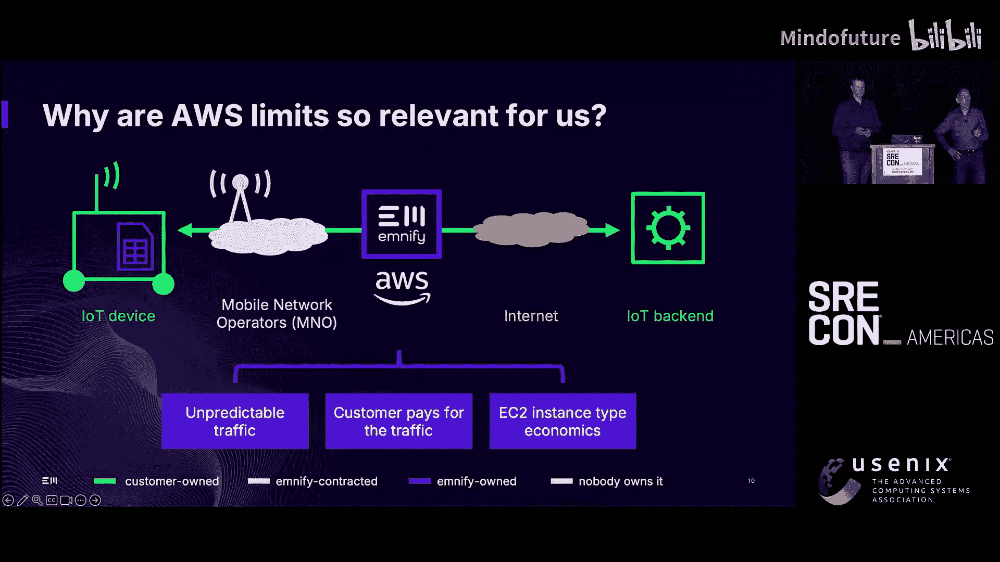
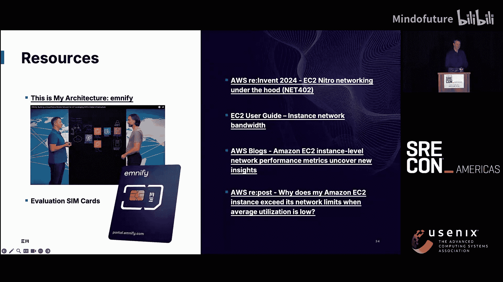

# 027：请还我网线！AWS中的网络限制剖析


## 概述
在本教程中，我们将深入探讨AWS（亚马逊云科技）中网络性能的各类限制。我们将从基础的网络带宽和每秒数据包数限制讲起，逐步深入到连接跟踪、数据包分片等高级主题。通过学习，您将理解这些限制如何影响您的云上应用，以及如何监控、诊断和优化网络性能，确保您的服务在面对突发流量时依然稳定可靠。

---

## 网络带宽与数据包速率限制

上一节我们概述了课程内容，本节中我们来看看AWS网络最基础的两个限制：带宽（Gbps）和每秒数据包数（PPS）。

AWS实例的网络性能受两个关键指标限制：
1.  **带宽限制**：以吉比特每秒（Gbps）衡量，例如15 Gbps。
2.  **数据包速率限制**：以每秒数据包数（PPS）衡量，例如125万PPS。

这两个限制共同作用。带宽限制是硬性上限，无论数据包大小如何，吞吐量都不会超过此值。数据包速率限制则是一个隐含限制，其数值通常被设定为：在使用1500字节标准数据包时，刚好能达到标称的带宽上限。

**核心公式**：
```
理论最大吞吐量 (Gbps) = min(标称带宽, 实际PPS * 平均数据包大小 * 8 / 10^9)
```

这意味着，如果您的应用发送的数据包平均尺寸较小，即使未达到带宽上限，也可能触及PPS限制，从而导致实际吞吐量远低于预期。例如，一个标称15 Gbps的实例，在处理平均500字节的小数据包时，实际吞吐量可能只有约5 Gbps。

以下是AWS不同实例系列的典型网络规格对比：



*   **通用型实例**：网络带宽相对较低，例如`m7g`系列最大为30 Gbps。
*   **计算优化型实例**：通常提供更高的网络限制。
*   **网络增强型实例**：名称中带有“n”，专为高网络吞吐量设计，可提供高达200 Gbps的带宽。

---

## 监控网络限制

了解了限制的存在后，我们需要知道如何监控它们。AWS提供了专门的指标来指示实例是否触及了网络限制。

自2021年起，AWS引入了网络“额度”指标。当实例的网络流量超过其允许的限制时，相应的计数器就会增加。这些指标包括：
*   `BandwidthAllowanceExceeded`（带宽额度超限）
*   `PacketRateAllowanceExceeded`（数据包速率额度超限）

**重要提示**：这些指标仅表示数据包在Nitro虚拟网卡的队列中**曾被延迟**（排队），并不直接等同于**丢包**。数据包可能随后被成功发送，也可能被丢弃。

获取这些指标需要一些配置工作，因为它们并非默认在CloudWatch中提供。您需要通过实例操作系统内的工具来收集：

1.  它们来源于弹性网络适配器驱动。
2.  可以使用`ethtool`命令读取。
3.  若想集成到Prometheus或CloudWatch，需配置对应的代理（如Node Exporter的`ethtool`收集器或CloudWatch代理）。

**监控建议**：由于网络流量可能存在持续仅数秒的“微突发”，即使1分钟粒度的监控也可能无法捕捉到这些瞬时峰值。因此，看到额度超限计数器增加，但平均带宽利用率却很低的情况是可能发生的。

---

## 实战案例：微突发与S3上传

理论需要结合实际。我们曾遇到一个案例：一个`c6i.xlarge`实例的网络`BandwidthAllowanceExceeded`计数器每隔5分钟规律性增长，但该实例的平均带宽使用率仅为15 Mbps，远低于其12.5 Gbps的极限。

经过排查，发现问题根源在于一个每5分钟运行一次的9MB S3文件上传任务。虽然数据量不大，但该上传在26毫秒内完成，这相当于一个短暂的**微突发**，瞬时速率推算约为2.7 Gbps。

我们与AWS支持的沟通揭示了关键点：
*   **根本原因**：数据包经过互联网网关，其MTU被限制为1500字节。小数据包、高瞬时速率触发了PPS限制下的微突发。
*   **尝试与结论**：
    *   启用VPC端点并使用巨型帧未能解决问题。
    *   `PacketRateAllowanceExceeded`计数器为0，说明不是平均PPS超限。
    *   这证实了限制是在**微秒级**粒度上实施的，微突发足以触发排队。

**经验总结**：
1.  限制的实施粒度非常细。
2.  `AllowanceExceeded`计数器增加不等于丢包，可能只是排队。
3.  必须监控应用行为，确保其能容忍潜在的数据包丢失。
4.  带宽额度是共享资源，即使有额度积分，也无法保证随时可用。

---

## 应对带宽与PPS限制的策略

当遭遇网络限制时，有哪些可行的解决方案呢？以下是经过验证的策略列表：

*   **垂直扩展**：升级到更大的实例类型，通常能获得更高的网络带宽配额。
*   **选用网络增强型实例**：为网络密集型工作负载选择名称带“n”的实例系列。
*   **升级实例代次**：例如，从第6代升级到第7代实例，可能以相近成本获得20-25%的网络性能提升。
*   **使用E2实例带宽权重**：在最新代次实例上，可以重新分配网络与EBS存储的吞吐量权重。
*   **启用巨型帧**：在VPC内、通过直连或传输网关的通信中，将MTU设置为9001字节，减少数据包数量，提升有效吞吐量。
*   **平滑流量，避免微突发**：通过应用程序配置、TCP参数调优或流量控制工具来平缓流量峰值。

---

## 数据包分片的陷阱

上一节我们讨论了常规流量限制，本节中我们来看看一个特殊的性能杀手：**数据包分片**。

当IP数据包大小超过路径上的MTU时，就会被分片。在AWS中，分片数据包无法享受Nitro网卡的硬件加速，而是由CPU处理，性能大幅下降。

**关键发现**：
*   **入向分片**：遵循较慢的“标准”数据包速率，但该速率随实例规模增大而提升。
*   **出向分片**：存在一个固定的、极低的限制（约1024 PPS），且**不随实例规模扩大而增加**。

这对于使用VPN、隧道封装协议的应用（如我们的物联网核心网）影响巨大，因为封装会增加数据包大小，容易导致分片。

**应对分片问题的策略**：
1.  **避免分片**：确保隧道接口的MTU设置正确，让分片发生在内层数据包，对外层透明。
2.  **启用Path MTU Discovery**：确保实例能发送“需要分片”的ICMP错误，帮助通信对端调整数据包大小。
3.  **配置TCP MSS钳位**：自动调整TCP连接的最大段大小，避免分片。
4.  **利用传输网关分片**：如果架构允许，在传输网关上配置巨型帧，并让网关负责分片，减轻实例压力。
5.  **启用“分片绕过”**：使用最新的ENA驱动，可以解除1024 PPS的出向分片限制，但需注意这会占用Nitro CPU资源。

---

## 连接跟踪的限制与应对

网络限制不仅关乎吞吐量，还关乎连接状态。本节我们探讨**连接跟踪**的限制。

安全组是状态化的防火墙，它需要维护一个连接跟踪表来记录所有活动连接的状态。这个表有大小限制，但AWS并未公开此限制的具体数值。

当连接跟踪表满时，新建立的连接可能会失败，导致SSH登录、DNS查询、甚至AWS Systems Manager访问异常。

**监控连接跟踪**：
AWS提供了两个相关指标：
*   `ConntrackAllowanceExceeded`：当连接因跟踪表满被拒绝时增加。
*   `ConntrackAllowanceAvailable`：显示跟踪表的剩余容量。

**重要提示**：这些指标需要较新版本的ENA驱动才能支持。例如，Ubuntu 24.04 LTS自带的驱动可能不支持，需要自行编译升级。

**应对连接跟踪限制的策略**：
1.  **禁用连接跟踪**：如果安全组规则允许**所有出站流量**（目标为`0.0.0.0/0`），并且有对应的入站规则，那么该安全组上的连接跟踪可以被禁用。**注意**：这会降低安全层级，需谨慎评估。
2.  **垂直扩展**：使用更大的实例，连接跟踪表容量通常也更大。
3.  **调整连接空闲超时**：减少网络接口上连接跟踪条目的默认空闲超时时间（默认为5天），加速旧条目的回收。
4.  **降低流量的基数**：通过架构优化，减少AWS网络需要区分的独立连接数量。例如，在我们的案例中，通过引入通用封装，将众多客户流汇聚到更少的隧道中。

---

## 总结

在本教程中，我们一起深入学习了AWS云中复杂而重要的网络限制体系。

我们首先认识到，限制的存在是为了隔离租户，保护彼此。我们系统性地探讨了带宽与PPS限制、如何监控它们，并通过微突发的案例理解了限制实施的细粒度。接着，我们剖析了数据包分片这一性能陷阱及其独特的出向限制。最后，我们深入研究了连接跟踪的限制、监控方法以及包括禁用跟踪在内的多种应对策略。

关键收获在于：
*   **文档是朋友**：AWS文档在不断改进，定期阅读至关重要。
*   **监控需谨慎**：提供的指标很有用，但需要正确理解和配置，有时仍需深入排查。
*   **架构是关键**：许多限制可以通过优化应用架构（如平滑流量、减少分片、降低连接基数）来缓解或规避。
*   **持续学习**：AWS平台在不断演进，新的实例类型、驱动功能和优化可能悄然发布，保持技术敏感度是必要的。




云网络看似抽象，但其限制实实在在影响着应用的性能与成本。希望本教程能为您在AWS上构建稳健、高效的应用程序提供一份实用的指南。