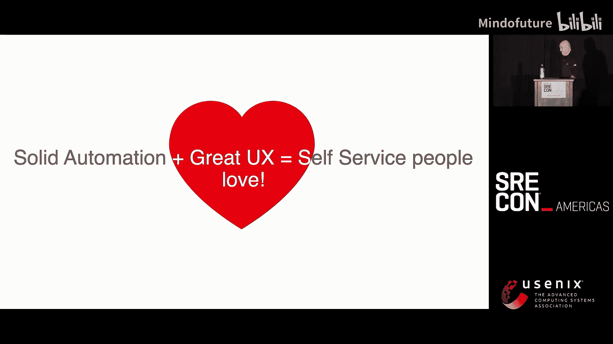
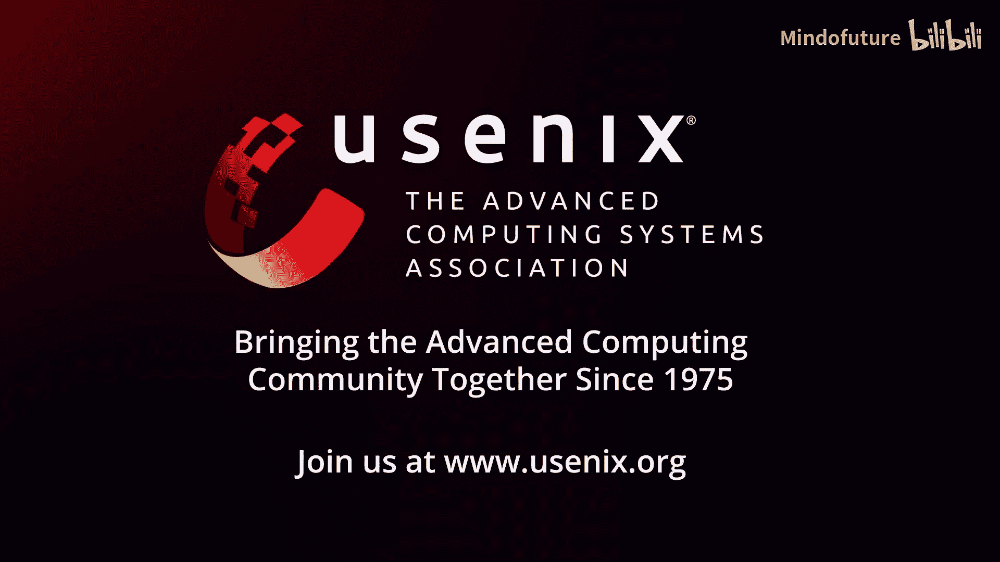
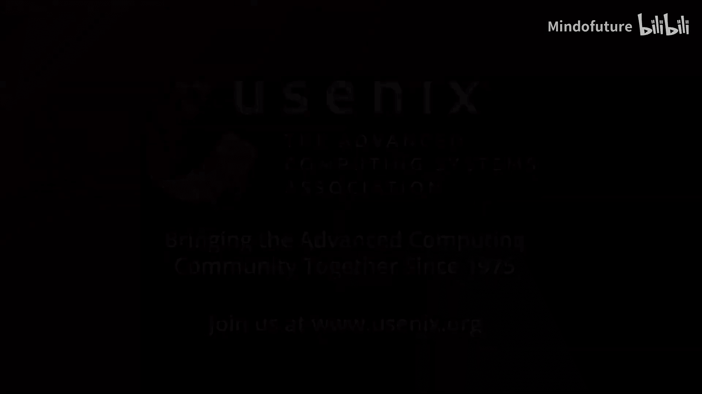

# 030：化流程为产品

在本教程中，我们将学习如何将复杂、手动的运维流程转化为自动化、自助式的产品。我们将探讨自动化背后的核心原则，分析流程的通用构建模块，并重点介绍如何通过卓越的用户体验设计来驱动产品的采用。最终目标是创建出不仅功能强大，而且深受用户喜爱的自助服务平台。

## 流程自动化的演进与挑战

在深入具体方法之前，我们先回顾一下自动化的发展历程。最初，自动化是出于必要，我们编写Shell脚本、Cron作业来处理重复任务。随着复杂度增长，我们开始使用版本控制、Python、Puppet、Ansible、Terraform等工具，以一致且可靠的方式实现自动化。

许多工程师的职业生涯都建立在掌握这些工具之上。后来，这一旅程引领我们走向Go、Kubernetes CRD，并开始开发自己的软件来实现自动化。代码的核心目标始终不变：让事情以编程方式、自动、可预测且一致地发生。我们知道，可靠性是自动化与一致性的结合。

起初，我认为只要自动化技术流水线，就能解决大部分问题，使事情变得可重复、可预测和声明式。但无论你的CI/CD流水线多么完善，告警系统多么出色，你可能仍然在处理手动文件传输，或者在海量负载均衡器日志中寻找几天前故障的根本原因，并手动提交工单。

## 从流程到产品的思维转变

当我六年前加入公司时，我发现有一支高技能的工程师团队，致力于通过出色的自动化来简化流程。然而，有些流程过于复杂，涉及太多人员和手动环节，无法完全自动化。随着时间的推移，这些流程成为我们改进和发展的重大障碍。

这促使我思考：如果我将这个具体问题——手动流程问题——视为一个需要解决的产品问题，会怎样？我能否开发一个产品或技术来解决它？这个问题将你置于一个不同的角度：你不再是问题的一部分，不再受现有边界的限制。你跳出框架，审视它，并试图找到解决方案。

我想，如果让流程本身成为产品会怎样？如果我的SRE团队可以专注于创建代表他们行动的工具，供他人使用，从而将宝贵的时间重新投入到真正需要关注的领域，而不是创建另一个特殊环境、部署另一个服务或配置更多资源，那会是什么样子？

从手动流程的维度思考，我们是人与技术之间的中介。那么，为什么不能将这种中介委托给我们能够构建的技术，然后成为这项技术的提供者呢？我相信技术，相信它可以解决任何问题，包括这个具体问题。因此，我们决定将其视为一个工程问题，而工程问题需要工程方法。

## 流程自动化的通用构建模块

自动化成功的关键不仅在于编写脚本或代码，更在于将流程分解为根本上可重用的构建模块。如果我们分析大多数运维工作流，它们都可以归结为五个通用步骤：

以下是构成任何流程的五个核心构建模块：

1.  **询问/输入**：我们需要获取输入数据。
2.  **执行动作**：我们想要执行某个操作，例如重启、部署、发送邮件等。
3.  **审批流程**：作为一个守门员，无论审批是程序化的还是手动的，它都是自动化流程中可以使用的一个模块。
4.  **等待**：等待的能力允许我们进行异步处理。我们可以开始某项工作，等待输入，等待相关人员返回，执行另一个流程，然后恢复操作。
5.  **报告状态**：我们需要知道流程的状态。

从高层次看，任何手动流程都可以通过以特定方式排列这些构建模块来构建或重建。细节可能不同，收集数据的方式可能各异，审批流程可能变化，但基本原则保持一致。

## 理论实践：域名掩码自动化案例

有了构建模块的理论基础，我可以按顺序排列它们来自动化流程，并希望看到理论付诸实践。我们解决的第一个流程是自动化所谓的“掩码域名”。

为了给不熟悉我们业务的听众一些背景，我们运营于客户体验和用户体验领域，通过不同渠道收集来自用户的信号。其中一个信号是客户反馈。从技术层面看，这些反馈被发送到我们的域名。但有些客户不希望提及我们的域名，他们希望反馈在其自己的域名下发送。这是一个非常简单的需求。

但在运营层面，由于依赖关系，这曾是一场噩梦。这个过程始于客户联系专业服务团队，要求设置域名掩码。专业服务团队会为SRE团队创建一个工单。然后，SRE生成证书签名请求，将其发回给专业服务团队。专业服务团队将其转发给客户签署，客户再将证书发回。专业服务团队接着将其转发给SRE进行验证和安装。SRE会创建一个DNS记录，并要求客户指向该记录。最后，专业服务团队通知客户更新DNS，一切开始运作。

这个过程极其简单直接，但由于相互依赖、涉及人员以及客户方既定的程序，我们一直以同样的低效方式重复它。

现在，让我们看看如何使用之前提到的构建模块重新安排这个流程：

以下是使用构建模块重构后的域名掩码流程：

1.  **输入**：客户发起掩码域名请求。我们需要向专业服务团队询问客户详情。
2.  **动作**：创建工单用于审计跟踪。
3.  **动作**：同时创建证书签名请求和DNS记录。
4.  **等待**：等待专业服务团队返回已签署的证书。
5.  **审批/验证**：验证证书，确保其与生成证书签名请求时创建的私钥匹配。（此处作为守门员，旨在建立对流程的信任，但技术上可实现自动化）。
6.  **动作**：安装提供的证书，并通知专业服务团队客户可以执行DNS更新。

本质上，这是完全相同的流程和步骤，只是以更有条理的方式进行了排列。但为了让其工作，为了让专业服务团队能够启动并遵循此流程，我们必须将它们全部整合在一起，创建一个系统和一个界面。我们做到了。

## 自动化之外的挑战：用户体验至关重要

然而，令人惊讶的是，人们并不兴奋，我们仍然收到大量工单，尽管系统在功能上非常完善。我们是技术人员，当我们构建东西时，我们考虑的是技术细节，为技术人员构建。我们完全可以创建一个接收API并返回JSON的服务。如果你愿意，可以使用`curl`与之对话。

即使我们构建了用户界面，它看起来也像这样（注：指演讲中展示的原始界面），说实话，我当时很自豪。但它仍然需要非常长的文档页面，让人们理解他们应该做什么、先做什么、下一步做什么、何时继续。令人惊讶的是，人们不喜欢阅读冗长的文档。

我们持续收到工单，因为存在一个“捷径”。如果某件事需要阅读文档，而另一件事是捷径，人们总是会选择捷径。但对我们来说，这个Jira工单根本不是捷径，因为它需要我们持续在Jira中工作、更新内容和跟踪进度。

于是，我们有了另一个启示：我们理解到，仅有自动化是不够的。人们必须愿意使用它。我再次戴上初创公司创始人的思维帽子，问自己：如果我要开发一个我希望人们使用的产品，它会是什么样子？一个好的、畅销的产品是什么样子？

当我谈到产品时，想想苹果、沃尔沃或奔驰。当你打开新iPhone时，你立刻明白如何使用它。你坐进一辆奔驰，每个控制装置都如你所料。苹果永远不会要求客户SSH到他们的手机来启用蓝牙。奔驰不会要求你带扳手来启动车辆。沃尔沃不会提供五页长的文档教你如何换挡。他们期望它“直接能用”。

这些品牌有某种共同点，我希望我的产品也有同样的感觉。我希望它直观、有吸引力且易于使用。我的产品需要一个出色的界面，但作为SRE，我们如何知道什么是出色的界面呢？

## 打造卓越用户体验的设计原则

为了回答这个问题，我们咨询了产品专业人士的朋友和同事，并学习了大量用户体验设计原则。我们专注于客户体验，并将同样的理念应用于内部，应用于我们的自动化产品。我们确定了以下对我们需求绝对最佳的设计指南，希望你们也能发现它们有用。

以下是打造用户喜爱的自动化产品的七项关键设计原则：

1.  **清晰优于复杂**：减少认知负荷，使交互显而易见。不要显示任何非必要信息。例如，在我们的内部监控系统中，底部只提供你正在寻找的确切信息，用清晰的大拇指图标指示证书状态。
2.  **简约而强大**：提供简单的默认选项，但也允许在需要时进行高级控制。应用此原则，我们最初将冗长的侧边栏缩减为几个按钮和切换开关，并用图标替代文字，因为图标更直观。
3.  **渐进式披露**：不要一次性用所有选项淹没用户。理想情况下，应根据用户之前的选择动态显示相关选项。我们通过JSON配置文件定义相关步骤、前后关系来实现这种表单配置。
4.  **一致性**：保持相同的用户界面模式和设计语言，确保当用户使用新系统或现有系统演进时，仍然感到熟悉和自在。
5.  **容错与恢复**：如果用户输入了错误信息，不要让他重启整个流程或刷新页面。提供返回并修复之前错误的方法。我们发现“下一步/上一步”箭头在网页表单中最实用、最直观。
6.  **可访问性与包容性**：这里指的是针对不同技能水平的人群。你希望你的系统对技术高手和零基础的新员工都可用。可以通过“简约而强大”的原则来实现：为入门用户展示最简界面，同时提供一个“高级模式”切换来暴露更多功能。
7.  **视觉反馈**：当系统执行操作时，让用户知道它正在工作，而不是卡住了。加载时显示旋转图标，遇到错误时显示有意义的错误信息。错误信息应具有可操作性，告诉用户问题出在哪里以及下一步该做什么，而不是简单的“服务器遇到意外错误”。

## 实现成功的三步算法

理解了这些原则后，我们将其应用到现有系统中。结果，采用率飙升，人们开始使用系统。我们随后将成功经验复制到下一个、再下一个流程。

后来反思这个过程时，我们清楚地认识到，真正的挑战并非来自技术，而是来自人员、流程和采用率。你可以解决技术挑战，轻松实现自动化，使其成为自助服务，但如果不方便，人们就不会使用它，你的所有工作都可能付诸东流。

但有一种方法：你希望让人们爱上你所做的事情。你希望它吸引人且简单，让他们希望所有事情都像你做的那样好。这样你才能赢得用户的心和思想。

我将这个演讲命名为“Per Aspera ad Productum”（历经艰辛，终成产品）。但这个过程不必艰难。前路已明，我很高兴能在此与大家分享这些想法。

最后，我想分享一个我们现在使用的、帮助我们重构旧工作方式的算法。它非常简单、明显，但非常强大。

以下是实现流程产品化的三步算法：

1.  **理解**
    *   **理解流程边界**：明确你试图自动化的流程的确切起点和终点。手动流程的问题之一在于它们不一定有明确的起点和终点。
    *   **理解你的用户**：了解谁是你的用户和受益者（他们可能不同）。与目标受众沟通，理解他们的真实需求，围绕满足这些真实需求来构建产品，而不仅仅是为了让你和你的团队受益。
    *   **理解限制**：考虑隐私、数据治理、安全等所有我们熟悉的运营限制。

2.  **实施**
    *   就是去做。任何适合你开发产品的方法都行。

3.  **改进**
    *   改进产品的唯一方法是收集反馈，并基于反馈采取行动。
    *   **重要提示：避免变通方案**。变通方案不是功能，它们容易成为部落知识，并且由于其性质而难以维护。如果用户提出请求，不要给他们变通方案，要使其正式化。
    *   **管理产品路线图**：产品路线图与运营路线图略有不同，你需要管理缺陷、功能请求和技术债务。
    *   **使组件可重用**：我们都理解可重用性的含义。

## 总结

本节课中，我们一起学习了如何将手动运维流程转化为成功的自助服务产品。我们从自动化演进的历史出发，认识到仅靠技术自动化不足以驱动采用。核心在于进行思维转变，将流程视为待开发的产品。

我们分析了任何流程都可分解为**输入、动作、审批、等待、报告**这五个通用构建模块。通过一个域名掩码的实际案例，我们看到了如何用这些模块重构流程。

然而，真正的突破来自于关注**用户体验**。我们介绍了七项关键设计原则：清晰优于复杂、简约而强大、渐进式披露、一致性、容错与恢复、可访问性与包容性、视觉反馈。应用这些原则能显著提升产品的采用率。

最后，我们总结了一个实用的三步算法：**理解、实施、改进**，用于系统地重构旧有工作方式。

请记住，如果要从本课中带走一样东西，那就是这个公式：**卓越的自动化 + 出色的用户体验 = 人们喜爱的自助服务**。