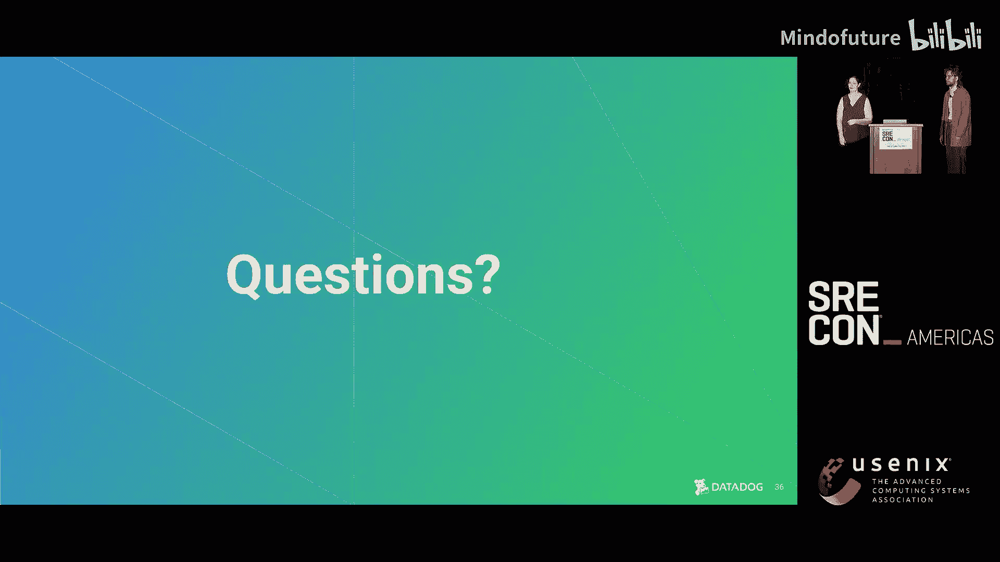

# 031：关键的事件管理指标 🎯

在本节课中，我们将探讨如何有效衡量事件管理流程的成功与否。我们将分析传统指标的局限性，并学习如何构建一套更全面、更能反映真实情况且能避免不良激励的指标体系。

---

大家好，我是Jamie，Datadog的高级SRE。我刚刚结束了为期六个月的突发事件管理团队临时经理任期。这个团队负责定义事件管理和值班流程与实践，并衡量这些计划在全公司的成功程度。

我是Laura，Datadog的高级工程师，我的工作范围广泛，核心是确保我们的系统可靠且具有韧性。这自然包括确保我们的事件管理流程和工具运行良好，将客户受意外事件影响的程度降至最低。

在这次演讲中，我将扮演一个新角色：Datadog的一位新上任的工程经理，正准备在事件管理领域有所作为。

欢迎来到Datadog。Datadog虽然不是巨头公司，但规模相当大，并且拥有自下而上的工程文化。这意味着Datadog的任何工程师在某个时刻都可能参与处理事件，每个人都受过培训，能够胜任事件响应者或事件指挥官的角色，并且需要参与撰写事后分析报告。我们有一个专门的团队来构建可持续的事件流程，并持续评估我们的事件管理和值班状态。

那么，高管们如何知道雇佣这个事件管理团队是值得的呢？我们需要了解我们在控制事件方面做得如何，以及团队为改进业务所做的工作是否物有所值。我们希望在公司层面需要重大调整之前，就能发现问题。同时，我也希望获得丰厚的奖金。

那么，如何用高管能理解的语言证明我们做得很好呢？

我知道，我们应该衡量事件的**平均恢复时间**。如果我们的响应有效，就能更好地恢复。所以，MTTR下降意味着我们有良好的事件响应。

这是一个容易统计的指标，但它究竟为组织带来了什么价值呢？我认为它描绘了一幅不准确且过于简化的可靠性图景。事件是不断变化的，单一指标不足以捕捉这种复杂性。它也不是一个稳健的汇总统计量。Shaan Devidovich在一篇出色的论文中做过统计分析，指出事件数量的变化和事件数据的标准差变化，意味着MTTR的变化几乎可以确定是数据中的噪音，你并没有测量到对组织有用或可操作的东西。

不仅如此，它还会产生不良的激励。降低MTTR最简单的方法就是让同一个事件反复发生，每次响应都越来越熟练，直到能非常快地关闭它。但这对于事件管理项目来说并不是一件有用的事。

在你提出之前，我想说，**平均确认时间**和其他类似的MTTR变体也好不到哪里去。它们同样带有自身的不良激励问题，并且和MTTR一样不稳健。

好吧，我们不想让同一个事件反复发生。那么我们应该衡量**事件数量**。如果我们工作做得好，事件就会越来越少。这说得通，我们希望系统故障更少，通过减少事件来实现。

我能看到其中的逻辑，但事件数量的变化究竟意味着什么？事件数量的增减往往是相关性而非因果关系，可能受到业务周期性、节假日或代码冻结期的影响。此外，它也会带来不良激励，鼓励人们不将真正需要响应的事件上报，让低严重性事件变成“有问题的Bug”，最终导致你失去对实际故障的可见性，因为它阻碍了人们参与你的流程。

那么**变更失败率**呢？它类似于事件数量，但根据系统规模和变更速度进行了标准化。

但什么是“变更”？什么是“失败”？这很难定义。它也无法很好地反映问题是如何相互关联的，以及变更如何随着时间的推移从看似无关的提交中累积起来。

但人们需要认真跟进事后分析，所以他们需要有很多行动项。行动项越多越好。

如果“行动项越多越好”，就会鼓励人们制定低价值的行动项，尤其是当它与“衡量行动项完成度”的想法结合时。我们可以在团队层面衡量这个，比如周环比趋势。

但为什么不是小时环比呢？如果只针对单个团队及其事件，数据变化太大，周环比无法提供可操作的数据。

我们希望事件不那么糟糕。我们可以用**事件严重性**来衡量吗？这有助于减少客户遭受的严重中断次数。

我同意，让事件不那么糟糕是好事。但如果我们试图计算高严重性事件的数量，就会鼓励人们人为降低事件严重性，甚至可能不上报本该是事件的事情。

你这是在为难我。为什么不衡量**团队资历水平**呢？我们知道资深工程师更优秀，所以他们只有在事情真的出问题时才会犯错。

我不一定更优秀。而且我认为这可能会导致团队之间相互对立，甚至可能形成一种指责文化。其下游影响可能相当糟糕。

Jamie，你让我明白了，衡量事件成功真的很困难。事件很复杂，变化多端，涉及大量人际互动，我们确实需要认真思考我们正在建立的激励机制。

但请理解我的立场。业务部门确实想知道我们是否有效。作为团队，我们也应该想知道。我们想知道我们做的事情是否有用且重要。

所以，我们不能只说“相信我们”，或者对我们的实践是否有效、是否让事情变得更好一无所知。

我完全同意。让我们采取工程化的方法来解决这个问题。让我们尝试将问题分解为更小的问题，将事件响应和值班本身视为目标。我们可以同意，无论我们做什么，系统都会出故障。无论工程师多么熟练，故障总会发生。

因此，如果我们在响应方面是有效的，并且我们的事件管理计划因此是有效的，那么哪些事情会是真实的？我们如何衡量它们来证明我们正在朝着目标前进？

那么，有效的事件管理。这是一个好问题。作为负责值班的“多管闲事者”，我的目标是什么？

对于值班本身，我想知道我们的工程师擅长此道。我想知道值班的工程师能及时响应，知道如何使用工具，并且工具运行良好。我想知道他们对此负责，流程能按我们的要求执行，即尽快通知并让具备解决问题知识的人参与进来。我想知道他们将其视为最高优先级的中断。

没有人会在自己的值班期间失联或无法处理事件。

当然。关于工程师认真对待值班并负责这一点，在Datadog，我们相信这在文化上是普遍真实的。这是我们觉得不需要特别去衡量的事情。这也是一种信任的衡量，我们信任我们的工程师和文化，当有人做了不符合既定值班流程的事情时，他们会告诉同事或经理。我们经常分享期望等。同时，重要的是要提醒自己，收集数据不是免费的。在这种情况下，如果我们觉得不需要衡量，也许就不应该花费成本去衡量。

另外，关于人们如何与值班工具互动，我认为值班工具在不需要时应该是隐形的。混乱和额外的工作负担对值班来说是毒药。你不想因为人们试图使用你提供的系统而给他们带来额外的工作负担。因此，在量化这一点时，我们可以考虑系统的直观性。我们可以衡量人们的无心之失。如果有人有多种方式可以呼叫某人，而有人使用了错误的方式，这对你来说就是一个信号。同样，如果有人使用错误的统计分析或工具来跟踪告警，这也是有帮助的。你也可以跟踪发送到Slack但从未被确认的告警数量。如果你确实需要衡量严肃性和责任感，你也可以衡量响应告警的时间，但正如我之前所说，在Datadog我们觉得不需要这样做。

好的，这几乎就像是我们值班工具的**产品成功指标**。

我还想知道，我们不会因为值班而让工程师精疲力竭。当呼叫人们时，他们编写新功能的时间和精力就会减少，而新功能是我获得丰厚奖金的基础。我也相信，经理也是人，希望善待他们的员工。所以，可能我也不想让我的员工精疲力竭。我想知道我们对工程师提出的值班要求，是业务真正需要的最低合理要求，并且在人类长期可持续承受的范围之内。值班对团队来说是一个持续的成本，我们应该知道我们正在最小化这个成本，并考虑防止倦怠。我真的想知道我们没有让值班的负担变得不公平。

当你问一个团队“你们的值班轮换公平吗？”时，他们会回答“是”，因为感觉工作不公的人会更快地精疲力竭。

因此，为了让值班的负面影响最小化，我认为我们可以衡量**值班的糟糕程度**，特别是在它是否会影响个人生活并导致倦怠方面。我们都知道被寻呼机吵醒很糟糕。那么，一个人有多少个夜班（包括连续夜班）？在这些夜班期间，他们收到了多少个夜间告警？我们是否发现这些负担分布不均？

说到实际收到告警，一个人在一个班次平均收到多少告警？工程师在一个小时内最多收到多少告警？这可以衡量一个班次的通常糟糕程度和最糟糕情况。

但就影响个人生活而言，他们连续值班多少天？这些班次有多长？在任何给定时间段内，他们总共值班多长时间？正如Corey周二所说，这种影响因人而异，在我们的团队内部以及我们合作的团队内部，考虑这种影响的表现形式以及我们如何根据个人生活中的不同责任来最小化它，是非常重要的。

就轮换的公平性和防止人员倦怠而言，并非所有事情都可以量化，尤其是感受方面。但我们可以量化一部分。例如，我们可以分析周末和夜班的分布情况。我们知道周末班或夜班会影响到个人生活，因此我们可以考虑这些班次在轮换中是否分配均匀，在共享轮换的团队之间是否分配均匀。

我认为我们可以处理这些数据。我可以把这些数据带给高管看，并指出那些随着时间推移而改善的趋势线。我喜欢看到改善的趋势。

接下来，我们来看看你可能认为是团队核心使命的部分：在工程师被呼叫之后，有时会遇到真正的事件。什么让一个事件变得“好”？没有事件是好的，但什么让一个事件比另一个更好？

我六个月前在SREcon Dublin看到一个非常棒的演讲，叫《土拨鼠之日》，他们用AI研究了事件响应。作为经理，我很喜欢。那里的结论是，最好的响应者是那些擅长协调和沟通的人。

基于你关于最好的值班工具应该是隐形的观点，我们的事件流程和工具也应该是隐形的。我们能衡量这一点吗，Jamie？衡量我们的工程师是否在有效沟通，是否拉入了需要的人，并在这些人之间保持协调？

我们可以衡量。是的。就有效沟通而言，我们可以考虑对Datadog处理事件的最新功能和流程的采用情况。在这方面我们有些优势，因为我们使用自己的事件管理平台。所以我们可以检查人们是否在使用我们开发并提供的最新功能，比如事件工作屏幕，这在几年前帮助我们管理了一次严重事件。

我们还可以衡量来自专门轮换（为帮助值班人员而设立）的人员被拉入高严重性事件的频率，例如专门处理安全事件的人员、负责大规模事件协调的人员。

就事件工具的隐形性而言，如果你有一条“铺好的路”，这实际上很容易衡量。既然我们的团队为整个公司定义工具和流程，我们可以从覆盖范围的角度思考：人们是否在创建自己的事件自动化来弥补我们留下的空白？还是我们的工具足以满足他们的需求？就隐形性而言，人们知道你提供事件自动化的服务名称吗？他们可能不应该知道。或者他们是否惊讶地发现它是由你的公司构建的，因为它已经无缝集成到他们已有的工作流程中？

还要考虑其中的**情感维度**。事件的很多方面取决于人们的感受以及他们在响应时的舒适度。因此，即使你的工具和流程非常有效，仍然可能有其他因素让人感到沮丧，导致糟糕的事件体验。我们都知道人们会在愤怒时填写调查问卷，所以创建一个让人们可以在最沮丧时提供反馈的调查机会。这样你不仅可以了解平均体验，还可以了解体验中的异常值。

这种反馈也可以来自对事件期间聊天记录或事后分析进行LLM情感分析。我们在这方面也取得了一些成功。

那么，我知道你告诉我人们认真对待他们的寻呼机。团队是否按照我的定义，以适当的严肃性对待事件？我们是否看到这样的情况：团队在问题得到缓解后就离开了？我们是否没有足够频繁地向利益相关者提供更新？或者可能将事件流程用于并非真正紧急的事情？比如团队因为无法将问题纳入其他团队的OKR而使用事件流程？

我认为我们可以在一定程度上衡量严肃性。从概念上讲，我们可以将事件视为一个状态机。这个状态机的起始状态是影响开始，终止状态是我们跟进完所有行动项、完全缓解所有影响并且事件关闭。

基于这种思维模式，我们可以思考事件在状态机中的滞留位置。我们不希望事件在缓解后没有解决的情况下长期滞留，除非Slack频道中有持续的更新。考虑到状态机的概念，当进入后期阶段时，考虑衡量跟进事件所需数据的完整性也很重要。例如，你希望人们在事件中填写的所有跟踪元数据是否都已记录？对于更严重或影响更大的事件，这些数据是否记录得更一致？这可能是应该的。

还要考虑团队即使在非强制要求时，是否选择撰写事后分析报告。如果一个团队在其范围内发生了一个他们认为有趣的事件，如果有合适的条件，他们会乐于撰写事后分析报告。这也是事件严肃性的一个标志，表明我们确实在反思，即使公司没有强制要求。

至于将事件用于不需要事件响应的事情，比如将问题归咎于其他团队的OKR，这背后往往也存在组织断层线。这有点模糊，很难量化或对组织断层线进行变点检测。但通过跟进事后分析、阅读组织中产生的报告并寻找危险信号是有用的。因为最终，总会有人沮丧到说出“是那个团队干的”之类的话。在你的事后分析中寻找指责性、寻找这类危险信号，可以帮助指出组织断层线所在，以便你投入时间和精力从结构上解决这些问题。

好的，我希望我们擅长处理事件，以快速、彻底地解决客户问题。你告诉我衡量时间无法告诉我们这一点，无论我多么希望它能。

那么，我们找一个有效的代理指标。我们可以假设，感觉准备充分且对响应感觉良好的工程师，是“我们尽了最大努力”或“我们很好地解决了事件”的良好代理指标。这是一个假设，但我可以在高管面前为其辩护。

那么，对于响应事件的工程师，他们是否感到舒适、准备充分并准备好响应？事后他们的自我批评如何？他们是否提到因为技能不足、准备不充分，或者担心系统可能宕机或被指责，而难以跟上或专注于技术挑战？

这是个好问题。正如其他演讲者指出的，进入事件时的感受非常重要。如果人们感到舒适和准备充分，那么他们响应起来就会容易得多。你可以通过量化来衡量一部分，但像我在这里说的许多其他事情一样，你也需要用上下文来限定。

例如，你可以量化流程中角色的使用情况。如果你使用角色，你应该有办法跟踪这一点。如果使用Datadog，你可以通过事件应用免费获得这个功能，并进行衡量，然后检查角色是否在应该出现的地方出现。例如，我们的高严重性事件是否由事件指挥官指挥？最高严重性事件是否由专门的事件指挥官指挥？

同样，你也可以阅读事后分析报告，寻找困惑的危险信号。如果人们感到困惑且没有准备好响应，他们会在事后分析中写出来，尤其是当响应者同时也是报告撰写者时。但这有点模糊，你需要做一些定性分析。在你进行如何运行事件和值班的培训之前和之后做这个分析真的很有帮助。你们都有关于如何运行事件和值班的培训，对吧？

此外，通过调查和在第一次事件后，你可以与某人再次沟通，看看情况如何。有很多方法可以做到这一点。但我认为，关于事后自我批评的想法也很重要。你提到了这一点，说当人们担心被指责时，可能难以专注于技术挑战。

无责文化始于政策层面，但确实需要许多不同领导者的认同才能形成一个无责的组织。进行检查以确保组织的某些部分没有形成指责性做法是很有用的。为此，拥有一个配备人员来掌握事件脉搏（直接或间接）并开始寻找这些危险信号的团队非常方便。如果有什么不对劲，就跟进它。用Pico的无限智慧来说就是：如果你闻到了，就告诉我们。

好的。那么，事件处理的最后一部分：我们与客户的沟通如何？通常我们发现，发生事件对声誉和客户信任的损害，比发生事件但沟通不畅要小。那么，我们是否及时地以客户能理解的语言告知他们问题？

谢天谢地，这很容易量化，因为你已经知道在哪里与客户沟通。有专门的公共和私人渠道与客户沟通。因此，你可以衡量在这些渠道中发布通信的时间。同时，留意客户对已发布内容的反馈，因为在你分析事件并试图尽可能有效地沟通时，你很可能会听到一些关于你所提供更新的反馈。如果你有专门的客户沟通团队，也从他们那里获取一些定性反馈。

好的，还有一件事。我们有一个志愿者升级轮换，对吧？实际上不是SRE团队的成员，而是来自全公司的工程师。他们会被升级到更严重的事件中，以运行协调并帮助推动解决。

这个轮换状态良好吗？人员配备充足吗？是否难以找到志愿者？轮换上的人是否准备好响应？他们只会被呼叫处理真正可怕的事件。他们对事件工具和技术感到舒适吗？他们能胜任事件指挥官的角色吗？反过来，这个轮换是否得到了公司其他部门的信任？当他们出现提供帮助时，这是一件好事还是坏事？

我认为这种认知非常重要，尤其是对于被定位为专家的轮换。在紧急情况下建立信任非常困难。你可以在紧急情况下巩固已经建立的信任，但从一个不熟悉你专家团队的团队从零开始建立信任不是一个好主意。因此，最好主动建立这些桥梁，并通过培训和类似方式让大家了解谁是专家，以及如何以不困难的方式与他们互动。

就量化该轮换的健康状况而言，我认为我们也可以做到。你可以考虑轮换上的人数、他们的平均任期。我们发现对于这个特定的轮换，12到18个月是一个相当好的时间段。同时，也要关注轮换内部交接的一致性。如果他们是专家，并且处理高严重性事件，我们需要确保所有上下文都能在班次之间正确传递。

此外，留意工程师对该协调轮换价值的直接反馈，因为如果感觉不对劲，工程师会提供反馈。

好的，那么我们来谈谈事件之后。如果我把事件看作一个朋友曾向我描述的投资——你被迫预先支付了大部分成本——那么我想知道我是否从这笔被迫进行的投资中获得了最大回报。

那么，我们是否正确地分析了发生的事情并修复了发现的问题？我们是否足够快地进行分析以防止重复发生？这意味着我们需要在分析上进行真正的工程投入，而不仅仅是勾选复选框，并且我们要看到行动上的进展，而不是反复折腾。比如，我不希望在一个事件中看到一个行动项是扩容，而在下一个事件中又看到缩容。

是的，行动项非常重要，有很多方法可以衡量。希望这不需要在橘子上写结构工程方程，但无论对你的工程组织有效的方法是什么。确保分析充分，这在你有事后分析报告时非常有帮助，因为你可以衡量报告的完整性和长度，以确定是否进行了全面分析，并确保这种分析在你的职级体系中。如果你的职级体系中没有撰写事后分析和值班，那么昨天就需要加上。所有严重事件都应该撰写事后分析报告，如果没有，你真的应该知道为什么没有反思那个严重事件。同时，无论是否快速完成，都应尽快开始撰写事后分析报告。我们在内部有一个流程，要求事件关闭后一定时间内开始撰写事后分析报告，强烈建议你也这样做，这样你可以衡量与该标准的偏差。

但同样，思考团队是否对其事后分析和事件使用团队内审查流程也很有帮助。作为一个团队，我们为公司其他小组提供了一个结构化的流程，让他们进行自己的去中心化事后分析审查。这个流程在使用吗？如果没用，团队是否报告这很有价值？

但你也提到了低反复性和投资于高质量修复和行动项的想法。所以我们不衡量事后分析报告中的行动项数量，原因如前所述。但我们确实跟踪行动项完成的速度。这方面没有静态目标，因为有些修复在我们的系统中非常深入，有些则较浅。但跟踪需要多长时间非常重要。

我们寻找团队定义短期和长期行动项，以确保分析不仅仅关注快速修复，而是也关注可以长期进行的事情。我们还监控重复事件，并跟踪每个事件的促成因素类别，观察它们随时间的使用情况，看看我们的模式如何变化。根据我的经验，对重复事件的分析最好手动完成。这是工程工作，让工程师寻找他们以前见过的模式非常有帮助，特别是如果你有一个中央小组一直在阅读大量事后分析报告的话。

我们尝试过用LLM做这个，但还没有取得好的结果。你是说它们不能做所有事情。

好的，我们快到了。我明白如何再次使用这些指标来讲述一个故事，证明我们的事件管理是良好且有效的。但我也想衡量我们为客户构建的东西是否也在变得更好，对吧？我们在改进它们，而不是原地踏步。

Jamie，根据你告诉我的，似乎如果我们做对了，MTTR应该会随着时间的推移而上升，因为我们的事件变得更加复杂，需要更多的东西以新的、有趣的方式发生故障才能构成一个事件。我知道我们仍然无法衡量平均时间，那仍然行不通。但我们能否衡量**事件复杂性**呢？

是的，我认为我们今天已经讨论了几种衡量事件复杂性不同方面的指标，但我们也可以更直接地衡量一些东西。一个是事后分析报告的长度。更多的反思通常表明有很多复杂性需要梳理。你也可以检查参与事件响应的工程师数量。

还有事件中涉及的角色数量（在基于角色的事件响应流程中）。事件中涉及的角色越多，事件就越复杂，因为它需要更多具备特定技能的专业人员加入这些事件。你还可以检查事件是否需要来自升级轮换的多个成员。这也涉及到事件的长度，所以如果你要衡量这一点，请进行标准化。但如果一个事件需要某人从一个专门轮换交接给该轮换中的另一个人，或者拉入该专门轮换的多个成员，这是一个很好的指标，表明你正在处理一个非常复杂的事件。

你也可以为此使用LLM，这非常令人兴奋。这是对事件聊天频道、事后分析报告或事件产生的任何工件进行情感分析的好地方，你可以做一些分析来确定这些事件的复杂程度。

好的。我在这里提出的问题已经很大程度上暗示了这一点：在很大程度上，我们构建的所有这些指标的客户是我们的内部高管。

那么，这个客户满意吗？他们是否从我们这里获得了所需的信息？大概是关于他们负责的系统的可靠性状态、问题出现的地方等方面的可见性，以便他们在认为有必要时介入。我们是否提供了这些？

是的，既然高管也是客户，我们可以考虑与高管现有的接触点是什么，以及如何优化这些接触点以确保我们也获得反馈，因为高管的时间非常有限。如果你已经有诸如事件季度审查或事件管理反馈会议之类的事情，那么利用这些就很好。我们在Datadog做的一件事是每月发布事件摘要供高管阅读。对你的组织来说可能周期不同，但检查这些摘要的浏览量很有帮助。如果你使用Confluence，那个小眼睛图标就在那里，这有助于了解人们是否真的在阅读、消化和理解这些信息，或者你是否需要在其中一次会议中进行额外的核对。

好的，这给了我们很多指标来向高管展示我们的事件管理流程是成功且运行良好的。

但是，对于那些注意到这并不等同于衡量客户可靠性的高管，我该怎么说呢？我们对事件管理流程的满意度只是我们“有效解决客户问题”的一个代理指标。

我们涵盖了很多基于我们相信该流程能让我们良好恢复来衡量事件流程是否有效的方法，但这与“产品对客户可靠”不是一回事。

那么，我们如何考虑衡量客户体验呢？大家跟我一起说：**SLOs**。

是的，所以如果你想衡量客户的可靠性，请直接衡量。不要使用事件——事件是你处理异常和例外事件的内部流程——作为客户体验的代理，因为正常的客户体验不会被最坏情况所捕捉。

好的，我们实际上已经这样做了。我们俩作为一个团队，并与我们的管理层进行了这样的对话，既讨论了衡量成功的必要性，也讨论了作为团队我们应该如何衡量自己的进展和公司的进展。

进展如何呢？

情况各有不同。随着时间的推移，它通常是有效的，但这是一个你必须进行不止一次的对话。你需要首先与任何有决策权的人就你将衡量的价值观和指标达成初步一致。你需要有管理层相信，衡量事件管理流程和人们的满意度是一个好主意，而不是直接试图构建一个汇总统计量。有些人会抵制。无论你想进行多少次这样的对话，都会有新人加入组织。因此，最好与他们进行一次理解性的对话，了解他们试图实现什么、他们想了解组织的什么，然后解释他们建议的实施方式为什么不符合他们的目标，并尝试为他们构建一个符合目标的方案。这永远不会简单。正如我所说，这是一个持续的对话。即使在你不得不暂时衡量错误指标的情况下，你也可以从你这边保持对话的开放性。想想马拉松，而不是赢得争论或冲刺。

在你持续迭代的过程中，尽早并经常获得对这些指标的反馈非常重要。一旦你为团队定义了成功指标，特别是如果你有一个运行事件管理的团队，其成功由这些指标定义，那么改变和移动这些成功指标就非常困难。因此，在正式做出改变之前，确保所有相关人员以及工作将受此影响的每个人都达成强烈一致非常重要。否则，你可能会被视为一个将事情强加给开发团队的“SRE团队”，这只会重新筑起高墙。

因此，像我之前说的那样，建立一个结构化的反馈流程也很有帮助，创建一个让人们可以在愤怒时填写的调查问卷，但同时也要确保在你与他们合作构建这些指标的整个过程中，人们都能给你反馈。这在一个拥有自下而上文化的大型组织中尤其重要。

但我认为在整个过程中具有挑战性的一点是，基于这些事件指标，获得你需要纠正的趋势的可见性。因为指标太多了，我们正在捕捉组织可靠性的一个非常复杂的图景。这很棘手，我们还没有完全解决这个问题。我们定期检查仪表板，以了解趋势是什么，理解什么是“正常”，以便发现与正常的偏差，建立心智模型，以便了解我们正在看什么以及它可能产生什么影响，在采取行动之前了解每个指标对人们日常生活实际意味着什么。

就像实际的软件系统一样，现实中你无法提前预测所有可能出错的事情。因此，我们很多对新兴问题的持续跟踪和意识，只是通过保持参与、了解正在发生的事情、加入发生的事件、与人交谈、定期让人们有机会来抱怨等方式完成的。

通过这种方式，我们可以看到一些新出现的令人担忧的模式。我们把这些带到团队中，说我们认为需要跟进。我们设计一些跟进措施，进行一些对话。然后停止看到那个模式。

在“你的事件流程是否有效”这个问题上，记住元数据和汇总统计量——特别是如果你通过要求每个团队填写一堆复选框等方式廉价地收集它们——不能替代分析，这一点非常重要。我知道你可能在这次会议上已经听过这个了。但是，深入挖掘并在上下文中理解模式和问题的分析，是无可替代的。汇总统计量不会帮助你。如果值得理解正在发生的事情，就值得真正去理解，而不只是做一个汇总。

当然。我们涵盖了很多内容。虽然你的组织可能不应该衡量与我们完全相同的东西，因为你的组织肯定与我们不同，但这里总结了一些我们在内部密切关注以衡量我们事件管理团队成功与否的事项。很高兴我们让这张幻灯片对手机友好。

当然，这张幻灯片背后有一整篇RFC，包含了我们无法在35分钟内塞进去的更多信息、背景和细节。请考虑你的组织面临的挑战，并将其视为一个需要根据你面临的约束条件来解决的工程问题。

我知道你们总是拍照，但请不要把那个列表当作“这就是答案”。像大多数工程事物一样，构建正确的东西将取决于你的组织、需求、要求、背景和文化。我们想强调的是，将你的事件视为一个内部协调流程，并直接衡量该协调是否成功，与客户端的表现分开，这是有意义的。衡量我们是否妥善处理事件，涉及到定义“妥善处理事件”意味着什么，并理解每个事件都将是独特而特殊的。对“好事情”取平均值没有帮助。

与利益相关者，特别是你的高管合作，围绕这种复杂性以及他们理解事件管理流程的目标建立共同愿景，是构建真正能让事情变得更好、或者至少能给你真正洞察力和可见性的指标的关键，而不是在你的组织中产生浅薄的优化行为、博弈和无意义的工作，这是一个真实的风险。

说到高管，如果你像Laura的角色一样，正在寻找一些东西给你的高管看，以证明我们正在做正确的事情并且持续改进，这里有一个对高管友好的流程图。你可以参考这个来为你自己的事件管理流程构建衡量标准，并请注意这是一个循环。一旦你完成整个过程，你会一遍又一遍地重复它，因为你的组织将不断变化和改进。正如昨天演讲的观点所说，这是一个动词，你需要持续重新评估你的事件管理流程，以保持最佳状态。

谢谢大家。