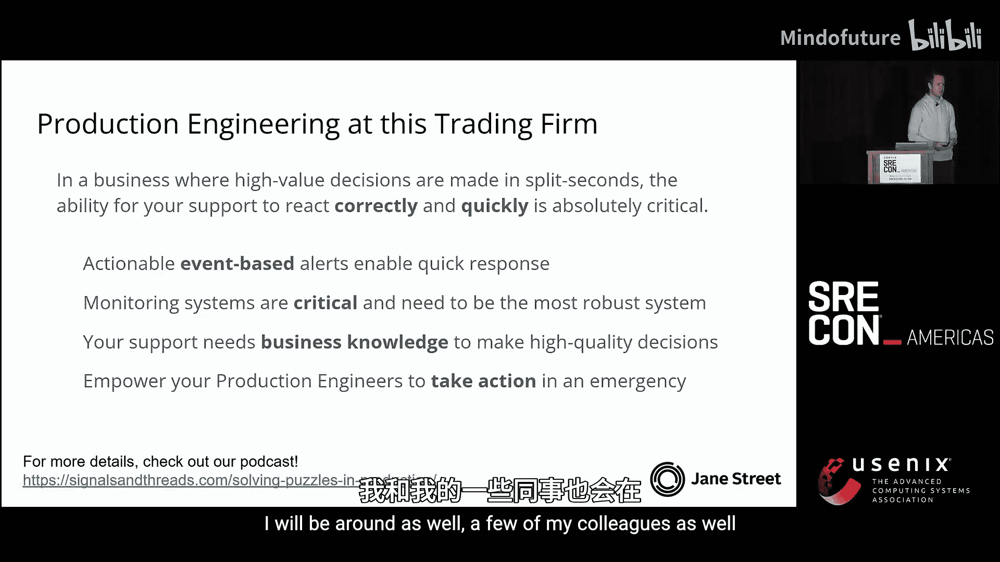
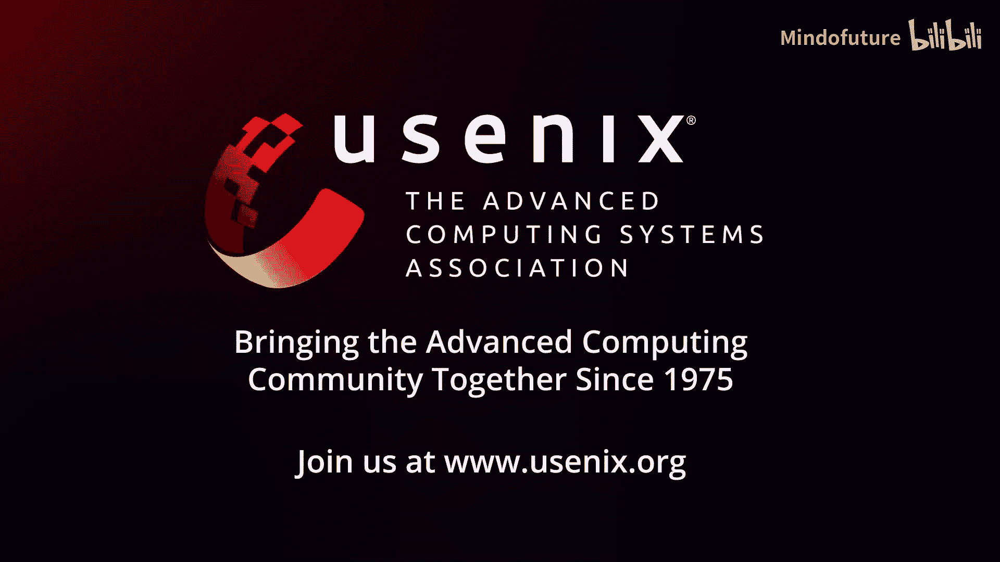

# 033：日交易数十亿美元时的生产工程 🏦

在本教程中，我们将学习在高频交易环境中，如何构建和维护高可靠性的生产系统。我们将通过分析真实世界的重大事故，探讨监控、告警、事件响应以及团队文化等核心概念，以确保在日交易额巨大的金融业务中避免灾难性损失。

## 引言与背景

大家好，我是 Pedro，来自 Jane Street 公司。我们是一家在全球市场交易金融产品的自营交易公司。本次分享将概述我们在此类环境中如何进行生产工程，以及我们如何看待可靠性问题。

在深入技术细节之前，我想先讲述一个真实发生的事件。

## 事故案例分析：Knight Capital 事件

2012年8月1日，当时美国最大的交易公司之一 Knight Capital 试图将更新版本的交易系统部署到生产环境。

在旧版本系统中，有一段代码已闲置数年且未得到妥善维护，其中包含一些错误。由于启用该段代码的指令未被使用，这些错误无关紧要。然而，在新版本中，他们重新利用了该指令来指向一段希望启用的新代码。

升级当天，其交易系统套件中的一个系统未能成功升级，仍停留在旧版本。当东部时间上午9:30市场开盘后，这个未升级的系统开始执行那段包含错误、已被弃用且无人理解的旧代码。

在接下来的45分钟内，该公司损失了4.6亿美元，对纽约证券交易所的股价造成了重大干扰，交易了超过3.9亿股公司股票，并积累了数十亿美元的非意向头寸。事故发生后，Knight Capital 的股价暴跌，大约四个月后被竞争对手收购。

虽然事后看来，这似乎是明显的软件工程失误，但其中也包含一些诚实的错误，例如遗留死代码或重新利用配置字段以避免复杂的版本迁移。然而，从生产工程的角度，我们可以得出几个关键教训：

1.  **交易极其危险**：在45分钟内轻易损失数亿美元，相当于每分钟烧掉超过1000万美元。
2.  **监控系统必须健壮且冗余**：Knight Capital 并非没有监控，但由于交易量激增，其监控系统本身开始落后，无法跟上。在你最需要监控时，它可能会失效。
3.  **告警必须清晰且可操作**：市场开盘前，关于那个未升级系统发出了97封告警邮件。如此多的噪音告警可能导致人员脱敏，从而忽略了真正需要采取行动的信号。
4.  **必须授权支持团队采取行动**：如果支持团队能在5分钟内意识到问题的严重性并有权采取措施（如关闭交易），损失可能仍然巨大，但或许不至于摧毁公司。

这些教训深刻影响了我们在 Jane Street 构建系统和实践的方式。

## 交易环境与技术栈概览

接下来，我们看看交易环境在高层次上是如何运作的。

一个交易者想要在市场上交易，例如纳斯达克，大致涉及三个逻辑组件：

1.  **市场数据**：交易者需要了解市场动态，即实时行情数据，用于驱动交易系统或供交易员分析，也可用于历史回测。
2.  **订单录入系统**：交易者决定下单后，需要一种方式将订单发送到交易所。这包括下单、改单、撤单以及接收成交回报。
3.  **头寸与簿记**：需要跟踪实际交易的头寸，用于会计、监管报告等目的。作为交易公司，我们有责任遵守严格的合规标准。

本次分享将主要聚焦于中间的**订单录入系统**，因为它是连接内部系统与外部世界的边界，也是防御问题的最后一道防线和感知外部问题的第一道防线。

### 订单是什么？

一个订单是指令，用于以特定价格、特定数量买入或卖出某种金融工具。其基本元素包括：
*   **方向**：买入 (`BUY`) 或卖出 (`SELL`)
*   **数量**：交易多少单位
*   **代码**：金融工具的标识符
*   **价格**：交易价格
*   **货币**：计价货币

想象一下这些元素中任何一个出错：方向反转、数量错误、货币单位弄错，都可能导致灾难性的交易错误。

## 另一个警示故事：日本“胖手指”事件

2005年12月8日，日本一家大型券商的交易员试图发送一个订单：以60万日元的价格**买入1股**J-Com公司的股票。

不幸的是，他输错了指令，变成了：以1日元的价格**卖出60万股**J-Com股票。

这一个打字错误，最终导致该公司损失超过270亿日元（约合当时的2.23亿美元），并导致日经225指数因此单笔订单下跌近2%。更糟糕的是，交易员试图撤单，却因东京证券交易所系统的故障而未能成功。

这个故事的启示是：
*   **每一笔订单都至关重要**。
*   **交易所等外部世界的问题也会直接影响你的交易能力**。

这些真实事件驱动着我们内部进行改进，有时我们称之为“事件驱动开发”。

## 技术问题分类：故障与中断

在技术层面，我们面临的问题大致分为两类：

1.  **故障**：订单中的错误可能立即转化为灾难性损失。在自动化交易中，小错误会以远超人类的速度迅速累积成巨大损失。
2.  **中断**：故障可能导致中断，而我们对故障的响应（如关闭交易）本身也会造成中断。

交易中断的后果不仅仅是机会成本损失，还包括：
*   **关系损害**：依赖我们进行交易的交易所和机构对手方，在我们中断时可能转向竞争对手。
*   **监管关注**：作为大型市场参与者，中断会给整个系统带来压力，可能招致监管机构的审查、罚款甚至暂停交易资格。
*   **增加风险与成本**：如果交易策略持有大量头寸并计划在未来对冲，交易中断会阻止对冲操作，从而主动增加公司风险。

此外，一个关键点是：**高影响、高风险场景通常与系统高负载正相关**。市场繁忙时，系统负载更高（更容易出问题），同时头寸更大、交易价值更高（出问题成本更高），形成了一个负反馈循环。

## 交易领域的独特性

交易环境与其他科技公司相比有一些独特之处：

1.  **时间依赖性**：市场有明确的开盘和收盘时间（如纽交所9:30-16:00）。这意味着：
    *   开盘前有一个“无影响缓冲期”，可以修复问题。
    *   开盘和收盘时段价值最高，也最需要确保系统稳定。
    *   虽然有些市场（如衍生品、加密货币）交易时间更长，但股票市场目前仍遵循此模式。

2.  **技术微调与低延迟**：我们采用**托管服务**，将服务器部署在离交易所最近的数据中心，甚至同一个机柜内。这是因为光速限制下，几纳秒的延迟差异在高速竞争性市场中至关重要。这要求我们使用大量定制硬件和自研软件，优化部署。

3.  **业务高度复杂**：金融产品、不同市场（美国、欧洲、亚洲）的规则差异巨大。我们的用户（交易员）是领域专家。事件响应高度依赖于具体的交易上下文。有时，部分恢复（如恢复20%功能）可能实现90%的价值，支持人员需要具备业务知识来做出高质量决策。

## 监控策略：技术健康与交易影响

监控在这种环境中不是可选项，而是必需品。我们宁愿关闭大部分交易系统，也不会在没有监控的情况下运行。

我们将监控大致分为两类：

1.  **技术健康监控**：关注软件和硬件的运行状态（内存、CPU、网络延迟、丢包率、订单发送能力等）。这主要由工程师负责。
2.  **交易影响监控**：关注系统是否发送了预期的订单、累积的盈亏、市场对交易的响应等。这主要由交易员负责。

两者对于评估是否即将犯下大错都至关重要。本次分享主要聚焦技术健康监控。

### 订单流与监控挑战

在订单录入系统中，基本的消息流包括：发送订单、取消订单、接收成交回报（包括确认、拒绝、成交）。

基于SLO的监控在此面临挑战：
*   **可用性SLO**：任何停机都可能立即需要关注并引发监管审查，简单的“99.99%”可用性指标不够。
*   **错误率SLO**：虽然比可用性稍好，但任何订单被拒绝都可能影响关键时刻的操作能力。
*   **延迟SLO**：平均或高分位延迟是问题的前兆。但**尾延迟**在高速交易中同样关键，因为策略可能建立在微秒级响应的假设上。

### 我们的方法：基于事件的告警

对于实盘交易监控，我们更多地依赖**基于事件的告警**。前提是这些告警必须是高质量的、非噪音的、且始终可操作的。

这种方式的好处包括：
*   **高细节度**：直接了解发生了什么错误。
*   **快速定位**：告警可直接链接到引发错误的代码位置。
*   **快速响应**：为支持团队提供最快的事故反应能力。

我们仍然使用基于指标的告警来观察长期健康趋势（如内存使用增长），但它们不用于触发需要立即关注的交易事件。

## 支持轮值与事件响应流程

以支持美国交易所订单流连接的纽约工程师为例：
*   **交易时间**：9:30 - 16:00。
*   **支持班次**：通常分为9:00-13:00和13:00-17:00两班，跟随太阳周期与全球办公室协作。
*   **频率**：工程师大约每4-6周轮值一次。在非事件处理期间，他们可以进行项目工作。

当遇到事件时，标准流程如下：
1.  **评估影响**：确定发生了什么、影响范围（哪个交易台、哪种工具、哪个市场）。
2.  **评估严重性**：估算损失金额，通常需要与交易员协作。
3.  **寻求专家**：如果无法自行解决，立即寻求主题专家的帮助。
4.  **沟通与行动**：大声沟通你的行动，因为任何操作本身都可能带来风险。
5.  **修复与迭代**：实施修复，并重复直到问题解决。

### 一个虚构的响应示例

1.  **9:30**：市场开盘。我们观察到仅在纳斯达克交易所出现订单拒绝。
2.  **初步结论**：影响仅限于该交易所。进一步发现，拒绝都来自一个特定的交易系统，且只涉及部分美国ETF。
3.  **联系交易台**：确认该交易台的所有订单都无法发出。
4.  **主动暂停交易**：立即暂停该系统的交易功能，防止更多错误订单发出或造成网络拥堵。同时通过内部广播系统通知所有交易用户。
5.  **深入调查**：发现该系统最近刚升级了新版本，消息格式有变更。
6.  **解决方案**：与专家讨论后，决定回滚该系统。
7.  **恢复**：大约5分钟后，系统恢复在线。

从发现事件到暂停交易缓解影响可能只需几分钟，再到完全解决可能在十分钟内。事后需要进行复盘，分析总成本、变更流程、能否通过灰度发布更早发现问题等。

## 团队文化：无责复盘与心理安全

当出现问题时，很可能有人犯了错误。我们坚信在进行复盘时，应采用**无责文化**。

我们努力营造一种**隐藏错误比犯错更糟糕**的文化。金融史上充满了“流氓交易员”的例子，他们为了掩盖一个小错误，进行更冒险的交易，最终导致巨额损失甚至公司破产。

在我们公司，当你犯错时，重要的是能够举手说：“我搞砸了，我们一起修复它。”十有八九，严重问题的根源不是单个人的失误，而是流程上的缺陷，是系统允许这个错误发生。

这种文化需要反复灌输和实践。它对于建立心理安全、鼓励透明沟通至关重要。

## 生产工程项目与工具

最后，我们看看生产工程师会构建哪些工具来提升能力：

1.  **连通性监控仪表盘**：一站式查看所有交易所和交易伙伴的连接状态、交易金额、消息速率、延迟等信息。更重要的是，能够直接从该界面执行操作，如连接、断开或暂停特定交易所的交易。
2.  **性能基准测试工具**：由于使用大量定制硬件，我们需要工具在特定硬件上自动定义和运行任意测试，确保系统性能符合预期。
3.  **全局交易暂停服务**：集中管理哪些交易功能被启用或禁用，并清晰记录原因。当交易员询问为何无法下单时，可以快速给出解释并提供更多详情链接。支持团队也能从此界面高效控制交易状态。

## 总结与核心原则

在本教程中，我们一起学习了在高频交易这一价值决策以分秒计的业务中，如何构建可靠的生产工程体系。

核心原则总结如下：
*   **快速正确响应至关重要**：我们通过使用**可操作的、基于事件的告警**来实现快速响应，这些告警必须提供高细节度信息。
*   **监控系统是关键且必须最健壮**：我们视监控系统为关键基础设施，其可靠性必须最高。我们宁愿先关闭交易系统，也不愿在监控失效的情况下运行。
*   **支持人员需要业务知识**：赋能支持团队，让他们掌握足够的信息以做出高质量的现场决策，减少不必要的升级耗时。
*   **授权支持团队在紧急情况下采取行动**：支持工程师应被授权在感到风险时做出决策，而不必总是等待升级。

在这样一个每分钟都可能损失千万美元的行业里，这些原则是保障生存与成功的基石。