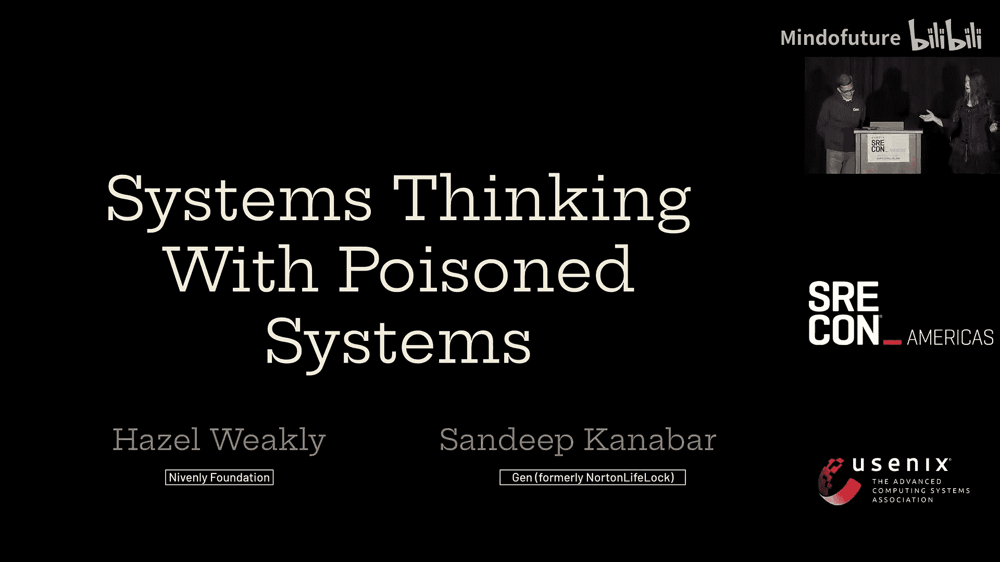
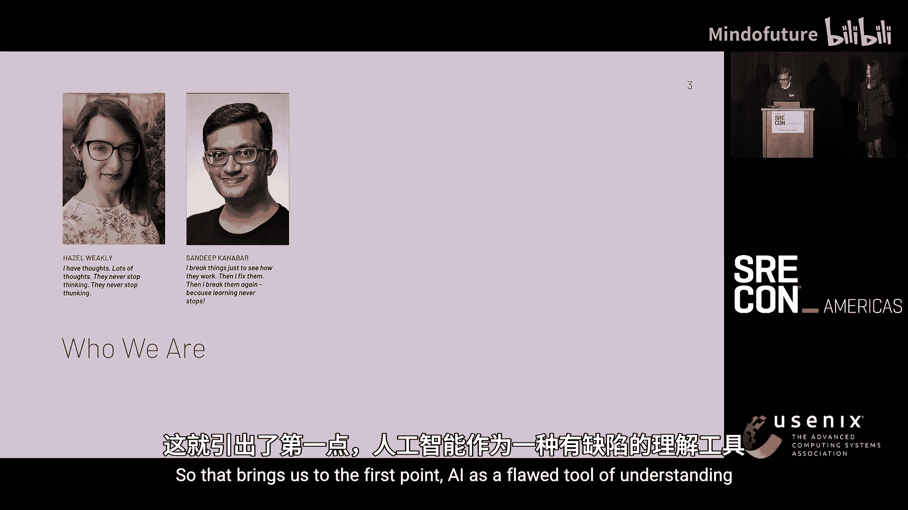
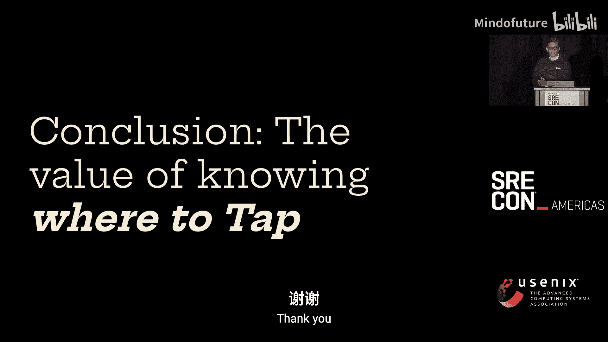
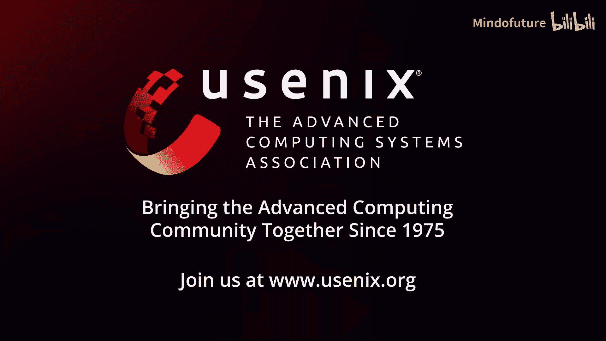

# 034：系统思维与“中毒”系统 🧠💀

在本节课中，我们将探讨在系统监控和运维中引入人工智能（AI）工具后，可能面临的独特挑战。我们将学习“中毒系统”的概念，理解AI作为工具的局限性，并讨论如何运用系统思维和韧性工程原则，在复杂且可能具有误导性的环境中保持有效运维。

---

## 引言：当系统变得“有毒”

大家好，我是Dan Deep。今天我们将讨论“系统思维与中毒系统”。

我是Niberley基金会的研究员，同时也是CNG基金会Defaf和Hard He工作组的成员。这位是Cindy，她是一名软件工程师，拥有丰富的SRE实践经验。

我们经常需要处理故障系统。但今天，我们要讨论的是处理那些不仅“坏了”，而且可能具有“误导性”的系统。想象一下，当你查看监控面板和日志时，根本原因被层层自动化所掩盖。现在，再把AI引入这个混合体。

AI承诺帮助我们更好地理解系统、检测异常甚至预测故障。但如果AI是基于不完整或被“污染”的数据进行训练的呢？我们常听说“垃圾进，垃圾出”。但当运维系统开始依赖AI时，我们得到的是黄金，还是介于两者之间的东西？这引出了我们的第一个核心观点。

---

## AI是一种有缺陷的理解工具 🤖⚠️

上一节我们提出了AI可能不可靠的观点。本节中，我们来看看为什么AI本质上是一个有缺陷的理解工具。

AI驱动的监控和调试工具并不能真正理解系统。它们只是基于历史数据寻找模式。在SRE领域，我们使用工具来监控和优化系统，但功能强大的工具也带来了新挑战：它们不仅反映现实，也在塑造现实，有时甚至会误导我们。

AI模型从数据中学习。如果数据本身有问题——无论是由于错误、不一致还是人为操纵——那么AI得出的结论也将是错误的。当我们盲目相信这些有缺陷的AI输出时，就会做出错误的决策。

**核心公式**：`有缺陷的训练数据 -> 有缺陷的模型 -> 有缺陷的决策`

AI并不理解它所要照看的系统。它只是基于数据模式进行概率性猜测，而非真正理解因果关系。

在本节接下来的部分，我们将探讨三个突显AI局限性的关键问题。

以下是三个主要问题：

1.  **数据污染**：AI依赖历史数据。如果数据不准确、不完整、有噪声或有偏差，模型就会学到错误的东西。数据污染可能是无意的（例如，本应标记为“正常”的系统状态被错误标记为“异常”），也可能是有意的恶意攻击。一旦数据被污染，基于此训练的AI模型就会输出错误结果，而这些错误结果又可能成为后续模型的训练数据，形成恶性循环。更危险的是，如果AI系统从未见过真正的故障，它可能会假设这种故障根本不存在，从而错过真实的关键故障。
2.  **AI偏见**：AI模型会强化训练数据中的模式，而不会质疑这些模式是否应该被使用，或者是否公平地代表了整体情况。由于AI从历史事件中学习，它并不总能捕捉到现实世界的全部复杂性。例如，一个AI驱动的修复系统可能会优先采用过去的解决方案，即使该方案是错误的或次优的（比如因为CPU飙升就建议重启服务，而重启可能导致更严重的全面中断）。AI也可能低估新型故障的重要性，因为它没有针对新基础设施（例如服务网格）进行训练。
3.  **AI相关的技能退化**：这是一个正在发生的概念。当人类过度依赖自动化工具时，可能会失去某些高级技能和机构知识。这就像一个小镇上的手语逐渐被遗忘一样。在SRE领域，如果我们盲目遵循AI的票单而不加思考，我们可能会丧失关键的系统性思维和故障排查能力。

总而言之，AI不是一个可靠的决策者。它是一个需要持续学习和人工监督的工具。讽刺的是，它有时非但没有简化故障排除，反而增加了复杂性。

---

## 实践中的挑战：当AI“自信地”犯错 🧪

上一节我们从理论层面探讨了AI的局限性。现在，我们通过一些实际例子，看看这些挑战在现实中是如何体现的。

让我从一个故事开始。有一次，我需要使用一个团队都不太熟悉的工具来完成一项任务。我向同事求助，他给了我一个命令行参数建议。这个参数看起来完美地解决了我所有问题，这让我觉得“太巧了”。结果执行时，系统提示“无法识别的标志”。我回头问同事，才发现这个建议是他从AI聊天工具那里得到的未经核实的输出。这引出了一个深刻的问题：我们为什么会盲目相信从互联网（或AI）上得到的任何东西？

以下是几个具体的案例：

*   **案例一：缺失文档的困境**：在Google Cloud环境中，一项新的“软删除保留策略”没有官方的Python SDK文档。我向AI工具求助，它“自信地”给出了多种方法，但这些方法循环往复，均不奏效，浪费了大量时间。最终，我通过查阅源代码和测试用例，找到了正确的API调用方式，再让AI基于此生成代码，才成功解决问题。这说明AI在缺乏训练数据的领域能力有限，需要人类的引导和验证。
*   **案例二：隐藏的偏见与错误假设**：如果你让AI生成一张“用左手写字的人”的图片，它很可能会生成用右手写字的人像。另一个例子是签证查询：AI可能错误地断言“持有美国签证的印度公民不能在加拿大转机”，而实际上这是可以的。你需要不断纠正它。在系统层面，我们有一个Cassandra集群通常运行在90%的内存使用率（这是其设计使然，性能正常）。但引入的AI系统却断定其“性能糟糕”，因为它基于“高内存使用率等于问题”的通用假设。
*   **案例三：脱离上下文的“优化”**：我们曾让一位新同事优化一个Elasticsearch系统。他使用AI工具生成了非常详细、看似专业的优化方案。然而，他并不了解业务背景：这个系统已被标记为“仅维持生命”，目标是将每月成本从12，000美元降至4，000美元，且**不能进行新的开发或重大维护**。我采取的方案是调整索引策略（例如，将日索引合并为月索引，再合并为年索引），在不改动应用逻辑的前提下显著降低成本。而AI工具在没有此上下文的情况下，给出的建议很可能是“过度优化”或方向错误的。

这些例子表明，AI驱动的可观测性、告警和事件响应工具仍在演进。AI的建议正变得越来越难以挑战，因为许多组织依赖自动化决策。但正如我们所说，你需要的是“人在回路中”，而非完全自主的系统。

---

## 解决方案：系统思维与韧性工程 🛡️🔧

面对可能“中毒”的系统和有缺陷的AI工具，我们该如何应对？本节我们将探讨如何运用系统思维和韧性工程来构建韧性。

我们做的很多事情都关乎系统思维，其核心在于弄清楚如何做不显而易见的事，如何处理复杂事物并使其可运作。但当系统本身“坏了”、“有毒”时，你该如何进行系统思考？

这让我想起电影《公主新娘》中的一个场景：主角面对两杯毒酒时说：“不要犯傻，我两杯都下了毒。” 关键在于，与其试图避免所有错误，不如变得非常擅长“喝下毒药”。在一个不完美的世界里，没有完美的系统。AI也好，中毒也罢，重点在于变得善于在问题中前行。

一个韧性系统是“社会技术性”的，它包含人、工具、应用程序、计算机以及它们之间的交互。韧性不仅仅关乎正常运行时间或MTTR。韧性是关于能够利用现有条件，在系统发生问题时仍能持续推进的能力。

我们从不盲目信任自己的代码，也不会毫无保留地信任同事的代码。我们会验证、检查、思考。我们对工具也应如此。工具本身需要具备韧性，而我们使用工具的过程和方法也需要具备韧性。

人类理解世界的方式很特别：我们观察环境，并构建工具来帮助我们理解环境。然后，我们迭代这个过程：学习工具、根据自身上下文调整工具、改进工作流程。这就是工具的进化，也是我们传授系统思维和故障排查的方式（例如，“遇到问题先检查DNS”这样的流程图）。

现在，如果工具（AI）本身有点模糊、不稳定、不可预测，我们只需将这一特性纳入我们的流程和思维中。以“黄金信号”为例，传统的信号是延迟、流量、错误和饱和度。在AI时代，这些信号可能变形为令牌速率、上下文丢弃、模型运行状况等。但**万变不离其宗**。形式不同，本质相同。

系统思维从来都是混乱且人性化的。你为了理解事物而构建的工具总是摇摇晃晃、脆弱的。你的系统越复杂，你就越需要能够解释你的工具如何工作。这个过程一直都很混乱，将来也是如此。

这里有一个著名的讽刺，即“自动化的悖论”（一篇1970年代的论文）：你自动化得越多，系统越好，但运行它所需的人却需要懂得更多、更精深。就像从可以手动修理的简单汽车，进化到需要大量专业设备和知识的现代汽车。事物越复杂，工程师就需要越能适应并与之共事。

关键在于，你必须将整个系统作为一个整体来思考。

---

## 总结与启示：培养更好的工程师 🧑‍🔬🚀

在本节课中，我们一起学习了在SRE实践中引入AI工具后可能面临的“中毒系统”挑战。

我们探讨了AI作为理解工具的三大缺陷：数据污染、AI偏见和技能退化。我们通过实际案例看到，AI会“自信地”犯错，尤其是在缺乏上下文或训练数据的领域。最后，我们指出，解决方案在于回归系统思维和韧性工程的核心——接受不完美，将AI视为需要人类监督和引导的工具，并持续培养工程师深入理解系统和批判性思考的能力。

让我用一个关于“999美元的故事”来结束。一艘船的引擎坏了，许多专家都无法修复。最后请来一位老师傅，他用锤子在一个地方敲了两下，引擎就恢复了。他开出的账单是：敲一下值1美元，知道敲哪里值999美元。

这个故事对SRE工程的启示在于：未来不在于构建更好的锤子（工具），而在于培养**知道敲哪里的更好工程师**。面对“中毒”的系统和AI，深厚的系统知识、批判性思维和适应能力，才是我们最宝贵的资产。

---

