# 035：应对DevOps团队过载的实用指南 🚀

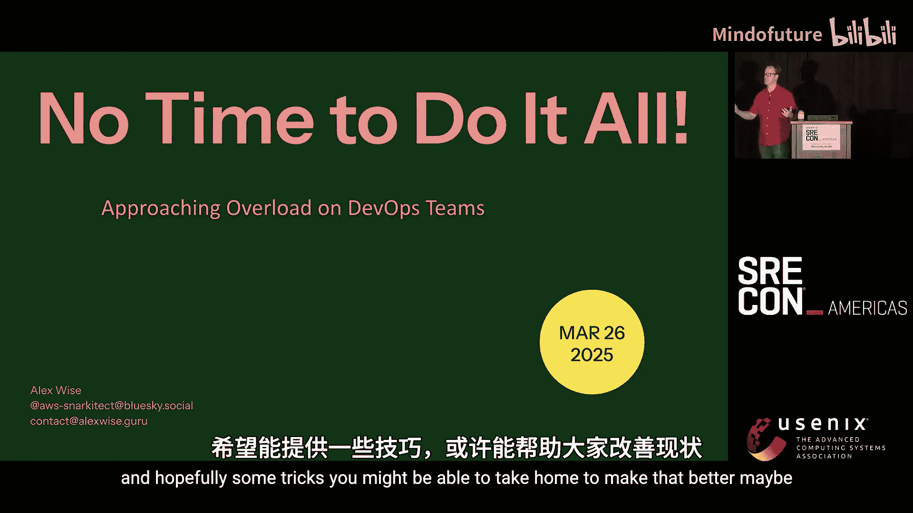

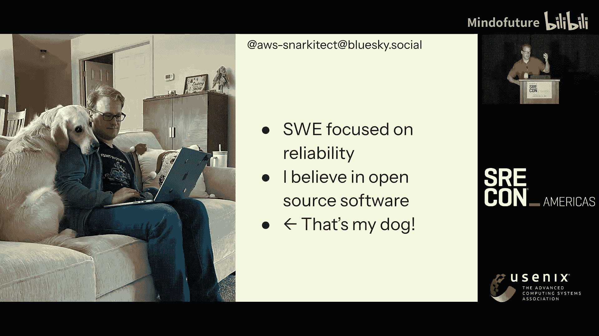

在本节课中，我们将要学习如何识别和应对软件团队中常见的工作过载状态。我们将探讨过载产生的原因，并介绍一些实用的策略来改善这种情况，帮助团队更高效、更从容地工作。

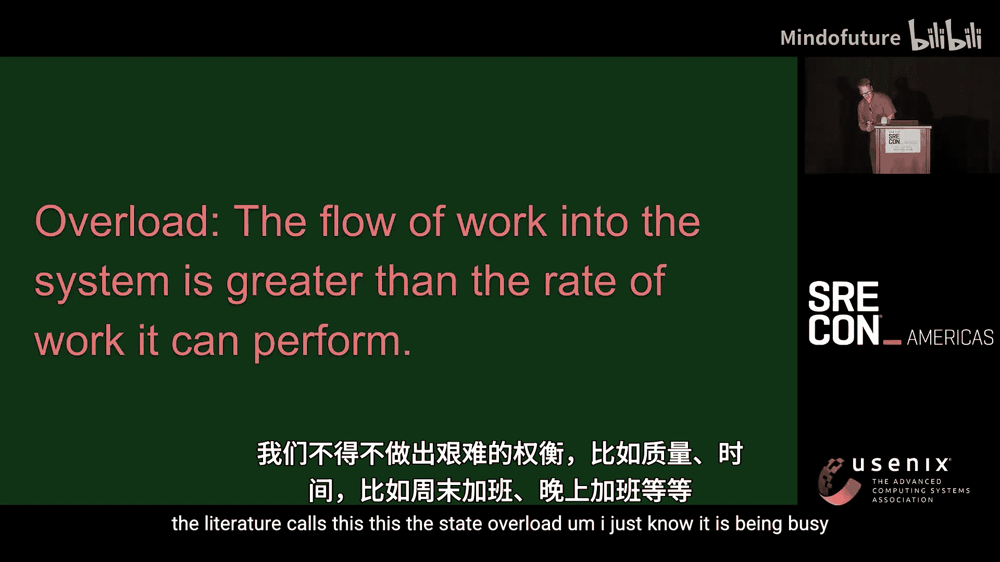

---

## 引言：无处不在的过载状态

我是Alex Wise。本次演讲的主题是“没有时间做完所有事”，主要讨论软件团队中那些工作多得无法及时完成的情况。我们将思考这种情况为何会发生，并希望提供一些可以带回家的技巧，或许能让情况变得更好。

我在社交媒体上很活跃，喜欢与人交流。我长期专注于可靠性的软件工程师工作，经历过从初创公司到大型企业的各种环境。

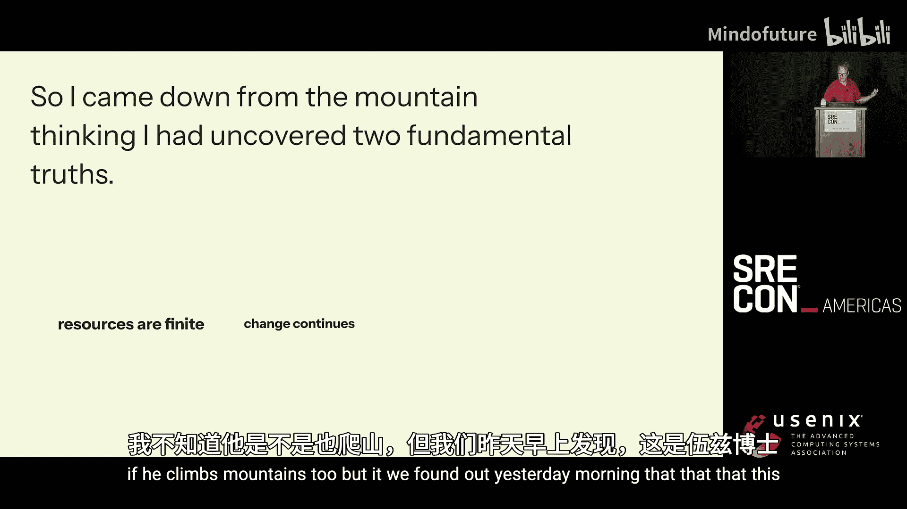

这是我的狗Clover。它也喜欢响应事件——当然，仅限于食物掉在地上的时候。在我工作过的所有地方，我经常看到或亲身经历团队面临的工作量超出我们实际能及时完成的情况，我们不得不就质量、时间安排、周末或夜间加班等问题做出艰难的权衡。

文献中将这种状态称为“过载”，而我更习惯称之为“忙碌”。

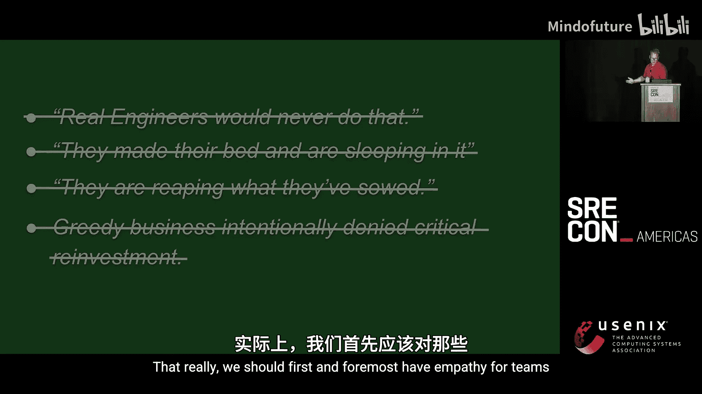

如果你曾在软件团队中经历过忙碌，请快速鼓掌示意。是的，我认为这非常普遍。这种状态不仅令人不适和沮丧，如果持续时间过长，还会产生有害的影响。

以去年的CrowdStrike事件为例，它指出了我们常见的生产压力：交付的压力、质量与修复之间的艰难权衡、中断性工作等等。过载状态非常普遍，并且长期处于其中可能相当糟糕。

因此，我希望能深入探讨其发生的原因，并找出一些改善的方法。

---

## 理论基石：适应性宇宙与过载响应

我首先尝试在网络上寻找答案，但未能找到立竿见影的解决方案。于是，我决定反思自己作为软件工程师的经验。

经过思考，我得出了关于世界的两个基本真理，我称之为“Alex的真理”：
1.  **资源是有限的**：我们的时间、金钱、精力和注意力都是有限的。
2.  **变化是持续的**：世界在不断变化和移动，我们必须适应和响应。

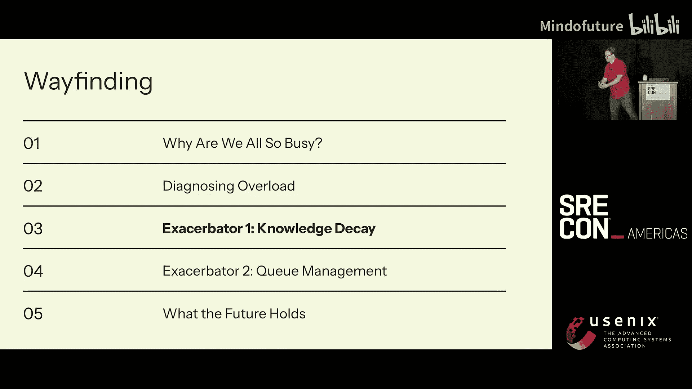

后来我发现，这实际上与David Woods博士的“优雅可扩展性理论”不谋而合。该理论认为，随着世界的变化，我们必须适应，并且不可避免地会触及时间、资源、精力和注意力的极限，从而感到不适和过载。

这个理论帮助我们理解，当讨论技术债务或造成实际影响的故障时，我们不应首先指责团队，而应抱有同理心。因为根据适应性宇宙的观点，系统有时会自然地处于过载状态。这也论证了我们需要高效利用资源的重要性，以便在需要适应变化时，能更快速地摆脱过载。

然而，这个理论没有完全解答我的疑问：如何区分过载带来的痛苦和其他原因造成的痛苦？

Woods博士在《实践认知系统工程》一书中提供了一个框架，阐述了系统面对过载时的四种可能响应方式：
1.  **卸载**：不做某些工作。
2.  **降低彻底性**：草率完成工作。
3.  **时间转移**：稍后再做。
4.  **招募资源**：引入帮助。

通常，后两种（时间转移和招募资源）能在我们的系统中产生更积极的结果，但它们需要预见性、规划和资源成本。

这个框架同样适用于由人和机器组成的“联合认知系统”，例如你的软件交付团队和他们处理的JIRA工作队列。如果我们反复听到“为什么这个变更没提交？”或“我们不是说几个月前就修复这个吗？”，这可能表明团队正在用过载的方式响应。同样，当团队使用积极的、基于计划的响应方式时，我们应该予以庆祝。

---

## 深入分析：知识衰减与系统僵化

为了理解我们自身的行为是否会加剧或改善过载，我建立了一个简单的软件团队模拟模型。

我们模拟一个由4名工程师维护的单一服务。第一年编写15万行代码，之后不再添加新功能，但会模拟人员流失。我们引入Bug：每X行代码会产生一个Bug，修复时间取决于代码作者是否在职。

我们测量的是**每年用于修复固定数量Bug所花费的小时数**。模拟结果曲线显示：
*   **第0年**：上下文清晰，修复迅速。
*   **第1-3年**：随着原始作者离开，修复相同数量Bug所需时间逐年增加，团队明显感到过载压力。
*   **第4-6年**：时间消耗稳定在高位，系统陷入一种僵化但可预测的“混乱”状态。

如果我们将每年的修复时间上限设定为第0年的水平（例如1500小时），那么被修复的Bug数量会大幅下降，而Bug积压则会无限增长，形成“无尽的待办事项清单”。

我将这种现象称为**知识衰减**：随着对系统认知的退化，我们适应变化世界的能力、系统的弹性都会受到影响，事物趋于僵化。鉴于软件构建的经济性，我们遭遇这种情况的频率可能超出预期。

那么，如何应对知识衰减？

**1. 保留员工**：尽可能保留员工是超级能力，但并非总能实现。
**2. 在编写代码时共享知识**：我们之前的模型假设每行代码只有一个作者。如果采用**结对编程**，让多人同时拥有代码上下文，结果会大不相同。模拟显示，结对编程能显著延缓知识衰减的速度，直到所有原始作者都离开。
**3. 主动进行系统迁移**：如果我们在第4年决定重写一半的代码库（例如将旧架构迁移到Kafka），修复时间会大幅下降，相当于“重置了时钟”。这让我想起了Will Larson关于“技术债务唯一可扩展的修复方法是迁移”的论述。

主动迁移需要锻炼一系列组织能力：
*   **识别迁移目标**：问“如果我们明天重写这个，它需要做什么？”，而不是“这个怎么工作？”。
*   **建立共识**：决定具体做什么（例如，迁移到Kafka还是更换数据库）。
*   **降低风险**：分阶段、小步快跑地进行，减少对客户的影响。
*   **向业务方推销**：不能只做简单的投入产出分析，需要构建让业务方能理解的变革叙事。

**4. 打破“谁碰谁负责”的文化**：在受知识衰减困扰的系统中，容易形成“谁碰了出问题的代码谁就有责任”的文化，导致无人愿意接触晦涩难懂的部分。这会使系统知识加速流失。
应对方法包括：
*   **明确所有权**（必要但不充分）。
*   **举办午餐学习会**，鼓励分享晦涩系统的知识。
*   **调整奖励机制**，表彰那些梳理和理解遗留系统的贡献。
*   **资深工程师带领新人**一起探索代码库，重建认知脚手架。

---

## 流程优化：队列理论与在制品限制

那个不断增长的待办事项清单也让我想起了Donald Reinertsen的《流》一书。他将软件团队建模为数学队列（如M/M/1队列），并得出了两个对本次演讲至关重要的见解：

**1. 不要使容量饱和**
当团队利用率达到100%时，吞吐量会骤降，工作完成时间的变异性（不可预测性）会急剧上升。实际上，当利用率达到约75%时，这些负面影响就开始显现。因此，让团队避免过载不仅有文化或安全上的理由，也有强大的经济学理由——过载的团队表现会更差。

**2. 批次大小很重要**
大型工作批次（例如更换整个公司的身份提供商项目）会带来指数级增长的交货时间、更高的变异性，并且具有自我强化的特性——一个团队的大批次工作会导致依赖它的其他团队也形成大批次，问题在整个组织中传播。

为了应对这些问题，Reinertsen和其他人提出了**在制品限制**的概念。设定团队同时进行的工作数量上限，有助于改善那1%的、无故耗时极长的“尾部延迟”工作。设定WIP限制的方法有多种：
*   **Reinertsen方法**：设为平均WIP水平的两倍。
*   **约束理论**：针对最大瓶颈设置全局速率限制。
*   **避免利用率陷阱**：任务数少于“处理者”（工程师）数量。

过载不仅发生在团队层面，也发生在组织层面。John Cutler的“组织在制品”关系图展示了WIP上升如何导致吞吐量下降、学习速度变慢、士气低落、错过截止日期，进而引发仓促招聘，最终又反馈回WIP的上升。这个关系图也表明，组织层面的过载也会表现出“卸载”、“招募资源”等响应模式。

---

## 总结与回顾

本节课中，我们一起学习了如何理解和应对DevOps团队的工作过载状态。

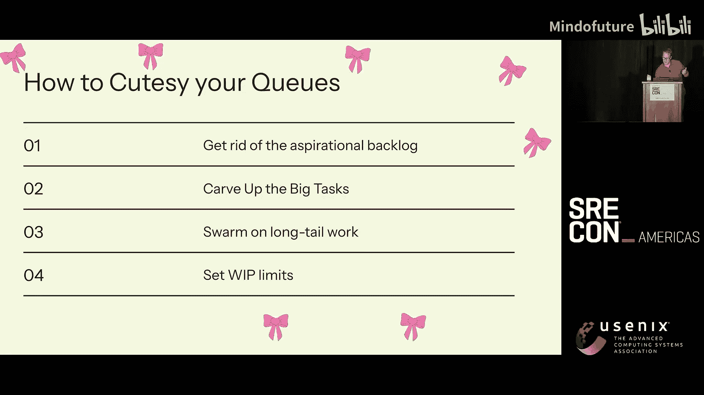

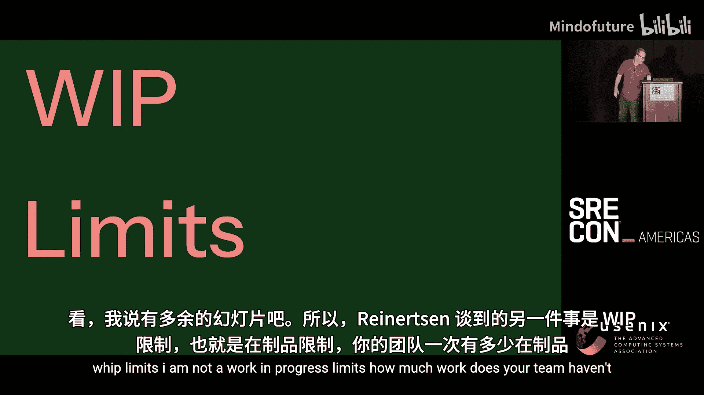

我们首先从David Woods博士的理论出发，理解了过载是系统在有限资源下适应持续变化的自然状态，并学会了识别系统对过载的四种响应方式。

接着，我们通过模拟发现了“知识衰减”现象——即系统认知随时间退化导致维护成本飙升。对抗知识衰减的策略包括：尽可能保留员工、在编码时通过结对编程等方式共享上下文、以及**主动规划和执行系统迁移**以刷新团队知识。

然后，我们借鉴了Donald Reinertsen的队列理论，认识到让团队容量饱和（利用率100%）会严重损害效率，而**缩小工作批次大小**和**设置合理的在制品限制**是优化流程、缓解过载感的关键。

最后，我们看到过载问题会在组织层面形成复杂反馈循环，需要系统性的而不仅仅是英雄式的干预。

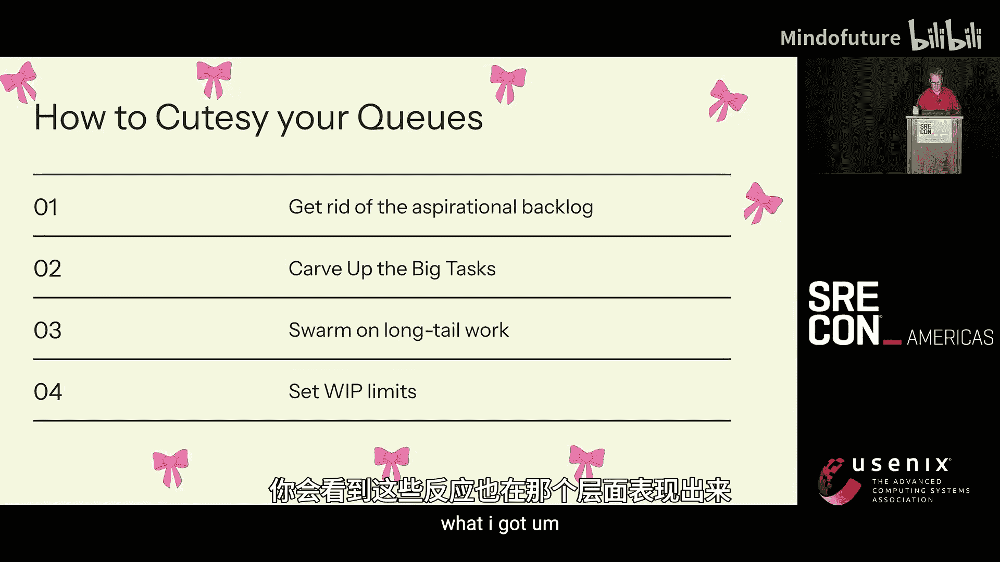

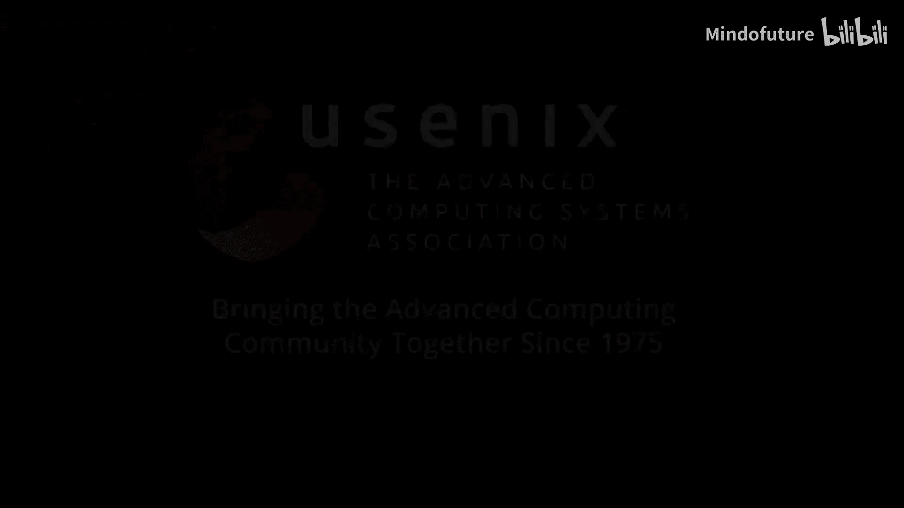

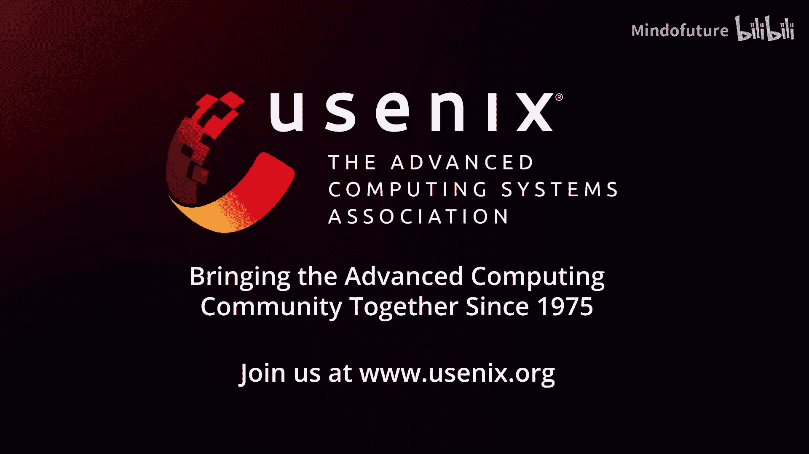

希望这些思路和策略能帮助你更好地诊断团队的过载状态，并采取有效措施，带领团队走向更可持续、更高效的工作节奏。