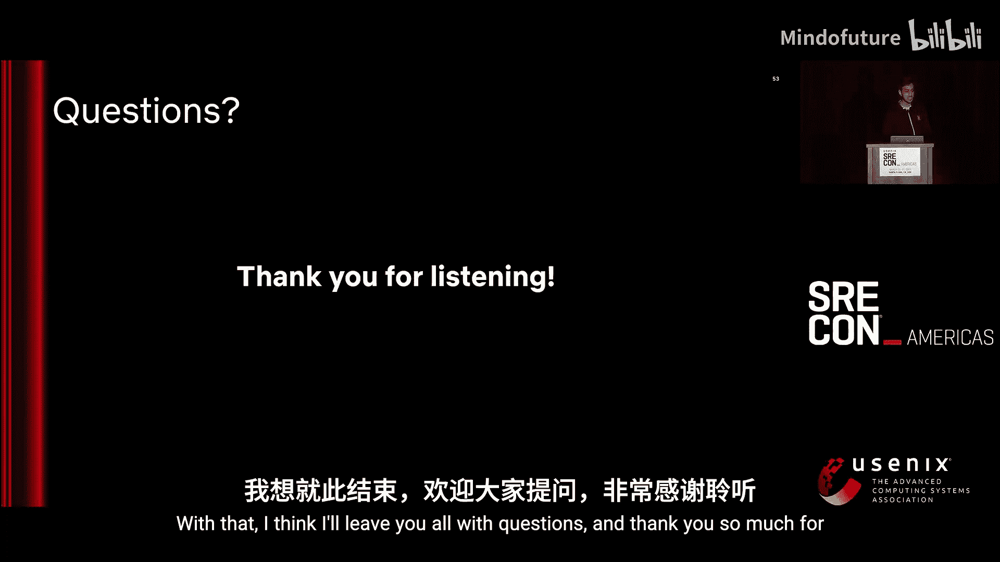
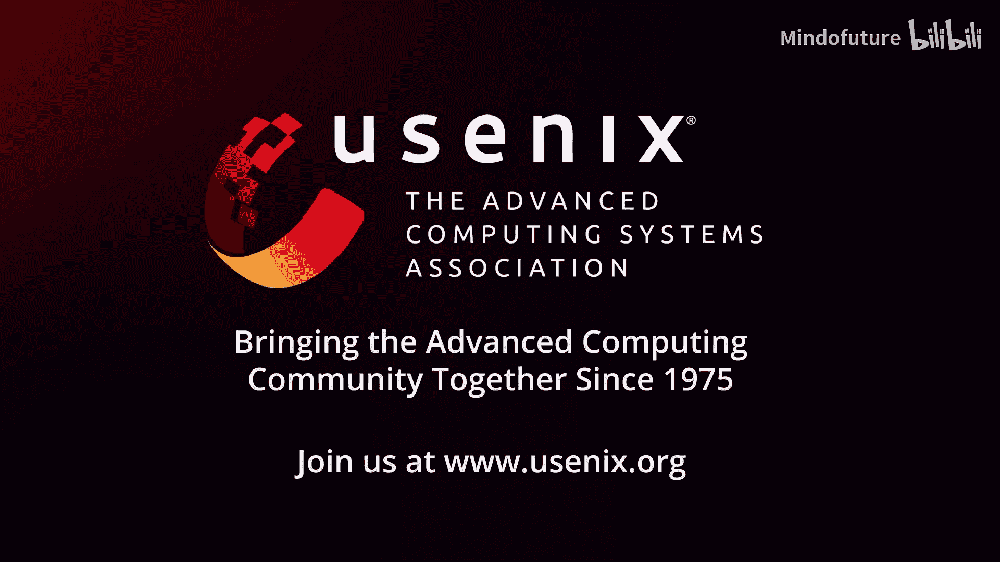

# 036：SRE大会-2025-美洲-｜-srecon-｜-分布式-｜-缓存-｜-OpenTelemetry-｜-安全-｜-AIOps-p36-P36-Securing-Distributed-Cache---Achieving-Secure-by-Default-with-Key-Challenges--BV1TmLDz7EZZ_p36-

## 课程概述：Netflix分布式缓存安全实践 🛡️

在本教程中，我们将跟随Netflix的工程师团队，深入探讨他们如何保障全球范围内每秒处理数百万请求的分布式缓存系统（EVCache）的安全，同时维持亚毫秒级的延迟。我们将学习其安全架构的核心组件、面临的挑战、真实事故分析以及从中汲取的最佳实践。

---

## 章节 1：EVCache 系统简介 🏗️

我的名字是Aash Steve Boyyle。我是Netflix分布式缓存平台的高级软件工程师。

与我一起的还有Shiam和Sam。我们共同管理着分布式集群，确保其安全运行，为流媒体、游戏、直播和广告平台每秒处理数百万次请求。

今天，我们将带您了解我们如何在保障这一切安全的同时，在全球范围内为每秒数百万次请求维持亚毫秒级的延迟。

让我们开始这次旅程。在这次旅程中，我还会分享一些关键挑战和见解，包括我们遇到的事件、如何处理它们，以及一些我希望大家都能带回去的经验教训。

左边是一个熟悉的界面。这是您访问Netflix.com时打开的页面。

右边是使这一切成为可能的调用关系图。

Netflix采用高度微服务化的架构。

有大量的微服务在协同工作，支撑着您在Netflix所做的每一件事。

例如，这个主页对于Netflix的每一位订阅者都是独一无二的。

为了实现这一点，有预计算的微服务和页面渲染微服务在发挥作用。

几乎所有这些微服务都处理着海量的数据，包括离线和在线事务处理。

在这些微服务链的最末端是数据访问层，它们由我们的分布式缓存EVCache在瞬间提供支持，这也是我们将要讨论的内容。

那么，EVCache到底是什么？EVCache是一个分布式、分片且复制的键值存储。

它是在Memcached之上内部开发的。

左边展示了一个非常简单的部署，显示了一个单写入器设置，应用程序可以存在于每个可用区。

默认情况下，我们优先使用本地区域的调用。但在故障回退的情况下，应用程序也可以跨区域访问。

EVCache支持区域内和全局复制。这意味着我们可以跨一个或多个可用区复制数据，也可以跨区域复制。

EVCache能够抵御故障。我们可以容忍一个节点宕机、一个可用区宕机，甚至整个区域宕机，这得益于我们健壮且有弹性的基础设施。

EVCache客户端是拓扑感知的。它确切地知道一个键应该存储在何处，并直接与该键所在的节点通信。在发生故障时，它知道如何回退到不同区域进行重试。

我们的整个基础设施是线性可扩展的，取决于客户端每秒的读写工作负载。

我们拥有健壮的缓存形成基础设施，确保当出现故障时，它们能够热启动并准备好供客户端使用。

看看我们运营的集群概览。EVCache在四个不同的区域运行：美国东部1区、美国西部2区、欧洲西部1区和美国东部2区。

我们运行着200个集群，涵盖22000台服务器，每秒处理4亿次操作，存储着2万亿个数据项，占用14.3PB的存储空间。

现在，我们将向您展示我们如何平稳地运行这一切。

让我们深入了解一下从客户端开始的示例数据流。

这是一个非常简单的流程，客户端访问Memcached，Memcached在高层上由监听器和工作线程组成。

监听器分配一个工作线程来处理请求，然后该工作线程访问Memcached存储。

存储部分我将在接下来的幻灯片中更深入地讲解，我们会运行哪些类型的存储，然后将请求返回给客户端。

这是Memcached存储的第一个版本，纯内存版本。在这种情况下，工作线程纯粹将键及其值存储在内存中。所有内容都驻留在内存中。

现在，这是一个更高效的设置，即Memcached的双混合模式设置。在这种情况下，热键是那些被频繁访问的键。

它们及其值纯粹驻留在内存中，而冷键或者说长尾数据，这些值被刷新到EX存储，即Memcached的基于磁盘的版本。

请记住，即使是那些值的键，为了快速访问和查找，它们仍然在内存中。

---

## 章节 2：客户端安全实现 🔐

现在您看到了大量数据通过不同渠道流动。这就引出了一个问题：这一切都安全吗？在安全至上的时代，对于每个Alice和Bob，我们都知道总有一个Eve或黑客在等待窃听和嗅探数据包。

那么我们如何安全地运行它？这就是TLS或传输中加密发挥作用的地方。

这是我们的集群如何安全运行的一个非常宏观的概述。在左边，您从客户端开始，客户端与内置SSL缓冲区的Memcached建立一个双向TLS通道，而Memcached又使用OpenSSL结构与Memcached工作线程通信。

现在我们将深入探讨客户端和服务器端的这些细节，讨论客户端如何融入这个图景。首先，我将邀请我的同事Shera，他将为您深入概述客户端方面。

谢谢，Akaash，很棒的营销策略。我也给大家五分钟时间，或许您可以再次拿起手机注册Netflix。Aash对EVCache做了很好的介绍。正如大家所知，EVCache有两个组件：EVCache客户端和EVCache服务器。

在接下来的10到15分钟里，我将从客户端的角度讨论安全方面。Sam将从服务器的角度讨论安全方面。

我的演讲将快速介绍什么是EVC客户端，它的最重要特性是什么，然后深入安全方面。让我们开始吧。

什么是EVC客户端？它是一个开源库。可以在Github上找到，如果您还没有，请去查看。EVC客户端用于从EVC服务器获取或设置数据。这里的EVC服务器是一组缓存节点。

EVC客户端最重要的特性是什么？它是一个“厚客户端”。厚客户端意味着所有优秀的分布式系统逻辑都存在于EVC客户端中。例如，可用性。区域内和跨区域的所有数据复制都是由EVC客户端完成的。

正如Akaash提到的，它是拓扑感知的，这意味着EVC客户端知道整个服务器拓扑，并且确切地知道从哪个服务器读取数据或向哪个节点写入数据。现在您可能会问一个问题：拥有厚客户端有很多优缺点，但您可能会问为什么选择厚客户端？实际上，这是默认设计的。

我们想要整个分布式系统逻辑要么存在于服务器端，要么存在于客户端。但我们更倾向于放在客户端，因为我们希望将EVC服务器上的内存专门用于获取和设置操作，以实现极高的性能。例如，对于每秒4亿次操作，我们希望服务器尽可能高性能。这就是我们将所有逻辑移到客户端的主要原因。

现在您可能会问，现在有这样一个厚重的客户端，这意味着设置必须尽可能高效。这里的效率是什么意思？例如，正如我之前提到的，EVC客户端知道整个服务器拓扑，这意味着我在这里举一个随机例子：一个拥有10个节点的EVCache集群在一个可用区中，客户端管理10个连接。如果我们进行复制，我们尝试至少有三个副本在区域内可用，这意味着客户端几乎有30个连接。对于整个设置，它必须尽可能高效。

我们在这里做的是，我们使用非阻塞I/O与Memcached节点通信，这样每个操作我们不需要等待每个操作完成。每个线程可以同时处理多个连接。

接下来是负载均衡。这又与我刚才提到的非常相关。正如我们提到的，EVCache客户端知道向哪里写入数据以及从哪里读取数据。整个负载均衡逻辑，我们基于键使用一致性哈希，并将数据路由到特定的服务器节点。整个负载均衡逻辑都存在于EVCache客户端中。

安全连接。让我们给安全连接一个特别的关注。

在深入安全连接之前，让我们从数据流开始。EVC客户端帮助我们实现从客户端到服务器的无缝且安全的数据移动。

这意味着它确保数据完整性，并防止未经授权的访问。我们通过SSL和TLS来实现。我们确保数据在传输过程中被加密，这样它就不能被拦截或窃听，从而保护数据。

数据防御。EVCache客户端采用全面的数据安全技术来保护数据。

如果您了解开源的EVC客户端，您可能会发现那里没有任何安全实现。原因是我们使用自己的安全实现，并且我认为将其开源没有太大意义。

因此，当我们在Netflix的不同应用程序中部署EVC客户端时，我们拥有开源的EVC客户端，并在其周围有一个包装器，其中包含所有安全实现。我们将整个库作为一个整体部署到所有应用程序中。

很好，现在让我们谈谈客户端在SSL/TLS加密中的作用。我们拥有所有这些安全措施的原因实际上是为了加密数据，使其永远不会被拦截，并且只能由授权方解密。

数据完整性再次至关重要，例如，您写入的内容就是接收到的内容，EVC客户端维护这种数据完整性。

认证。每当我们谈论认证时，我们主要关注服务器端，但客户端在SSL和TLS中也扮演着重要角色，因为它获取安全信息，传输所有安全信息，并且必须以非常高效的方式进行。它将安全信息传输给服务器。同样，我不会详细介绍每种情况的实现，我只是强调客户端在所有这三种场景中也扮演着同等重要的角色。但Sam将非常详细地概述我们如何做每一种情况。

很好，现在让我们谈谈，正如我之前提到的，安全实现是非常内部的，我们使用内部实现。这就是我们不开源的原因。因此，在这张幻灯片和未来的幻灯片中，我已经将内部实现拿掉，只采用了基本概念来说明：您有一个客户端，如何保护它，以及如何大规模部署它。以及您需要具备哪些要素。Netflix大量使用Java，这就是为什么我在这里以Java为例。但对于其他编程语言，构造或概念是相同的。

那么第一步实际上是去保护连接。这里需要两个步骤：拥有一个SSL上下文和SSL引擎。SSL上下文是什么？可以将其视为一个工厂，用于产生所有安全连接。正如我之前向您提到的，EVC客户端管理或维护与每个节点的连接，这意味着，例如，在我之前的例子中，假设有30个连接，这意味着所有30个连接都必须是安全的。您如何确保这些连接安全或一致地产生这些安全连接？就是通过SSL上下文。SSL引擎是什么？实际上，我们这样做的原因是为了去加密数据。SSL引擎负责数据的加密。

现在我们建立了连接。如何通过TLS 1.2和1.3初始化这个过程？我们两者都启用。我们同时启用的原因是为了支持最新的加密协议以及改进的握手过程。

初始化过程中的另一个重要步骤是性能如何。正如我所说，我们每秒大约进行4亿次操作。我们不希望这些客户端驻留在客户端应用程序上，我们不希望成为客户端的瓶颈。我们希望这些库尽可能高性能。因此，我们使用非阻塞I/O。正如我之前提到的，我们不希望操作等待。我们希望处理多个连接，并且认为一个线程管理多个连接比每个连接都有自己的线程更容易管理，在大规模下管理后者会很困难。因此，套接字连接配置为阻塞模式为false。

现在，您可能会问一个问题。您刚刚说客户端管理所有连接。连接故障怎么办？是的，连接故障随时发生。例如，间歇性网络故障也可能导致连接故障，服务器宕机也会导致连接故障。我们如何很好地管理这些故障？非常简单，我们去呼叫值班人员，这意味着没有一个EVC工程师或值班人员能整夜安睡，我们将24小时待命，因为故障随时可能发生。

我们在这里做的是一个两步过程。第一步是我们尝试自动修复。例如，我们尝试修复这些连接故障。如果不行，那么我们必须呼叫值班人员。让我们从如何进行自动修复开始。我们有一个连接池管理器，它会启动一个新线程，并确保监控每个连接的健康状况。例如，如果任何这些连接出现故障，那么我们会将其放入重试队列。

并尝试查看它是否是间歇性故障。在某些情况下，我只是在这里举个例子。如果服务器完全没有响应，那么这意味着所有这些重试也不会起作用。如果超过某个阈值，我们必须触发值班呼叫，或者值班人员来了解问题的性质。可能是客户端问题，可能是服务器问题，可能是网络问题，然后采取适当的行动。因此，第一步总是自动修复，这解决了几乎90%或95%的用例，只有5%的情况会触发值班呼叫。

资源管理，正如我再次提到的，这与连接故障非常相关。想象一下，您有一个运行在客户端应用程序上的EVC客户端，如果您没有清理资源，这意味着存在泄漏的通道。这里会发生什么？这些泄漏的通道将使用客户端的CPU和资源，这将降低客户端的性能。从客户端的角度来看，他们只是使用了您的库，但即使这不是EVC客户端或EVC的一部分，仅仅因为存在这些泄漏的通道，他们也会遇到性能下降，因为这些是运行并保护这些连接的后台线程。因此，第一步是确保我们在这里可以做什么，再次是主动检测这些泄漏的通道并清理它们。

我们如何做到这一点？再次，我以Java为例。在Java中，我确信你们大多数人都知道，有选择器和选择键。选择器负责监控每个通道，即套接字通道，以确保它们准备好进行读取或写入。选择键可以看作是每个向选择器注册的独立通道。我们遍历所有选择器和选择键，确保它们准备好进行读取或写入。如果没有，那么最好主动清理它们。

然后，正如我之前提到的，将其放入重试队列，看看它们是否能够重新连接。

如果我在设计客户端库，我强烈建议将资源管理视为P0优先级，否则在实际生产环境中调试这个问题将极其困难，并且实际上会影响客户端性能。

很好，那么重连策略。现在考虑一种情况，我刚刚提到整个分布式系统逻辑都存在于客户端而不是服务器端，我们随时都在扩展集群。我们不希望这些连接都建立在客户端上。想象一个场景，我们去扩展集群，我们必须要求客户端重新部署以再次保护连接，对吧？

对于一个集群来说，这没问题。对于两个集群来说，这也没问题。但在整个Netflix范围内使用EVCache时，我们就必须不断在Slack上工作，与这些客户端沟通进行重新部署。我认为这对我们的时间来说并不高效。因此，我们在这里做的是，这两个事件应该完全独立。再次，我们使用相同的EVC连接池管理器来定期监控这些连接。它不仅检查连接，还检查是否有新连接可用，因为客户端知道整个服务器拓扑。对于新连接，它会建立新连接；例如，如果节点宕机，它会断开那些连接，清理那些连接，所有这些都由EVC连接池管理器完成。因此，重连策略非常独立，并且也会为客户端节省大量时间。

我们这样做是为了确保数据安全。然后我们使用我们的SSL引擎，正如我之前提到的，每当我们建立连接时，就去加密数据。正如您所见，`SSL_engine.wrap` 用于加密数据，因此只有授权方才能解密它。

很好，现在我们继续部署了代码。代码运行得很好。我们继续部署了它。但要注意的一点是，单元测试、集成测试总是会在生产环境中出现问题，对吧？因此，最好有指标，特别是对于我们的分布式系统，最好有指标，特别是对于这些安全功能，实现起来很困难，因为整个工作流程或整个业务逻辑都在事务中发生，这意味着您需要理解数据包，需要理解CPU性能分析，而且调试过程有时也会变得非常困难。

为了主动发现问题，我强烈建议设置大量的指标和监控。我们确实有30到40个指标，但在这种情况下最重要的指标是活动连接数、空闲连接数、连接延迟。我不打算详细解释，因为名称已经说明了：错误率和SSL握手失败。我想强调一下SSL握手失败。例如，一个新客户端尝试访问一个它未被授权的EVCache集群。

从客户端的角度来看，我们在Netflix内部，我们仍然可以去授权，我们仍然可以访问任何我们想要的EVCache集群，对吧？但这取决于平台工程团队来保护其数据。在这种情况下，我们做的是，我们收到所有警报，例如，如果一个客户端尝试访问它未被授权的EVCache集群，我们会收到页面警报甚至Slack警报，说有一个新客户端正在尝试授权。然后在这种情况下，我们做的是，我们主动联系客户端，询问他们的业务用例。例如，如果业务用例有理由访问那些敏感数据或任何安全数据，那么我们去添加所有适当的安全信息，以便这些客户端随后可以访问它。如果没有，我们必须传达，作为平台工程师，我们必须告诉所有安全措施，以使我们的数据尽可能安全。

现在，我让Sam来谈谈服务器端。谢谢您的介绍。

---

## 章节 3：服务器端认证与授权 🔑

大家好，我是Sam。我将谈谈EVCache服务器如何对请求进行认证和授权。那么，EVCache服务器如何确保不良行为者或不应访问某些敏感信息的服务或用户被拒之门外，并且他们的请求被拒绝？

之前提到客户端使用SSL/TLS与服务器建立连接。服务器也做同样的事情，它使用TLS。在一个称为相互TLS的过程中，客户端和服务器交换它们的证书。

因此，服务器接收客户端证书，客户端接收服务器证书，并且它们验证对方是否如其所声称的身份。通过这个过程，它们可以开始通信，并且彼此认证。

这些证书由证书服务颁发，这是一个受信任的机构。这样，客户端可以信任服务器，服务器可以信任客户端。

现在，让我们谈谈授权。在整个Netflix，我们有很多不同的服务、很多用户，以及很多不同的缓存。每个缓存包含不同的信息。因此，一个缓存中的信息可能是敏感的，而另一个缓存中的信息可能不敏感。因此，每个缓存将有不同的读取策略、不同的写入策略，哪些应用程序可以访问这个缓存，哪些用户可以访问这个缓存，对于每个缓存都是不同的。因此，当客户端尝试向某个EVCache服务器发送请求，要求获取信息时，服务器如何知道是否允许这个特定客户端访问这些信息？

Netflix有一个授权服务。基本上，这个授权服务包含每个不同服务器、每个不同缓存集群的所有不同策略。它知道，好的，这个用户被允许读取这个缓存，这个应用程序被允许写入这个缓存。因此，它将所有这些策略推送到相关的服务器和授权代理上。

因此，代理现在知道了。客户端A被允许。客户端B不被允许。这是一个例子，对吧？代理驻留在每个EVCache服务器上，然后这就是Memcached如何知道的方式。

回到那个例子，我们有一个客户端试图访问这些信息，Memcached收到这个请求，并向本地代理发出请求：嘿，这个客户端要求这些信息，我可以吗，将信息交给这个客户端安全吗？代理会说“是”或“否”。如果说是，Memcached将用相应的信息响应；如果说否，Memcached将终止连接。未经授权的应用程序将无法访问那些敏感信息。

但是我们如何知道，Memcached如何知道最初是谁发送的请求？因为这是Memcached为了询问代理谁被允许访问该服务器而必须知道的关键信息。

它并不是请求文本的一部分。一个简单但错误的解决方案是让客户端在请求中附带这个信息。Beth在请求某些信息时说，顺便说一下，我是Beth，并要求Memcached返回一些敏感信息。Memcached去询问授权代理。授权代理说，好的，是的，Beth被允许访问这些信息。好的，一切都好，对吧？

这是Lupin。Lupin是一个神偷。现在Lupin假装是Beth，也向Memcached发送相同的请求。如果Memcached不知情，它只会询问授权代理：嘿，Beth被允许访问这个吗？授权代理回答是。然后Memcached会返回敏感信息，Lupin就会得到他不应该得到的数据。

为了防止这种情况，我们可以查看客户端证书内部。还记得之前服务器和客户端如何交换证书吗？现在服务器可以访问客户端证书，并且证书中有信息可以帮助我们识别客户端是谁。

让我们看看证书内部，它采用非常标准的X.509格式。我们可以看到有有效期等信息，有颁发者信息，颁发时间，还有签名。这里要关注的关键是扩展部分。

每次Netflix颁发这些证书时，它还会包含一个Protobuf消息，其中包含有关客户端的信息。因此，在这个消息中，我们可以看到应用程序名称在那个Protobuf消息中。这意味着服务器可以去读取那个客户端证书并读取那个应用程序名称。这就是服务器将知道这是谁的方式。

好的，现在Beth将她的证书发送给服务器，并包含她的应用程序名称，它会显示Beth。那么问题解决了，对吧？

现在，安静。我们这里有另一个未经授权的应用程序。这个应用程序实际上试图通过更改其证书的某些字段来假装是Beth，声称他们是Beth。

如果Memcached不安全，它会读取这个字段，并认为Beth正在发出这个请求，然后它会返回敏感信息。

现在我们可以转而查看客户端证书内部的证书签名。

这个签名是通过获取所有字段（包括扩展部分）计算出来的，然后使用哈希算法计算哈希值，再用受信任机构颁发的私钥加密该哈希值。

一旦计算出该签名，服务器就可以访问该签名，然后尝试使用同一受信任机构颁发的公钥解密它。然后服务器继续计算所有不同字段的自己的哈希值。

如果哈希值匹配，这意味着客户端和服务器计算出了相同的哈希值，并且所有内容都匹配，没有字段被更改。因此，在这种情况下，如果某个字段被更改，那么服务器知道哈希值不同，它将拒绝该请求。

这样，EVCache服务器中的数据就安全了。

我们实际上按连接进行认证和授权，而不是按请求，因为每个连接可以有许多请求，我们希望减少服务器负载。这样，我们就不必像按请求那样频繁地进行认证和授权。

让我们看看表示每个连接的结构体。这里有一些有趣的字段。我们可以看到有一个“已认证”字段，表示此连接是否经过认证。连接内部还存在SSL上下文。

我们在这里添加了两个字段。一个是此连接是否被授权，另一个字段是此连接上次被授权的时间。

为什么我们需要最后一个字段？因为对此集群的授权实际上可以随时被撤销。因此，在她的访问权限被撤销的情况下，我们不希望该连接始终认为Beth被允许访问此服务器。因此，如果该访问权限被撤销，授权服务会将更新后的策略推送给授权代理，然后代理会通知。

现在，Memcached会每隔一段时间询问代理：嘿，这个连接仍然有效吗？这个连接仍然被授权吗？如果不是，那么Memcached将终止该连接。

因此，如果Beth不再被授权访问，即使她之前被授权，她也不再能访问敏感数据。

我们还有内部指标，显示哪些应用程序正在尝试访问哪些集群。我们还可以知道它们被授予访问权限的频率。在这种情况下，我们可以看到客户端A、客户端B和客户端C已被授予访问权限。

如果某些客户端被拒绝访问，那么它会呼叫值班工程师进行调查。

每隔一段时间，服务器证书必须刷新。必须轮换。在这种情况下，Memcached仍然有一个过时的服务器证书，我们会有一个定时任务每隔一段时间运行一次，以确保Memcached更新其内部服务器证书，这样当Memcached与客户端通信时，客户端将收到更新的服务器证书，然后它将能够信任服务器。

现在我将交给Akash。

---

## 章节 4：真实事故分析与经验教训 🚨

非常感谢Sam和Shira为我们的观众提供了对基础设施的深入见解。我希望这能让您更深入地了解我们如何安全地运行我们的集群，以及其中涉及的内容。

但是，与所有分布式系统和基础设施一样，事情并不总是沿着顺利的路径发展。事情随时可能出错，随时可能失败。我在这里为您深入分析一个我们遇到的实际场景。

这是我们一直做的常规工作流程：扩展我们的EVCache。我们根据客户需求或一年中的不同季节随时扩展我们的集群。

在这种情况下，新集群Y上线。这里的Y可以是一个新的实例系列，也可以是更高的节点数量，或两者兼有。

一旦这个新集群预热完成，它准备好为客户端请求服务，并开始接受读取请求，然后“砰”的一声，EVCache值班人员收到了警报。

可能出了什么问题？这就是我们开始忙乱的时候。我们开始查看一些仪表板。

这是我们看到的第一件事：从客户端侧有明显的写入延迟飙升的证据。

与所有高性能平台或基础设施团队一样，我们做了什么？我们责怪客户端。

总是客户端的错，对吧？在这种情况下，我们从客户端日志中得到了一个相当明显的日志行，表明并发限制被触发，并且它们正在主动失败。

不幸的是，在与客户端团队深入探讨并进行广泛讨论后，我们发现这实际上是一个相当误导性的线索，这种情况经常发生，并且发生在EVC请求层之下，因此这不可能对任何延迟产生影响。

我们继续我们的探索之旅，查看了其他几个部分。您可以看到GC暂停时间增加了，读取重试次数大幅上升。

现在，这些重试更多是一种结果，因为如果延迟上升，客户端可以随时重试，正如Shira提到的，在这种情况下这很正常。

这是我们转变调查方向的地方，查看了不同之处，隔离了堆栈。查看新旧部署之间的差异。

您可以看到它在两个关键方面有所不同：构建版本更高，并且设置类型不同。正如我之前提到的，我们运行两种不同类型的Memcached。第一种是内存中的，当我们扩展时，我们切换到了EX存储。这就引出了一个问题：我们为什么要这样做？我们这样做取决于客户端不断变化的需求。如果我们看到他们能从分布式Memcached提供的效率中获益更多，我们会尝试将他们放在分布式Memcached上，特别是当数据量很大时。

这时，我们将注意力转向了硬件系列，并在这里取得了突破。我们进行了两个不同的实验。在第一个实验中，我们部署了一个内存版本，构建版本更高，但实例系列与我们已有的不同。我们看到延迟与我们一直以来的水平基本一致。

在第二个实验中，我们尝试了不同的实例系列，但使用了EX存储版本或基于磁盘的Memcached版本。延迟立即再次开始上升。这几乎告诉我们，我们在Memcached磁盘版本的配置上搞砸了。

这时我们退后一步，深入使用了性能分析的老工具集，并获取了CPU转储。

您可以清楚地看到，有一个“获取授权策略”调用，消耗了超过50%的CPU周期。

这绝不应该发生。很明显，如果Memcached总是忙于获取授权策略，它怎么会有CPU周期来服务客户端请求呢？那么为什么会发生这种情况？

我带您看一个小图，展示在正常情况下的流程是什么样的：客户端发出一个获取或设置调用，工作线程从证书存储中获取证书，并将连接标记为已授权。正如我提到的，我们在连接级别进行授权。这是一切顺利的情况。

在这种情况下，客户端仍在进行获取调用。但工作线程没有去证书存储，而是去获取一个配置，该配置告诉工作线程是查看策略存储还是证书存储。它被设置为策略存储。这就是调用来源的地方，每个请求都会发生这个调用。然后获取策略，然后将连接标记为已授权。因此，客户端仍然得到服务，但大量的CPU周期浪费在了那个“获取授权策略”调用上。

这就引出了一个问题：什么可能改变了？事实证明，当我们升级到更高的构建版本，即n+1构建时，我们改变了获取此配置的关键方式。

这个配置过去是机器镜像的一部分，但随着升级，这个配置被移到了一个可配置的属性中，该属性被意外地设置为true。

这个简单的配置更改在客户端中引发了混乱。

这给我们带来了可以从这个特定事件中吸取的经验教训，以及安全运行集群的最佳实践。

首要的是始终保持部署的一致性。想象一下我们运行着200个集群。如果它们都处于不同的配置中，那将是一团糟，您很难理清哪个集群运行在哪个配置下。如何管理？如何回滚？因此，始终保持您的构建版本一致。

拥有健壮的配置管理也很重要，这样您的构建会自动告诉您：嘿，我正在升级，这些是随此特定构建升级而来的配置更改。

在这种情况下保持冷静和坚持不懈很重要。例如，您看到我们在这次调查中走了几条不同的路径，但都走进了死胡同。是第n+1条路径将引导您走向成功。

CPU性能分析是一个很好的工具。使用它。它已经存在很久了，我认为它会一直存在。它总是有助于了解系统级别实际发生了什么，并且对您的系统拥有这种上下文很重要。

第四点很有趣，我真的很喜欢这一点。始终以迭代调试为目标来开发您的技术栈。想象一下，在这种情况下，如果我们的技术栈难以部署，我们可能需要几天时间来运行实验和隔离问题。但由于我们有非常快的部署周转时间，我们能够在几个小时内完成。

一如既往，对所有有问题的代码部分设置指标很重要。我认为这是SRE大会的主题，尽可能在所有地方设置指标，以便您能主动收到警报，而不是依赖被动发现。

在安全时代，使用最新协议比以往任何时候都更重要。学术界的研究进展非常快。保持对安全的关注并实施强密码套件非常重要，以便您免受恶意攻击。

那么，当我们安全地运行集群时，我们做了哪些权衡？正如您在这里看到的，在几乎所有关键的客户端指标上，启用授权与不启用授权相比，我们付出了5%的性能代价。

这就引出了一个问题：值得吗？如果我告诉您，不这样做的后果是客户数据不安全，并且EVCache值班人员会有许多不眠之夜。

我想在场的每个人都会同意，始终值得尽可能保护客户数据的安全。

即使这意味着更高的CPU利用率。我想我们都可以通过运行一个留有一些余量的集群来应对，同时仍然保持客户数据的安全。

说到这里，我想把时间留给大家提问，非常感谢大家的聆听。

---

## 课程总结 📝

在本节课中，我们一起学习了Netflix如何保障其大规模分布式缓存系统EVCache的安全。我们从系统架构概述开始，了解了EVCache作为分布式键值存储的基本原理。接着，我们深入探讨了客户端和服务器端的安全实现细节，包括SSL/TLS加密、相互认证、基于证书的授权以及连接级别的安全策略管理。通过一个真实的线上事故案例，我们分析了配置错误如何导致性能问题，并从中总结了保持部署一致性、重视配置管理、善用性能分析工具、设计易于调试的系统以及全面监控等宝贵的最佳实践。最后，我们认识到，在分布式系统安全与性能之间取得平衡是可能的，保护用户数据安全永远是首要任务。