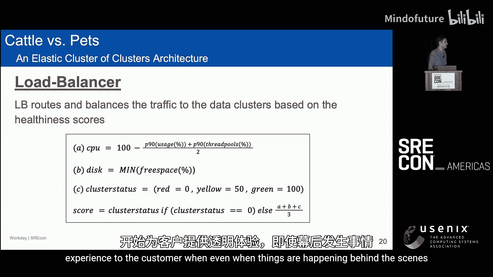
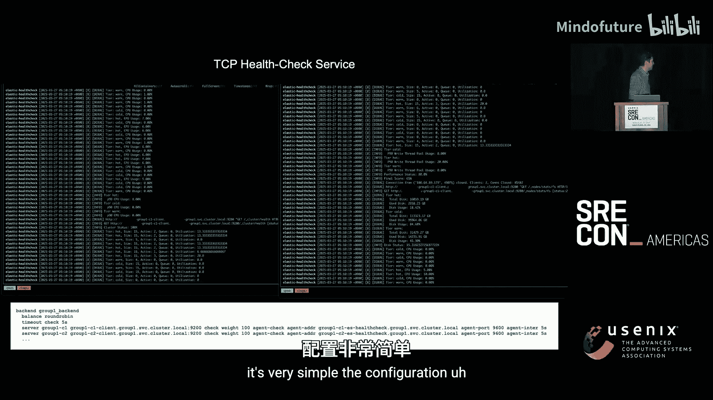
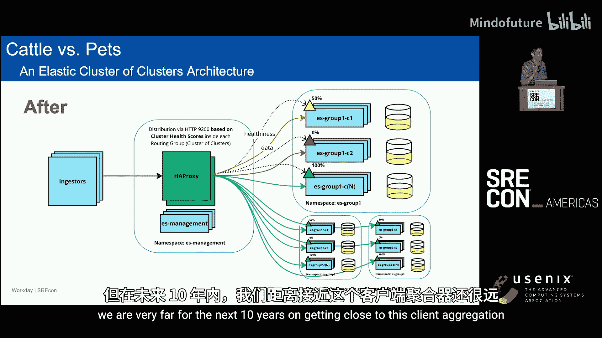
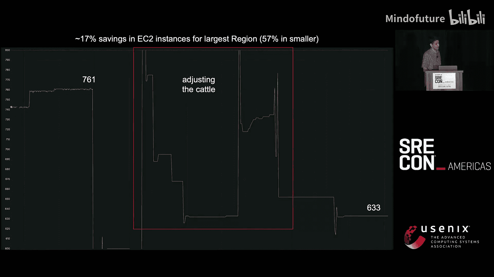

# 037：从“宠物”到“牲畜”——一种经济高效的Elasticsearch扩展架构 🐄


## 概述
在本教程中，我们将学习如何将一个传统的、难以扩展的“宠物式”Elasticsearch架构，改造为现代的、可无限扩展的“牲畜式”架构。我们将深入探讨其核心设计思想、具体实现方案以及带来的显著收益，包括成本节约、性能提升和运维简化。

## 章节 1：问题起源与挑战

### 1.1 从MVP到规模化困境
每个系统都始于一个最小可行产品。起初，日志通过UDP发送到服务器，使用`grep`等工具处理，一切运行良好。随着公司成长，我们引入了Elasticsearch，它提供了便捷的仪表板和搜索功能，说服团队迁移至此非常容易。

然而，当系统规模开始成倍增长时，问题出现了。我们首先尝试纵向扩展，使用更大的机器。但这很快达到硬件极限。接着，我们转向横向扩展，添加更多节点，但发现Elasticsearch集群本身存在扩展上限。

### 1.2 集群扩展的固有瓶颈
Elasticsearch架构依赖于一个主节点来协调集群状态，例如索引和分片信息。当集群节点数量增长时，节点间的通信开销会急剧增加。通常，在默认配置下，一个集群的节点数不建议超过200个。虽然有些公司通过调整大量内存参数等方式将集群扩展到700个节点以上，但这是一种非常脆弱且非标准的“宠物式”运维方法。

### 1.3 “多集群”方案及其弊端
为了突破单集群限制，一个自然的想法是创建多个Elasticsearch集群，并将不同的客户或数据路由到不同的集群。这带来了两个核心路径的问题：

**搜索路径问题**：
Elasticsearch提供了跨集群搜索功能，可以将搜索请求透明地重定向到后端其他集群。但这使得第一个集群变得极其关键，因为它不仅存储客户数据，还存储了Kibana配置、告警、仪表板等所有元数据。如果这个集群故障，所有集群都将无法访问。

**写入路径问题**：
在从数据中心迁移到云的过程中，由于时间和业务压力，我们简单地将原有的“宠物”服务器集群原样搬到了云上，并在前面放置了AWS负载均衡器。负载均衡器仅能基于HTTP头或路径进行简单路由。这导致了一系列问题：
*   需要手动配置每一个数据写入端，告知它们应该写入哪个集群，变更耗时数周。
*   AWS负载均衡器无法有效感知集群健康状态。即使集群处于黄色或红色不健康状态，它仍然会返回HTTP 200状态码，导致流量持续涌入问题集群。
*   各集群硬件配置、负载不均，存在热点问题（例如90%的数据都写入第一个集群）。
*   运维复杂度爆炸：命名规范不一、部署模型多样、告警频繁，且难以在不影响客户的情况下进行变更。

## 章节 2：设计理念：“牲畜” vs “宠物”

上一节我们看到了传统“宠物式”架构在扩展时遇到的种种困境。本节中，我们将引入一个根本性的设计范式转变。

“牲畜 vs 宠物”是一个源自2016年的比喻，用于阐释两种不同的运维哲学：
*   **宠物式**：给服务器起个性化的名字（如`whisky`， `dexte`），像对待宠物一样精心照料。每台服务器都是独一无二、不可替代的。一旦宕机，需要立即修复，整个服务可能因此中断。
*   **牲畜式**：服务器没有名字，只有编号（如`web-01`， `web-02`）。它们被视作可替代的、一次性的资源。任何服务器都可以随时被丢弃和替换，而不会影响整体服务。监控的是服务层面的指标，而非单个服务器的健康。

我们的目标是将Elasticsearch架构从“宠物”转变为“牲畜”。这意味着：
*   服务器可随时替换，无需人工干预。
*   设计面向未来10年的扩展性。
*   分离数据层和展现层。
*   支持不同的服务等级协议（如“尽力而为”的集群）。
*   追求成本效益，不绑定特定硬件。
*   实现命名标准化和自愈能力。

## 章节 3：核心架构设计

基于“牲畜”理念，我们设计了以下核心架构组件。

### 3.1 智能负载均衡与健康检查
我们在所有集群前端部署了一个智能负载均衡器（非AWS ALB）。它的核心职责是：
*   **基于权重的路由**：根据后端集群的健康状态动态分配流量。
*   **深度健康检查**：不再信任HTTP 200状态码。我们实现了一个TCP健康检查服务，其灵感来源于Brendan Gregg的USE方法（Utilization， Saturation， Errors）。

该健康检查服务通过一个公式为每个集群计算一个健康分数（0-100），负载均衡器根据此分数调整流量权重。

**健康分数计算公式**：
```
score = (100 - utilization_p90) * (100 - saturation) * (100 - errors) / 10000
```
*   `utilization_p90`：例如CPU使用率的P90值，避免单节点异常影响整体判断。
*   `saturation`：饱和度指标，如线程池队列深度。
*   `errors`：错误率，例如磁盘即将写满的状态。

此外，我们直接查询Elasticsearch集群状态（绿色/黄色/红色）。如果集群状态为**红色**（只读或丢失主分片），则将其健康分数直接置为**0**，负载均衡器将不再向其发送流量。黄色和绿色状态则参与上述公式计算。



### 3.2 管理集群与数据集群分离
我们彻底分离了管理功能和数据存储：
*   **管理集群**：一个独立、轻量的Elasticsearch集群。它**不存储任何真实的客户数据**，只负责：
    *   托管Kibana（统一的访问入口）。
    *   配置跨集群搜索。
    *   存储所有告警、仪表板等元数据。
    *   运行健康检查服务。
    *   作为审计服务的聚合点。
*   **数据集群**：多个完全同构的、纯粹的“牲畜”集群。每个集群配置、硬件规格完全一致，只负责存储和查询数据。它们对上层应用透明，甚至不知道自己存的是哪些客户的数据。



### 3.3 整体架构视图
以下是架构的核心视图：

```
客户 (写入/查询)
        |
        v
[ 智能负载均衡器 (基于健康分数路由) ]
        |
        |---------------------------------------|
        |                                       |
        v                                       v
[ 管理集群 ]                          [ 数据集群组 1 (集群A， 集群B...)]
(Kibana， 元数据， 健康检查)                 [ 数据集群组 2 (集群C， 集群D...)]
        |                                       |
        |--------跨集群搜索---------------------|
```



通过这种设计，我们实现了：
*   **无限水平扩展**：可以在每个数据集群组内不断添加新的、同构的数据集群。
*   **故障隔离**：单个数据集群故障不影响全局。
*   **透明运维**：扩容、迁移、升级对用户完全透明。
*   **统一入口**：用户通过统一的管理集群访问所有数据。

## 章节 4：实施效果与收益

架构改造后，我们获得了显著的、可量化的收益。



### 4.1 性能提升
*   **查询性能**：一个关键查询的耗时在优化后大幅下降。
*   **写入延迟**：索引延迟（日志从产生到可搜索的时间）降低了近**4倍**。下图展示了Kafka中待消费日志量的变化，迁移后积压几乎消失。

### 4.2 成本优化
“牲畜”架构允许我们采用更经济的资源配置策略，我们称之为 **“牲畜率0”**：
*   **旧思路（宠物）**：为每个Elasticsearch节点配置一块大型、昂贵的磁盘（如2TB SSD）。
*   **新思路（牲畜）**：为每个节点配置一块小磁盘（如500GB），但创建更多节点。将数据分散到更多更便宜的节点上。

**成果**：
*   最大集群的计算成本降低了**17%**。
*   一个中型集群的计算成本降低了惊人的**57%**。
*   通过进一步将SSD替换为更便宜的GP3磁盘并进行更多“牲畜率0”优化，预计未来可节省**50% 到 82%** 的成本。

### 4.3 运维简化
*   **部署与迁移时间**：将一个新集群投入生产或迁移一个大型集群的时间，从原来的**14周**缩短到**5天**。最大集群的迁移仅用了**2天**，且对用户零感知。
*   **配置统一**：所有数据集群配置一致，降低了认知负荷和运维错误。
*   **赋能实验**：可以轻松创建镜像集群来测试新硬件、新配置或识别问题查询，而不会影响生产环境。

## 章节 5：增强工具：查询审计服务

在“牲畜”架构下，集群规模庞大，我们需要更强大的工具来洞察问题。Elasticsearch自带的慢日志和安全日志信息分散，难以关联。为此，我们构建了一个轻量级的**查询审计服务**。

**实现方式**：
1.  在每个Elasticsearch Pod中部署一个Sidecar容器。
2.  Sidecar通过UDP收集该节点的慢查询日志和安全日志。
3.  所有Sidecar将日志发送到**管理集群**中的一个聚合服务。
4.  聚合服务将海量分散的日志聚合成按用户、查询等维度统计的视图，并写入管理集群。

**价值**：
*   **客户问题定位**：当客户抱怨查询慢时，我们可以从审计仪表板中直接看到该查询的详细性能指标，快速判断是集群问题还是查询本身问题。
*   **集群洞察**：获得全局视图，例如：可缓存查询的比例、各时段查询负载、问题用户识别等。
*   **未来优化**：为实施查询限流、缓存以及阻止恶意查询提供了数据基础。

## 总结
在本教程中，我们一起学习了如何通过从“宠物式”到“牲畜式”的架构转变，解决大规模Elasticsearch部署的扩展性、成本和运维难题。核心要点包括：
1.  **理念转变**：将服务器视为可丢弃、可替换的“牲畜”，而非需要精心呵护的“宠物”。
2.  **架构核心**：通过**智能负载均衡**（基于深度健康检查）和**管理/数据集群分离**，构建了一个透明、无限扩展的层次结构。
3.  **显著收益**：实现了**性能提升**（4倍索引速度）、**成本大幅降低**（最高57%）和**运维极度简化**（迁移时间从周降到天）。
4.  **工具赋能**：构建**查询审计服务**，为大规模集群下的问题诊断和优化提供了关键洞察。


这种架构不仅适用于Elasticsearch，其“牲畜化”、池化、基于健康状态路由的核心思想，可以广泛应用于其他需要大规模、高可用的分布式系统设计中。