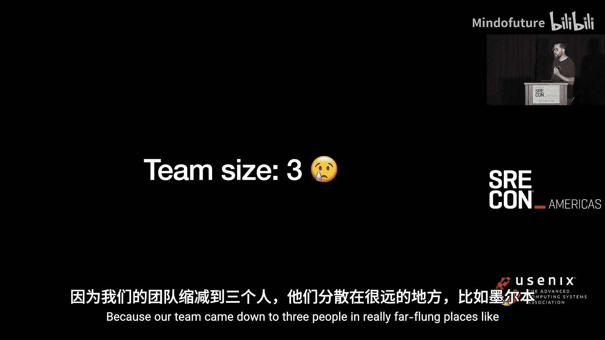
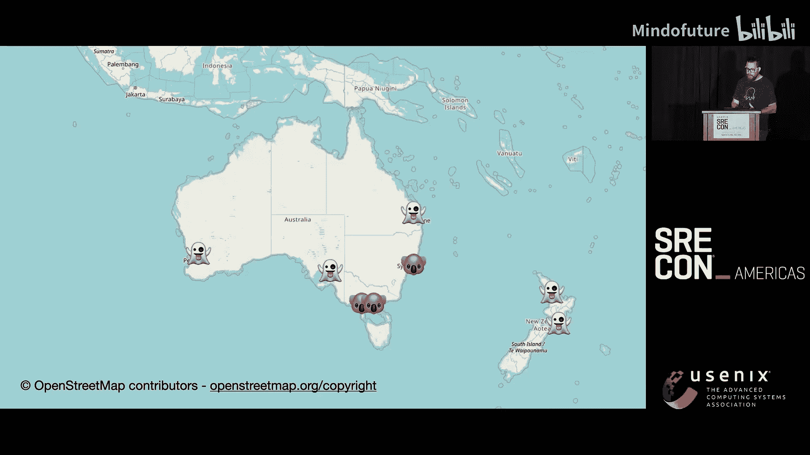
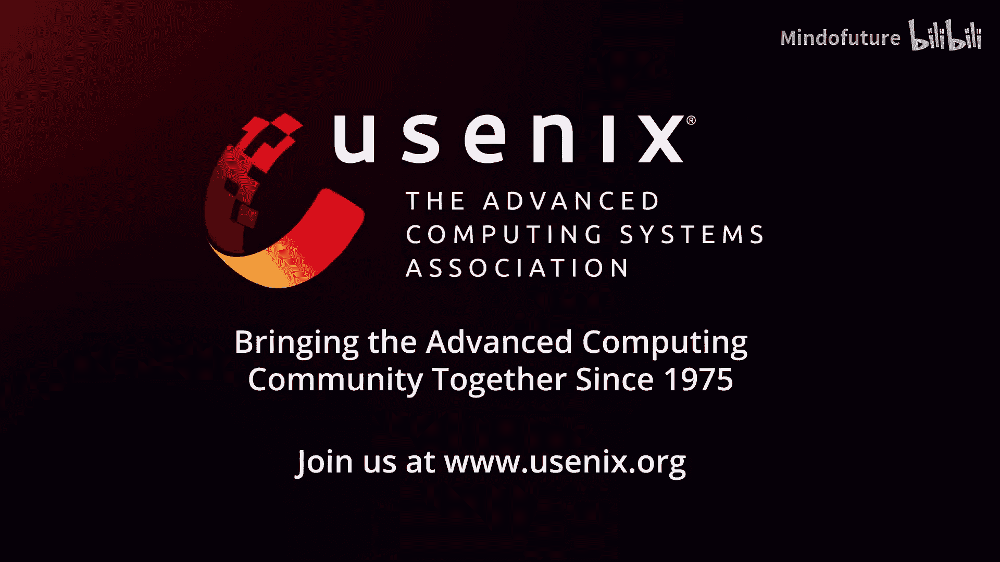

# 038：每年百万构建，仅需一页告警——内部服务运维实践

在本教程中，我们将学习一个SRE团队如何通过一系列文化、策略和技术决策，实现每年处理超过百万次产品构建，同时将告警唤醒次数降至极低水平的实践。我们将重点探讨团队规模缩减背景下的运维策略、自动化升级以及服务稳定性与团队健康的平衡。

大家好。我是Ka，来自澳大利亚。我是一家名为Octopus Deploy的公司的SRE，我们开发持续部署工具。如果你对此感兴趣，可以在octopus.com找到我们。我所在的内部工具团队负责为我们的产品提供构建、测试和部署基础设施。标题中的“百万构建”指的是我们的产品在一个日历年内，在我们团队提供的平台上完成的构建次数。

现在，我需要说明一下。你看到标题上那个带星号的小脚注了吗？我在这里取巧了一点。那“一页告警”指的是**一年内真正需要唤醒某人的告警**。对我而言，我关心的是被唤醒，我不喜欢这样。虽然还有其他告警，但只有一个是真正需要唤醒人的。

首先，简单介绍一下Octopus Deploy的工程文化。大多数工程团队都需要参与值班。团队大致分为三类。

第一类是负责**外部服务**值班的团队。有人属于这类团队吗？你们为顾客使用的服务值班。

第二类是像我们这样为**内部服务**值班的团队。有人吗？好的，有一些。

第三类则是“秘密”的第三种团队，他们**不为任何服务值班**。这里有人属于这类吗？没有。那一定很惬意。是吗？

看来大家的视角很丰富，这很好。我所在的团队，我认为我们拥有从GitHub开始，一直到我们营销网站后端那个展示发布说明、提供产品版本（甚至回溯到V1及更早版本）下载链接的应用之间的所有环节。

在深入核心内容之前，我们需要提供一些背景信息。我们需要回到过去，看看我所在团队的初创时期。

这大约是我加入公司一年后。我开始真正站稳脚跟，我们当时有这些构建基础设施和测试在运行，但它们像是“环境”的一部分，没有明确的负责人。

我认为这可能是合理的，这反映了公司从一个技术创始人有机成长到当时约70人的状态。我和其他一些人认为，CI系统可能需要一个明确的负责人。我们认为，我们遇到了一些问题，或许应该开始认真管理它。

于是，我们找到了获取系统管理权限的途径，并接手了它。从那以后的几年里，我们接管了越来越多的流水线环节。

为了成为好的管理者，我们从基础工作开始，比如修补运行这些服务的主机操作系统。我们可能想这么做，但结果呢？哎呀。

我们当时全是手动操作，临时应对，没有任何自动化。事实证明，当构建系统宕机六小时时，软件工程师们会不高兴。我也不高兴。

因此，我们很自然地想到，好吧，这很痛苦。我们或许应该在一天结束或开始时做这类工作，以减轻公司其他同事的负担。但这有一个问题。

那就是，在我的团队里，没有人签约在常规工作时间之外例行工作。所以它们才叫“工作时间”。这存在团队成员倦怠甚至离职的风险。我们想改变这一点。

接下来，我将花些时间讲述我们做出的一些决定，这些决定事后看来帮助我们实现了现在的状态：运行这些服务，而无需在一周的大多数晚上熬夜。

我要从一件可能有点令人失望的事情开始，如果你希望找到一个可以直接解决问题的工具的话。你必须与人沟通，抱歉。我知道这对我们中的一些人来说很难。没有软件层面的“修复方案”，尽管我们稍后会讨论一些技术选择。

我们面临的问题主要围绕时区。我们是一个远程优先的组织，早在2020年之前就支持远程工作，但工程团队的“重心”在澳大利亚东海岸。尽管众所周知，那里仍然有不止一个时区（感谢夏令时）。但我们也有同事在新西兰和其他地方。

我们进行了很多艰难的来回沟通，比如：每隔几周让某些服务停机几小时可以吗？最终我们从大多数人那里得到的答案是：可以。除非我们正在尝试发布一个长期支持版本，并且同时有很多变更发生。否则的话，是的，没问题。

如果你看过Katie Wes关于“无限正常运行时间技巧”的演讲，这有点像我们实现它的方式。我们说，好吧，让我们制定一些关于何时允许服务不可用的规则。于是我们写了一份支持政策。

我们在政策中写道：好的，各位，我们承诺在正常工作时间内安排一个人，负责保持服务正常运行，主动监控生产环境状况，并处理所有传入的运维工作。

作为交换条件，我们制定了告警策略。既然我们都在工作时间内完成这些工作，我们也会参与值班。但**只有当你需要我们的工具来解决你的故障时**，才发出告警。

所以，如果你只是碰巧在遥远时区工作，只是想完成一次构建，但系统不工作，不行，你得等到明天。但如果我们有一个安全补丁需要在夜间发布，是的，绝对要告警。这就是我们存在的意义。

这个策略效果很好。我们现在为响应时间设定了SLA。不过，我不想跑题太远，我知道这个缩写对某些人来说可能有点敏感，你可能在过去有过不好的体验。还有其他敏感的缩写。

在这整个时期，我第一次学到了第三个缩写：RIF。不知道这是什么意思的人，你们很幸运。这是“人员编制缩减”的委婉说法，指的是裁员。

当我的团队忙于建立这些良好的文化和政策时，公司正接近我们每次SREcon都必须提到的动态安全模型中的“经济失败”边界。如果你不知道这是什么，可以去看看Andrew Hatch去年的演讲，他讲得比我详细得多。

总的来说，我们可以说，有影响力的人认为公司在三个边界内移动：经济失败、工作负载失败、性能失败。他们认为我们正走向经济失败。

Octopus作为一家公司实际上没有债务融资，非常关注盈利能力。因此，他们看到利润率下降，说我们需要采取一些激烈措施。

所以实际情况是这样的。我提到所有这些，是因为RIF影响了我们的选择。因为我们的团队缩减到了三个人。

分布在非常遥远的地方，比如墨尔本。还有墨尔本和卧龙岗（靠近悉尼）。非常不错的澳大利亚地方。这当然不是维持一个可持续的7x24小时值班计划所需的七八个人。

于是，减少重复性劳动（Toil Reduction）成为了重点。我们已经在做这件事，但现在真的需要加速了。我们需要确保能够处理所有必要的工作。

我们做出的一个技术选择是**拥抱云服务**。我的意思是，在基本所有合适的地方，我们都选择使用云供应商提供的最高抽象级别的服务。

一个很好的例子是数据库。我的团队运行着一堆来自第三方的不同应用，有些用MySQL，有些用PostgreSQL，有些用Microsoft SQL Server。我们只有三个人，没有时间深入掌握所有这些技术的运维知识。

所以我们依赖云供应商，他们说：好的，你只需要给我们一个漂亮的API来创建和管理这些东西，而补丁、备份和高可用性由他们负责。

说到高可用性。我们做出的另一个选择是，即使感觉不必要，也**选择以高可用模式或复制模式（或两者兼有）部署服务**。我知道你会说，Ka，那拜占庭故障模式呢？是的，这是个风险。

但我们更倾向于接受这个风险，而不是因为单个可用区断网（这确实发生过）而导致我们的服务直接下线。公平地说，我们团队中运行的复制状态服务并不多，所以这确实是一个容易做出的选择。

你可能还会想，Ka，所有这些不花钱吗？是的，确实花钱。不过，我很幸运，我们有一个领导团队，他们认识到尽管公司整体情况如此，我们仍需要投入一些资金，以避免留下的人员倦怠。

这个时期经常被提及的一句话是：**要有成本意识，但不要害怕成本**。因此，我的团队需要做预算预测和成本建模，并随时间推移对此负责，但我们没有被给定一个上限数字并被要求围绕它设计。我们可以构建我们认为需要的东西，告知他们，他们会相应地进行规划。

我们做出的第三个，可能更具争议的选择是，**基本上自动升级所有东西**。不是盲目地自动升级，但至少建立系统，让我们知道何时需要升级。

我指的是最广泛意义上的升级：Terraform提供商版本、应用程序本身、它们的依赖项，凡是互联网上有版本流的东西，我们都升级。

我们的合理默认做法是，至少建立一个流水线，在有可用更新时**提议变更**。对于某些东西，我们选择直接应用更新，看看是否着火，因为我们对其可用性不那么在意。对于另一些，我们有测试或其他类型的关卡来阻止变更发布。还有一些，我们将这些活动安排在周末，这样如果没有问题，就不会造成太大损害。

实现这一点并不容易，无论是在政治上还是技术上。我们第一次这样做时相当困难。但我们加入了很多安全措施，并且随着我们了解这些系统如何故障，我们总结出了很多适合我们的良好模式。

我想指出，我们并不使用预览版构建，我们不是那么前沿，但我们喜欢尽可能保持最新。

话虽如此，有时周一你进入家庭办公室，新西兰的软件工程师会不高兴，因为构建系统在周末自动升级后宕机了。这确实发生过，那次对话很痛苦。但事后看来，在那之前已经有大约100周我们顺利完成了升级，什么都没发生。我宁愿选择后者。

而不是必须手动计划这些服务的月度、季度或年度大爆炸式升级。

以上所有这些，就是实际上，截至去年（实际上本周刚更新，去年有150万次构建），我们团队仍然只有一次告警唤醒。大多数利益相关者对现状相当满意。

当然也存在一些缺点。第一个听起来可能有点像，你知道，当你参加面试时他们问“你最大的缺点是什么”，而你回答“我工作太努力了”。我保证这是真的。

随着我们开始增长（在RIF之后），我们的系统变得过于稳定，无法产生那种让人们理解系统如何故障的自然故障。我们最终不得不投入大量精力，通过阅读复盘报告或只是进行知识分享会等方式，明确地让新人了解过去故障的情况。我们的团队还没有足够的能力进行故障演练或混沌工程之类的事情。我们现在正在努力。这并不是说我们没有故障，只是不足以依赖它们作为团队新成员的学习来源。

另一个挑战是，公司现在正在全球范围内增长。因此，我们的团队需要挑战“澳大利亚东海岸的工作时间”仍然适合作为值班支持与日间支持之间界限的假设，因为我们在新西兰有人，在澳大利亚四个时区有人，现在工程团队在欧洲也有人。我们该怎么办？我不知道。这并不明确。我知道我们不能实行“跟随太阳”模式。我们的团队不够大，覆盖的地方不够多。

在结束之前，我想回到这个缩写：MTBF（平均故障间隔时间）。它让我思考，也许，我们知道这个指标并不完美，但也许我们可以考虑“平均告警间隔时间”。你多久收到一次告警？多久被唤醒一次？我们的大约是每12个月一次，持续了大约三年。但这算好吗？算坏吗？我不太确定。我认为非常低并不理想。我认为我们需要一些关于系统运行状况的最低限度反馈。系统是否在边缘发出吱吱声？我不知道。所以，如果你是工具供应商，这里有一个可以构建的新图表。

非常感谢大家的时间。我需要感谢我的团队为这次演讲做出的贡献，给我时间来到这里，并审阅这次演讲。我需要感谢我的伴侣，她现在在家带着三个孩子，我才能在这里。

如果这些内容引发了你的思考，你想讨论一下，我会在这里。我在Slack上，你可以通过这些社交媒体联系我。我想我还有一些时间回答问题。

谢谢。

---

**总结**

在本节课中，我们一起学习了Octopus Deploy内部工具团队如何通过制定清晰的支持与告警政策、拥抱云服务的高抽象层级、实施自动化的渐进式升级策略，在团队规模较小且分布广泛的情况下，实现了高吞吐量（每年百万级构建）与极低运维负担（每年仅一次唤醒告警）的平衡。核心经验在于：**通过文化沟通明确期望，利用技术选择降低运维复杂度，并在成本与稳定性、自动化与可控性之间做出明智的权衡**。这些实践为资源有限的团队管理关键内部服务提供了有价值的参考。