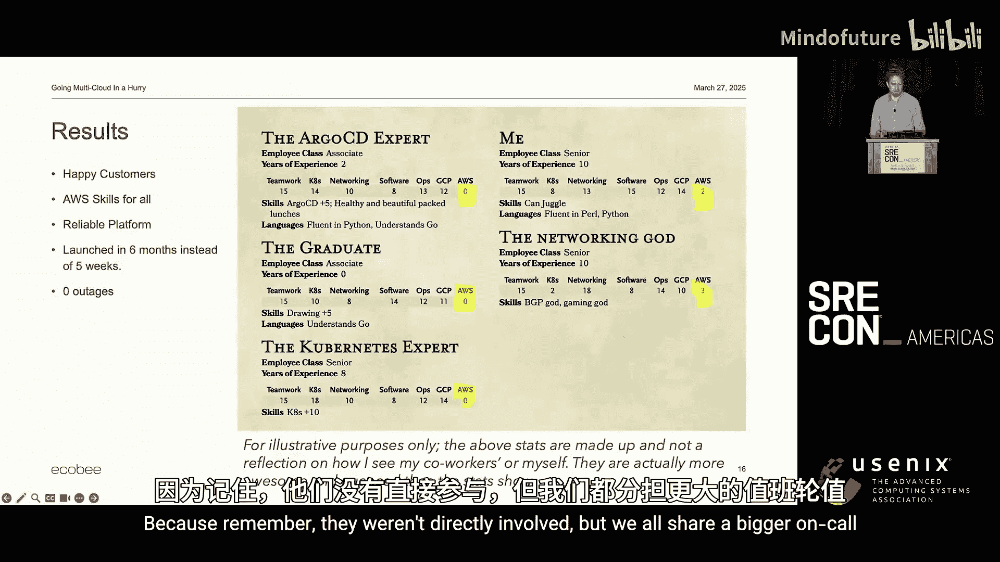
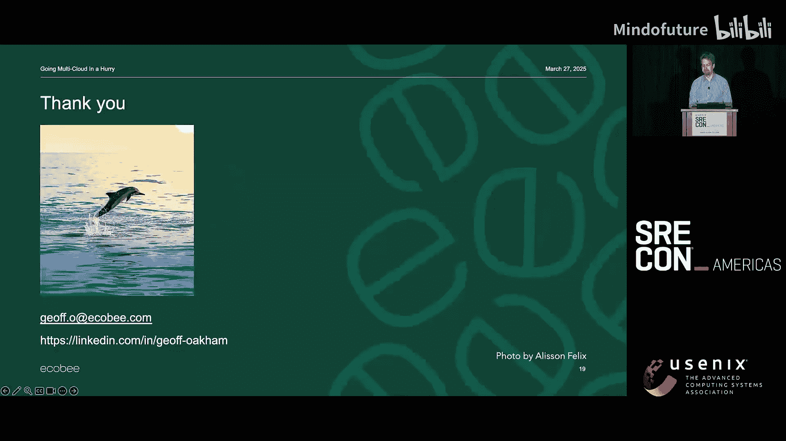
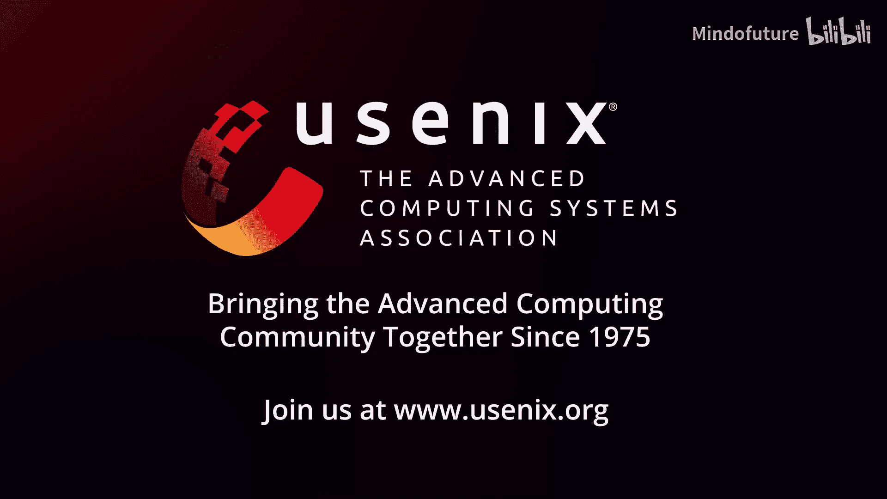

# 039：如何在紧迫时间内高质量、有风格地实现多云部署

## 概述
在本节课中，我们将学习一个真实的SRE团队如何在时间紧迫、资源有限且缺乏目标云平台（AWS）经验的情况下，成功构建并交付一个高质量的多云Kubernetes平台。我们将重点分析他们采用的独特协作方法“Jam Sessions”，以及支撑项目成功的关键软技能和组织因素。

## 项目背景与挑战
上一节我们介绍了课程的整体目标，本节中我们来看看项目启动时面临的初始困境。

我们的团队管理着一个基于GCP和GKE构建的托管Kubernetes平台。该平台集成了ArgoCD、Helm、Prometheus、Grafana、L7负载均衡器和密钥管理器等工具，并为租户提供支持。

一个周五，老板提出了新需求：在五周内将平台扩展到AWS，以支持一项即将发布的服务。团队核心成员共10人，都是GCP专家，但对AWS一无所知。此外，新集群还需满足比现有集群更高的合规标准，并要求在开始工作前提交完整的系统架构图和工作分配计划。

## 策略调整与沟通
面对“未知领域”与“预先详细规划”的矛盾，以及紧迫的时间线，团队必须调整策略。

以下是团队为破局所采取的关键沟通行动：
1.  **与管理层沟通**：请求明确需求细节，并尝试推动部分限制条件的调整。
2.  **与产品负责人沟通**：确认发布时限的实际灵活性，发现其比最初印象中更为宽松。
3.  **与产品工程师沟通**：建立直接联系，了解他们的具体需求，并告知他们将由平台团队负责基础设施，减轻了他们的负担。
4.  **与合规部门沟通**：请求指派专人进行快速决策审批，以实现迭代式开发的同时满足合规要求。

团队主动承担了前期的合规文档工作（例如基于AWS文档绘制网络架构图进行预审），这一举动也鼓励了其他成员参与进来，共同分担。

## 核心协作方法：Jam Sessions
在开放了与各关键干系人的沟通渠道后，团队内部需要一种高效的协作模式来攻克技术难题。我们借鉴了团队另一小组进行云迁移时采用的“Jam Sessions”模式。

Jam Sessions是一种专注于实际工作的会议，而非状态同步会。团队每周进行两次，每次两小时。会议内容非常灵活。

以下是Jam Sessions可能涵盖的主题类型：
*   **决策制定**：针对某个技术方案进行讨论并做出决定。
*   **代码审查**：集体Review Pull Request。
*   **求助解困**：帮助成员解决当前遇到的技术阻塞。
*   **知识分享**：分享近期学到的新知识或对AWS的新理解。

会议初期，主持人（通常是笔者）会主动分享自己遇到的困难或一知半解的地方，例如多次分享“这是我对AWS目前的理解，但我仍然很困惑”，以此营造一种**心理安全**的氛围，鼓励大家承认不足、积极求助。

## Jam Sessions的优化演进
最初的Jam Sessions缺乏焦点，甚至会出现开场时面面相觑的尴尬。团队随后进行了优化。

首先，每次会议开始时，会先通过在线协作文档或聊天线程收集并确定议程。其次，由于这是非正式工作会议，团队开始邀请“客人”参与，例如遇到部署问题的产品工程师，或需要共同做出合规决策的合规部门同事。

在会议中，团队会自然地根据兴趣和专长分成子小组，并行处理不同议题（如一人去审查PR，另一组去解决网络问题）。这种自愿组合的方式确保了知识在团队内流转，而非集中在个别人手中。

针对“每周四小时深度会议占用过多专注时间”的反馈，团队进一步优化了流程：在会议当天上午，大家在一个共享线程中发布话题并投票。会议议程则按“客人的话题优先 -> 广泛感兴趣的话题 -> 小众专业话题”的顺序安排，后者通常会形成子小组讨论。

## 项目成果与成功因素总结
本节课我们一起学习了这个多云扩展项目的完整历程。最终，团队在约六个月时间内交付了生产级的AWS平台，虽然超出了最初五周的要求，但通过灵活的沟通（例如让产品工程师先在成熟的GCP平台上测试），满足了产品方的实际节奏需求。该AWS集群已稳定运行超过一年，无重大事故，且相关知识已在团队内充分共享，足以支撑值班轮换。

回顾项目，Jam Sessions这种协作模式之所以成功，关键在于团队具备**心理安全**，成员能坦然说“我不懂”或“我需要帮助”。此外，领导层提供的**自主权**与**支持**、团队在招聘和日常工作中注重的**情商**，都是不可或缺的基石。

对个人而言，项目的成功不仅依赖于技术能力，更依赖于**软技能**：凝聚团队、有效沟通、敢于说“我不知道，我们一起解决”以及接纳更好的他人意见。这些技能对职业生涯的各个方面都至关重要。

最后，如果读者也想尝试Jam Sessions，一个小建议是：使用带有**喷水海豚动画**的会议软件，或许能为会议增添一丝轻松趣味。

---
**总结**：本节课中，我们一起学习了一个SRE团队通过建立心理安全、采用灵活的Jam Sessions协作模式、并积极进行内外部沟通，在时间压力和技术陌生的情况下，成功实现高质量多云平台部署的实战案例。核心收获在于认识到**软技能、团队协作与开放沟通**在解决复杂工程问题中的决定性作用。