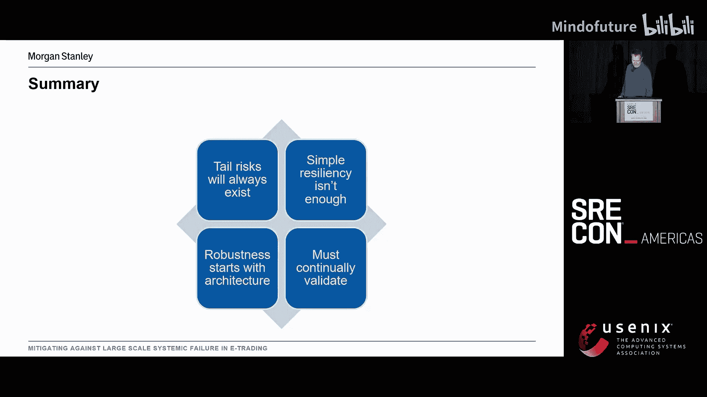
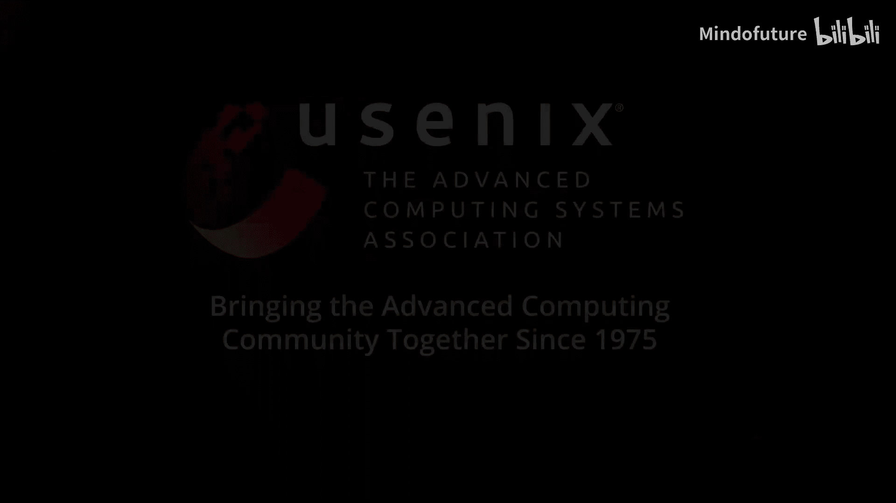
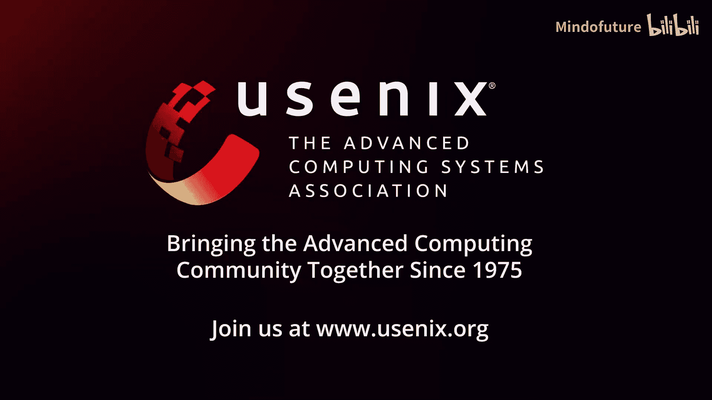

# 040：缓解电子交易中的大规模系统性故障 🛡️

在本教程中，我们将探讨电子交易系统面临的风险，并学习如何通过架构设计来预防和缓解大规模系统性故障。我们将从电子交易的特殊性开始，分析潜在风险，并最终提出具体的架构缓解策略。

## 概述 📋

电子交易系统运行在严格的时间窗口和监管环境下，任何故障都可能带来巨大的财务、监管和声誉风险。本节课程将引导你理解这些风险，并学习如何通过前瞻性的系统设计来构建更具韧性的交易平台。

## 电子交易的特殊性与风险 ⏰

电子交易系统严重受限于其交易的市场，因此交易时间至关重要。虽然部分市场全天候交易，但我们处理的大多数市场交易时间窗口相当狭窄。因此，尽管系统可能需要全天候可用以接收客户订单，但事故的严重性会因一天中的时间不同而产生巨大差异。

从图表中可以看到，以伦敦和美国交易所为例，如果事故发生在凌晨2点，不会造成太大问题。但如果事故发生在12小时后，我们将面临非常糟糕的一天。

## 现实世界中的事故案例 📉

我们可以从现实世界的一个事故案例中理解风险。2023年12月，伦敦证券交易所发生硬件故障，导致其系统性能下降。虽然性能下降未达到自动故障转移的阈值，但仍造成市场在一天内两次被迫停止交易。此事立即成为新闻焦点。

这对我们意味着什么？我们可能面临多种风险。

## 电子交易系统面临的三大风险 💸

以下是电子交易系统主要面临的三大类风险：

1.  **财务风险**：并非所有订单的风险都相同。订单规模差异巨大，一个非常大的订单，即使其返回给客户的价格仅有微小变动，也可能对损益产生巨大影响。
2.  **监管风险**：我们处于高度监管的行业，任何问题都会迅速受到全球监管机构的审查。如果他们发现不合规之处，将导致制裁和罚款，后果严重。
3.  **声誉风险**：这是一个竞争非常激烈的行业。正如我们从伦敦证券交易所事件所见，一旦出现问题，会迅速成为新闻，没有人希望自己的公司因出错而登上新闻。

## 保障系统持续运行的标准措施 🏗️

为了保持系统持续运行，我们采取了一些标准措施。我们拥有多个地理位置的数据中心，运行多个实例以实现容量扩展，并隔离不同业务单元。我们定期测试所有站点，确保不会在出现问题时不知如何应对。在部署软件时，我们采用分阶段部署策略，逐步建立信心。通过先在试点环境、部分生产环境进行测试，确保测试了所有不同的用例，避免突然发现一个影响所有业务流的问题。

然而，这并非故事的终点。事情仍然可能出错。系统中总会有问题暴露出来。这些系统非常复杂，包含数千万行代码。因此，其中一些问题可能在数年里都未被察觉，尤其是那些奇怪的边缘情况。我们知道，越不频繁出现的问题，几乎肯定是最严重的问题。

## 潜在的系统性风险类型 🔍

那么，这些风险具体有哪些类型呢？

*   **潜伏缺陷**：一个存在已久的缺陷，在它出现之前我们无从知晓。
*   **毒丸消息**：我们从多个来源获取外部数据流。如果某个消息中有我们处理不当的内容，并且该消息在整个平台广播，突然间，系统的多个部分就会发生故障。
*   **相互依赖问题**：随着系统从单体架构演进，服务间相互调用日益增多。我们如何处理这些不同组件相互依赖的事实？我们面临级联故障的风险。我们如何处理它们在不同时间运行不同版本的问题？
*   **环境变化**：这可能是平台中其他人所做的更改，也可能是外部世界的变化。市场对新闻反应迅速，波动性会急剧上升。今年我们已经多次看到这种情况。所有这些不同因素都可能引发问题。

## 问题场景模拟与挑战 🐛

这样一个问题可能是什么样子？假设我们有一个缺陷。它不知何故绕过了我们所有的控制措施，通过了代码审查、回归测试、自动化测试，并逐步部署到整个平台，然后在那里潜伏了数年。直到某件事发生，才有人知道它的存在。可能是市场数据量激增，超出我们以往所见；可能是我们从未见过的新消息类型；也可能只是平台中的某些变化，现在我们触发了那个缺陷。

对于不熟悉相互依赖问题的人，也可以从Knight Capital的事件中看到这一点。不同版本的组件相互通信时表现出不同的行为。结果，当一个新的功能开关被打开时，他们突然开始向市场发送完全失控的订单。

当这种情况发生，我们遭遇事故时，我们试图找出影响范围以及如何修复。如果幸运，可能只是惹恼某些人，我们可以轻松应对。但我们不可能总是那么幸运。有时，这可能会中断交易。正如我们所说，这涉及大量资金和巨大的监管压力。这些问题有时已经存在多年。

我们该如何调试？引入那个缺陷的开发者可能已经不在公司了。这些都不会是快速修复。

## 架构层面的缓解策略 🧱

那么，我们能做些什么来缓解这种情况？从根本上说，我们可以构建更多的测试，可以提高编码水平。但解决这个问题的最佳方式，我们必须审视最根本的东西，即我们系统的架构。我们如何设计才能降低此类风险？显然，如果我们事后才做这件事，修复成本会很高，正如金字塔的大小所反映的。在后期更改架构，你会非常困难。

从架构角度，我们可以考虑以下几点：

### 减少爆炸半径

部署服务时，很容易想到：让我们部署一个通用的、可在多种不同情况下使用的服务。但当某个地方出错时，它们会同时全部宕机。这不是一个好局面。我们可以引入这些服务的不同变体。每个变体只包含特定用例所需的功能。这样，当问题发生时，它只影响使用该部分功能的具体区域。当然，这意味着我们向系统中引入了额外的复杂性。我们现在必须管理所有这些不同的版本和组件，理解我们在做什么。这是一种权衡。

### 核心功能隔离

这些是复杂的系统。我们不是将它们构建为单体，而是有不同的组件。在构建时，我们可以让系统核心与某些其他功能隔离开来。这样，如果某些功能模块出现问题，只有那部分停止工作，系统实现优雅降级。系统的其余部分，主要部分，在我们的案例中即交易能力，可以继续工作。显然，我们希望能在过程中修复那些其他部分，功能得以恢复，用户满意。但至少，我们能够管理我们所做事情的核心。

### 备用系统切换

即使有了以上所有措施，仍然存在系统核心功能本身发生故障的风险。在这种情况下，你可能拥有另一个与我们所做事情有部分重叠的系统。我们有多个不同的业务线在进行交易。交易能力在不同系统间是共通的。因此，也许我们可以使用其中一个其他系统来缓解故障。显然，你必须拥有不同的系统。这也带来了风险：如果我们从未这样做过怎么办？如果我们从未使用过这个系统怎么办？你不能只是扔给某人一个新系统，然后希望他们能够使用它。因此，你必须定期演练你在这里所做的一切。这个策略相当极端，可以想象，成本也相当高昂。

## 总结 🎯

本节课中，我们一起学习了电子交易系统面临的独特挑战和系统性风险。我们分析了财务、监管和声誉三大风险，并探讨了标准运维措施的局限性。

最重要的是，我们深入研究了三种关键的架构缓解策略：
1.  **减少爆炸半径**：通过服务变体隔离故障影响范围。
2.  **核心功能隔离**：实现系统优雅降级，保障核心交易能力。
3.  **备用系统切换**：在极端情况下，通过演练过的备用系统维持业务。

这些问题并不简单，没有让它们消失的捷径，也没有银弹。我们无法挥动魔杖就让一切正常运转。我们需要在架构上进行投资。我们需要在设计和构建时就预期到事情会出错。我们不能仅仅接受“我构建的系统很健壮，一切都会好”的想法。我们需要以最小化风险的方式来构建系统。但同时，我们需要接受当这些系统被使用时，它们必须正常工作，并且我们需要在此过程中持续验证。