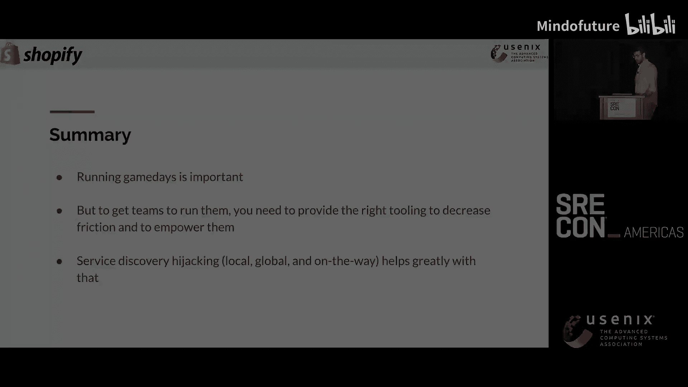
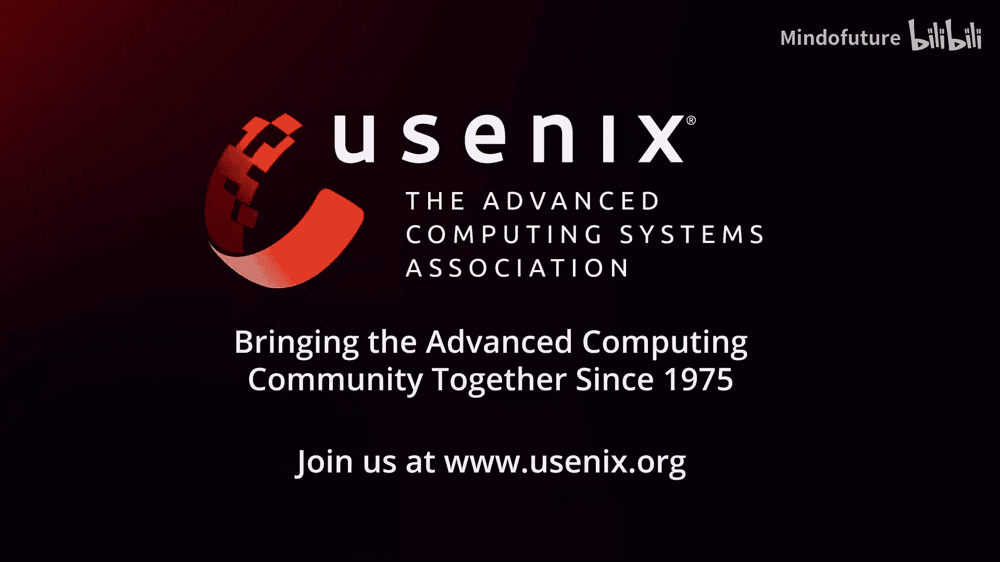

# 041：利用服务发现劫持模拟依赖故障


## 概述

在本节课中，我们将学习如何通过“劫持”服务发现机制，来更安全、便捷地实施混沌工程演练（Game Day），模拟微服务依赖故障，从而提升系统的整体韧性。我们将重点介绍三种不同的劫持方法。

## 什么是混沌工程演练？🧪

混沌工程演练的核心是主动模拟生产环境中的故障，以验证系统在压力下的行为和韧性。在Shopify，我们通过创建“韧性矩阵”来规划演练。该矩阵列出了服务的所有关键流程，以及针对每个流程可能发生的故障类型和预期的系统反应。

以下是规划演练的基本步骤：
1.  识别服务的关键业务流程。
2.  列出每个流程可能依赖的组件及其潜在故障模式。
3.  定义针对每种故障，系统应有的表现（如：服务降级、优雅失败、优先级处理等）。
4.  执行故障注入，观察并验证实际结果是否符合预期。

许多团队在第一步就会遇到挑战，因为他们并不完全清楚服务的所有依赖关系。因此，仅完成韧性矩阵的创建本身就是一个极具价值的练习。

## 故障注入的挑战与思路 🎯

上一节我们介绍了混沌演练的基本概念，本节中我们来看看实施故障注入时遇到的具体挑战。当团队准备好韧性矩阵后，下一个问题是如何实际地“关闭”依赖以模拟故障。

直接关闭生产依赖服务是危险且具有破坏性的。理想情况下，我们希望演练对团队而言是低摩擦、可插拔且安全的。从客户端应用的视角来看，依赖“不可用”这个结果是相同的，无论是因为服务本身宕机、网络问题还是其他原因。因此，我们可以通过代理层来模拟这种不可用状态，而无需真正中断依赖服务。

我们主要使用两种故障注入代理：
*   **Toxiproxy**：一个由Shopify开发的开源代理。它的优势在于可以与测试代码深度集成，非常适合在持续集成流水线中使用。你可以编写测试，通过Toxiproxy对依赖注入延迟或错误，然后进行断言验证。
*   **Envoy**：一个功能强大的服务网格代理。如果你的生产环境已经使用了Envoy，那么你可以直接在其配置中添加故障注入规则，而无需引入新的组件。

## 核心挑战：流量重定向 🔄

介绍了可用的工具后，我们面临一个核心问题：如何让服务的流量自动经过我们设置的故障注入代理？最直接的方法是修改应用程序的代码或配置，将目标地址从真实的依赖改为代理的地址。

例如，将连接数据库的代码从：
```go
// 原始代码，连接至真实数据库
client, err := sql.Open(“mysql”, “db-primary:3306”)
```
修改为：
```go
// 修改后代码，连接至故障注入代理
client, err := sql.Open(“mysql”, “toxiproxy:3306”)
```
然而，要求团队为了每次演练都修改代码、构建新镜像并部署，这引入了巨大的风险和不便。这违背了我们“低摩擦、可插拔”的目标，会导致团队减少演练频率。

为此，我们开发了 **Game Day Buddy**，一个Kubernetes Operator。团队只需提交一个简单的配置文件，即可自动完成整个故障注入的搭建。

一个配置示例如下：
```yaml
apiVersion: chaos.shopify.io/v1
kind: GameDay
metadata:
  name: simulate-redis-latency
spec:
  targetDeployment: “checkout-service”
  dependency: “redis-cache.production.svc.cluster.local”
  toxic:
    type: “latency”
    attributes:
      latency: 1000 # 注入1000毫秒延迟
```
Game Day Buddy会根据配置自动创建Toxiproxy实例，并设法将`checkout-service`对`redis-cache`的请求重定向到Toxiproxy。那么，它是如何实现流量重定向的呢？这就引出了我们今天的主题——服务发现劫持。

## 服务发现劫持的三种模式 🛠️

Game Day Buddy在底层支持三种劫持服务发现的模式，这三种模式也概括了此类技术的通用思路：**本地劫持、全局劫持和途中劫持**。接下来，我们将通过具体例子逐一讲解。

### 模式一：本地劫持（修改Hosts）

这是最直接的方法。在Linux系统中，应用程序在发起网络请求前，通常会先查询本地的`/etc/hosts`文件来解析域名。Kubernetes提供了`hostAliases`字段，允许我们为Pod动态添加主机名映射。

Game Day Buddy的工作流程如下：
1.  在目标Pod所在的Namespace中部署一个Toxiproxy实例。
2.  通过Kubernetes API，向目标Pod的Deployment添加`hostAliases`，将依赖服务的域名指向Toxiproxy的IP地址。
3.  配置Toxiproxy，将其上游设置为真实的依赖服务。

这样，当应用程序尝试访问依赖时，会被`/etc/hosts`重定向到Toxiproxy，再由Toxiproxy转发给真实服务，从而在中间层注入故障。这种方法简单有效，但有一个致命缺陷：如果应用程序在域名后加了一个点（例如 `redis.`），表示这是一个完全限定域名，系统将跳过`/etc/hosts`直接查询DNS，导致劫持失效。

### 模式二：全局劫持（修改DNS）

当本地劫持失效时，一个更激进的想法是直接修改全局的DNS服务器。例如，在集群的CoreDNS中增加一条规则，将所有对`redis`服务的查询都解析到Toxiproxy的地址。

公式可以表示为：
```
DNS_Query(“redis.service”) -> Resolve_To(Toxiproxy_IP)
```
这种方法威力巨大，但影响范围太广，会影响到集群内所有查询该域名的服务，缺乏隔离性。因此，我们仅在对隔离的测试集群或特定的命名空间内进行演练时，才会谨慎使用这种方法。

### 模式三：途中劫持（拦截发现协议）

对于使用ZooKeeper、Etcd等专门做服务发现的系统，上述两种方法可能都不适用。服务启动时并不知道依赖的具体地址，而是通过查询这些发现服务来动态获取。

以ZooKeeper为例，客户端与服务发现的交互流程复杂：
1.  客户端连接已知的ZooKeeper地址。
2.  客户端列出（`list`）可用的服务节点（如缓存分区、数据库实例）。
3.  客户端获取（`get`）某个特定节点的详细信息，其中包含了该服务的真实连接地址（IP和端口）。
4.  客户端使用获取到的地址连接真实服务。

为了劫持这种模式，我们开发了 **Zoo Creeper**。它是一个透明的代理，部署在客户端和ZooKeeper之间。

其工作原理是：
1.  对于普通的`list`请求，Zoo Creeper直接转发，不做修改。
2.  当客户端发起关键的`get`请求时，Zoo Creeper会拦截这个请求。
3.  它将请求转发给真实的ZooKeeper，并获取到真实的节点信息。
4.  在将信息返回给客户端之前，Zoo Creeper动态创建一个Toxiproxy实例，并将节点信息中的真实地址替换为Toxiproxy的地址。
5.  客户端拿到修改后的信息，便会去连接Toxiproxy，从而实现了故障注入。

Zoo Creeper的优点是高度灵活和精准：
*   **协议透明**：它完整实现了ZooKeeper的通信协议（这本身是一项挑战，因为协议并未完全公开）。
*   **插件化设计**：节点信息可能是各种编码格式（如Protocol Buffers）。Zoo Creeper通过插件机制支持解析和修改不同格式的内容，使其能适配多种服务发现协议。
*   **精准控制**：可以精确劫持某一个特定依赖，也可以根据规则批量劫持（例如，“劫持所有位于`us-central1`区域的数据库”）。

## 总结 🎓

本节课中，我们一起学习了如何通过劫持服务发现来赋能混沌工程演练。

首先，我们明确了混沌演练对于构建韧性系统的重要性，即使是从创建韧性矩阵这样的桌面练习开始也大有裨益。为了让团队能频繁、安全地进行真实故障注入，提供便捷的工具至关重要。

我们遇到的核心障碍是如何将流量无缝导入故障注入代理。为此，我们深入探讨了三种劫持服务发现的模式：
1.  **本地劫持**：通过修改Pod的`hostAliases`实现，简单但可能被应用优化绕过。
2.  **全局劫持**：通过修改DNS实现，影响范围大，适用于隔离环境。
3.  **途中劫持**：通过代理拦截并修改服务发现协议（如ZooKeeper）的响应，实现最为灵活和精准的控制，代表工具是Zoo Creeper。





通过将这些模式封装在 **Game Day Buddy** 这样的工具中，我们使得开发团队能够以声明式、低风险的方式运行演练，真正实现了“可插拔”的混沌工程，从而持续提升系统面对真实故障时的韧性。