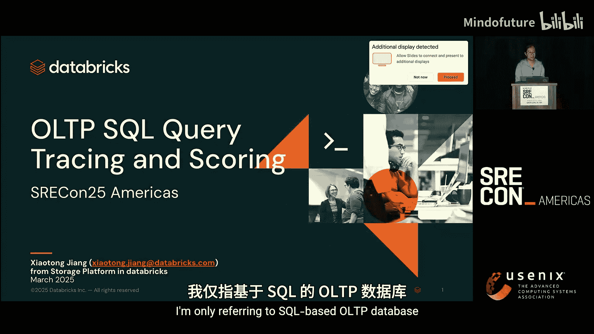
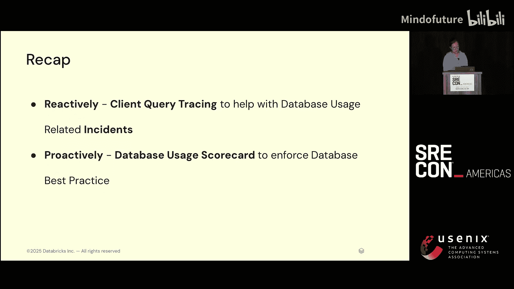
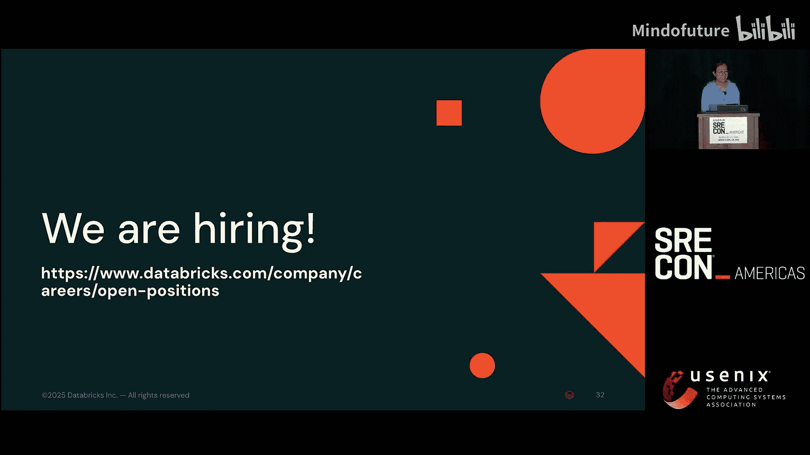

# 043：OLTP SQL数据库查询追踪与评分 🛠️


在本教程中，我们将学习如何通过客户端查询追踪和预检评分，来主动与被动地管理大规模OLTP SQL数据库的使用，从而提升系统可靠性和性能。

---

## 概述 📋



在Datas公司，由于产品的高速增长，我们管理着数千个跨区域、跨云、多引擎的数据库实例。这些实例具有多样且快速变化的数据库使用模式，并采用多租户架构。数据库并非万能，不当的使用模式（如查询分布变化、优化器选择次优执行计划）常常导致事故。传统的数据库监控工具（如Percona、MySQL Performance Schema）主要从服务器端提供聚合视图，但在处理多租户环境下的使用相关事故时，缺乏**客户端上下文**信息，这限制了根因分析的效率。

因此，我们发展了一套结合**被动响应**（事故处理）和**主动预防**（代码合并前拦截）的解决方案。被动响应方面，我们通过客户端查询追踪，在事故发生时快速定位问题租户或查询；主动预防方面，我们在CI/CD环节引入查询评分机制，阻止不良模式进入生产环境。

---

## 挑战与现有工具的局限 ⚠️

上一节我们概述了大规模数据库管理面临的复杂性。本节中，我们来看看具体挑战和传统工具的不足。

我们面临的核心挑战包括：
*   管理数千个跨区域、跨云、多引擎的数据库实例。
*   应对多样且快速变化的数据库使用模式。
*   在多租户架构下，一个租户的昂贵查询可能影响共享同一物理数据库的所有其他租户。

现有工具（如Percona Monitoring and Management, MySQL Performance Schema）非常出色，它们提供了查询级别的资源消耗聚合视图。然而，在处理数据库使用相关的事故时，它们通常不够用，因为其视角主要集中在**数据库服务器端**。

**缺失的关键是客户端上下文。** 这对于多租户环境尤为重要。例如，当多个租户共享一个数据库，且其中一个租户发出昂贵查询导致整体负载升高时，从服务器监控只能看到全局负载上升，难以直接定位到具体的责任租户。

---

## 解决方案一：客户端查询追踪 🔍

认识到客户端上下文的重要性后，我们引入了客户端查询追踪。这为事故响应提供了丰富的维度信息。

通过客户端查询追踪，我们可以在查询中携带自定义标识（如租户ID、API名称），从而能够按这些自定义维度进行聚合分析。如下图所示，X轴是时间，Y轴是数据库耗时，色块按自定义ID切片。我们可以清晰地看到是哪一个色块（即哪一个租户或API）对数据库时间的增长贡献最大。

```
[示意图：一个随时间变化的堆叠面积图，显示不同自定义ID对数据库耗时的贡献。其中一个色块在事故期间显著凸起。]
```

凭借这些信息，我们可以在事故期间快速采取行动（如对问题租户进行限流），并在事后修复有问题的查询。这种灵活性为我们提供了宝贵的洞察，并在处理数据库使用相关事故时被证明非常有效。

---

## 从被动到主动：预合并查询评分 ✅

虽然查询追踪在事故响应中很有用，但这毕竟是一种事后补救。我们的目标是防止新的不良模式进入生产环境。因此，我们将目光投向了开发流程的更早阶段——代码预合并的CI环境。

我们的理念是**偏向可靠而非性能**。我们认为某些查询模式根本不应该被提交。以下是我们不希望出现的几类查询：

以下是我们在CI环境中通过查询评分主动禁止的一些不良模式：

1.  **不可预测的查询**：如果查询的执行计划不可预测（例如，优化器可能选择次优索引），我们应该通过强制使用索引或调整查询结构来固定执行计划。
2.  **过于复杂的查询**：这通常意味着将业务逻辑嵌入了SQL中，这些逻辑应该卸载到应用程序层处理。
3.  **可被重写为更高效形式的低效查询**：它们能产生相同结果，但消耗更多资源。
4.  **没有超时限制的查询**：可能导致长时间挂起。

为此，我们在数据库客户端的CI流程中引入了**基于规则的查询评分机制**。它会扫描CI环境中的所有查询，对不良模式发出早期警告，从而防止反模式被合并到代码库中。

---

## 查询评分实战示例 🚫

让我们通过几个具体例子，看看查询评分如何拦截危险查询。

**示例一：危险的 `SELECT ... FOR UPDATE`**
假设有如下查询和表结构：
```sql
-- 被评分为不良的查询
SELECT * FROM orders FOR UPDATE WHERE a=1 AND b=2 AND d=3 LIMIT 1;

-- 表结构
CREATE TABLE orders (
    id INT PRIMARY KEY,
    a INT,
    b INT,
    c INT,
    d INT,
    KEY idx_ab (a, b)
);
```
**问题**：该查询在`a`和`b`列上有索引，但`d`列没有。如果匹配`a=1 AND b=2`的行有20万条，而满足`d=3`的行只有0条，数据库为了找到这“不存在”的一行，需要**扫描并锁定**这20万行（尽管有`LIMIT 1`）。这曾导致数据库性能下降600倍。
**修复**：对于`SELECT ... FOR UPDATE`，应始终使用**点查**（即通过完整覆盖主键或唯一索引来精确锁定）。应修改查询，确保`WHERE`条件能利用合适的索引进行精确查找。

**示例二：不可预测的索引选择**
```sql
-- 被评分为不良的查询
UPDATE users SET status='inactive' WHERE b=1 AND c=2;

-- 表结构
CREATE TABLE users (
    id INT PRIMARY KEY,
    b INT,
    c INT,
    status VARCHAR(10),
    KEY idx_b (b),
    KEY idx_c (c)
);
```
**问题**：此`UPDATE`语句的`WHERE`条件涉及`b`和`c`列，数据库优化器可能选择索引`idx_b`或`idx_c`。在生产流量下，优化器可能突然切换索引，而新索引的性能未经测试，存在风险。在一次真实事故中，类似的查询导致优化器选择了全表扫描（1亿行），期间所有写操作均失败。
**教训**：不要完全信任优化器。
**修复**：创建一个复合索引`(b, c)`，或使用索引提示明确告诉优化器使用哪个索引。

查询评分还会检查其他模式，例如：`DELETE/UPDATE`操作必须与索引和`LIMIT`结合使用、禁止全表扫描和全索引扫描、禁止无索引查询等。

---

## 演进：统一的数据库使用评分卡 📊

数据库使用不仅关乎查询，还涉及流量、表结构（Schema）和数据分布，它们紧密耦合。因此，我们的下一步是构建一个**统一的数据库使用评分卡**。

我们整合了本教程中涵盖的所有组件：
1.  **全链路追踪**：追踪查询从预合并到生产环境、从数据库客户端到数据库服务器的全过程。
2.  **模式（Schema）追踪**：将同样的理念应用于数据库表结构，从设计到上线全程跟踪。

一个数据库所有者可以获取其数据库的综合评分。评分维度包括：
*   **流量**：查询是否没有设置超时？是否从未在CI中测试过却在生产运行？
*   **查询**：查询是否没有命名（难以追踪）？是否需要检查过多行才能返回一行结果（资源消耗过大）？查询成功率是否过低？
*   **表结构（Schema）**：检查多项规则，例如：
    *   表是否没有主键？
    *   是否有过多或重复的索引？
    *   是否使用了无边界、可能随机暴增的列类型？
    *   读写放大比是否异常（可能表明数据模型设计不佳）？

此外，我们还在尝试将成本、数据分布和数据库弹性等更多维度纳入评分体系。

数据库使用评分卡大致如下图所示，每个数据库都会有一个总分，并分解到流量、查询、表结构等不同维度。
```
[示意图：一个评分卡面板，显示数据库名称、总体健康分数，以及流量、查询、Schema等子项的分数和详情。]
```

所有这些评分卡数据以及客户端查询追踪功能，都构建在Databricks的产品之上。作为Databricks的客户，你也可以快速构建类似的解决方案。

---

## 总结 🎯

本节课中，我们一起学习了如何通过结合被动响应和主动预防两种策略，来管理大规模OLTP SQL数据库的使用。



*   **被动响应**：通过**客户端查询追踪**，在发生事故时提供丰富的客户端上下文（如租户ID、API），帮助我们快速定位根因，这已被证明非常有效。
*   **主动预防**：通过**数据库使用评分卡**，在代码预合并的CI阶段就执行数据库最佳实践，从流量、表结构和查询等多个维度进行约束。




这两者共同为我们的数据库最佳实践提供了保障，使我们能够通过这套机制有效管理上百个服务团队。