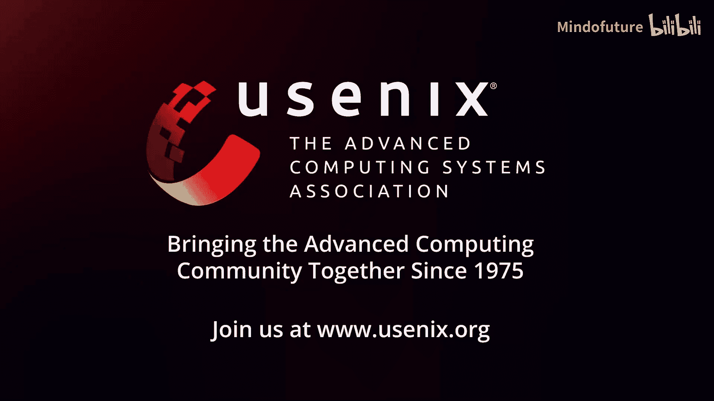

# 044：将移动端纳入可靠性视图 🚀

## 概述

在本节课中，我们将探讨如何将移动端数据纳入系统可靠性工程实践中。我们将了解为什么仅关注后端服务不足以反映真实的用户体验，并学习如何通过移动端可观测性来构建更完整的系统视图。

---

## 为什么需要移动端可观测性？🤔

上一节我们概述了课程目标，本节中我们来看看为什么移动端数据至关重要。

你是否见过这样的系统视图？一个非常简化的系统视图可能如下所示：可靠性团队关注他们的服务、运行时间、各个组件如何通信、传入的请求和传出的响应。服务可能具有高达99.999%的可用性，一切都在服务等级目标内。这似乎意味着每个人都很满意。

但是，这里缺少了什么？当我们谈论“每个人”时，很可能指的是“人”，即用户。在每一个额外的“9”背后，可能都有一位用户正盯着手机，感到沮丧。你是否在了解他们是否满意？

因为用户体验发生在用户所在的地方。它可能是用户无法完成的支付，或是无法点赞邻居家小狗的照片。用户感知到的体验发生在客户端，尤其是移动设备上。这就是用户体验。如果你没有提供出色的用户体验，怎么能说你的技术栈对用户是成功的呢？

当我们谈论好的或坏的用户体验，或反映这些体验的服务等级目标时，它们并非在服务层被体验。用户体验有点像你整个系统的倒影，因为它发生在客户端。那个客户端可能是系统中每一个服务、数据库、组件、管道、牙签和胶带的最终结果，但你必须在那个系统的末端取得成功，因为那是用户所在的地方。

因此，存在大量你可能尚未收集的信息。不仅仅是按钮点击和滚动，还有一系列与客户端特定问题相关的交互，这些问题影响着个人和用户与系统的关系。这是一整盘复杂的问题。

---

## 一个餐厅的比喻 🍽️

让我们从一个小故事开始。

想象一下，你是一名SRE，热爱计算机，但你也喜欢烹饪。如果你开一家餐厅会怎样？你通过服务顾客来赚钱。你的背景是计算机，所以你要确保质量保持在高水平。你会测量各种指标，观察厨房的运作，因为美味的食物加上快速的准备意味着满意的顾客，对吗？

但是，如果顾客入座有延迟，等待很长时间才能有桌子呢？如果服务员态度粗鲁，不以顾客为导向呢？如果酒水定价过高，人们只能选择质量较低、更便宜的酒呢？那么，你会得到这样的评价：“太慢了，服务差，酒水糟糕，再也不来了，一星。”而你的食物可能很美味，上菜也很快。这怎么可能呢？

满意的食客需要的不仅仅是好食物。满意的食客需要良好的整体体验。将这一点转换到我们的世界：满意的用户需要良好的体验，而不仅仅是服务器端的快速处理。

---

## 移动端特有的故障点 📱

上一节我们通过比喻说明了整体体验的重要性，本节中我们来看看移动端特有的挑战。

工作流程从设备开始，也在设备上结束，这中间有大量的失败空间。你的网络请求在发送和接收时可能在后端出现问题。

如果请求从未被你的后端接收到呢？这可能发生。应用可能在发送请求前崩溃。可能存在网络问题，比如DNS问题，或者用户走进了电梯，信号中断了。或者只是应用中的一个错误，导致请求在客户端队列中等待发送，却从未发出。你可能对此一无所知。

但有时你会知道失败，比如请求被延迟了。你知道它失败了，但你知道延迟是否发生在客户端吗？也许只是发送请求花了很长时间。如果客户端存在拥塞呢？杂乱的SDK占用了所有连接，繁忙的后台进程占用了所有CPU核心，导致你的网络请求无法发出。用户体验会很差。

用户可能已经花费数分钟填写了大量表单和操作，才发出一个请求。但你对此并不知情，而用户可能已经感到恼火了。应用中也可能存在错误，因为这种情况时有发生。有时由于优先级难以处理，请求只是排在队列后面。

如果你的服务器记录了200状态码，连接关闭，一切正常，成功，对吗？但如果应用在处理响应时出错了呢？这可能发生吗？反序列化失败经常发生。客户端处理响应可能很慢：反序列化、注入数据库、再取出、重新加载，可能还需要加载一些大图片。整个过程可能花了10秒钟。请注意，在应用上，我们以秒为单位测量延迟。所以，感谢你在后端节省了100毫秒，但用户等待了10秒。

同样，应用中的错误也可能导致问题：我收到了响应，但就是不想显示它，因为界面被折叠了，无法滚动。所以很遗憾，你的用户没有得到满足，而你的后端却说：“给你，成功了。”仪表盘上到处都是绿色。

不幸的是，如果移动应用是用户正在使用的界面，那么在用户数据中心之外存在大量的故障点。

---

## 移动环境的挑战 🌍

上一节我们列举了具体的故障点，本节中我们深入探讨移动环境本身的复杂性。

因为移动环境是一个充满敌意的环境，我们工作的所有东西都是不可预测且充满陷阱的。例如，我之前提到的那些错误。我找到了，15分钟就修复了。很好，部署了。但还要等几天进行QA测试，然后进入Alpha、Beta版。终于可以发布了。发布到应用商店，等待审核，这可能需要三天。然后，终于发布了。等等，不，只是1%的灰度发布，确保没有崩溃。再等24小时。24小时后，错误修复发布了。但是，只有当用户下载了更新，修复才算真正发布。而且，更新的长尾效应非常长，不是所有人都会立即更新。所以，如果你在15分钟内修复了一个错误，可能需要15天才能覆盖到大部分用户。

运行时环境也是不可预测的。有各种制造商生产的各种设备，运行着各种版本的Android或iOS。你能获得多少资源，RAM、CPU周期，取决于操作系统愿意给你多少。如果你走进电梯，没有信号了，请求就失败了。你以为它会工作，它也确实在工作，直到它不工作了。这是因为你无法预测你将在什么环境下运行。

最后，用户对性能的期望差异巨大。我使用一部快速的手机和快速的网络。如果响应时间是两秒，那还可以接受。但如果你用的是一部十年前传下来的旧手机，并且因为身处农场而使用2G网络呢？那么，如果你按下一个按钮，手机旋转了大约20秒然后显示成功，你可能会觉得：“天哪，这工作得真好。”因此，应用性能的好坏取决于观察者，它不是一个绝对的数字。你不能简单地画一条线说这是好性能，那是坏性能。它比那要微妙和复杂得多。

---

## 解决方案：从移动端收集数据 📊

让我们回到我们的故事。你意识到经营餐厅的前厅部分很困难，你更愿意和计算机打交道。让我们转向一个食品配送应用。现在，厨房就是你的数据中心，那是你进行所有检测和测量的地方。

如果在数据中心之外出现问题怎么办？那么，你会失去业务。因为作为一家餐厅，如果你的应用对我来说不能用，我就会使用其他应用，去其他餐厅。最隐蔽的是，你甚至不知道你失去了业务，因为你不知道有人曾试图使用你的应用来订购食物，因为你没有收集数据中心之外的任何信息。

一个快速的解决办法是什么？是的，当然。快速解决办法就是开始检测应用。添加任何检测点。我确信你为产品团队设置了类似分析的工具。所以，就从那里获取一些数据。任何数据都可以。请开始从外部获取一些信息。即使不是超级详细，它至少能为你提供额外的背景信息，告诉你谁在尝试使用你的应用，以及可能是在什么环境下使用的。

从小处着手。但理想情况下，你想要什么？你希望应用像后端一样可观测。这意味着遥测数据。我谈论的不仅仅是设备上操作的速度和日志级别，我谈论的是以用户为中心的遥测数据。你想了解用户的想法和行为，所有带来良好用户体验的性能指标，以及最终的结果：它是否成功了？用户是否在你的应用中停留了足够长的时间以获得价值？遥测数据必须以用户为中心，而不是以机器为中心。

在此基础上，你还需要添加上下文。这就是魔法发生的地方。你为遥测数据添加上下文，就像为强大的进攻线添加了明星球员，你就能在超级碗中创造奇迹。你得到的是真正的移动可观测性，能够回答关于你应用的问题，使用的是你之前未曾预料到的数据。

---

## 行动起来：拥抱移动可观测性 🚀

关于这一切，可观测性并不新鲜，对吧？它已经被使用了很长时间，用于了解应用程序、将系统链接在一起、做出关键决策，基于日志聚合已有二十年了。这很困难，但并不新鲜。

关于前端应用的信息也不新鲜。在任何前端实践中，从一开始，产品团队就总是想要了解应用的信息。他们总是想知道发生了什么，用户做了什么。但开发人员并没有真正有机会去问“为什么”。所以，客户端可观测性的目标是了解用户的“为什么”：发生了什么以及为什么会发生。

但让我们友善一点。这对移动团队来说是新的。在移动领域，没有使用遥测数据来了解应用程序的传统。因为他们为什么需要呢？他们通常只被告知有崩溃发生，有人在应用商店留下了差评，或者CEO不喜欢某个功能。所以他们是反应式的。当你不与最终用户共情时，在生产环境中测量事物是困难的；但当你共情时，如果你还没有锻炼过这块“肌肉”，那就更困难了。移动开发人员还没有让这块“肌肉”工作起来。所以，帮助他们。

移动和前端的遥测数据可以看起来和后端一模一样，只是目前还没有。让你的团队开始使用OpenTelemetry从应用中记录一些东西。找出你应用中最重要的部分何时失败。因为当你在Otel中记录一些东西时，它会看起来像你在系统其他部分收集的其他遥测数据。数据形态会非常相似，只是会包含移动端特定的信息。所以，与系统的其他部分共享这些数据和上下文，将它们全部链接在一起。

然后，教他们如何锻炼你已经熟悉的那块“肌肉”：询问关于系统的问题。你可能不熟悉用户交互的性能数据，但你熟悉在整个系统中关联信息。所以，问一些问题：为什么我无法结账？为什么日本的用户无法登录？应用商店的这些评论是真的吗？还是我们更了解情况？

如果有一个要点你应该记住，那就是：为你自己获取一些“Molly”。移动可观测性非常重要，所以去获取一些。或者更具体地说，不是所有的“Molly”，而是移动可观测性。但“Molly”更容易记住。所以，去获取一些“Molly”吧。

---

## 总结

本节课中，我们一起学习了将移动端纳入系统可靠性视图的重要性。我们了解到，仅关注后端指标无法反映真实的用户体验，因为大量的故障和性能问题发生在客户端。我们探讨了移动环境的独特挑战，如碎片化的设备、不可预测的网络和用户期望的差异。最后，我们强调了通过以用户为中心的遥测数据和OpenTelemetry等工具实现移动端可观测性的必要性，并鼓励团队开始收集和分析移动端数据，以构建更完整、更准确的系统可靠性视图。