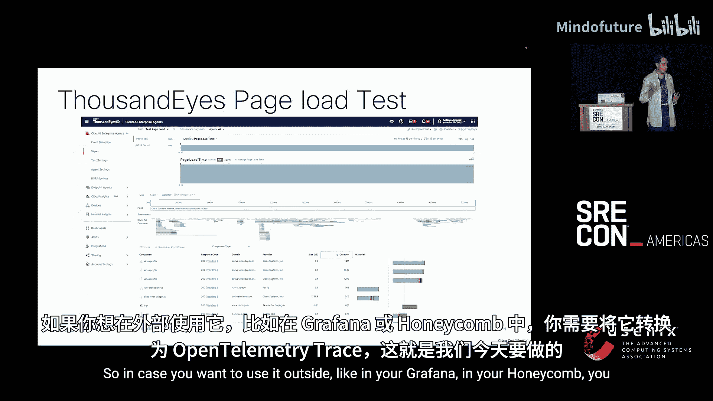
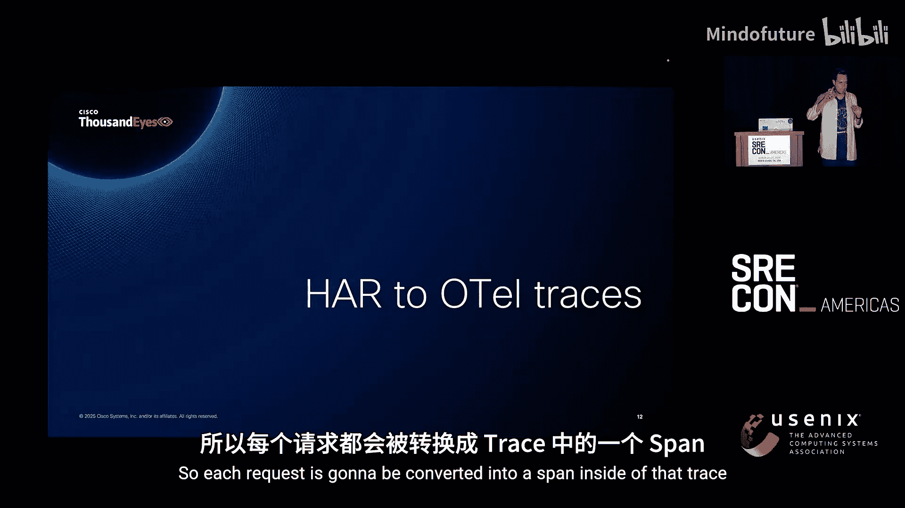
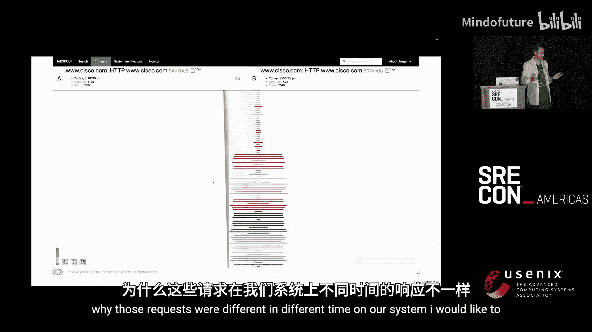
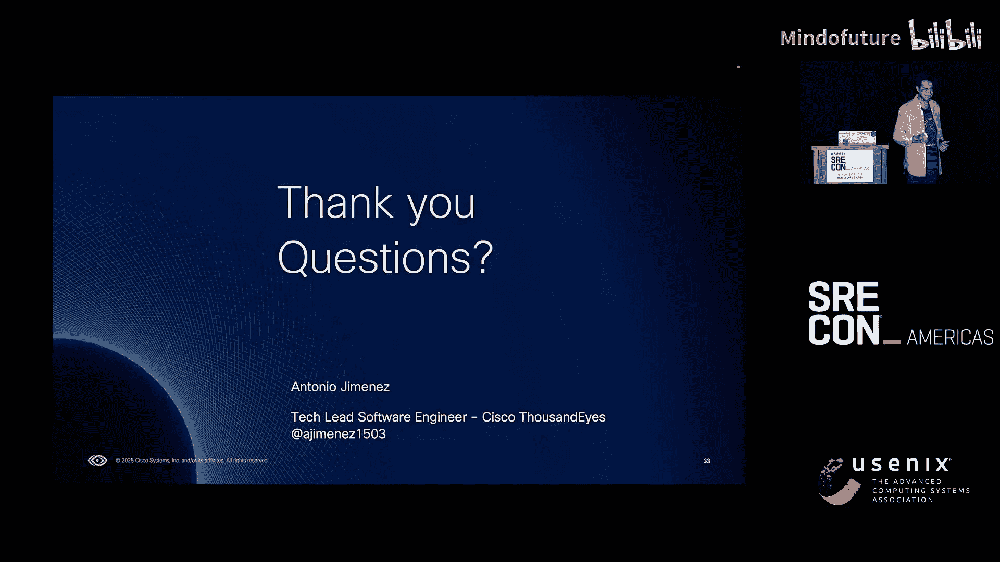

# 045：从HAR到OpenTelemetry追踪

## 概述

在本节课中，我们将学习如何将浏览器网络活动记录（HAR）转换为OpenTelemetry追踪数据，从而提升Web应用的可观测性。我们将介绍OpenTelemetry、HAR文件以及ThousandEyes平台，并详细讲解转换的架构、过程与实际应用。

---

## 课程内容

### 1. 介绍OpenTelemetry 🧩

上一节我们了解了课程主题，本节我们来认识核心工具OpenTelemetry。

当您听到OpenTelemetry时，可能会想到可观测性。它是一个供应商中立的开源框架，用于管理遥测数据。您可以收集来自服务和基础设施的所有遥测数据，进行处理，然后导出到不同的可观测性后端平台。

我的定义是：它是一个开源的可观测性框架，用于管理遥测数据。今天我们将专注于追踪（Traces），但它也包含指标（Metrics）、日志（Logs）等信号，并且正在讨论性能剖析（Profiling）。

谈到OpenTelemetry就不能不提Collector。它就像是遥测数据的主要支柱。Collector允许我们以多种不同的协议和格式接收数据，例如Prometheus、Jaeger、OTLP（OpenTelemetry标准格式）。您也可以查询Prometheus或数据库，甚至从文件中读取数据。然后，您可以在此处理数据：丰富数据、过滤数据。最后，您可以将数据导出到您的可观测性平台，或者写入文件。这完全由您配置。社区已经创建了许多现成的组件，但您也可以构建自己的组件，这并不难，我鼓励大家都尝试一下。

### 2. 认识HAR文件 🔍

上一节我们介绍了OpenTelemetry，本节中我们来看看什么是HAR文件。

有多少人知道HAR或HTTP存档文件是什么？有多少人在过去一周或一个月内使用过它？可能没有。HAR通常是我们用于在本地调试网页的工具。当出现问题时，支持团队可能会要求您：“请发送您的HAR文件，以便我查看发生了什么。”

HAR文件包含了您网页的所有交互信息，即执行的所有请求。它通常是JSON格式，并包含敏感数据，如Cookie、带有电子邮件或密码的请求头等，请务必注意。

HAR文件通常看起来像这样：它是一个JSON格式的文件，包含了加载页面时发出的所有请求信息。您会看到HTTP版本、请求方法、响应代码、URL等数据，这些都非常有用。

### 3. 了解ThousandEyes平台 🌐

现在，让我们将目光转向ThousandEyes。

ThousandEyes是一个用于监控网络的应用。我们监控全球的网络，在全球拥有云代理节点，以及可以在您自己基础设施中部署的企业代理节点，确保您的网络拓扑正常工作。

它是实时的，因为谁希望首先从客户那里得知中断消息呢？这里有一张图片，展示了当前全球的中断情况，例如Monday.com、微软在比利时的问题，您可以看到这个工具多么有用。

现在，让我们重点介绍ThousandEyes中的页面加载测试。

页面加载测试用于模拟网页加载页面时的行为。在这里，我们可以找出页面加载时间、加载完成情况以及加载页面所执行的所有请求。

实际上，HAR就在这里。您在那里看到的是我们以瀑布图形式展示的HAR，但这些数据仅存在于ThousandEyes内部。如果您想在外部使用它，比如在Grafana或Honeycomb中，您需要将其转换为OpenTelemetry追踪，这就是我们今天要做的事情。

### 4. 转换过程：从HAR到追踪 ⚙️

上一节我们了解了数据来源，本节中我们来看看核心的转换过程。

转换过程如下：每个HTTP请求将被转换为追踪中的一个跨度（Span）。

这个跨度将包含以下字段：
*   **名称**：包含请求方法和目标地址。
*   **类型**：始终是“客户端”，因为我们是向服务器、向网页发出请求的一方。
*   **开始时间和结束时间**：这是理解性能问题的关键。
*   **状态**：如果成功则为“OK”，如果出现错误则为“Failed”。
*   **TraceID和SpanID**：由我们自动生成。

本周有一个关于OpenTelemetry语义约定的会议，非常有用。我们使用语义约定是因为它能赋予数据额外的含义。

以下是跨度属性的示例：
*   `http.request.method`
*   `server.address`
*   `server.port`
*   `http.url.full`
*   `http.response.status_code`

如果我们都遵循相同的规则，语义约定将非常有用，并为我们的数据增添额外含义。这就是为什么任何可观测性后端在接收数据时（例如IBM），都能理解这是一个具有以下字段的HTTP请求。

您可能还会想到请求头。OpenTelemetry将其视为可选项。原因是它们可能包含敏感数据，存在泄露风险。您可能想到数据脱敏，但这也可能失败。在ThousandEyes，我们不会流式传输这些请求头，主要是出于敏感数据风险的考虑，而且它们可能非常庞大。我们真正感兴趣的是理解性能问题，而不是发送或接收了哪些请求头。

最后，让我们谈谈资源属性。

资源属性是一种标识产生遥测数据的资源的方式。在这里，我们将资源标识为ThousandEyes测试和运行该网络测试的代理。我们将包含您的ThousandEyes账户ID、测试类型、名称和ID，以及运行测试的代理信息。我们还将包含代理名称、代理位置、代理类型等信息，以及一个永久链接。这在调试问题时非常有用：您不仅可以识别问题，还可以通过永久链接跳转到ThousandEyes，以获取有关该网络问题的完整概览。

我们已经知道追踪的样子，让我们看一个例子。对于资源属性，所有跨度都会包含。对于每个跨度，我们将有时间、名称、跨度属性等。这只是JSON格式，但当您意识到它在您的可观测性后端平台上多么有用时，您就会需要它。

### 5. 系统架构 🏗️

现在让我们深入了解架构。我希望它不会太复杂，但您能理解我们是如何使用它的。

在ThousandEyes，我们的代理生成所有测试数据，这些数据包含HAR。然后，数据被发送到我们的追踪Collector。我们使用OpenTelemetry Collector，实际上，追踪Collector会处理所有数据，并将其发送到集成Collector。在集成Collector中，我们进行路由：决定哪些数据点去往哪个可观测性后端。用户决定特定测试的所有遥测数据去往哪个后端，他们创建集成来建立这种连接。

让我们放大一点看。数据从Kafka接收，我们将其从HAR转换为OpenTelemetry追踪。然后，数据进入处理器，我们过滤掉不会被发送到任何地方的数据。请记住，ThousandEyes运行着成千上万个测试，数百万个代理，因此我们需要过滤掉不需要的数据。在属性处理器中，我们会丰富数据。我们最初只接收测试ID，但我们还需要知道测试站点、测试名称、代理位置等信息。这些信息对于了解问题是仅发生在旧金山，还是西班牙也有问题，至关重要。之后，出于性能原因，我们会将数据批量处理。然后，我们将其导出到集成Collector。

集成Collector将处理这些数据点。处理时，一个数据点可能会被发送到两个可观测性后端，以实现冗余，或者因为您正在进行迁移，或者任何其他原因。我们需要复制该数据点，并添加一个新的属性：集成ID。

在OTLP路由（OTLP导出器的一个扩展）中，我们决定：这个数据点属于那个集成，它将去往那个可观测性后端，比如Grafana；另一个去往Honeycomb；还有一个去往IBM Instana。您会意识到我们需要路由这些数据。

回顾一下，我们在Collector中还有扩展的概念。扩展是可以通过Collector所有管道访问的组件。这里我们有健康检查（在Kubernetes中，您需要知道Collector何时准备就绪）、存储扩展（我们从元数据服务获取所有集成、测试、代理的数据，并存储在缓存中）。我们还有Pub/Sub系统，我们在此发布数据，并从其他组件接收数据。例如，每当数据点被过滤掉时，我们就会向这个Pub/Sub系统发送事件，然后在指标扩展中，我们接收该事件并递增计数器。我们还有Sentry，用于捕获所有的panic或Go错误。指标扩展则用于监控我们自己的可观测性系统，我们了解关于数据过滤、接收、发送和导出等的所有指标。

我想强调一点，我忘了说明为什么我们有两个Collector而不是一个。首先，当然是因为它们属于不同的业务领域：第一个是追踪领域，负责处理追踪数据和转换；第二个是集成领域。其次，它们的扩展规模不同。追踪Collector的扩展取决于我们从测试中接收的数据量，而集成Collector的扩展取决于用户创建了多少集成。

### 6. 演示：实际应用 🎬

让我们进入演示环节，看看实际效果。

我们将创建一个ThousandEyes测试，该测试将访问Cisco.com，加载Cisco.com网页。这个测试将为我们提供加载Cisco.com页面所需的时间、完成错误（如超时），当然还有我们的HAR。HAR包含加载该网页所需的所有请求，但这些数据只存在于ThousandEyes内部。如果您需要将这些数据用于其他地方，您无法直接获取。这就是我们使用OpenTelemetry追踪的原因。

现在，我们将创建一个集成来决定：来自该测试的数据，我想发送到Jaeger。我进入OpenTelemetry集成，选择我的目标，选择类型为“追踪”，选择测试，然后创建它。现在，所有数据都将流向Jaeger。

在Jaeger中，您可以可视化所有追踪。一个追踪看起来会是这样：所有请求将作为不同的跨度出现。对于每个请求，您将拥有我们之前提到的信息：资源属性（标识ThousandEyes）和跨度属性（标识特定请求，如响应代码和HTTP方法）。所有这些信息都会显示在那里。

我们还可以查看单个跨度的截图，并逐一检查。在文本中，我们将看到，如前所述，请求方法（例如GET）、响应代码（200）、我们访问的服务器地址、服务器端口、类型和URL。对于每个单独的请求，我们都会有这些信息。然后，对于进程标签（在Jaeger中这样称呼），也就是资源属性，它标识了ThousandEyes：您的账户、数据模型版本、永久链接、您的代理、您的测试，所有这些信息都在那里。

这很酷，但我们如何利用它呢？每个可观测性平台都有自己的优势。我只是用Jaeger做演示，但在这里我们可以做这样的事情：例如，只筛选出有错误的追踪（即页面加载出错的追踪），然后您会看到所有有错误的追踪，这多么有用！然后您可以深入查看，发现加载Cisco.com时出现了错误请求，就在那个特定的跨度、那个特定的请求中。现在，您将看到您的客户实际面临的情况。

另一个用例是时间分析：为什么有些页面加载需要5秒，而另一些需要7秒？可观测性平台的另一个优点是您可以比较两个追踪。您可以说：“这个追踪花了5秒，而另一个花了7秒，差异很大。为什么会这样？” 然后您可以进行比较，发现一个追踪有210个跨度，而另一个有245个。为什么它们不同？现在您可以逐一检查，理解为什么这些请求在我们的系统中花费的时间不同。

### 7. 经验总结与回顾 📝

我想以这个项目的经验教训来结束本次演示。

关于追踪，每个人都在谈论微服务以及它们如何相互连接，但还有许多其他用例。这只是另一个用例：我们可以将HAR转换为OpenTelemetry追踪并进行调试。

关于OpenTelemetry，有一个庞大的社区在努力使其变得更好，他们非常乐于助人。您可以向他们提问，可以在GitHub上创建问题，我们甚至为我们发现的一些问题做出了贡献。

关于Collector，之前有一个会议讨论过它，它是一个成熟的产品。开始时创建处理器、接收器可能很困难，但一旦您创建了一些，它们就能完美地协同工作。它运行得非常好，我真心鼓励大家都去尝试。

最后但同样重要的是，我们最初的关键信息是什么？我们希望改进对系统的监控，我们希望识别错误，我们希望更深入地了解我们的Web应用。

---

## 总结

本节课中，我们一起学习了如何通过将HAR文件转换为OpenTelemetry追踪来增强浏览器可观测性。我们介绍了OpenTelemetry框架、HAR文件格式、ThousandEyes平台的作用，并深入探讨了转换的架构、数据处理流程以及在实际监控、调试和性能优化中的应用价值。通过利用OpenTelemetry的标准化和强大社区，我们可以更有效地监控Web应用性能，快速定位问题。