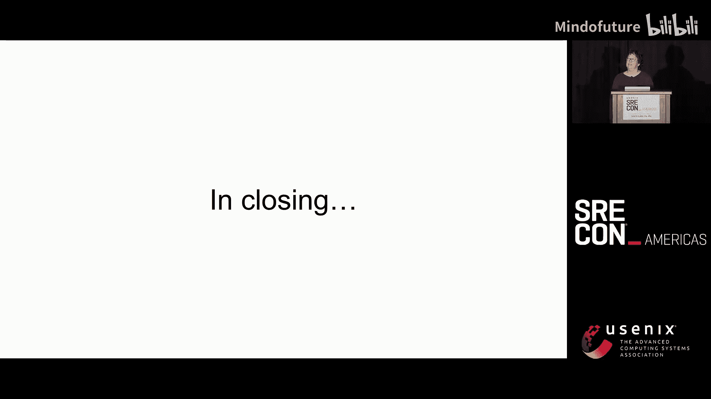
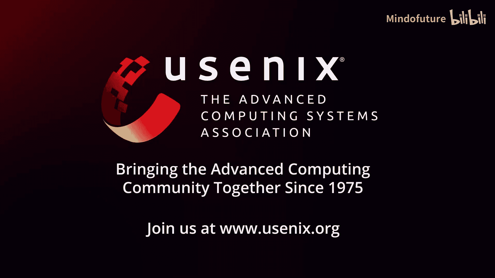

# 046：理论构建与实践 🏗️

在本节课中，我们将学习如何将技术债务视为一种理论构建和实践的过程。我们将探讨技术债务的本质，并学习如何运用隐喻来更好地理解和沟通它，从而制定有效的应对策略。

---

## 概述

技术债务是软件开发中一个普遍且令人头疼的问题。我们常常感觉它阻碍了我们的工作，却又难以向他人解释清楚其重要性和紧迫性。本次分享将不会提供“一个神奇的技巧”来消除技术债务，而是专注于如何构建我们自己对技术债务的理解模型，并利用这种理解来更有效地沟通和行动。

---

## 演讲者背景与视角

我是Yvonne Lamb，一名工程师。我既尝试解决技术债务，也常被同事视为能解决技术债务的人。我的经验主要来自规模在40到400人之间的科技初创公司，而非大型科技企业。

我的个人视角受到两项爱好的影响：赛艇和直言不讳的性格。作为赛艇手和舵手，我学会了在无法直接沟通的情况下与他人协调。而“灾难性的直率”则让我习惯于清晰地表达复杂想法。这些经历塑造了我看待协作和沟通的方式。

---

## 技术债务：一个难以言说的问题

我们很容易在非正式场合（比如会议酒吧）对技术债务高谈阔论。然而，当我们需要向有决策权的人解释“为什么需要解决它”时，却常常语塞。我们可能会陷入两种不理想的反应：
1.  简单地说“因为它很糟糕”。
2.  或者，陷入技术细节的泥潭，让听众感到困惑。

这两种方式都难以促成有效的对话和行动。问题的核心在于，我们常常跳过“自己先想明白”这一步，直接试图用他人（如业务方）的语言去填充一个“表格”，而缺乏一个能让自己信服的、清晰的思考框架。

---

## 技术债务概念的起源

技术债务（Tech Debt）这个概念通常被认为是由Ward Cunningham在1992年提出的。当时他正在为一个金融服务公司开发Smalltalk项目，并深受《我们赖以生存的隐喻》一书的影响。

他使用“债务”这个金融隐喻，是为了向非技术人员解释：为了快速发布产品而编写“不够完美”的代码（举债）可以加速开发，但之后必须通过重构来“偿还”这笔债务，否则将持续支付“利息”——即未来每次修改时都要付出的额外精力。

一个更宽泛的定义来自Jean Kim：**技术债务是当你下次想去修改某些东西时，所感受到的所有阻碍**。这一定义捕捉了技术债务带来的挫败感，但可能过于强调“过去做错了什么”。实际上，很多技术债务只是随着时间和需求变化自然累积的，当初的决策在彼时可能是合理的。

---

## 作为社会概念的技术债务

技术债务是一个“社会概念”——在一个社群（如工程师群体）中，我们大致理解它指的是什么，并共享一种“这是个问题”的共识。然而，它并非一个具有精确操作定义的魔法词汇。不同组织、不同团队对“什么是技术债务”以及“哪些需要优先处理”的看法可能大相径庭。

因此，我们不能仅仅抛出“技术债务”这个词就期望获得资源和支持。我们需要做“准备工作”：深入理解特定的技术债务，并找到一种能向不同受众有效传达其影响和解决方案的方式。

---

## 一个新的思考隐喻：家务劳动

我主张使用**家务劳动**作为思考技术债务的隐喻。这不一定是你最终用于说服他人的那个比喻，但它可以是一个强大的内部思考工具，帮助你理清利害关系、评估各种方案。

为什么是家务劳动？因为**技术债务和家务劳动都具有基础设施的特性**。社会学家Susan Leigh Star总结了基础设施的几个关键属性，它们同样适用于技术债务和家务：

1.  **嵌入式**：嵌入在其他结构、社会安排中。
2.  **透明性**：在正常运作时不可见，只在“故障”时显现。
3.  **范围广**：其影响超越单一地点或事件。
4.  **通过实践学习**：成为某个实践社群的一员后才会掌握。
5.  **路径依赖**：建立在已有的实践和决策之上。
6.  **通过标准/约定与其他设施联结**。
7.  **模块化修复**：通常被一点一点地修复，而非一次性重建。

金融隐喻（债务）在某些场景（如金融科技公司）可能更直接有力，因为它有成熟的记录、法规等基础设施支撑。而技术债务则缺乏这种清晰的“记账”体系。家务劳动隐喻则更贴近我们维护复杂、持续运行的系统的日常体验。

---

## 案例解析：从家务看技术债务

以下是几个通过家务劳动类比来理解技术债务具体形态的例子。

### 1. 更换马桶：人们需要看到积极的变化

**家务故事**：我家有一个老式马桶，不节水，但我们总觉得“没有好时机”更换它。直到侧下水道破裂，不得不进行大规模维修。在工程尾声，我们决定让工人顺便安装一个新马桶。虽然主要工程是修下水道，但新马桶这个“看得见的改进”让巨大的花费感觉更值得。

**技术债务故事**：在Chef，我们团队的首要项目是重建标准化构建管道。然而，内部用户最关心的是“能获得对外发布的软件包仓库”。虽然包仓库并非我们工作的核心目标，但意识到这一点后，我们将其作为项目的重要成果来沟通和交付，这极大地提升了内部客户的满意度和耐心。

**核心要点**：
*   进行基础设施或技术债务相关工作时，为内部客户找到一个他们能感知的“胜利点”至关重要。
*   这并不意味着要做额外的工作来制造“新功能”，而是找到你正在做的工作中，那些能直接改善他人体验的部分，并清晰地传达出去。

### 2. 冰箱与路径依赖：有些决定早已注定

**家务故事**：老冰箱坏了，我们发现现代美式冰箱体积太大，无法通过1947年老房子的门。最终只能选择一款昂贵的进口澳洲冰箱，它甚至太高，迫使我们拆除了橱柜。安装的便利性被多年前的房屋结构决策所限制。

**技术债务故事**：我们继承了一个难用的软件包仓库。交接时得知，当初选择它仅仅是因为“它用Helm图表部署很方便”。后来才发现它本质上是为镜像仓库设计的，删除包极其困难。等我们接手时，所有关键的技术选型决策都已无法更改。

**核心要点**：
*   许多技术债务的根源在于早期的、具有路径依赖性的决策。
*   意识到这一点后，我们可以更主动地记录和说明我们创建的服务的**设计意图和边界**，防止后人将其误用于不合适的场景。

### 3. 奇怪的壁橱：我们必须一次性全部修复吗？

**家务故事**：我家有一个80年代私自扩建的壁橱，位置不佳、保温差、电路危险。完全重建它是一个大工程。我们的策略是：在进行其他房屋维修时，顺带解决与之相关的问题，比如修补屋顶、增加防水层。我们持续关注这个问题，并寻找模块化修复的机会。

**技术债务故事**：在Chef，我们需要将构建环境从老旧、耗能的Solaris机器迁移到新硬件。一个关键问题是：新硬件生成的二进制文件能否向后兼容到更旧的Solaris 10 U1？没人知道是否有客户还在用这个版本。我们兵分两路：一路研究技术可行性，另一路（我负责）竭力调查“是否真有此需求”。这个过程揭示了公司内部在客户使用情况追踪上的诸多信息盲点。

**核心要点**：
*   面对复杂的技术债务，要持续追问两个问题：**我们真的必须做这件事吗？** 以及 **我们能做到吗？**
*   保持对“问题空间”的关注——即理解用户及其上下文的全貌，而不仅仅是表面需求。
*   技术债务的修复往往是渐进和模块化的，而非一蹴而就。

### 4. 香料架：为事物找到归属地

**家务故事**：我不需要完美的香料架。我的解决方案是把香料放在橱柜门上的罐子里，顶部贴上标签。它不完美，但每种香料都有固定的、易于找到的位置。关键在于“为物品建立一个家”。

**技术债务故事**：Etsy的“Deployinator”系统。他们并没有先构建一个完美的部署系统和UI，而是先建立了一个前端（UI）和后端（引擎）的清晰边界。前端满足了工程师日常部署的急需，而后端的复杂重构则可以在此基础上稳步进行。

**核心要点**：
*   处理混乱（无论是杂物还是代码）的有效方法不是追求完美，而是**为事物建立清晰的归属和接口**。
*   通过定义清晰的边界和接口，可以将庞大、混乱的问题分解为可管理的部分，并优先解决阻碍当前工作的部分。

**一个反面教材**：如果不与相关方沟通并达成共识，就制定一个庞大的、一蹴而就的技术债务清偿计划，结果可能像一只被剃光毛的猫——看似解决了问题，实则带来了新的痛苦和不适。不要这样做。

---

## 总结：理论作为解放性实践

本节课中，我们一起探讨了技术债务的本质，并引入了**家务劳动**作为思考它的一个丰富隐喻。我们通过多个案例看到，技术债务与家务劳动一样，具有**基础设施**的特性：嵌入式、透明、范围广、路径依赖。

使用这样一个隐喻，不是为了直接说服你的项目经理或老板，而是为了**帮助你自身进行理论构建**。它为你提供了更多“把手”，让你能更清晰地分析特定技术债务的利害关系、可能的解决路径以及沟通策略。

技术债务的讨论常常伴随着强烈的情绪，这某种程度上是对抗**熵增**（系统趋向混乱的自然规律）的挫败感。拥有一个自己的理论模型，就像数学家面对混沌数据时一样，能让我们在无序中看到模式，在起点上重获认知的快乐。

最后，引用剧作家汤姆·斯托帕德《阿卡迪亚》中的台词：“未来是混乱的……当你以为你知道的一切几乎都是错的时候，这是活着的最好时代。” 拥抱这种复杂性，用我们构建的理论来指导实践，正是管理技术债务的核心。

---
**本节课中我们一起学习了：**
1.  技术债务沟通的难点在于缺乏有效的个人思考框架。
2.  Ward Cunningham提出的“债务”隐喻有其特定背景。
3.  技术债务是一个需要具体化的“社会概念”。
4.  **家务劳动**是一个有用的思考隐喻，因为它和技术债务共享**基础设施**的诸多属性。
5.  通过多个类比案例（马桶/冰箱/壁橱/香料架），我们学习了如何分析技术债务的 stakes、路径依赖、修复策略和优先级。
6.  最终目标是构建个人化的理论模型，以更清晰、更有力地进行沟通和决策，将应对技术债务视为一种“解放性实践”。