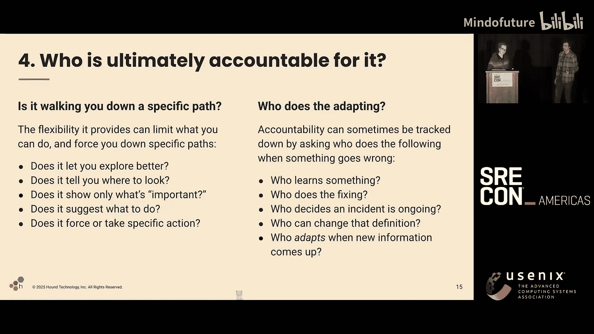
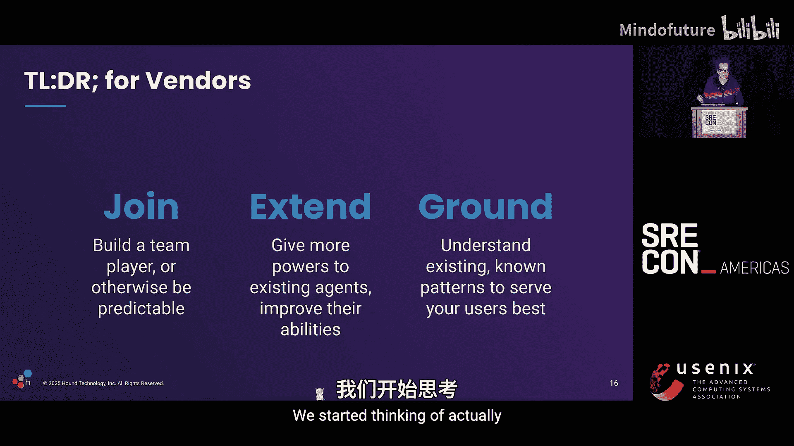
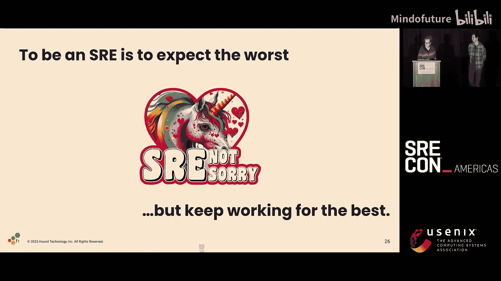
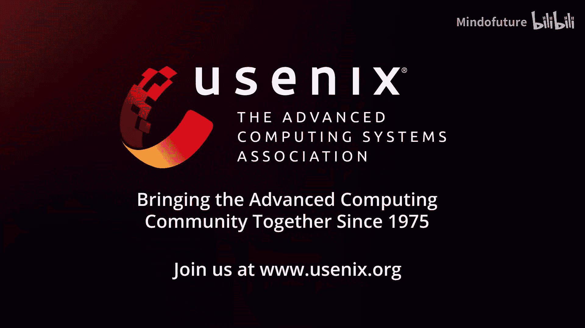

# 047：AIOps - 证明它！致SRE AI产品供应商的一封公开信 📝

在本节课中，我们将学习如何批判性地评估那些声称能为SRE（站点可靠性工程）工作带来变革的AI产品。我们将探讨如何区分营销炒作与实际价值，并学习一套实用的提问框架，以确保引入的自动化工具能真正增强团队能力，而非削弱它。

---

感谢精彩的介绍。也感谢Fred的参与。

现场有多少人看到这个主题时心想：“天啊，又是关于AI的演讲。”没关系，这是一个安全的空间，你可以不喜欢它。我最初也持怀疑态度，这是我的默认立场。但在AI这件事上，我经历了一段漫长的旅程。

我知道我不是这里唯一有这种感受的人。市场上充斥着大量炒作。对我们这类人而言，我们的超能力之一就是对炒作极为反感。但在炒作之下，现实是，这是一种新型计算机的诞生，许多事情正在改变，这也是我认为它如此重要的原因。

我们需要随之做出一些改变。这次演讲的起源，是《Sssri Weekly》的Lex Neva与我谈论他每天如何收到供应商推销其AI SRE产品的宣传，这些宣传读起来就像广告。Lex会回复他们，要求对方“拿证据给我看”，但之后就再也没收到回音。他写了一封精彩的公开信，我鼓励大家去读一读。链接已附上。他基本上是说，赢得SRE信任的方式是提供实例和数据。让我知道你也了解这个产品可能如何失败。同样，他再也没有收到回复。

在这篇博文发布后不久，Lex就去Nvidia工作了。所以现在他赚了很多钱，拥有很多GPU。这就是为什么我亲爱的朋友Fred今天和我一起做这个演讲。

我上网查看了所有AI产品的宣传和它们做出的承诺。我看到诸如“这将成为你的新SRE伙伴”、“它能回答所有问题、审查代码、主动监控和预警”、“自适应学习和零维护机制，减少救火工作”、“快速自动根因定位”、“全面理解应用、找到根因、建议修复、生成事件后分析”、“AI SRE将从监督工作转向非监督工作，最终自主完成大部分工作”等说法。

这很有趣，对吧？正如记者们所说，这其中有“部分真实”，或者像我们说的，是“大话”。当我和Lex讨论这些时，我开始产生一些回忆。我意识到，在Honeycomb的前三四年，我一直打开着John Allspaw的一篇名为《致监控和告警公司的公开信》的博文标签页。其中写道：“这永远是一个未解决的问题。不要告诉我你的软件将如何为我解决它。告诉我你正在努力打造一个产品，它将作为出色的团队成员加入我的团队。告诉我你正在构建的东西将如何让我的人变得更好。”这显然对我们Honeycomb正在构建的一切产生了巨大启发。但今天，十有八九，它依然能引起共鸣。我真的很想看到一封致所有AI SRE和AIOps公司的公开信，因为它太有共鸣了。

这并不是说十全十美，但十有八九，当你听到人们感到焦虑和不安时，对我来说，一个非常有用的测试方法是将“AI”替换为“自动化”。因为很多东西实际上并不新鲜，它只是自织布机发明以来我们一直在应对的问题的加速版本。

有趣的是，进行这种替换后，我们在实践中部署自动化方面拥有丰富的经验。因此，有一系列问题我喜欢问自己，我认为每次面对新的自动化任务时，我们都应该问自己这些问题，这套问题对于AI智能体（尤其是那些号称“根因即服务”的）同样非常有效。

## 关键提问框架 🔍

上一节我们提到了用“自动化”的视角来审视AI炒作。本节中，我们来看看一套具体的问题框架，帮助你在评估AI工具时保持清醒。

以下是评估AI工具时需要问的几个核心问题：

1.  **你是在监督，还是在被增强？**
    我们都见过类似特斯拉自动驾驶汽车的模式，你需要把手放在方向盘上，否则它就会停止工作。你的工作是确保汽车不犯错，但人们不喜欢这样。网上有视频显示，人们用橙子或水瓶卡住方向盘，然后就可以在汽车自动驾驶时看电影。我们知道这种监督模式效果不佳。无论是特斯拉自动驾驶、飞机，还是80年代Bainbridge发表的“自动化的讽刺”，甚至当你只是看着代码说“是、否、是、否”时，你都是监督者，被排除在主动工作之外。这一切都回到了所谓的“Fitts列表”概念，即人类擅长一件事，机器擅长另一件事，所以让机器做它擅长的，让人做他擅长的，但这通常让你处于监督的位置，拥有机器所不具备的判断力。这是错误的。我们寻找的应该更像一个团队合作的联合系统。机器应该赋予人类更多能力，而人类则引导机器走向正确的方向，但我们都被困在同一个系统中。一个带有文字的笔记本也是这个系统的一部分。这是我们做决策、沟通和工作的方式，人们需要参与其中以保持对现状的了解。

2.  **你在循环中的哪个位置？**
    你在AI前面还是后面，结果会不同。如果你在AI前面，你会得到与在AI后面监督不同的结果。如果一个三人团队做决策，他们的工作方式会与单人不同。如果你在团队中加入一个AI，情况又会不同。当有人告诉你“有人参与循环”时，问问这个“人”在循环的哪个位置。否则，你可能只是决策的替罪羊，而不是真正与AI组成团队的一部分。

3.  **它基于哪些视角？**
    每个智能体都有一个有限的认知范围。David Woods讨论过这一点。存在局限性。如果你的AI只接入系统的可观测性数据和组件数据，它永远不会给出诸如“如何重组你的团队结构”这样的建议。它不了解你的团队。因此，这些是固有的限制。同样，它在操作上也会受到限制，就像你可以限制系统中用户的权限一样。它将不了解你的社会技术系统中的主要部分，它会忽略其中的许多部分。这带来的风险之一是，如果你拥有的东西被设计成看起来和行为都像一个智能体（一个你可以与之交谈并完成所有事情的人），但它只有有限工具的能力，那么你就拥有了错误的接口。这就是为什么这里的图片是用PlayStation 5手柄骑自行车。我们经常被推销的就是这种东西：拥有工具的能力，却披着与人交谈的接口外衣，这极具误导性，并包含固有风险。

4.  **它是让你越用越好，还是越用越差？**
    另一个问题是，它兑现承诺的能力如何？没有什么东西能完全兑现承诺。这就是营销和工程是两个非常不同的部门的原因。即使你需要它完美，它也不会完美。事件响应中一个常见的比喻是“英雄”，即那些习惯于进行紧急救援的人。他们对系统了如指掌，最终成为所有紧急情况中非常关键的单点瓶颈。他们不能去度假，不能结婚度蜜月。问问我在夏威夷海滩上凌晨3点接到CTO电话是什么感觉，就因为MongoDB起不来。这对人来说是一个巨大的反模式，对AI智能体来说也将同样严重。如果你的智能体正在处理某些类型的问题并处理所有问题，它们是否会变成“英雄”？如果它们崩溃或行为不当，而你的员工不再知道如何调试，你该怎么办？

5.  **谁最终负责？**
    当你使用某种技术解决方案时，存在增强人还是增强机器的角度。当你增强机器时，通常发生的情况是，基本常见操作以更快的速度完成，你可以用相同的努力做更多事情。而当你增强人时，通常是你将最具挑战性的任务变得容易得多，这会产生不同的影响。因为如果你总是只增强机器，而它们开始崩溃，那么你将永远跟不上节奏。如果你增强的是人，你就有更广泛的事情可以做、可以处理。

6.  **它允许你更好地探索吗？**
    我喜欢在拿到关于运维的工具时问：它是否让我能更好地探索？我能否看到所有丰富的信息，只是更轻松地浏览它们，获得完整的视角和上下文？或者它也许告诉我应该看哪里？它显示所有数据，但有一个小亮点引导我的视线，我仍然能看到周围的情况，但它将我的注意力引向某个更受限制的地方。它过滤掉你不想看到的东西，只显示“相关信息”。现在，如果我想质疑这些信息，就需要我自己费力地去别处查看，因为它没有显示出来。在某些情况下，它会更加受限。它会告诉你“发生了某事，你也许应该执行这个操作：重启、安装升级、更改配置”。现在，我甚至更多地脱离了上下文，我所能判断的只是自动化为我选择的这条狭窄路径。在某些情况下，你会得到最糟糕的部分：它直接告诉你“做这件事”。没有其他选择。我在这里只是自动化执行的手。

7.  **谁在做适应？**
    这样做的问题是，它引导你走上一条非常具体的路径。但“谁在做适应”决定了谁对结果负责。当出现问题时，谁从事件中学到了东西？谁进行修复？AI做错了事，谁去善后修复？是AI自己修复自己吗？谁设置新的防护栏？甚至谁决定现在发生了事件、发生了错误？谁能改变“什么是事件”的定义，认为“这是新常态，可以接受”？当你的信息发生变化时，谁来做适应？有趣的是，如果你把这两列放在一起看，在左边，你可能被置于一条没有自主权和所有权的路径上，你被给予一系列后果，然后被告知要对其负责，但你却没有机会做正确的事情。因此，当你拿到自动化工具时，必须认真思考这一点。

---

总的来说，如果我要给供应商写一个“太长不看”的总结，那就是这三个关键词：**加入**、**扩展**、**扎根**。

*   **加入**：我希望你打造一个团队协作者。这是你在广告中宣传的。它需要能够像一个团队成员那样行动。如果它不能像一个团队成员那样行动，那就做正确的事，只成为你实际能够成为的工具。不要在你只有工具能力时，却伪装成一个人的样子。在我看来，这就是为什么我们看到很多人像交易“魔法咒语”一样交易提示词。人们试图迫使AI做他们想要的特定事情，因为它们只有工具的能力，而我们正试图让它们足够可预测，以便在非常特定的上下文中使用它们。这将是挑战的一部分。非确定性是奇妙的，但我们仍在努力控制它，因为一个你可以预测的工具并不是一个好工具，它只是一个可以……制造混乱的东西。

*   **扩展**：赋予现有操作者更多能力，集成到工作流中，给予他们新的能力或改进他们。

*   **扎根**：再次强调，这些模式是已知的。对它们的研究有很长的历史，即使AI有很多新的做事方式，它们从根本上说往往是相似的模式。因此，你需要能够表明你已经探索并思考过这些问题，而不是在我的组织里拿我做实验，让我来承担你“瞎搞”的后果。

是的，所以Fred和我开始准备这个演讲，后来他们把我们升级成了闭幕主题演讲，这对我们来说非常好。但我们开始思考……

---

实际上，供应商可能根本不在乎我们为他们整理的这些好建议。或者说，我们并不指望他们会在乎。但我们指望**你们**在乎。我认为，这个房间里的人有一种道德权威，这种权威来自于愿意在事情变糟时承担责任。当演讲中提到“负责的人是做适应的人”时，这句话击中了我。当你愿意做困难的事情、冲向火场、在半夜被叫醒时，你就积累了这种道德权威。这并不是说我们都崇尚“英雄文化”，但我认为，做困难事情的人有权要求组织以某种方式改变。

长期以来，我们一直是风险的守护者。我思考着这个角色在过去的变化，从我刚入行时开始——我可能是最后一代运维人员之一，会在半夜接到电话，叫出租车去机房，在MySQL主库宕机时手动打开电源开关，因为我们没有远程操作。我当时想，好吧，这就是我余生要做的事了。惊喜！我认为我们的角色归根结底是：我们是复杂软件系统的风险守护者和引导者。

而AI就是一堆非常复杂的软件系统，我们比以往任何时候都更需要。有前所未有的风险需要评估和防范。

但要真正迎接这个时刻，我认为我们也必须进化。谈论风险管理时，不能不承认对于大多数公司来说，它们面临的最大、持续存在的生存风险不是创新不足，就是速度不够快。你可能会耗尽可靠性的预算，但也可能会耗尽银行账户里的钱。是的，压力不仅仅是技术上的，它们也是财务上的、领导力上的、组织上的。妥善处理风险就是能够处理这些权衡，而不是固执地坚持某一个立场。很容易变成那种“说不的部门”。我想如果我们自己没有这样做过，也许在我们工作的地方也感受过安全团队带来的这种感觉，而这通常是我们不想成为的模式，也是安全团队自己不想成为的模式。我真的觉得，这是运维部门像濒危物种一样的主要原因，因为它们被视为“说不的部门”，被视为成本中心。而当你拥有技术团队时，我们所有人都在创造价值。如果你纯粹是一个成本中心，那可不是一个好位置。

这是一个巨变的时代，而有变化的地方就有机会。事情变化得太快了，伙计们。两年前，生成式AI刚刚出现，当时我们很多人很容易把它斥为“花哨的自动补全”，因为它当时就是那样。现在它已经不是了。说实话，任何对未来一两年以上做出自信预测的人都是在胡说八道。他们越自信，你就越不应该听他们的。

我真的理解大家对这种淘金热感到疲惫，我也是。AI似乎正在入侵每一个领域，没有什么能免疫。我参加过Honeycomb的销售电话，当我们提到AI时，人们的眼神就变得呆滞，好像在说：“哦，你们也来这套。”我对这些话题已经有点麻木了，就像每个人都觉得必须在一些废话上贴上AI标签一样。我告诉Fred，现在每当我看到“AI”和“下一个功能”放在一起，它只是告诉我这是“阿尔法质量”的，因为一旦某样东西变得可靠、好用，他们就不再叫它AI了。没人会说“Gmail AI垃圾邮件过滤器”，它们已经AI了20年，但……是的，对我来说，这与一个观点相符：如果你的AI尊重其限制并且好用，它就变成了一个工具。垃圾邮件过滤就是一个工具。它是AI技术，但受到了很好的约束。它只做这一件事。它有了一个名字，就不再是“AI”了，因为我们知道如何使用它，并且它被很好地工具化了。

是的，有一些有趣的事情，比如非确定性进入一个基于确定性的软件工程学科，这非常有趣。API是什么，如果你甚至不能依赖答案？这非常有趣。

我没有答案。我所知道的是，未来正在被创造，而未来需要像我们这样的人：批评者、反对者、总是思考事情会如何崩溃的人。但为了参与对话，我们需要欣赏其中的机会，我们需要克服我们有时总是看它如何失败的倾向，并超越这一点。即使你不相信，即使你不想让它成真，但有钱人认为这是真的。

我现在处于一个非常奇怪的位置，介于工程师、经理、高管、董事会成员和风险投资家之间，而他们看待世界的方式与我们截然不同。风险投资家现在认为，世界分为“前AI公司”和“后LLM公司”。下次我们去融资时，我们将与那些在LLM之后成立、只用五个人就能做同样多事情的初创公司进行效率比较。即使我们认为这不是真的，人们也会戴着怀疑的帽子看着我们。

说实话，如果要从我的职业生涯中吸取一个教训，那就是：每当你被要求做一件你觉得没有意义的事情时，提出这个要求的人很可能正面临着一系列你不知道或不了解的压力和期望。这也许是一个机会，去同理那种“我们不知道压力是什么”的处境。这就是我们在事件复盘中学到的，当发生奇怪且完全愚蠢的事情时，你被告知要“关注责任归属”，并思考“在当时什么让它显得合理”。所以，如果你被要求以一种没有意义的方式应用AI，有可能你的高管、你的上级正在应对类似的压力，然后你可以成为一个盟友，以一种不那么愚蠢的方式来做这件事，因为这有时就是一个愚蠢的要求，你只需要以恰当的方式表达出来。

这在以前也是如此。我曾在一家公司工作，工程总监过来说：“我们有六个月时间从AWS迁移到GCP。”基础设施团队的反应是：“这太他妈蠢了。我们不干。”然后大约四个月，他们都在消极抵抗：“我们不干。就是不干。你可以开除整个团队。你卡着没法迁移。谁在乎呢。”到了第四个月，总监终于过来说：“我们有资金，但前提是迁移。”然后基础设施团队说：“他妈的终于来了。”六周就完成了。

这引出了一个推论：拜托，伙计们。我也有一个惊人相似的故事，大约十年前在Parse。在Parse，很多时候我觉得他们就是让我做一些没有意义的事情。所以我大部分时间都在和我的老板斗争。如果他当时告诉我：“我们真的很害怕如果Parse找不到出路，Facebook会关掉它。”我可能会说：“我可以帮忙。”而不是一路和他斗争到底。我知道透明度可能很难，但我真的认为这是值得的。就像Fred说的，我们一小时前还在疯狂排练，他说：“SRE是一个高语境角色，我们在语境中茁壮成长，我们可以被信任。”有太多敏感数据和敏感的事情了。所以，让我们展现出来，展现我们可以被信任，但然后我们也期待一些他妈的透明度。如果人们不能信任你，告诉你真实的情况，那么他们可能不配得到你的劳动。

我们擅长的一件事是学习。学习需要学习的东西，弄清楚它是什么。我最近读了Annieella的一篇文章，真的推荐大家看看，叫做《软件工程师的身份危机》。它真的说出了我们许多人的情感反应，我们这些将职业生涯和大部分生活建立在成为建设者、工匠、运维人员之上的人。你知道，成为一名监督者的感觉并不那么好。我一直很喜欢这篇文章，直到最后，最后她说：“工程师-经理的钟摆为我们展示了一条可能的道路。”然后我想，好吧，我现在更喜欢它了。

如果技术史告诉我们什么，那就是我们花费一生建立和掌握的技能，如果扩展到拥抱新事物，仍然具有相关性。作为SRE，要成为SRE，就要做最坏的打算。这是他们的巨大优势，也可能成为我们的失败。你知道，我经常开一个玩笑，说运维工程师通常不创办公司，因为你需要能够暂时搁置怀疑，去设想一个比现状好得多的东西，而我恰恰没有这种能力。这就像宇宙的意外，而Christine（注：可能指联合创始人）一直说：“嗯，也许这能行。”而我则说：“这里有10种它行不通的方式。”

总的来说，这对于整个AI热潮是一个巨大的平衡：一些人追逐巨大的回报，而我们看到巨大的风险。我们将始终关注风险，因为这就是我们的工作；而高管或创始人将关注回报，因为这就是他们的工作。在某个时刻，如果你想恰当地在两者之间进行沟通，你必须理解他们，以便能够站在他们的立场上，这样才有希望他们也站在你的立场上。当然，这可能在任一方失败，但至少如果我们不从一开始就说“我退出，我绝不碰这个”，我们就给了自己一个机会。需要做一些努力去理解他们的情况，以便能够进行对话，从而对它在你的业务中如何实施有一定的控制和引导能力。

是的。这就是为什么我想……今天的世界有很多恐惧和焦虑，理由很充分。但我想挑战在座的每一位，稍微思考一下我们想在这个行业的未来中扮演什么角色。

不要只是读一堆关于风险和复杂认知因素的白皮书，然后坐回去假设它永远不会成功。不要只是以批评开头，然后就此打住。至少试着理解为什么有些人如此兴奋。看在上帝的份上，不要让你自己的身份与“AI失败”捆绑在一起。我真的看到有人这样做。如果你发现自己希望它失败，因为AI成功的想法让你充满恐惧和焦虑，我挑战你把它变成好奇心。

是的，当我看到这张幻灯片时，我只是看到它被投票否决了，我想：“去他妈的，拜托。”我不喜欢这个。这很蠢，我不喜欢。我知道这会走向何方，结局不会好。但是，公司里有一群工程师正在尝试它，并且有点相信它。再一次，如果我直接告诉他们“你们在做蠢事，你们是不称职的工程师，他们不相信这个，这只会以眼泪告终”，这就像在事件中一样，思考“为什么这对他们来说有意义？”如果我想有任何机会让他们正确使用这个工具，我必须能够理解他们来自哪里，他们面临什么压力。对于初级工程师来说，情况很严峻，他们只是觉得“我必须比以前更快地写代码，否则我会失去我的房子”。是的，我仍然认为他们那样写代码有点蠢。我不喜欢。我不会那样做。这不是我的工作方式。但我能理解他们来自哪里，因为我在职业生涯中处于不同的位置，拥有不同级别的权威和不同的支持。我也想尝试一下，看看它会如何搞砸，并和他们一起走过这个过程。在某个时刻，就是这样，这就是人们的工作方式。你必须理解他们如何工作，才能为他们设计出合适的东西。你必须要有那种给予和接受。这种对话对于获得好的解决方案是必要的。如果你只是把操作员或新手当作……他们不会得到好的结果。如果你认为工程师更……他们也不会得到好的结果。所以，是的，我喜欢那张倒过来的脸。它安慰了我。但这不是……必须尝试一下，也许只是为了更透彻地讨厌它。我会写博客的。

最后，你对AI及其对艺术家、环境的影响有道德或伦理上的反对或疑虑吗？我也有。我认为，正因为如此，更要成为专家，或者至少近距离接触这些东西。你无法通过退出集体行动问题来帮助解决它们。之前有一句很棒的话，我不记得是谁说的了，但就像“你不能通过跳到火车前面来阻止它”。如果你想让你的批评被听到，它需要是有根据的批评。社会上充满了从外部扔石头的人。我们对他们免疫，我们可以耸耸肩，把他们当作“喷子”。来自内部的批评才能切中要害。

所以，结论是：SRE们做最坏的打算，但仍然努力争取最好的结果。这是悲观主义和实用主义的结合。

---

有什么问题吗？

---

本节课中，我们一起学习了如何以SRE的视角批判性地审视AIOps产品。我们回顾了营销承诺与现实之间的差距，并掌握了一套关键的提问框架，用于评估AI工具是增强团队还是削弱团队。核心在于理解工具在“人机协作循环”中的位置、其固有的局限性以及最终的责任归属。记住，我们的角色是复杂系统风险的守护者，在AI时代，这一角色比以往任何时候都更重要。面对变化，我们既要保持对风险的清醒认知，也要保持开放和学习的心态，以便能够引导技术向增强人类能力、创造真正价值的方向发展。