# 001：从基本原理出发的后端路线图 🗺️

在本节课中，我们将要学习一个全面的后端开发学习路线图。这个路线图旨在帮助你理解后端系统的核心概念，而不仅仅是学习某个特定的语言或框架。我们将从最基础的网络通信开始，逐步深入到复杂的系统设计、安全性和运维概念。

## 概述

后端工程的范围非常广泛。当我说后端工程时，它远不止构建一组CRUD API。我认为后端工程是关于构建**可靠、可扩展、容错、可维护的代码库和高效系统**。

如今，开始学习后端开发有很多资源，至少有上百种。但你如何决定学习什么？如何确定优先级？如何看清大局，理解所有这些不同的概念何时以及如何结合在一起？这就是为什么人们需要花费数年时间才能理解这些概念和原理。

人们通常从有限范围的培训开始，无论是大学、训练营还是一个简单的CRUD课程。他们最终通过试错和在其他开发者的帮助下，在此基础上进行构建。

我是一名后端工程师。当我刚开始时，我也面临过这种挣扎。我必须不断搜索资源，向其他开发者学习。我阅读了许多关于后端开发的书籍，研究了数百个开源代码库，以了解行业人士是如何构建系统的。这是一个非常耗时的过程。

第二个问题是，人们通常从特定的语言或框架（如Express、Spring Boot或Ruby on Rails）的角度开始学习后端开发。这样做的问题是，你会通过特定语言和生态系统的视角来看待要解决的问题，而这其中存在盲点。

想象一下，你必须切换到不同的语言。假设你使用Ruby on Rails多年，有一天你的公司出于性能原因决定迁移到Go。在这种情况下，如果你不理解底层系统，你能转移多少知识？

因此，我决定整理一个全面的视频系列，这些视频基于后端系统的基础概念，这些概念来自我多年来阅读的各种书籍和开源代码库。

我们将从后端系统在幕后如何工作的高层理解开始。我们将看看来自浏览器的请求如何流经不同的网络节点、防火墙或互联网，如何路由到位于远程AWS服务器上的后端服务器，以及它如何响应请求。我们将了解**TCP/IP协议栈**的样子，这应该能让我们对系统如何通信、客户端如何与服务器通信以及服务器如何响应有一个相当生动的认识。

## 网络与协议

上一节我们介绍了后端系统的宏观视角，本节中我们来看看网络通信的基础——HTTP协议。

从那里，我们将继续理解**HTTP协议**。我们将看看它扮演的角色，通信如何通过HTTP建立，HTTP原始消息是什么样子，以及什么是HTTP头部。我们将探讨头部的作用，不同类型的头部，如请求头部、响应头部、通用头部和安全头部。

我们将研究不同类型的HTTP方法：GET、POST、PUT、DELETE，以及何时使用它们、它们的语义和背后的原理。

我们将探讨什么是CORS流程以及它是如何工作的。我们将看看简单请求与预检请求有何不同，以及预检请求从浏览器到服务器再返回浏览器的流程是怎样的。

我们将研究HTTP响应，它的结构，以及服务器返回的不同状态码，何时返回哪种类型的代码，以及最常用的HTTP状态码。

然后，我们将探讨HTTP缓存。以下是不同类型的HTTP缓存技术：
*   **ETag**：使用实体标签进行缓存验证。
*   **Max-Age**：通过`Cache-Control`头部设置资源的最大缓存时间。

我们将研究HTTP/1.1、HTTP/2.0和HTTP/3.0之间的差异以及它们之间的区别。

我们将探讨客户端和服务器之间如何使用不同的头部进行内容协商。我们将看看HTTP中持久连接是如何工作的。

我们将研究HTTP压缩，不同类型的压缩技术，如GZIP、Deflate和Brotli，以及哪种是常用技术。

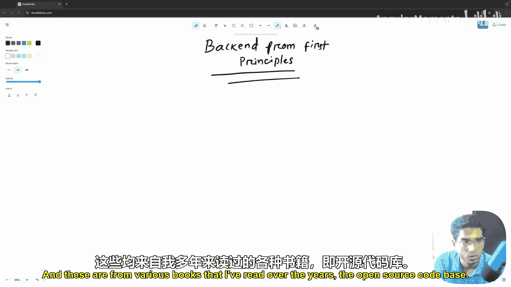

我们将探讨其安全方面，即SSL/TLS和HTTPS。

## 路由

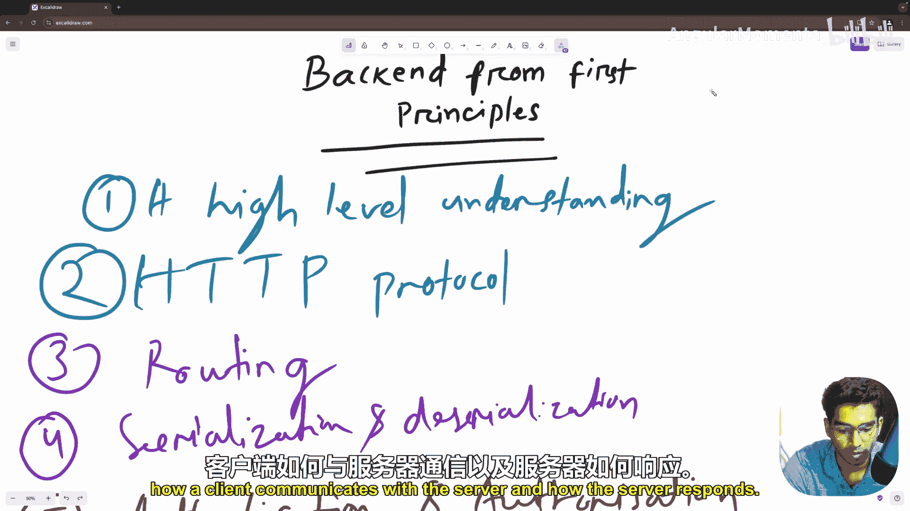

上一节我们讨论了HTTP协议，它是客户端与服务器通信的语言。本节中，我们来看看服务器如何根据URL将请求引导到正确的处理逻辑——也就是路由。

然后，我们将继续讨论路由。我们将探讨路由如何将URL映射到服务器逻辑，以及路由和HTTP方法之间的联系。

以下是路由的不同组成部分：
*   **路径参数**：URL路径中的动态部分，如`/users/{id}`。
*   **查询参数**：URL中`?`后面的键值对，如`?page=1&limit=10`。

我们将探讨不同类型的路由：
*   **静态路由**：匹配固定路径，如`/about`。
*   **动态路由**：包含参数的路由，如`/users/:id`。
*   **嵌套路由**：路由可以包含子路由。
*   **分层路由**：基于目录结构的路由组织。
*   **通配符路由**：匹配任意路径，如`/files/*`。
*   **基于正则表达式的路由**：使用正则表达式模式匹配路径。

我们将探讨如何使用HTTP进行API版本控制，以及不同类型的版本控制技术。

我们将看看弃用路由的最佳方式是什么，以及行业中的最佳实践。

我们将探讨路由分组的好处，以及它如何帮助进行版本控制、权限管理和共享中间件。

我们将探讨如何保护路由。

我们将探讨如何优化路由匹配性能。

## 序列化与反序列化

上一节我们介绍了路由，它负责将请求引导到正确的处理程序。本节中，我们来看看数据在网络上传输前如何被转换格式。

然后，我们将转向序列化和反序列化。这基本上意味着在通过网络发送数据之前，服务器如何将数据转换为特定格式，以及在从客户端接收数据后，如何将从互联网上接收到的数据转换为其自身的原生格式，这被称为反序列化。

我们将探讨为什么需要它，以及它如何帮助实现互操作性标准。

以下是序列化/反序列化中使用的不同格式：
*   **基于文本的格式**：如JSON或XML。
*   **二进制格式**：如Protocol Buffers。

我们将探讨这两种格式之间的性能差异，以及何时使用哪一种。

我们将探讨不同编程语言如何实现序列化和反序列化。

我们将探索一种流行的基于文本的序列化和反序列化格式，即JSON。我们将了解JSON的结构、不同的数据类型，如字符串、数字、布尔值、数组和对象。

我们将探讨JSON中如何处理嵌套对象和集合的序列化。

我们将探讨如何将数据反序列化为原生数据结构，例如Python字典、Go结构体或JavaScript对象。

以下是处理JSON时常见的错误：
*   处理缺失或额外的字段。
*   处理空值。
*   日期序列化问题和时区问题。

我们将探讨如何在将数据序列化为JSON之前或之后实现自定义序列化。

我们将探讨序列化和反序列化中的错误处理，例如无效数据、数据转换错误、未知字段。

我们将探讨其安全方面，如注入攻击，为什么在反序列化之前要进行验证，以及在处理数据之前使用JSON模式验证。

我们将探讨其性能方面，例如通过压缩减少序列化数据的大小，以及消除不必要的字段。

我们将探讨基于文本和二进制格式（如JSON与Protocol Buffers）之间的序列化性能差异，以及可读性与性能之间的权衡。因为在基于文本的格式中，你可以轻松检查负载，这在二进制格式中并不适用，但二进制格式更快。所以何时使用二进制格式，何时使用基于文本的格式，这是一个有效的权衡。

## 认证与授权

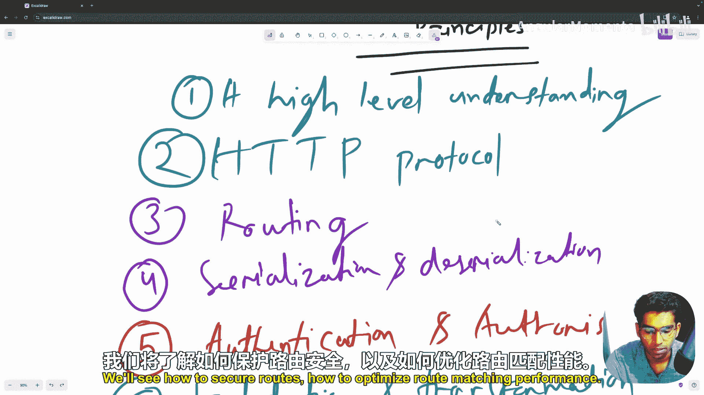

上一节我们讨论了数据格式的转换，本节中我们来看看如何确保只有合法的用户和请求才能访问系统资源。

然后，我们将继续讨论认证和授权。我们将探讨为什么使用它，不同类型的认证，如无状态和有状态层。

我们将探讨基本认证、令牌认证。我们将深入探讨会话、JWT、Cookie。

我们将深入探讨OAuth 2.0协议和OpenID Connect。

我们将探讨API密钥如何工作。

我们将探讨多因素认证如何工作。

我们将探讨什么是加盐、哈希以及授权中使用的不同加密技术。

我们将探讨ABAC、RBAC、ReBAC。

我们将探讨安全方面的最佳实践，例如保护Cookie、避免CSRF、中间人攻击等。

我们将探讨审计日志记录，这基本上意味着记录认证和授权事件以供审计和监控，例如失败的登录尝试、权限提升和对敏感资源的访问。

我们将探讨一个有趣的话题：模糊化认证相关的错误消息，防止通过详细的错误消息向攻击者泄露信息。

我们将探讨处理边缘情况，例如在不同故障模式（如速率限制、账户锁定）之间保持响应的一致性。

我们将探讨如何避免时序攻击。例如，攻击者可以利用错误响应的时间差异来推断有效的凭据。例如，错误密码的错误响应可能比有效用户名的错误响应花费更长的时间，因为检查密码必须进行某种哈希或加密技术，这需要一点时间。因此，人们可以推断出它们之间微小的时间差并猜测密码。尽管这非常困难，但我们不想留下任何安全漏洞。

## 验证与转换

上一节我们讨论了如何验证用户身份，本节中我们来看看如何验证用户提交的数据本身是否合法有效。

然后，下一个主题我们将探讨验证和转换。我们将探讨不同类型的验证，例如语法验证。例如，检查电子邮件是否是电子邮件格式，或者是否是有效的电话号码，或者是否是有效的日期格式。

还有语义验证。例如，出生日期不能是将来的日期，或者一个人的年龄应该在1到120岁之间。这些被称为语义验证。

然后，我们有类型验证。例如，检查输入值是否匹配预期的类型，是否是字符串、整数、数组或对象。这些类型的检查被称为类型验证。

我们将探讨验证的最佳实践是什么。我们将探讨客户端验证和服务器端验证之间的区别，以及为什么即使已经实施了客户端验证，仍然需要服务器端验证。客户端验证通过提供即时反馈来改善用户体验，但服务器端验证是真正的安全实现，因为它是业务逻辑的入口。

我们将探讨通过提前返回来减少不必要的处理，从而实现快速失败的重要性。

我们将探讨为什么要在前端验证和后端验证之间保持一致。

然后是转换。例如，类型转换，将字符串转换为数字或将数字转换为字符串。因为在查询参数或路径参数中，所有内容都是字符串。但假设我们期望一个ID字段是数字，那么在将其发送给处理程序之前，我们必须将该字符串转换为数字，这个步骤称为转换，我们必须在验证管道中处理。

还有不同的日期格式。例如，前端可能发送不同的格式，或者我们可能期望一个时间戳，这也必须在验证管道中处理。

然后是规范化。例如，将电子邮件转换为小写，或修剪字符串中的空格，或向电话号码添加国家代码。这些被称为规范化。

然后是出于安全考虑的清理。例如，我们必须清理用户提交的字符串，以防止SQL注入等攻击。

然后是复杂的验证逻辑。例如，关系验证。假设用户提交了一个表单，其中有两个字段，一个是密码，另一个是确认密码，我们必须检查这两个字符串是否相同。这就是基于关系的验证。

还有条件验证。例如，在表单中有两个字段，一个是伴侣姓名，另一个是“已婚”，这是一个布尔值（真或假）。伴侣字段可能只在“已婚”为真时才需要。这就是条件验证。我们必须进行这类检查。

然后是链式验证。例如，将字符串转换为小写，然后删除特殊字符，然后检查其长度。

然后，我们将探讨验证中的错误处理，例如向前端发送有意义的错误消息，以便用户可以修复它们。

以及在一个响应中聚合所有验证错误，以便在客户端显示。

或者模糊化错误消息。因此，与其说“无效密码”，我们不得不说“无效凭据”，以防止不同类型的攻击。

然后，我们将探讨如何优雅地处理失败的转换，例如无效的JSON和失败的速率转换，以及如何让用户知道有意义的错误消息。

然后，我们将探讨验证的性能权衡，以及如何通过提前返回、避免冗余验证来优化它。

## 中间件

上一节我们介绍了数据验证，它是请求处理流程中的一环。本节中，我们来看看一个更通用的、可复用的请求处理组件——中间件。

然后，我们的下一站将是中间件。我们将探讨什么是中间件以及何时使用它们。

以下是中间件的常见用例：
*   日志记录
*   认证检查
*   请求体解析
*   错误处理

我们将探讨中间件在请求周期中的角色，例如请求前中间件或请求后中间件。

我们将探讨中间件的流程，例如链式技术，中间件按顺序执行，将控制权传递给下一个中间件，直到请求到达其最终处理程序。

我们将探讨如何适当地排序中间件。例如，我们必须按照这个顺序：我们必须记录请求，我们必须检查用户是否已认证，我们必须进行验证，我们必须进行路由处理，然后我们必须进行错误处理。所以这个顺序在中间件流程中很重要。

我们将探讨中间件中的`next`函数如何工作，以及如何提前退出中间件。

我们将探讨中间件如何通过处理404错误来短路请求管道。

我们将探讨一些常见的中间件，例如安全中间件，它们添加安全头部，如`X-Content-Type-Options`、`Strict-Transport-Security`或`Content-Security-Policy`。

或者为每个请求或响应添加适当CORS头部的中间件。

以及避免CSRF攻击的中间件。

速率限制中间件。

然后，我们有认证中间件，以便在我们的应用程序中重用路由保护逻辑。

然后，我们有日志记录和监控中间件，用于请求日志记录或结构化日志记录，以便于生产环境中的可观察性或调试。

然后，我们有错误处理中间件，它们捕获并格式化应用程序级错误，以提供一致的API响应。

然后，我们有压缩或性能相关的中间件，它们基本上压缩响应体以减少通过网络发送的数据大小。

然后，我们有数据解析中间件，解析传入的请求体，如JSON、URL编码的表单和文件上传，以及用于文件上传的多部分表单数据。

然后，我们将探讨中间件的性能和可扩展性方面，例如保持中间件轻量级和高效的最佳实践是什么，确保中间件以正确的顺序应用，或者中间件顺序如何影响应用程序的性能和安全性。

## 请求上下文

上一节我们讨论了中间件，它们可以在请求处理过程中共享逻辑。本节中，我们来看看如何在请求的整个生命周期内安全地共享数据。

下一个主题将是请求上下文。请求上下文基本上是指通常通过应用程序中间件、控制器和服务传递的元数据。它是一种请求范围的状态，该状态仅对该请求有效。

因此，在这里我们将探讨请求的生命周期，在请求持续时间内维护状态，在不同应用程序层之间共享数据而无需耦合，以及上下文如何提供临时的请求范围状态。

我们将探讨请求上下文的不同组成部分。有请求数据，例如HTTP方法、URL、头部、查询参数和正文。

还有会话和用户信息。例如，在认证中间件中，我们获取用户信息，然后将其添加到请求上下文中。因此，对于该请求范围，用户信息被注入到上下文中。

然后，我们有跟踪和日志记录信息，例如唯一的请求ID或跟踪ID。

然后，我们有请求特定的数据，例如在请求生命周期中注入的自定义数据，如缓存数据或权限检查。

我们将探讨其用例，例如认证、速率限制、跟踪、日志记录。

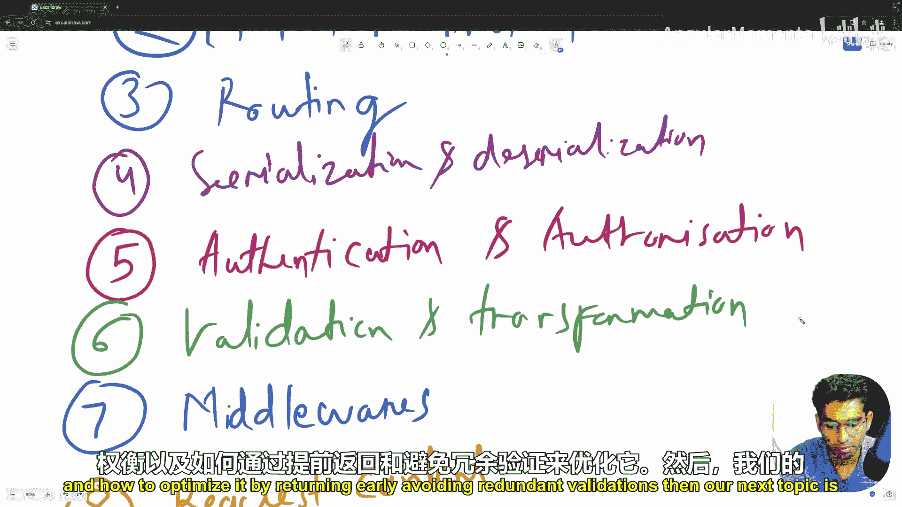

我们将探讨中间件和请求上下文之间的联系。

我们将探讨不同类型的超时，请求超时、自定义超时、取消信号。

我们将探讨最佳实践，例如保持其轻量级以防止内存开销，确保在请求生命周期后清理上下文状态以防止内存泄漏，避免通过上下文紧密耦合组件或过度依赖它来传递数据。

## 处理器与控制器

上一节我们介绍了请求上下文，它为处理请求提供了环境。本节中，我们来看看请求的最终目的地——处理器和控制器，它们负责生成具体的响应。

然后，我们将转向处理器和控制器、MVC模式，以及什么是处理器、控制器和服务，它们各自的职责是什么。

以及如何通过中间件减少代码重复。

然后，我们将在处理器中进行集中式错误处理，以及一致的成功和错误格式，以及如何在控制器中实现它们。

然后，我们将探讨不同类型的CRUD操作，例如CRUD操作如何映射HTTP方法，以及与每个方法相关的常见API。例如，POST方法通常用于创建和提交，状态码通常是201 Created或400（如果是错误请求）。GET请求通常与获取资源列表或获取单个资源相关联。我们有PUT和PATCH来更新资源，DELETE来删除资源。

我们将探讨如何实现分页，以及如何实现搜索API。

我们将探讨如何进行排序和如何进行过滤。

我们将探讨最佳实践，例如严格验证、一致的响应格式化、限制负载大小、重命名敏感字段、错误处理、认证和授权。

然后，我们将探讨什么是REST架构，以及实现RESTful API的最佳实践。

我们将探讨围绕资源设计API的原则，并坚持HTTP语义。

以及过滤和分页的最佳实践。

我们将探讨不同类型的版本控制，如URI版本控制、头部版本控制、查询字符串版本控制、媒体类型版本控制。

我们将探讨如何以OpenAPI规范为先的理念设计API。

我们将探讨内容协商。

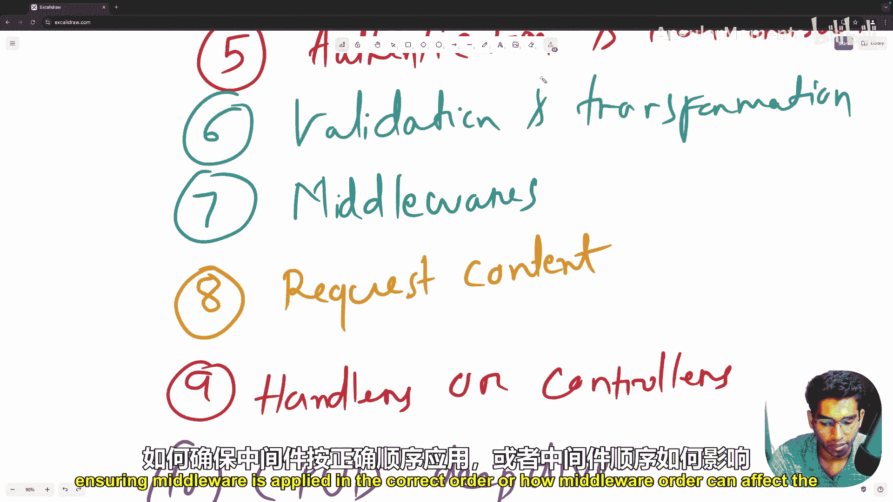

我们将探讨捕获异常并提供有意义的错误消息。

我们将探讨支持客户端缓存，如ETag。

以及优化大型请求和响应。

## 数据库

上一节我们讨论了如何设计API接口，本节中我们来看看数据如何被持久化存储——也就是数据库。

然后，我们将转向一个非常重要的主题，即数据库。我们将探讨关系型和非关系型数据库，它们之间的区别，以及何时使用哪一种。

我们将探讨一些理论概念，如ACID和CAP定理。

我们将探讨基本查询和连接，以及数据库设计最佳实践，如模式设计、索引。

我们将探讨不同的优化方法，如查询优化、缓存、连接池。

然后，我们有数据完整性，如约束和验证、事务和并发。

我们将探讨ORM如何工作，是否使用ORM，以及其中的权衡。

我们将探讨什么是数据库迁移。

## 业务逻辑层

上一节我们介绍了数据存储层，本节中我们来看看处理核心业务规则和流程的中间层。

然后，我们将转向业务逻辑层，也称为BLL。我们将探讨它的角色是什么，请求周期的不同层次是什么。

例如，我们有验证层、路由、中间件以及处理器和控制器，它们都属于表示层，因为它们处理用户数据，无论是接受用户数据还是发送用户数据。所以这些是表示层的一部分。

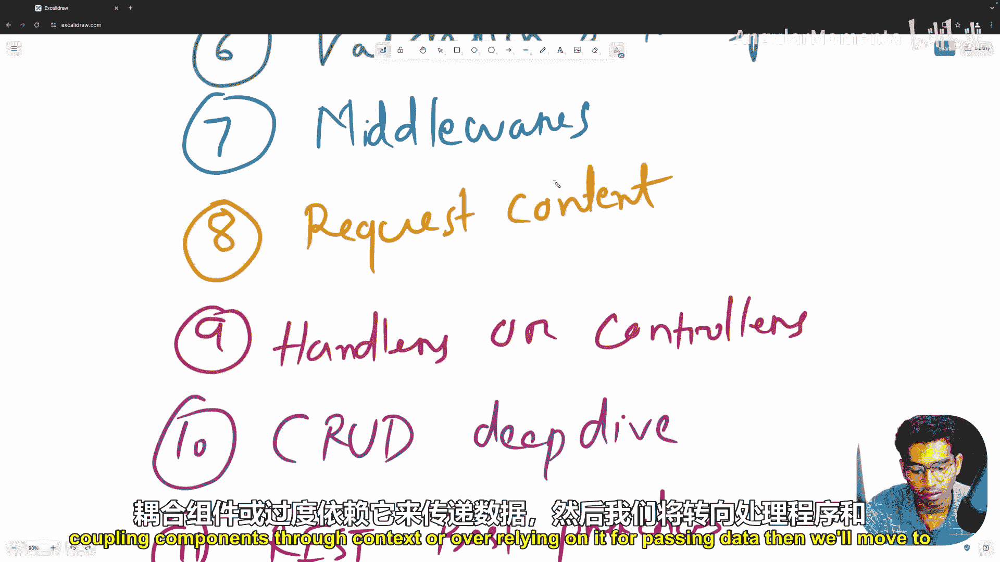

之后，我们有业务逻辑层，它是中间层，处理我们的核心业务逻辑。

之后，我们有数据访问层，它处理数据库，执行查询、插入或删除操作。业务逻辑层在幕后使用数据访问层。

我们将探讨不同的设计原则，如关注点分离、单一职责、控制反转、依赖注入。

我们将探讨业务逻辑层的组成部分。例如，我们有服务，我们有代表核心实体（如用户或订单）的领域模型。然后，我们有业务规则。然后，我们有业务验证逻辑。

我们将探讨服务层设计的最佳实践。

我们将探讨如何正确处理错误，以及如何将这些错误从我们的服务层传播到我们的表示层。

## 缓存

上一节我们讨论了业务逻辑，它处理核心计算。本节中，我们来看看如何通过缓存来提升系统性能。

之后，我们有缓存。我们将讨论为什么需要缓存，以及它与数据库持久化有何不同。

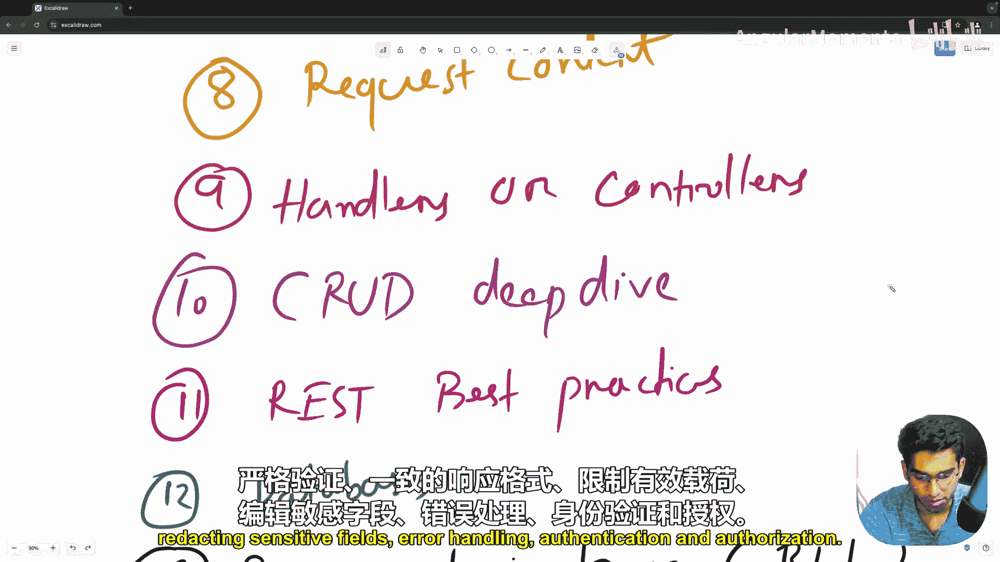

以下是不同类型的缓存：
*   **内存缓存**：如Redis、Memcached。
*   **浏览器缓存**：由HTTP头部控制。
*   **数据库缓存**：如查询缓存。

我们将探讨为什么需要客户端缓存和服务器端缓存。

以下是不同的缓存策略：
*   **Cache Aside**：应用先查缓存，未命中则查数据库并写入缓存。
*   **Write Through**：数据同时写入缓存和数据库。
*   **Write Behind**：先写入缓存，稍后异步批量写入数据库。
*   **Read Through**：缓存负责在未命中时从数据库加载数据。

以下是不同的缓存淘汰策略：
*   **LRU**：最近最少使用。
*   **FIFO**：先进先出。
*   **TTL**：生存时间。

我们将探讨缓存失效的必要性，例如手动缓存失效、基于生存时间的失效或基于事件的批量失效。

我们将探讨缓存的不同级别。1级缓存是内存缓存，2级缓存是网络分布式缓存。还有分层缓存，它结合了1级和2级缓存策略，其中频繁使用的数据存储在快速的小缓存（1级缓存）中，而不太频繁使用的数据存储在较慢或较大的缓存（2级缓存）中。

我们将探讨Web应用程序的缓存是什么样子，即缓存静态资源或使用头部缓存API响应。

我们将探讨如何为数据库进行缓存，例如查询缓存，如在Redis中存储重型连接查询的结果。

我们将探讨缓存命中率和缓存未命中率，以及如何优化它们。

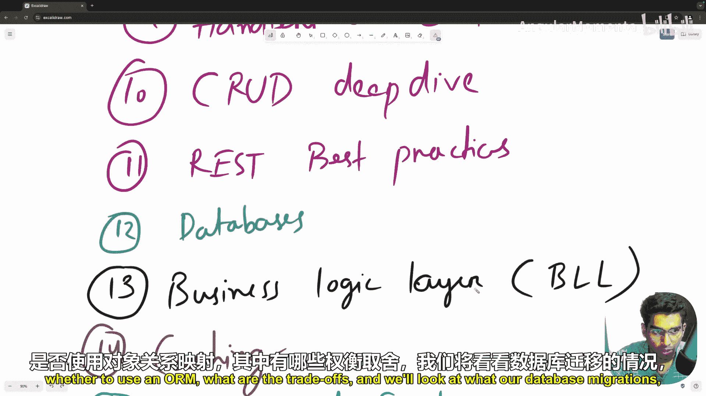

## 事务性邮件与任务队列

上一节我们介绍了缓存，它是一种提升读性能的技术。本节中，我们来看看如何处理异步和耗时的任务，比如发送邮件。

之后，我们将转向事务性邮件。我们将探讨它们的用途是什么，常见的用例有哪些。

我们将探讨事务性邮件的结构：主题、预览文本、正文头部、主要内容、行动号召、页脚。

以及如何使用不同的动态参数进行个性化设置。

然后，我们有任务队列和消息队列。我们将探讨常见的用例是什么。例如，队列可能用于发送电子邮件、处理图像文件和第三方API集成（如支付处理或Webhook），或者卸载繁重的计算，如批处理。

例如，用户点击一个按钮来“清除我所有的数据”。要清除所有用户数据，我们必须为不同的表执行不同的查询来清除所有用户数据，这可能需要一些时间。因此，我们不是阻塞请求，而是立即返回响应，并通过推入任务队列来触发一个后台作业。

我们将探讨调度的用例是什么。例如，运行数据库备份、循环通知和提醒、数据同步或维护相关问题，例如清除日志或缓存。

我们将探讨任务队列的不同组成部分，即生产者、队列、消费者、代理、后端。

我们将探讨任务依赖性的流程。例如，它可能是链式依赖，或者可能有父子关系。

我们将探讨任务组，即并发执行多个任务并等待它们全部同时完成。

我们将探讨如何处理错误并在任务队列中实现重试逻辑。

我们将探讨任务优先级和速率限制。例如，优先处理像支付处理这样的任务，而不是像发送通知这样的低优先级任务。

## 搜索（Elasticsearch）

上一节我们讨论了异步任务处理，本节中我们来看看如何实现高效、复杂的搜索功能。

之后，我们将转向Elasticsearch。我们将探讨为什么使用Elasticsearch，以及它在幕后是如何工作的。

我们将探讨使用的不同技术，例如倒排索引、词频和逆文档频率、段和分片。

我们将探讨Elasticsearch的用例。例如，提供输入提示体验、日志分析或社交媒体搜索，例如用户资料、帖子、评论的全文搜索。

我们将探讨如何创建和管理索引。

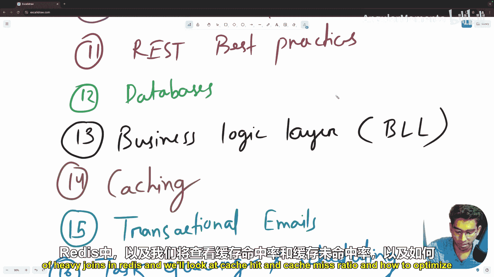

我们将探讨如何搜索和查询，不同类型的搜索：基本搜索、全文搜索、相关性评分。

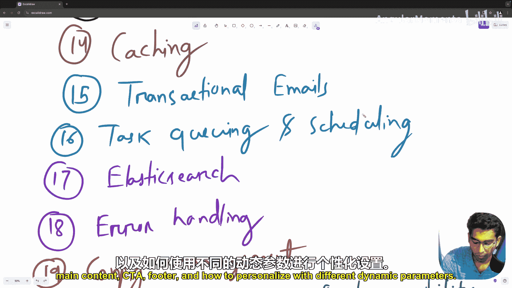

我们将探讨如何通过区分文本字段与关键字字段、理解分析器和提升、分页来优化搜索性能。

我们将探讨一些高级搜索模式，例如过滤、聚合、模糊搜索。

然后，我们将探讨Kibana如何工作，以及如何以用户友好的方式使用Elasticsearch。

以及最佳实践，例如显式定义字段映射、优化分片数量、批量索引数据、避免通配符查询。

## 错误处理

在构建系统时，错误是不可避免的。本节中，我们系统地学习如何优雅地处理错误，保证系统的健壮性。

然后，我们有错误处理。我们将探讨应用程序中不同类型的错误，可能是语法错误、运行时错误、逻辑错误。

以及不同的错误处理策略，例如故障安全或快速失败、优雅降级或预防错误。

以下是错误处理的不同实践：
*   尽早捕获错误。
*   不要忽略错误。
*   使用自定义错误类型。
*   优雅地失败。
*   记录错误并使用堆栈跟踪。

我们将探讨全局错误处理程序如何工作。

我们将探讨如何适当地处理面向用户的错误，例如提供友好的错误消息和提供可操作的反馈。

我们将探讨监控和日志记录在错误处理中的重要性，以及不同的工具，如Sentry、ELK Stack。

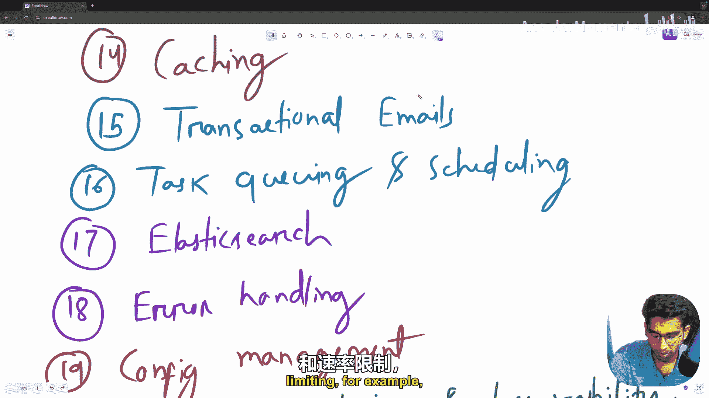

以及不同的错误警报，如基于电子邮件的警报和基于SMS的警报。

## 配置管理

上一节我们讨论了如何处理运行时错误，本节中我们来看看如何管理应用程序的配置，使其更灵活、更安全。

之后，我们有配置管理。我们将探讨配置管理到底是什么，以及它如何帮助提高灵活性，并将环境特定设置与应用程序逻辑解耦。

以及用例是什么。例如，不同的环境使用配置管理，安全管理敏感数据，如API密钥、数据库密码和SSL证书，动态启用和禁用功能而无需更改代码库。

我们将探讨配置管理的最佳实践。

我们将探讨不同类型的配置，例如静态配置，如数据库凭证和API端点；动态配置，如功能标志、速率限制；以及敏感配置，如凭证、令牌、密钥。

以及配置的不同来源。例如，它可以是`.env`文件、JSON或YAML文件。

以及使用环境变量、命令行标志与静态文件之间的区别。

## 日志、监控与可观测性

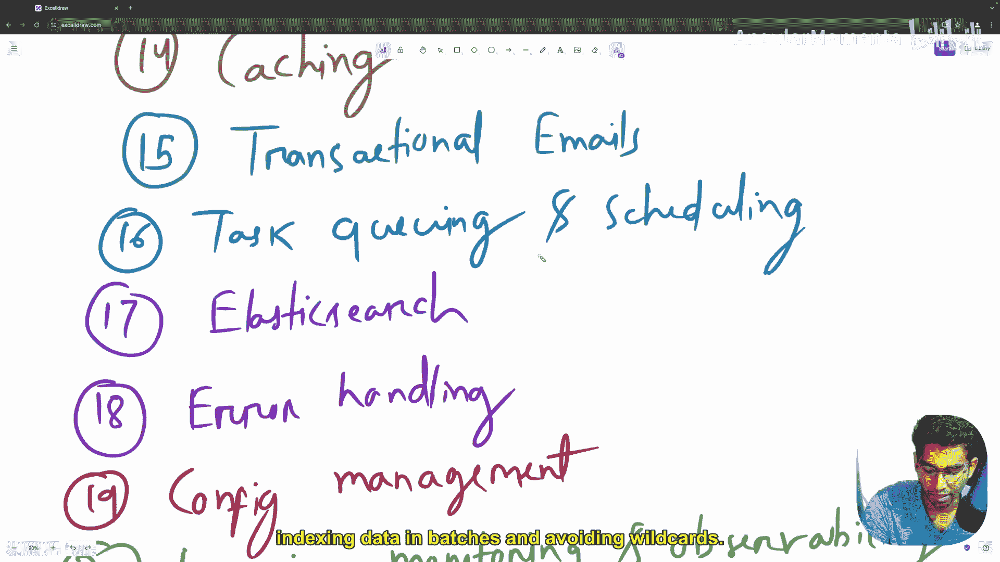

上一节我们介绍了配置管理，它关乎系统的静态设置。本节中，我们来看看如何动态地了解系统的运行状态。

之后，我们有日志记录、监控和可观测性，这是一个非常重要的主题。我们将探讨日志记录、跟踪、监控和可观测性之间的区别。

我们将探讨不同类型的日志记录，如系统日志、应用程序访问日志、安全日志。

我们将探讨日志的不同级别，如调试、信息、警告、错误、致命。

我们将探讨结构化日志记录和非结构化日志记录之间的区别。

以及日志记录的最佳实践，例如集中式日志记录、日志轮换和保留、上下文化和有意义的日志记录，以及避免记录敏感数据，如密码和API密钥。

然后，我们将探讨监控。我们将探讨不同类型的监控，如基础设施监控、应用程序性能监控、正常运行时间监控。

以及监控中使用的不同工具，如Prometheus、Grafana。

以及如何通过定义阈值、创建警报来管理警报和通知，并通过仅创建可操作的警报、确保警报有意义且必要来避免警报疲劳。

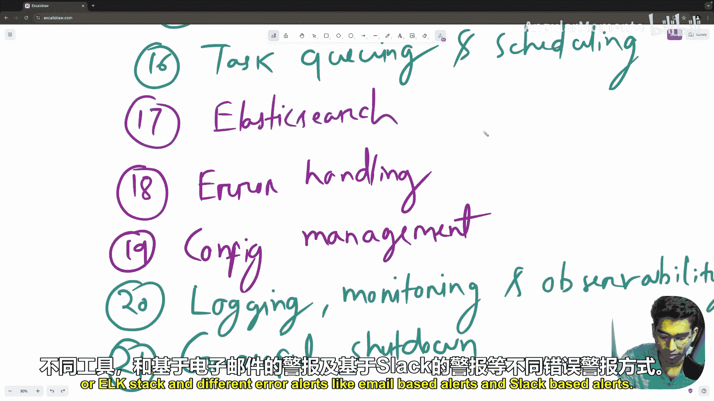

然后，我们将探讨可观测性。我们将探讨可观测性的三大支柱，即日志、指标和跟踪。

以及围绕它的最佳实践。

以及日志管理的安全性和合规性。

## 优雅关闭

系统不仅需要正确运行，还需要能正确停止。本节中，我们来看看如何让服务平滑地关闭，不影响用户体验和数据完整性。

之后，我们将转向优雅关闭。我们将探讨为什么需要优雅关闭，以及它在幕后是如何工作的。

以及不同的用例是什么。例如，在服务器重启、云环境中扩展或服务或长时间运行的作业时可能需要它。

我们将探讨它是如何工作的，例如信号处理、SIGTERM和SIGINT信号。

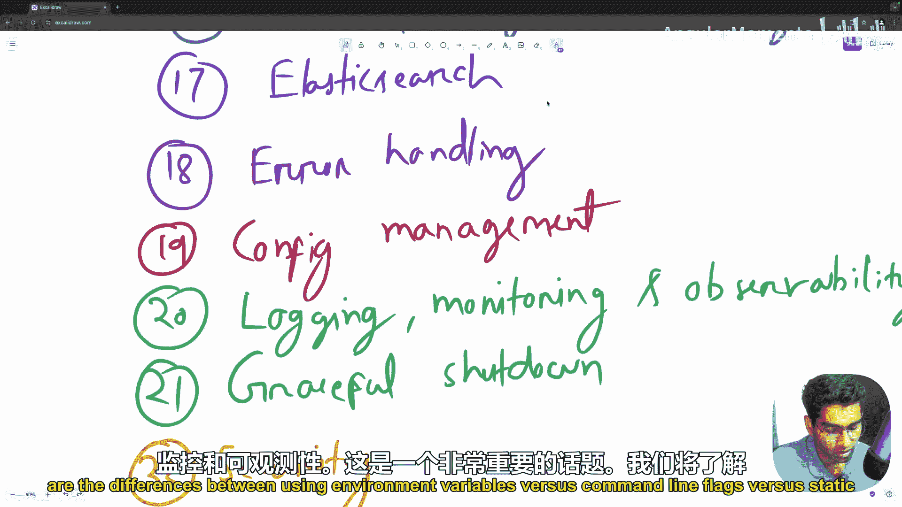

以下是优雅关闭的不同步骤：
1.  捕获终止信号（如SIGTERM）。
2.  停止接受新的请求。
3.  完成正在进行的请求处理。
4.  关闭外部资源（如数据库连接、打开的文件）。
5.  终止应用程序。

## 安全

在互联网上，安全至关重要。本节中，我们系统性地学习后端开发中常见的安全威胁和防护措施。

之后，我们将转向安全。我们将探讨后端代码库中安全的不同方面，避免不同的安全攻击，如SQL注入、NoSQL注入、CSRF、身份认证破坏、不安全的反序列化。

以及安全软件设计的原则，例如最小权限、纵深防御、默认安全、职责分离、安全设计。

然后，我们将探讨输入验证和清理的重要性。

以及速率限制、内容安全策略、CORS和SameSite Cookie。

以及监控事件的重要性。

## 扩展与性能

随着用户增长，系统需要能够扩展。本节中，我们来看看如何评估和提升系统的性能与扩展能力。

之后，我们有扩展和性能。我们将探讨性能的不同指标，如响应时间、资源利用率。

我们将探讨识别瓶颈、缓存和数据库优化。例如，避免N+1查询问题，确保正确使用连接，并在适当的地方使用懒加载。

然后，我们有使用数据库索引来加速对频繁查询字段的读取操作，例如对外键或搜索字段建立索引。

如何批量处理数据以最小化数据库负载并提高大数据集的性能。

如何避免内存泄漏，例如关闭文件句柄、数据库连接或清理长时间运行的进程。

通过减少负载大小和使用压缩来最小化网络开销。

我们将探讨如何进行性能测试和分析。

我们将探讨编写高性能代码的一些最佳实践，例如首先专注于编写清晰和可维护的代码，而不是过早优化；编写模块化代码，以便更容易优化单个组件而不影响整个系统。

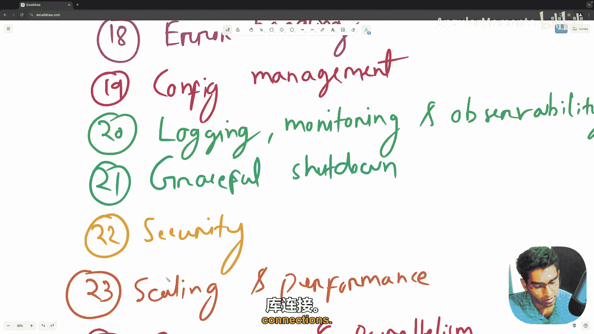

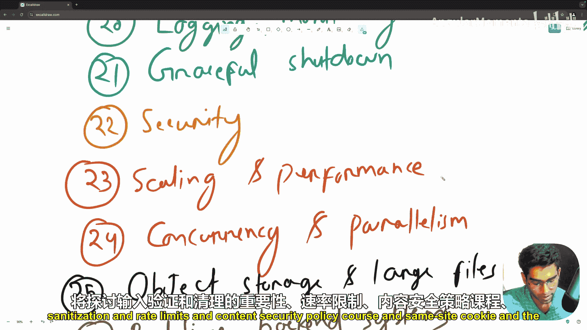

确保如果特定资源负载过重或不可用，系统能够优雅地降级而不会崩溃。

以及如何将非关键任务（如发送电子邮件或记录日志）卸载到后台进程或任务队列，以释放资源用于更关键的操作。

## 并发与并行、对象存储等高级主题

后端系统面临各种复杂场景。本节中，我们简要了解并发处理、大文件管理、实时通信等高级主题。

然后，我们有并发和并行。我们将探讨并发和并行之间的区别，以及并发如何帮助I/O密集型任务，并行如何帮助CPU密集型任务。

然后，我们有对象存储和大文件。我们将探讨使用对象存储（如AWS S3）的一些常见用例，以及如何通过分块和流式传输来管理大文件。

我们将探讨多部分文件上传。

然后，我们有实时后端系统，我们将探讨WebSocket或服务器发送事件和发布/订阅架构。

## 测试与代码质量

高质量的代码离不开完善的测试。本节中，我们来看看如何通过测试和代码质量工具来保证软件的可靠性。

然后，我们有测试和代码质量。在这里，我们将探讨不同类型的测试：单元测试、集成测试、端到端测试、功能测试、回归测试、性能测试、负载和压力测试、用户验收测试、安全测试。

我们将探讨什么是测试驱动开发。

如何自动化CI/CD环境中的测试。

如何通过外部代码检查和格式化工具来管理代码质量。

以及代码质量和覆盖率的衡量标准是什么，例如质量指标，如圈复杂度（它通过计算代码中可能的路径数量来衡量函数的复杂性）；以及可维护性指数（它基本上根据复杂性、代码行数和其他因素来量化维护代码库的容易程度）。

## 十二要素应用与OpenAPI标准

构建现代云原生应用需要遵循一些最佳实践。本节中，我们了解两个重要的方法论和标准。

然后，我们将探讨一组非常有趣的原则，称为十二要素应用。

之后，我们将转向OpenAPI标准。我们将探讨为什么需要这些标准，以及为什么我们应该坚持使用它。

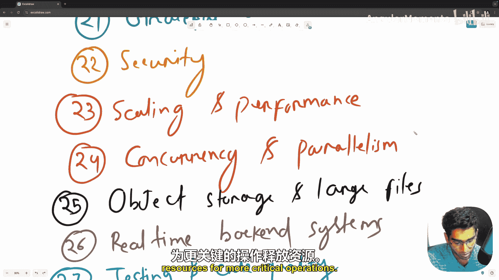

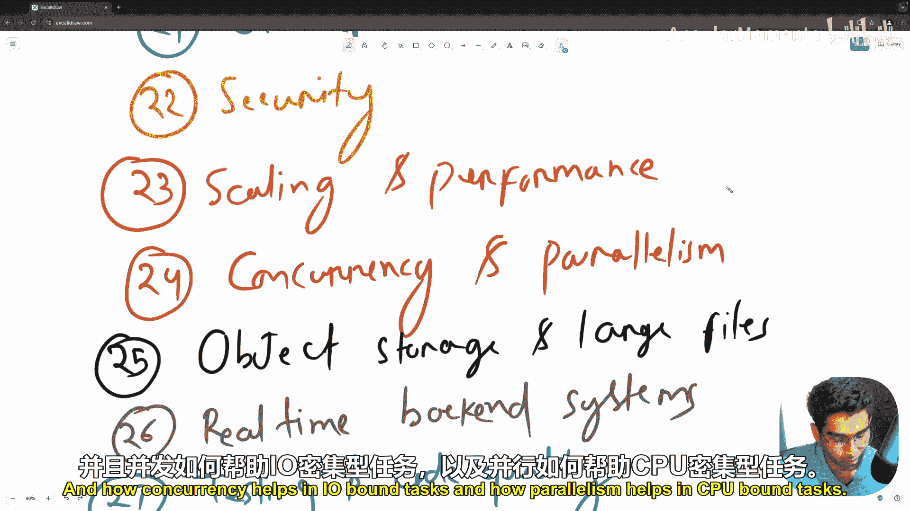

它的好处是什么。

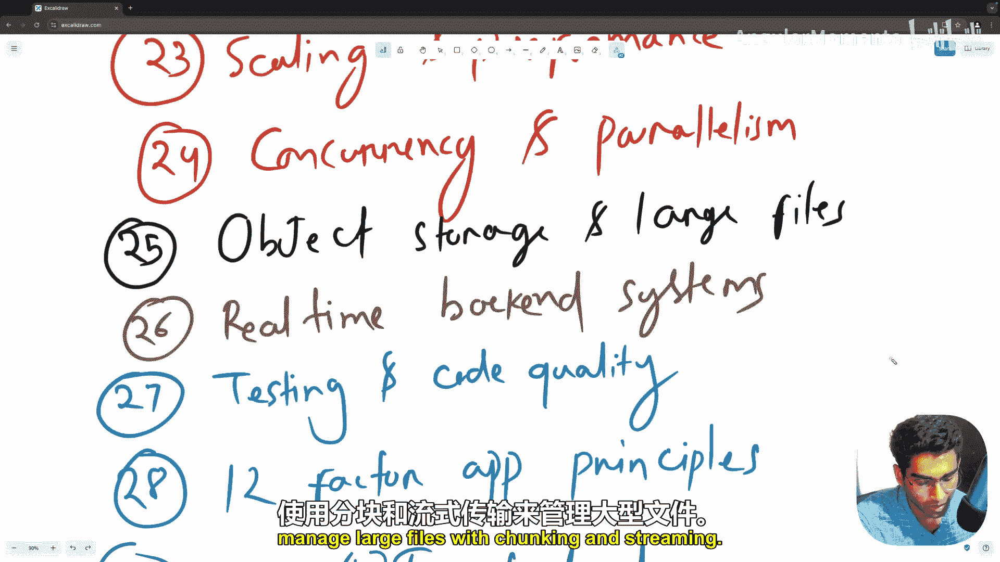

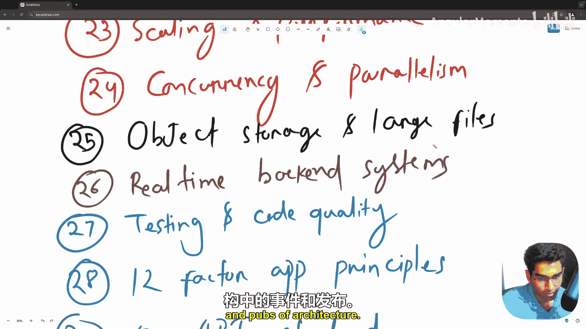

用例是什么，例如文档自动化。

以及围绕它的生态系统，如Swagger Codegen和Postman。

以及历史，Swagger到OpenAPI的过渡，以及当前活跃的不同版本是什么。

以及OpenAPI文档的关键概念是什么。例如，有API路径、请求和响应定义、参数、模式。

以及OpenAPI文档的结构是什么，有元数据、路径、组件、安全定义和响应。

我们将探讨OpenAPI 3.0和3.1的新特性是什么。

围绕OpenAPI的工具是什么，例如Swagger UI、代码生成、Postman。

最佳实践是什么，例如避免重复和坚持标准。

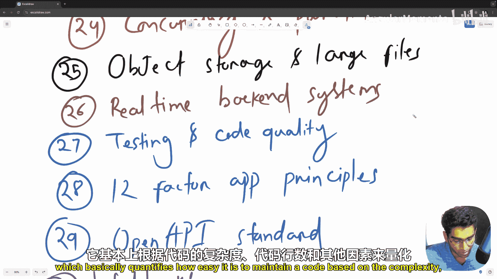

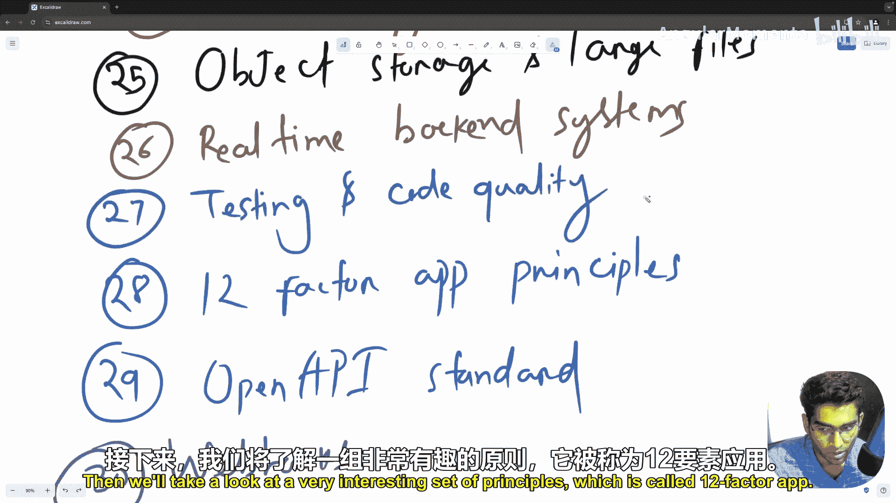

我们将探讨一种非常有趣的开发方法，即API优先开发，你先定义你的OpenAPI标准或编写你的OpenAPI规范，然后才开始创建API。

## Webhook

API通常是客户端主动请求数据，但有时服务器需要主动通知客户端。本节中，我们来看看这种模式——Webhook。

之后，我们将转向Webhook。我们将探讨Webhook的用例是什么，例如事件通知、第三方集成。

我们将探讨API与Webhook针对同一用例的区别。例如，对于API，我们可能必须使用轮询（客户端发起），而Webhook是推送（服务器发起）。

以下是Webhook的关键组成部分：
*   **Webhook URL**：接收事件的端点。
*   **事件触发器**：触发Webhook的条件。
*   **负载**：发送的数据。
*   **HTTP方法**：通常是POST。
*   **响应处理**：如何处理接收方的响应。

围绕Webhook的最佳实践之一，例如Webhook签名验证、使用HTTPS、快速响应重试逻辑、日志记录。

如何用Ngrok等工具测试Webhook。

现实世界的用例，如Stripe支付处理、GitHub Webhook、Slack、Discord等。

## DevOps概念

现代后端开发与运维紧密相连。本节中，我们简要了解后端工程师应该熟悉的DevOps核心概念。

最后，我们将探讨后端工程师应该熟悉的一些DevOps概念。例如，一些核心概念，如持续集成、持续交付、持续部署。

DevOps实践，如基础设施即代码、配置管理、版本控制。

围绕DevOps的不同工具。例如，使用Docker创建容器，或使用Kubernetes编排容器，以及CI/CD流水线。

以及如何扩展你的服务，水平扩展与垂直扩展。

以及不同的部署策略，如蓝绿部署、滚动部署等。

以上就是全部内容。这些是我们在接下来的30或40个视频中将要涵盖的所有概念。

请保持关注。

## 总结

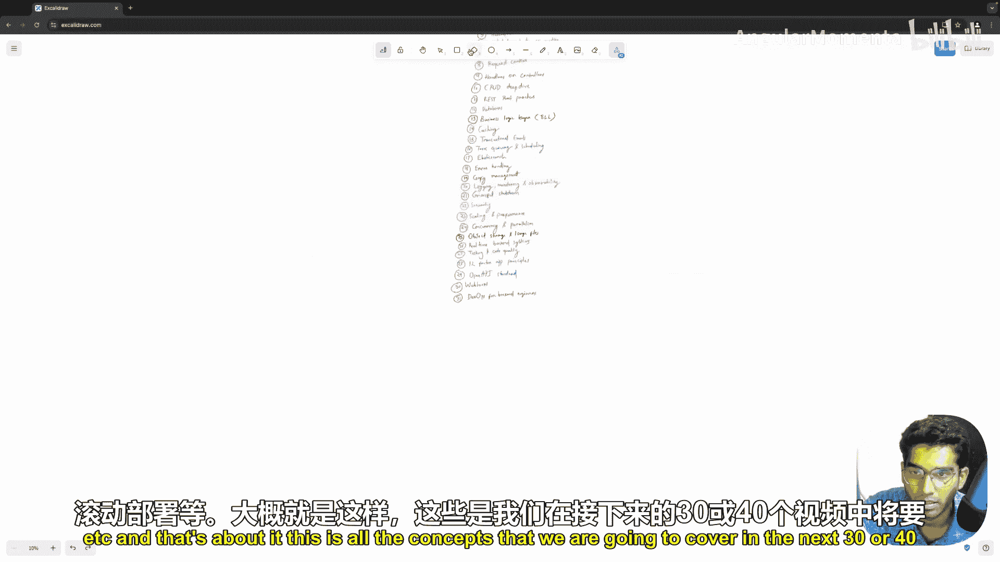

本节课中我们一起学习了后端开发的完整路线图。我们从后端工程的定义出发，强调了构建可靠、可扩展系统的重要性，而不仅仅是编写API。我们逐一介绍了从网络基础（HTTP/TCP）到核心后端组件（路由、序列化、认证、数据库），再到高级主题（缓存、搜索、安全、性能、DevOps）的每一个关键领域。这个路线图旨在帮助你建立系统性的理解，超越特定语言或框架的局限，为成为一名优秀的后端工程师打下坚实的基础。