# 002：踏上真正的后端工程师之路 🛣️

在本节课中，我们将要学习本系列视频的总体结构和学习路径。我们将明确学习目标，并了解如何从哲学原理过渡到具体实现，最终构建出生产级的后端系统。

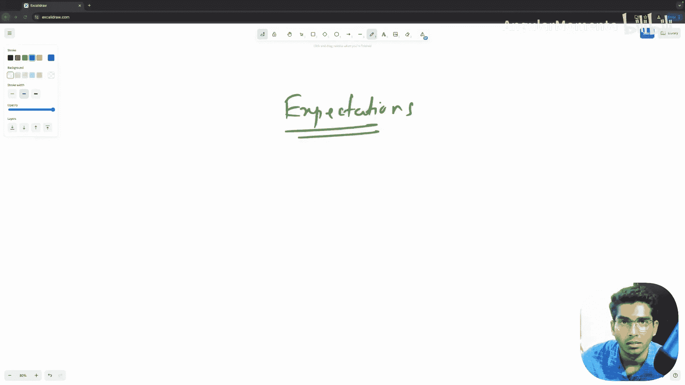

在深入核心内容之前，需要明确你对本系列视频的期望以及如何从中学习。

让我们明确学习目标。

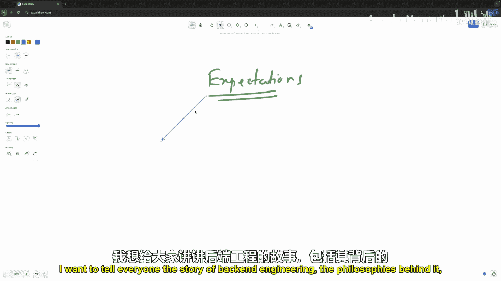

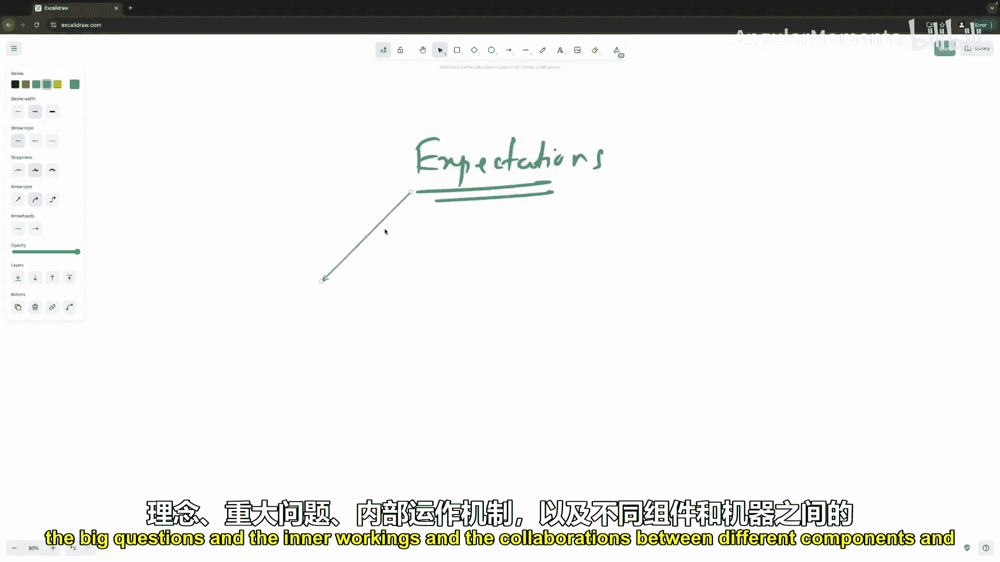

在你当前观看的这个特定播放列表中，我的目标是向所有人讲述后端工程的故事、其背后的哲学、核心问题、内部工作原理以及不同组件和机器之间的协作。

这种叙述方式将帮助你看到一个生产级后端系统的全貌，并帮助你理解那些被你日常使用的语言、运行时、框架和库所抽象掉的概念。

让我们把它写下来。

因此，这个播放列表是关于**原理**和**哲学**的。

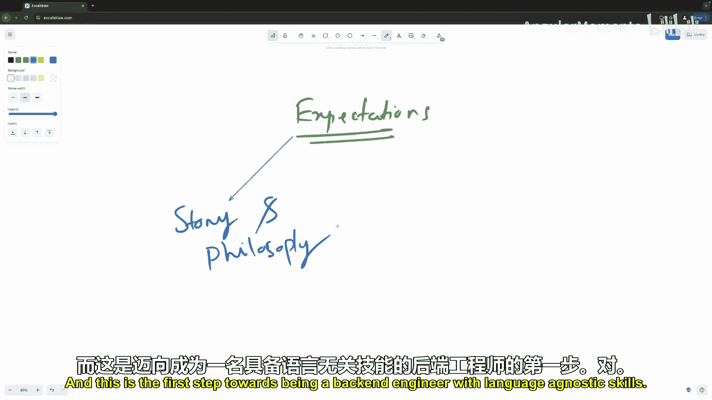

这是迈向成为一名具备语言无关技能的后端工程师的第一步。

这些技能超越了特定的框架、ORM或你每天使用的任何特定库。

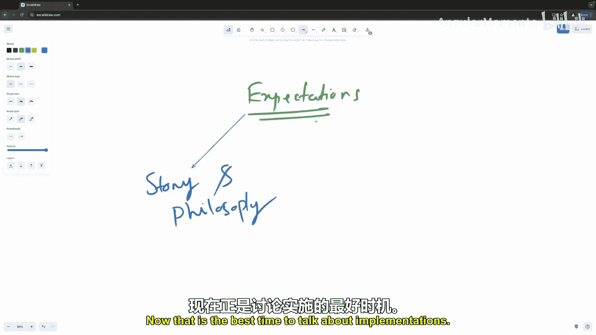

一旦你打好了基础，开始看到每个后端应用背后的通用模式，并理解了哲学思想以及各个概念如何连接在一起，那时就是讨论具体实现的最佳时机。

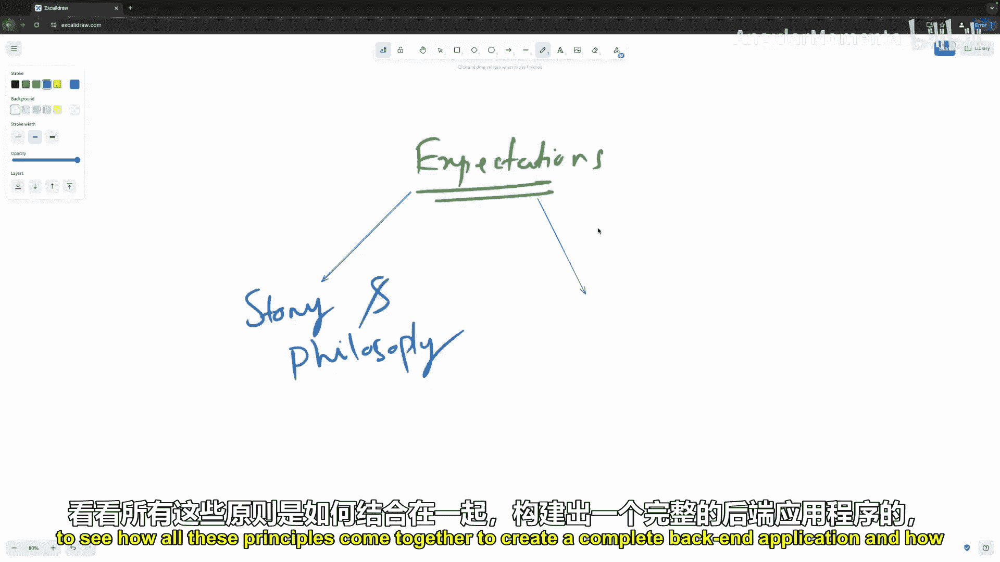

我们将看到所有这些原则如何共同作用，创建一个完整的后端应用。

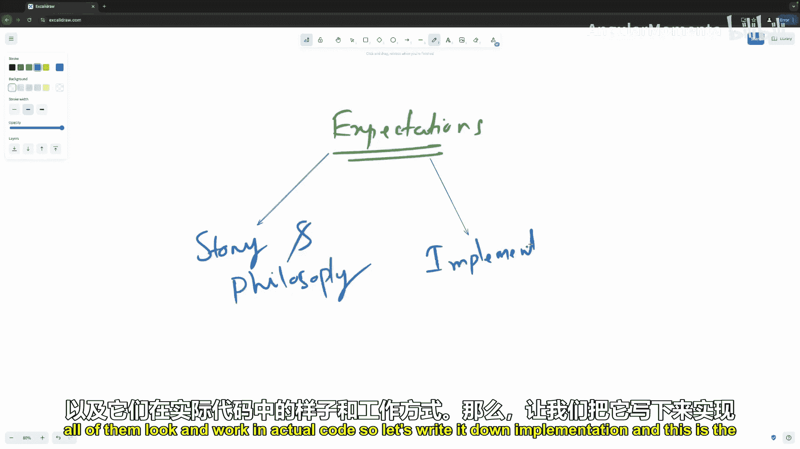

以及它们在真实代码中的样子和工作方式。所以，让我们把它写下来：**实现**。

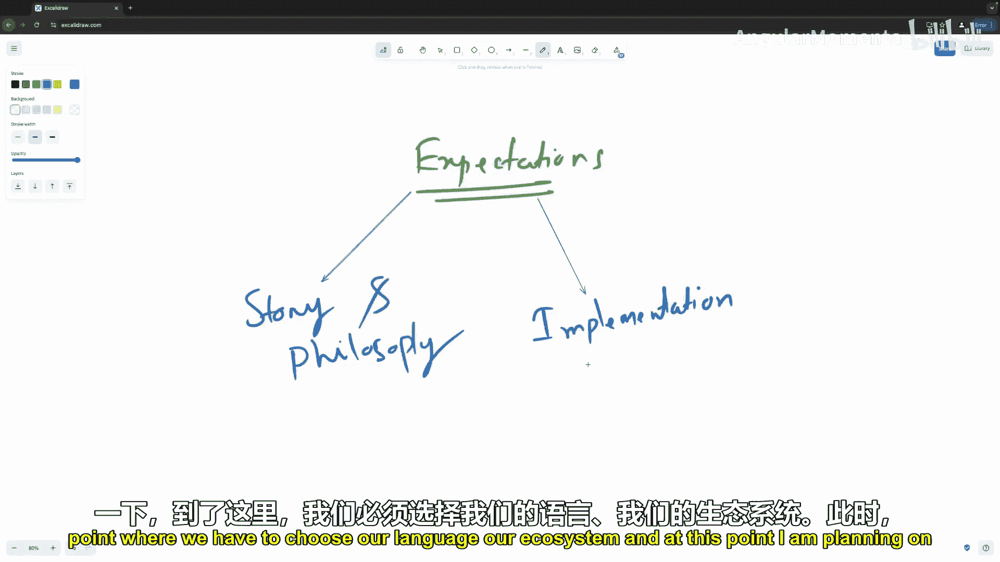

在这个阶段，我们必须选择我们的编程语言和生态系统。目前，我计划发布两个版本：一个使用 **Node.js**，另一个使用 **Golang**。因为这是我拥有第一手经验并每天使用的两种语言。

这个阶段将是另一个播放列表。我们将选取每个原理，并在特定的语言及其周边生态中进行深入探讨。因此，本播放列表中的大多数视频，在下一个播放列表中都会有一个对应的、针对具体实现的视频。

例如，在关于数据库的原理中，我们会讨论数据库、驱动、迁移以及后端工程师日常处理的所有相关概念。那么，Node.js 和 Golang 的播放列表将包含该原理的实现，我们会深入探讨例如使用 JavaScript 驱动 **Postgres.js** 或 Golang 驱动 **PGX** 来连接 PostgreSQL，并涵盖围绕它的每一个概念。

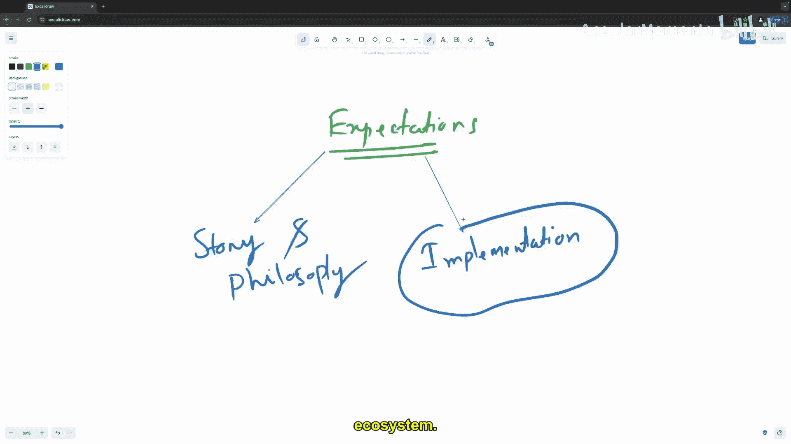
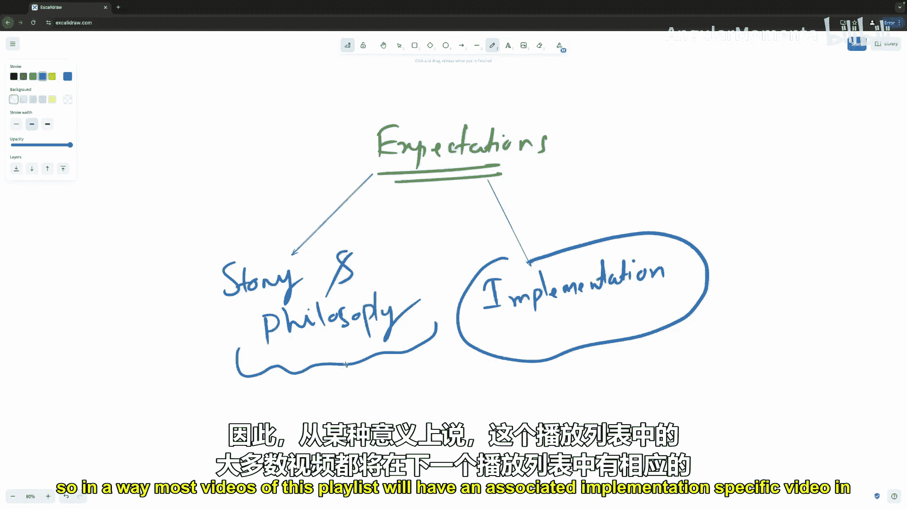
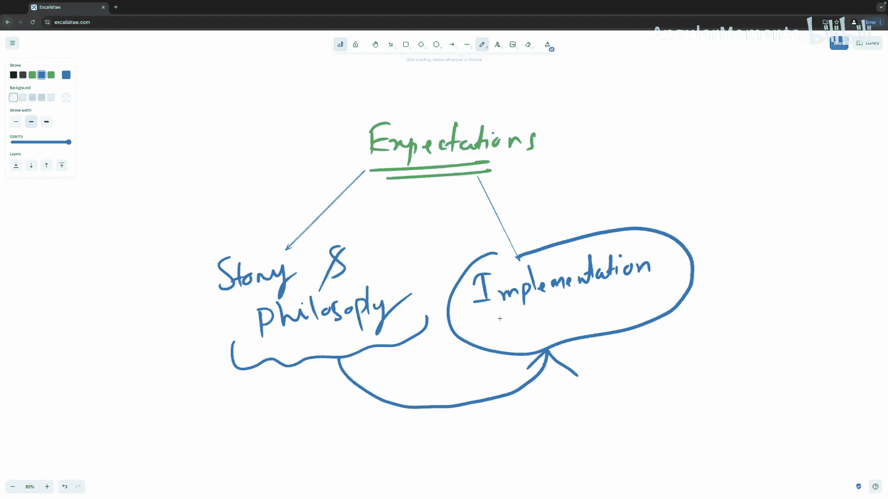

在第三阶段，所有内容将汇聚在一起。

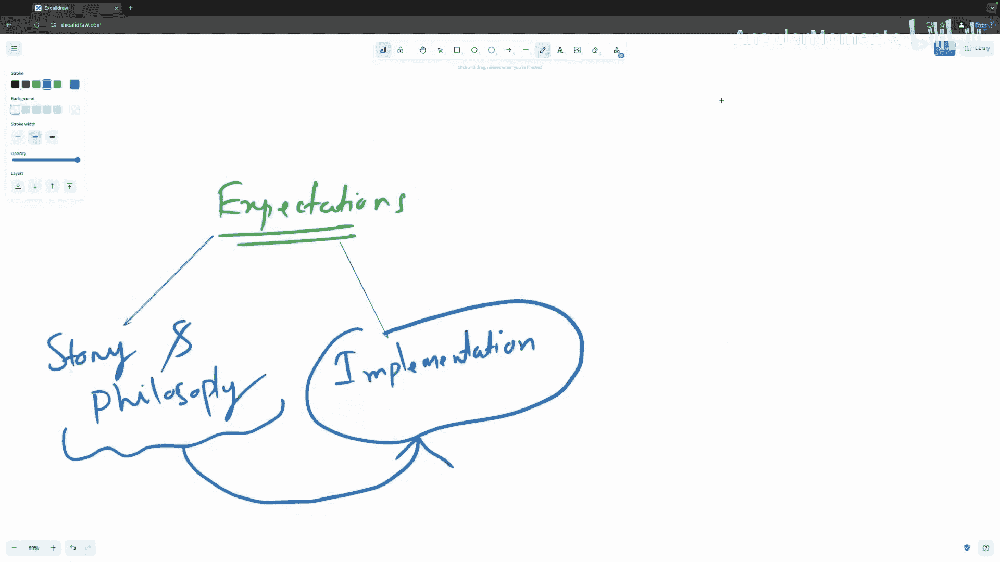

我们所有的概念、所有针对特定语言的深入探讨、所有的哲学思想，都将在这里整合。我们将从头到尾构建符合行业标准和最佳实践的生产级项目。

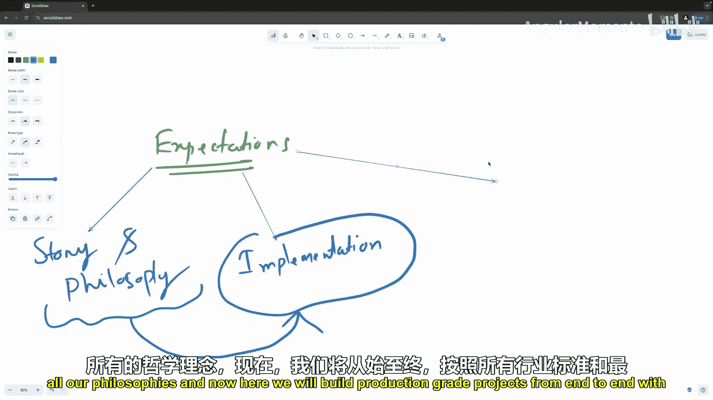

我们将构建好几个这样的项目，你可以选择跟随学习。

让我们把它写下来：**生产级项目**。

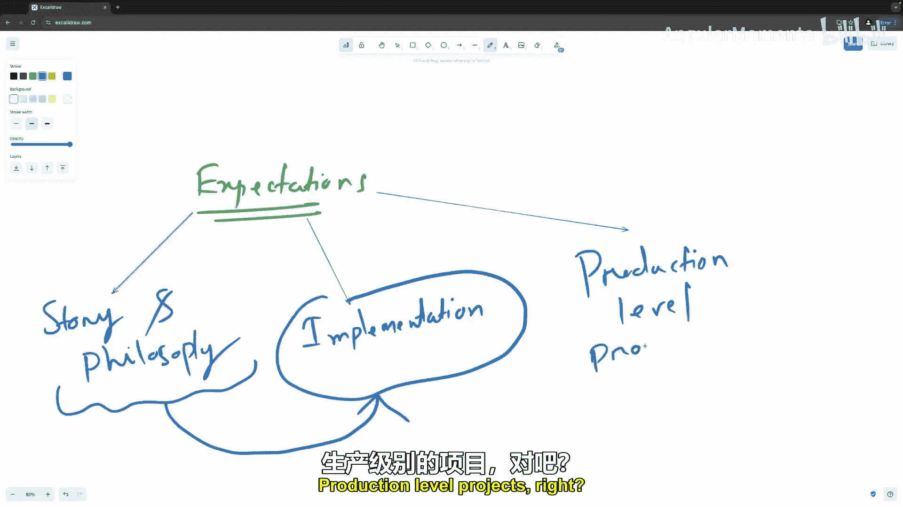

在这段学习旅程结束时——如果你决定参与并内化了所有知识，且跟随完成了所有项目——你应该可以自信地称自己为一名后端工程师。

你将能够走出去，构建真实的、可扩展的系统。

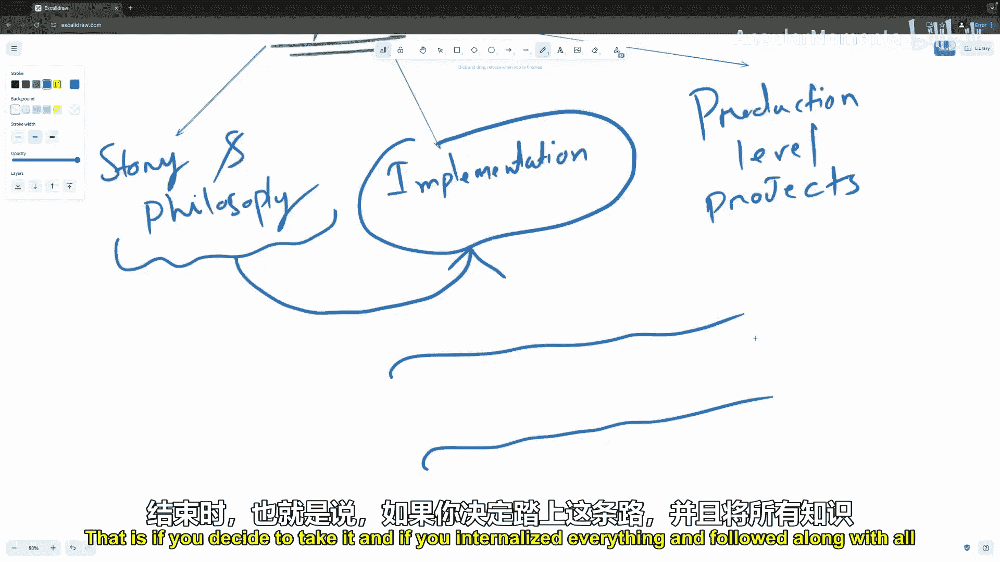

这些系统可以从零用户起步，扩展到百万用户，并且是能够被长期维护的系统。

明确了这些期望，让我们开始吧。

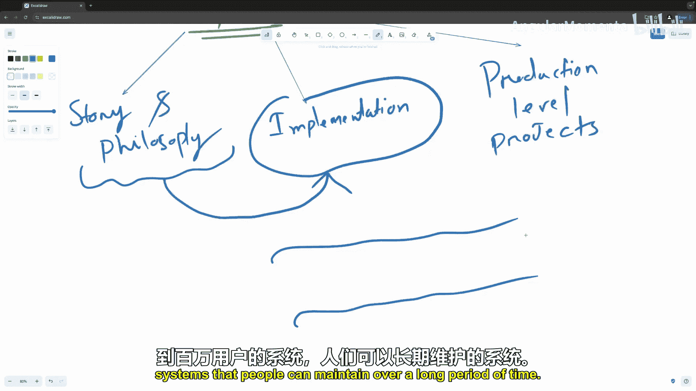
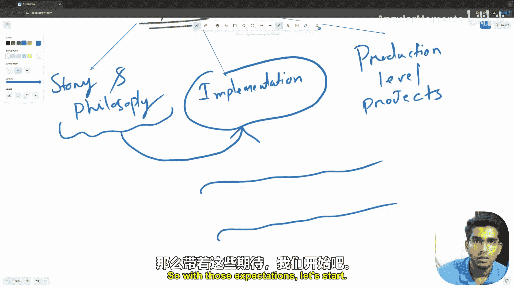

---

本节课中我们一起学习了本系列教程的三阶段学习路径：**原理与哲学**、**具体语言实现** 以及 **生产级项目构建**。我们明确了学习目标是掌握超越特定框架的语言无关技能，并最终能够构建可扩展、可维护的真实后端系统。