# 003：什么是后端，它们如何运作以及我们为何需要它们？ 🖥️

在本节课中，我们将要学习后端的核心概念。我们将探讨后端的传统定义，并通过一个实际的网络请求流程，来理解请求是如何从浏览器出发，经过DNS、防火墙、反向代理等组件，最终到达后端服务器的。我们还将对比前端与后端运行环境的根本差异，并深入分析为什么某些关键逻辑必须放在后端执行。

## 什么是后端？ 🔍

根据传统定义，后端是一台计算机，它监听一个开放的端口（例如80或443），等待HTTP、WebSocket、gRPC或其他类型的请求。这台计算机可以通过互联网访问，以便客户端或其他前端应用能够连接到它，并根据请求类型向其发送或接收数据。我们称之为“服务器”，因为它提供或服务于某种内容，无论是静态文件（如图片、JavaScript或HTML文件）还是JSON数据。它同时也接收来自客户端发送的数据。

这是一个关于后端是什么以及它如何工作的合理定义。但为了让你获得一个更全面的视角，真正从物理层面看到其背后的组件是如何工作的，让我们来梳理整个流程。

## 后端请求流程全解析 🛣️

我有一个部署在AWS上的后端服务器。我们以此为例。以下是示例数据，后端服务器正在运行。

我们再次打开浏览器，并开启网络工具面板。刷新页面并禁用缓存，以便获得正确的状态码。这就是从我们浏览器发起，到达服务器，并收到响应的请求。我们将在后续视频中详细讲解请求和响应，现在先看看整个流程是怎样的。

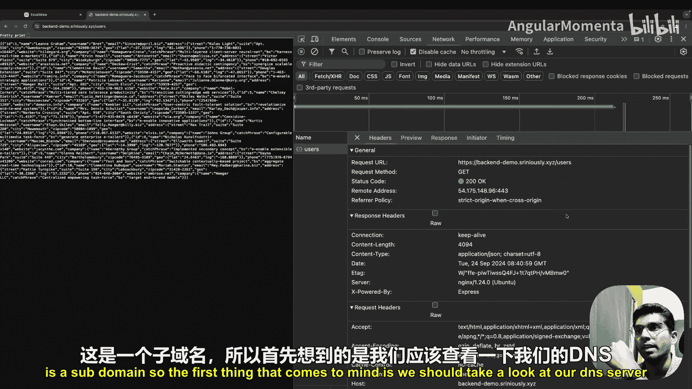

让我们追踪一下请求是如何从浏览器出发并到达服务器的。

### 第一步：域名解析

首先看到的是域名。例如 `backenddemo.sriniously.xyz`，这是一个子域名。我们首先应该查看DNS服务器。

这是我的DNS服务器配置，其中定义了不同类型的记录。DNS本身是一个庞大的主题，这里只介绍基础知识。简单来说，DNS有不同的记录类型，你可以使用A记录指向一个特定的IP地址，也可以使用CNAME记录指向一个特定的域名或子域名。

在我的现有域名和子域名配置中，需要关注的是这部分。这里有两个A记录，其中一个是 `backenddemo`，它指向一个特定的IP地址。这个IP地址来自哪里呢？它来自AWS中的一个EC2实例。

### 第二步：到达云服务器

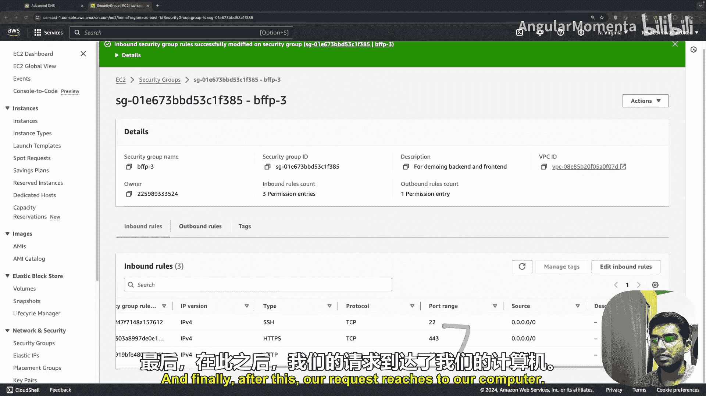

这是我的AWS控制台，进入EC2实例列表。这就是已部署的实例。这里显示的公共IP地址，正是我们刚才在DNS配置中看到的。因此，特定的子域名 `backenddemo` 指向这个IP地址，我们的请求通过这个IP到达EC2实例。

在请求到达我们的服务器（即这台计算机）之前，它会经过一个AWS原生的防火墙文件。这个文件需要允许某些类型的请求通过。

查看分配给AWS实例的安全组。基本上，通过安全组，我们可以指定允许哪些端口通过，哪些端口可以在互联网上被访问。可以看到，我们允许了三种不同的端口。我们使用其中一个端口通过终端或命令提示符登录到AWS实例以执行各种操作。而HTTPS和HTTP端口是这里的关键。

我们的请求到达域名服务器，域名服务器指向AWS实例的IP，请求通过该IP到达AWS实例。在进入计算机之前，请求会经过这些防火墙。如果我们不允许443端口（用于HTTPS流量）或80端口（用于HTTP流量），AWS会在此处阻止请求，我们的请求将无法到达服务器。这是一个重要的环节。

### 第三步：反向代理

最终，请求到达我们的计算机（AWS实例）。请求到达后，我们使用了一种叫做“反向代理”的技术。这意味着有一个服务器位于其他服务器之前，以便我们可以从一个集中位置管理不同类型的重定向或配置，而无需更改每个服务器的配置。

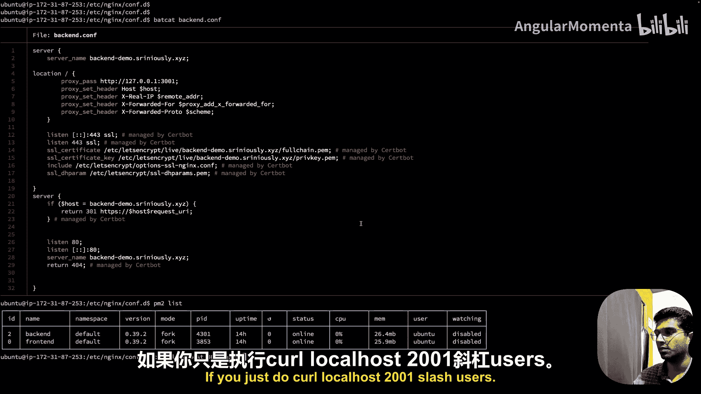

为此，我们使用了Nginx。配置文件看起来是这样的。这里有很多内容，但需要关注的部分是：我们使用Certbot自动分配SSL证书（在此演示中无需担心）。重点是，它在我们的AWS实例上监听80端口，并将请求重定向到443端口（即HTTPS请求）。这部分由Certbot管理。

我们配置的部分是这个。这里的意思是：定义服务器名（即我们的域名 `backenddemo.sriniously.xyz`）。任何到达此域名的请求（已经由DNS服务器路由至此实例）都将被处理。我们指定，所有到达此域名的请求，Nginx配置都会将它们重定向到 `localhost:3001`，这是我们的Node服务器运行的端口。

这是最终的重定向。如果我们查看进程列表（使用 `pm2 list` 管理进程），可以看到有两个进程在运行，一个用于前端，另一个用于后端。Node服务器就是最终的一环。

我们可以验证这一点：在实例内部调用 `localhost:3001/users`，会得到相同的响应。因此，从这个实例的角度看，我们的Node服务器运行在localhost上，我们使用Nginx和域名通过互联网将请求路由到本地服务器。

### 流程总结

总结一下，我们的请求从浏览器开始，经过以下步骤：
1.  到达DNS服务器。
2.  到达AWS服务器。
3.  经过防火墙。
4.  到达AWS实例。
5.  请求到达Nginx。
6.  最终被转发到 `localhost:3001` 的最终服务器。

请求经过所有这些“跳转”，最终才到达我们的服务器。当我们在本地开发时，可以直接在浏览器中打开 `localhost:3001/users` 看到相同的响应，在AWS实例内部也是如此。

现在，你应该对请求的样子以及它如何在互联网上传输并到达我们的服务器有了一个清晰的概念。

## 为什么我们需要后端？ 🤔

我将举例说明。想象一下，你正在浏览Instagram动态，看到朋友的帖子，像往常一样，你点了“赞”。在另一端，你的朋友会收到一个通知，显示你赞了他的帖子。

那么，在你点击“赞”按钮和你的朋友收到通知之间，到底发生了什么？这就是后端概念发挥作用的地方。

你点击“赞”按钮，应用程序向服务器发送一个请求。服务器处理该请求，识别用户（找到你的名字或ID），然后持久化保存“点赞”这个动作的数据。服务器通常需要将信息保存在某种数据库中。

接着，服务器检查帖子所属的用户ID，触发某种动作，向该用户发送通知。最终，你的朋友在手机上收到了通知。

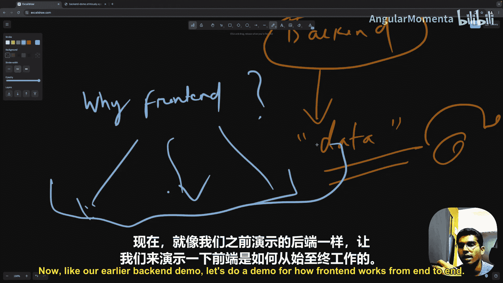

在你点击“赞”按钮和你的朋友收到通知之间发生的所有交互，必须有一个某种形式的服务器——一个中央计算机，它必须拥有所有用户的各种信息。因为你的应用程序是根据你的需求、个人资料、你关注的人以及你账户上可以执行的所有操作来设计和定制的。同样，你的朋友也只能收到针对他们的通知。

但是，服务器必须拥有所有类型的信息，所有类型的状态，因此它必须是集中式的。

如果我们尝试浓缩并剥离后端职责和用途，归结为一个词，那就是：**状态**。获取数据、接收数据以及将数据持久化存储在某个地方的需求，任何及所有涉及数据的操作都与此相关。

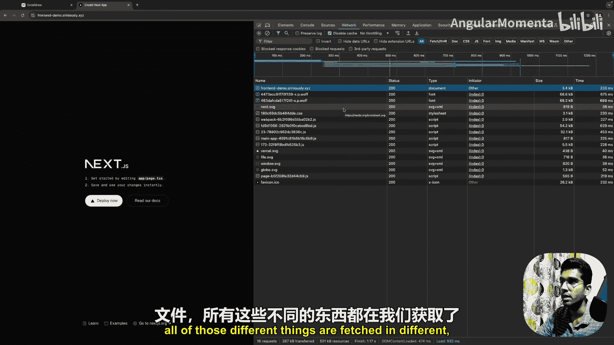

你可能会问：为什么不把所有事情都放在前端做呢？前端不也是某种设备或计算机吗？为什么不在这里连接数据库，为什么不在这里执行服务器做的所有事情？既然一切都是分布式的，理论上性能会更好，对吗？这是一个非常好的问题。

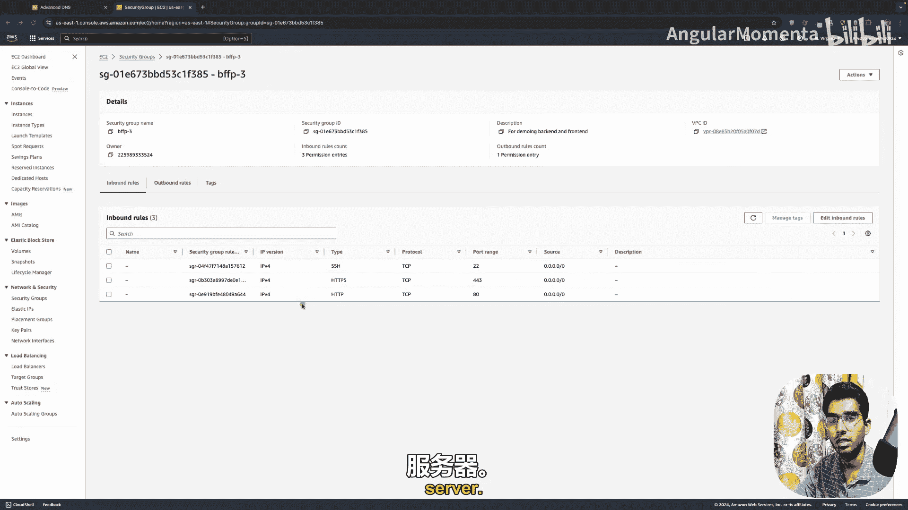

## 前端与后端的根本差异 ⚖️

为了理解为什么不能在前端使用所有这些功能，我们必须看看前端在幕后实际上是如何工作的。就像我们之前的后端演示一样，让我们做一个从前到后的前端工作流程演示。

这是一个部署在同一个AWS EC2实例上的Next.js应用程序。再次打开网络工具，刷新页面。

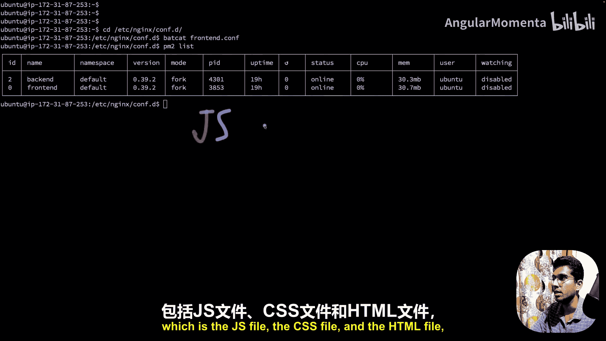

我们看到浏览器获取的第一个文档。它调用这个域名。查看响应，它是一个HTML文件。浏览器获取HTML文件以及所有资源，例如所有的JavaScript、图片、字体和CSS文件。所有这些不同的内容都是在获取了主要的HTML文件后，通过不同的请求分别获取的。

在我们的DNS记录中，我们看到有一个针对这个子域名 `frontenddemo.sriniously.xyz` 的条目，它指向这个特定的IP地址。追踪下去，我们到达这里，也就是AWS EC2实例，可以看到这是同一个公共IP地址。

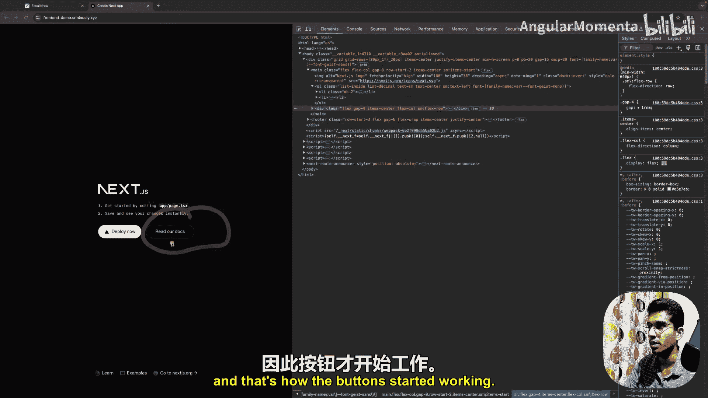

和之前一样，端口443和80必须被允许，以便HTTPS和HTTP流量能够通过防火墙到达我们的服务器。最终，请求到达我们的EC2实例。

查看Nginx配置，它看起来是这样的。大部分内容与后端服务器相同，我们有相同的服务器块配置，但不同之处在于：这里我们监听 `frontenddemo` 这个域名，所有到达此处的流量，我们都重定向到 `localhost:3000`（而不是后端的3001）。最终，请求到达我们的前端Next.js服务器，服务器提供文件（JS文件、CSS文件和HTML文件），这些文件通过网络发送到我们的浏览器。

在经历了所有这些之后，一旦我们收到主要的HTML文件，浏览器会遍历所有这些资源（JavaScript文件、CSS文件和字体），并逐一获取它们。一旦获取了所有CSS（我们在这里可以看到），它就会绘制窗口。这就是我们获得所有样式（黑色背景、这些字体和按钮样式）的方式。

一旦浏览器获取了所有的JavaScript文件，它就会为按钮和页面上任何我们有的交互“水合”所有事件监听器。例如，如果你点击这个按钮，它会跳转到另一个页面，这是因为浏览器获取了所有JavaScript，添加了所有事件监听器，按钮才开始工作。

### 关键差异

你注意到什么了吗？你编写的所有前端逻辑，你写的所有JavaScript，都被浏览器从我们的服务器获取，并在我们客户端的机器上由浏览器执行。**浏览器是我们的运行时环境**。

相比之下，我们之前看到的传统后端，在AWS EC2实例中，我们发送一个请求，服务器处理请求并返回结果，**实际的处理发生在服务器上**。这与前端正好相反，前端是发送代码，但由浏览器运行代码，无论执行什么逻辑，都是由浏览器运行的。这是这里需要注意的一个关键区别。

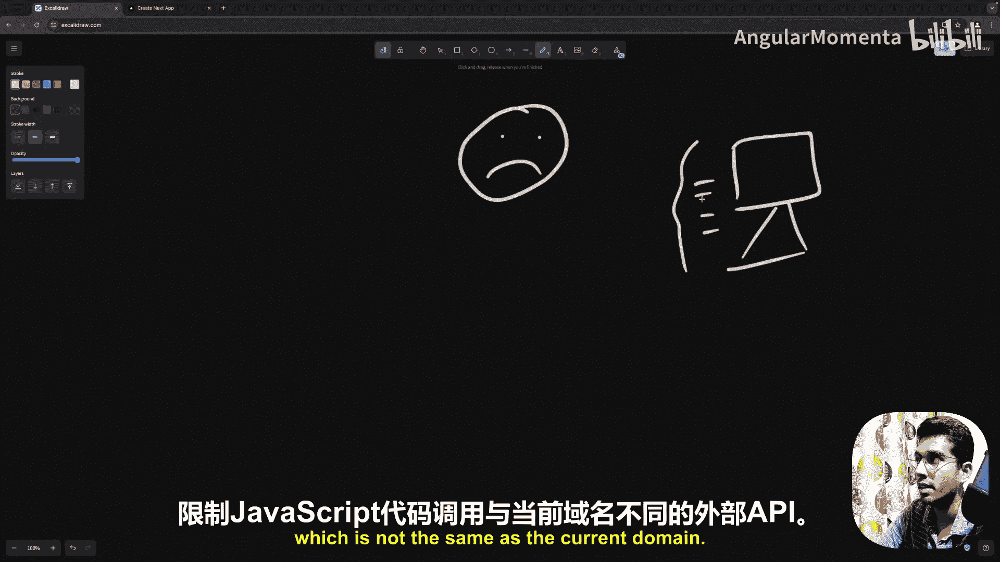

## 为何后端逻辑不能放在前端？ 🚫

现在，我们在这里发现了几个问题。

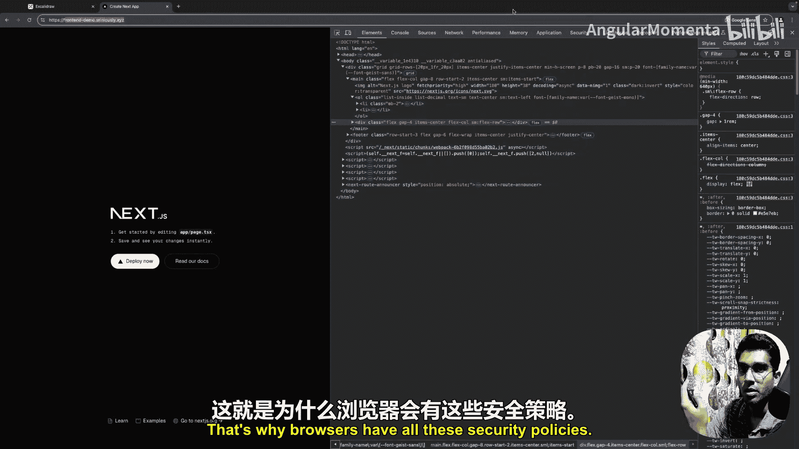

首先，浏览器运行时通常是沙盒环境，这意味着它们与我们的操作系统、进程和文件系统是隔离的。代码只能访问有限的资源，例如DOM（文档对象模型）、浏览器API（如本地存储或Cookie）以及外部API（但前提是外部API设置了所有必需的头部）。我们还没有详细讲解CORS（将在未来的视频中深入探讨），但你可以将CORS理解为浏览器的一项安全策略，它限制JavaScript代码调用与当前域名不同的外部API。

例如，我们的前端应用在 `frontenddemo.sriniously.xyz` 这个域名下，我们只能获取或调用同一域名下的资源或外部API。如果我们尝试调用不同的域名，浏览器会因为CORS策略而阻止请求。当然有办法绕过这一点（通过设置头部），我们稍后会探讨。

如果你仔细想想，所有这些沙盒化和安全限制都是有道理的。因为本质上，浏览器所做的是从远程服务器获取代码并在用户的浏览器中执行它。如果不够谨慎或隔离不足，远程代码可以轻易访问用户计算机上的数据或文件，这不是一件好事。

想象一下，你访问一个网站，完全不知道其前端代码是什么。如果浏览器没有隔离环境，该代码可以轻易访问你的文件系统，复制你所有的文件、敏感信息，并将其发送到他们的服务器。这是一个非常可怕的想法，这就是为什么浏览器有所有这些安全策略。

回到我们最初的问题：为什么我们不能在前端编写后端逻辑？

1.  **安全原因**：浏览器的安全策略限制非常严格。而后端通常需要访问底层文件系统（无论是写入日志文件还是访问环境变量），浏览器不允许这样做。这对后端服务器来说是一个巨大的限制。
2.  **调用外部API的限制**：除非该API设置了所有适当的CORS头部，否则你不能随意调用外部API。由于我们无法控制所有外部API，这也是一个重大的阻碍，因为后端服务器通常需要连接到其他服务器并从多个地方获取数据。
3.  **数据库连接**：服务器运行时可以访问所有原生数据库驱动程序（例如PostgreSQL的`pg`、MongoDB驱动等），这使其能够高效地与数据库通信。这些驱动程序被设计为能够在可以处理套接字连接、处理二进制数据并维护持久连接的环境中工作，而浏览器无法做到这些。我们稍后将探讨后端服务器如何与数据库通信，但简而言之，后端服务器维护一个到数据库服务器的连接列表（通常称为连接池），这样它就不必为每个请求反复创建和销毁连接。因为后端服务器每秒会收到成千上万的请求，如果每个请求都执行连接和销毁逻辑，数据库服务器将不堪重负。驱动程序以能够维护连接列表的方式编写，而浏览器并非设计用于维护与数据库的持久连接。即使可以，每个用户都需要打开自己到数据库的直接连接，这也会使数据库服务器因连接过多而不堪重负。此外，在浏览器环境中也没有简单的方法来管理连接池或执行高效的查询。
4.  **计算能力**：我们使用的前端应用无处不在，可能是智能手机、台式机、笔记本电脑，甚至可能是一台只有256MB内存和单核处理器的电脑。用户可能没有足够的计算能力来执行一些繁重的业务逻辑，事情会开始卡顿，有时甚至会因负载而崩溃。因此，如果是一个服务于大量客户端的集中式后端服务器，我们可以随时轻松地增加其内存和CPU，轻松应对负载。

我们可以继续列出更多原因，但这应该能让你清楚地认识到，将后端逻辑放在前端并不是一个好主意——假设我们首先能够做到的话。

## 总结 📝

本节课中，我们一起学习了后端的核心定义。我们通过追踪一个网络请求的完整生命周期，深入了解了后端如何运作，包括DNS解析、防火墙规则、反向代理（如Nginx）以及最终的应用服务器。

更重要的是，我们对比了前端与后端运行时环境的根本差异：前端代码在用户浏览器中执行，受限于沙盒环境和安全策略；而后端代码在服务器上执行，拥有对系统资源、数据库和外部服务的完全访问能力。

基于这些差异，我们分析了为什么关键的业务逻辑、数据处理、数据库操作和复杂计算必须放在后端，这主要出于**安全**、**功能完整性**（如数据库连接）、**性能**和**可控性**的考虑。

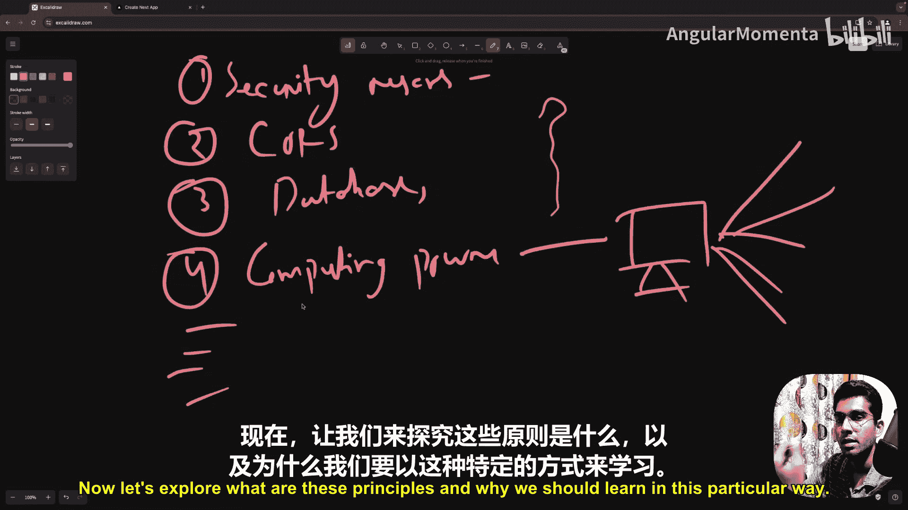

现在，在开始我们的后端工程学习之旅之前，这是一个非常好的认知起点。理解了“是什么”和“为什么”，我们才能更好地探索“怎么做”。在接下来的课程中，我们将从这些第一性原理出发，动手构建我们自己的后端系统。