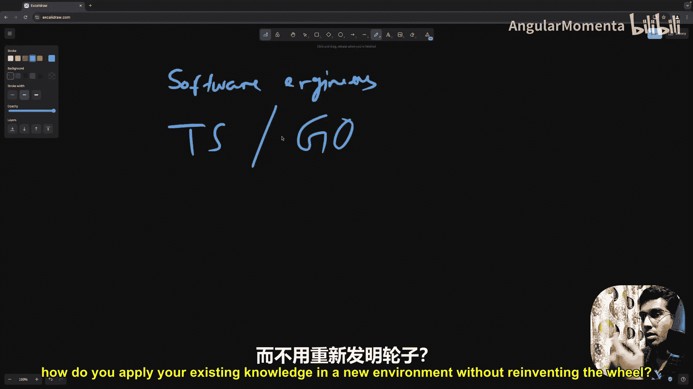
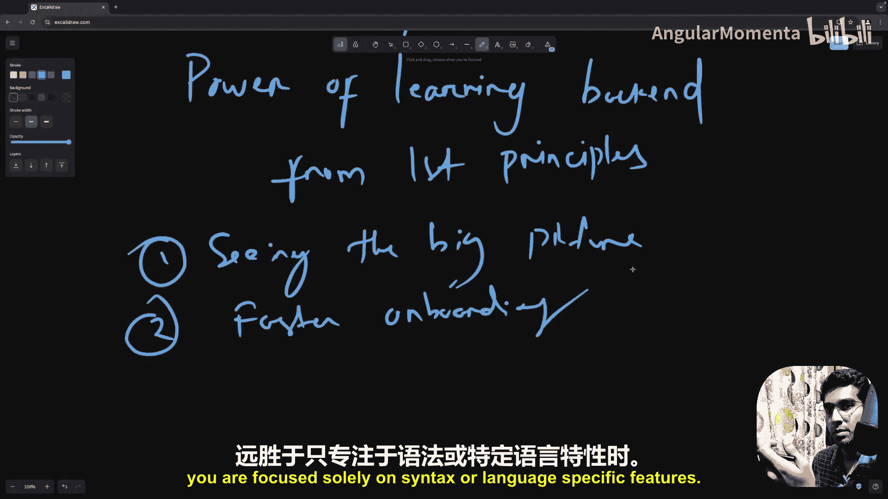
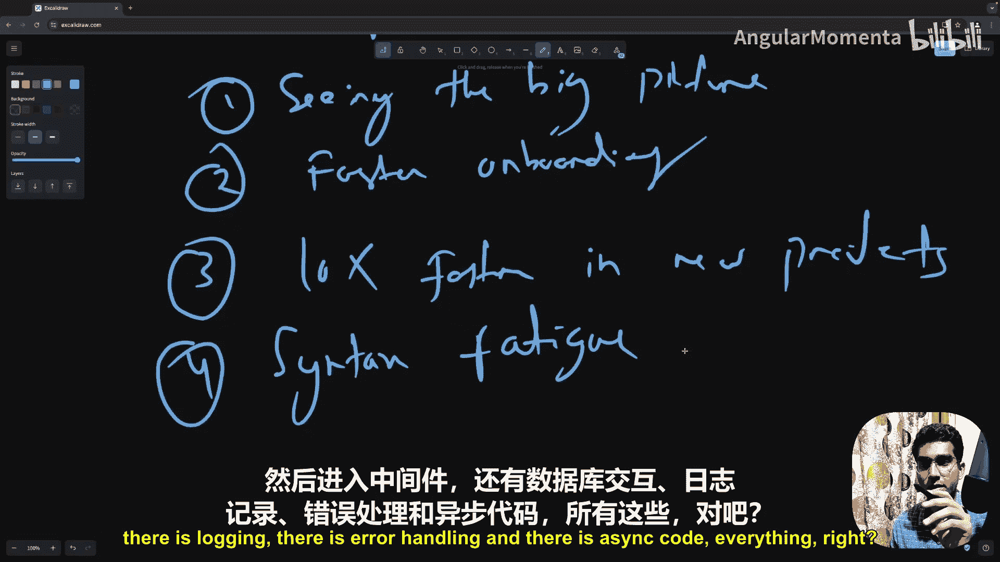
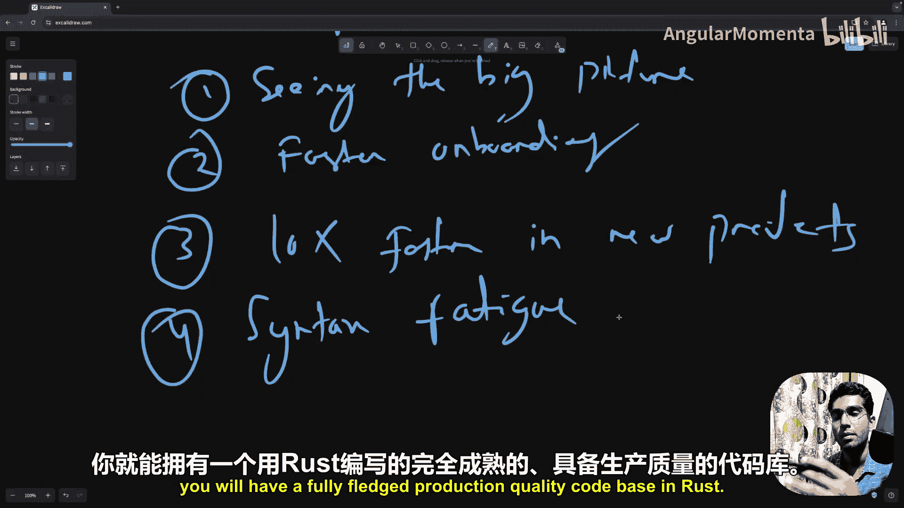
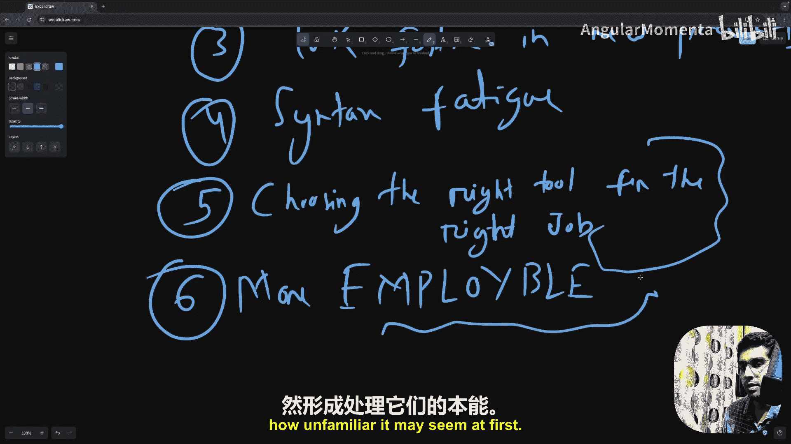
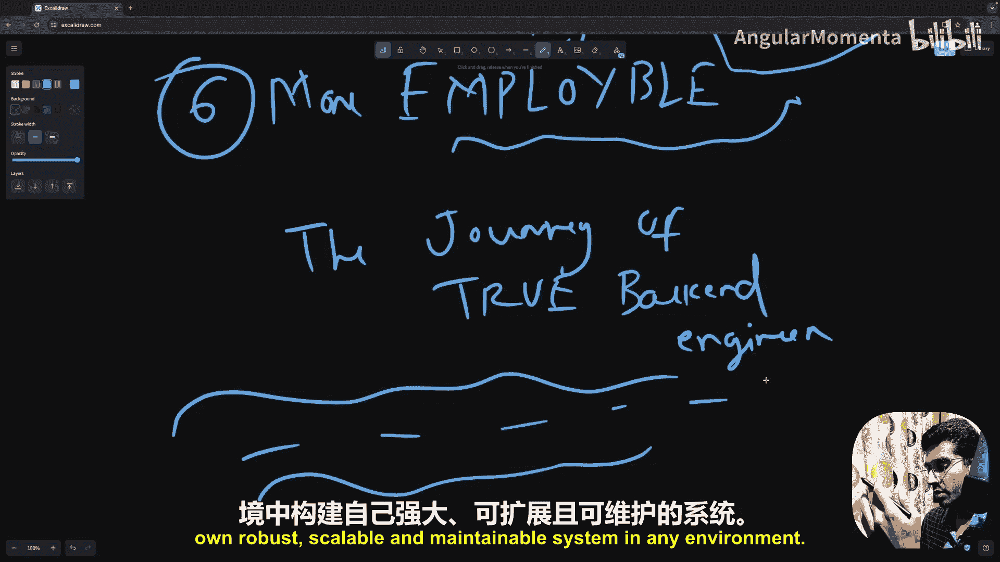
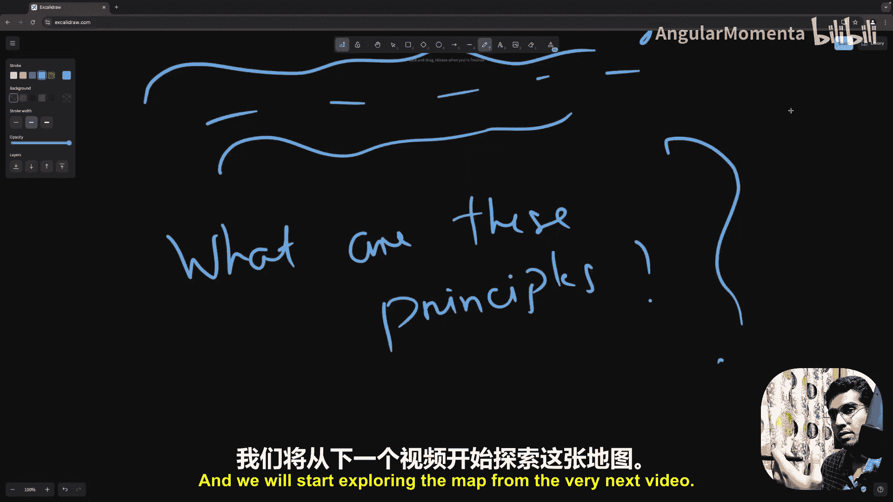

# 004：学习后端工程第一性原理的优势 🚀

在本节课中，我们将探讨从第一性原理学习后端工程所带来的具体优势。理解这些优势将帮助你明白，为何掌握核心原理比单纯学习特定框架或语法更为重要。

想象你是一名新入职的软件工程师。或许你是一名前端开发工程师。

你被要求修复后端代码库中的一个错误。

你可能会面临一些挑战。后端可能使用你不熟悉的语言编写。

或者，后端使用的语言你虽然了解，但更大的问题是你该从何处着手。你如何在代码的复杂性中定位问题而不迷失方向。

或者，想象你被要求从头开始创建一个API。

你如何形成对代码库的心智模型，遵循标准，并确保不会破坏现有功能。一种可能的情况是。

你是一名使用TypeScript或Go的后端工程师，突然被要求转向使用另一种语言。

例如Rust或Python。现在，你如何快速上手，而不必花费数小时查阅不同库的文档。

例如FastAPI或Pydantic，对于Rust，可能是Axum或其他库。

也可能是像SQLAlchemy或Diesel这样的ORM。所以问题是，你如何在新环境中应用现有知识，而不是重新发明轮子。

## 优势一：快速理解现有代码 🧠

这正是从第一性原理学习后端变得无比宝贵的地方。

将复杂系统分解为其最基本、最通用的组成部分的能力，为你提供了巨大优势。

例如，**纵观全局**。当你进入一个现有的代码库时。

你不会被其结构或工程复杂性所淹没。

你可以在心智上将系统的不同部分分离出来，并以隔离的方式处理它们。你将能够识别核心逻辑。

路由层、数据库连接以及过度设计的部分。通过过滤掉这些“噪音”。

你可以自信地开始进行修改或修复错误。你可能在高级工程师或首席技术官身上注意到这一点。

他们只需查看任何代码或特定代码库，就能迅速对正在发生的事情或错误可能的位置有一个清晰的了解。因为人脑非常擅长识别模式。

高级工程师或首席技术官，他们下意识地掌握了这些模式。因此他们实际上不必刻意使用这种方法。但我的问题是，为什么要等待多年的经验？你可以从第一天起就刻意练习，并在大约六个月或一年内精通此道。

## 优势二：更快地融入新环境 ⚡

第二点是**更快地融入**。当你理解了后端工程背后的第一性原理时。

例如HTTP如何工作、数据库如何与API交互、或请求如何流经中间件。

你可以深入任何语言或框架，并找到自己的方法。

你不再需要花费数小时阅读特定库的文档。

一旦你掌握了身份验证、路由、中间件和数据库交互背后的核心概念。

语法就是次要的。你将能够穿透噪音，专注于逻辑而非语法。

这使你能够比仅仅关注语法或语言特定功能时，更快地对代码库建立起深刻的熟悉感。

## 优势三：在新项目中开发更快 🏗️

第三点是**在新项目中开发更快**。当你从头开始一个新项目时。

拥有基于第一性原理的后端知识，能帮助你以惊人的速度和精确度推进。

你将能够以生产质量的代码更快地创建MVP，因为你是基于对系统需求的深刻理解来工作。

而不是仅仅遵循样板教程。你将知道如何构建路由、设置数据库连接，以及实现缓存、错误处理或日志记录等关键功能，而无需不断查阅文档。

## 优势四：减少语法疲劳 😊

第四点是**减少语法疲劳**。学习一门新语言本身就足以让人不知所措。

但如果你在掌握了语法之后，不确定接下来该学习什么概念，或者不知道如何应用该语法来解决实际的后端工程问题，就可能导致挫败感甚至倦怠。

第一性原理减少了这种语法疲劳，因为一旦你理解了基本的构建模块。

在不同语言之间切换就不再是一项艰巨的任务。你明白你要解决的问题是什么。

现在只是应用正确的语法和库的问题。例如。

你是一名Node.js开发者，想转型为Rust后端工程师。

你该怎么做？你显然会寻找一个关于如何用Rust创建后端的完整端到端项目教程。

至少需要四到五个小时。并且它还必须保持所有的生产质量标准。现在。

问题是，Rust是一门相对较新的语言。

我们拥有的资源数量，尤其是基于项目的资源。

远不如Node.js那么多。那么你如何精通它呢？你可能会不断为此担忧。

我找不到任何项目。我找不到任何好的资源。你擅长基本语法。

知道如何在Rust中处理不同的数据结构和编写基本程序。

但你如何跨越那个门槛，真正构建一个端到端的、生产质量的项目呢？

这就是第一性原理发挥作用的地方。想象一下，你理解了后端的不同层次。

例如，你从路由开始，然后到中间件，接着是数据库交互。

还有日志记录、错误处理和缓存代码等所有部分。

你清楚地理解了所有这些不同的组件，无论是在概念上还是在Node.js的实现中。

那么下一步是什么？你了解Rust的基本语法。

所以你按照社区推荐的项目布局启动一个Rust项目。

然后你分别针对每个组件进行实现。你知道生产质量的路由代码应该是什么样子。

你知道生产质量的验证代码应该是什么样子。

你知道数据交互、仓库模式、处理器以及身份验证和授权的代码应该是什么样子。

你了解所有优秀的模式。现在你只需要将你的Rust语法转换成那种模式。

假设你想处理验证。你去查找如何在Rust中进行验证。你很可能会找到一个库或某种实现验证的标准库模式。

现在你知道了语法，并且已经了解了最佳实践和模式，你将它们结合起来。现在你有了一个Rust中生产质量的验证模块。

然后你对每个模块重复这个模式。

例如身份验证以及所有其余的模块逻辑。

很快，在两三天内，你将拥有一个功能齐全、生产质量的Rust代码库。

## 优势五：为正确的工作选择正确的工具 🔧

第五点是**为正确的工作选择正确的工具**。这是我看到工程师们每天都会面临很多问题的地方。

我们被自己的标签所束缚。我们认为自己是一名Node.js后端开发者，或者是一名Ruby后端开发者。当我们面临一个必须构建具有非常高并发需求或非常低延迟需求的模型的需求时。

我们就被困在自己通常使用的语言中，而无法自信地去选择最合适的工具。通过理解后端工程解决的核心问题——数据持久化、安全性、可扩展性——你将获得为正确工作选择正确工具的能力。

你将不再受限于你的框架、语言或库。你将确切地知道该使用哪种工具、哪种语言和哪种框架。你将理解何时使用像Redis进行缓存、PostgreSQL处理关系型数据、MongoDB处理非结构化数据，或者Kafka进行实时事件流处理是合理的，而与你当前正在使用的技术栈无关。

## 优势六：更高的就业能力 💼

最后一点是**更高的就业能力**。这是当今快速变化的技术环境中我们大多数人所追求的。

能够跨语言和框架应用你的后端知识，使你变得极其多才多艺，从而更具就业竞争力。雇主希望雇佣那些能够批判性、独立地思考，能够加入任何团队并迅速贡献价值的工程师。

通过掌握后端原理，你将成为那种适应性强的工程师，不受特定语言或技术栈的限制。

而是拥有在任何环境中解决问题的能力。

好消息是，你不需要等待多年的经验来培养这些技能。

你可以从今天开始刻意练习。通过专注于每个后端系统中都相同的核心概念，如路由、数据库或身份验证。

你可以建立自己的内在指南针，用于探索新的领域。

目标不仅仅是当问题出现时去解决它，而是要自信且高效地解决。

随着时间的推移，你将培养出一种处理任何后端代码库或项目的自然直觉。

无论它最初看起来多么陌生。从第一性原理学习后端，将你从一个框架特定的开发者提升为一名真正的软件工程师。

一个不受特定技术栈或工具集限制的工程师。

而是理解后端工程所解决的核心问题。

这种自由使你能够轻松探索新的语言、框架和架构。

并使你在任何工程团队中都成为宝贵的资产。

因此，无论你是一名希望扩展技能的前端开发人员，还是一名想要转型到新语言的后端工程师，从第一性原理学习后端都将极大地加速你的成长，并赋予你在任何环境中构建自己健壮、可扩展和可维护系统的能力。

那么，这些原理到底是什么呢？当我说原理时。

我指的不是一系列规则。所谓第一性原理，我指的是一些基础构建块或基础组件，无论代码库大小，其余部分始终围绕它们展开。

这是一幅后端工程领域的通用地图。

它将帮助你找到方向。我们将从下一个视频开始探索这张地图。