# 005：后端工程师的HTTP入门，一切从这里开始 🚀

在本节课中，我们将要学习HTTP协议，这是浏览器与服务器之间进行数据交换的核心媒介。我们将从第一性原理出发，探讨HTTP的核心概念、消息结构、关键组件（如方法、状态码、头部）以及重要的交互模式（如CORS和缓存）。理解这些是构建和理解现代后端系统的基础。

## 概述

HTTP协议是客户端（如浏览器）与服务器通信的主要方式。虽然存在其他协议，但HTTP因其广泛使用而成为我们的焦点。本节将介绍HTTP的无状态性和客户端-服务器模型这两个核心理念，并深入探讨HTTP消息的各个组成部分。

## HTTP的核心理念

### 无状态性 (Statelessness)

无状态性意味着HTTP协议本身不记忆过去的交互。每个HTTP请求都携带服务器处理它所需的所有信息（如头部、URL和方法）。服务器响应后，便会“忘记”这个请求。当客户端发起新请求时，服务器将其视为一个全新且无关的事件。

这种设计带来了两个主要好处：
*   **简单性**：服务器无需存储会话信息，简化了架构。
*   **可扩展性**：请求可以轻松地分布到多个服务器上，因为没有单个服务器需要跟踪会话状态。

由于HTTP是无状态的，开发者通常需要实现状态管理技术（如Cookie、会话或令牌）来维持需要连续性的交互（例如用户登录或购物车）。我们将在本系列后续内容中探讨这些技术。

### 客户端-服务器模型

在典型的HTTP请求流中，总是存在一个客户端和一个服务器。
*   **客户端**：通常是Web浏览器或应用程序，通过向服务器发送请求来发起通信。客户端负责提供服务器所需的所有信息，如URL、请求方法和头部。
*   **服务器**：托管资源（如网站、API），等待来自客户端的请求。服务器收到请求后进行处理，并发送回适当的响应（如网页、数据、错误消息）。

需要记住的是，通信总是由客户端发起，目的是从服务器获取某种响应。在我们的讨论中，可以安全地假设HTTP和HTTPS是可互换的，因为HTTPS本质上是更安全的HTTP版本，增加了加密等安全特性。

## HTTP消息结构

HTTP消息分为**请求消息**（由客户端发送）和**响应消息**（由客户端从服务器接收）。让我们看看它们的结构。

一个HTTP请求消息示例如下：
```
GET /api/resource HTTP/1.1
Host: example.com
User-Agent: Mozilla/5.0
Authorization: Bearer token123
Content-Type: application/json

{"key": "value"}
```

一个HTTP响应消息示例如下：
```
HTTP/1.1 200 OK
Content-Type: application/json
Cache-Control: max-age=3600

{"data": "some response"}
```

在高层次上，请求消息包含：
*   **请求方法** (如 `GET`, `POST`)
*   **资源URL**
*   **HTTP版本** (如 `HTTP/1.1`)
*   **主机** (域名)
*   **请求头部** (一系列键值对)
*   **空行** (分隔头部和主体)
*   **请求主体** (客户端要发送给服务器的数据)

响应消息包含：
*   **HTTP版本**
*   **状态码** (如 `200`)
*   **状态码描述** (如 `OK`)
*   **响应头部**
*   **空行**
*   **响应主体**

## HTTP头部详解

头部是HTTP消息中非常重要的部分，它们是提供请求或响应元数据的键值对。

可以将HTTP头部类比为包裹上的邮寄标签。我们不会把收件人地址写在包裹里面，而是写在包裹外面，这样快递员在传输过程中无需反复打开包裹就能快速获取必要信息。HTTP头部的作用类似，它为服务器和客户端提供了一种快速检查和处理请求/响应元数据的方式。

以下是主要的头部类别：

*   **请求头部**：由客户端发送，提供关于请求本身的信息。例如：
    *   `User-Agent`: 标识客户端类型（浏览器、移动应用等）。
    *   `Authorization`: 发送认证凭证（如Bearer令牌）。
    *   `Accept`: 指定客户端期望接收的内容类型（如 `application/json`）。

*   **通用头部**：可用于请求和响应，提供关于消息本身的元数据。例如：
    *   `Date`: 消息日期。
    *   `Cache-Control`: 缓存控制指令。
    *   `Connection`: 控制连接是否保持活动状态。

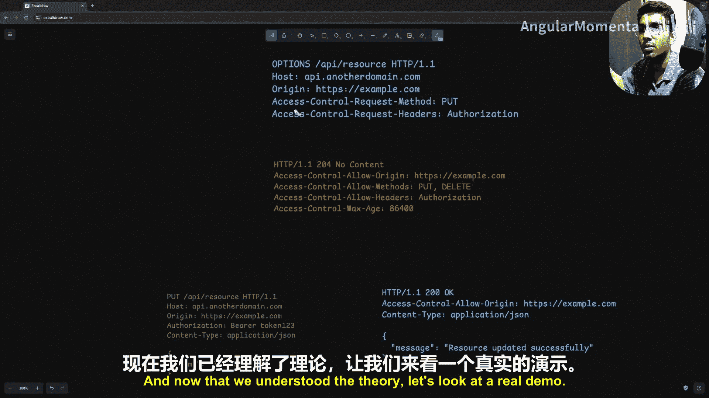

*   **表示头部**：主要处理被传输资源的表示形式。例如：
    *   `Content-Type`: 描述媒体类型（如 `application/json`, `text/html`）。
    *   `Content-Length`: 资源大小（字节）。
    *   `Content-Encoding`: 指定编码（如 `gzip`）。
    *   `ETag`: 用于缓存的唯一标识符。

*   **安全头部**：用于增强请求和响应的安全性。例如：
    *   `Strict-Transport-Security (HSTS)`: 强制使用HTTPS。
    *   `Content-Security-Policy (CSP)`: 限制可加载内容的来源。
    *   `X-Frame-Options`: 防止页面被嵌入iframe。
    *   `Set-Cookie` 属性 (`HttpOnly`, `Secure`): 保护Cookie安全。

关于HTTP头部，有两个重要的理念：
1.  **可扩展性**：HTTP高度可扩展，可以通过添加或自定义头部来适应新技术和用例，而无需修改底层协议。
2.  **远程控制**：HTTP头部充当客户端的“远程控制”，允许客户端向服务器发送指令或偏好设置，从而影响服务器的响应或处理方式。例如，通过 `Accept` 头部进行内容协商，或通过 `Cache-Control` 控制缓存。

## HTTP方法

HTTP方法定义了客户端希望对服务器资源执行的操作意图，为每种类型的动作提供了清晰的语义。

以下是核心的HTTP方法：
*   **GET**：用于从服务器获取数据，不应修改服务器上的任何内容。
*   **POST**：用于在服务器上创建新数据。通常包含请求主体。
*   **PATCH**：用于部分更新数据。请求主体包含要更新的字段。
*   **PUT**：用于完全替换资源。请求主体应包含完整的新资源表示。
*   **DELETE**：用于从服务器删除资源。

一个相关的概念是**幂等性**。幂等方法意味着多次调用会产生相同的结果。
*   **幂等方法**：`GET`, `PUT`, `DELETE`。例如，多次获取同一资源（GET）结果相同；多次完全替换同一资源（PUT）结果相同；删除一个资源（DELETE）后，再次删除结果相同（资源已不存在）。
*   **非幂等方法**：`POST`。多次提交创建请求（POST）通常会产生多个新资源，结果不同。

此外，还有一个 **`OPTIONS`** 方法，主要用于CORS（跨源资源共享）流程中，客户端用它来查询服务器对跨源请求的支持能力。开发者通常不会直接使用它，但会在浏览器开发者工具的“网络”选项卡中看到它作为“预检请求”出现。

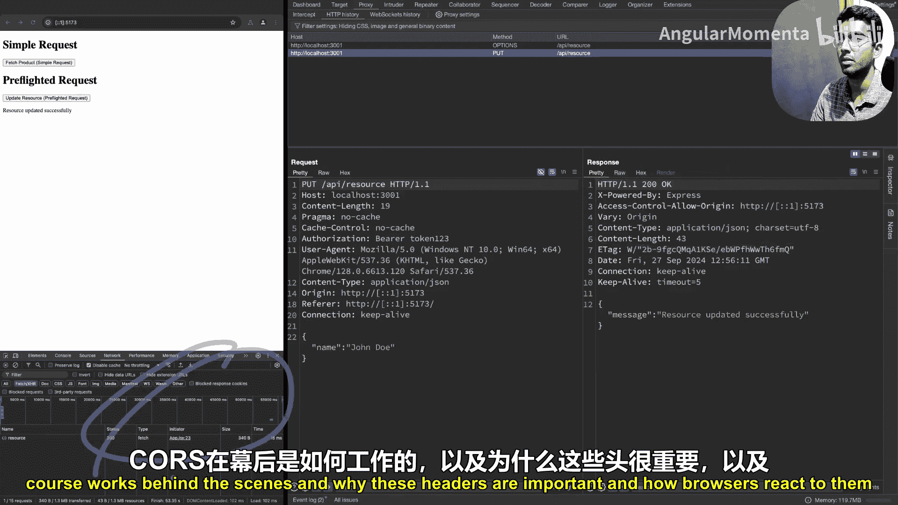

## 跨源资源共享

CORS是一种安全机制，允许Web应用从不同域（源）的服务器请求资源。浏览器默认遵循**同源策略**，限制从一个源加载的网页与另一个源的资源进行交互。CORS通过特定的HTTP头部来安全地启用这种跨源请求。

CORS流程主要分为两种：**简单请求** 和 **预检请求**。

### 简单请求流程

简单请求需满足特定条件（如使用 `GET`、`POST`、`HEAD` 方法，且仅包含简单头部）。流程如下：
1.  客户端（前端，如 `example.com`）向不同源的服务器（如 `api.example.com`）发送请求。浏览器自动添加 `Origin` 头部。
2.  服务器检查 `Origin` 是否在其允许的CORS策略内。
3.  如果允许，服务器在响应中包含 `Access-Control-Allow-Origin: example.com`（或 `*`）头部。
4.  浏览器检查响应头部。如果 `Access-Control-Allow-Origin` 与请求源匹配，则允许响应通过；否则，浏览器会阻止响应并抛出CORS错误。

### 预检请求流程

当请求不满足简单请求条件时（例如使用 `PUT`、`DELETE` 方法，包含非简单头部如 `Authorization`，或 `Content-Type` 为 `application/json`），浏览器会先发送一个 **预检请求** (`OPTIONS` 方法)。

预检请求流程如下：
1.  浏览器自动发送一个 `OPTIONS` 方法的请求到目标URL，并包含 `Origin`、`Access-Control-Request-Method`（询问是否支持 `PUT` 等方法）和 `Access-Control-Request-Headers`（询问是否支持 `Authorization` 等头部）头部。
2.  服务器响应预检请求，状态码通常为 `204 No Content`，并在响应头部中声明其CORS策略，例如：
    *   `Access-Control-Allow-Origin: example.com`
    *   `Access-Control-Allow-Methods: PUT, DELETE`
    *   `Access-Control-Allow-Headers: Authorization, Content-Type`
    *   `Access-Control-Max-Age: 86400` (指示浏览器可以缓存该预检结果多久，避免重复预检)
3.  浏览器检查预检响应。如果所有条件都满足（源、方法、头部都被允许），则继续发送原始的“实际”请求（如 `PUT`）。
4.  服务器处理实际请求并返回最终响应。

理解CORS的底层机制对于前后端调试和构建安全的API至关重要。

## HTTP状态码

HTTP状态码是三位数字代码，用于以标准化的方式快速传达请求的结果。客户端无需解析响应体即可判断请求状态。

状态码根据首位数字分类：
*   **1xx (信息性)**：例如 `100 Continue`（服务器已收到请求头，客户端可继续发送请求体），`101 Switching Protocols`（协议升级，如切换到WebSocket）。
*   **2xx (成功)**：
    *   `200 OK`：请求成功。
    *   `201 Created`：资源创建成功（常用于POST请求）。
    *   `204 No Content`：请求成功，但无内容返回（常用于DELETE请求或OPTIONS预检请求）。
*   **3xx (重定向)**：
    *   `301 Moved Permanently`：资源已永久移动到新URL。
    *   `302 Found`：资源临时位于不同URL。
    *   `304 Not Modified`：资源未修改，客户端可使用缓存版本（与缓存头配合使用）。
*   **4xx (客户端错误)**：
    *   `400 Bad Request`：请求格式错误或包含无效数据。
    *   `401 Unauthorized`：请求需要认证，但凭证缺失或无效。
    *   `403 Forbidden`：服务器理解请求，但拒绝授权（即使已认证）。
    *   `404 Not Found`：请求的资源不存在。
    *   `405 Method Not Allowed`：请求方法不被目标资源支持。
    *   `409 Conflict`：请求与服务器当前状态冲突（如创建重复资源）。
    *   `429 Too Many Requests`：客户端发送的请求过多（常用于限流）。
*   **5xx (服务器错误)**：
    *   `500 Internal Server Error`：服务器内部错误。
    *   `501 Not Implemented`：服务器不支持请求的功能。
    *   `502 Bad Gateway`：作为网关或代理的服务器从上游服务器收到无效响应。
    *   `503 Service Unavailable`：服务暂时不可用（如维护、过载）。
    *   `504 Gateway Timeout`：网关或代理服务器未能及时从上游服务器收到响应。

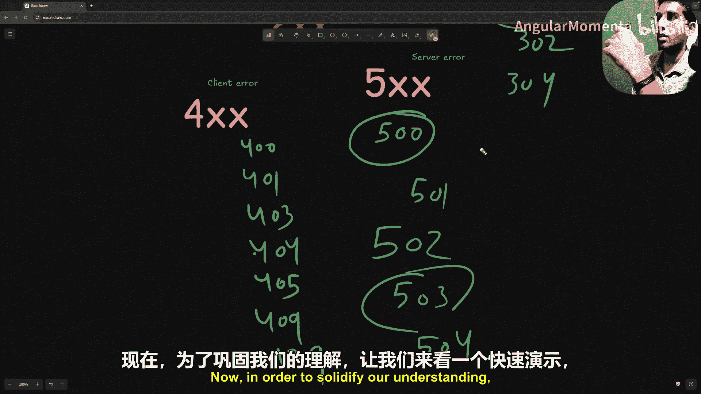

掌握这些常见状态码对于API设计和问题排查非常有帮助。

## HTTP缓存

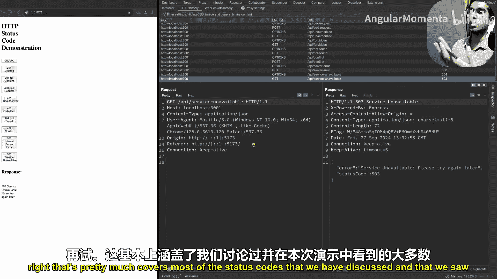

HTTP缓存是一种存储响应副本以供重用的技术，可以减少对服务器的重复请求，从而提升加载速度、节省带宽并降低服务器负载。

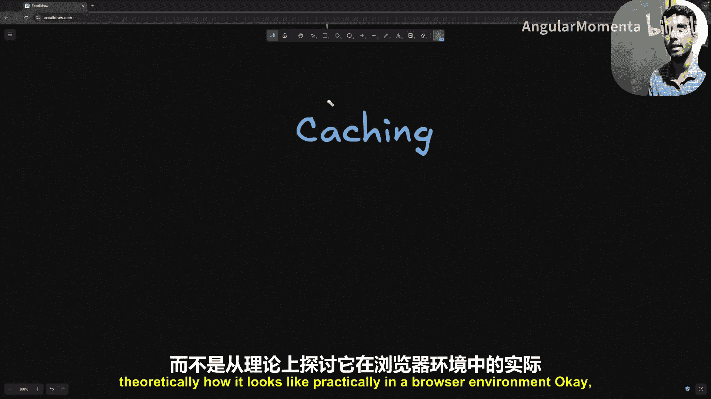

核心缓存头包括：
*   `Cache-Control`：指定缓存策略，如 `max-age=10`（缓存10秒）。
*   `ETag`：响应内容的哈希标识符。当资源变化时，ETag也会改变。
*   `Last-Modified`：资源最后修改时间。

缓存工作流程示例：
1.  首次请求资源，服务器返回 `200 OK` 及响应体，并附带 `Cache-Control`, `ETag`, `Last-Modified` 头部。
2.  客户端再次请求同一资源时，会在请求头中带上 `If-None-Match`（值为之前收到的 `ETag`）和 `If-Modified-Since`（值为 `Last-Modified`）。
3.  服务器检查资源是否变化。如果 `ETag` 匹配或资源未修改，则返回 `304 Not Modified`，且不包含响应体。客户端则使用本地缓存。
4.  如果资源已更新，服务器返回 `200 OK` 及新的响应体和新的 `ETag`/`Last-Modified`。

虽然现代前端库（如React Query）提供了更强大的客户端缓存方案，但理解HTTP层面的缓存机制仍然很有价值。

## 内容协商与压缩

内容协商是客户端和服务器就数据交换的最佳格式达成一致的机制。

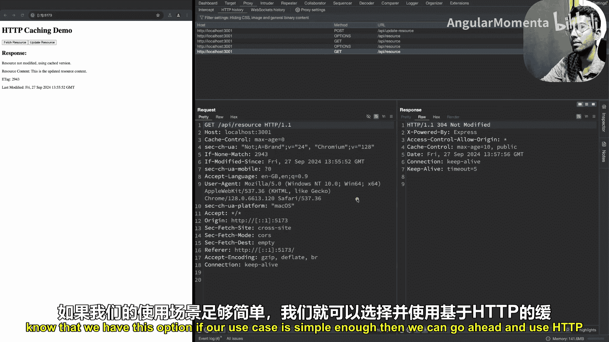

主要类型：
*   **媒体类型协商**：客户端通过 `Accept` 头（如 `application/json`, `application/xml`）指定期望的格式。
*   **语言协商**：客户端通过 `Accept-Language` 头（如 `en-US`, `es`）指定期望的语言。
*   **编码协商**：客户端通过 `Accept-Encoding` 头（如 `gzip`, `deflate`）指定支持的压缩编码。

**HTTP压缩**是内容协商的一部分，用于减少传输数据的大小。当客户端在 `Accept-Encoding` 中声明支持 `gzip` 时，服务器可以用 `gzip` 压缩响应体，并在响应头中设置 `Content-Encoding: gzip`。浏览器收到后会解压。这能显著节省带宽，尤其对于大型响应。

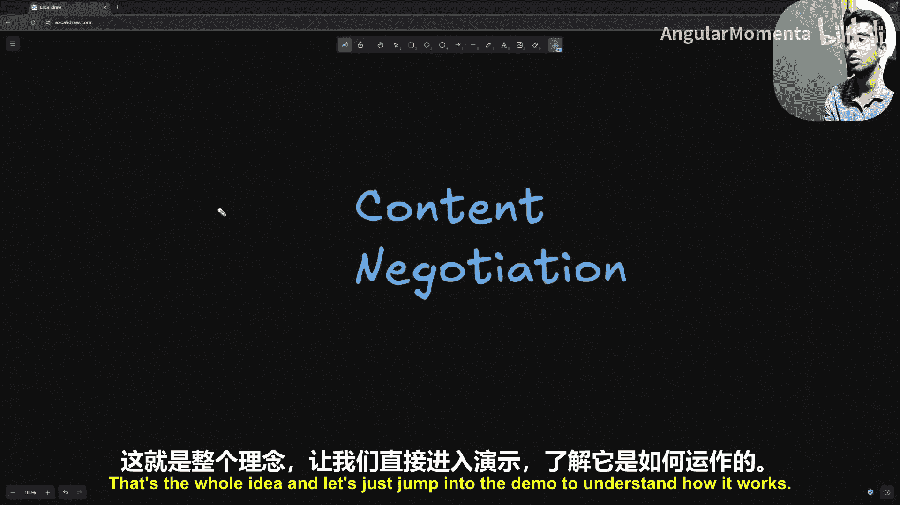

## 持久连接与大数据处理

### 持久连接

在HTTP/1.0中，每个请求/响应周期都需要建立新的TCP连接，效率低下。HTTP/1.1引入了**持久连接**（默认启用），允许在单个TCP连接上发送多个请求和响应，减少了建立和关闭连接的开销。这是通过 `Connection: keep-alive` 头部（或默认行为）实现的。

### 处理大请求与响应

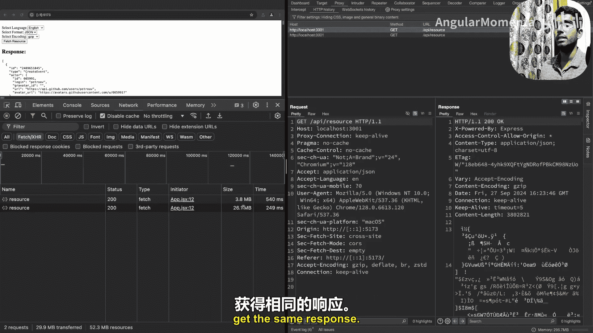

*   **发送大请求（如文件上传）**：使用 `multipart/form-data` 内容类型。请求体被分成多个部分（“part”）传输，每个部分由在 `Content-Type` 头中定义的 `boundary` 字符串分隔。这允许高效地上传大型二进制文件。
*   **接收大响应**：服务器可以使用**分块传输编码**或类似技术流式传输数据。例如，设置 `Content-Type: text/event-stream` 并保持连接打开（`Connection: keep-alive`），服务器可以持续向客户端发送数据块，直到传输完成。这对于实时数据或大文件下载非常有用。

## 安全传输：SSL/TLS与HTTPS

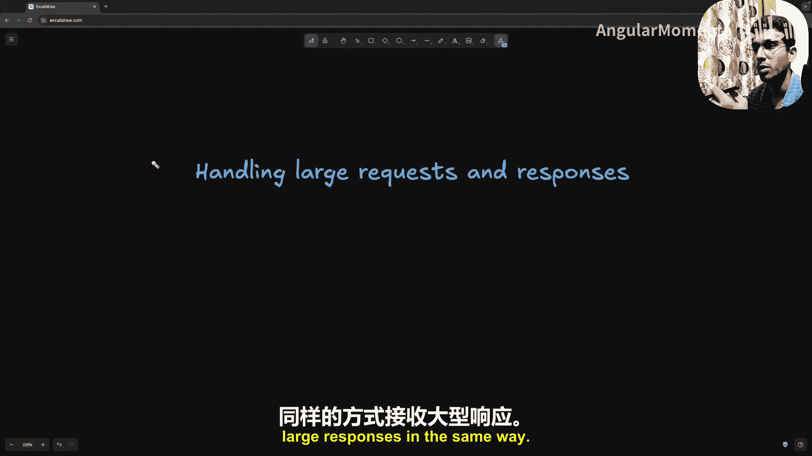

虽然应用层开发者不直接配置这些，但了解其概念很重要。
*   **SSL/TLS**：是用于在客户端和服务器之间建立加密链路的协议，保护传输中的数据（如密码、信用卡号）不被窃听或篡改。SSL是旧版本，现已基本被更安全的TLS取代。
*   **HTTPS**：即 “HTTP over TLS”。当使用HTTPS时，客户端和服务器之间的所有通信都经过TLS加密。这是通过服务器提供的数字证书来建立信任和加密连接的。

简而言之，HTTPS = HTTP + 加密（TLS）。

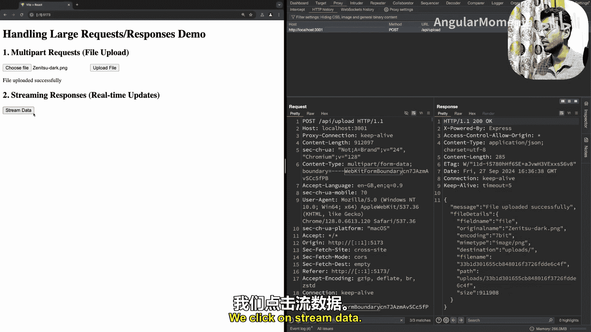

## 总结

本节课我们一起深入学习了HTTP协议，这是后端开发的基石。我们从无状态性和客户端-服务器模型这两个核心理念出发，详细剖析了HTTP消息的结构，包括请求/响应行、各种功能的头部（如用于CORS、缓存、内容协商的头部）、定义操作意图的HTTP方法以及传达结果的状态码。

我们还探讨了关键的交互模式，如跨源资源共享的流程、利用头部实现缓存和内容协商的机制，以及处理大文件和保持连接效率的方法。最后，我们简要了解了HTTPS背后的安全层（TLS）。

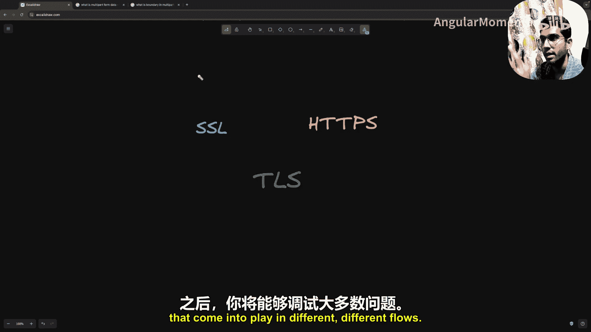

理解这些组件如何协同工作，能够帮助您构建健壮的后端系统、高效地调试问题，并为学习更高级的网络概念打下坚实的基础。虽然HTTP协议本身还在演进（如HTTP/2、HTTP/3），但本节涵盖的原理和核心概念是持久不变的。