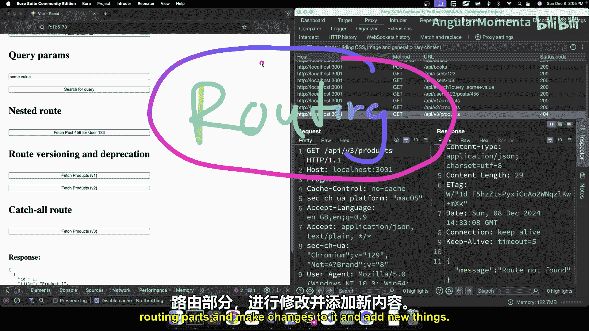

# 006：后端中的路由是什么？请求如何找到归途 🧭

在本节课中，我们将要学习后端开发中的一个核心概念：路由。我们将了解HTTP方法与路由如何协同工作，以及不同类型的路由（如静态路由、动态路由、嵌套路由等）是如何运作的。通过本教程，你将清晰地理解请求是如何被服务器映射到特定处理逻辑的。

## 概述：意图与目的地

在上一节中，我们讨论了不同的HTTP方法及其在HTTP语义中的重要性。这些HTTP方法描述了你的**意图**，即你想对特定资源执行什么操作，例如获取、添加、更新或删除数据。

而**路由**的作用，则是表达请求的**目的地**。你需要告诉服务器，你希望将你的意图发送到哪里，或者说，你希望对哪个资源执行操作。


例如，一个请求的方法是 `GET`，意图是从服务器获取数据。其路由路径或URL是 `/api/users`。服务器则会返回一个用户数组。这里，`GET` 表达了“获取”这个动作，而 `/api/users` 则指明了“从用户资源获取”这个目的地。

服务器将你的意图（HTTP方法）和目的地（路由路径）结合起来，映射到特定的处理程序或一组指令上，执行所有业务逻辑和数据库操作，并返回数据。

**总结来说，路由本质上就是将URL参数映射到服务器端逻辑的过程。**

## 静态路由

首先，我们来探讨最基本的路由类型：静态路由。

以下是静态路由的一个例子：
*   **方法**: `GET`
*   **路由**: `/api/books`
*   **含义**: 获取书籍列表。

另一个例子：
*   **方法**: `POST`
*   **路由**: `/api/books`
*   **含义**: 创建一本新书。

请注意，在这两个请求中，路由部分 `/api/books` 是相同的。服务器通过组合 **HTTP方法** 和 **路由路径** 来形成唯一的键，从而映射到不同的处理程序。`GET /api/books` 和 `POST /api/books` 是两个完全不同的路由，它们永远不会冲突。

之所以称之为**静态路由**，是因为路由路径本身是固定的、不变的字符串（如 `/api/books`），不包含任何可变部分。它总是返回相同类型的数据响应。

## 动态路由与路径参数

上一节我们介绍了静态的、固定的路由。本节中，我们来看看当路由路径需要包含可变信息时该怎么办，这就是动态路由。

考虑以下请求：
*   **方法**: `GET`
*   **路由**: `/api/users/123`
*   **含义**: 获取ID为 `123` 的用户的详细信息。

在这个例子中，路由路径的一部分（`123`）是动态的，它代表一个具体的用户ID。服务器可以从路由路径中提取这个ID值，然后执行相应的操作（例如从数据库查询该用户）。

这种动态部分被称为**路径参数**或**路由参数**。在服务器端，路由匹配通常使用特定的占位符（如 `:id`）来表示这个动态部分。

**代码示例：路由匹配**
```javascript
// 假设的服务器端路由定义
router.get('/api/users/:id', (request, response) => {
  const userId = request.params.id; // 提取路径参数，例如 ‘123’
  // ... 根据 userId 执行逻辑
});
```
在上面的代码中，`:id` 是一个占位符，可以匹配像 `123` 这样的任何字符串。当请求 `/api/users/123` 到达时，它会被路由到这个处理程序，并且 `123` 的值可以通过 `request.params.id` 获取。

这种设计使得API端点具有语义化的可读性：`GET /api/users/123` 清晰地表达了“获取ID为123的用户数据”的意图。

## 查询参数

我们已经学习了如何通过路径参数在URL中传递数据。但有时，我们希望在请求中附加一些额外的、可选的信息，特别是对于 `GET` 请求（它通常没有请求体）。这时就需要用到**查询参数**。

观察以下请求：
*   **方法**: `GET`
*   **路由**: `/api/search?q=some+value`
*   **含义**: 搜索内容为 “some value”。

在这个URL中，`/api/search` 是基础路由。问号 `?` 之后的部分就是查询参数。它们以 `key=value` 的形式出现，多个参数之间用 `&` 连接，例如 `?page=2&limit=20&sort=asc`。

**查询参数的主要用途包括：**
*   **过滤数据**：例如 `?category=electronics`
*   **分页**：例如 `?page=2&limit=20`
*   **排序**：例如 `?sort=price&order=desc`
*   **搜索**：例如 `?q=keyword`

与路径参数用于标识特定资源（如 `/users/123`）不同，查询参数通常用于修饰主查询，提供额外的选项或元数据。在服务器端，可以通过解析URL的查询字符串部分来获取这些值。

## 嵌套路由

在实际的RESTful API设计中，为了清晰地表达资源之间的关系，我们经常会用到**嵌套路由**。

嵌套路由并不是一种独立的路由类型，而是一种组织路由的常见实践。它通过将资源层级关系体现在URL路径中，使API的语义更加明确。

请看以下一组逐渐深入的嵌套路由示例：

1.  `GET /api/users`
    *   **含义**: 获取所有用户列表。
2.  `GET /api/users/123`
    *   **含义**: 获取ID为 `123` 的单个用户。
3.  `GET /api/users/123/posts`
    *   **含义**: 获取ID为 `123` 的用户发布的所有帖子。
4.  `GET /api/users/123/posts/456`
    *   **含义**: 获取ID为 `123` 的用户发布的、ID为 `456` 的特定帖子。

每一级嵌套都表达了更具体的语义。服务器会为每一层嵌套定义相应的路由处理程序。这种结构在资源间存在从属关系（如“帖子属于用户”）时非常有用，能使API结构清晰且符合直觉。

## 路由版本控制

随着应用的发展，API可能需要进行不兼容的更改（例如响应格式变化）。为了平稳地管理这种变更，引入了**路由版本控制**。

观察以下两个请求：
*   `GET /api/v1/products`
*   `GET /api/v2/products`

`v1` 和 `v2` 就是版本标识。当API需要重大更新时，可以创建新版本（如 `v2`）的路由，同时保留旧版本（`v1`）一段时间。

**这样做的好处是：**
1.  **清晰表达意图**：明确区分不同格式的API。
2.  **平稳迁移**：前端开发者有足够的时间将调用从 `v1` 迁移到 `v2`。
3.  **向后兼容**：在迁移期间，旧客户端可以继续使用 `v1` 而不会中断。
4.  **有序弃用**：可以在未来某个时间点宣布弃用 `v1`，并最终移除它。

这是一种维护API长期稳定性和开发者友好性的重要实践。

## 通配路由（Catch-All Route）

最后，我们需要处理那些与已定义的所有路由都不匹配的请求。这就是**通配路由**或**兜底路由**的作用。

当用户请求了一个不存在的端点（例如 `GET /api/nonexistent`）时，如果服务器没有处理，可能会返回不友好的错误（如 `404 Not Found` 的默认页面）。

通过设置一个通配路由（例如 `/*` 或 `/api/*`），我们可以捕获所有未被前面路由规则匹配的请求，并返回一个统一的、友好的错误信息。

**示例响应：**
```json
{
  "error": "Route not found",
  "message": "The requested endpoint does not exist."
}
```
这提升了API的健壮性和用户体验，确保客户端总能收到结构化的错误反馈，而不是原始的服务器错误。

## 总结

本节课中，我们一起深入学习了后端路由的核心概念。

我们首先了解到，路由是**HTTP方法**（表达“做什么”）和**路由路径**（表达“对谁做”）的组合，它将客户端请求映射到服务器端的处理逻辑。

我们探讨了**静态路由**（固定路径）和**动态路由**（包含路径参数）。路径参数（如 `/users/:id`）用于在URL中标识特定资源。

接着，我们学习了**查询参数**（如 `?page=2`），它通常用于 `GET` 请求，以传递过滤、分页、排序等额外选项。

我们还介绍了**嵌套路由**，它通过路径层级清晰地表达资源间的从属关系（如 `/users/123/posts`）。

为了管理API的演进，我们了解了**路由版本控制**（如 `/api/v1/` 和 `/api/v2/`），这是实现平稳、向后兼容的API变更的关键策略。

最后，我们认识了**通配路由**，它用于优雅地处理所有未匹配的请求，提供友好的错误响应。



理解这些路由概念是构建清晰、可维护且强大的后端API的基础。现在，你已经具备了深入后端代码库并理解其路由结构所需的知识。