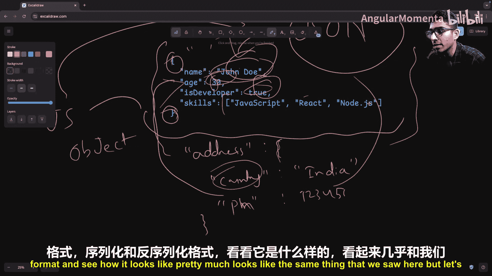
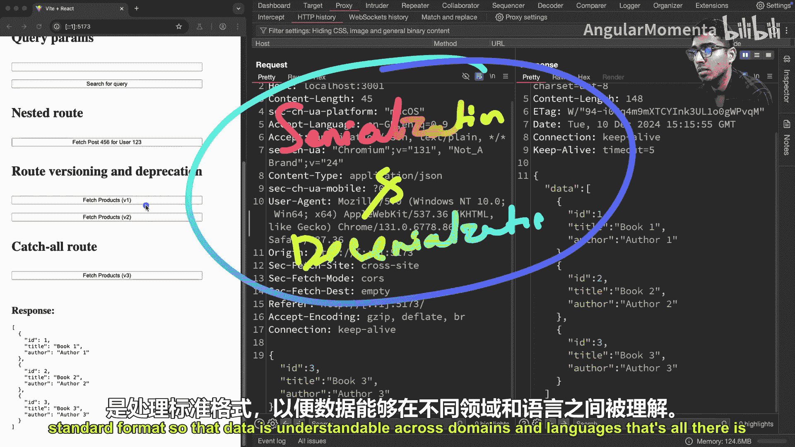

# 007：序列化与反序列化 📡

在本节课中，我们将要学习后端开发中的一个核心概念：序列化与反序列化。我们将探讨客户端与服务器之间如何通过一种共同的标准格式来交换数据，使得不同语言和环境的系统能够相互理解。

## 概述：客户端与服务器的通信

上一节我们介绍了网络通信的基本模型。本节中我们来看看数据在传输过程中是如何被理解和处理的。

我们通常有一个客户端，例如浏览器（如Chrome），以及一个服务器，它可能运行在本地主机或远程云服务（如AWS、GCP、Azure）上。客户端与服务器通过网络通信手段进行交互，例如HTTP（传统的REST API端点）、gRPC或WebSocket。在本系列中，我们主要关注基于HTTP的通信。

假设客户端是一个JavaScript应用（如React、Angular等框架构建的应用）。为了向服务器发送请求，客户端需要发起一个HTTP请求。一个典型的HTTP POST请求结构如下：

```http
POST /api/endpoint HTTP/1.1
Host: example.com
Content-Type: application/json

{
  "key": "value"
}
```

客户端通过请求体将数据发送给服务器，服务器则返回一个响应。关键在于，客户端（JavaScript应用）和服务器（例如Rust应用）使用完全不同的数据类型和语言特性。那么，数据如何在网络传输后被对方正确理解呢？

## 网络通信基础：OSI模型

在深入讨论数据传输之前，了解OSI模型是有益的。OSI模型将网络通信分为七层，从顶层的应用层到底层的物理层。虽然深入每一层（如数据包、帧）超出了本教程范围，但我们需要一个高层面的理解：数据在发送端从应用层开始，经过各层封装，最终通过物理层传输；在接收端则反向解封装，最终到达应用层。

对于后端工程师而言，需要建立的思维模型是：我们只需关心**应用层**的**数据格式**。客户端和服务器约定一个共同的标准格式。发送方将自身的数据结构转换为这种格式，接收方则将该格式转换回自身能理解的数据结构。这个“转换”过程就是序列化与反序列化。

## 什么是序列化与反序列化？

序列化是将数据从特定语言或环境的结构转换为一种通用的、标准化的格式的过程。反序列化则是其逆过程，将通用格式的数据转换回特定环境的结构。

**核心公式**可以概括为：
*   **序列化**: `特定语言数据结构 -> 通用标准格式（如JSON）`
*   **反序列化**: `通用标准格式（如JSON） -> 特定语言数据结构`

这种机制使得数据能够跨越不同编程语言和平台的界限进行传输和存储。

## 为什么选择JSON？

后端领域技术繁多。为了聚焦最常用、最核心的技术，我们做出以下选择：
*   **通信协议**：选择HTTP，因为REST API仍是客户端与服务器之间最常见的通信方式。
*   **数据库**：选择PostgreSQL，它是一种非常流行的关系型数据库。
*   **序列化标准**：选择JSON，因为它可能是80%场景下的首选，尤其在HTTP通信中。

序列化标准主要分为两类：
1.  **文本格式**：人类可读，如JSON、YAML、XML。
2.  **二进制格式**：更紧凑高效，如Protocol Buffers、Avro。

本课程将专注于**文本格式**中的**JSON**，因为它广泛应用于HTTP通信、配置文件、日志记录等场景。

## JSON详解

JSON（JavaScript Object Notation）是一种轻量级的数据交换格式。它虽然源自JavaScript，但已成为语言无关的通用标准。

一个典型的JSON对象如下所示：

```json
{
  "name": "Alice",
  "age": 30,
  "isStudent": false,
  "hobbies": ["reading", "cycling"],
  "address": {
    "country": "India",
    "phone": 1234567890
  }
}
```

以下是JSON的核心规则：
*   整个结构包裹在花括号 `{}` 中。
*   数据以键值对形式组织。
*   **键**必须是**字符串**，且用**双引号**包裹。
*   **值**可以是：
    *   字符串（双引号包裹）
    *   数字
    *   布尔值（`true`/`false`）
    *   数组（方括号 `[]` 包裹）
    *   另一个JSON对象（嵌套）
    *   `null`

## 实战演示：查看HTTP请求与响应中的JSON

让我们通过一个实际的API调用来观察序列化与反序列化的流程。假设我们向服务器发送一个创建书籍的POST请求。



**客户端发送的请求（序列化后的JSON）**：
```json
{
  "id": 101,
  "title": "The Rust Programming Language",
  "author": "Steve Klabnik"
}
```
客户端将内部的JavaScript对象转换（序列化）为上述JSON字符串，并通过HTTP请求体发送。

**服务器接收并处理**：
服务器（例如Rust后端）接收到这个JSON字符串后，将其解析（反序列化）为内部的Rust结构体（如 `struct Book`），然后执行业务逻辑（如将书籍存入数据库）。

**服务器返回的响应（序列化后的JSON）**：
```json
{
  "books": [
    {"id": 101, "title": "The Rust Programming Language", "author": "Steve Klabnik"},
    {"id": 102, "title": "Deep Work", "author": "Cal Newport"}
  ]
}
```
服务器将处理结果（如一个书籍列表）转换（序列化）为JSON格式，通过HTTP响应体发回。

**客户端处理响应**：
客户端收到JSON响应后，将其解析（反序列化）为JavaScript数组或对象，并用于更新用户界面。

这个完整的循环——客户端序列化请求、服务器反序列化请求并处理、服务器序列化响应、客户端反序列化响应——清晰地展示了序列化与反序列化在前后端通信中的核心作用。

## 总结

本节课中我们一起学习了后端开发中的序列化与反序列化。

*   我们理解了客户端与服务器需要通过一种**共同的标准格式**（如JSON）来交换数据。
*   我们定义了**序列化**是将内部数据结构转换为通用格式的过程，而**反序列化**是其反向过程。
*   我们选择了**JSON**作为重点学习的文本序列化格式，并掌握了其基本语法规则。
*   我们通过一个实战示例，观察了JSON数据在HTTP请求与响应中的完整流动过程，从而将抽象概念具象化。



序列化与反序列化是后端工程师确保数据能在不同系统间正确流通的基础技能。掌握它，你就掌握了打开跨平台数据交换大门的钥匙。