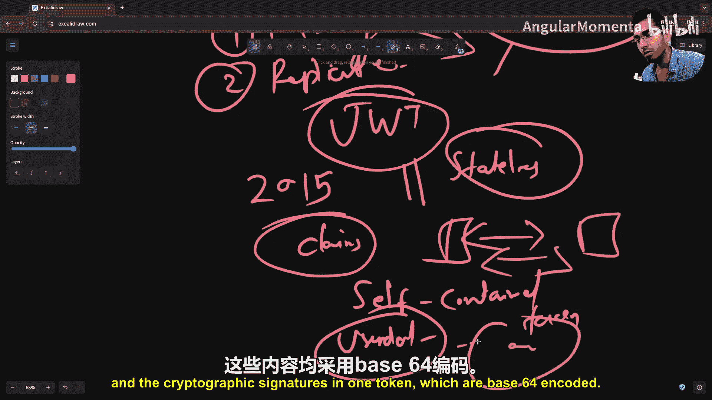
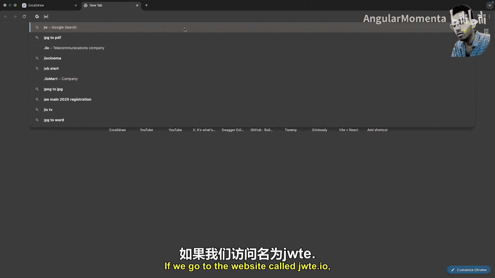
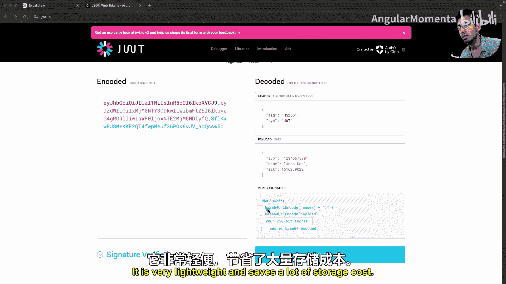
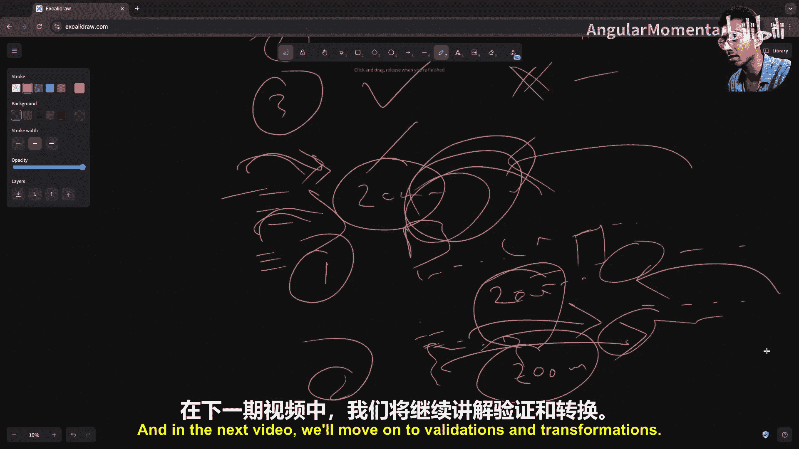

# 008：认证与授权 🔐

在本节课中，我们将学习后端开发中至关重要的两个概念：认证与授权。我们将从历史背景出发，理解其演变过程，然后深入探讨现代认证授权的核心组件、类型、工作原理以及相关的安全考量。

## 概述

认证与授权是构建安全应用系统的基石。简单来说：
*   **认证** 是回答“你是谁？”的问题，即验证主体的身份。
*   **授权** 是回答“你能做什么？”的问题，即确定主体在特定上下文（如平台、操作系统）中的权限和能力。

接下来，我们将从历史脉络开始，逐步拆解这两个概念。

## 认证的历史脉络

上一节我们概述了认证与授权的定义，本节中我们来看看认证是如何从人类社会早期发展到今天的。

### 前工业社会：基于信任的隐式认证
在人口较少的前工业社会，认证是隐式的。一个人的身份等同于其在社区中的声誉。例如，一位德高望重的长者可以为他人作保，交易通过握手达成。这种方法依赖于人际间的信任，但无法扩展到熟人圈子之外。

### 中世纪：物理令牌与密码学萌芽
随着社会规模扩大，需要不依赖于个人熟识的身份证明。这导致了**蜡封**的出现。蜡封作为早期的认证令牌，其原理是 **“你所拥有的东西”**。然而，蜡封容易被伪造，这标志着首次有记录的认证绕过攻击。

### 工业革命：共享秘密与密码短语
电报的发明带来了对安全通信的需求。操作员使用预先商定的密码短语，这演变为早期的**共享秘密**，其原理转变为 **“你所知道的东西”**。

### 计算时代：数字密码与安全存储
20世纪60年代，MIT的研究人员在CTSS系统中首次引入了多用户系统的密码概念。最初密码以明文存储，直到一次意外打印密码文件的事件暴露了其脆弱性，这催生了安全的密码存储机制，如**哈希算法**。

哈希算法的核心公式是：
```
hash = cryptographic_hash_function(plaintext_password)
```
它将任意长度的输入（明文密码）转换为固定长度的、不可逆的输出（哈希值）。

### 现代密码学与协议
20世纪70年代，非对称密码学（如Diffie-Hellman密钥交换）的出现，为现代认证协议（如Kerberos）奠定了基础。这些协议依赖于公钥基础设施。

### 多因素认证与生物识别
20世纪90年代，为应对暴力破解攻击，**多因素认证** 兴起。它结合了多种认证因素：
*   **你知道的**：密码、PIN码。
*   **你拥有的**：智能卡、OTP生成器。
*   **你固有的**：指纹、视网膜扫描等生物特征。

### 21世纪至今：现代框架与未来展望
云计算、移动设备和API架构的兴起，催生了更先进的认证框架，例如OAuth 2.0、JWT、零信任架构和无密码认证。未来的方向可能包括去中心化身份（基于区块链）、行为生物识别和后量子密码学。

## 现代认证的核心组件

了解了认证的历史后，我们现在聚焦于构成现代认证体系的三个核心技术组件。

### 会话
HTTP协议本质上是无状态的，每个请求都是独立的。为了在动态网站（如电商购物车、保持登录状态）中维持用户状态，引入了**会话**机制。

会话的工作流程如下：
1.  **会话创建**：用户登录后，服务器生成唯一的**会话ID**，并将用户相关数据（如用户ID、角色、购物车内容）存储在持久化存储（如数据库或Redis）中。
2.  **ID传递**：服务器将会话ID通过**Cookie**发送给客户端（浏览器）。
3.  **状态维持**：客户端在后续请求中自动携带此Cookie。服务器通过会话ID从存储中检索用户数据，从而识别用户。
4.  **会话过期**：会话通常设有有效期，过期后需要重新认证。





会话存储的演进：从服务器文件 -> 数据库 -> 分布式内存存储（如Redis），以满足可扩展性和性能需求。

### JSON Web令牌
随着分布式系统的发展，维护海量会话数据成本高昂，跨服务器/区域同步会话数据也带来延迟和一致性问题。这催生了**JWT**。



JWT是一种**无状态**的机制，用于在各方之间安全地传输声明（Claims）。其关键创新在于**自包含**：令牌本身包含了用户数据和一个用于验证的密码签名。

一个JWT由三部分组成，以点号分隔：
```
header.payload.signature
```

以下是JWT结构的代码示例：
```json
// Header (Base64Url编码)
{
  "alg": "HS256",
  "typ": "JWT"
}

// Payload (Base64Url编码)
{
  "sub": "1234567890", // 用户ID
  "name": "John Doe",
  "iat": 1516239022, // 签发时间
  "role": "admin"
}

// Signature
HMACSHA256(
  base64UrlEncode(header) + "." + base64UrlEncode(payload),
  secret_key
)
```

**JWT的优势**：
*   **无状态/可扩展**：服务器无需存储会话，易于水平扩展。
*   **自包含**：减少数据库查询。
*   **便携性**：可轻松通过HTTP头、URL参数传递。

**JWT的挑战**：
*   **令牌失效**：一旦签发，在过期前难以主动使其失效。
*   **令牌撤销**：无法便捷地撤销单个令牌（除非更改所有用户依赖的密钥）。

一种折衷方案是**混合方法**：在验证JWT后，额外查询一个存储中的“黑名单”来检查令牌是否被撤销。但这在一定程度上牺牲了无状态的优势。

### Cookie
Cookie是服务器指示客户端（浏览器）存储一小段数据（如会话ID或JWT）的机制。它是实现认证流程自动化的关键。

Cookie的工作流程：
1.  用户认证成功后，服务器在响应中设置一个Cookie（例如`Set-Cookie: session_id=abc123`）。
2.  浏览器自动保存此Cookie。
3.  此后，浏览器向**同一域**发出的每个请求都会自动携带这个Cookie。
4.  服务器从请求中读取Cookie，获取认证令牌（会话ID或JWT），进而验证用户身份。

**重要安全特性**：`HttpOnly`标志可以防止JavaScript访问Cookie，有助于防范XSS攻击。

## 认证的主要类型

我们已经了解了核心组件，现在来看看如何将它们组合成不同的认证类型。

### 状态认证
状态认证依赖于服务器端存储的会话状态。

**工作流程**：
1.  客户端发送用户名/密码。
2.  服务器验证凭证，生成会话ID，将`{session_id: user_data}`存入Redis，并通过Cookie将会话ID发回客户端。
3.  客户端后续请求自动携带Cookie。
4.  服务器用会话ID从Redis查找用户数据，完成认证。

**优点**：集中控制，可实时管理/撤销会话，安全性较高。
**缺点**：服务器存储开销大，在分布式架构中同步复杂，可扩展性受限。

### 无状态认证
无状态认证的核心是自包含的令牌，服务器无需存储会话。

**工作流程**：
1.  客户端发送用户名/密码。
2.  服务器验证凭证，使用密钥签发一个包含用户信息的JWT，并将其返回给客户端（可通过Cookie或响应体）。
3.  客户端在后续请求的`Authorization`头中携带JWT（如 `Bearer <token>`）。
4.  服务器用密钥验证JWT签名并解码出用户信息。

**优点**：无服务器存储，天生适合分布式和微服务架构，扩展性强。
**缺点**：令牌难以主动撤销，若密钥泄露影响大。

**选择建议**：
*   **状态认证**：适用于传统Web应用，对会话控制要求高。
*   **无状态认证**：适用于API、微服务、移动应用后端。
*   **混合方案**：对Web端用状态认证，对API/移动端用无状态认证。

### API密钥认证
API密钥用于**机器对机器**的通信，为程序化访问提供凭证。

**工作流程**：
1.  用户在平台UI上生成一个API密钥（加密随机字符串）。
2.  该密钥被赋予特定权限和有效期。
3.  客户端（另一个服务器或脚本）在请求头（如`X-API-Key: <key>`）中携带此密钥访问API。
4.  服务器验证密钥的有效性和权限。

**优点**：简单易用，专为自动化、无UI交互的场景设计。
**用途**：第三方集成、服务器间调用、提供外部API服务。

### OAuth 2.0 与 OpenID Connect
OAuth 2.0解决的是**授权委托**问题：让一个应用能代表用户访问其在另一个服务中的资源，而无需分享密码。

**核心角色**：
*   **资源所有者**：用户。
*   **客户端**：想要访问资源的应用。
*   **资源服务器**：托管用户资源的服务（如Google服务器）。
*   **授权服务器**：颁发访问令牌的服务。

**OAuth 2.0授权码流程简化版**：
1.  客户端将用户重定向到授权服务器。
2.  用户在授权服务器上登录并同意客户端的权限请求。
3.  授权服务器将用户重定向回客户端，并附上一个**授权码**。
4.  客户端用授权码向授权服务器交换**访问令牌**。
5.  客户端使用访问令牌访问资源服务器上的受保护资源。

**OpenID Connect** 在OAuth 2.0之上增加了**认证**层。它在流程中引入了一个**ID令牌**（一个JWT），其中包含了用户的身份信息（如ID、姓名、邮箱）。这就是“使用Google登录”等功能背后的技术。

**用途**：单点登录、第三方应用授权、集中身份管理。

## 授权：角色与权限控制

认证解决了“你是谁”，接下来我们看授权，即“你能做什么”。

授权最常见的模型是**基于角色的访问控制**。

**RBAC核心概念**：
*   **角色**：如`用户`、`管理员`、`版主`。
*   **权限**：如`读文章`、`写文章`、`删除文章`、`访问管理后台`。
*   **分配**：将权限分配给角色，再将角色分配给用户。

**工作流程**：
1.  用户认证后，服务器从其令牌或数据库查询中确定其角色。
2.  在处理具体请求（如`DELETE /api/articles/123`）时，服务器检查该用户角色是否拥有执行此操作所需的权限。
3.  如果拥有权限，请求继续；否则，返回`403 Forbidden`错误。

通过RBAC，可以灵活地管理不同用户群体对系统资源的访问能力。

## 安全实践要点

在实现认证授权时，必须注意以下安全细节。

### 1. 模糊化认证错误信息
为了防止攻击者通过错误信息推断有效账户，认证失败时应返回**通用提示**。

**错误做法**：
*   “用户名不存在”
*   “密码错误”
*   “账户已锁定”

**正确做法**：
*   统一返回：“用户名或密码错误”。

### 2. 防范计时攻击
在认证逻辑中，比较用户名是否存在和比较密码哈希是否匹配，两者的执行时间可能有细微差异。攻击者可以通过测量响应时间来推断账户的有效性。

**防御措施**：
*   **使用恒定时间比较函数**：例如，在密码哈希比较时，使用语言提供的安全比较函数（如Node.js的`crypto.timingSafeEqual`）。
*   **引入人工延迟**：在认证逻辑中，无论失败在哪一步，都通过`sleep`等方式增加一个随机但固定的延迟，使响应时间趋于一致。

## 总结

本节课中，我们一起深入学习了后端开发中的认证与授权：

1.  **概念区分**：认证是验明身份（你是谁），授权是分配权限（你能做什么）。
2.  **历史演进**：从基于信任的隐式认证，发展到密码、多因素认证，直至现代的OAuth、JWT等协议。
3.  **核心组件**：**会话**用于维持有状态；**JWT**用于无状态、可扩展的令牌传递；**Cookie**是浏览器自动管理令牌的载体。
4.  **认证类型**：根据场景选择**状态认证**、**无状态认证**、**API密钥认证**或**OAuth 2.0/OpenID Connect**。
5.  **授权模型**：**RBAC**是最常用的授权模型，通过角色和权限管理访问控制。
6.  **安全实践**：实施模糊错误信息和防御计时攻击等措施，是构建健壮认证授权系统不可或缺的一环。



理解这些原理和权衡，是每一位后端工程师设计安全、可扩展应用系统的基础。在接下来的课程中，我们将探讨数据验证与转换。