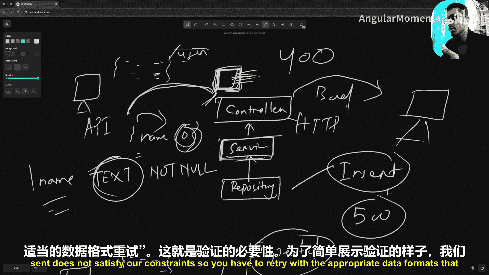
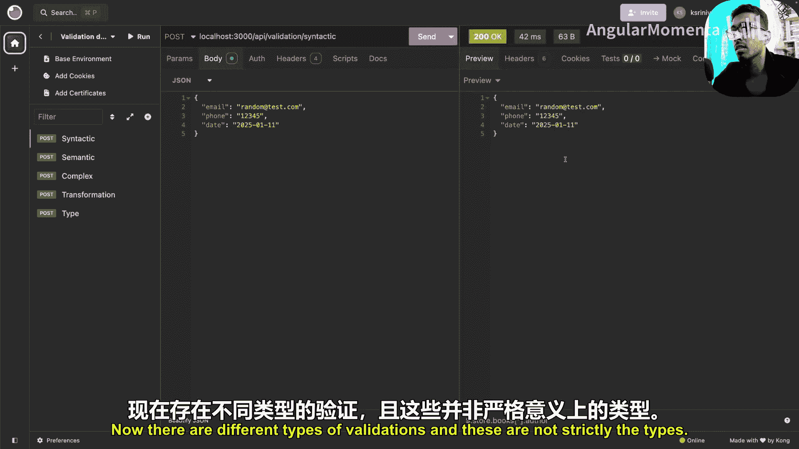
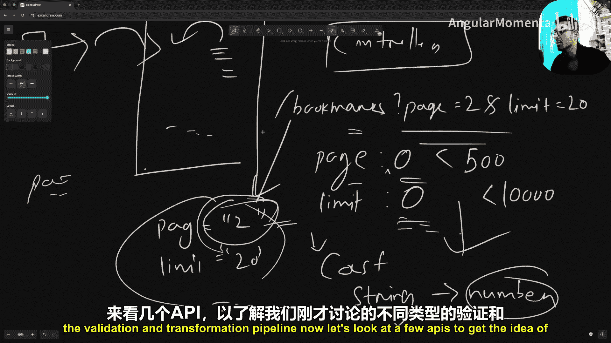
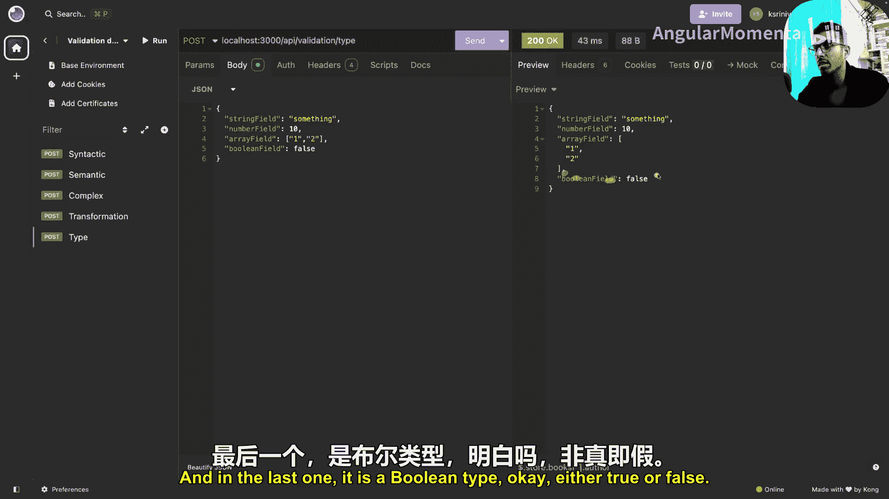
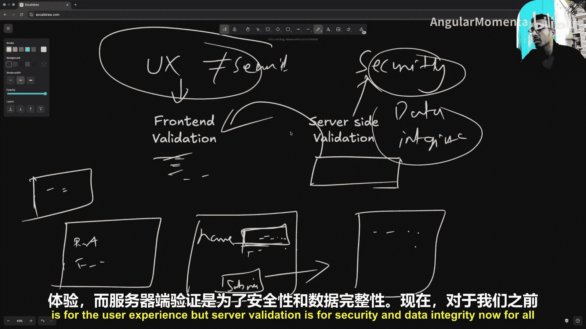
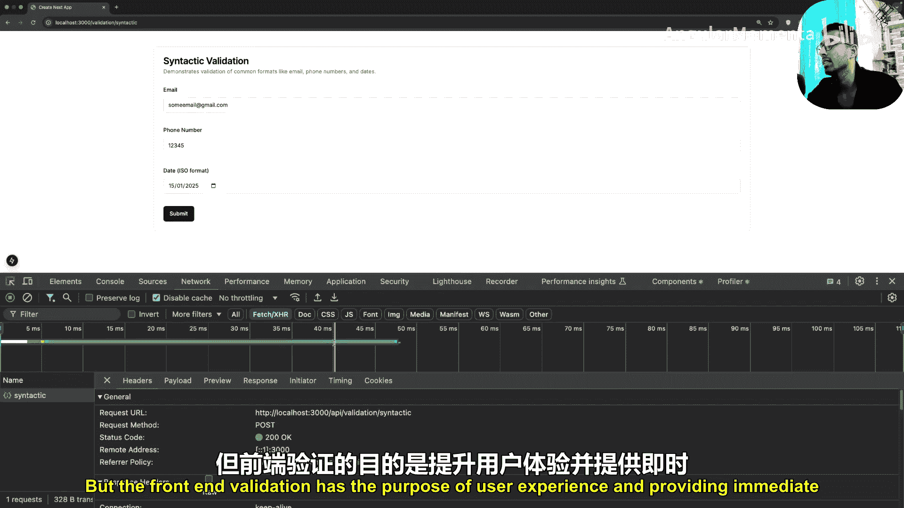
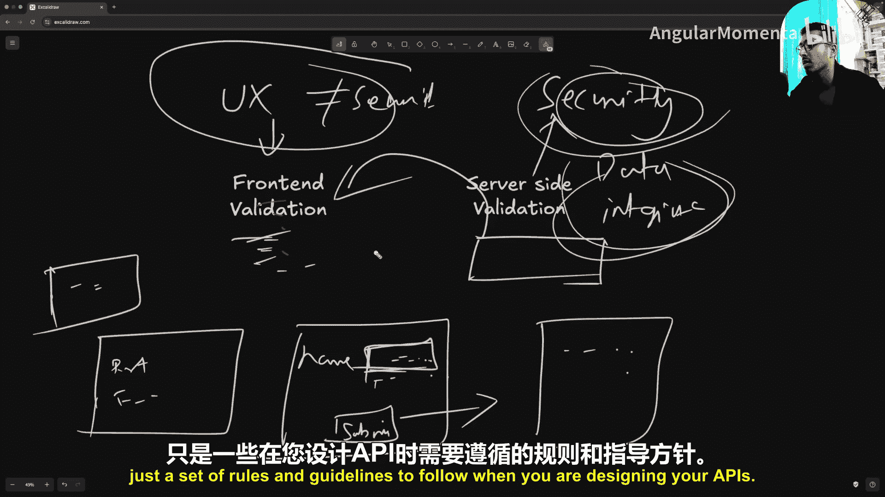

# 009：验证与转换 🔧

在本节课中，我们将要学习后端开发中至关重要的两个概念：**验证**与**转换**。它们是确保API数据完整性和安全性的核心机制。我们将了解它们在后端架构中的位置、具体作用、不同类型，以及如何正确实施。

## 后端架构回顾 🏗️

上一节我们介绍了后端开发的基础概念，本节中我们来看看验证与转换在架构中的位置。

在一个典型的后端架构中，我们通常有不同的执行层。最底层通常是**仓库层**，它主要负责与数据库的交互，包括执行查询、插入、删除等操作。这个数据库可以是传统的关系型数据库，也可以是Redis或其他类型的持久化存储。

在仓库层之上是**服务层**。这一层负责执行业务逻辑，例如调用一个或多个仓库层方法、向不同设备发送通知、给用户发送邮件、存储数据或发起网络请求等。一个典型的服务方法会调用仓库层的一个或多个方法来与数据库交互。

服务层之上是**控制器层**。这一层调用服务层中定义的方法来执行业务逻辑。它负责处理所有API预期要完成的工作和返回的数据。控制器层调用与服务特定API关联的方法，并将服务层返回的数据通过HTTP连接返回给用户。

我们将控制器层与服务层分离，是为了将与HTTP相关的逻辑（例如返回什么错误码、成功码、数据格式、以及我们即将看到的验证）和数据相关的逻辑分离到不同的层中。控制器层处理所有来自客户端和发送给客户端的数据，并在内部调用服务层。

因此，一个典型的API调用流程是：请求到达控制器层，控制器层与服务层交互，服务层再与仓库层交互，最终服务层返回的数据被返回给发起API调用的用户。

## 验证与转换的位置 🎯

现在，让我们明确验证与转换具体发生在哪里。

理想情况下，验证与转换发生在这个位置：当客户端发送的数据（通常是一个JSON负载）到达服务器，经过路由匹配算法找到对应的控制器方法后，**在控制器层开始执行业务逻辑或调用服务方法之前**，我们首先进行验证与转换。

## 为什么需要验证与转换？ 🤔

想象一下，我们的服务器面向全球各地的用户。验证与转换的核心思想是：在客户端发送的任何数据（JSON负载、查询参数、路径参数、请求头等）进入我们的服务器逻辑之前，确保它们符合API预期的格式。

例如，一个API期望在请求体JSON中有一个名为`name`的字符串字段，长度在5到200个字符之间。在数据到达控制器层入口点时，我们会执行验证管道。这个管道（可能是一个中间件或工具函数）会根据我们提供的模式（Schema）检查JSON的所有字段。它会检查是否存在`name`字段，类型是否为字符串，长度是否在限制范围内。如果任何一项检查失败，它会立即向客户端返回错误（例如400 Bad Request），而不会执行后续的业务逻辑或数据库操作。

这样做的好处是避免系统在意外状态下运行或崩溃。如果没有验证，客户端发送了错误类型的数据（例如`name`字段是数字`0`），数据可能会一路传递到仓库层。当仓库层尝试执行数据库插入操作时，由于数据库列定义了`text`类型约束，插入数字`0`会导致数据库调用失败，最终客户端可能收到一个模糊的500内部服务器错误。这提供了很差的用户体验。通过入口点的验证，我们可以确保数据在结构上符合业务逻辑的要求，并在不符合时给出清晰、准确的错误响应。

## 验证的类型 📝

验证有多种类型，根据需求可以非常具体或宽松。以下是三种最常见的类型：

以下是三种主要的验证类型：

1.  **语法验证**：验证提供的数据是否符合特定的结构模式。
    *   **示例**：验证字符串是否为有效的电子邮件格式（如 `user@domain.com`）、电话号码格式（如国家代码+数字）或日期格式（如 `YYYY-MM-DD`）。
    *   **核心概念**：检查数据**格式**是否正确。

2.  **语义验证**：验证提供的数据在逻辑上是否有意义。
    *   **示例**：验证出生日期是否在未来（这没有意义），或年龄是否为合理的数字（如1到120之间）。
    *   **核心概念**：检查数据**含义**是否合理。

3.  **类型验证**：验证数据的基本类型是否匹配。
    *   **示例**：验证字段是否为字符串、数字、布尔值、数组或特定结构的嵌套对象。
    *   **核心概念**：检查数据**类型**是否匹配。

## 什么是转换？ 🔄

在数据到达控制器层之前，它需要经过**验证与转换管道**。验证确保数据符合结构，而**转换**意味着我们可能需要对用户提供的数据执行一些操作。

一个常见的例子是处理查询参数。例如，一个分页API的端点可能是 `/bookmarks?page=2&limit=20`。查询参数的值在到达服务器时**默认都是字符串类型**。然而，我们的验证规则可能要求 `page` 和 `limit` 是数字。如果直接验证，会因为类型不匹配而失败。

这时就需要**转换**（或称为类型转换）。服务器有责任在验证之前，将字符串 `"2"` 和 `"20"` 转换为数字 `2` 和 `20`。这个过程就是转换。转换也可能发生在验证之后，目的是将数据调整为服务层期望的最终格式。

通常，我们将验证和转换放在同一个管道中，这样所有关于输入数据的逻辑都集中在一处，便于管理和维护。

## 前端验证 vs 后端验证 ⚖️

这是一个重要的概念，有时会产生混淆。在典型应用中，前端表单会进行验证（例如，检查输入框内容是否符合要求）。**前端验证的目的是为了用户体验**，它能即时给用户反馈。

然而，**后端验证的目的是为了安全性和数据完整性**。服务器必须进行严格的验证，因为：
*   服务器可能有多种客户端（Web应用、移动应用、API测试工具如Postman）。
*   API测试工具等客户端没有前端验证界面。
*   恶意用户可以绕过前端直接向API发送请求。

因此，**绝不能**用前端验证替代后端验证。后端验证是强制性的安全措施，而前端验证是可选的用户体验增强。在设计API时，必须尽可能严格和具体地实施服务器端验证逻辑，而不必考虑客户端验证的具体实现。

## 总结 📚

本节课中我们一起学习了后端开发中的验证与转换。

*   **位置**：验证与转换发生在请求到达控制器层后、执行业务逻辑前。
*   **目的**：确保输入数据的结构、类型和语义符合API要求，保障数据完整性和系统安全。
*   **验证类型**：主要包括**语法验证**（格式）、**语义验证**（逻辑）和**类型验证**（数据类型）。
*   **转换**：在验证前后对数据进行处理（如类型转换），使其符合服务层期望的格式。
*   **关键区别**：**前端验证**用于提升用户体验，是可选且可被绕过的；**后端验证**用于保障安全与数据完整性，是强制且必须的。

记住这些规则和指南，将帮助你设计出更健壮、更安全的API。