# 010：控制器、服务、仓库、中间件和请求上下文详解 🧩

在本节课中，我们将学习后端架构中的三个核心概念：控制器/服务/仓库模式、中间件以及请求上下文。我们将深入探讨每个组件的作用、它们如何协同工作，以及为什么这种分层设计对于构建可维护、可扩展的后端应用至关重要。

## 请求生命周期与分层架构

上一节我们介绍了HTTP协议和路由机制。本节中，我们来看看一个请求到达服务器后，在内部是如何被处理的。我们称之为“请求生命周期”。

客户端发送一个HTTP请求到服务器。操作系统将该请求转发到服务器监听的端口（例如3000或4000）。这是请求进入服务器的入口点。

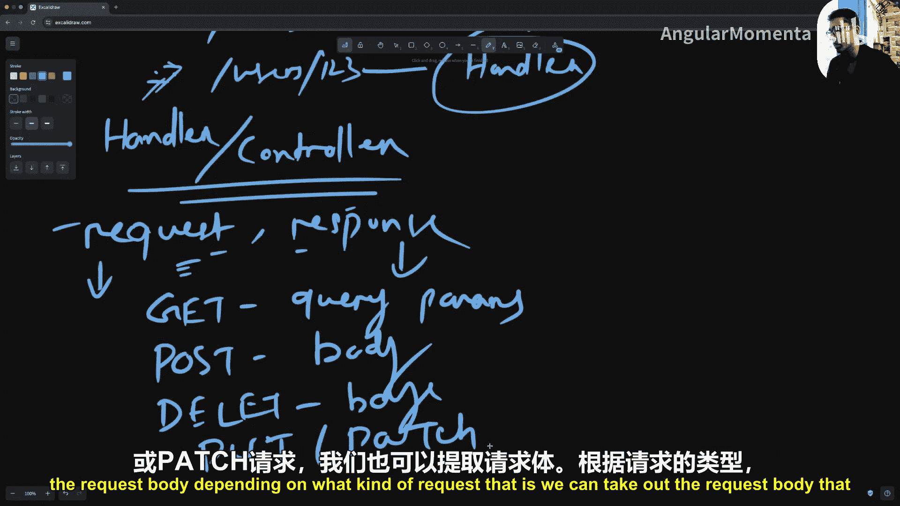

服务器收到请求后，首先进行路由匹配。根据请求的URL路径（如 `/users` 或 `/users/123`），路由算法将其映射到一个预定义的**处理器（Handler）**或**控制器（Controller）**。

### 控制器/处理器层

控制器是请求生命周期的第一站。它的主要职责是处理与HTTP协议直接相关的逻辑。

以下是控制器层的主要职责：

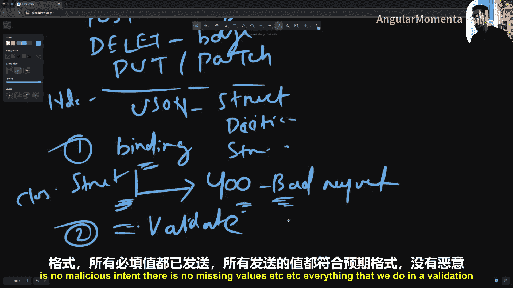

1.  **数据提取与反序列化**：从请求对象中提取数据。对于GET请求，提取查询参数；对于POST、PUT、PATCH等请求，提取请求体。由于客户端发送的数据通常是JSON格式，控制器需要将其反序列化为服务器编程语言的原生数据结构（例如Go的`struct`、Python的字典或类）。这个过程也常被称为“绑定（Binding）”。
    *   **代码示例（伪代码）**:
        ```go
        // 在Go中，将JSON请求体绑定到结构体
        var book Book
        if err := c.ShouldBindJSON(&book); err != nil {
            c.JSON(400, gin.H{"error": "Bad Request"})
            return
        }
        ```

2.  **数据验证与转换**：对反序列化后的数据进行验证，确保其格式正确、包含必填字段且无恶意内容。验证通过后，可以进行数据转换，例如设置默认值、格式化数据等，以便下游处理。
    *   **公式/逻辑**:
        ```
        输入数据 -> [验证规则] -> 有效数据 -> [转换逻辑] -> 标准化数据
        ```
        如果验证失败，控制器应直接返回 `400 Bad Request` 响应并终止请求。

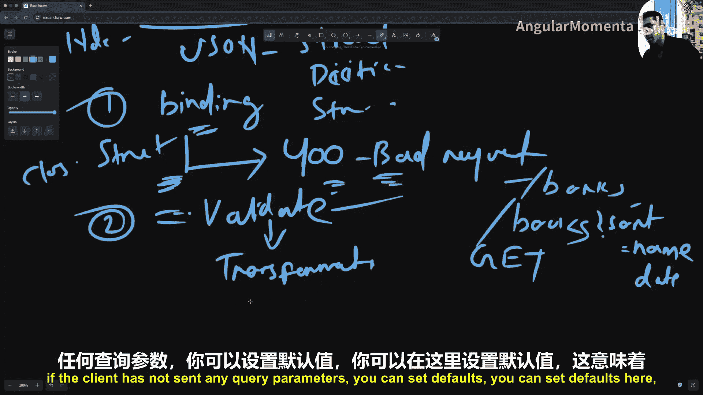

3.  **调用服务层**：将经过验证和转换的数据传递给**服务（Service）**层进行核心业务逻辑处理。

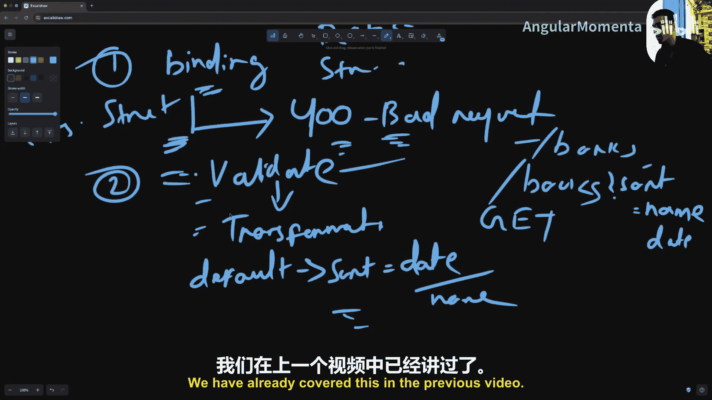

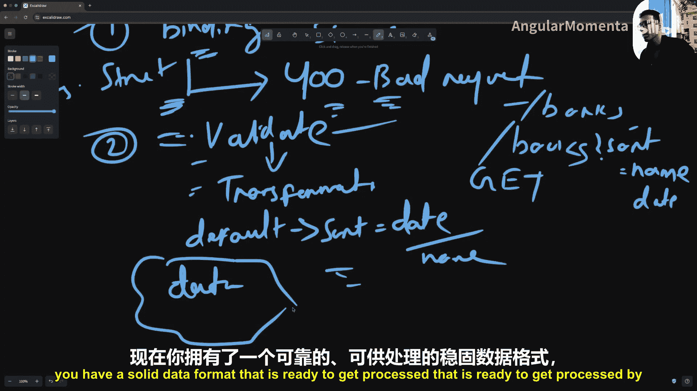

4.  **构造并发送响应**：接收服务层返回的处理结果，根据业务逻辑的成功与否，决定返回给客户端的HTTP状态码（如200成功、201创建、400客户端错误、500服务器错误）和响应体数据。

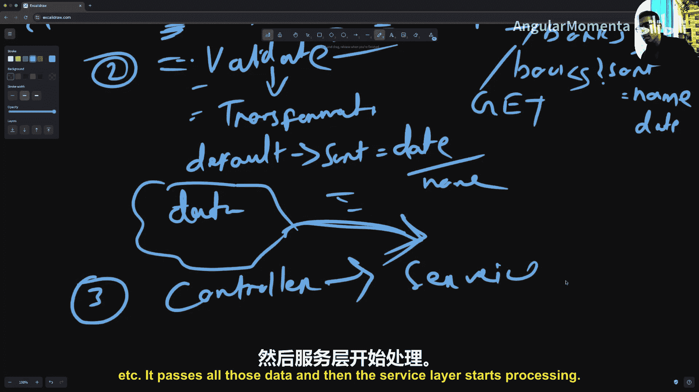

### 服务层

控制器处理完协议层事务后，将核心业务逻辑委托给服务层。服务层是应用程序的业务逻辑核心。

服务层的特点如下：

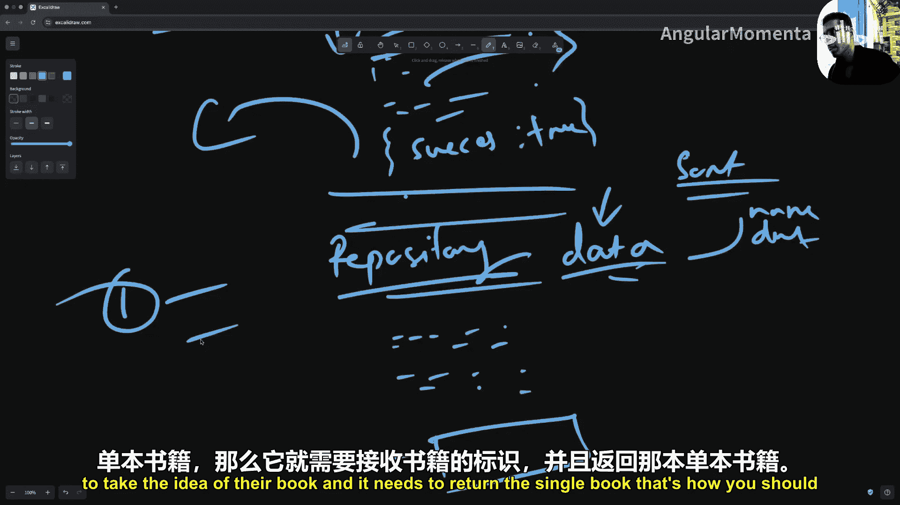

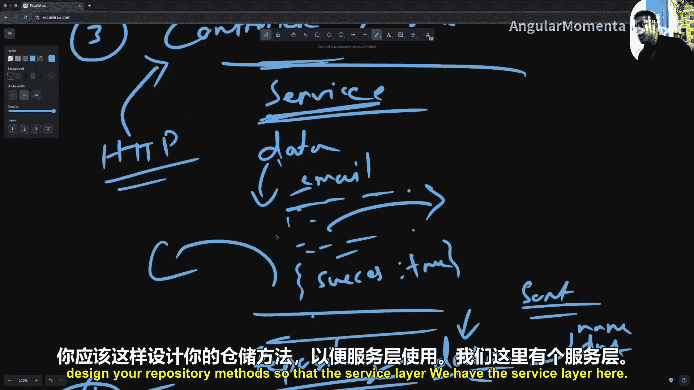

*   **与HTTP解耦**：服务层函数不应感知HTTP上下文。它只接收数据，处理业务规则，并返回结果。
*   **编排与协调**：一个服务方法可以调用多个**仓库（Repository）**方法，组合外部API调用，发送邮件或通知等。它负责协调完成一个完整的业务用例。
*   **返回处理结果**：将业务处理的结果（成功数据或业务错误）返回给控制器。

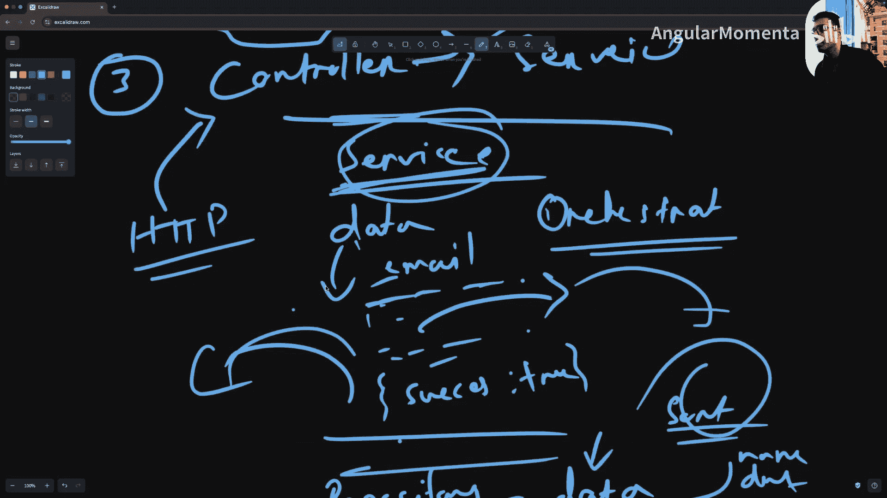

### 仓库层

仓库层负责所有与数据持久化相关的操作，主要是数据库交互。它是服务层与数据库之间的抽象层。

仓库层的职责非常单一：

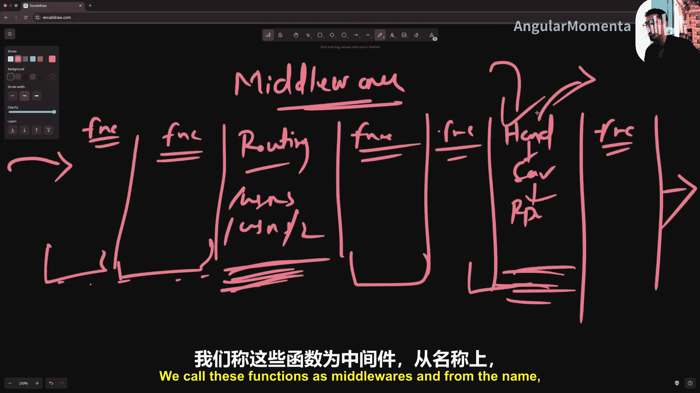

*   **构造并执行数据操作**：接收服务层传递的数据，构造具体的数据库查询语句（如SQL），执行插入、查询、更新或删除操作。
*   **返回原始数据**：将数据库操作的结果（如查询到的记录集）返回给服务层。一个仓库方法通常只负责一种类型的数据操作。

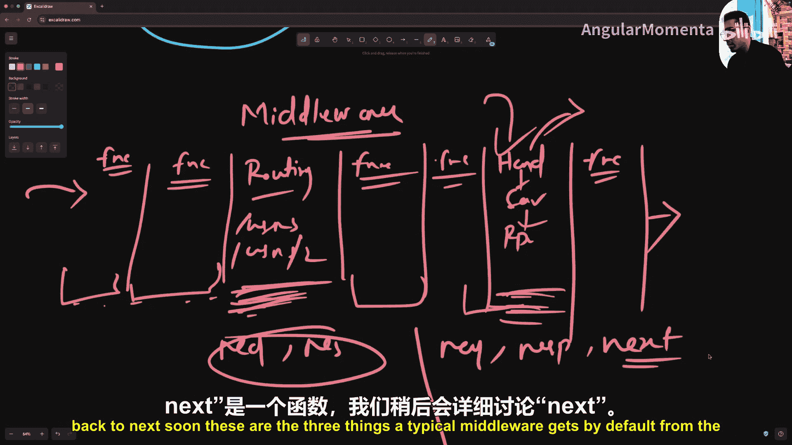

**总结这三层的关系**：控制器负责**协议**（HTTP），服务层负责**业务逻辑**，仓库层负责**数据访问**。这种分离使得代码职责清晰，易于测试和维护。

## 中间件：请求生命周期的守卫者与加工者

在理解了核心处理流程后，我们来看看中间件（Middleware）如何嵌入到这个生命周期中，提供横切关注点的功能。

中间件是在请求到达最终处理器**之前**或**之后**执行的特殊函数。它们像一道道关卡或加工站，分布在请求生命周期的各个“边界”上。

一个典型的中间件函数接收三个参数：
*   `request`： 请求对象。
*   `response`： 响应对象。
*   `next`： 一个函数，用于将执行权传递给下一个中间件或处理器。

中间件的核心能力是：它可以读取和修改请求/响应，并且可以选择是否通过调用 `next()` 将请求传递下去，或者直接发送响应终止请求。

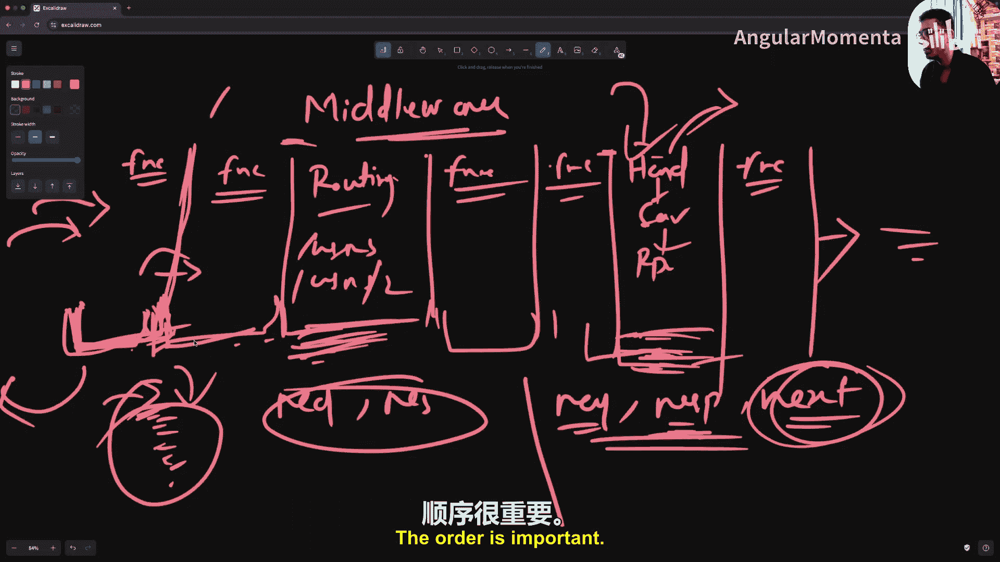

### 为什么使用中间件？

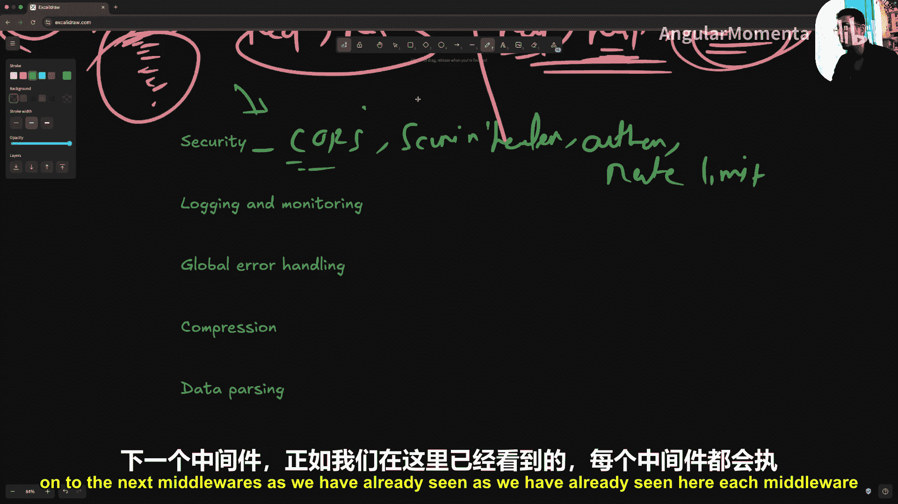

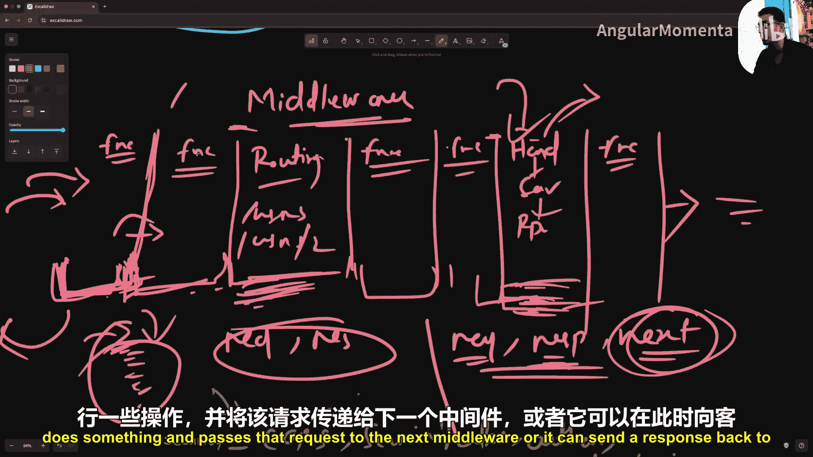

主要目的是**减少代码重复**和**实现横切逻辑**。许多功能需要对每个请求都执行，如果将这些逻辑写在每个控制器里，会导致大量重复代码。

以下是常见的中间件用例：

*   **CORS（跨域资源共享）**：检查请求来源，如果是允许的域名，则在响应头中添加相应的CORS头部。
*   **安全头部**：为每个响应添加安全相关的HTTP头部（如Content-Security-Policy）。
*   **身份验证**：验证请求中的令牌（如JWT），如果无效则返回`401 Unauthorized`；如果有效，则将用户信息（如用户ID、角色）附加到请求上下文中，供后续使用。
*   **速率限制**：基于IP地址或其他标识，限制客户端在特定时间内的请求频率，超过限制则返回`429 Too Many Requests`。
*   **日志记录**：记录每个请求的路径、方法、客户端IP等信息，用于监控和调试。
*   **全局错误处理**：捕获应用程序中任何地方抛出的未处理异常，将其转换为结构化的错误响应（如500状态码和错误信息）返回给客户端。这个中间件通常放在执行链的**最后**。
*   **数据压缩**：对大的响应体进行压缩（如gzip），减少网络传输量。

**中间件的顺序至关重要**。例如，CORS和日志中间件通常放在最前面，而错误处理中间件放在最后面。身份验证中间件需要在需要保护的业务路由之前执行。

## 请求上下文：请求级别的共享状态

在介绍身份验证中间件时，我们提到它可以将用户信息存储起来供后续使用。这个存储空间就是**请求上下文（Request Context）**。

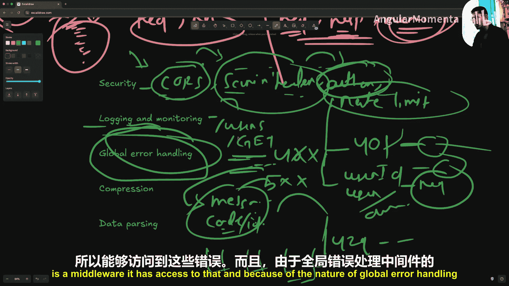

请求上下文是一个与**单个HTTP请求生命周期绑定**的存储对象（通常是键值对形式）。它在请求开始时创建，在请求结束时销毁。

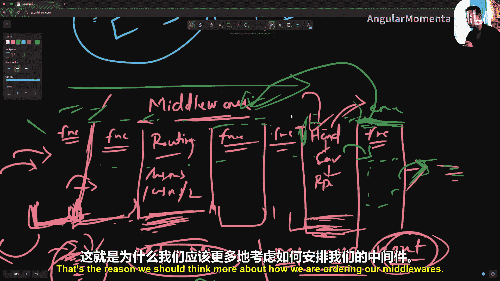

### 请求上下文的作用

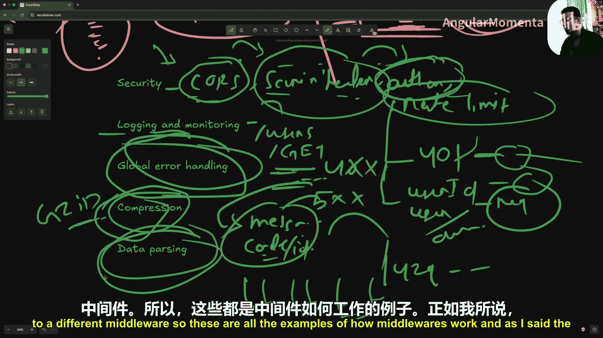

它允许在同一请求流经的不同组件（中间件、控制器、服务）之间安全地共享数据，而无需通过函数参数显式传递，从而降低耦合度。

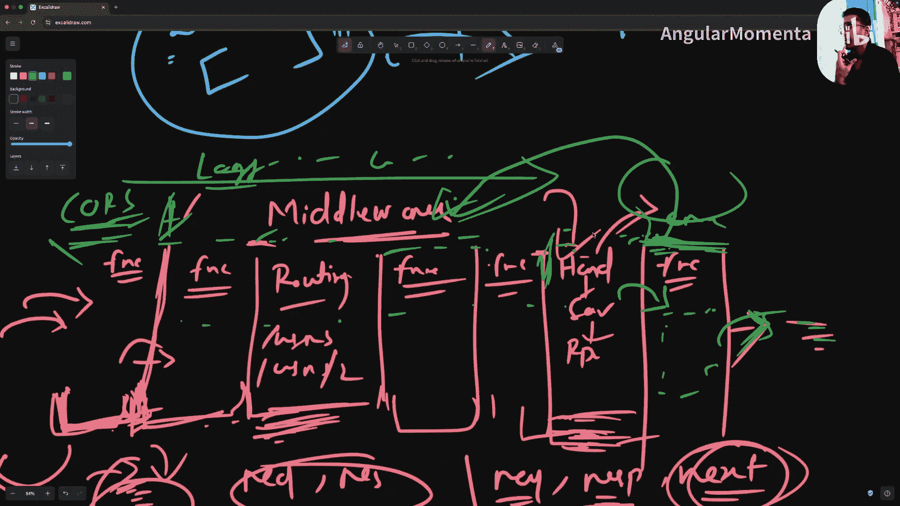

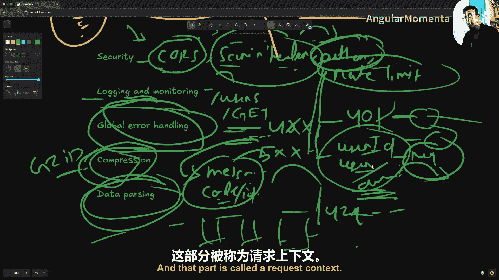

请求上下文的典型用途包括：

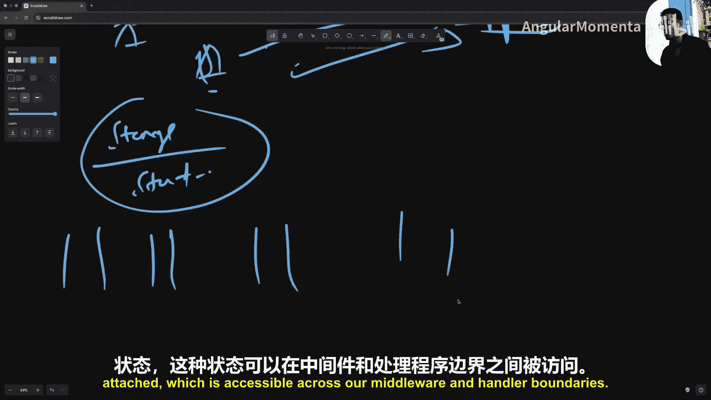

1.  **存储用户身份信息**：身份验证中间件验证用户后，将用户ID、角色等信息存入上下文。后续的控制器或服务层可以直接从中取出使用，确保数据来源可信（而非来自可能被篡改的客户端请求）。
2.  **传递请求ID**：在请求入口处生成一个唯一ID（如UUID）并存入上下文。在整个请求处理过程中，无论是记录日志还是调用其他内部服务，都可以携带这个ID，便于实现全链路追踪和调试。
3.  **传递取消信号与超时**：可以设置请求的截止时间或取消通道。当客户端断开连接或请求超时时，可以通过上下文通知所有正在进行的下游操作（如数据库查询、外部API调用）及时终止，释放资源。

**公式/概念**:
```
请求上下文 = 键值对存储 (作用域: 单个请求)
访问者: 所有处理该请求的中间件、处理器、服务
```

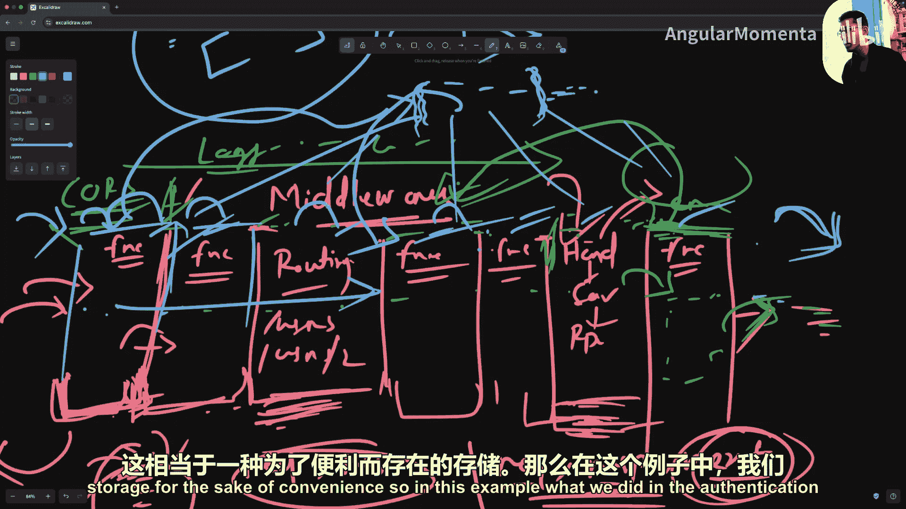

## 总结

本节课中我们一起学习了后端架构中三个紧密相关的核心概念。

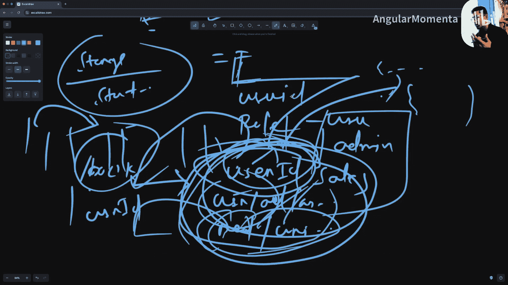

*   **控制器、服务、仓库模式**为我们提供了一种清晰的分层架构：控制器处理HTTP协议，服务实现业务逻辑，仓库管理数据访问。这种分离提升了代码的可维护性、可测试性和可扩展性。
*   **中间件**是处理横切关注点的强大工具，如身份验证、日志、压缩等。它们通过可插拔的方式在请求生命周期的特定阶段执行，有效减少了代码重复。
*   **请求上下文**作为请求级别的状态容器，使得在同一请求的不同处理阶段之间安全、便捷地共享数据成为可能，是连接中间件与业务逻辑的重要桥梁。

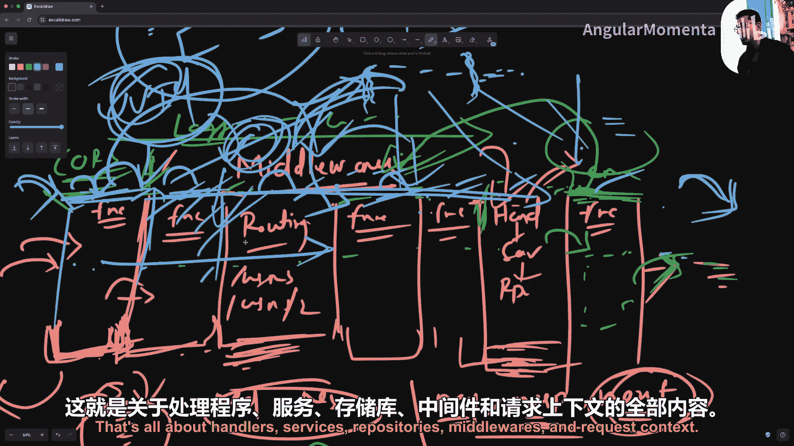

理解这三者如何协同工作，是设计和构建健壮后端应用程序的基础。下一节，我们将深入探讨API设计的最佳实践与RESTful架构原则。