# 011：完整的REST API设计 🚀

在本节课中，我们将深入探讨REST API设计的完整流程。我们将从历史背景和核心概念讲起，逐步深入到具体的URL设计、HTTP方法、幂等性，并通过一个项目管理的实际案例，演示如何设计一套完整、直观且符合标准的API接口。学完本节，你将能够独立设计出结构清晰、易于维护的RESTful API。

## 历史背景与核心概念

上一节我们介绍了HTTP协议的基础知识，本节中我们来看看REST API设计背后的历史与核心思想。

### REST的起源

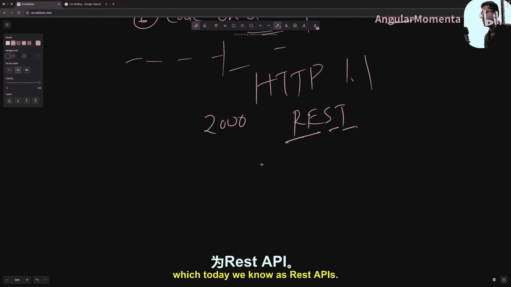

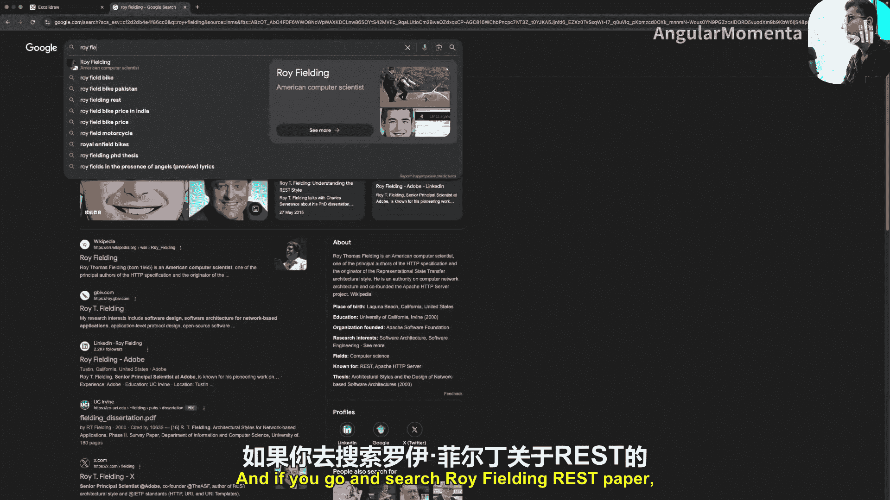

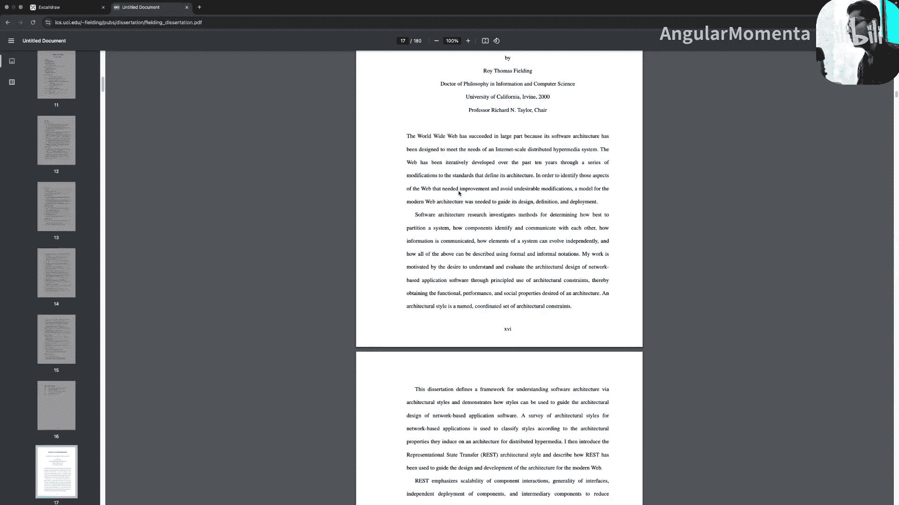

1990年，蒂姆·伯纳斯-李启动了万维网项目，旨在全球范围内分享知识。他发明了URI、HTTP协议、HTML、第一个Web服务器和浏览器等关键技术。然而，随着用户数量的指数级增长，万维网面临可扩展性危机。

1993年左右，罗伊·菲尔丁（Apache HTTP服务器项目的联合创始人）提出了六大约束来解决可扩展性问题：

1.  **客户端-服务器分离**：客户端处理用户界面，服务器管理数据存储和业务逻辑。
2.  **统一接口**：建立组件间通信的标准方式，包含资源标识、通过表述操作资源、自描述消息和超媒体作为应用状态引擎四个子约束。
3.  **分层系统**：架构由层次组成，每层只能与紧邻的下层交互，便于引入负载均衡器和代理服务器。
4.  **缓存**：服务器必须明确标记响应是否可被缓存，以减轻服务器负载。
5.  **无状态**：每个客户端请求必须包含服务器处理该请求所需的所有信息。服务器不存储任何客户端上下文。
6.  **按需代码（可选）**：服务器可以通过传输可执行代码（如JavaScript）临时扩展客户端功能。

2000年，罗伊·菲尔丁在其博士论文中将这种Web架构风格命名为“表述性状态转移”，即REST。

### 什么是REST？

REST（Representational State Transfer）名称包含三个核心部分：

*   **表述（Representation）**：网络上的资源（数据或对象）可以有不同的表现形式，如JSON、XML或HTML，具体取决于客户端需求。
    *   **示例**：一个`用户`资源，对API客户端可能以JSON表示，而对Web浏览器则可能以HTML表示。
*   **状态（State）**：指特定资源的当前状况或属性。资源的状态可以通过其表述在客户端和服务器之间转移。
    *   **示例**：一个`购物车`资源的状态包括其中的所有商品、商品数量和总价。
*   **转移（Transfer）**：指资源表述在客户端和服务器之间的移动，通过标准的HTTP方法（如GET、POST、PUT、DELETE）进行。
    *   **示例**：当你向服务器发送GET请求获取网页时，就是在使用GET方法将资源的表述从服务器转移到客户端。

**综合来看**，REST描述了一种架构风格：1) 资源有多种表述格式；2) 这些资源的状态可以在客户端和服务器间转移；3) 客户端和服务器通过共享这些资源表述进行通信，并且整个系统遵循特定的约束以实现可扩展性。

## API设计基础：URL与路由

理解了REST的背景后，我们开始学习API设计的具体实践。首先从URL的结构和路由设计开始。

一个典型的URL高级结构如下：
```
https://api.example.com/v1/books?limit=10&page=1#introduction
```
*   **方案（Scheme）**：`https`
*   **权限/域名（Authority/Domain）**：`api.example.com`（通常API使用`api`子域名）
*   **路径/资源（Path/Resource）**：`/v1/books`（`v1`是版本，`books`是资源）
*   **查询参数（Query Parameters）**：`?limit=10&page=1`
*   **片段（Fragment）**：`#introduction`

在设计API路由时，需遵循以下标准：

1.  **资源名称使用复数形式**：无论操作单个还是多个资源，路径中的资源名都应使用复数。
    *   **正确**：`GET /api/v1/books` (获取所有书籍)
    *   **正确**：`GET /api/v1/books/123` (获取ID为123的书籍)
    *   **错误**：`GET /api/v1/book/123`
2.  **使用连字符`-`而非空格或下划线**：确保URL在不同环境下的可读性和一致性。
    *   **示例**：书名“Harry Potter”应转换为slug：`harry-potter`。
3.  **路径表示层级关系**：斜杠`/`表示资源间的层级关系。
    *   **示例**：`/organizations/{org_id}/projects` 表示获取某个特定组织下的所有项目。

## HTTP方法与幂等性

设计好路由结构后，我们需要为不同的操作分配合适的HTTP方法。理解“幂等性”这个概念对于正确选择方法至关重要。

**幂等性**是指一个操作无论执行一次还是多次，所产生的副作用（对服务器状态的改变）都是相同的。

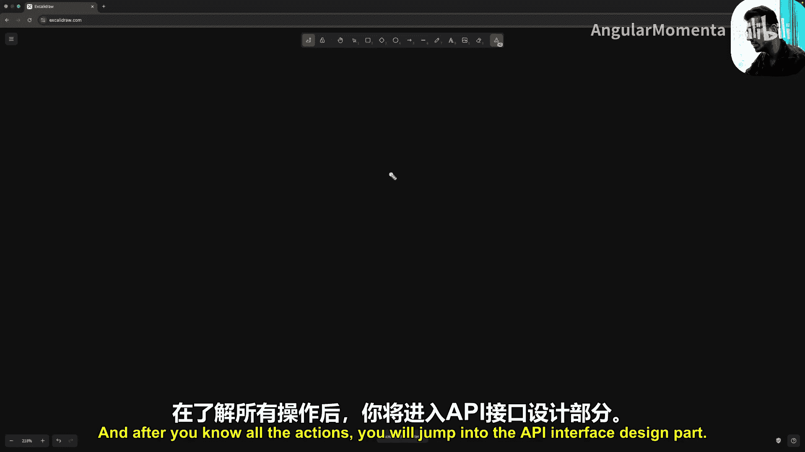

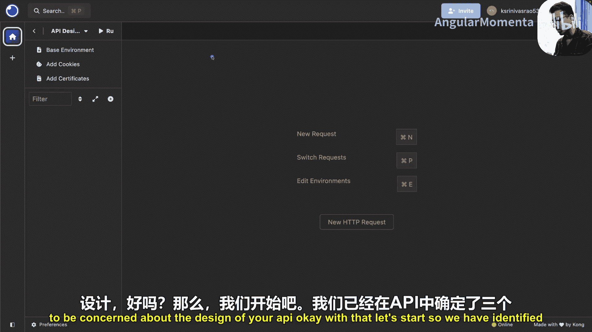

以下是主要的HTTP方法及其幂等性分析：

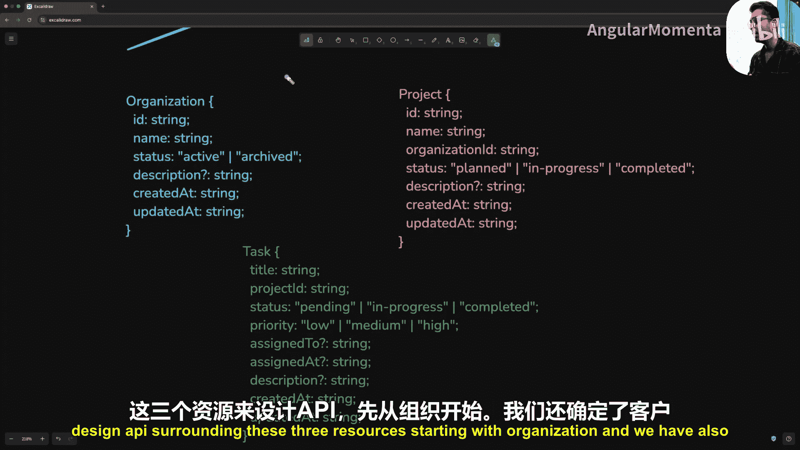

*   **GET**：用于从服务器检索数据。**是幂等的**。多次执行相同的GET请求不会改变服务器状态。
*   **PUT**：用于完整替换服务器上的资源。**是幂等的**。用相同载荷多次调用，资源最终状态相同。
*   **PATCH**：用于部分更新服务器上的资源。**是幂等的**。用相同载荷多次调用，资源最终状态相同。
*   **DELETE**：用于删除服务器上的资源。**是幂等的**。第一次调用删除资源，后续调用因资源不存在而返回错误，但未产生新的副作用。
*   **POST**：通常用于创建新资源或执行自定义操作。**不是幂等的**。多次调用通常会产生多个新资源或重复执行操作。

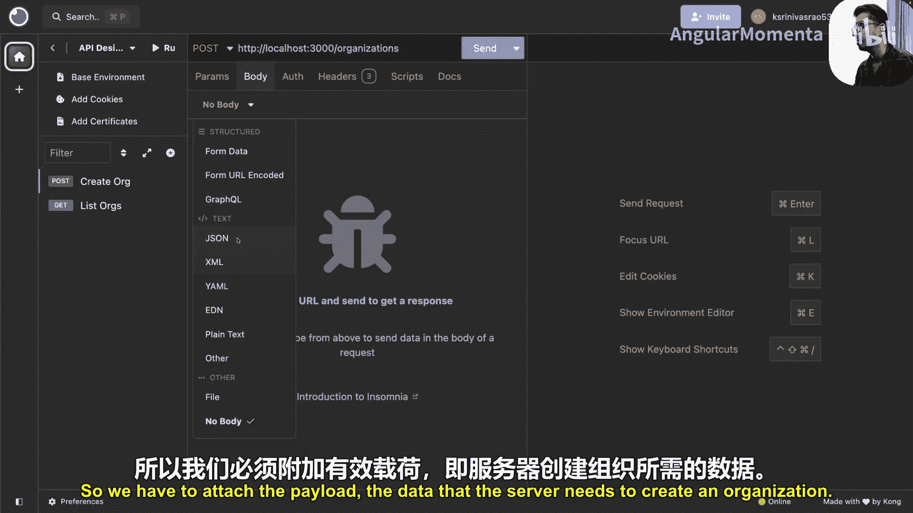

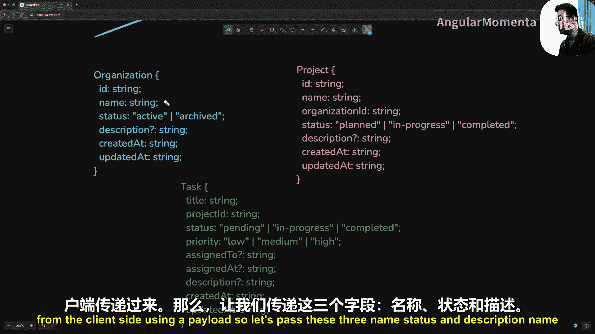

**PUT vs PATCH**：
*   使用`PATCH`来更新资源的**部分**字段。
*   使用`PUT`来**完全替换**服务器上资源的整个表述。
*   在实践中，`PATCH`更常用，因为部分更新更符合单页面应用的需求。

**POST用于自定义操作**：对于不属于CRUD（创建、读取、更新、删除）范畴的自定义操作（例如“发送邮件”、“归档项目”），应使用`POST`方法，因为它在REST规范中是开放式的。

## 实战：设计一个项目管理平台的API

现在，我们将理论应用于实践，为一个假设的项目管理平台（类似Jira）设计API接口。我们假设已完成需求分析和数据库设计，主要资源包括：`组织`、`项目`、`任务`。

我们将使用API客户端工具（如Insomnia或Postman）来设计接口，专注于设计而非具体实现。

### 1. 组织资源接口设计

以下是针对`组织`资源设计的一套完整CRUD及自定义操作接口。

#### 创建组织 (POST)
*   **方法**: `POST`
*   **路径**: `http://localhost:3000/organizations`
*   **请求体 (JSON)**:
    ```json
    {
      "name": "Org 1",
      "status": "active",
      "description": "Some description"
    }
    ```
*   **成功响应 (201 Created)**:
    ```json
    {
      "id": "generated_id",
      "name": "Org 1",
      "status": "active",
      "description": "Some description",
      "createdAt": "timestamp",
      "updatedAt": "timestamp"
    }
    ```
*   **说明**: 创建资源成功返回`201`状态码及新创建的实体。

#### 获取组织列表 (GET)
*   **方法**: `GET`
*   **路径**: `http://localhost:3000/organizations`
*   **查询参数（可选）**:
    *   `page=1`：页码（默认1）
    *   `limit=10`：每页数量（默认10）
    *   `sortBy=createdAt`：排序字段（默认createdAt）
    *   `sortOrder=desc`：排序顺序（默认desc）
    *   `status=active`：过滤条件（例如按状态过滤）
*   **成功响应 (200 OK)**:
    ```json
    {
      "data": [
        { /* 组织对象 */ },
        { /* 组织对象 */ }
      ],
      "total": 50,
      "page": 1,
      "totalPages": 5
    }
    ```
*   **说明**: 列表接口应支持**分页**、**排序**和**过滤**。即使没有数据，也返回`200`和空数组，而非`404`。

#### 获取单个组织 (GET)
*   **方法**: `GET`
*   **路径**: `http://localhost:3000/organizations/{org_id}`
*   **成功响应 (200 OK)**: 返回单个组织对象。
*   **资源不存在响应 (404 Not Found)**: 当请求的ID不存在时返回。

#### 更新组织 (PATCH)
*   **方法**: `PATCH`
*   **路径**: `http://localhost:3000/organizations/{org_id}`
*   **请求体 (JSON)**: 包含要更新的字段。
    ```json
    {
      "status": "archived"
    }
    ```
*   **成功响应 (200 OK)**: 返回更新后的组织对象。

#### 删除组织 (DELETE)
*   **方法**: `DELETE`
*   **路径**: `http://localhost:3000/organizations/{org_id}`
*   **成功响应 (204 No Content)**: 删除成功，响应体为空。

#### 自定义操作：归档组织 (POST)
*   **方法**: `POST`
*   **路径**: `http://localhost:3000/organizations/{org_id}/archive`
*   **成功响应 (200 OK 或 201 Created)**: 根据操作实际是否创建了新资源返回相应状态码和结果。
*   **说明**: 归档可能涉及更新状态、发送通知、清理子资源等一系列操作，因此作为自定义端点。

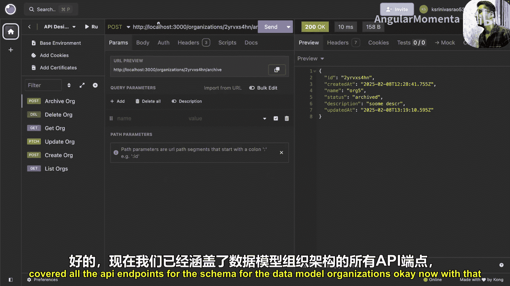

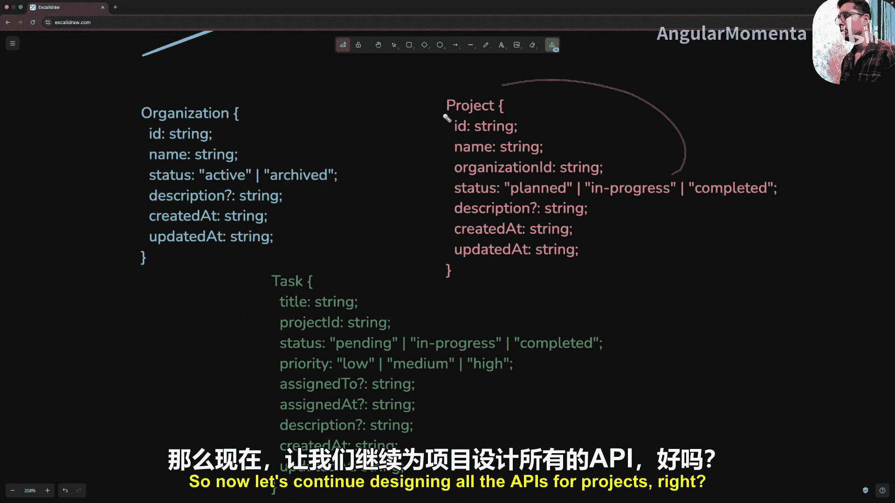

### 2. 项目资源接口设计

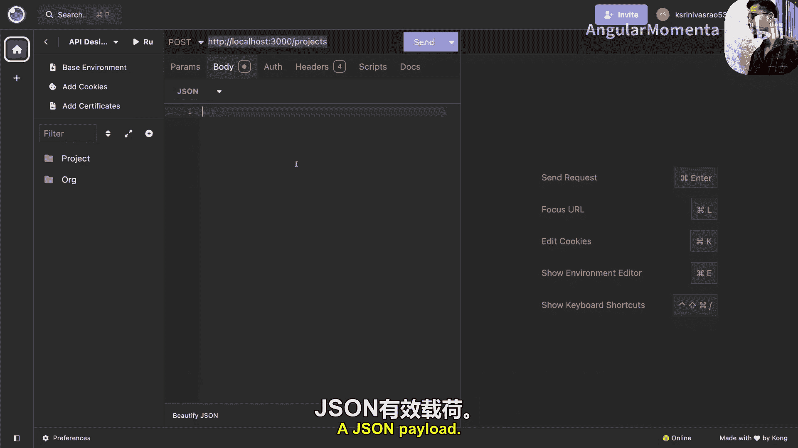

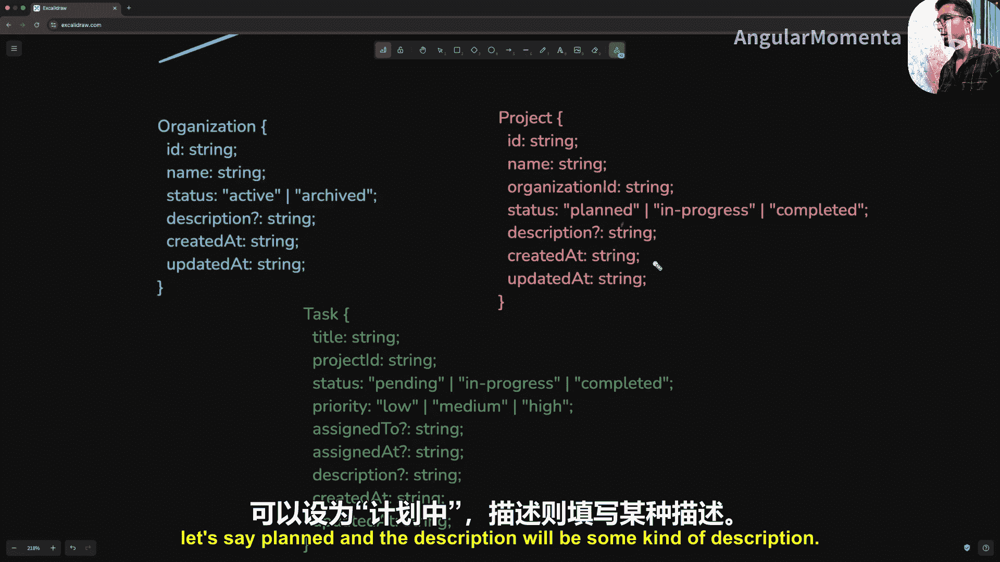

项目资源的接口模式与组织资源完全一致，遵循相同的设计规范。

#### 创建项目 (POST)
*   **方法**: `POST`
*   **路径**: `http://localhost:3000/projects`
*   **请求体**:
    ```json
    {
      "name": "Project Alpha",
      "organizationId": "org_id_here",
      "status": "planned",
      "description": "Project description"
    }
    ```

#### 获取项目列表 (GET)
*   **方法**: `GET`
*   **路径**: `http://localhost:3000/projects`
*   **查询参数**: 支持与组织列表相同的`page`, `limit`, `sortBy`, `sortOrder`, 过滤等参数。

#### 获取、更新、删除单个项目
*   路径模式：`http://localhost:3000/projects/{project_id}`
*   分别使用`GET`、`PATCH`、`DELETE`方法。

#### 自定义操作：克隆项目 (POST)
*   **方法**: `POST`
*   **路径**: `http://localhost:3000/projects/{project_id}/clone`
*   **说明**: 克隆操作可能复制项目及其所有任务，并执行其他业务逻辑。

## API设计最佳实践总结

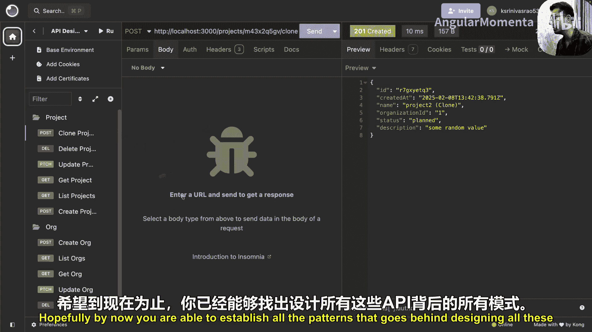

本节课中我们一起学习了REST API设计的完整流程。最后，我们来总结一下设计优秀API的关键原则：

1.  **从UI/UX设计开始**：基于用户交互流程来识别核心资源和操作，这能帮助你设计出更符合实际使用场景的API。
2.  **保持一致性**：
    *   整个API的URL结构、命名规范（始终使用复数资源名、小写、连字符）、JSON字段命名（使用驼峰式）必须统一。
    *   相同类型的操作（如所有列表接口）应支持相同的参数集（分页、排序、过滤）。
3.  **提供合理的默认值**：
    *   列表接口：默认页码`page=1`，默认每页数量`limit=10/20`，默认按`createdAt`降序排序。
    *   创建接口：为可选字段设置符合业务逻辑的默认值（如新组织状态默认为`active`）。
4.  **使用恰当的HTTP语义**：
    *   `GET`用于读取，`POST`用于创建和自定义操作，`PATCH`用于部分更新，`DELETE`用于删除。
    *   返回合适的HTTP状态码：`200`（成功）、`201`（创建成功）、`204`（删除成功无内容）、`404`（资源未找到）、`400`（客户端错误）等。
5.  **设计直观的端点**：
    *   CRUD端点模式清晰。
    *   自定义操作端点使用`POST`方法，并置于特定资源路径下（如`/resource/{id}/action`）。
6.  **提供交互式文档**：使用Swagger/OpenAPI等工具创建和维护API文档，为集成者提供清晰的参考和测试环境。
7.  **先设计，后实现**：在编写任何业务代码之前，先用API设计工具（如Postman, Insomnia）完整地设计出API接口。这有助于你从API消费者角度思考，做出更优的设计决策。

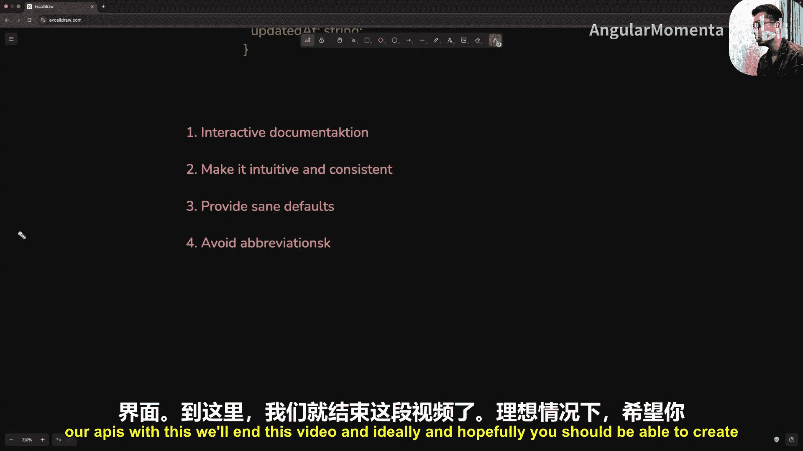

记住，一个优秀的后端工程师不仅要实现功能，更要设计出**直观、一致、易于集成和维护**的API接口。遵循这些原则和模式，你将能够创建出专业级的RESTful API。