# 012：精通Postgres数据库管理 🗄️

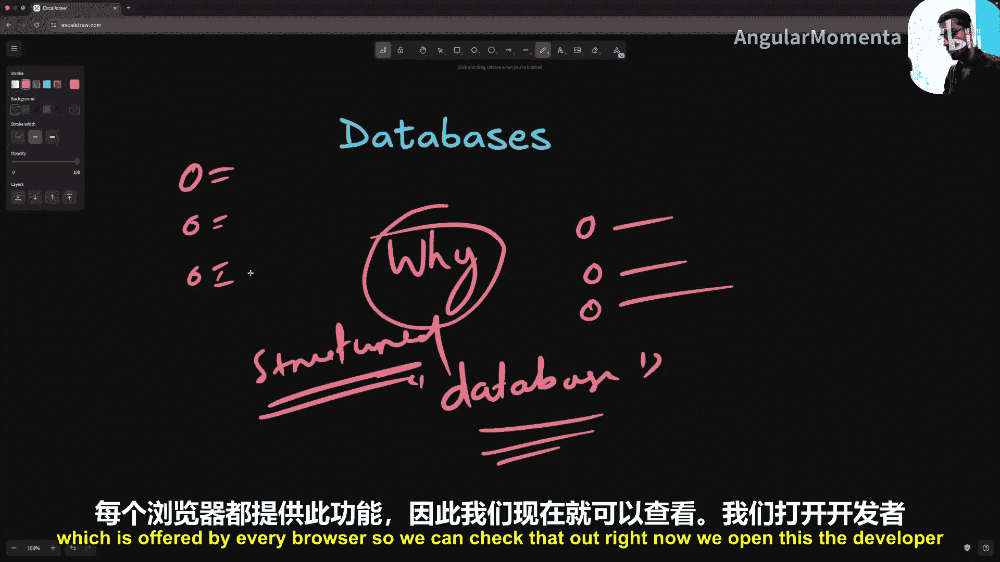

在本节课中，我们将要学习数据库的核心概念，特别是在后端系统中的角色。我们将从为什么需要数据库开始，逐步深入到数据库管理系统（DBMS）的类型，并最终聚焦于PostgreSQL，学习其数据模型设计、查询编写、索引、触发器和迁移等关键实践。

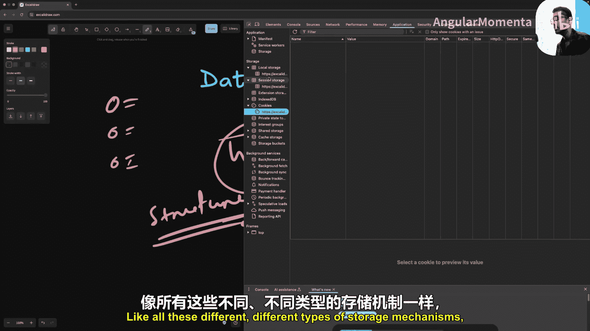

## 为什么需要数据库？

在构建后端系统时，与数据库交互和处理数据是最重要且最频繁的操作之一。理解围绕它的所有概念对于高效工作至关重要。

首先，我们需要回答一个根本问题：为什么需要数据库？从核心上讲，数据库是一种在不同会话间持久化信息的方式。持久化意味着以某种方式存储数据，使得即使在创建它的程序停止后，数据依然存在。

例如，考虑一个待办事项列表应用。你添加条目，勾选已完成的任务等。当你执行一些操作（如创建项目或勾选项目）后关闭应用，再次打开时，你会发现所有信息、你离开时的数据状态都保持不变。这就是我们所说的持久化。信息必须在经过相当长的时间后或跨越不同的物理位置，仍以预期的相同状态存在。如果没有持久化，每次打开应用时，你都必须创建新的待办事项，并且会丢失之前创建的所有任务和进度。

## 什么是数据库？

当我们说“数据库”这个词时，它的含义非常广泛。从最简单的意义上讲，任何结构化的存储都可以被视为数据库。例如，你手机中的联系人列表就可以被认为是一个数据库。同样，作为开发者，你一定熟悉浏览器提供的本地存储概念。我们可以在开发者工具的“应用”选项卡中查看本地存储，它有一些条目。这是一种键值存储格式。它还有会话存储、Cookie存储等。所有这些不同类型的存储机制也被视为数据库。甚至一个你用来记笔记并稍后查阅的简单文本文件，也可以被认为是一个非常基础的数据库。

如果我们试图从所有这些例子中总结出模式，那么数据库基本上是指某种持久化系统，它提供了创建、读取、更新和删除数据的方法。这是数据库的一个非常基础和高级的定义，并不局限于我们在后端系统上下文中通常所说的“数据库”。在后端系统、服务器或典型的开发者上下文中，当我们提到数据库时，我们指的是**基于磁盘的数据库**。

## 为什么是基于磁盘的数据库？

基于磁盘的存储，无论是传统硬盘驱动器（HDD）还是现代固态硬盘（SSD），与其他存储方式（如RAM）相比，相对便宜。RAM，也称为主内存，与基于磁盘的替代方案相比非常快。但问题是，基于RAM的存储相对昂贵，并且我们没有像磁盘那样大的供应量。如果你检查你的系统配置，大多数人拥有8GB、16GB或32GB的RAM，高端消费者可能最多有64GB或128GB的RAM。但当涉及到硬盘（二级存储）时，由于硬盘相对便宜，大多数人拥有从512GB到2TB的存储空间。

你可以看到这种模式：在存储空间方面，我们的主内存（RAM）有限，但基于磁盘的内存（二级存储）空间很大。权衡在于，RAM在数据检索或保存方面非常快，而基于磁盘的存储由于数据存储和获取的方式，相对较慢。这就是为什么我们使用缓存机制（如Redis或内存缓存）——当我们谈论缓存时，我们谈论的是存储在RAM或主内存中，因为从缓存中获取或保存数据非常快。相比之下，从基于磁盘的数据库（二级存储）中获取数据则较慢。

但对于数据库来说，最重要的是我们需要更多空间，并且可以在速度方面做出一定权衡。这就是为什么大多数传统数据库（如关系型或非关系型数据库）都基于磁盘存储或二级存储，它们实际在那里存储数据。它们存储数据的格式、方式以及围绕它的所有算法，是一个非常技术深入的领域，我们不会在本视频中涵盖。我们只想让这些内容与后端工程师在应用层面相关。你需要知道的唯一一点是：像Redis这样的缓存技术将数据存储在主内存或RAM中；而像PostgreSQL或MongoDB这样的传统数据库（我们接下来会讲到）等关系型或非关系型数据库，则将数据存储在磁盘或二级内存中，因为基于磁盘的存储以较低的价格提供了更大的容量，但代价是较低的速度。

## 数据库管理系统（DBMS）

现在，我们来到一个称为DBMS（数据库管理系统）的术语。仅仅将数据存储在某种磁盘存储中是不够的。我们当然还需要不同的方式来检索、修改或删除这些数据。由于我们处理的是数百GB甚至数千GB的数据，我们需要这些创建、读取、更新和删除（CRUD）操作，并且要以非常高效的方式进行。因此，我们有了称为DBMS的软件系统，其唯一职责就是高效地向客户端或用户提供所有这些CRUD操作。当然，它们还有许多其他职责，如安全性、扩展数据库系统和负载均衡等。但在一个很高的层面上，它们有两个主要职责：存储数据和向客户端或用户提供不同的操作，主要是CRUD操作。

DBMS的一些职责包括：
1.  **数据组织**：需要高效地组织数据，以便获取、更新和创建更多数据等操作都是高效的。
2.  **访问**：如前所述，必须提供执行CRUD操作的方法。
3.  **完整性**：这是一个技术术语，但基本上意味着数据的准确性和有效性。例如，在电子商务平台中，我们存储客户的订单详情，每个订单都有支付信息。在数据库中，我们将支付金额存储为一个数字。DBMS软件有责任维护数据的完整性，以确保没有人可以在该字段中插入任何非数字内容。如果有人尝试存储一个字符串，操作应该失败。
4.  **安全性**：基本上意味着保护数据免受未经授权的访问。数据库软件有不同的用户和角色，以保护对数据的访问。

## 为什么需要DBMS软件？

为什么我们不直接使用简单的文本文件或任何类型的文件，将所有数据以文本格式存储在其中呢？在数据库概念出现之前或当人们开始构思数据库概念时，人们就是这样开始的。他们尝试将所有数据存储在文本文件中。

将数据存储在文本文件中有几个问题：
1.  **解析问题**：如果我们将数据存储在文本文件中，每次你想找到一个特定的数据点（例如，客户数据库），你都必须编写应用程序代码来解析文本文件。你需要读取文件，分割行，比较每个字段。这个过程非常慢，而且容易出错。如果出现问题，可能会损坏数据。
2.  **缺乏结构**：文本文件没有正式的结构。你无法强制数据必须采用这种特定结构。文本文件非常灵活，你可以以任何格式存储任何数量的文本。这使得很难强制执行数据一致性。你无法强制执行诸如“此字段只能包含数字”之类的规则。
3.  **并发问题**：如果两个人同时尝试更新同一个文本文件，谁的更新将被视为合法，谁的更新将被丢弃？显然，最后更新文本文件的人，其更新才会持久化。但无法保证结果的一致性。当两个不同的用户尝试同时修改相同的数据时，你需要数据库软件内部的某种并发机制来高效、准确地管理整个交互，以提供一致的结果。而简单的文本文件根本无法做到这一点。

由于所有这些挑战和简单地将数据库存储在文本文件中的局限性，人们提出了像DBMS这样的软件。

## DBMS的类型


在很高的层面上，我们有两种主要类型：**关系型**和**非关系型**。

**关系型数据库**意味着一个将数据组织在**表和列**中的数据库系统。不同表之间的关系使用外键等概念来定义。关系型数据库的一些关键特性包括：
*   **数据是结构化的**，并被插入到具有**预定义模式**的数据库中。你不能随意将任何类型的数据插入数据库。该数据必须具有特定的模式，这意味着它必须对应一个表，并且该表有非常严格的模式。你必须事先定义表的所有列及其数据类型。一切都需要预先定义。你不能随意操作。这是一个非常严格的系统。
*   由于这种严格的模式强制，它提供的优势是**数据完整性**。这意味着在任何时间点，你都可以确信数据的状态。你知道特定列的数据类型是什么，不同表之间的关系是什么。你表中的数据始终具有一致且准确的状态。

为了与这种数据库交互，我们通常使用**SQL**（结构化查询语言）。

一些关系型数据库的例子包括：MySQL、PostgreSQL、SQL Server等。

**非关系型数据库**则不同。虽然关系型数据库要求你在将数据放入数据库之前拥有一个一致的模式，但非关系型数据库不强制执行任何此类要求。你可以放入任何类型的数据。在关系型领域，表在非关系型领域（如MongoDB）中称为集合。在关系型领域，每一行称为一行，在非关系型或MongoDB中称为一个文档。在关系型领域，每一行都具有相同类型的数据，行的结构总是相同的。但在非关系型领域，每个文档可以遵循不同的结构。这是NoSQL领域的主要优势（有时也是劣势）。

优势显然是它具有非常灵活的模式。因此，如果你在进行某种原型设计，希望快速推进，不想花时间弄清楚数据库模式、强制模式和维护它，那么你可以使用像MongoDB这样的数据库，无需考虑数据库模式即可快速推进，可以动态推送数据，获取任何类型的数据等。在某些场景下，这种灵活性可能是一个优势。

## 如何选择：关系型 vs. 非关系型？

让我们通过例子来理解。

**关系型数据库用例**：客户关系管理（CRM）软件。它需要维护关于客户、联系人、销售机会详情等准确且一致的数据。这些关键数据更适合放在关系型系统中。像PostgreSQL这样的关系型数据库是一个非常好的选择，因为它提供了强大的数据完整性，并允许复杂的查询和分析客户之间的关系。

**非关系型数据库用例**：内容管理系统（CMS）。CMS用于将内容从远程站点推送到不同的内容分发系统。例如，一个博客平台。每次你想添加新文章时，你只需登录CMS系统，以Markdown格式编写博客或文章并保存。下次有人刷新你的网站时，新文章就会被获取。在这种用例中，CMS需要存储的内容并不是真正结构化的。一篇文章可以包含图片、代码块、YouTube嵌入等。内容可以是多种类型。因此，在非关系型数据库（如MongoDB）中存储这种动态内容非常有意义，因为你事先不知道将要存储的所有不同类型的数据，你只是想接收所有内容并存储在那里。

然而，尽管像MongoDB这样的数据库提供了很大的灵活性，它们也可能在数据完整性方面带来挑战，因为通常缺乏关系型数据库的强大约束和关系。由于数据的模式和完整性不是在数据库级别强制执行的，你必须在应用程序级别完成，这增加了代码的复杂性，当然也更容易出错，因为应用程序代码经常更改，很容易遗漏某些东西或引入新的错误。

## 为什么选择PostgreSQL？

现在我们必须做出选择。市场上有许多选项。我们有关系型和非关系型数据库。在关系型数据库中，我们有MySQL、PostgreSQL、SQL Server等许多不同的产品，它们都提供大致相同的功能，并且都可以在生产系统中扩展。因此，我们必须在这里做出选择。我们将继续使用哪种数据库？在这种情况下，选择PostgreSQL非常有意义，原因如下：

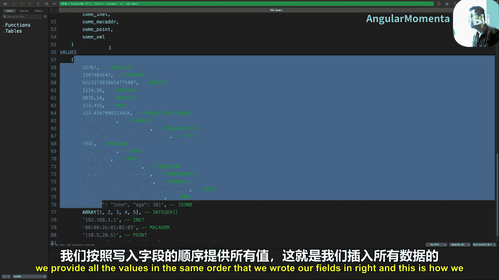

1.  **开源且免费**：它不是专有软件，完全开源。
2.  **遵循SQL标准**：PostgreSQL DBMS遵循SQL标准，因此你可以在PostgreSQL系统上运行任何SQL查询，并且其执行方式与在MySQL或SQL Server等不同数据库系统上相同。未来，如果你想将数据库迁移到不同的系统，由于PostgreSQL符合SQL标准，并且你所有的迁移语句、创建、更新、获取语句都是以标准SQL格式编写的，那么你只需更改数据库并进行一些小的修改，就可以轻松地从PostgreSQL切换到MySQL。
3.  **非常可扩展**：它提供了许多功能。PostgreSQL文档大约有100页长，涵盖了典型SaaS可能遇到的几乎所有用例。它还有一个非常好的基于扩展的系统，因此你可以根据自己的需求进行定制。
4.  **以其可靠性和可扩展性而闻名**。
5.  **具有非常好的JSON支持**：如前所述，选择像MongoDB这样的非关系型数据库的主要原因之一是你可以存储任何类型的数据。当我们说“任何类型的数据”时，我们大多指的是JSON，因为在JSON中你可以存储任何类型的数据（数字、字符串、嵌套的JSON、数组等）。你可以在NoSQL数据库（如MongoDB）中将任何类型的JSON存储为文档。同样，由于PostgreSQL提供了JSON数据类型，并且对JSON字段有非常好的索引和查询能力，因此没有理由仅仅为了动态数据而选择不同的数据库。你可以将PostgreSQL与JSON字段一起用于动态数据的需求。例如，在内容管理系统的例子中，如果你有来自用户的某种内容，并且你想将其保存在数据库中，但对该内容没有严格的模式，你可以使用典型的JSON模式，将来自用户的所有内容存储在那里，当你想渲染时，可以从那里获取并渲染。没有必要仅仅因为动态数据的需求而切换到非关系型数据库。

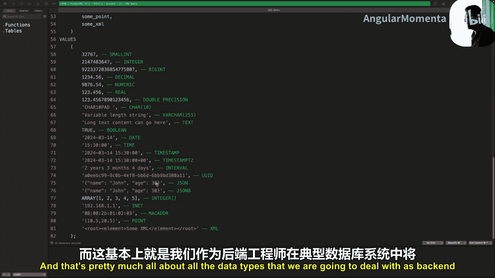

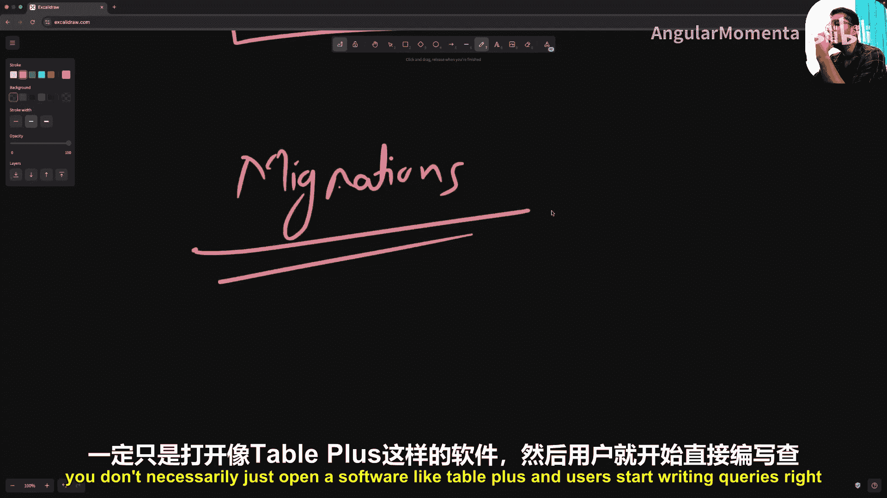

由于所有这些特性，PostgreSQL几乎是首选。根据我的观察，许多初创公司和大型公司都坚持使用PostgreSQL，并且PostgreSQL通常是他们的首选。即使你自己做研究，也会发现很多文章说MySQL有很多性能优势等。但除非你服务于数百万用户并且想要优化应用程序的特定瓶颈，否则你真的不需要考虑是应该选择MySQL还是PostgreSQL。由于PostgreSQL丰富的功能集和出色的JSON支持，PostgreSQL应该成为你几乎所有项目的首选。

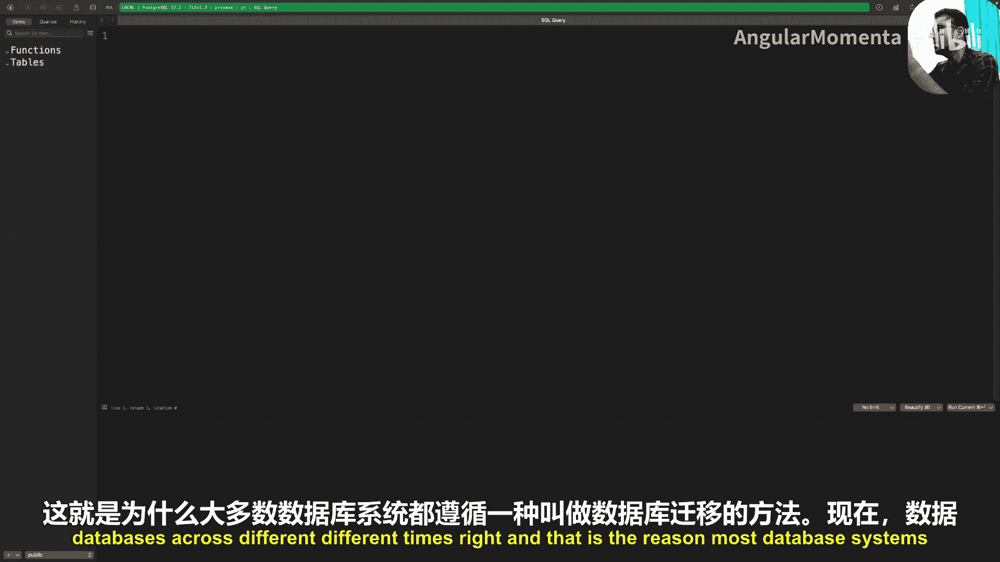

这就是为什么在本视频中，我们将使用PostgreSQL。我们将要学习的关于数据库的所有内容，都将在PostgreSQL的背景下进行。

**注意**：关于SQL和PostgreSQL基础知识的免费资源已经有很多。SQL是我们用来查询的语言，而PostgreSQL是我们执行SQL查询的数据库系统软件。YouTube上有很多关于SQL和PostgreSQL基础知识的课程。因此，为了避免重复相同的内容，我们不会在本视频中再次介绍创建表、SELECT、ORDER BY、GROUP BY等SQL基础知识以及PostgreSQL的基础知识。我们将节省时间，只关注与后端系统非常相关的一些概念，而将基础知识留给你在其他地方学习。

因此，如果你想的话，现在可以暂停此视频，只需在YouTube上搜索“SQL basics”，你会找到从1小时到20小时不等的视频，PostgreSQL基础知识也是如此。你可以根据自己的舒适度和所需的全面性选择一个视频观看，然后回到本视频。这是进入下一节的前提条件。

## PostgreSQL数据类型简介

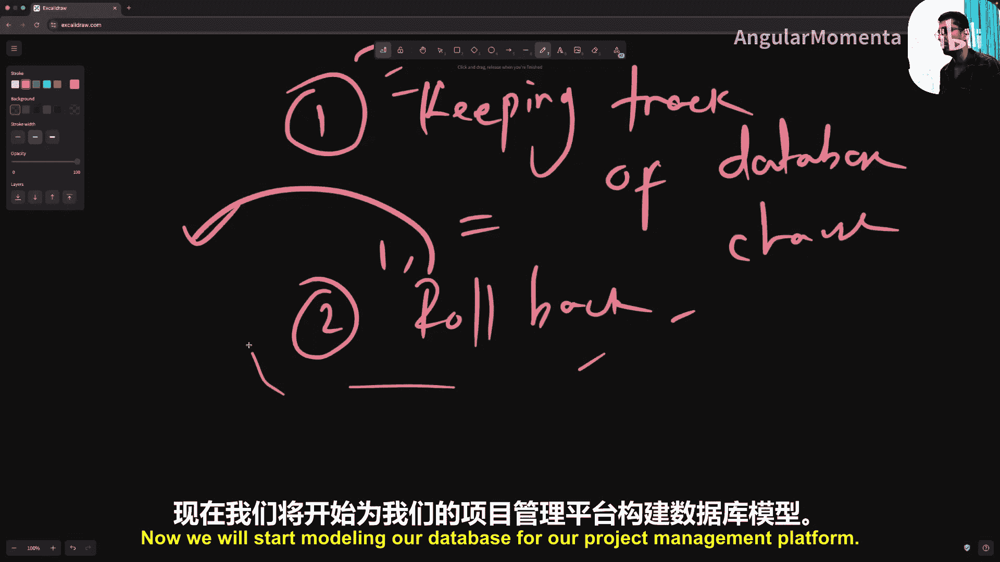

在开始设计数据库之前，了解PostgreSQL中可用的不同数据类型非常重要。我们将进行一个非常高级的介绍。

以下是一个创建表的查询示例，展示了各种数据类型：

```sql
CREATE TABLE data_types_demo (
    id SERIAL PRIMARY KEY,
    small_int SMALLINT,
    normal_int INTEGER,
    big_int BIGINT,
    decimal_num DECIMAL(10, 2),
    real_num REAL,
    double_num DOUBLE PRECISION,
    fixed_char CHAR(10),
    var_char VARCHAR(255),
    text_field TEXT,
    is_active BOOLEAN,
    birth_date DATE,
    meeting_time TIME,
    created_at TIMESTAMP,
    updated_at TIMESTAMP WITH TIME ZONE,
    duration INTERVAL,
    unique_id UUID,
    json_data JSON,
    jsonb_data JSONB,
    tags TEXT[],
    ip_address INET,
    mac_address MACADDR,
    point_location POINT,
    xml_data XML
);
```

以下是主要数据类型的简要说明：

*   **SERIAL/BIGSERIAL**：自动递增的整数类型。通常用作表的主键ID。`BIGSERIAL`容量更大。
*   **整数类型**：`SMALLINT`、`INTEGER`、`BIGINT`。它们都是整数，只是容量不同：`SMALLINT` < `INTEGER` < `BIGINT`。
*   **小数类型**：`DECIMAL`/`NUMERIC` 和 `REAL`/`DOUBLE PRECISION`。
    *   `DECIMAL(10,2)` 表示总共最多10位数字，小数点后固定2位。它用于需要**高精度**的场合，如价格。
    *   `REAL`/`DOUBLE PRECISION` 是浮点数，处理速度更快，但可能存在微小精度误差。适用于精度要求不高的科学计算或测量值。
*   **字符串类型**：`CHAR`、`VARCHAR`、`TEXT`。
    *   `CHAR(10)`：固定长度，不足会填充空格。已过时，不推荐常规使用。
    *   `VARCHAR(255)`：可变长度，最大255个字符。`255`是来自MySQL的惯例，在PostgreSQL中无特殊意义。
    *   `TEXT`：可变长度，无限制（实际有非常大上限）。**PostgreSQL官方推荐使用`TEXT`类型**，它与`VARCHAR`在性能上无显著差异，且更灵活，无需预先定义长度。
*   **布尔类型**：`BOOLEAN`，存储 `TRUE` 或 `FALSE`。
*   **日期时间类型**：
    *   `DATE`：仅日期。
    *   `TIME`：仅时间。
    *   `TIMESTAMP`：日期和时间。
    *   `TIMESTAMP WITH TIME ZONE`：日期、时间和时区信息。
    *   `INTERVAL`：时间间隔，如 `10 days`。
*   **UUID**：通用唯一标识符，常用于主键，因其友好性和唯一性。
*   **JSON/JSONB**：用于存储JSON数据。`JSONB`（JSON Binary）是二进制格式，查询和索引效率更高，**推荐使用`JSONB`**。
*   **数组**：可以存储任何数据类型的数组，如 `TEXT[]`。
*   **其他类型**：如网络地址(`INET`)、MAC地址(`MACADDR`)、几何点(`POINT`)、XML等，不常用。

## 数据库迁移

在生产系统中，你不能只是打开一个像TablePlus这样的图形化软件并开始编写查询。因为如果出现问题，或者即使没有出现问题，也无法跟踪随时间推移对特定数据库应用了哪些更改，或者是谁应用的。无法控制数据库在不同时间点的状态或版本。

因此，大多数数据库系统都遵循一种称为**数据库迁移**的模式。数据库迁移基本上是不同文件（例如 `1.sql`、`2.sql`）的集合，这些文件按顺序包含SQL语句。你使用一个命令行工具（如 `dbmate` 或 `go-migrate`）按顺序执行这些文件中的所有SQL语句。

迁移文件通常按顺序命名（如数字序列或时间戳）。迁移工具有两个主要部分：
*   **向上迁移**：包含要对数据库进行的更改（如创建表、创建索引）。
*   **向下迁移**：包含如何撤销向上迁移中的更改（如删除表、删除索引）。这用于在出现问题时回滚到先前状态。

迁移工具通常会在你的数据库中创建一个特殊的表（如 `schema_migrations`）来跟踪当前已应用的迁移版本。

**为什么需要迁移？**
1.  **跟踪数据库更改**：随时间推移跟踪数据库更改。你有一个文件夹，其中包含提交到版本控制系统（如Git）的文件。随着时间的推移，你不断向同一文件夹添加新的迁移文件，从而跟踪数据库模式的所有更改。
2.  **回滚**：如果出现问题，可以回滚到特定版本。

## 设计项目管理平台数据库

现在，我们将开始为项目管理平台设计数据库。我们将编写迁移来创建表，并理解围绕它的一些概念。

我们将创建一个迁移文件来定义表结构。以下是核心表的设计思路：

1.  **用户表 (`users`)**：存储用户基本信息。
    *   `id` (UUID, 主键)
    *   `email` (TEXT, 唯一，非空)
    *   `full_name` (TEXT, 非空)
    *   `password_hash` (TEXT, 非空)
    *   `created_at`, `updated_at` (TIMESTAMP WITH TIME ZONE)
2.  **用户资料表 (`user_profiles`)**：与用户表是一对一关系，存储用户的额外信息（头像、简介、电话）。使用 `user_id` 作为主键和外键。
3.  **项目表 (`projects`)**：存储项目信息。
    *   `id` (UUID, 主键)
    *   `name` (TEXT, 非空)
    *   `description` (TEXT)
    *   `status` (枚举类型: `active`, `completed`, `archived`，默认 `active`)
    *   `owner_id` (UUID, 外键引用 `users.id`，删除时限制 `ON DELETE RESTRICT`)
    *   `created_at`, `updated_at`
4.  **任务表 (`tasks`)**：存储任务信息，与项目是多对一关系。
    *   `id` (UUID, 主键)
    *   `project_id` (UUID, 外键引用 `projects.id`，删除时级联 `ON DELETE CASCADE`)
    *   `title` (TEXT, 非空)
    *   `description` (TEXT)
    *   `priority` (INTEGER, 检查约束 `priority BETWEEN 1 AND 5`，默认 1)
    *   `status` (枚举类型: `pending`, `in_progress`, `completed`, `cancelled`，默认 `pending`)
    *   `due_date` (DATE)
    *   `assigned_to` (UUID, 外键引用 `users.id`，删除时置空 `ON DELETE SET NULL`)
    *   `created_at`, `updated_at`
5.  **项目成员表 (`project_members`)**：实现项目和用户之间的多对多关系（链接表）。
    *   `project_id` (UUID, 外键引用 `projects.id`，删除时级联)
    *   `user_id` (UUID, 外键引用 `users.id`，删除时级联)
    *   `role` (枚举类型: `owner`, `admin`, `member`，默认 `member`)
    *   `created_at`, `updated_at`
    *   **主键**：`(project_id, user_id)` 复合主键，确保唯一性。

**关系总结**：
*   **一对一**：`users` 与 `user_profiles`。通过在 `user_profiles` 中使用 `user_id` 作为主键实现。
*   **一对多**：`projects` 与 `tasks`。通过在 `tasks` 中使用 `project_id` 作为外键实现。
*   **多对多**：`projects` 与 `users`。通过链接表 `project_members` 实现，该表包含两个外键并形成复合主键。

## 编写查询：对应后端API

上一节我们设计了数据库模式，本节中我们来看看如何为典型的后端API编写SQL查询。

### 1. 获取所有用户 (GET /api/users)

此API需要返回用户列表及其资料信息。

```sql
-- 使用左连接确保即使没有资料的用户也被返回
-- 使用 jsonb_build_object 将用户资料转换为JSON对象
SELECT
    u.*,
    jsonb_build_object(
        'avatar_url', up.avatar_url,
        'bio', up.bio,
        'phone', up.phone
    ) AS profile
FROM users u
LEFT JOIN user_profiles up ON u.id = up.user_id
ORDER BY u.created_at DESC;
```

**说明**：
*   `FROM users u`：从用户表开始，`u` 是别名。
*   `LEFT JOIN user_profiles up ON u.id = up.user_id`：左连接用户资料表，连接条件是用户ID相等。
*   `jsonb_build_object(...) AS profile`：将资料行的字段构建成一个JSON对象，并命名为 `profile` 字段。
*   `ORDER BY u.created_at DESC`：按创建时间降序排序，最新的在前。

### 2. 获取单个用户 (GET /api/users/:id)

此API根据用户ID返回特定用户及其资料。

```sql
-- 使用参数化查询防止SQL注入
SELECT
    u.*,
    jsonb_build_object(
        'avatar_url', up.avatar_url,
        'bio', up.bio,
        'phone', up.phone
    ) AS profile
FROM users u
LEFT JOIN user_profiles up ON u.id = up.user_id
WHERE u.id = :user_id; -- :user_id 是参数占位符
```

**说明**：
*   `WHERE u.id = :user_id`：添加条件过滤特定用户。`:user_id` 是一个参数占位符。在实际后端代码中，你会通过数据库驱动安全地传入动态值，这是防止SQL注入的关键。

### 3. 创建用户 (POST /api/users)

此API用于创建新用户。


```sql
-- 插入用户，并返回创建的行
INSERT INTO users (email, full_name, password_hash)
VALUES (:email, :full_name, :password_hash)
RETURNING *;
```

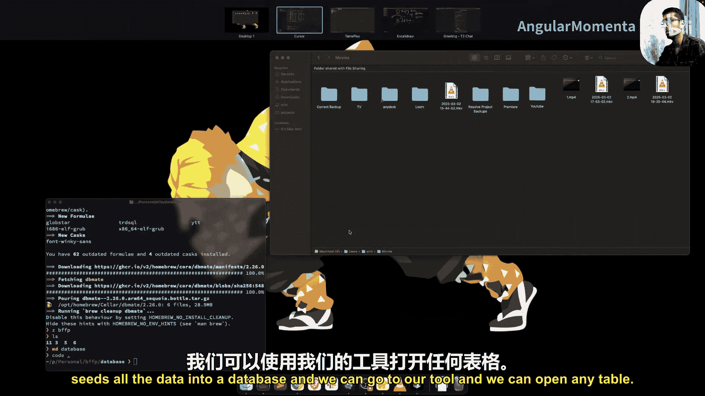

**说明**：
*   `INSERT INTO ... VALUES ...`：插入新行。
*   `RETURNING *`：返回刚插入的整行数据，方便API响应。

### 4. 更新用户资料 (PATCH /api/users/:id/profile)

此API用于部分更新用户资料。

```sql
-- 根据 user_id 更新用户资料表，只更新提供的字段
UPDATE user_profiles
SET
    bio = COALESCE(:bio, bio), -- 如果:bio参数为NULL，则保持原值
    phone = COALESCE(:phone, phone),
    avatar_url = COALESCE(:avatar_url, avatar_url)
WHERE user_id = :user_id
RETURNING *;
```

**说明**：
*   `UPDATE ... SET ...`：更新指定字段。
*   `COALESCE(:bio, bio)`：如果传入的 `:bio` 参数不为空，则使用新值；否则保持原来的 `bio` 值。这实现了部分更新。
*   `WHERE user_id = :user_id`：指定更新哪条记录。
*   `RETURNING *`：返回更新后的行。

### 5. 带过滤、排序和分页的查询

对于列表API，通常需要支持过滤、排序和分页。

```sql
-- 假设前端传递了 filter_letter, sort_by, sort_order, page, limit 参数
SELECT
    u.*,
    jsonb_build_object(
        'avatar_url', up.avatar_url,
        'bio', up.bio,
        'phone', up.phone
    ) AS profile
FROM users u
LEFT JOIN user_profiles up ON u.id = up.user_id
WHERE (:filter_letter IS NULL OR u.full_name ILIKE :filter_letter || '%') -- 按姓名首字母过滤
ORDER BY
    -- 动态排序字段和顺序
    CASE :sort_by
        WHEN 'email' THEN u.email
        WHEN 'full_name' THEN u.full_name
        ELSE u.created_at -- 默认排序字段
    END
    -- 动态排序顺序
    CASE WHEN :sort_order = 'ASC' THEN 1 ELSE 0 END ASC,
    CASE WHEN :sort_order = 'DESC' THEN 1 ELSE 0 END DESC
LIMIT :limit OFFSET (:page - 1) * :limit; -- 分页
```

**说明**：
*   `WHERE (:filter_letter IS NULL OR ...)`：如果过滤参数为空，则忽略过滤条件；否则应用过滤。
*   `ILIKE`：不区分大小写的模糊匹配。`:filter_letter || '%'` 匹配以该字母开头的姓名。
*   `ORDER BY CASE ... END`：根据 `:sort_by` 参数动态选择排序字段。
*   `LIMIT :limit OFFSET ...`：实现分页。`OFFSET` 跳过前面页的数据。

**注意**：在实际后端代码中，动态查询的构建会更复杂，通常使用查询构建器或ORM来安全地组合SQL片段和参数。

## 索引

上一节我们介绍了如何编写基本查询，本节中我们来看看如何通过索引优化这些查询的性能。

索引是数据库中的一个数据结构，用于加速数据检索。你可以把它想象成书的索引：不用翻遍整本书来找到某个主题，你可以直接查看索引，找到主题对应的页码。

**为什么需要索引？**
没有索引，当数据库执行 `WHERE`、`JOIN` 或 `ORDER BY` 操作时，可能需要进行全表扫描，逐行比较，这在数据量大时非常慢。索引通过创建特定列的排序副本（及其在磁盘上的位置）来工作，使数据库能够快速定位行。

**何时创建索引？**
考虑为以下情况的列创建索引：
1.  **主键和外键**：通常自动索引。
2.  **经常用于 `WHERE` 子句的列**。
3.  **经常用于 `JOIN` 条件的列**。
4.  **经常用于 `ORDER BY` 或 `GROUP BY` 的列**。

**权衡**：
索引会提高查询速度，但会降低插入、更新和删除的速度，因为索引本身也需要维护。同时，索引占用额外的磁盘空间。

为我们的项目管理平台创建一些索引：

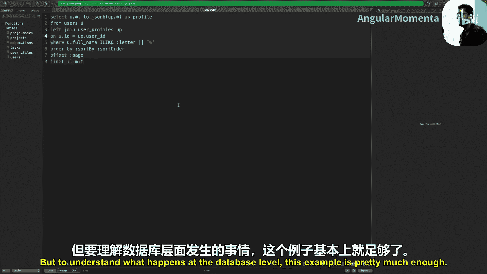

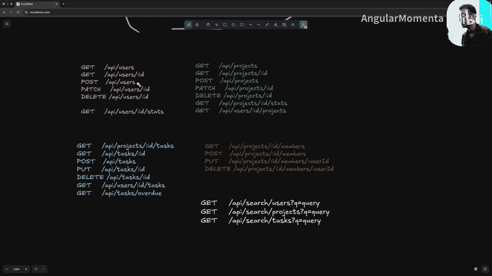

```sql
-- 在迁移文件中添加索引创建语句
CREATE INDEX idx_users_email ON users(email);
CREATE INDEX idx_users_created_at_desc ON users(created_at DESC);
CREATE INDEX idx_tasks_project_id ON tasks(project_id);
CREATE INDEX idx_tasks_assigned_to ON tasks(assigned_to);
CREATE INDEX idx_tasks_status ON tasks(status);
CREATE INDEX idx_tasks_created_at_desc ON tasks(created_at DESC);
CREATE INDEX idx_project_members_project_id ON project_members(project_id);
CREATE INDEX idx_project_members_user_id ON project_members(user_id);
```

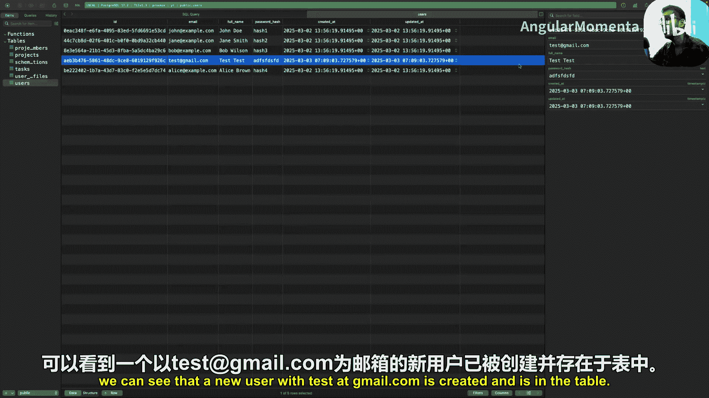

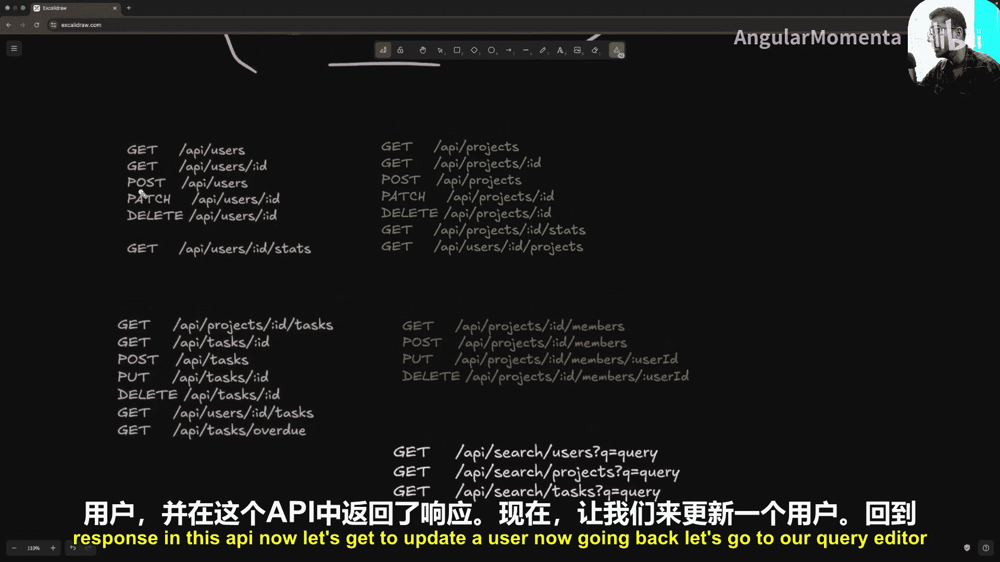

**说明**：
*   `idx_users_email`：加速按邮箱查找用户或基于邮箱的连接。
*   `idx_users_created_at_desc`：加速按创建时间降序获取用户列表的查询。
*   `idx_tasks_project_id`：加速根据项目ID查找任务的查询（例如，“获取某项目的所有任务”）。
*   `idx_tasks_assigned_to`：加速根据负责人查找任务的查询。
*   `idx_tasks_status`：加速按状态过滤任务的查询。
*   `idx_tasks_created_at_desc`：加速按创建时间降序获取任务列表。
*   `idx_project_members_*`：加速在链接表上基于项目或用户ID的查询。

## 触发器

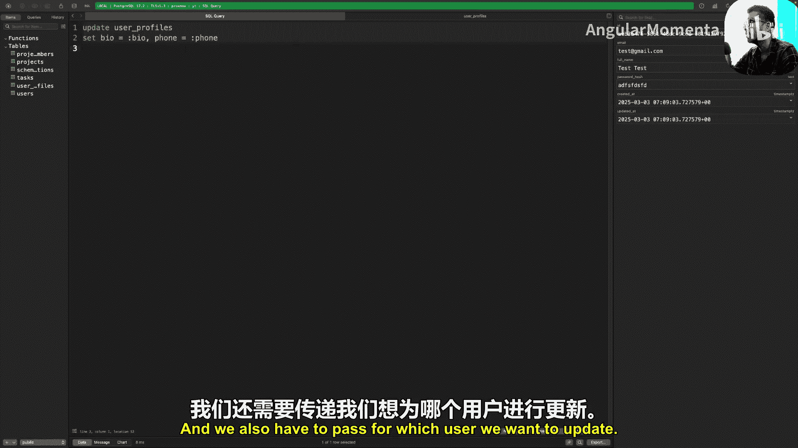

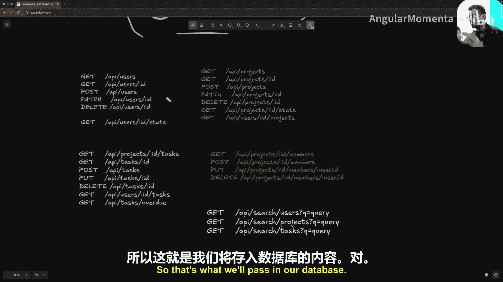

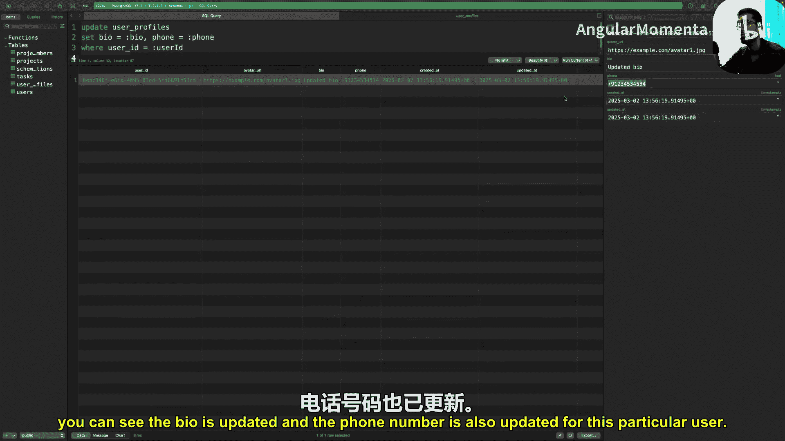

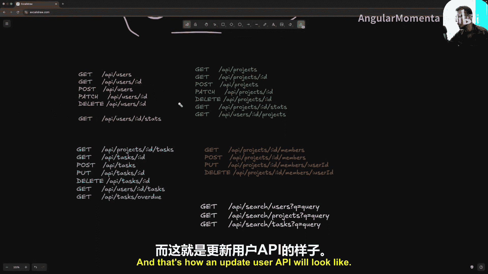

触发器是一种数据库对象，当特定事件（如 `INSERT`、`UPDATE`、`DELETE`）在表上发生时，会自动执行一段预定义的代码（函数）。

一个常见的用例是自动更新 `updated_at` 时间戳字段，这样我们就不必在每次更新操作时手动设置它。

为我们的表创建触发器：


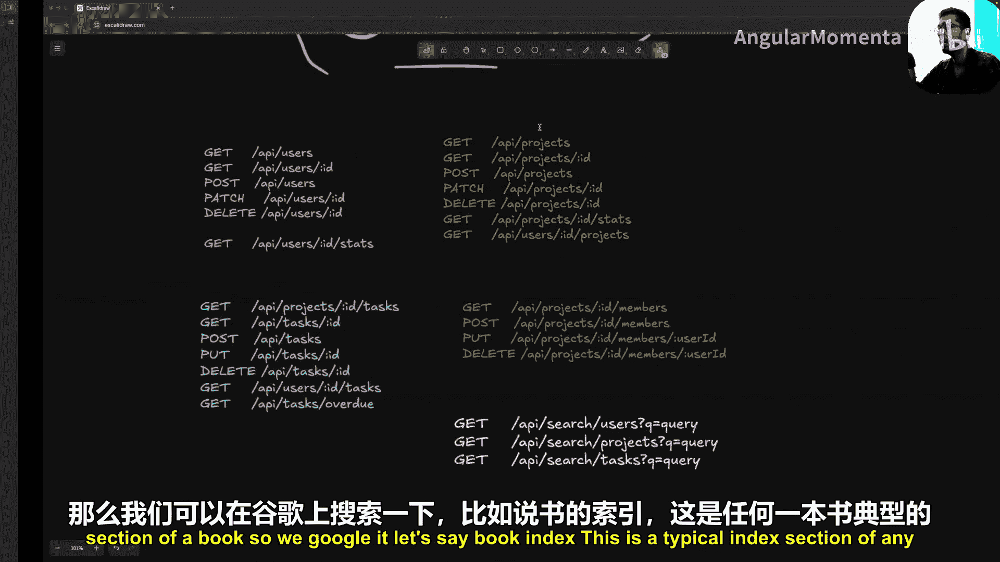

```sql
-- 首先，创建一个函数，用于将 updated_at 设置为当前时间戳
CREATE OR REPLACE FUNCTION update_updated_at_column()
RETURNS TRIGGER AS $$
BEGIN
    NEW.updated_at = CURRENT_TIMESTAMP;
    RETURN NEW;
END;
$$ language 'plpgsql';

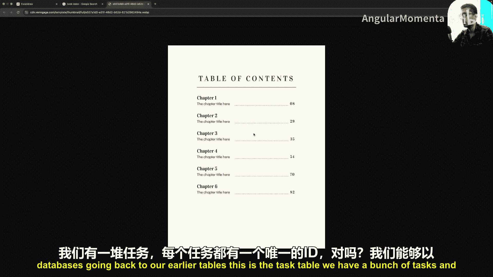

-- 然后，为每个需要此功能的表创建触发器
CREATE TRIGGER update_users_updated_at BEFORE UPDATE ON users
    FOR EACH ROW EXECUTE FUNCTION update_updated_at_column();

CREATE TRIGGER update_user_profiles_updated_at BEFORE UPDATE ON user_profiles
    FOR EACH ROW EXECUTE FUNCTION update_updated_at_column();

CREATE TRIGGER update_projects_updated_at BEFORE UPDATE ON projects
    FOR EACH ROW EXECUTE FUNCTION update_updated_at_column();

CREATE TRIGGER update_tasks_updated_at BEFORE UPDATE ON tasks
    FOR EACH ROW EXECUTE FUNCTION update_updated_at_column();

CREATE TRIGGER update_project_members_updated_at BEFORE UPDATE ON project_members
    FOR EACH ROW EXECUTE FUNCTION update_updated_at_column();
```

**说明**：
*   `CREATE OR REPLACE FUNCTION ...`：定义一个触发器函数。`NEW` 代表正在被更新（或插入）的新行。
*   `CREATE TRIGGER ... BEFORE UPDATE ON ...`：在指定表的每次更新操作之前，为受影响的每一行执行该函数。
*   现在，每当更新这些表中的任何行时，`updated_at` 字段都会自动设置为当前时间戳。

## 数据填充

在开发环境中，为了测试，我们通常需要向数据库插入一些初始测试数据。这个过程称为“播种”。

我们可以创建一个单独的迁移文件来执行播种：

```sql
-- 使用公共表表达式(CTE)使插入更清晰
WITH inserted_users AS (
    INSERT INTO users (email, full_name, password_hash)
    VALUES
        ('alice@example.com', 'Alice Brown', 'hash1'),
        ('bob@example.com', 'Bob Smith', 'hash2'),
        ('charlie@example.com', 'Charlie Davis', 'hash3')
    RETURNING id, email
),
inserted_profiles AS (
    -- 基于插入的用户创建资料
    SELECT ... -- 具体插入逻辑
),
inserted_projects AS (
    -- 插入项目
    SELECT ... -- 具体插入逻辑
)
-- 可以继续插入任务、项目成员等
SELECT 'Seeding completed';
```

运行此迁移后，数据库中将拥有可用于开发和测试的样本数据。

## 总结

在本节课中，我们一起学习了后端开发中数据库管理的核心知识。我们从数据库的基本概念和必要性出发，探讨了基于磁盘存储的原因，并介绍了数据库管理系统（DBMS）的职责和主要类型（关系型 vs. 非关系型）。我们详细说明了为什么PostgreSQL是一个强大的选择，特别是其开源、SQL标准兼容、可扩展性以及出色的JSON支持。

我们深入实践，设计了项目管理平台的数据库模式，包括用户、资料、项目、任务和项目成员表，并阐释了一对一、一对多和多对多关系的实现方式。我们学习了如何为典型的CRUD API编写SQL查询，包括使用`JOIN`关联数据、`WHERE`过滤、`ORDER BY`排序、`LIMIT/OFFSET`分页，以及至关重要的**参数化查询**来防止SQL注入。


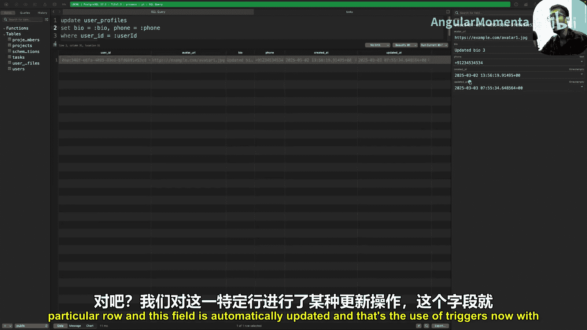

为了提升性能，我们介绍了**索引**的概念，了解了何时以及为何创建索引，并为我们设计的表创建了相应的索引。我们还使用**触发器**自动化了`updated_at`时间戳的更新，减少了应用程序代码的负担。最后，我们了解了**数据库迁移**的重要性，它帮助我们版本化、可追溯地管理数据库模式变更，并通过**数据填充**为开发环境准备测试数据。


掌握这些概念和实践，你将能够为后端系统设计健壮的数据模型，编写高效安全的查询，并实施必要的优化和维护策略，从而构建出可靠、可扩展的应用程序。