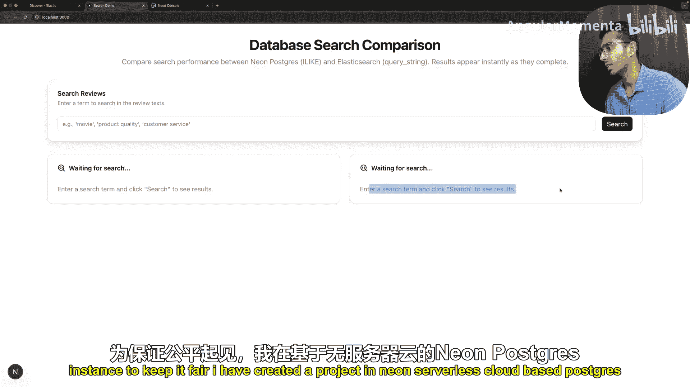
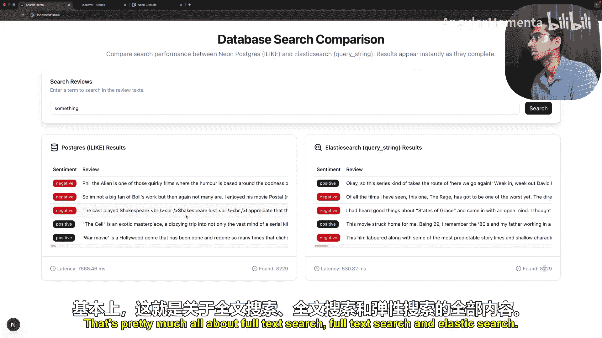

# 015：使用Elasticsearch进行全文检索，实现极速搜索 🔍

在本节课中，我们将要学习全文检索的核心概念，理解为什么传统的数据库搜索在数据量大时会变得缓慢，并探索像Elasticsearch这样的专用搜索引擎是如何解决速度、相关性和容错性等问题的。我们将通过一个简单的比喻和实际演示来直观地理解这些概念。

## 概述：传统搜索的困境

想象一下，现在是2005年，你在一家快速发展的电商公司担任软件工程师。公司大约有5000个产品，你的任务是编写一个数据库查询，允许用户搜索产品。你可能会写出类似 `SELECT * FROM products WHERE name LIKE ‘%laptop%’` 的查询。这种方式简单直接，用户搜索“laptop”就能得到一些结果，一切都很简单。

然而，随着公司飞速发展，产品数量激增至数百万。这时，那个曾经在50毫秒内返回结果的简单 `LIKE` 查询，现在可能需要30秒才能完成。用户和经理都感到沮丧，他们不仅要求搜索更快，还希望更智能：例如，搜索“laptop”时，优先显示MacBook Pro而不是笔记本电脑包；同时，还要能容忍用户的拼写错误（如“laptp”）。这些需求共同催生了像Elasticsearch这样的专用搜索引擎。

上一节我们介绍了传统搜索面临的挑战，本节中我们来看看搜索引擎是如何从底层原理上解决这些问题的。

## 从图书管理员到倒排索引

我们可以把你的PostgreSQL或任何关系型数据库想象成一个图书管理员。你向管理员询问某本书的位置，他能准确地知道每本书放在哪里。但这种方式有一个致命的缺陷：如果你要寻找一本主题为“机器学习”的书，管理员必须从图书馆的第一个书架开始，逐本检查每一本书的标题和内容，直到找到所有相关的书。这个过程在小型图书馆可能只需几分钟，但如果图书馆有上千万甚至上亿本书（就像拥有海量数据的数据库），这个过程将变得极其缓慢，可能需要数天。

此外，这位“管理员”没有“相关性”的概念。它可能先找到一本只在最后一页提到“机器学习”的书，然后才找到一本名为《机器学习导论》的书。对于用户来说，后者显然更相关，应该优先显示。

在数据库中，使用 `WHERE name LIKE ‘%keyword%’` 进行查询，其行为就完全像这位图书管理员。数据库必须扫描表中的每一行，对每个文本字段进行逐字符的模式匹配。这种方式虽然全面，但** painfully slow**（极其缓慢），并且无法判断结果的相关性。

## 革命性的思想：倒排索引

为了解决搜索的速度和相关性难题，计算机科学家们从20世纪60年代就开始研究信息检索领域。一个革命性的想法诞生了：**倒排索引**。

这个核心概念其实很简单。我们不再像图书管理员那样，通过遍历所有书籍（文档）来查找关键词。相反，我们在存储书籍时，就预先为书中的每个单词建立一个索引。这个索引记录了每个单词出现在哪些书中，以及具体出现在哪些位置。

例如，单词“machine”可能出现在《机器学习导论》的第1、15、23页，以及《机器时代》的第5、89页。单词“learning”则出现在《机器学习导论》的第1、16、24页，以及《深度学习基础》的某些页面。

这样，我们就建立了一个从 **单词** 到 **文档** 的映射，而不是从文档中查找单词。我们“倒置”了搜索的方向，因此称之为“倒排索引”。当用户搜索“machine learning”时，系统可以迅速从索引中分别找到包含“machine”和“learning”的文档列表，然后通过交集运算找到同时包含这两个词的文档。

这个简单的概念，正是Elasticsearch等全文搜索引擎的强大动力之源。Elasticsearch底层使用的关键技术是 **Apache Lucene**，一个基于倒排索引的文本搜索库。

## Elasticsearch的优势：速度与相关性

拥有了倒排索引，我们的“图书管理员”（搜索引擎）速度得到了质的飞跃。但Elasticsearch带来的另一个巨大优势是**相关性评分**。

它不仅仅返回包含关键词的文档，还会计算每个文档与查询的相关程度，并据此排序。例如：
*   **词频**：一个词在单个文档中出现的次数越多，该文档的相关性可能越高。
*   **字段加权**：一个词出现在**标题**字段，通常比出现在**描述**字段更具相关性，而描述字段又比**正文**内容更相关。在Elasticsearch查询中，我们可以自定义这种加权规则。
*   **文档长度**：词在短文档中出现可能比在长文档中出现更具显著性。

Elasticsearch使用一种名为 **BM25** 的算法来综合考虑这些因素，计算出相关性得分。这使得搜索结果不仅快，而且“聪明”，能够将最可能符合用户意图的结果排在前面。

## 实际应用场景与选择

在实际开发中，全文搜索有广泛的应用场景：

以下是Elasticsearch的一些典型应用：
*   **智能补全**：像Google或Amazon的搜索框，输入时实时给出建议。
*   **容错搜索**：当用户输入“laptp”时，能自动纠正并返回“laptop”的搜索结果。
*   **日志管理与分析**：著名的ELK栈（Elasticsearch, Logstash, Kibana）利用Elasticsearch快速检索和分析海量日志数据。

那么，作为后端工程师，我们该如何选择呢？

以下是你的两个主要选项：
1.  **使用数据库内置的全文搜索**：如PostgreSQL本身就提供了功能强大的全文搜索模块。如果你的需求不特别复杂，且希望技术栈统一，这是一个好选择。
2.  **使用专用搜索引擎**：如Elasticsearch。如果你的公司已经在使用ELK栈管理日志，那么将其用于业务搜索也顺理成章。它功能更强大、更专业，特别适合构建复杂的、对相关性要求高的搜索体验。

对于大多数工程师而言，掌握数据库的深度知识是必须的，因为它是后端工作的核心。而对于Elasticsearch，你通常不需要精通其所有内部原理（如BM25算法的具体实现）。更重要的是知道在什么场景下应该使用它，并能够查阅文档和示例代码来快速实现功能。在需要极致搜索体验时，它就是你的得力工具。

## 演示：传统搜索 vs Elasticsearch

为了直观对比，我们进行一个简单的演示。我们有一个包含5万条产品评论的数据集，字段包括`review`（评论文本）和`sentiment`（情感倾向）。

我们分别在PostgreSQL和Elasticsearch中建立了索引。

**搜索查询对比：**
*   **PostgreSQL (传统方式)**：`SELECT * FROM reviews WHERE review ILIKE ‘%keyword%’`
*   **Elasticsearch**：使用其JSON查询DSL进行全文检索。

**性能结果：**
*   搜索关键词“laptop”：
    *   Elasticsearch 耗时约 **1秒**。
    *   PostgreSQL 耗时约 **3-4秒**。
*   搜索一个更常见的词（返回约8000条结果）：
    *   Elasticsearch 耗时约 **500毫秒**。
    *   PostgreSQL 耗时约 **7.5秒**。

尽管返回的结果数量相同，但Elasticsearch的速度显著快于使用`ILIKE`的传统关系型数据库查询。随着数据量的增长，这种差距会愈加明显。

## 总结

本节课中我们一起学习了全文检索的演进历程和核心原理。我们从传统数据库`LIKE`查询的局限性出发，理解了在海量数据下对搜索**速度**、**相关性**和**容错性**的迫切需求。接着，我们探讨了革命性的**倒排索引**概念，它通过预先建立从词到文档的映射，极大地提升了搜索效率。在此基础上，像**Elasticsearch**这样的工具利用**BM25**等算法实现了智能的相关性评分，让搜索结果不仅快，而且准。

作为后端开发者，你需要知道，当面临复杂的搜索需求时，除了优化数据库，还可以选择数据库内置的全文搜索功能或引入Elasticsearch这类专用引擎。掌握何时以及如何运用这些工具，将为你的应用带来质的飞跃。