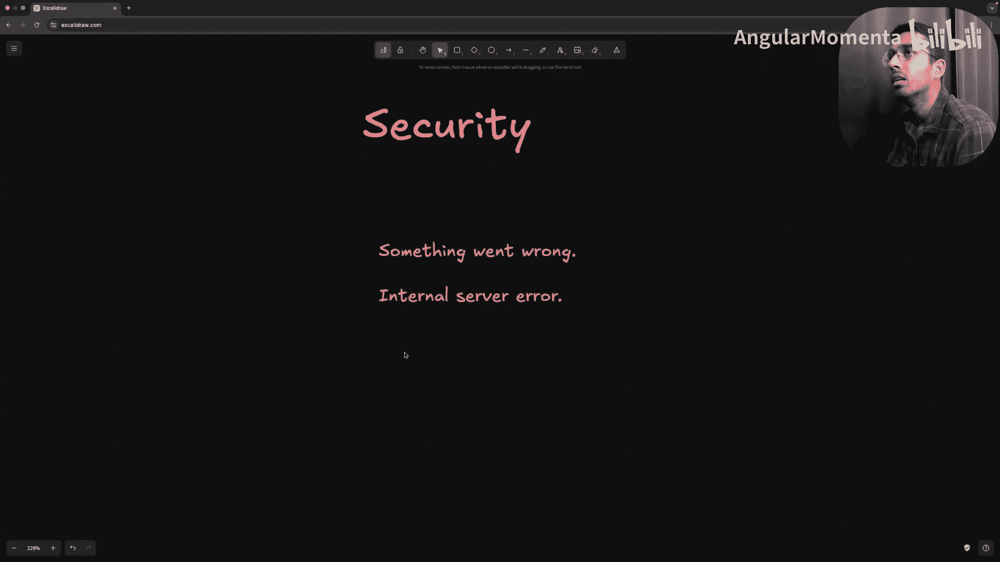
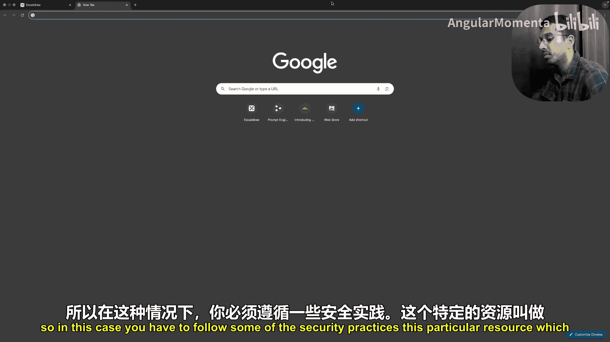
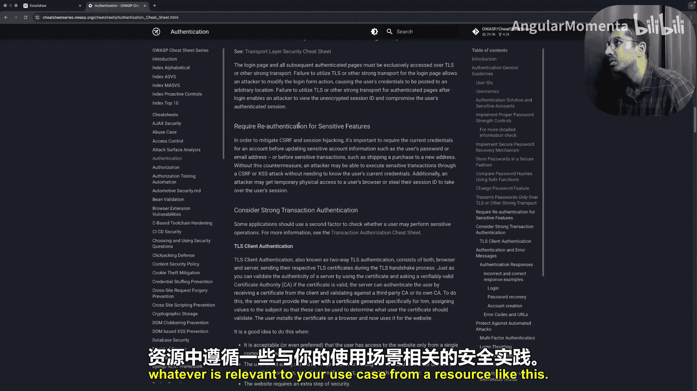
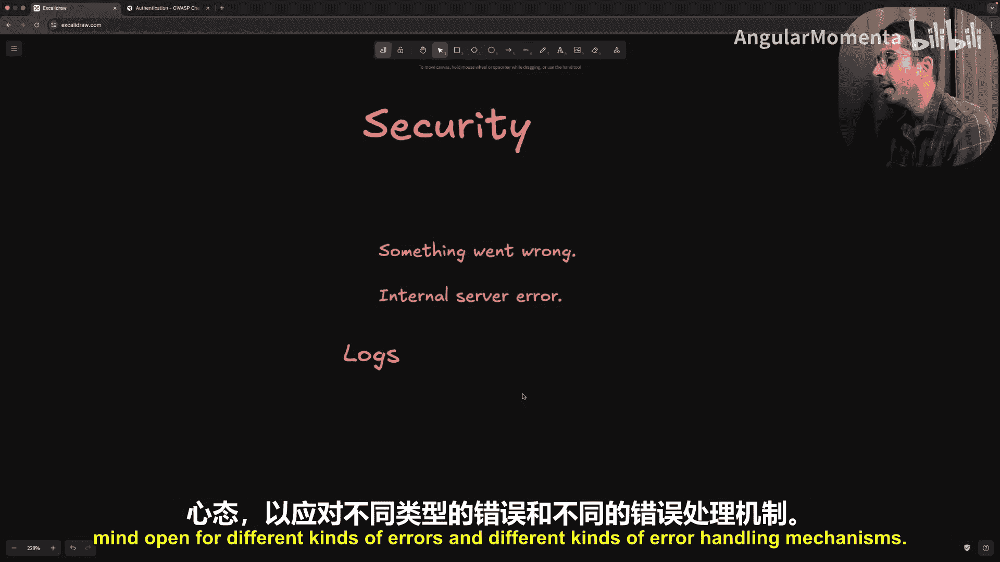

# 016：错误处理与构建容错系统 🛡️

在本节课中，我们将学习后端开发中至关重要的一个方面：错误处理与构建容错系统。错误不是需要解决的问题，而是构建应用程序的正常组成部分。每个开发者都需要理解错误必然会发生，关键在于做好准备去检测、修复它们，并构建能够优雅应对的系统。

## 概述

后端系统运行在一个充满不确定性的环境中。数据库查询有时会失败，外部API可能超时，用户可能发送错误数据，业务逻辑也会遇到意外的边界情况。因此，问题不在于错误是否会发生，而在于当错误发生时你将如何处理。本节不讨论具体工具或框架，而是专注于构建容错系统所需的心态和核心策略。

## 错误类型

作为后端工程师，在日常工作中可能会遇到多种类型的错误。理解这些类型是有效处理它们的第一步。

### 逻辑错误

逻辑错误是最常见且最危险的一类。它们不会直接导致应用崩溃，但会使应用执行错误的操作。代码本身运行正常，但结果不正确或出乎意料。

例如，在一个电商SaaS应用中，如果折扣逻辑错误导致对同一订单应用了两次折扣，甚至产生负的运费，应用并不会崩溃，但平台却在每一笔订单上持续亏损。这类错误可能潜伏数周甚至数月而不被发现，造成持续损失。

逻辑错误通常发生在以下场景：
*   **误解需求**：在与客户或产品经理沟通时，可能记录并实现了非预期的需求。
*   **算法实现错误**：在复杂的业务逻辑（如基于用户行为的动态折扣算法）中，一个微小的计算错误可能导致重大损失。
*   **未考虑边界情况**：在支付、折扣等工作流中，未预料到特定的用户行为可能导致问题。

逻辑错误可能损坏数据，并在一段时间内导致错误的业务决策而不被察觉。

### 数据库错误

由于大多数后端应用严重依赖数据库，数据库错误可能导致整个系统瘫痪。这类错误范围很广。

以下是几种常见的数据库错误：

*   **连接错误**：当应用无法与数据库通信时发生。这可能是由于网络中断、数据库服务器过载或**连接池**耗尽所致。连接池是一种优化手段，它维护一组到数据库服务器的开放TCP连接，以避免为每个新请求都进行完整的TCP握手。连接池设置不当也可能引发错误。当数据库连接失败时，应用基本无法正常运行。
*   **约束违反错误**：当尝试执行违反数据库规则的操作时发生。例如：
    *   **唯一性约束违反**：尝试创建已存在邮箱的用户。
    *   **外键约束违反**：尝试在`orders`表中插入一条记录，其`customer_id`在`customers`表中不存在。
    这类错误的根源通常在于**验证层**不够健壮。虽然像唯一性检查这类错误无法完全避免（只有数据库知道某个值是否唯一），但我们可以通过改进错误格式化，向用户返回友好的提示信息（如“该邮箱已存在，请尝试其他邮箱”）。
*   **查询错误**：当SQL语句格式错误时发生。例如，表名拼写错误（`SELECT * FROM custmers;`），或者查询过于复杂导致超时。
*   **死锁**：当多个数据库操作相互等待，形成循环依赖时发生，这种情况尤其棘手。

### 外部服务错误

现代SaaS应用通常依赖许多外部服务，如支付处理器、邮件提供商、云存储（如S3）、Redis缓存或身份验证服务（如Auth0、Clerk）。每一个外部依赖都是一个潜在的故障点，而你对其几乎没有控制权。

外部服务失败的原因包括：
*   **网络问题**：连接超时、DNS故障、网络分区等。互联网并不完美，必须为此类问题做好计划。
*   **认证错误**：外部服务因凭证错误、令牌过期或权限不足而拒绝请求。即使使用外部认证服务，如果集成不当（如在日志中暴露敏感信息），仍可能引发安全问题。
*   **速率限制**：大多数外部API都有速率限制。如果你的应用因某些原因（如用户活动激增、逻辑错误）在短时间内发送过多请求，就会收到`429 Too Many Requests`错误。应对策略包括实现**指数退避**等重试机制。
*   **服务中断**：外部服务因意外事故或计划维护而宕机。这是最不可避免的情况。应用需要优雅地处理此类错误，例如使用**后备方案**（如当Redis宕机时切换到内存缓存）。

### 输入验证错误

这类错误由用户发送不符合系统规则的数据引起。验证层是抵御不良或恶意输入的**第一道防线**，它在请求入口点进行检测并抛出错误。

常见的验证规则包括：
*   **格式验证**：检查邮箱、电话号码、日期等是否符合预期格式。
*   **范围验证**：检查数字是否在允许范围内，字符串长度是否合规，数组元素数量是否满足要求等。
*   **必填字段验证**：检查执行特定操作所必需的字段是否存在。

验证错误通常返回`400 Bad Request`状态码。与其他难以控制或检测的错误（如外部依赖错误、逻辑错误）相比，验证错误是最容易预期和处理的，因为我们明确知晓数据的规则。

### 配置错误

配置错误可能阻止应用启动，或使生产环境行为异常。它们通常在开发、预发布和生产环境之间迁移时出现。

例如，在开发环境中添加了一个新的环境变量（如`OPENAI_API_KEY`），但在部署到生产环境时忘记添加。有两种可能的情况：
1.  **最佳情况**：应用启动时验证所有必需的环境变量。如果缺失，应用启动失败。在蓝绿部署等策略下，旧版本仍在运行，服务不会中断。
2.  **最坏情况**：应用启动时不验证配置。当某个API处理器尝试使用该缺失的配置变量（如调用OpenAI服务）时，会在运行时出错，用户收到`500`错误。

因此，**最佳实践是在服务器启动前验证所有必需的配置变量**，宁愿让应用在启动时失败，也不要让它在运行时对用户出错。

## 预防与检测策略

上一节我们介绍了可能遇到的各种错误类型，本节我们来看看如何主动预防和检测它们。在我看来，**最佳的错误处理策略始于错误发生之前**。

### 主动错误检测

在错误造成实际损害之前发现它们，这是构建健壮系统的关键。健康检查是实现这一目标的基础。

*   **基础健康检查**：通常暴露一个端点（如`/health`或`/status`），返回`200 OK`状态码表示服务运行正常。但这仅能检查服务是否在运行，还不够。
*   **数据库健康检查**：测试数据库连接、查询性能和**数据完整性**。运行一个有代表性的查询，检查其响应时间是否在正常范围内，这比简单的“ping”更有意义。
*   **外部服务健康检查**：验证与关键外部服务的连接和功能。
    *   **支付处理器**：定期执行测试交易。
    *   **邮件服务**：向内部邮箱发送测试邮件。
    *   **身份验证服务**：生成并验证测试令牌。
*   **核心功能检查**：确保配置已正确加载、生产环境必需的缓存已预热、内部数据结构一致。

所有这些构成了**主动错误检测**体系，确保我们为最坏情况做好准备，并拥有预防和修复的方法。

### 监控与可观测性

监控与可观测性是一个庞大的主题，它帮助我们在错误发生时快速检测并提供足够的调试上下文。

关键原则包括：
*   **不要只跟踪错误率**：同时监控可能预示问题的**性能指标**。性能下降通常是系统即将故障的早期征兆。
*   **全面覆盖**：监控设置应覆盖应用的各个部分，包括HTTP错误、数据库错误、外部服务故障和业务逻辑错误。
*   **跟踪业务指标**：监控关键业务指标，如成功交易率、成功验证次数等。即使错误率正常，业务指标的突然下降也可能暗示存在技术问题。
*   **良好的日志实践**：实施**结构化日志**（如JSON格式），便于解析和添加元数据。使用Grafana、Loki等日志聚合工具进行可视化分析和存储。

监控与可观测性是构建容错系统的关键组成部分，后续课程将深入探讨相关工具和实践。

## 错误处理哲学与策略

了解了错误类型和检测方法后，本节我们探讨一些在处理错误和构建健壮系统时始终有益的核心理念和策略。

### 即时错误响应

当错误发生时，你的即时响应决定了它是否会演变成重大故障。策略取决于错误类型和上下文。

*   **可恢复错误**：例如发送邮件失败、数据库连接池暂时耗尽。对于此类网络错误或临时资源问题，**重试机制**和**指数退避**策略效果很好。但需注意，不要给已经压力很大的系统增加额外负担。
*   **不可恢复错误**：最佳策略是**遏制和优雅降级**。例如，切换到缓存、禁用非核心功能、提供备用方案，以限制损害范围。

### 错误恢复策略

恢复策略取决于错误性质和功能的关键性。

*   **自动恢复**：可以处理许多无需人工干预的错误。例如，自动重启失败的服务、清理损坏的缓存、切换到备份系统。这些策略需要精心设计，有时可能使问题恶化，因此需要通过试错找到适合特定服务的方法。
*   **手动恢复**：某些错误需要人工判断和决策。应为此类流程编写文档，确保团队成员知晓，并进行测试，以便在压力情况下能快速执行。

**数据恢复策略**至关重要，因为数据是应用中最宝贵的资产。这包括在关键时刻备份、从备份恢复、重放事务日志和使用专门的恢复工具。

### 传播控制

并非所有错误都应在发生时立即处理。有时需要将错误**传播**到更高层级，以获得更多上下文（类似于“调用栈”的概念）。

在大多数编程语言（如JavaScript、Python）中，我们使用`try-catch`进行异常处理。通过异常处理层次结构，我们可以捕获低级异常，用足够的上下文包装它们，然后冒泡到高级异常。这样我们就能掌握更多业务信息，从而记录适当的数据、向前端返回有意义的错误，或在必要时触发恢复策略。这种模式通常被称为**全局错误处理**。

### 错误边界

错误边界是阻止错误进一步传播的最后防线。在微服务架构中，错误边界能防止一个服务中的错误影响其他服务。为实现这一点，我们应使用独立的进程、实现**超时**机制以保护服务边界，并使用**消息队列**（如RabbitMQ）来解耦服务，实现异步通信，避免一个服务的故障导致另一个服务失败。

## 全局错误处理：最终安全网 🎯

现在，让我们深入探讨我最喜欢的错误处理机制之一：**全局错误处理**。这是一个在设置后端应用初期需要投入大量精力的模块，但它是一次性投入，长期回报巨大。

### 工作原理

在一个典型的后端架构中，请求流经路由层 -> 处理器（负责反序列化、验证） -> 服务层（协调业务逻辑） -> 仓库层（执行具体的数据库操作）。

全局错误处理的目标是：**无论错误在哪个层级（仓库层、服务层、处理器层）发生，也无论是什么类型的错误，都将其冒泡到一个全局错误处理中间件中统一处理。**

### 实战示例

假设我们有一个图书管理平台，并创建一个添加新书的API端点。

**场景一：验证错误**
*   **错误发生点**：处理器层。
*   **原因**：用户发送的书名超过500字符，违反验证规则。
*   **全局处理**：中间件识别为验证错误，返回`400 Bad Request`，并附带具体的错误信息（如“书名不能超过500字符”）。

**场景二：唯一约束违反错误**
*   **错误发生点**：仓库层。
*   **原因**：尝试插入的书名在数据库中已存在。
*   **全局处理**：中间件识别为数据库唯一约束错误，返回`400 Bad Request`，消息为“该书已存在”。

**场景三：资源不存在错误**
*   **错误发生点**：仓库层。
*   **原因**：查询特定ID的图书，但数据库返回“无此记录”。
*   **全局处理**：中间件识别为“无行返回”错误，推断请求的资源不存在，返回`404 Not Found`。

**场景四：外键约束违反错误**
*   **错误发生点**：仓库层。
*   **原因**：插入新书时，提供的`author_id`在作者表中不存在。
*   **全局处理**：中间件识别为外键约束错误，返回`404 Not Found`，消息为“指定的作者不存在”。

### 核心优势

1.  **更健壮、更安全**：将所有错误处理逻辑集中在一处，避免了在分散的代码中遗漏处理某些错误类型。如果没有全局处理，一个未在仓库层妥善处理的唯一约束错误可能最终以含糊的`500 Internal Server Error`返回给用户，而不是明确的“已存在”提示。
2.  **减少冗余**：无需在每个仓库方法、服务方法中重复编写相同的错误类型检查和格式化逻辑，代码更简洁，bug更少。

全局错误处理中间件就像是应用的**最终安全网**，它定义了平台在整个生命周期中可能面对的所有错误类型及其处理规则。

## 安全考量 🔒

在错误处理中，安全是至关重要的方面。最后，我们讨论两个与安全密切相关的要点。

### 谨慎暴露错误信息

必须严格控制暴露给用户或消费者的错误信息细节，避免泄露可能危及平台或用户安全的内容。

*   **避免泄露内部细节**：不要将数据库错误信息（如表名、约束名、索引详情）直接返回给用户。攻击者可能利用这些信息发起更高级的攻击（如SQL注入）。在默认错误处理逻辑中（例如最终捕获到未知错误时），应返回通用消息，如“内部服务器错误”，而不是原始错误信息。
*   **遵循安全最佳实践**：以登录端点为例。错误的做法是分别返回“用户不存在”和“密码错误”。这会让攻击者分两步破解账户：先通过错误信息枚举出存在的用户邮箱，再针对该邮箱暴力破解密码。**正确的做法是始终返回统一的模糊信息**，如“邮箱或密码无效”。

### 安全日志记录

即使在内部日志中，也要避免记录敏感信息。

*   **不要记录敏感数据**：切勿在日志中记录用户的密码、完整信用卡号、API密钥等。在发生数据泄露时，这些日志可能成为攻击者的宝库。
*   **使用关联标识**：在记录错误时，使用用户ID而非邮箱等直接标识符，并记录足够的关联ID以便追踪上下文。

## 总结

在本节课中，我们一起学习了后端错误处理与构建容错系统的核心思想。我们首先认识到错误是系统运行的常态，关键在于做好准备。接着，我们详细探讨了各种错误类型：逻辑错误、数据库错误、外部服务错误、输入验证错误和配置错误，并理解了它们的特点和成因。

然后，我们转向预防与检测，强调了**主动错误检测**的重要性，包括健康检查、监控与可观测性。在错误处理策略部分，我们讨论了根据错误类型（可恢复/不可恢复）采取不同的即时响应，以及错误恢复、传播控制和设立错误边界等哲学。

我们深入分析了**全局错误处理中间件**这一强大模式，它作为最终安全网，能集中、统一地处理所有错误，使系统更健壮并减少代码冗余。最后，我们着重讨论了错误处理中的**安全考量**，包括谨慎暴露错误信息和安全记录日志，以保护平台和用户免受侵害。

构建容错系统不仅关乎技术实现，更是一种贯穿始终的**思维方式**。通过预见失败、主动检测、优雅处理和持续学习，我们可以创造出即使在逆境中也能保持韧性的可靠后端服务。