# 018：日志记录、监控与可观测性 📊

在本节课中，我们将要学习后端开发中至关重要的实践领域：日志记录、监控与可观测性。这些实践是确保现代分布式系统健康、稳定运行的关键。我们将探讨它们各自的概念、作用以及如何协同工作，帮助你构建一个易于理解和调试的生产级系统。

## 概述

日志记录、监控与可观测性是一个宏大的主题。其中每一个部分——无论是日志记录、监控还是可观测性——都值得拥有独立的深入讨论。但这也属于一个没有绝对固定规则的领域，更像是一个实践光谱。大多数公司和个人开发者都在一个光谱范围内实施这些实践。我们无法断言某个产品或公司完全遵循了所有最佳实践，因为并不存在这样的绝对标准。因此，在接触行业中各种不同的术语、实践和工具时，无需感到畏惧。

## 为什么需要这些实践？

在现代互联网环境中，我们的后端应用通常运行在分布式环境中，部署在不同的服务器和区域，服务于全球用户。在这种场景下，我们需要实践、工具和方法论来追踪所有服务和基础设施中发生的情况。

“追踪”意味着关注几个核心参数。我们可以将其归结为一些重要的方面。

## 核心概念解析

上一节我们介绍了为什么需要这些实践，本节中我们来看看它们具体是什么。

### 日志记录

日志记录基本上是**记录**。它记录应用程序中发生的所有事件。这些实践同样适用于前端应用，但我们的讨论将限于后端。

日志记录是指记录后端应用中所有重要事件、可疑事件、安全相关事件等。我们会为每个事件附加一些**元数据**，例如触发请求的用户ID、请求延迟、调用的具体方法或函数等。这些元数据在理解系统行为时至关重要。因此，整个方法论的第一部分就是日志记录，即记录请求生命周期和应用执行过程中的所有事件。

### 监控

监控的含义正如其名：我们希望通过某种方式**持续追踪**系统的状态。这包括后端应用及其各组件的状态，例如服务器的CPU、内存使用率、每秒处理的请求数、数据库连接池的状态等。

监控意味着拥有关于系统的**实时数据**（这里的“实时”通常指有几秒到几分钟的延迟，以避免压垮监控系统）。它关注的是系统当前的健康与性能状态。

### 可观测性

可观测性本身包含许多其他实践。理论上，可观测性有三大支柱。一个后端系统只有在具备这三个组件时，才能被称为是可观测的。

以下是这三个支柱：
1.  **日志**：我们已经了解，是记录重要事件的记录。
2.  **指标**：这与监控密切相关，我们稍后会详细讨论。
3.  **追踪**：你可以将追踪想象成**事务**。它意味着我们能够追踪一个请求从一个系统（如前端、负载均衡器或后端应用）发起后，所经过的所有组件（如处理器层、服务层、验证层、仓库层、数据库层）。追踪记录了请求的完整路径。

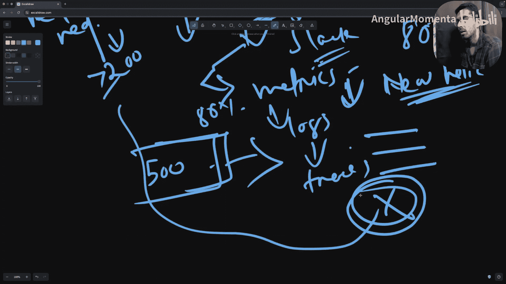

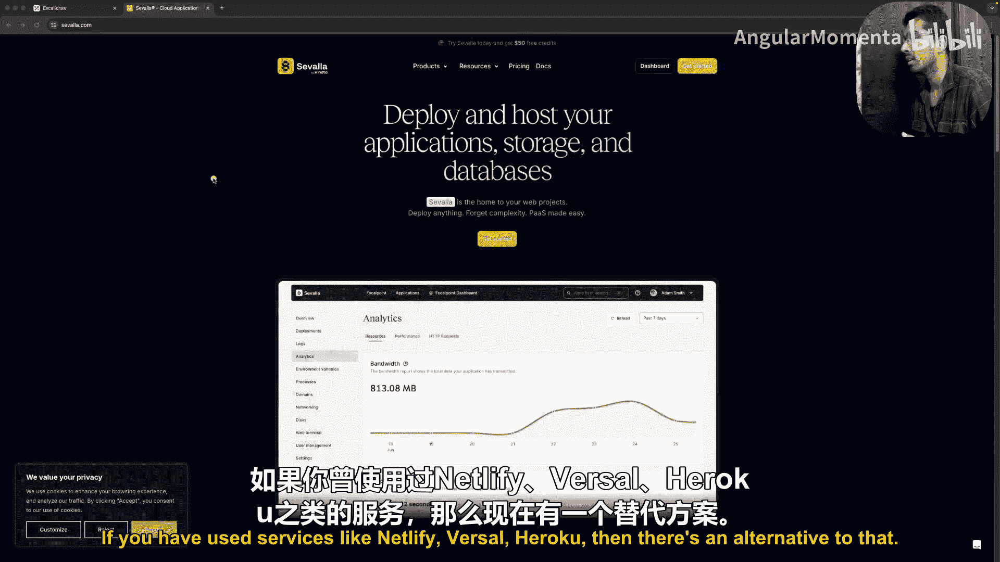

可观测性是一个相对现代的概念。传统的错误预防和捕获主要依赖监控，但监控只能告诉你“有问题”。而可观测性不仅能告知问题，还能借助日志、指标和追踪，精确地指出“问题出在哪里”。

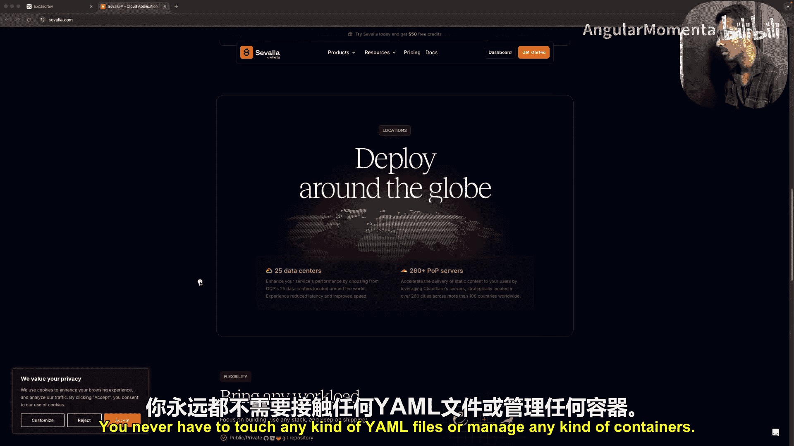

## 三者如何协同工作？

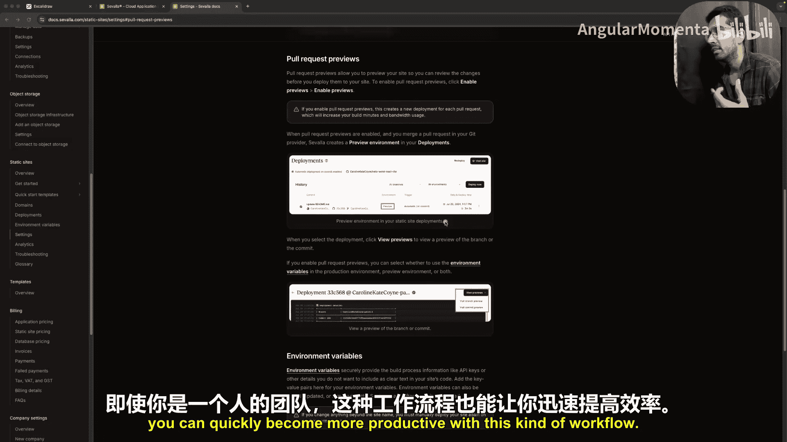

上一节我们分解了各个概念，本节中我们来看看它们如何协同工作，形成一个强大的调试工作流。

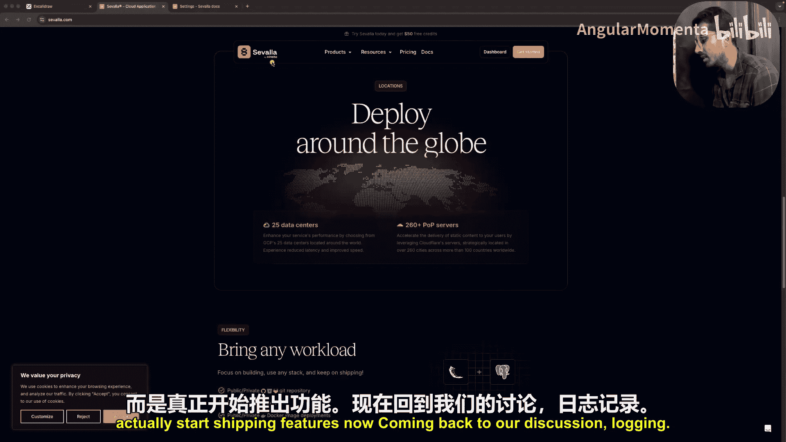

它们协同工作，因为各自产生一个在调试和理解系统时有用的具体参数：
*   **日志**告诉我们**发生了什么**。
*   **监控（指标）** 告诉我们关于系统的**模式和趋势**。
*   **可观测性（追踪）** 揭示了**不同组件之间的交互**。

假设你已经在生产系统中工作，并实施了恰当的日志、监控和可观测性，工作流通常如下：

1.  **告警触发**：我们设置了一些告警参数（例如，错误率超过80%）。当条件满足时，我们会在Slack等工具中收到消息：“你的API服务出现问题，请检查。”
2.  **查看指标**：我们转向指标仪表板。指标是我们可以追踪的关于系统的各种实时或历史参数。例如：
    *   已处理的请求数
    *   失败的请求数（例如，状态码大于200的请求）
    *   业务指标（如创建的待办事项数量）
3.  **深入日志**：从指标中，我们可以看到错误率确实超过了80%。系统通常会显示与这些指标相关的**日志**，即所有失败的日志条目。
4.  **分析追踪**：点击某条具体的错误日志（例如，一条500错误日志），系统会展示与该日志关联的**追踪**信息。它会显示这个请求从哪个函数开始，经过了哪些函数，最终在哪个具体点失败。

通过这个完整的工作流，你可以精确地定位问题所在并立即进行调试。这就是在后端系统中实施完整的日志、监控和可观测性实践所带来的核心好处。

## 深入核心概念

接下来，我们将更详细地探讨日志记录、监控和可观测性中的不同概念。但在开始之前，我们先简要了解一下本视频的赞助商。

（*注：此处省略了关于赞助商Sealla平台的详细介绍，因其为推广内容，与核心教程无关。*）

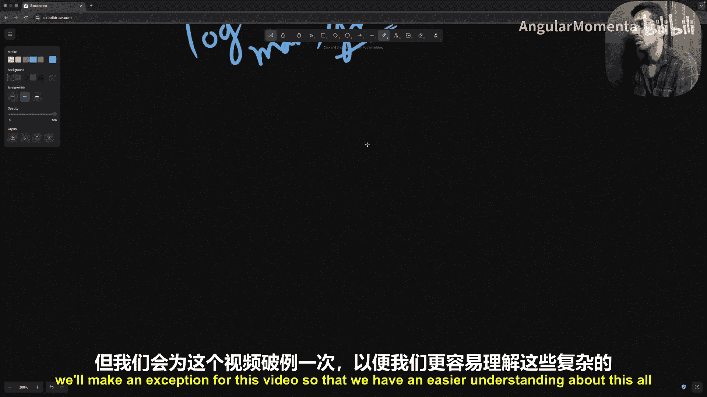

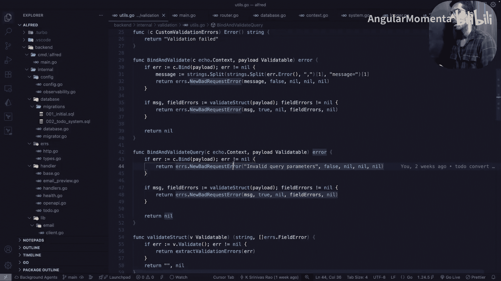

现在，让我们回到关于日志记录的讨论。

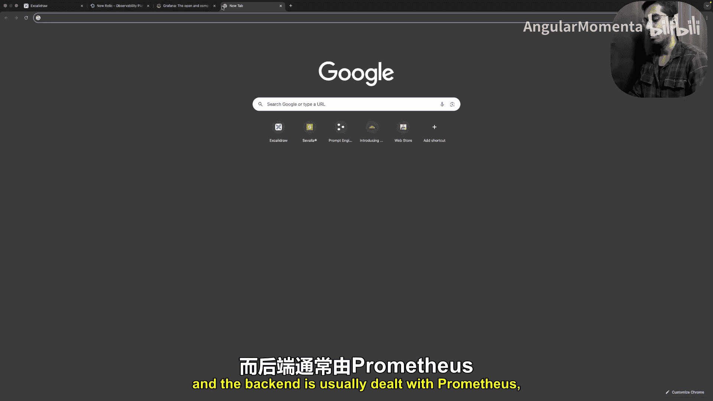

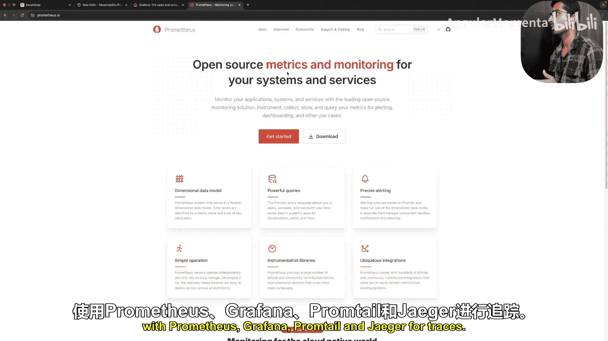

### 日志记录详解

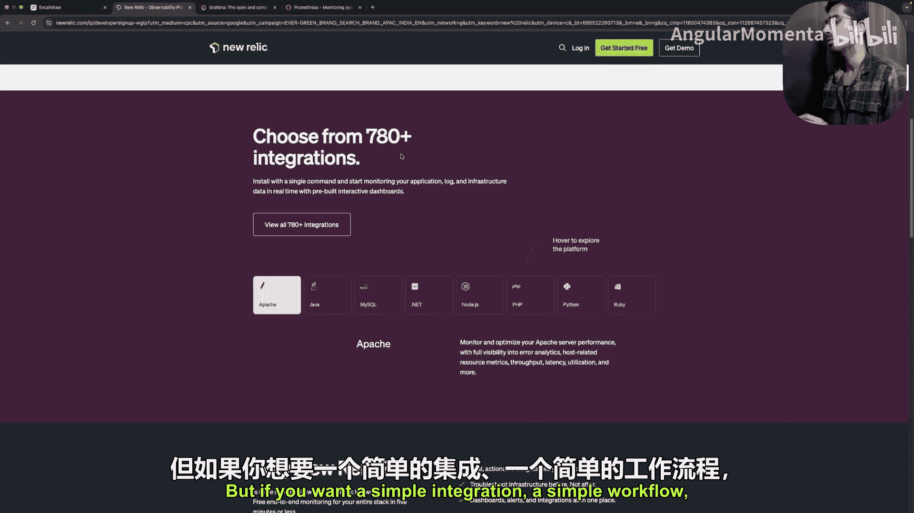

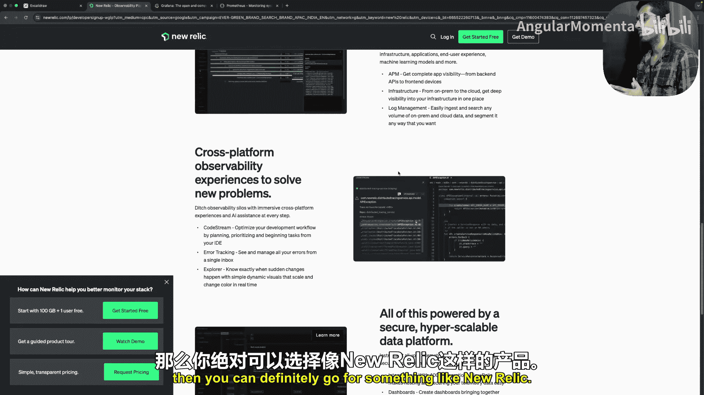

首先，在讨论日志记录时，需要记住以下几点。这仍然是一次非正式的讨论，我们将保持其实用性。

#### 日志级别

在生产系统中，你会经常看到**日志级别**。当我们记录一个特定事件时，通常会为其分配一个级别。最常见的级别包括：
*   **DEBUG**：用于开发环境，记录尽可能多的系统行为细节，便于调试和故障排除。在生产环境中通常禁用。
*   **INFO**：记录常规应用操作和业务事件（例如，“创建了一个待办事项”），用于记录成功操作和一般信息。
*   **WARNING**：记录介于INFO和ERROR之间的事件。这不是成功操作，但也不够关键到被视为错误。例如，用户输入错误密码导致认证失败。
*   **ERROR**：记录所有类型的错误，如验证错误、数据库查询失败等。这是我们进行日志记录的主要原因之一。
*   **FATAL**：非常严重的问题。记录FATAL级别日志通常意味着应用程序将停止运行并可能重启。

#### 结构化与非结构化日志

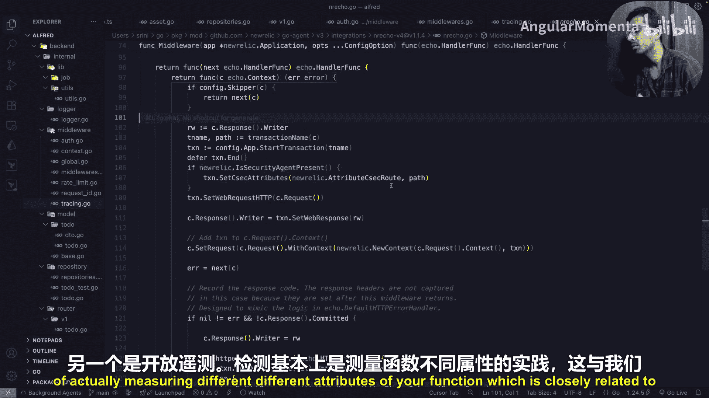

我们通常以两种方式记录日志：
*   **非结构化/控制台日志**：在开发环境中使用。我们将日志以可读的、带颜色的纯文本形式输出到控制台，便于人工阅读和发现问题。
*   **结构化日志**：在生产环境中使用，最流行的格式是**JSON**。我们以JSON格式打印错误，包含状态、消息等所有参数。虽然对人类不友好，但便于日志管理工具（如ELK Stack、Loki、Promtail）进行解析和提取有价值的信息（如用户ID、请求ID）。

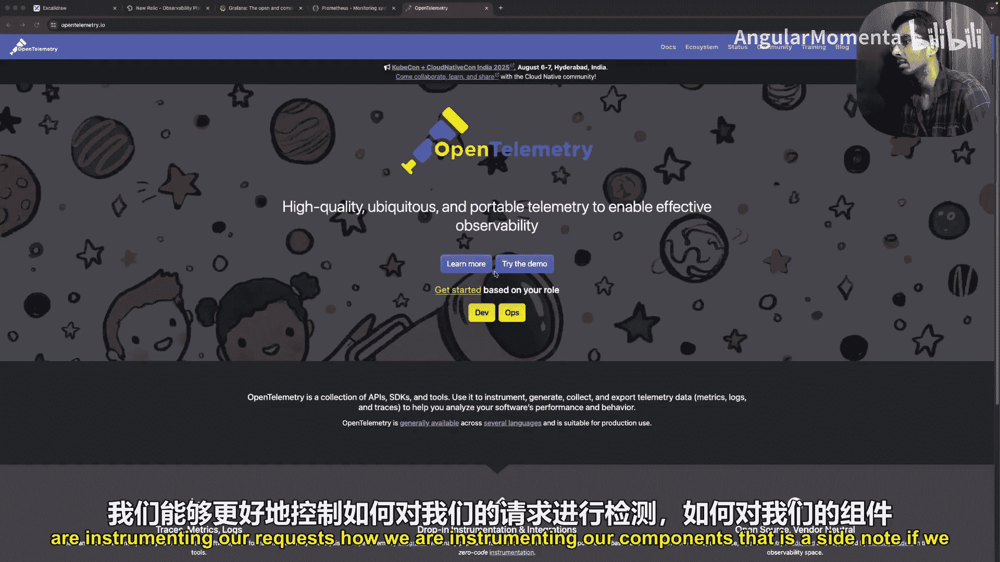

### 代码实践演示

由于我们主要讨论实践，我认为展示它们实际如何工作比单纯的理论讲解更有帮助。我们将通过一个Go语言编写的待办事项应用来演示。

（*注：此处省略了具体的代码截图和逐行解释，因为重点是理解工作流而非代码本身。以下总结关键点：*）

在这个应用中，我们使用了New Relic作为一站式可观测性解决方案（开源方案如Grafana + Prometheus + Jaeger也很流行）。

1.  **日志配置**：代码中根据环境（开发/生产）动态设置日志级别（DEBUG/INFO）和格式（控制台/JSON）。
2.  **监控与追踪集成**：通过一个中间件（New Relic middleware）对每个请求进行**插桩**。插桩是可观测性的关键实践，意味着测量函数的各种属性。
3.  **工作流示例**：在`创建待办事项`的服务函数中：
    *   从上下文中获取当前请求的**事务**（属于一个追踪）。
    *   为这个事务添加业务属性（如用户ID、待办标题）。
    *   在关键节点记录**日志**（如“开始创建待办”、“数据库操作成功/失败”），并关联到当前事务。
    *   如果发生错误，将错误信息和操作类型添加到事务中。
4.  **仪表板查看**：在New Relic仪表板中，我们可以：
    *   查看**指标**：如错误率、吞吐量、平均事务时间。
    *   查看**日志**：与特定错误相关的详细日志条目。
    *   查看**追踪**：点击日志可以查看完整的请求追踪路径，了解请求经过了哪些组件。

这个演示展示了日志、指标和追踪如何在一个真实的应用中集成并协同工作，为开发者提供强大的调试能力。

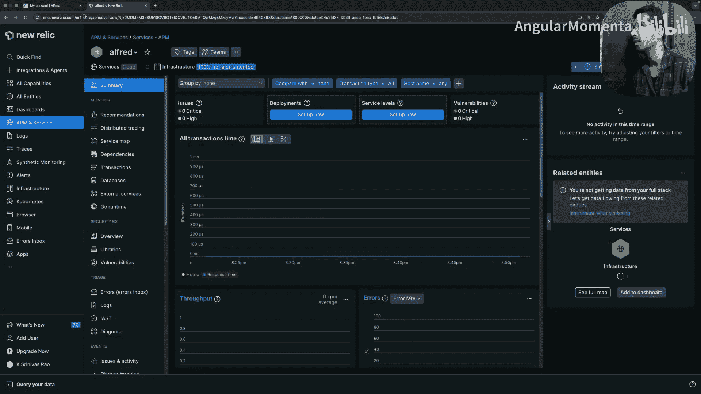

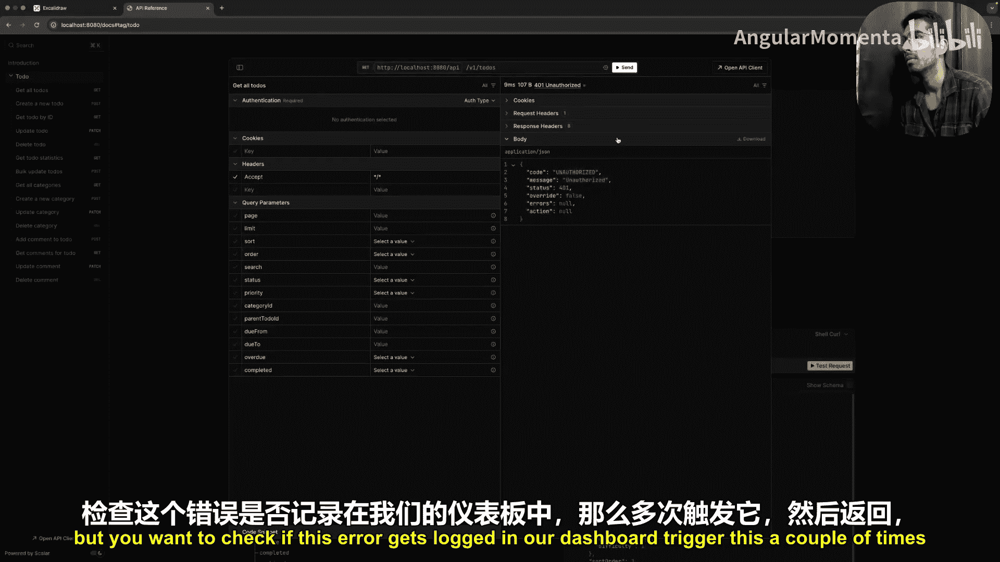

## 总结

本节课中，我们一起学习了后端开发中日志记录、监控与可观测性的核心实践。

我们了解到：
*   **日志记录**是系统事件的日记，用于记录**发生了什么**。
*   **监控**关注系统的实时状态和健康度，通过**指标**量化系统行为。
*   **可观测性**是一个更高级的目标，它通过**日志、指标和追踪**三大支柱，使我们能够从外部输出推断系统内部状态，精确**定位问题根源**。

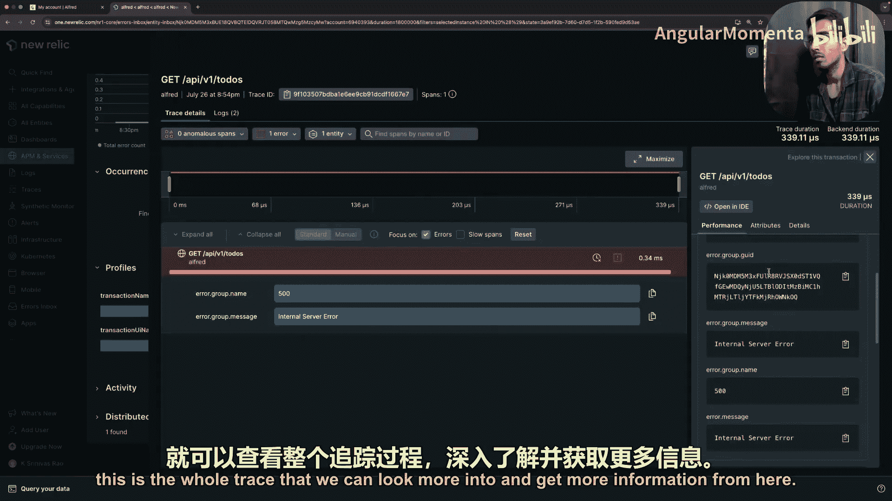

这些实践共同构成了一个强大的工作流：从告警触发，到查看指标趋势，再到深入分析具体日志和请求追踪，最终快速定位并解决问题。

重要的是，这些实践是在一个光谱上实施的，没有绝对的“完成”状态。你可以根据团队规模和资源，选择开源工具链（如Grafana, Prometheus, Loki, Jaeger）或商业解决方案（如New Relic, Datadog）。无论选择哪种工具，都需要开发者在代码层面进行适当的插桩和日志记录，并与基础设施团队协作配置相应的收集、存储和展示系统。

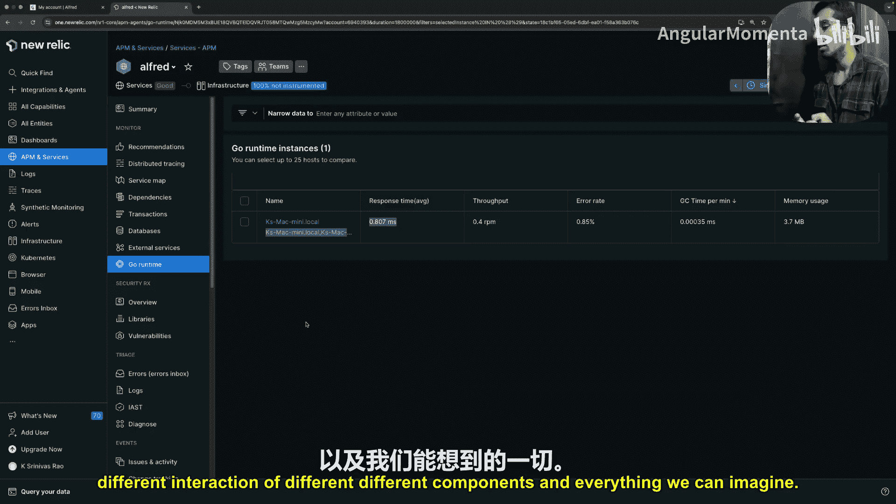

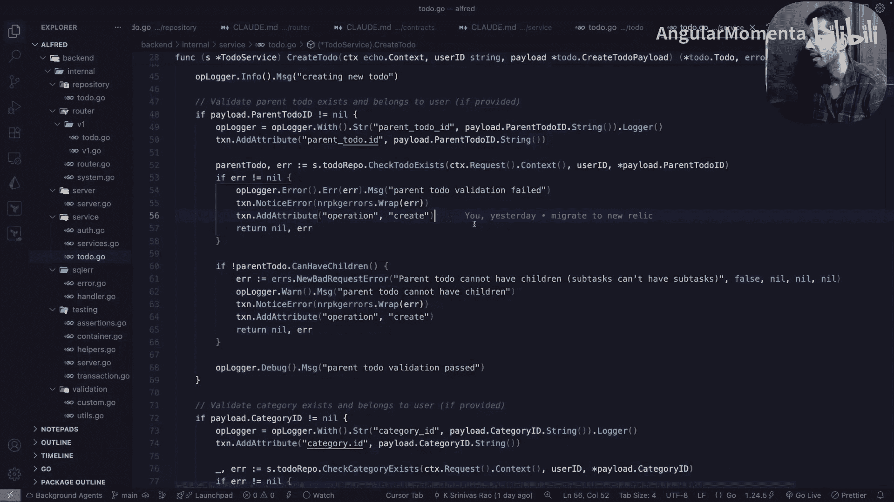

掌握这些实践，是构建和维护可靠、可维护的生产级后端系统的关键一步。