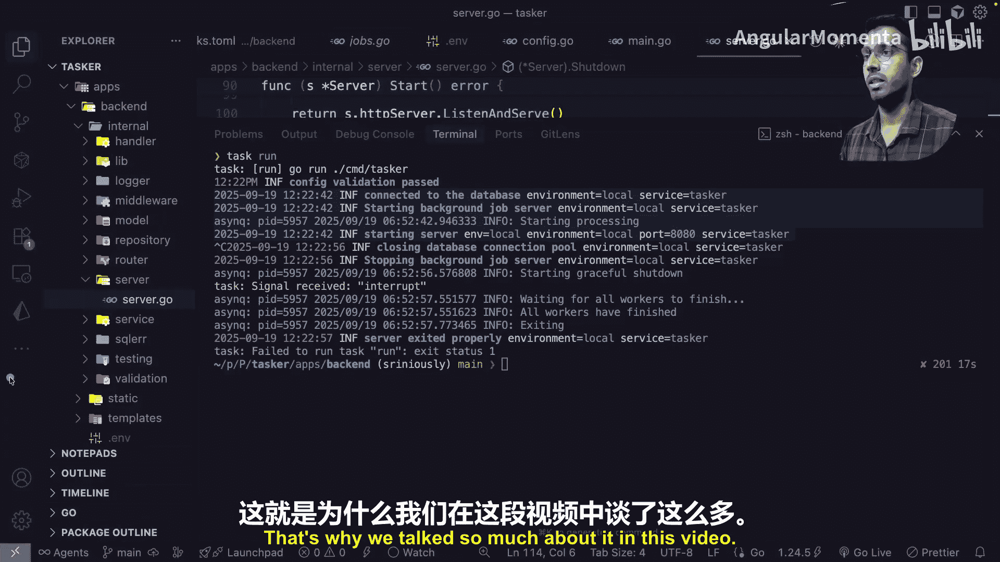

# 019：优雅关机 🛑

在本节课中，我们将学习一个至关重要的后端概念：优雅关机。我们将探讨为什么服务器不能突然停止，以及如何通过一系列步骤确保在重启或部署时，正在处理的请求和数据不会丢失或损坏。

---

想象一个非常现实的场景。你正在处理一笔关键支付交易。突然，你的服务器需要为一次部署而重启。有人向生产环境推送了代码，你的服务器需要部署自身。当然，我们有零停机部署等技术，确保新服务器（运行新代码的服务器）启动并准备好接收流量之前，现有服务器不会下线。这些机制是存在的，但在某个时刻，当新服务器准备上线、准备接收流量时，旧服务器必须关闭，必须停止接收流量，流量将切换到新服务器。我们讨论的正是这个关键时刻。假设你正处于一笔电子商务交易中，或者正在亚马逊或Flipkart上购买商品，此时亚马逊或Flipkart的服务器因某种部署需要重启。问题是，那笔支付交易究竟会怎样？它会在数字世界中丢失吗？客户会因为某种竞态条件而被重复扣费吗？作为后端工程师，你必须考虑所有这些场景。

这不是一个新问题。自服务器和后台出现以来，这个问题就一直存在。当然，我们已经有了解决方案，这个方案被称为**优雅关机**。正如其名，我们希望优雅地停止服务器，而不是突然停止。这就是整个想法。当然，还有一些相关的概念需要理解，以便你清楚地了解我们为什么要这样做。

---

## 进程生命周期管理

我们讨论这个是因为你的后端是一个应用程序，它将在某种服务器、某种计算机中作为一个进程运行。每个应用程序都在服务器中、在一个进程内运行。这是一个重要的事情。它在进程内运行。如果你熟悉操作系统概念，这对你来说就有意义。否则也没关系，你可以直接学习这个术语，它叫做**进程**。你运行的任何东西，在操作系统中运行的每个东西，都作为一个进程运行。就像所有生物一样，每个进程都有生命周期：它何时开始、如何开始、何时结束以及如何结束。所以，从某种意义上说，进程启动时它诞生，进程执行时它存活，进程终止时它死亡。这整个过程被称为进程的生命周期。

为了实现或理解优雅关机，我们必须理解这个进程生命周期，因为它与优雅关机的实现方式密切相关。这是我们的操作系统，我们的应用程序在其中运行。当你的操作系统决定是时候让你的应用程序停止运行时，它不会直接拔掉电源。它不会直接杀死进程。它遵循一个既定的协议和通信方式，来告诉进程是时候停止了，我们将遵循这些步骤，然后停止。你可以把它想象成你的操作系统和你的应用程序（在你的操作系统中作为进程运行）之间的一次对话。简化来说，你的操作系统在对话中发送一条消息，比如：“嘿，是时候停止了。”你的应用程序返回一条消息：“好的，给我几分钟或几秒钟（现实地说），然后我会停止，或者你可以停止我。”当然，这种对话不是通过文本进行的。我们这里讨论的是程序。

所以它们不理解文本。你的应用程序和操作系统之间的整个通信，是通过一个叫做**信号**的概念进行的。信号是Unix操作系统中的一个重要概念。当我说Unix操作系统时，我们指的是所有Linux操作系统，无论你熟悉的是Arch Linux、Ubuntu等，也包括macOS（macOS也源自Unix内核）。大多数情况下，当我们谈论服务器时，我们指的是Linux，因为99%的情况下，当我们在某个服务器、某个云提供商上部署应用程序时，它通常选择Linux操作系统来部署你的应用程序。除了像Windows服务器这样的特殊用例，你几乎看不到Windows。大多数情况下，我们使用基于Linux的操作系统来部署服务器。

Unix操作系统有这个叫做**信号**的概念，用于**进程间通信**。如果你是计算机专业的学生，你会知道这个术语。简单来说，这是一种技术，两个进程可以通过某种既定协议（你无需担心）相互通信。它的工作方式是：你的应用程序在这里运行，它在一个进程内运行。这是一个进程。你的应用程序在一个进程内运行，它注册了一些**处理器**。处理器是什么意思？处理器基本上可以想象成某种代码，它在后台持续运行，等待来自应用程序的某种通信、某种信号。这些用于两个进程间通信的操作系统概念被称为信号。你的应用程序注册/创建某种处理器，当这些信号到来时检测到它们，然后执行某些操作。我们将讨论它具体做什么。这些处理器基本上是在告诉你的操作系统：“当你想让我停止时，请发送这个特定的消息给我。”当然，你不能只说“停止”，那没用。那是文本，只是人类可读的。所以它必须是某种消息。我们将讨论它是哪种消息。但你的应用程序通过其处理器说：“无论何时你想让我停止，你必须发送我这个特定消息，我会适当地处理它。我会使用预定义的协议、预定义的步骤来停止自己。”

---

## 信号类型

让我们谈谈这些信号。你指的是什么？有两种主要类型的信号。我们将讨论第一种是`SIGTERM`，第二种是`SIGINT`。这部分，这个“SIG”基本上意味着信号。这些是命令，你可以说一个是用于终止，一个是用于中断。我们很快会讨论它们之间的区别。

首先谈谈`SIGTERM`。正如我所说，`SIG`的第一部分显然意味着信号，第二部分意味着终止。`SIGTERM`信号意味着终止，它是你的操作系统请求你的应用程序关闭的一种礼貌方式。它不是一种极端的方式，只是一种轻微的推动。想象你站着，有人从后面过来，轻轻拍拍你的肩膀说：“嘿。”你可以把`SIGTERM`信号想象成类似的东西。这是一个非常温和的推动，它意味着每当你的操作系统向你的应用程序发送`SIGTERM`信号时，意思是：“嘿，打扰一下，你能完成并离开吗？”这是一个非常温和的请求。

因此，你的应用程序、你的后端有机会完成它当前正在做的任何事情。它不必立即离开，它有一个时间窗口（我们将讨论是什么样的窗口），有几秒钟的时间来完成它当前正在做的事情。它可能在做什么？既然我们谈论的是后端，一个HTTP后端，它可能正在处理一些请求，这是你的后端主要做的事情。你的客户端、你的前端，无论你的客户端是某种应用、某种Web应用、某种浏览器扩展，无论是什么，它都会发送HTTP请求到你的后端，你的后端处理这些请求并返回某种响应。在任意时间点，你的后端可能正在处理，比如说10或12个请求。如果你的应用程序足够大，假设它在某个时间点同时处理大约50-60个请求。所以当它收到信号时，是时候完成处理这些请求了。让我们写下来它做什么：首先，**完成现有请求**，这是第一件事；第二，**清理资源**，我们将讨论清理对你的后端实际意味着什么；第三，**退出**。在我们讨论完`SIGTERM`和`SIGINT`信号后，我们将深入探讨第一点和第二点。但现在，让我们保持高度概括。

我们已经理解，`SIGTERM`是你的操作系统向你的应用程序、你的后端发出的一个非常温和的请求，要求它完成正在做的事情、清理资源并优雅地离开。部署系统或进程管理器或编排平台（如Kubernetes等）基本上都使用这种信号。基本上，任何你建立的用于管理进程的系统，可以是Kubernetes，或者像systemd或PM2（如果你熟悉PM2进程管理器）这样的东西。这些系统、这些工具使用这个信号，即`SIGTERM`信号，来适当地让你的应用程序完成正在做的事情、清理并优雅地离开。

我忘了另一个重要的信号，即`SIGINT`。我们有一种信号，正如我所说，第一部分是`SIG`，这个`INT`代表中断。这什么时候发生？如果你是一名开发者，你可能已经在使用这个了，它最著名的用例是`Ctrl + C`。如果你使用过任何命令行应用程序、任何基于终端的应用程序，那么你可能用过：某种进程正在运行、某种任务正在运行，如果你想立即关闭它，你可以在键盘上按`Ctrl + C`，那个进程会立即停止。例如，这里我在本地运行一个后端进程（当然，这是一个基于Go的后端），它当前正在运行，准备接受请求，并为任何发送请求的客户端提供服务。现在如果我想关闭它，我该怎么做？我只需在键盘上按`Ctrl + C`，你可以看到，当然，我们已经为这个应用程序实现了优雅关机，这就是为什么我们记录应用程序中发生的一切。但现在，让我们关注这部分，它说收到了一个信号，并且信号类型是`SIGINT`，即中断信号。

正如我们所见，`SIGINT`需要用户（开发者）按下某个键（在这种情况下是`Ctrl + C`）。它主要用于开发环境，因为开发者大多使用它。当进程间通信发生时，它们通常不使用它，因为基于`SIGINT`的信号需要某种按键（`Ctrl + C`）。所以它也被称为**用户发起的关机**。在几乎所有情况下，你都想以处理`SIGTERM`信号相同的方式来处理`SIGINT`信号。如果你想一想，这是有道理的。无论你的后端是在本地开发环境中运行，你想用`Ctrl + C`停止它，还是它在云提供商（比如AWS EC2实例）中运行，并且你使用了一个叫做PM2的进程管理器，并将你的后端部署在EC2实例中。当需要停止你的应用程序时，我们将以某种编程方式或手动使用PM2，PM2将向你的后端发送一个信号，这个信号将是`SIGTERM`信号。正如我所说，`SIGINT`信号将由开发者使用，因为它需要按键。`SIGTERM`信号将由程序使用。在这两种情况下，我们都希望以相同的方式处理我们的关机过程。是人类发起还是程序发起并不重要，重要的是我们想要关机。所以我们想要以干净、优雅的方式关机。

现在让我们谈谈最后一点，让我们用红色写下来，因为它是**终止信号**，即`SIGKILL`。正如我所说，第一部分意味着信号，第二部分是实际的终止命令。它听起来就是这样：我们想立即杀死应用程序。关于这个信号的有趣之处在于，它**无法被捕获**，也**无法被忽略**。这意味着在应用程序中，我们无法注册某种处理器，这些处理器能够执行某种任务、进行某种清理等。当它们收到`SIGKILL`信号时，这不会发生，因为这种特定类型的信号无法被我们的应用程序检测到。我们的应用程序没有被赋予那种权限或能力。同时它也无法被忽略，这意味着你不能说“既然我无法检测到它，我就忽略它”，这基本上意味着我们不必真的停止，但这也不会发生。所以，如果你的应用程序被发送了`SIGKILL`信号，它将无法检测到它，并且必须在那个特定时刻停止。其他什么都不会发生。它只是停止。这就是为什么它被称为“杀死”。你可以把它想象成核选项。这相当于不是点击系统图标然后点击关机，而是直接走到电源插头并拔掉插头。就这样，你的电脑就停了。这正是`SIGKILL`信号的工作方式，这也是为什么优雅关机是一个重要概念。

如果你不响应、不尊重那些礼貌的信号（我所说的礼貌信号是指那些让你完成正在做的事情、让你清理并让你优雅退出的信号），那么最终你当然会收到`SIGKILL`信号，所以你将不得不停止，甚至没有机会清理自己。

---

## 优雅关机的核心步骤

现在我们对三种不同的信号（礼貌信号和`SIGKILL`）以及具体发生了什么有了一个非常概括的了解，让我们来谈谈我们简要提到过的两个重要事情。第一个是“完成现有请求”是什么意思，第二个是“清理资源”是什么意思。这是优雅关机过程中发生的两个重要步骤。

### 1. 停止处理中的请求

优雅关机的第一个重要部分是停止**处理中的请求**。处理中的请求是什么意思？你的HTTP服务器、你的后端能够同时或并发地处理多个请求。所以当需要停止你的后端、停止你的服务器时，你的后端可能已经在处理一些请求了。可能是10-12个，也可能是数百或数千个，这取决于你服务器的规模。这就是处理中请求的意思：在特定时间已经被服务器处理的请求。

为了理解这一点，你可以想象一个餐厅。假设你和朋友去了餐厅。出于某种原因，餐厅必须关门，无论是到了打烊时间（比如晚上10:30或11点）还是其他原因。但关键是餐厅必须关门。具体会发生什么？餐厅老板不能直接走过来关掉所有的灯，也不能直接把你赶出餐厅，这不是一个好主意。相反，会发生什么？餐厅老板会让接待处或门口的人停止允许新顾客进入，对吧？停止允许新的人进入餐厅，这是第一步。你不想处理必须拒绝的新顾客。这是你必须处理的第一件事。第二件事是，他们会向所有现有顾客、所有已经在餐厅用餐的人宣布，是时候关门了，他们有，比如说15分钟、20分钟，以便他们可以吃完餐点，花点时间，15-20分钟应该足够吃完他们正在吃的东西，然后请离开餐厅，当然要付账、付小费，然后离开餐厅。这正是这种情况下的处理方式。

现在想象一下我们的后端、我们的应用程序的相同情况。我们称这个过程为**连接排空**。这意味着当你的应用程序收到关机信号时（现在它可能是某个进程发送的`SIGTERM`，也可能是开发者通过`Ctrl + C`发送的`SIGINT`），它必须做的第一件事是**停止接受新连接**。正如我所说，你必须做的第一件事是停止让新顾客进入餐厅。同样，你的应用程序必须做的第一件事是停止接受来自任何客户端的新连接、新请求，这样我们才能处理现有的连接、已经被服务器处理的现有请求，并让它们尽快完成。

现在，连接排空的实现显然会因我们处理的应用程序架构而异。例如，对于HTTP服务器、我们的核心后端、HTTP后端，这将意味着它必须停止接受来自任何客户端的新HTTP请求，并允许处理中的请求、现有的请求完成。同样，如果我们谈论的是数据库应用程序（正如我们在之前的视频中讨论过的，数据库也是一个后端，它可以被想象成一个后端，只是不是我们谈论HTTP后端时的那种意义，但它仍然是一个后端，仍然是一个应用程序），对于基于数据库的应用程序，它必须完成所有现有的查询或所有现有的事务，并且必须在关闭连接之前停止接受新的事务或新查询进入执行。同样，对于基于WebSocket的连接，它必须首先通知客户端它正在关闭，然后关闭套接字，它不能突然关闭套接字。因此，根据应用程序架构（HTTP后端、数据库、WebSocket），实现优雅关机的技术步骤会有所不同，但高层次的想法是相同的：**停止接受新连接，停止接受新请求，完成现有的，然后关闭连接**。这是一个三步过程。

这里的问题是连接排空的**时机**，因为你希望给现有连接足够的时间来完成它们的工作，但你不能真的无限期等待。必须有一个限制。大多数生产系统、大多数后端系统会实现某种**超时机制**，会有某种超时，例如30秒或60秒，这取决于你，通常常见的是30秒。这将是你的系统为你等待的最长时间，之后它将直接停止。它会给你30秒来完成你正在处理的任何请求，大多数情况下，如果你不接受新请求、不接受新连接，那么30秒应该足够完成所有现有请求。但如果由于某种原因、某种阻塞操作，你无法在这个窗口内完成，那么你将被强制停止。我们有一个备用计划。我们不能让我们的系统、我们的后端处理所有请求，并让它需要多长时间就等多长时间。我们不能让这种情况发生。必须有一个限制，而超时就是这个硬性限制。你只有这么多时间来完你正在做的事情。

选择这个超时也带来了一个非常有趣的设计考虑，因为问题是：你到底应该等多久？如果太短，你就有中断实际合法操作的风险。但如果太长，你的整个关机过程会变得非常缓慢，最终会影响你的部署速度、系统响应能力。所以超时的长短取决于你的应用程序的典型请求持续时间和你的操作要求。这不是一个硬性规定，30秒或60秒，你必须了解你的系统、你处理的请求类型。如果它是传统的普通后端，那么30秒应该足够了。但如果我们谈论的是WebSocket或其他更复杂的架构，那么你必须了解你的系统，并相应地决定一个适合你和你的系统的超时。

整个连接排空还需要你的负载均衡器和服务发现系统之间的某种协调，这意味着它还必须与你的健康检查系统以及向服务发现注册和注销一起工作。这些是稍微高级一点的东西。服务发现基本上意味着，如果你部署了一组应用程序（比如你的后端、你的数据库、你的Elasticsearch实例），部署后它们如何相互连接、如何通信，这部分工作流程是你的服务发现机制的责任。

### 2. 清理资源

我们谈到的第二件事是**清理**或**资源清理**。如果你在办公桌前工作，你有一个工作区，是时候离开房子或睡觉了。在你离开办公桌之前，你会做一些清理，对吧？如果你一直在喝咖啡，你会把杯子拿出来放进水槽，或者整理一些电缆。在我们离开办公桌之前，我们都有一些小小的清理工作。同样，在我们的后端应用程序上下文中，当我们说资源时，指的是像**文件句柄**、**网络连接**、**数据库连接**、**临时文件**、**缓存**或应用程序在执行期间获取的任何其他系统资源。它必须释放这些资源。

例如，当你的应用程序运行时、当你的后端运行时，你尝试访问文件系统中的特定位置。后端程序访问文件系统的方式是，你必须向操作系统发送信号，它为你提供该位置的句柄。这是一种协议，进程（后端应用程序）可以通过它访问底层文件系统。但概括地说，你获得了一种文件系统句柄，你必须在某个时刻释放它、清理它，否则该句柄将继续运行，你将占用越来越多的内存，这基本上意味着你将不断占用随机存取存储器，最终你会耗尽内存。因此，清理文件句柄很重要。

但我们最常见的一种资源清理是清理**网络连接**。我们的操作系统是中介。假设你的应用程序或后端在这里，这是互联网。你接收所有类型的请求，但所有请求在到达你的应用程序之前都要经过你的操作系统。你的操作系统是实际的驱动程序，它从你的网卡接收所有请求并提供给你。所以显然，它将拥有你所有网络连接的所有信息。通常，操作系统会限制一个进程可以同时打开的文件句柄数量（正如已经说过的）以及网络连接数量。同样，如果你在处理完网络连接后不释放它们，最终你将耗尽内存或面临某种性能问题。

如果我们谈论数据库连接，在你的应用程序关闭或后端进程关闭之前，你的后端正在处理的数据库事务必须由你的应用程序**显式提交或回滚**。如果你不这样做，那么这些事务可能会进入不一致状态，这可能导致死锁或数据损坏等各种问题。这就是当我们说资源清理（文件句柄、数据库连接、网络连接等）时所指的事情。

需要记住的一点是，当我们在整个优雅关机工作流程中清理资源时，我们希望以**与获取资源相反的顺序**清理资源。假设这里你先建立了Redis连接，然后建立了数据库连接等等。当你释放资源时，你应该按相反的顺序进行。为什么我们需要这样做？这是为了防止出现我们未清理依赖于前一个操作的资源或操作的情况。以相反于获取顺序的方式清理资源是你在实现优雅关机时必须记住的另一件事。

---

## 代码示例

我知道我们在这个系列中通常避免看代码，但只是为了给你一些背景，你不必理解这段代码。我只是想展示一个相当实用和现实的例子，这样我们就不会对优雅关机过程只有一个非常空洞的理解。我们快速回顾一下我们刚刚讨论过的所有内容，但这次我们看看代码。

正如我所说，你要做的第一件事是我们想注册某种处理器，它将等待某种信号。这就是我们正在做的。再次说明，这是Go语言代码，你不必理解，只需跟随叙述就足够了。现在，在这一步，我们使用某种上下文（这是一个Go语言概念）注册一个处理器，但我们正在等待来自操作系统的中断信号。如果我们收到一个中断信号，我们调用这个函数，这是一个关机函数，一个优雅关机函数。我们所说的优雅关机是什么意思？让我们进入这个函数内部看看。

我们首先看到什么？我们正在关闭我们的HTTP服务器。由于这是一个后端应用程序，其核心部分是HTTP引擎。我们要做的第一件事是调用一个由我们的框架（通常是任何你用于HTTP服务器的框架或库）提供的方法。当你调用它时，它们在内部、库内部停止接受额外的连接，并清理和完成它已有的现有连接，然后这个函数完成。然后我们做什么？我们关闭数据库。同样，数据库也停止接受额外的查询、额外的事务，并完成现有的，并释放它拥有的任何句柄、任何数据库连接。正如你已经知道的，后端和数据库的连接方式是通过TCP。我们可以想象这是我们的应用程序，这是我们的后端，这是我们的数据库。后端连接到数据库的方式是通过TCP，TCP协议。所以，为了让我们的后端连接到数据库，它必须有一个TCP连接，这是一个活跃的连接，这是我们的后端连接到数据库、与数据库通信的唯一方式。当然，当我们谈论数据库连接池时，我们与数据库有许多这样的活跃连接，我们从这个连接池中使用一个特定的连接与数据库通信。当我们想要关闭数据库连接时，数据库首先必须停止使用这些连接、这些路径接受新查询，它将完成已经在处理的任何现有查询、现有事务，然后我们将开始逐个关闭所有这些路径。这正是我们所说的清理数据库资源的意思。

最后，我们还在清理我们的后台作业处理服务器，它使用Redis。所以这个函数内部也关闭了我们的Redis连接。在所有这些之后，我们已经成功优雅地关机了。

如果你想看看这个，让我们启动我们的服务器。按`Ctrl + C`，这将向我们的后端发送一个中断信号，然后它可以启动优雅关机程序。我按了`Ctrl + C`，它花了一些时间，因为没有处理中的请求。这是一个在本地完成的相当简单的操作，它能够立即关闭，但我们仍然看到它花了大约一秒钟才完全关闭。所以如果你查看日志，我们可以看到，对于启动服务器，日志是：连接到数据库，启动后台作业服务器，最后我们启动了服务器。这是我们的启动日志，直到这一点，所有这些都是启动日志。然后在这时，正如你在这里看到的`Ctrl + C`，当我们按下`Ctrl + C`时，我们做的第一件事是关闭数据库连接，停止后台作业处理服务器。所有这些日志都来自一个队列，这是我们正在使用的后台作业处理库。当它收到关机信号时，当我们调用关闭所有Redis连接的方法时，无论它内部做了什么，它也记录了一些消息，比如“开始优雅关机”、“等待所有工作完成”、“全部完成”和“退出”。最后，我们记录一条消息，说服务器已正确退出。这就是我们停止服务器的方式。

---

## 总结

本节课中，我们一起学习了**优雅关机**的核心概念。我们首先通过一个支付交易的场景，理解了为什么服务器不能突然停止。接着，我们探讨了**进程生命周期管理**和操作系统通过**信号**（`SIGTERM`， `SIGINT`， `SIGKILL`）与应用程序通信的机制。

优雅关机的核心在于两个步骤：
1.  **连接排空**：停止接受新请求，并给正在处理的请求一个有限的时间窗口（超时）来完成。
2.  **资源清理**：按与获取相反的顺序，有序地释放文件句柄、数据库连接、网络连接等系统资源。

我们了解到，实现细节（如超时设置）需要根据具体应用架构（HTTP， 数据库， WebSocket）和业务需求来调整。最后，我们通过一个简化的代码示例，看到了优雅关机在实际编程中是如何被触发的（通过信号处理器）和执行的（依次关闭HTTP服务器、数据库等组件）。

掌握优雅关机，能确保你的应用在部署、重启时提供平滑的用户体验，避免数据丢失、重复扣费等严重问题，是构建可靠后端系统不可或缺的一环。