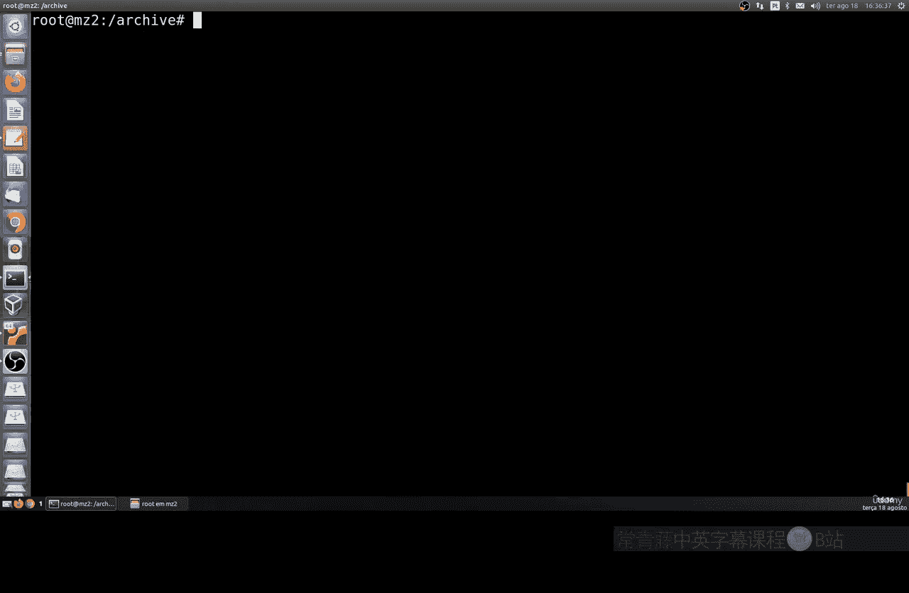
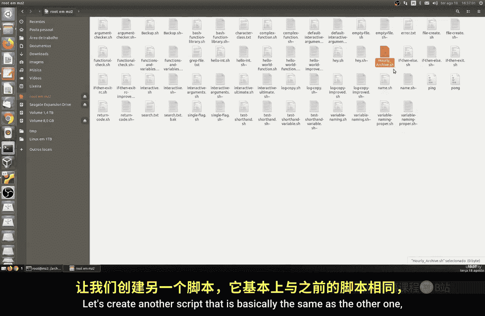
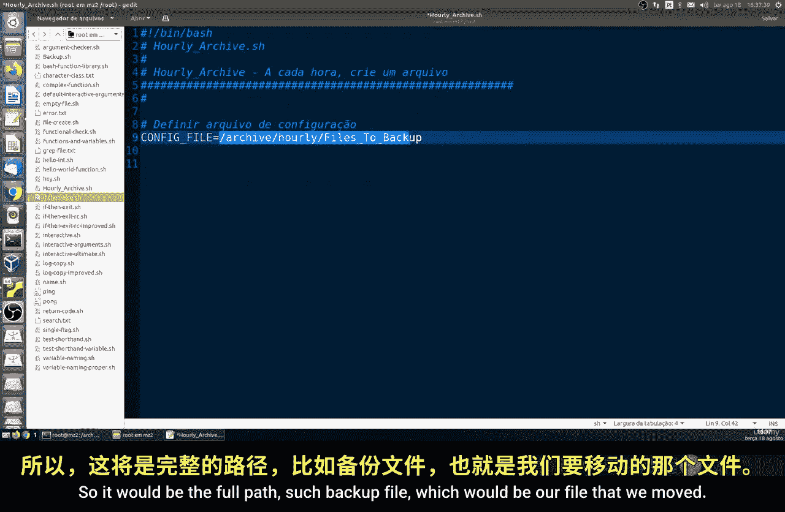
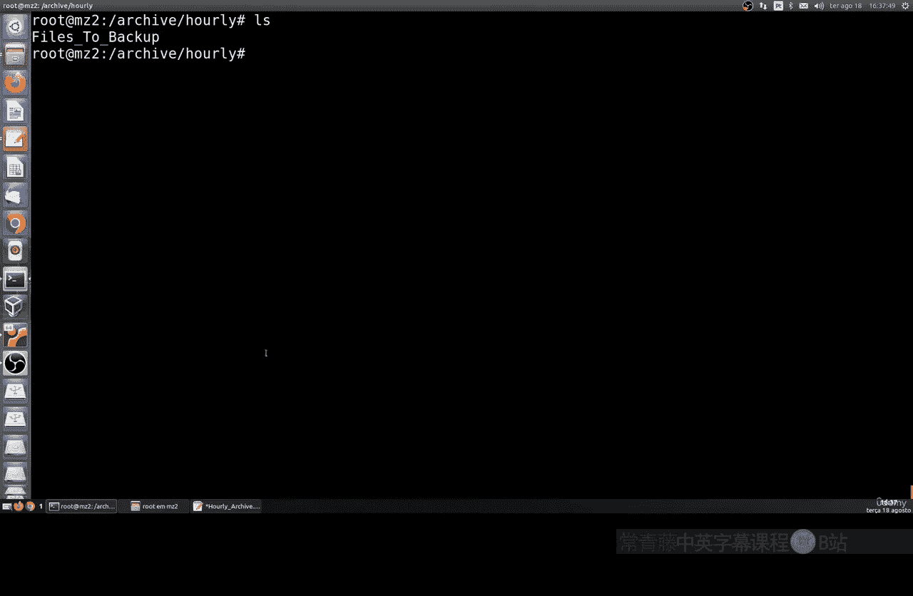
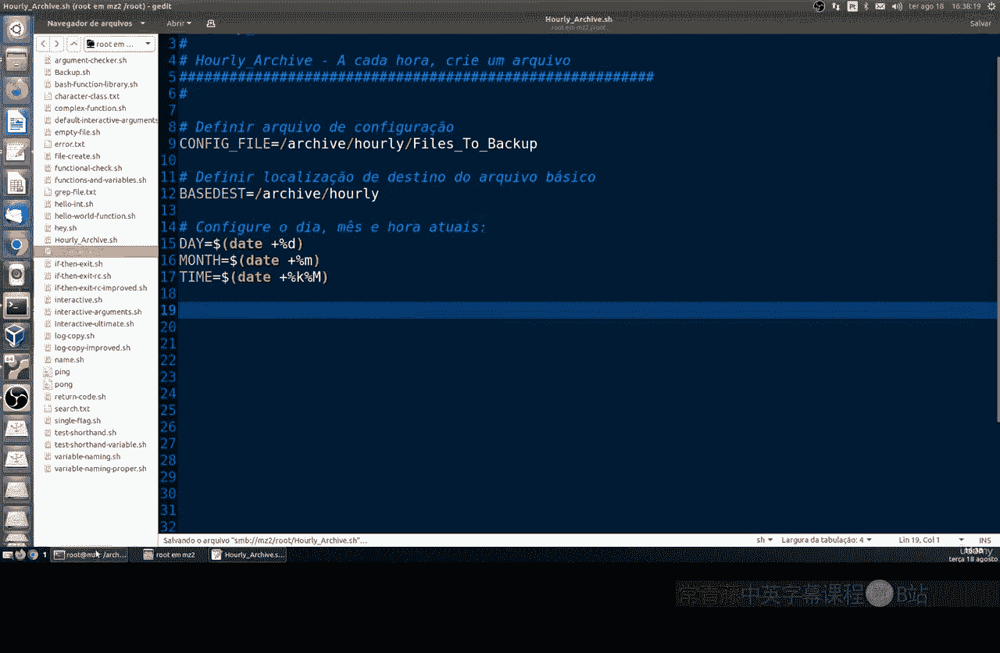
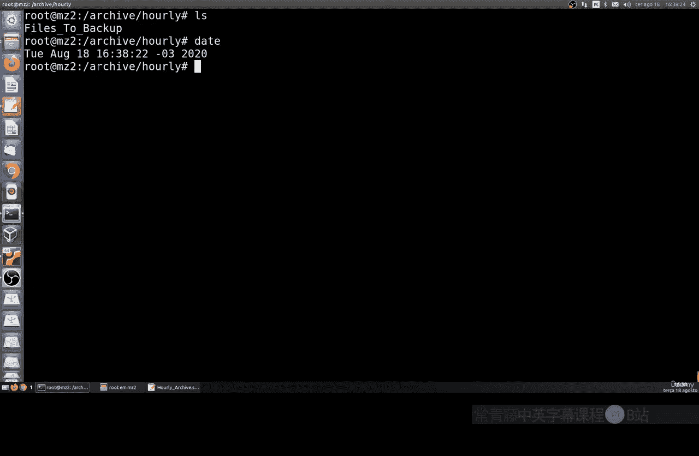
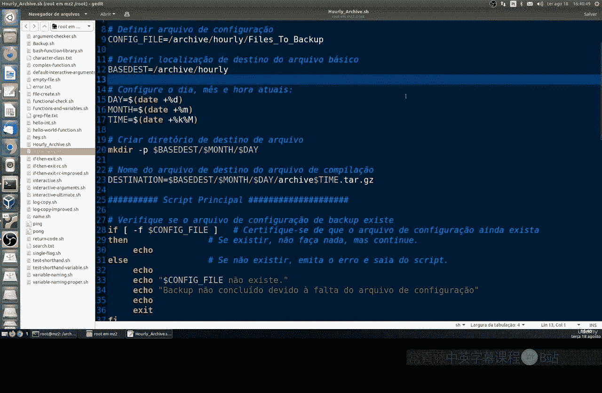
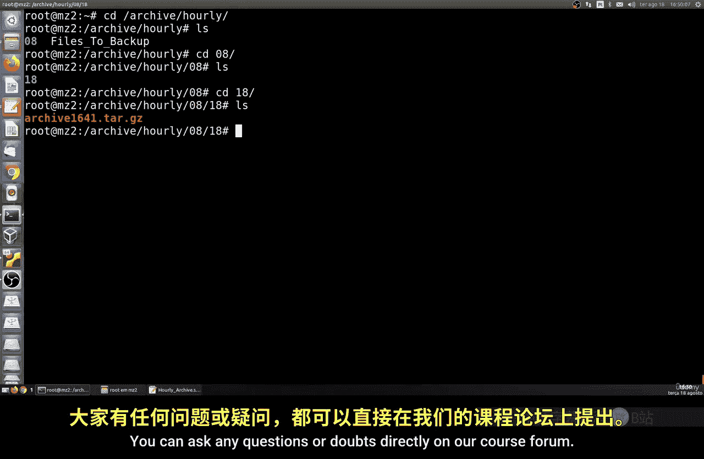

# 001：创建每小时备份脚本

在本节课中，我们将学习如何创建一个自动化的备份脚本。该脚本将能够每小时运行一次，并将备份文件按日期和时间进行组织，存储到指定的目录结构中。

上一节我们介绍了基础的备份脚本，本节中我们来看看如何实现自动化与文件组织。

## 准备工作

首先，我们需要在之前创建的 `files` 目录内，再新建一个用于存放备份的目录。



以下是创建并设置目录权限的步骤：
1.  使用 `mkdir` 命令创建新目录。
2.  使用 `chmod` 命令将目录权限设置为 `775`，以确保所有用户组都拥有读取、写入和执行的权限。



完成设置后，你可以将之前创建的备份文件移动到新目录中。如果需要修改脚本中涉及的目录路径，请记得更新对应的配置。



## 编写脚本



现在，让我们开始创建新的脚本文件。这个脚本的核心逻辑与之前的类似，但开头部分会有所不同，主要增加了用于定义路径和获取时间的变量。





我们将定义以下关键变量：
*   `BACKUP_PATH`：备份文件存储的完整根路径。
*   `CONFIG_FILE`：配置文件的位置，该文件列出了需要备份的目录。
*   `DAY`、`MONTH`、`TIME`：分别用于获取当前的日、月和时间。

获取日期和时间的命令是 `date`，我们可以通过 `date +%d` 获取日，通过 `date +%m` 获取月，通过 `date +%H%M` 获取时间（小时和分钟）。

接着，我们会创建一个基于这些变量的目标目录路径，格式类似于 `$BACKUP_PATH/$DAY$MONTH/$TIME/`。这样，备份文件就会自动按“日-月”文件夹和“时间”子文件夹进行归类。

脚本的主体部分是一个 `while` 循环，它会逐行读取配置文件中的目录列表，并使用 `tar` 命令以高压缩率（`-jcf` 选项）将每个目录打包压缩，最终保存到我们刚才定义好的目标路径中。

## 测试脚本

脚本编写完成后，需要先赋予其执行权限。你可以使用命令 `chmod +x 脚本名.sh` 来实现。



然后，我们可以手动运行一次脚本进行测试。执行后，请检查目标目录是否按照 `日/月/时间` 的格式成功创建，并且备份文件是否已正确生成并存放于内。

例如，在8月18日下午4点41分运行的备份，可能会生成路径为 `备份根目录/1808/1641/` 的文件夹，其中包含压缩好的备份文件。

## 实现自动化

脚本测试成功后，就可以配置其自动每小时运行了。这可以通过 Linux 系统的 `crontab` 任务计划程序来实现。

你需要编辑当前用户的 crontab 配置文件，并添加一行类似下面的配置：
```bash
0 * * * * /完整路径/到你的脚本.sh
```
这行配置表示在每小时的0分执行一次该脚本。

## 总结



本节课中我们一起学习了如何创建一个自动化的每小时备份脚本。我们首先设置了有序的目录结构，然后编写了能够动态生成基于日期时间的备份路径的脚本，最后通过 crontab 实现了脚本的定时自动执行。这样，你的重要文件就能被定期、有组织地备份起来。