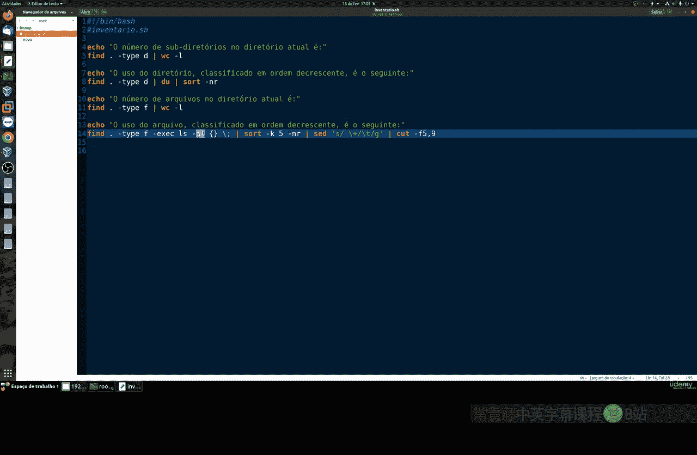
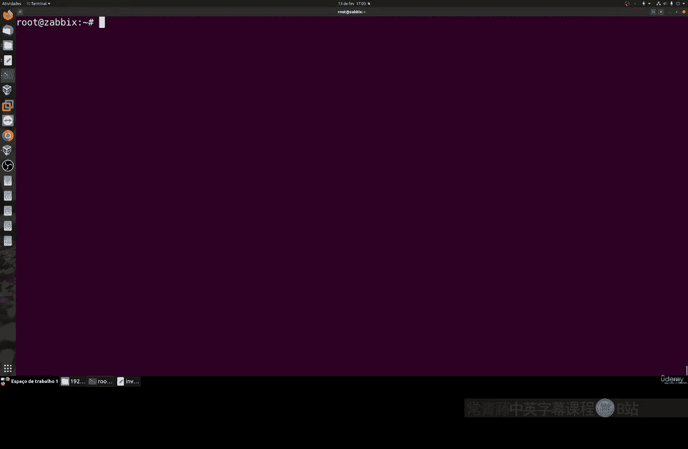
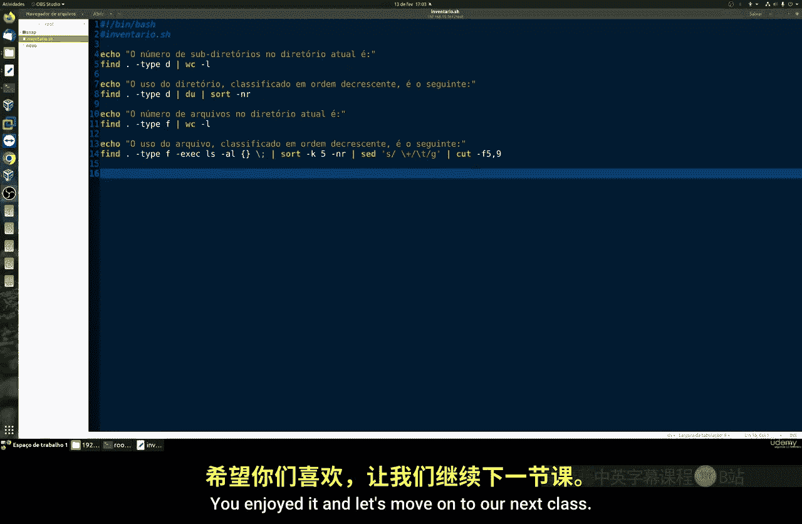

# 002：创建文件与文件夹清单 📋

在本节课中，我们将学习如何创建一个简单的脚本，用于统计指定目录下的文件夹数量、文件数量，并按大小排序列出它们。这是一个非常基础的脚本，不涉及复杂的循环或配置。

---

## 概述

我们将创建一个名为 `inventory.sh` 的脚本。该脚本会执行以下操作：
1.  统计当前目录下的子目录数量。
2.  按大小降序列出所有目录。
3.  统计当前目录下的文件数量。
4.  按大小降序列出所有文件。

---

## 脚本创建与解析

首先，我们创建一个脚本文件。你可以使用任何你喜欢的文本编辑器。

```bash
nano inventory.sh
```

以下是脚本的完整内容，我们将逐部分进行解析。

```bash
#!/bin/bash

echo "子目录数量："
find . -type d | wc -l

echo "目录大小排序（降序）："
find . -type d -exec du -sh {} \; | sort -rh

echo "文件数量："
find . -type f | wc -l

echo "文件大小排序（降序）："
find . -type f -exec du -sh {} \; | sort -rh
```

### 脚本命令详解

上一节我们介绍了脚本的整体目标，本节中我们来看看每一行命令的具体含义。

以下是脚本中使用的核心命令及其作用：

*   **`find . -type d`**：在当前目录（`.`）中查找所有类型为目录（`-type d`）的项目。
*   **`wc -l`**：统计输入的行数。与 `find` 命令通过管道（`|`）连接后，用于计算找到的目录或文件的数量。
*   **`find . -type d -exec du -sh {} \;`**：查找所有目录，并对每个找到的目录执行 `du -sh` 命令。`du -sh` 用于计算并显示指定目录的磁盘使用情况（`-s` 表示总计，`-h` 表示人类可读的格式，如K、M、G）。
*   **`sort -rh`**：对输入进行排序。`-r` 表示反向（降序），`-h` 表示能识别人类可读的数字单位（如K、M），确保按实际大小正确排序。
*   **`find . -type f`**：在当前目录中查找所有类型为文件（`-type f`）的项目。此命令会包含隐藏文件。

---

## 运行脚本

保存并退出编辑器后，需要为脚本文件添加可执行权限。



```bash
chmod +x inventory.sh
```

然后，运行脚本。

```bash
./inventory.sh
```

运行后，你将看到类似下图的输出，其中包含目录和文件的统计与列表信息。


---

## 输出结果解读

在输出结果中：
*   “子目录数量” 一行显示了当前目录下所有子文件夹的总数。
*   “目录大小排序” 部分列出了每个目录及其大小，从大到小排列。
*   “文件数量” 一行显示了当前目录下所有文件（包括隐藏文件）的总数。
*   “文件大小排序” 部分列出了每个文件及其大小，从大到小排列。

例如，在演示中，`/root` 目录下有8个子目录和11个文件，其中最大的文件是 `.vimrc`。



你可以随时删除脚本生成的清单文件，并重新运行脚本以获取最新信息。


---

## 总结

本节课中我们一起学习了如何创建一个简单的文件与文件夹清单脚本。我们使用了 `find` 命令来定位目录和文件，结合 `wc`、`du` 和 `sort` 命令来完成统计和排序工作。这个脚本虽然基础，但涵盖了Linux命令行中管道和命令组合的实用技巧。

这是一个非常简单的脚本，仅使用了基础命令。我们利用 `find -type f` 来查找所有文件（包括隐藏文件）。希望你喜欢本节课的内容，让我们继续下一课的学习。



