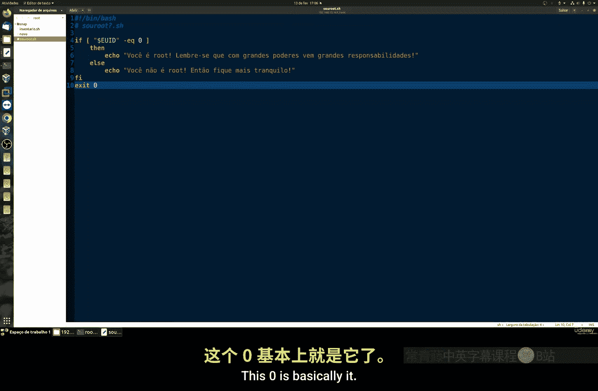
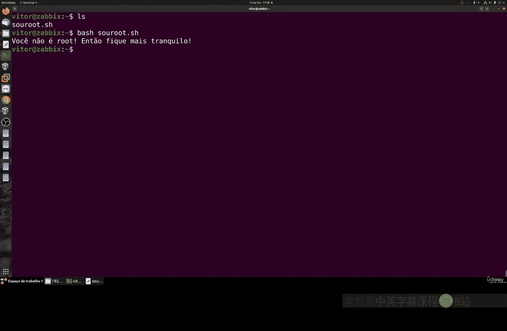
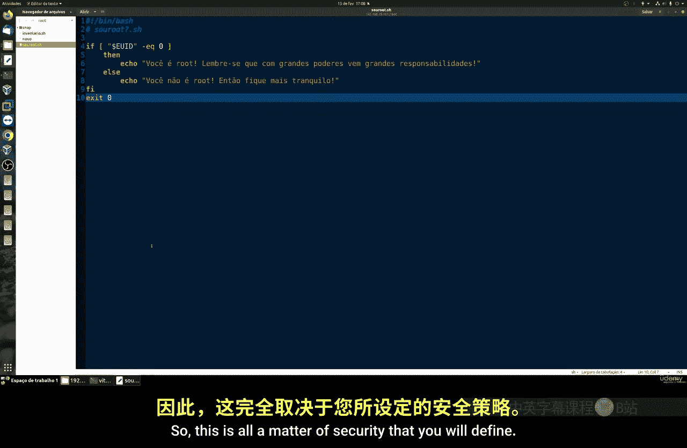
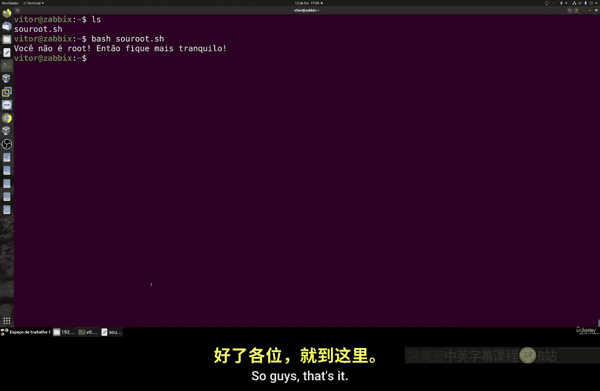

# 003：检查脚本执行者身份 👨‍💻

在本节课中，我们将学习如何创建一个基础的Shell脚本。这个脚本的核心功能是检查执行它的用户是否为root用户。这是一个在多种脚本配置中广泛使用的简单但重要的技巧。

## 概述

我们将创建一个脚本，它能够自动判断运行它的用户是否具有root权限。理解这一点非常重要，因为在Linux系统中，许多系统级操作（如安装软件、修改系统文件）通常只允许root用户执行。通过在脚本中加入身份检查，我们可以控制脚本的行为，增强安全性，并防止普通用户误执行高权限操作。

## 脚本原理

在Linux系统中，每个用户都有一个唯一的用户ID（UID）。**root用户的UID固定为0**。因此，判断一个用户是否为root，本质上就是检查其UID是否等于0。

我们的脚本将使用一个条件判断语句来实现这个逻辑。如果检测到当前用户的UID为0，则输出一条消息表明正在以root身份运行；否则，输出另一条消息表明当前用户是普通用户。

## 创建脚本

以下是创建该脚本的步骤。

1.  **创建脚本文件**：首先，我们需要创建一个新的脚本文件。你可以使用任何你喜欢的文本编辑器。这里我们使用`nano`编辑器创建一个名为`check_root.sh`的文件。
    ```bash
    nano check_root.sh
    ```

2.  **编写脚本内容**：在打开的文件中，输入以下代码。代码开头`#!/bin/bash`是一个“shebang”，它告诉系统使用哪个解释器来执行这个脚本。
    ```bash
    #!/bin/bash

    # 获取当前用户的用户ID（UID）
    USER_ID=$(id -u)

    # 判断UID是否等于0（即是否为root用户）
    if [ $USER_ID -eq 0 ]; then
        echo “您正在以root用户身份运行此脚本。”
    else
        echo “您不是root用户。请谨慎操作。”
    fi
    ```
    代码解释：
    *   `id -u` 命令用于获取当前执行脚本的用户的UID。
    *   `[ $USER_ID -eq 0 ]` 是一个条件测试，检查变量`USER_ID`的值是否等于（-eq）0。
    *   `if...then...else...fi` 是Bash中的条件判断结构，根据测试结果执行不同的代码块。

3.  **保存并退出**：在`nano`编辑器中，按 `Ctrl + X`，然后按 `Y` 确认保存，最后按 `Enter` 确认文件名即可退出。



## 测试脚本

脚本创建完成后，我们需要测试它在不同用户身份下的运行结果。

1.  **赋予执行权限**：在运行脚本前，需要先给它添加可执行权限。
    ```bash
    chmod +x check_root.sh
    ```

2.  **以普通用户身份测试**：首先，在你当前的用户会话中运行脚本。
    ```bash
    ./check_root.sh
    ```
    你应该会看到输出：“您不是root用户。请谨慎操作。”

3.  **以root用户身份测试**：要切换到root用户，可以使用`sudo`命令来以超级用户权限运行脚本。
    ```bash
    sudo ./check_root.sh
    ```
    输入你的用户密码后，脚本将以root身份执行。此时，你应该会看到输出：“您正在以root用户身份运行此脚本。”

## 实际应用场景



这个简单的检查机制在实际中非常有用。例如：
*   **安装脚本**：许多软件安装程序需要在开头检查是否为root，如果不是则提示用户并退出，因为普通用户可能没有权限写入系统目录。
*   **系统管理脚本**：一些用于管理系统服务或配置的脚本，可以设计成只允许root执行，以防止未授权的修改。
*   **安全策略**：你可以设计一个程序，明确禁止以root身份运行（例如某些桌面应用），以降低安全风险。

通过这种方式，你可以根据用户身份来动态决定脚本的行为流程，这是编写健壮、安全脚本的基础。



## 总结



本节课中，我们一起学习了如何编写一个检查当前用户是否为root的Shell脚本。我们掌握了核心概念：**root用户的UID为0**，并利用`id -u`命令和`if`条件判断语句实现了身份验证功能。这个技巧是构建更复杂脚本的基石，能有效帮助你管理脚本的执行权限，提升系统操作的安全性。