# 004：P4 显示服务器状态 📊

在本节课中，我们将学习如何创建一个Shell脚本，用于收集并显示服务器的关键状态信息。通过这个脚本，我们可以快速获取主机名、日期、内核版本、CPU使用率、内存和交换空间使用情况、磁盘I/O以及网络带宽等数据，从而形成一个简洁的服务器状态报告。

---

上一节我们介绍了基础的命令行操作，本节中我们来看看如何将这些命令组合成一个实用的监控脚本。

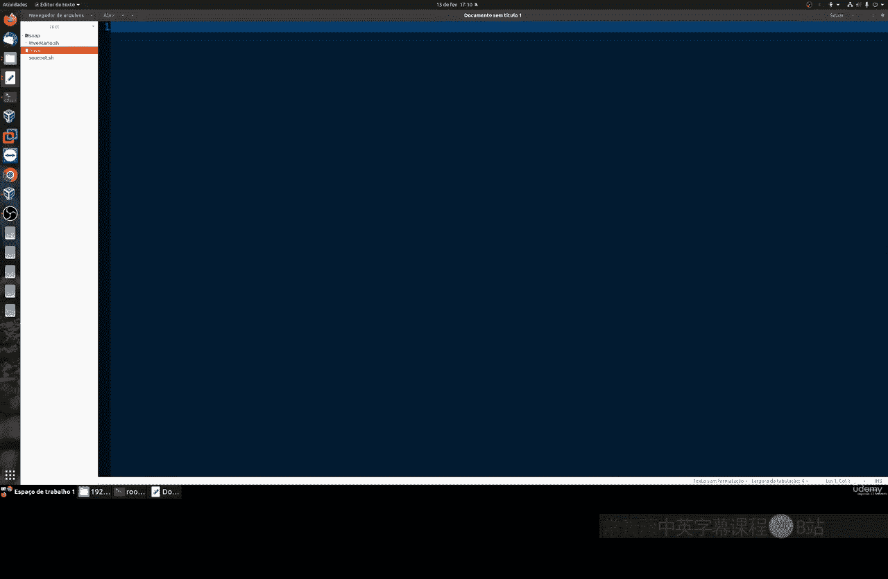

首先，我们需要确保系统上安装了 `sysstat` 工具包，它包含了我们将要使用的 `sar` 命令。在大多数新系统中，它已经默认安装。如果需要手动安装，可以使用以下命令：

*   **对于 Ubuntu/Debian 系统：**
    ```bash
    sudo apt install sysstat
    ```
*   **对于 Red Hat/Fedora/CentOS 系统：**
    ```bash
    sudo yum install sysstat
    # 或
    sudo dnf install sysstat
    ```

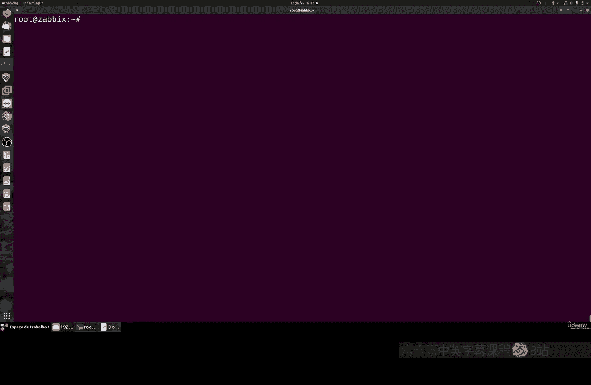

---

接下来，我们开始创建脚本。我们将使用 `echo` 命令来输出静态信息，并使用 `sar` 命令来获取动态的系统性能数据。

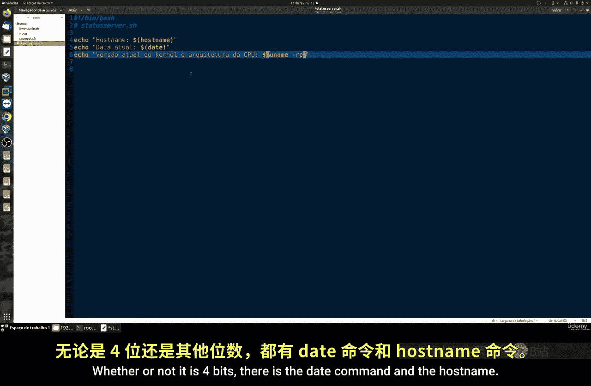

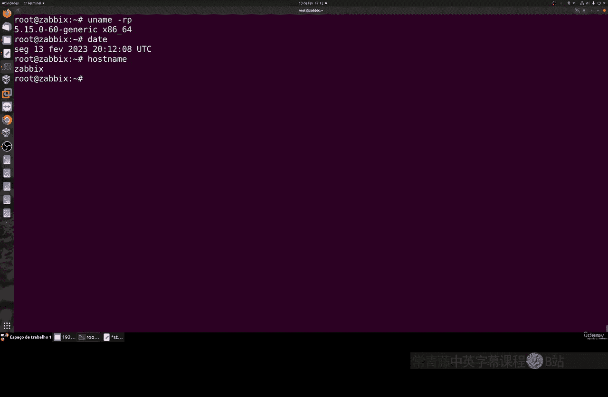

以下是脚本 `status_server.sh` 的基本结构：

```bash
#!/bin/bash

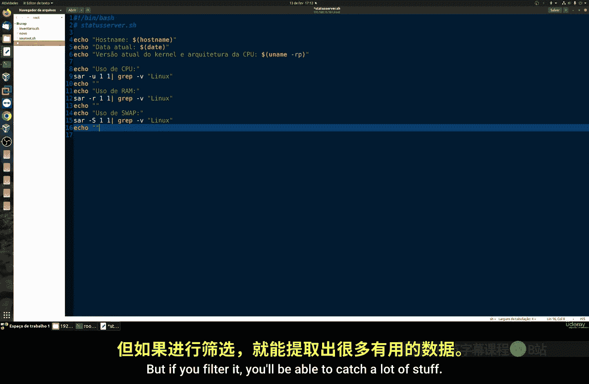

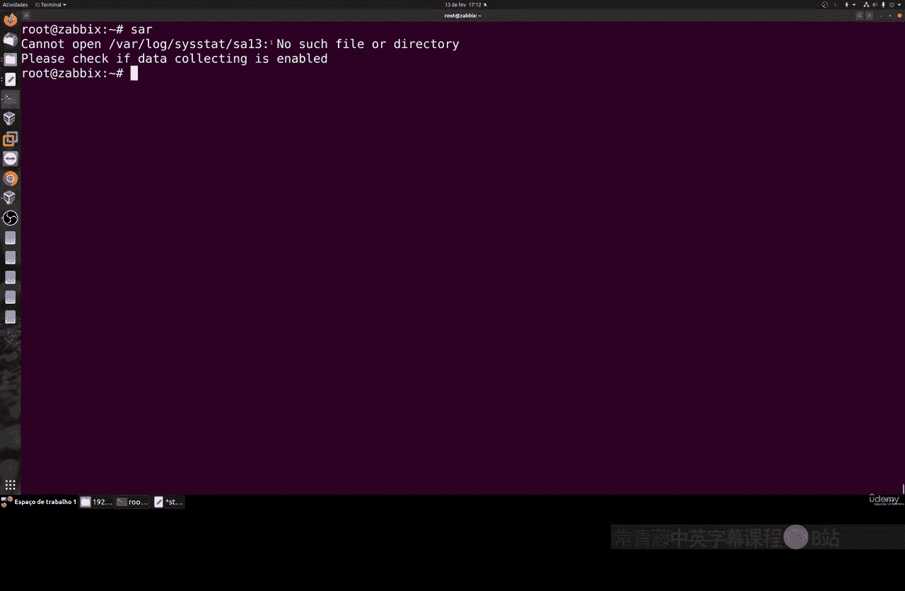

echo "主机名: $(hostname)"
echo "内核版本: $(uname -r)"
echo "当前日期: $(date)"
```

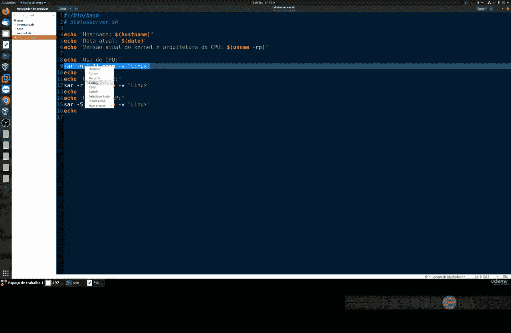

以上命令分别获取并显示服务器的主机名、运行的内核版本以及当前日期。如果单独运行这些命令，你会看到各自的结果。

---

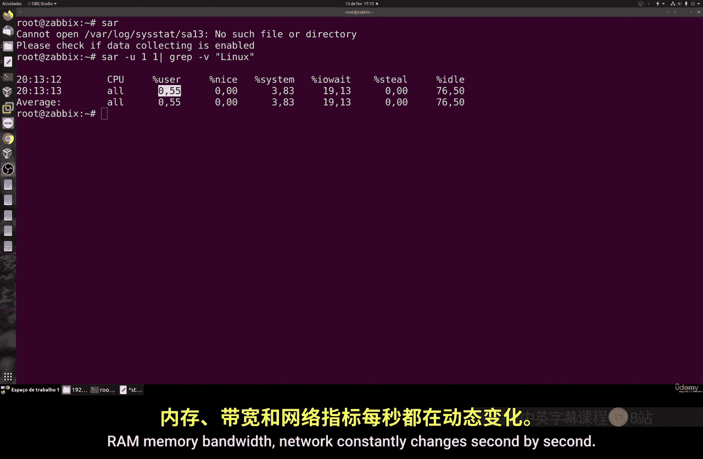

现在，我们引入 `sar` 命令来获取实时的系统性能指标。`sar` 命令功能强大，默认会显示CPU使用情况。通过添加不同的选项，我们可以过滤出所需的信息。

以下是使用 `sar` 命令获取各类信息的示例：

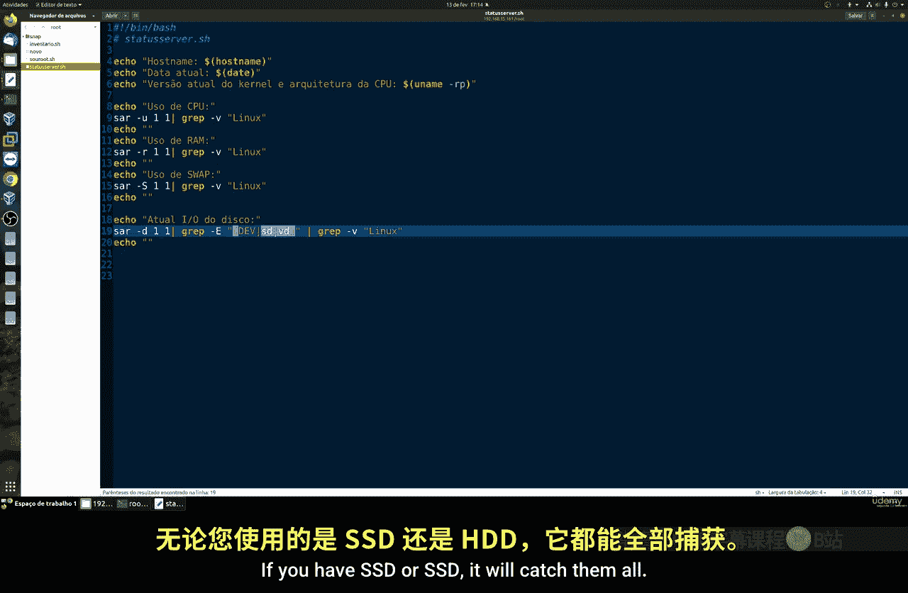

*   **获取CPU使用率：**
    ```bash
    sar -u 1 1
    ```
*   **获取内存使用情况：**
    ```bash
    sar -r 1 1
    ```
*   **获取交换空间使用情况：**
    ```bash
    sar -S 1 1
    ```
*   **获取磁盘I/O统计：**
    ```bash
    sar -d 1 1
    ```
*   **获取网络接口带宽：**
    ```bash
    sar -n DEV 1 1
    ```

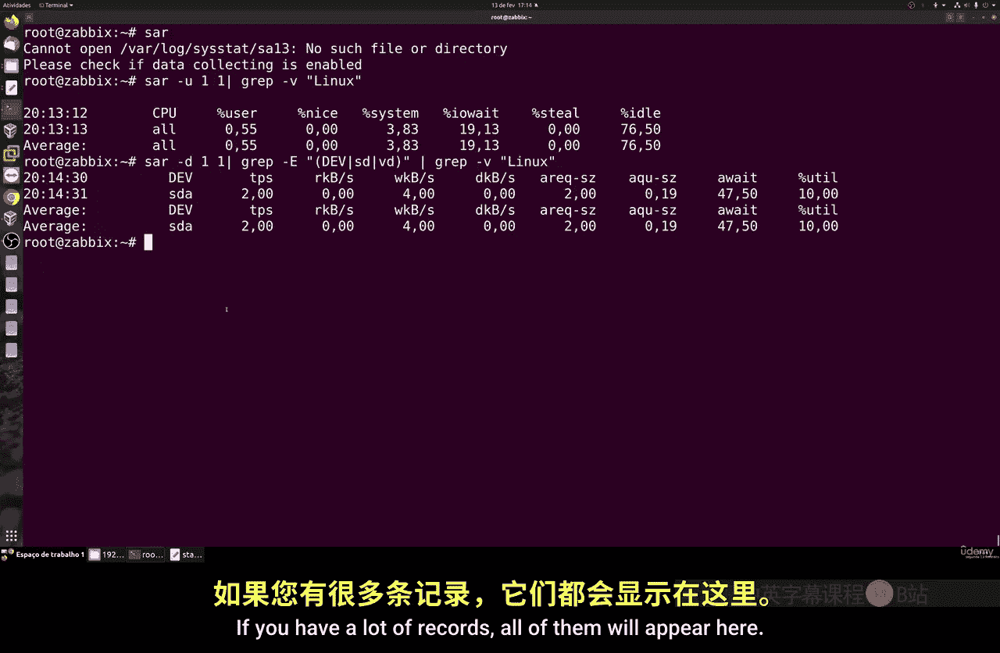

在这些命令中，`-u`、`-r`、`-S`、`-d` 和 `-n DEV` 等选项用于指定我们想要查看的数据类型。请注意，这些数据是命令执行瞬间的快照，因为CPU、内存和网络状态每秒都在变化。

---

让我们将这些命令整合到我们的脚本中，形成一个完整的报告。最终的脚本内容如下：

```bash
#!/bin/bash

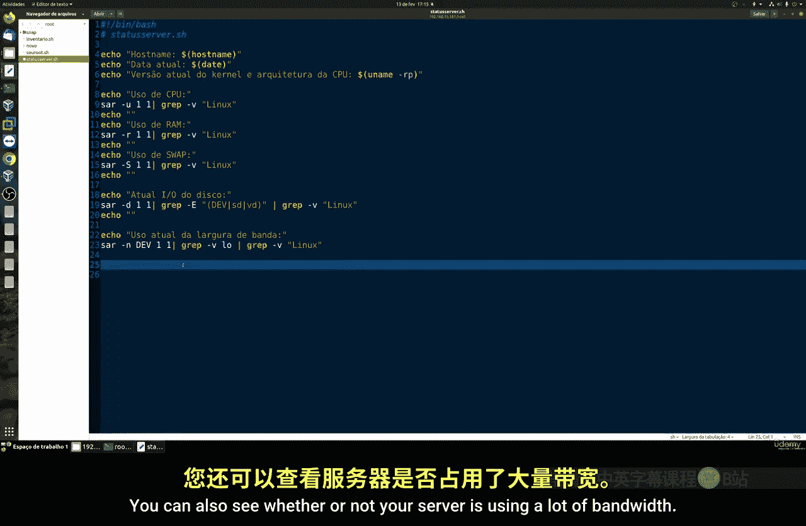

echo "==================== 服务器状态报告 ===================="
echo "主机名: $(hostname)"
echo "内核版本: $(uname -r)"
echo "报告生成时间: $(date)"
echo ""
echo "---------- CPU 使用率 ----------"
sar -u 1 1 | tail -n 2
echo ""
echo "---------- 内存使用情况 ----------"
sar -r 1 1 | tail -n 2
echo ""
echo "---------- 交换空间使用情况 ----------"
sar -S 1 1 | tail -n 2
echo ""
echo "---------- 磁盘I/O统计 ----------"
sar -d 1 1 | tail -n 3
echo ""
echo "---------- 网络带宽统计 ----------"
sar -n DEV 1 1 | grep -E 'Average|eth0|ens33' | tail -n 2
echo "======================================================"
```

保存脚本后，为其添加执行权限并运行：

```bash
chmod +x status_server.sh
./status_server.sh
```

脚本运行时会花一点时间收集数据，然后输出报告。报告会显示例如CPU空闲率、内存使用百分比、交换空间是否被使用、各磁盘的利用率（`%util`）以及网络接口的接收（`rxkB/s`）和发送（`txkB/s`）速率。如果你的服务器有多个网络接口，它们的信息都会被显示出来。

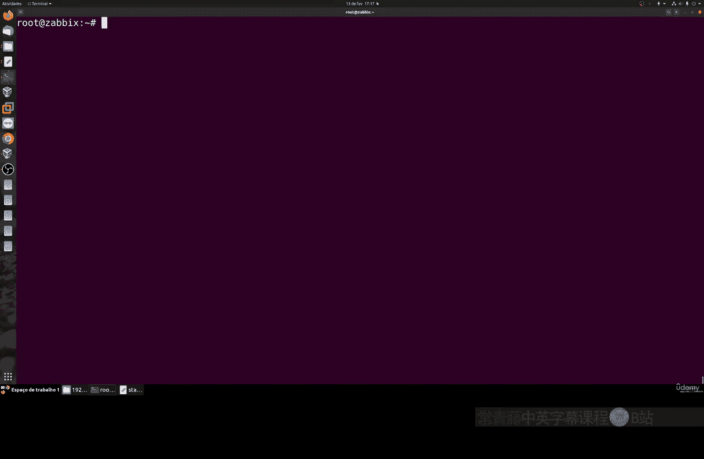

---

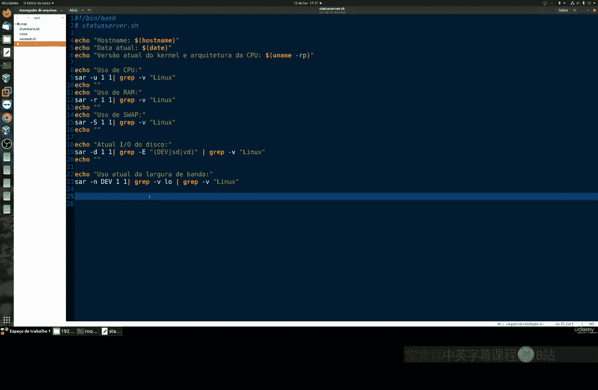


本节课中我们一起学习了如何创建一个简单的Shell脚本来监控服务器状态。我们整合了 `hostname`、`uname`、`date` 等基础命令和强大的 `sar` 命令，快速生成了包含主机信息、CPU、内存、磁盘和网络关键指标的报告。这个脚本是进行服务器基础诊断和日常检查的一个实用工具。在接下来的课程中，我们将继续探索更多Linux命令行的强大功能。