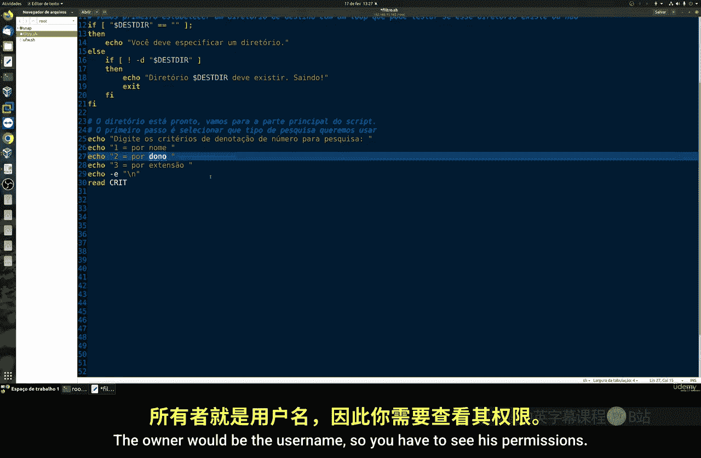
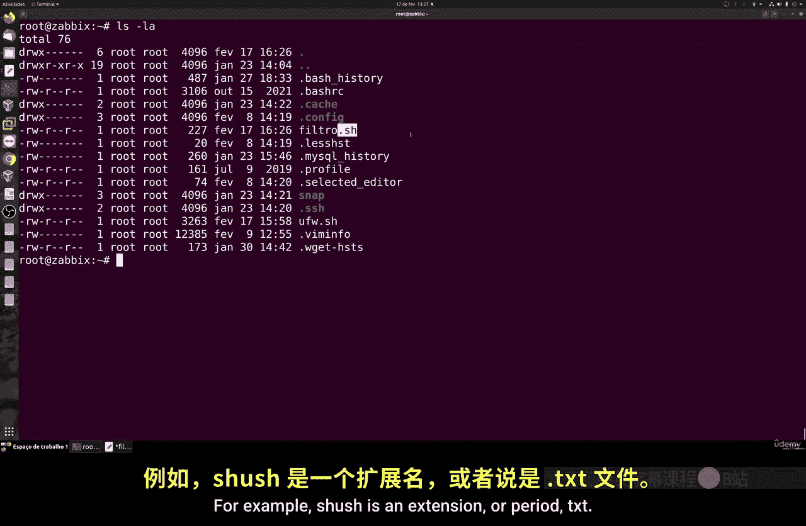
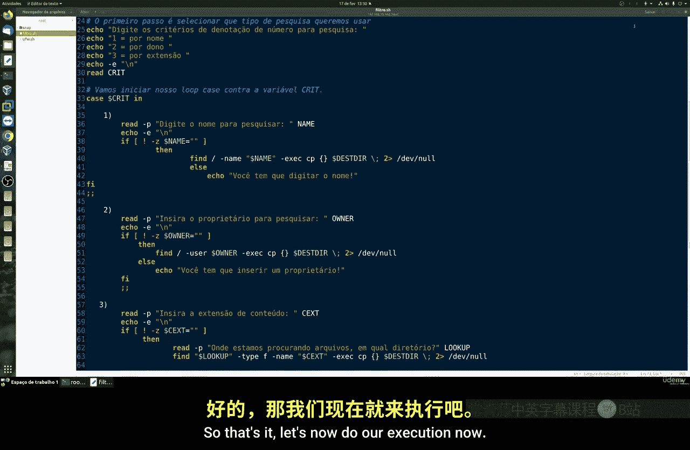
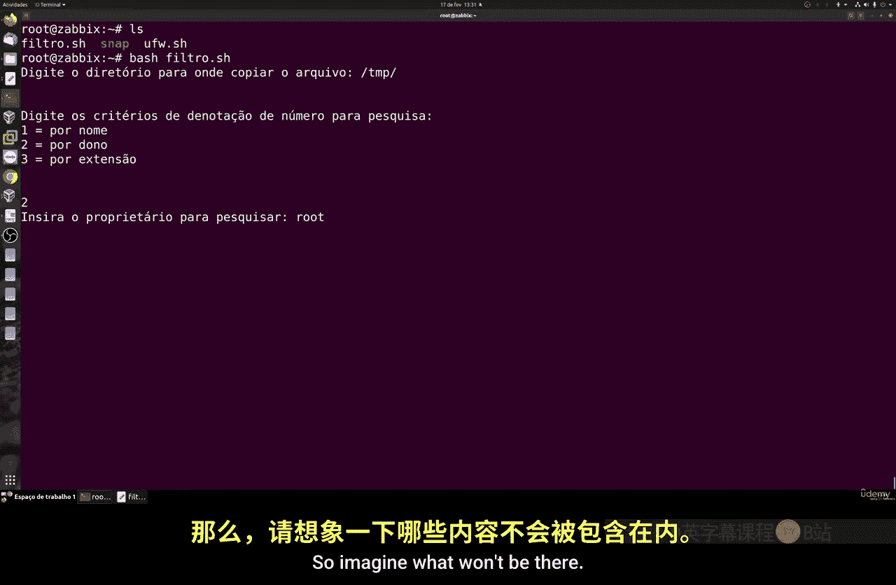
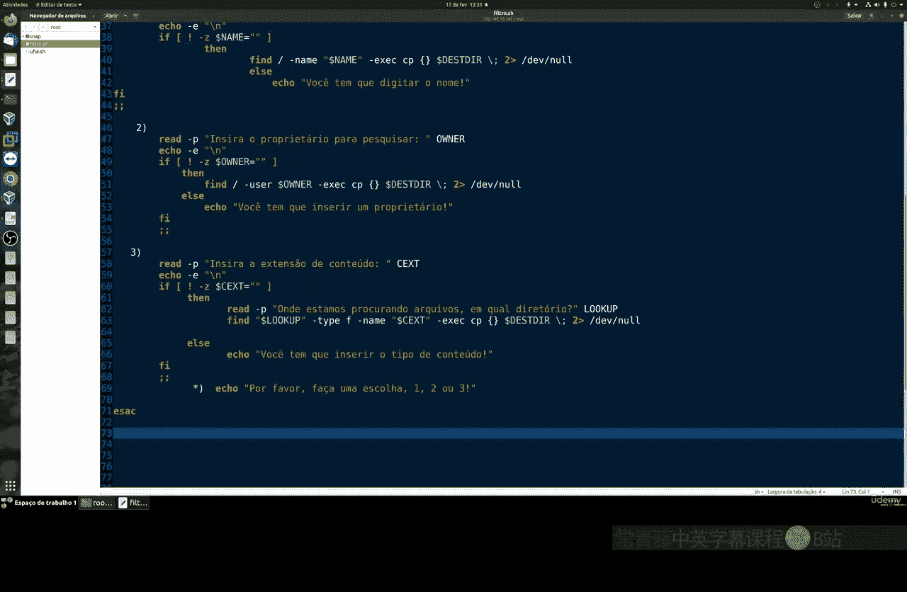
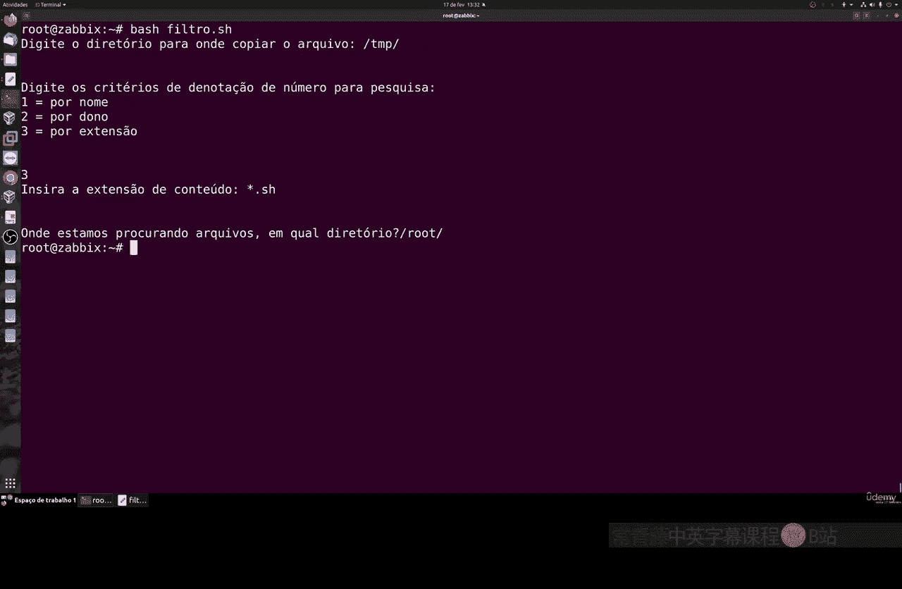
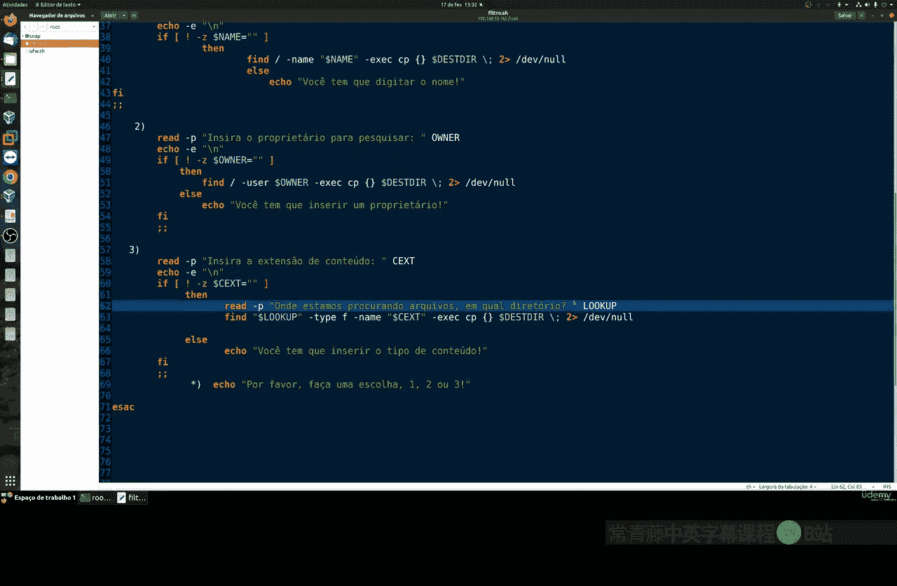
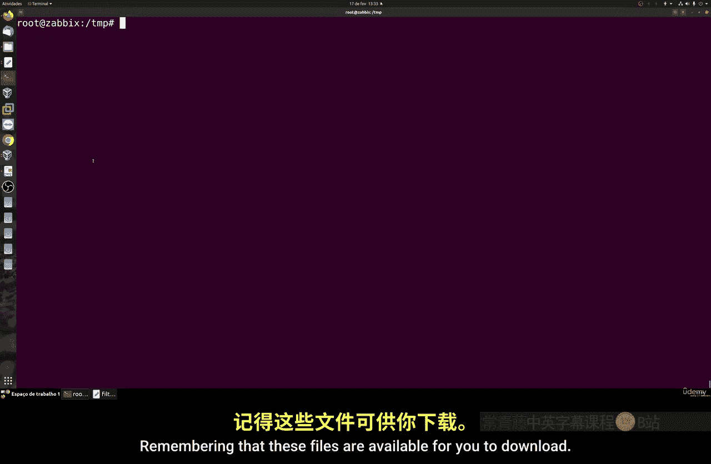

# 005：过滤文件 📂

在本节课中，我们将学习如何编写一个Shell脚本，用于根据文件名、文件所有者或文件扩展名等条件来过滤文件，并将匹配的文件复制到指定的目录中。这是一个非常实用的脚本，能帮助你通过终端更高效地管理文件。

---

## 脚本概述与目标 🎯


我们将创建一个名为 `filter.sh` 的脚本。它的核心功能是：让用户选择一个过滤条件（按名称、所有者或扩展名），然后根据该条件查找文件，并将找到的文件**复制**（而非移动）到一个用户指定的目标目录。

---

## 第一步：创建脚本并定义变量

首先，我们创建脚本文件并添加标准的脚本头。然后，定义两个关键变量：一个用于存储目标目录的完整路径，另一个用于存储用户选择的过滤选项。

```bash
#!/bin/bash

# 定义目标目录变量
TARGET_DIR=""

# 定义过滤选项变量
FILTER_OPTION=""
```



**注意**：`TARGET_DIR` 必须是一个完整的路径（例如 `/home/user/backup`），否则脚本可能出错。

---



## 第二步：获取用户输入并验证目录

脚本需要获取用户输入的目标目录，并检查该目录是否存在。如果目录不存在，脚本应提示错误。

上一节我们定义了变量，本节中我们来看看如何与用户交互并验证输入。

以下是获取和验证目录的步骤：
1.  提示用户输入目标目录的完整路径。
2.  使用 `if [ -d "$TARGET_DIR" ]` 命令检查目录是否存在。
3.  如果目录不存在，则输出错误信息并退出脚本。

---

## 第三步：选择过滤条件

接下来，脚本需要让用户选择过滤文件的方式。我们将提供三个选项。

以下是可供选择的过滤条件：
*   **1. 按名称过滤**：使用通配符（如 `*.txt`）匹配文件名。
*   **2. 按所有者过滤**：根据文件所有者（如 `root` 用户）进行匹配。
*   **3. 按扩展名过滤**：根据文件扩展名（如 `.sh` 或 `.mp3`）进行匹配。

用户输入对应的数字来选择过滤方式。

---

## 第四步：实现过滤与复制逻辑



根据用户选择的过滤选项，我们需要使用不同的 `find` 命令来查找文件，并用 `cp` 命令进行复制。

我们将使用 `case` 语句来处理不同的选项。每个 `case` 分支会要求用户输入具体的过滤值（如具体名称、所有者或扩展名），然后执行相应的 `find` 和 `cp` 命令组合。

例如，对于“按名称过滤”：
```bash
find /path/to/search -name "$FILTER_VALUE" -exec cp {} "$TARGET_DIR" \;
```
对于“按所有者过滤”：
```bash
find /path/to/search -user "$FILTER_VALUE" -exec cp {} "$TARGET_DIR" \;
```
对于“按扩展名过滤”：
```bash
find /path/to/search -name "*.$FILTER_VALUE" -type f -exec cp {} "$TARGET_DIR" \;
```
**注意**：在按扩展名过滤时，我们添加了 `-type f` 参数以确保只复制普通文件，而不包括目录。





---

## 第五步：运行脚本示例 🚀

让我们运行脚本并看一个例子。假设我们：
1.  将目标目录设置为 `/tmp/backup`。
2.  选择过滤条件“3”（按扩展名）。
3.  输入扩展名 `sh`，并在根目录 `/` 下搜索。



脚本会执行类似以下的命令：
```bash
find / -name "*.sh" -type f -exec cp {} /tmp/backup \;
```
执行后，所有找到的 `.sh` 脚本文件都会被复制到 `/tmp/backup` 目录中。你可以使用 `ls /tmp/backup` 命令来验证复制结果。



---

## 总结 📝

本节课中我们一起学习了一个实用的Shell脚本。我们掌握了：
1.  如何通过用户交互获取输入。
2.  如何验证文件目录是否存在。
3.  如何使用 `case` 语句处理不同的程序分支。
4.  如何结合 `find` 和 `cp` 命令，根据名称、所有者或扩展名来过滤并复制文件。



这个脚本虽然简单，但能极大地提升在命令行环境下批量处理文件的效率。你可以根据需要修改搜索路径或添加更多过滤条件。