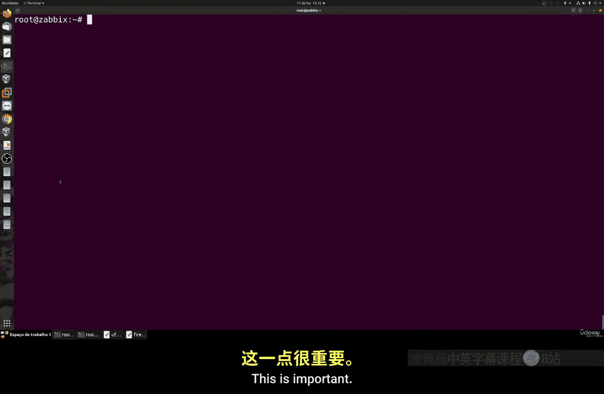
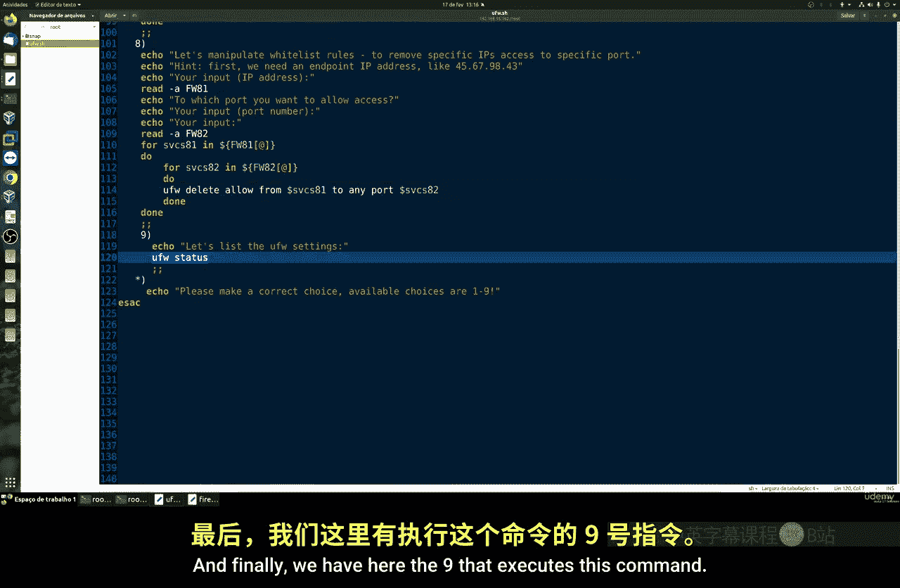
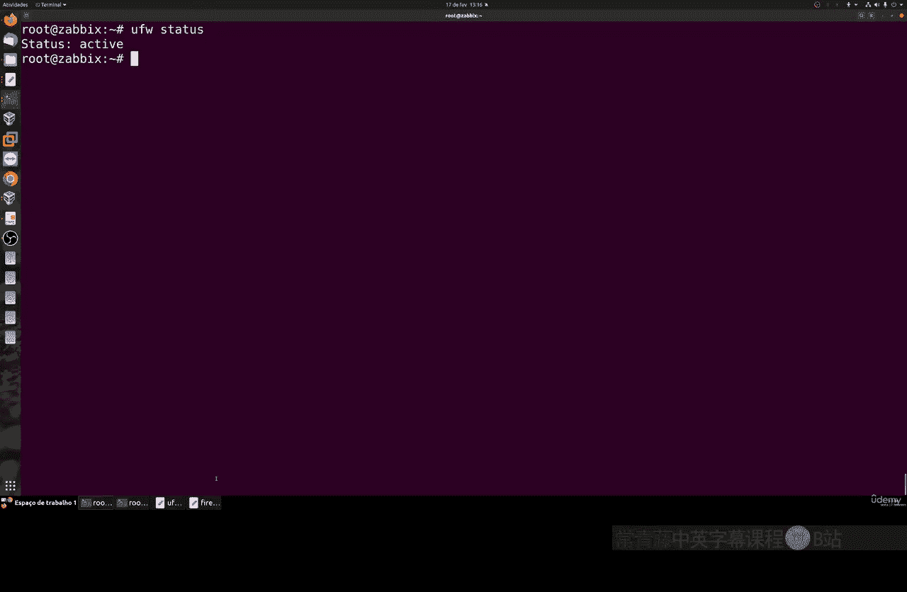
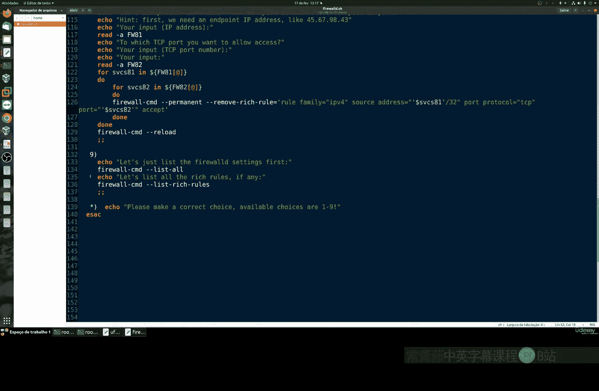
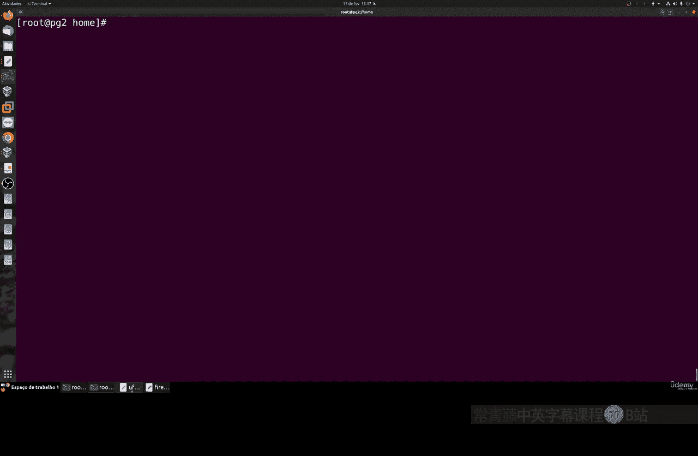
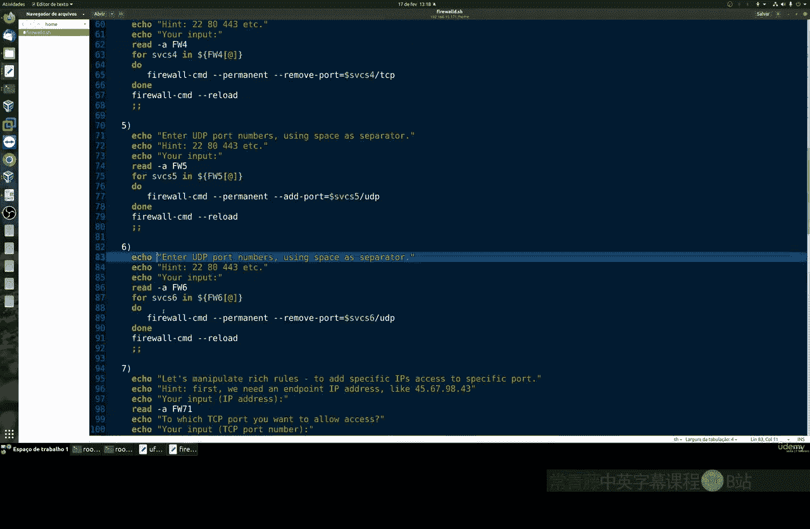
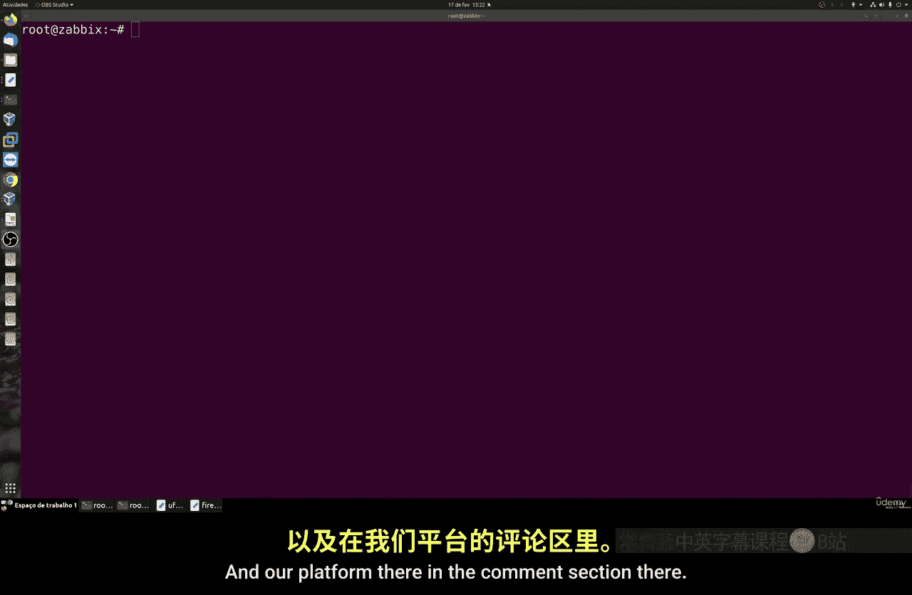

# 006：防火墙操作脚本 🛡️

在本节课中，我们将学习如何为两种主要的Linux发行版（基于Red Hat的系统如Fedora/Rocky Linux，以及Ubuntu系统）创建和运行一个简化的防火墙配置脚本。这个脚本旨在通过交互式菜单简化常见的防火墙操作，如添加/移除服务或端口。

## 概述

防火墙是保护系统安全的重要工具。不同的Linux发行版使用不同的防火墙管理工具：基于Red Hat的系统通常使用 `firewall-cmd`，而Ubuntu系统则使用 `ufw`。手动输入这些命令可能繁琐，因此我们将创建一个脚本来自动化这些常见任务。

上一节我们介绍了防火墙的基本概念，本节中我们来看看如何通过脚本简化其配置过程。



## 准备工作：确保防火墙服务运行

在开始配置之前，必须确保两个系统的防火墙服务处于活动且运行的状态。这是所有后续操作的基础。

以下是启动和启用服务的命令：

**对于基于Red Hat的系统（如Fedora/Rocky Linux）：**
```bash
systemctl enable firewalld
systemctl start firewalld
systemctl status firewalld
```

**对于Ubuntu系统：**
```bash
sudo ufw enable
```
> 注意：此脚本专为Ubuntu设计，在纯Debian系统上可能无法工作。

## 脚本结构与逻辑解析

这是一个交互式Bash脚本。其核心逻辑是读取用户输入的数字选项，并根据选择执行相应的防火墙命令。

脚本的基本结构如下：
1.  显示一个包含选项（1-9）的菜单。
2.  读取用户输入并将其存储在一个变量中。
3.  使用 `case` 语句根据变量值执行对应的代码块。

以下是脚本中主要选项对应的操作概述：





**对于 `ufw` (Ubuntu) 脚本：**
*   **选项1-2:** 添加或移除标准服务（如SSH, HTTP）。
*   **选项3-4:** 添加或移除特定端口（TCP/UDP）。
*   **选项5-6:** 在允许列表中添加或移除特定IP地址。
*   **选项9:** 列出当前所有防火墙规则。

**对于 `firewall-cmd` (Red Hat) 脚本：**
*   **选项1-2:** 添加或移除预定义服务。
*   **选项3-4:** 添加或移除特定端口。
*   **选项5-6:** 处理更复杂的富规则（rich rules）。
*   **选项9:** 列出所有活动区域和规则。

两个脚本的逻辑完全相同，只是底层的防火墙命令（`ufw` 或 `firewall-cmd`）不同。脚本通过变量存储用户输入的参数（如端口号、IP地址），然后将其嵌入到最终的防火墙命令中执行。

## 实战演示：使用脚本配置防火墙

让我们实际运行脚本来看看效果。首先测试用于Red Hat系统的脚本。





1.  **列出当前规则**：运行脚本并选择选项9，可以查看已激活的服务，如cockpit、DHCP、PostgreSQL和SSH。
    ```bash
    ./firewall_redhat.sh
    # 然后输入 9
    ```



2.  **添加一个自定义TCP端口**：再次运行脚本，选择选项3（添加端口），然后输入端口号，例如 `4443`。
    ```bash
    ./firewall_redhat.sh
    # 输入 3， 然后输入 4443
    ```
    使用选项9再次列表，确认端口 `4443/tcp` 已添加成功。

3.  **移除端口和服务**：
    *   选择选项4，输入 `4443` 来移除刚才添加的端口。
    *   选择选项2，输入服务名 `cockpit` 来移除该服务。
    *   每次操作后，都可以用选项9验证更改。

现在，让我们测试用于Ubuntu系统的脚本。

1.  **列出当前规则**：运行脚本并选择选项9。
    ```bash
    sudo ./firewall_ubuntu.sh
    # 输入 9
    ```

2.  **管理服务**：选择选项1，然后输入 `ssh` 来添加SSH服务。脚本会同时处理IPv4和IPv6规则。
3.  **管理端口**：选择选项3，添加一个TCP端口，例如 `4443`。使用选项9列表，可以看到新端口已生效。
4.  **底层验证**：在Ubuntu上，`ufw` 是 `iptables` 的前端工具。你可以运行 `sudo iptables -L` 来查看由`ufw`配置生成的底层iptables规则，两者是一致的。

通过这个脚本，你可以快速、无差错地执行这些常规防火墙配置任务。

## 总结

本节课中我们一起学习了如何为Red Hat和Ubuntu系统创建实用的防火墙配置脚本。我们了解了脚本的交互式结构和工作原理，并通过实战演示了如何使用脚本添加、移除服务和端口，以及如何列出当前配置。

这个脚本的核心价值在于将复杂的防火墙命令封装在简单的菜单之后，从而提高了日常系统管理工作的效率和准确性。你可以下载并使用这些脚本作为模板，根据自身需求进行修改和扩展。



如果在使用过程中遇到任何问题，欢迎在课程论坛或评论区留言讨论。