# 007：自动化备份 📂

在本节课中，我们将学习如何创建一个实用的Shell脚本，用于自动化执行系统文件的完整备份。备份是防止数据丢失的关键操作，对于任何Linux系统管理员来说都至关重要。

---

## 回顾TAR命令

上一节我们介绍了基本的命令行操作，本节中我们将利用`tar`命令来创建备份文件。`tar`命令用于将多个文件或目录打包成一个归档文件。

其基本语法如下：
```bash
tar -czf <备份文件名>.tar.gz <要备份的目录或文件>
```
例如，命令`tar -czf backup.tar.gz /home/user/documents`会将`/home/user/documents`目录压缩打包成`backup.tar.gz`文件。

使用`gzip`（通过`-z`选项）进行压缩可以显著减少备份文件占用的磁盘空间。例如，一个未压缩的归档文件可能为100MB，而压缩后可能只有30MB。

---

## 创建备份专用目录

良好的实践是为所有备份文件创建一个独立的专用目录。这可以是系统内的一个文件夹，也可以是挂载的外部硬盘路径。

以下是创建并设置备份目录的步骤：
```bash
# 创建名为“backups”的目录
mkdir /backups

# 创建一个专门管理备份的用户组，例如“archivers”
sudo groupadd archivers

# 将备份目录的所有权赋予该组
sudo chgrp archivers /backups

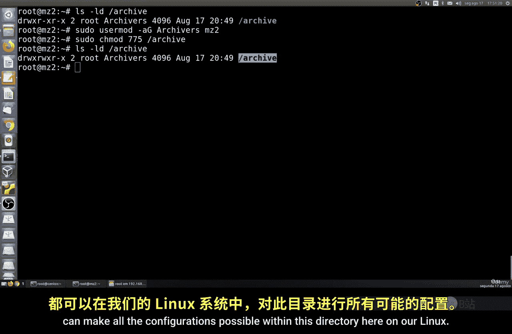

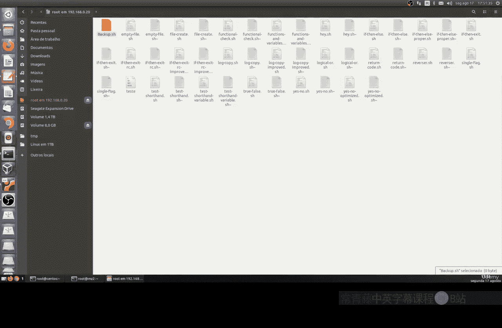

# 设置目录权限，允许组内成员读写执行
sudo chmod 770 /backups
```
完成上述步骤后，任何被添加到`archivers`组中的用户都可以在`/backups`目录中自由创建和管理备份文件。

---

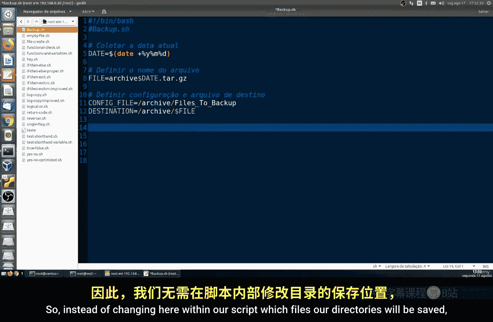

## 编写Shell备份脚本

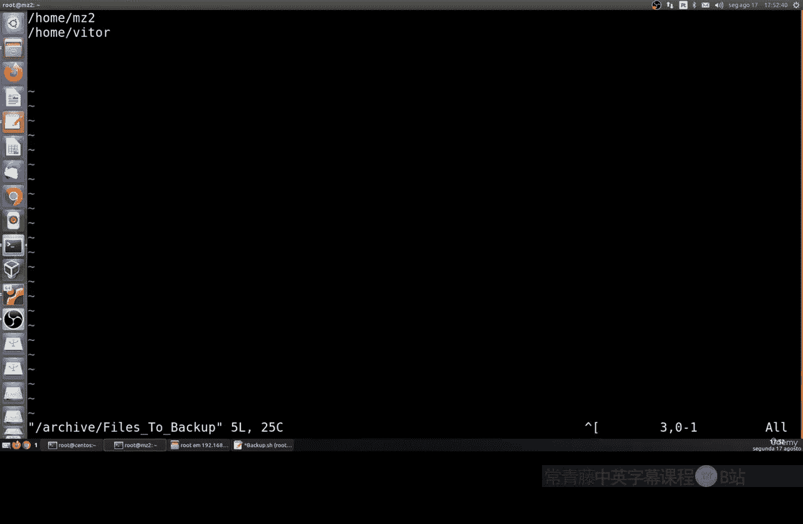

现在，我们来创建自动执行备份的Shell脚本。该脚本将读取一个配置文件，根据其中的列表来备份指定的文件和目录。

首先，创建一个名为`backup_config`的配置文件，其中每一行都是一个需要备份的完整路径：
```
/home/user/documents
/etc/nginx
/var/log
```

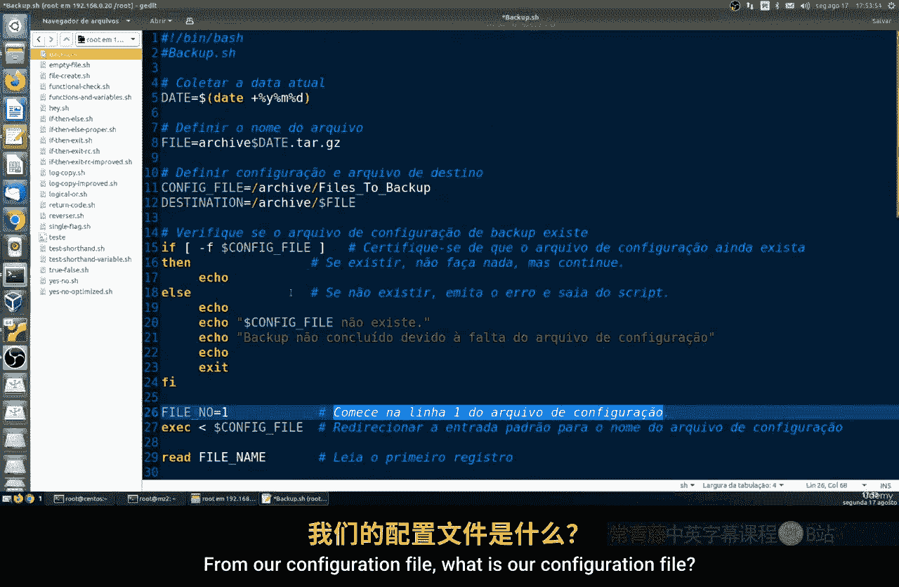

接下来，创建主备份脚本`backup.sh`。脚本的核心逻辑如下：

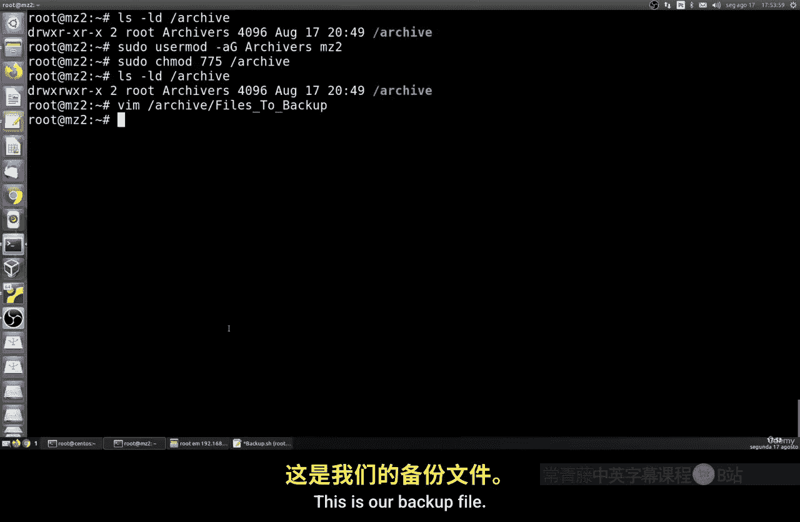

1.  **定义变量**：设置日期、备份文件名和路径。
    ```bash
    BACKUP_DIR="/backups"
    CONFIG_FILE="/path/to/backup_config"
    DATE=$(date +%Y%m%d)
    BACKUP_FILE="$BACKUP_DIR/backup_$DATE.tar.gz"
    ```

2.  **检查备份目录**：确保备份目录存在。
    ```bash
    if [ ! -d "$BACKUP_DIR" ]; then
      echo "备份目录不存在。"
      exit 1
    fi
    ```

3.  **读取配置文件并构建备份列表**：逐行读取配置文件，检查每个路径是否存在，并将有效的路径添加到列表中。
    ```bash
    FILE_LIST=""
    while IFS= read -r line; do
        if [ -f "$line" ] || [ -d "$line" ]; then
            FILE_LIST="$FILE_LIST $line"
        else
            echo "警告：路径 $line 不存在，已跳过。"
        fi
    done < "$CONFIG_FILE"
    ```

4.  **执行备份命令**：使用`tar`命令创建压缩备份包。
    ```bash
    tar -czf $BACKUP_FILE $FILE_LIST 2>/dev/null
    ```

5.  **完成提示**：脚本执行完毕后，输出备份文件的保存位置。
    ```bash
    if [ $? -eq 0 ]; then
        echo "备份成功完成！文件保存在：$BACKUP_FILE"
    else
        echo "备份过程中出现错误。"
    fi
    ```

---

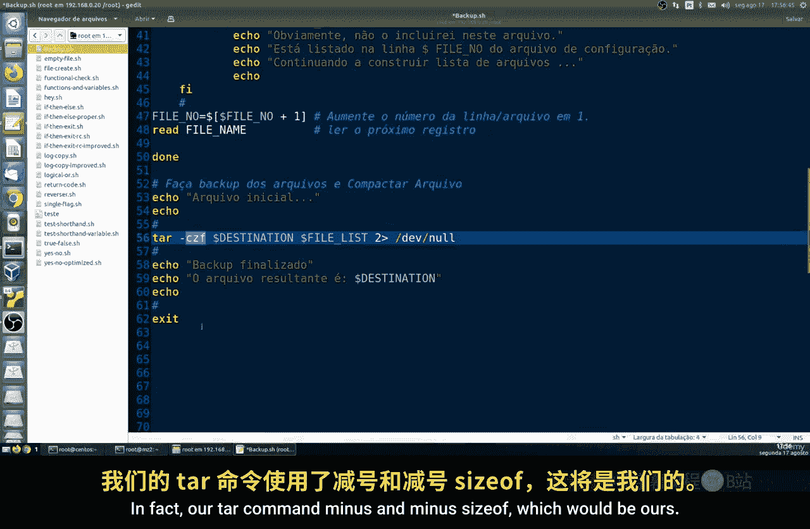

## 测试备份脚本

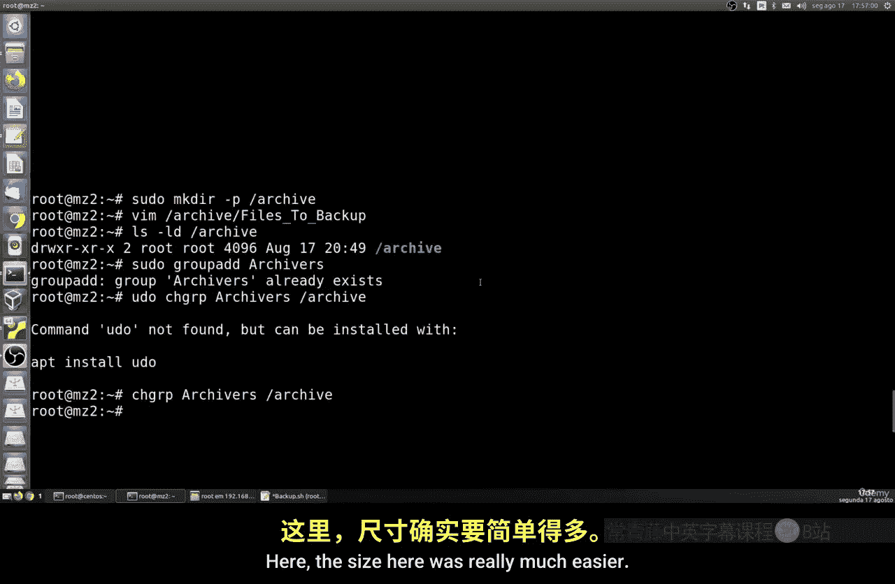

脚本编写完成后，需要使其可执行并运行测试。

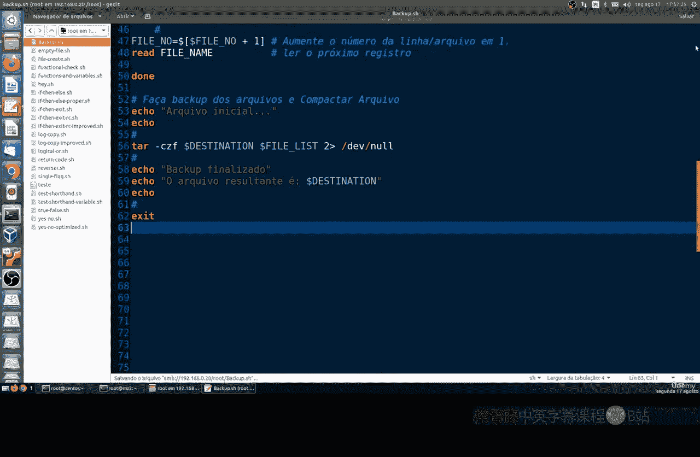

以下是测试步骤：
```bash
# 为脚本添加可执行权限
chmod +x backup.sh

# 运行备份脚本
sudo ./backup.sh
```
脚本运行时会读取配置文件中的路径，逐一打包，并在`/backups`目录下生成一个带有日期的压缩文件（例如`backup_20231027.tar.gz`）。备份所需时间取决于被备份数据的总大小。

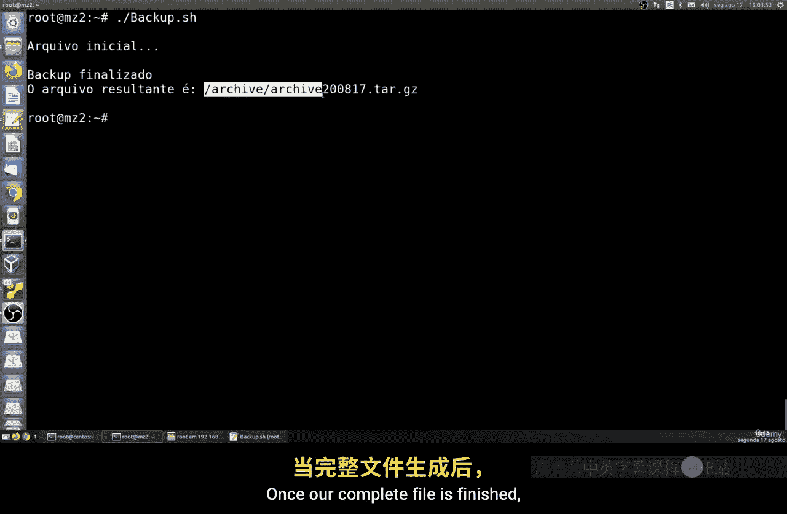

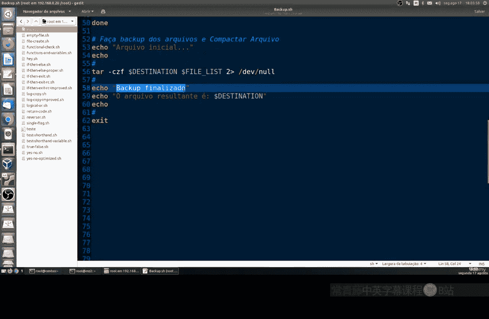

---

## 总结

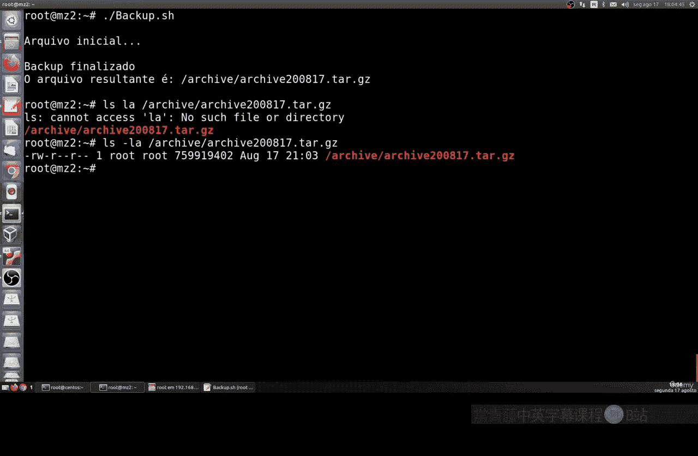

本节课中我们一起学习了如何自动化执行文件备份。我们回顾了`tar`命令的用法，建立了专用的备份目录与用户组权限，并编写了一个能够读取配置文件、自动打包和压缩指定文件的Shell脚本。通过将备份任务自动化，你可以定期、可靠地保护重要数据，这是系统管理中的一项基础且重要的技能。