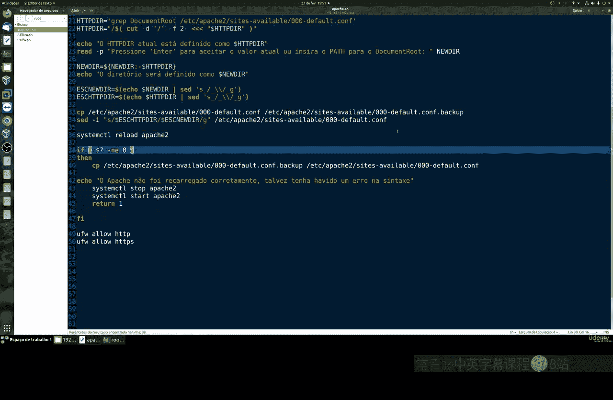
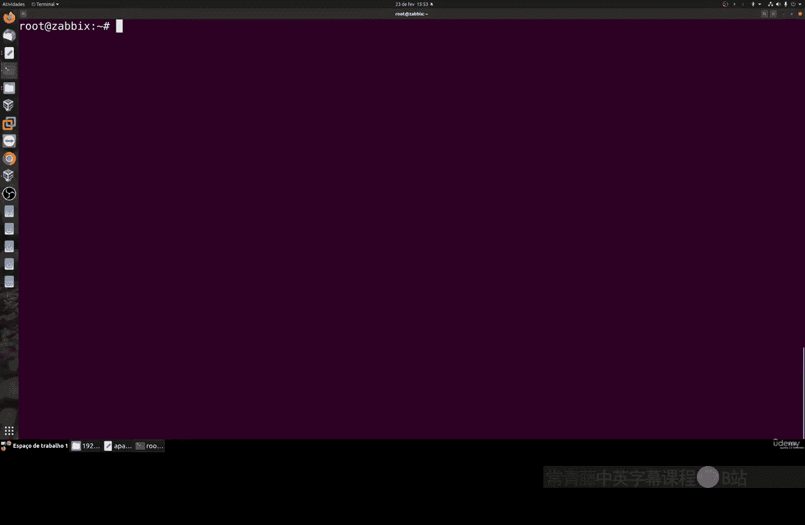

# 008：使用Shell脚本自动化Apache Web服务器配置 🚀

在本节课中，我们将学习如何编写一个Shell脚本来自动化Apache Web服务器的安装和基本配置。这个脚本将帮助您更高效地设置网站文件的存储位置，并配置防火墙规则。

---

## 概述

我们将创建一个名为 `apache.sh` 的Shell脚本。该脚本专为Ubuntu系统设计，主要功能包括：
1.  检查并安装Apache（如果尚未安装）。
2.  配置网站文件的默认根目录。
3.  设置防火墙以允许HTTP/HTTPS流量。

---

## 脚本创建与结构

首先，我们需要创建一个新的脚本文件。

```bash
nano apache.sh
```

脚本的开头需要指定解释器，并检查执行权限。

```bash
#!/bin/bash
```

---

## 检查用户权限

在开始安装和配置之前，脚本首先检查当前用户是否为root用户。因为安装软件和修改系统配置通常需要root权限。

```bash
if [[ $EUID -ne 0 ]]; then
   echo "此脚本必须以root用户身份运行。"
   exit 1
fi
```

---

## 安装Apache服务器

上一节我们确认了执行权限，本节中我们来看看如何安装Apache。如果系统尚未安装Apache，脚本将自动执行安装命令。

以下是安装Apache的命令：

```bash
apt-get update
apt-get install -y apache2
```

---

## 配置网站根目录

安装完成后，接下来是配置部分。Apache的默认网站文件目录通常是 `/var/www/html`。我们的脚本将询问用户是否要更改此目录。

首先，脚本会显示当前的默认目录。

```bash
current_dir=$(grep -i "DocumentRoot" /etc/apache2/sites-available/000-default.conf | awk '{print $2}' | head -1)
echo "当前的网站根目录是: $current_dir"
```

然后，它会提示用户输入新的目录路径。

```bash
echo "请输入新的网站根目录完整路径（直接按回车将使用当前目录）:"
read new_dir
```

如果用户直接按回车，脚本将保留原目录。如果输入了新路径，脚本会更新Apache的配置文件。

---

## 备份与修改配置文件

在修改任何系统配置文件之前，进行备份是一个好习惯。这可以防止配置错误导致服务无法启动。

以下是备份和修改配置文件的步骤：

1.  **备份原始配置文件**：
    ```bash
    cp /etc/apache2/sites-available/000-default.conf /etc/apache2/sites-available/000-default.conf.bak
    ```
2.  **使用`sed`命令替换配置文件中的目录路径**：
    ```bash
    sed -i "s|DocumentRoot .*|DocumentRoot $new_dir|" /etc/apache2/sites-available/000-default.conf
    ```

---

## 配置防火墙

为了使Web服务器能够从外部访问，我们需要在防火墙中开放HTTP（端口80）和HTTPS（端口443）端口。

以下是配置防火墙的命令：

```bash
ufw allow 80/tcp
ufw allow 443/tcp
ufw reload
```

---

## 重启Apache服务

所有配置更改完成后，需要重启Apache服务以使新设置生效。



```bash
systemctl restart apache2
```

最后，可以检查防火墙状态，确认端口已正确开放。

```bash
ufw status
```

---

## 运行脚本

保存并关闭脚本文件后，为其添加执行权限并运行。

```bash
chmod +x apache.sh
sudo ./apache.sh
```

脚本将引导您完成整个过程：检查权限、安装Apache、询问并设置网站根目录、配置防火墙，最后重启服务。

---

## 总结

本节课中我们一起学习了如何编写一个Shell脚本来自动化Apache Web服务器的初始设置。通过这个脚本，您可以快速完成：
*   Apache的自动安装。
*   网站根目录的自定义配置。
*   系统防火墙的必要规则添加。



这种方法尤其适用于需要频繁设置或管理多个网站的环境，能有效提升效率并减少手动操作的错误。在下一节课中，我们将探索更多Linux命令行的实用技巧。