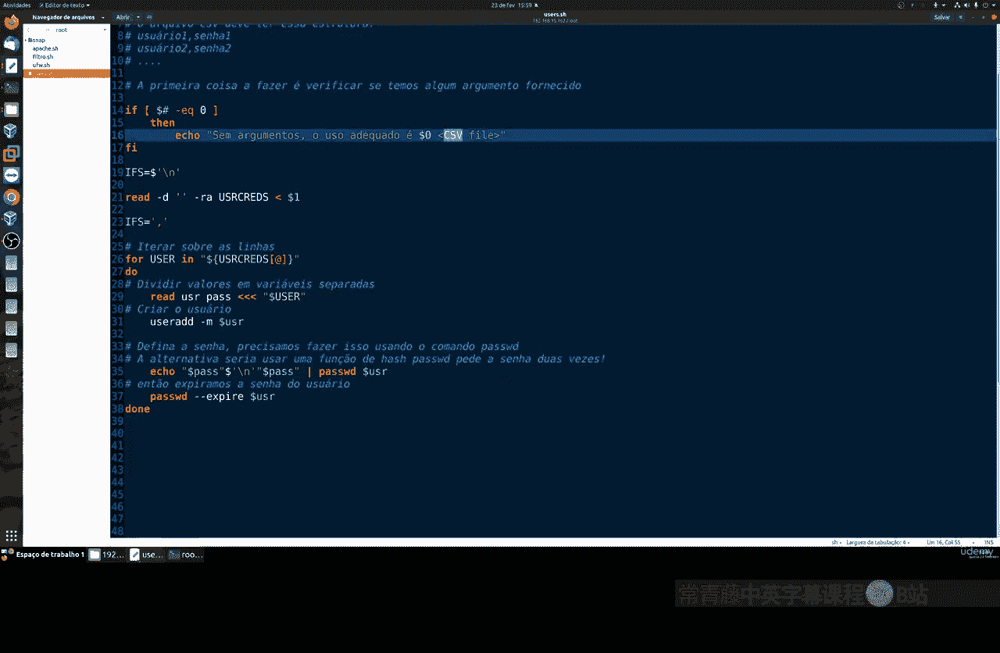
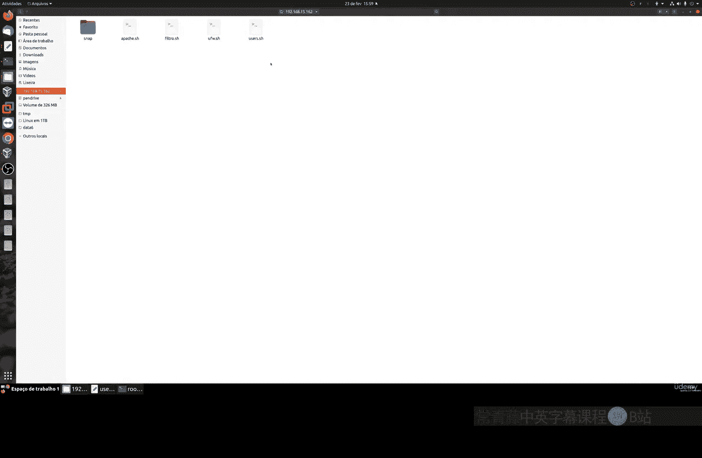
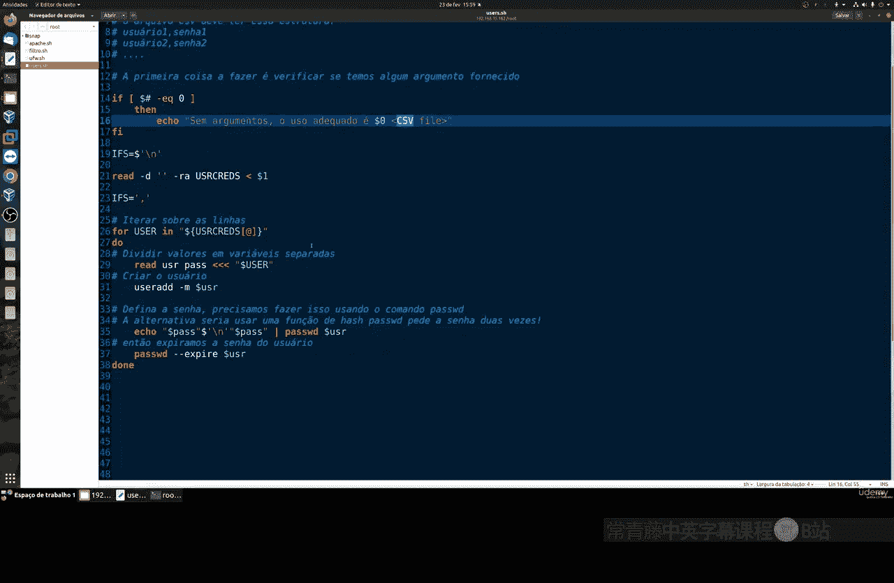
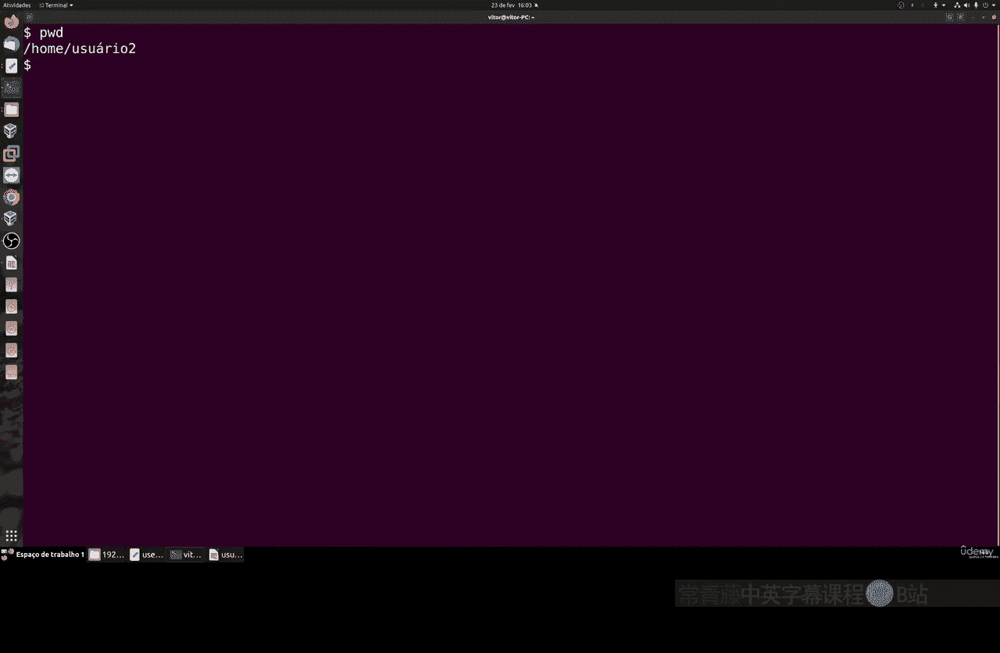
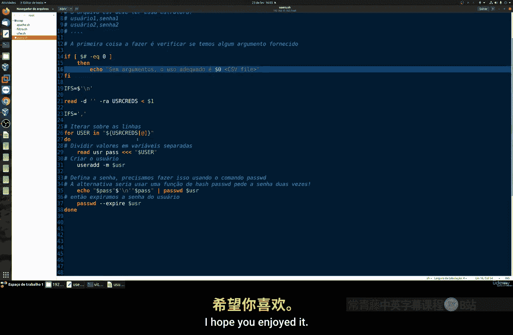
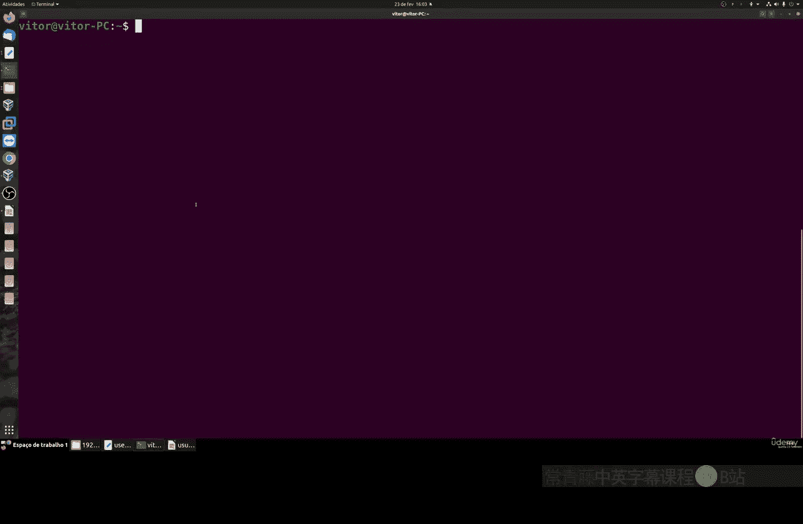

# 009：批量创建用户与强制密码更改 🔧

在本节课中，我们将学习如何通过编写一个Shell脚本，批量创建用户和组，并强制用户在首次登录时更改密码。这种方法特别适用于需要为大量用户（例如，通过CSV文件导入的用户列表）进行初始配置的系统管理员。

上一节我们介绍了Linux用户管理的基础命令，本节中我们来看看如何将这些命令自动化，以提高工作效率。

## 概述与准备工作

我们将创建一个Shell脚本。该脚本会读取一个包含用户名和初始密码的CSV文件，然后自动创建这些用户账户，并设置其密码在首次登录时过期，从而强制用户更改密码。

以下是实现此功能的核心步骤：
1.  检查CSV文件是否存在。
2.  读取CSV文件内容。
3.  遍历每一行数据，提取用户名和密码。
4.  使用 `useradd` 命令创建用户。
5.  使用 `passwd` 命令设置初始密码并使其过期。

## 脚本逻辑详解

首先，脚本需要检查用户是否提供了CSV文件作为参数。我们使用 `-f` 选项来检查文件是否存在。

```bash
if [ ! -f "$1" ]; then
    echo "错误：未提供CSV文件或文件不存在。"
    exit 1
fi
```

接下来，我们需要读取CSV文件。我们将使用 `IFS`（内部字段分隔符）设置为逗号，以便正确解析CSV中的列。然后使用 `read` 命令逐行读取文件内容。

```bash
IFS=','
while read -r username password; do
    # 在这里处理每一行的用户名和密码
done < "$1"
```

在循环体内，我们将执行创建用户和设置密码的操作。创建用户使用 `useradd` 命令。

```bash
useradd "$username"
```

创建用户后，我们需要为其设置一个初始密码。我们使用 `echo` 和管道将密码传递给 `passwd` 命令的 `--stdin` 选项（请注意，并非所有Linux发行版都支持此选项，更通用的方法是使用 `chpasswd`）。

```bash
echo "$password" | passwd --stdin "$username"
```

最关键的一步是强制用户在下一次登录时更改密码。这可以通过 `passwd` 命令的 `-e`（expire）选项来实现。

```bash
passwd -e "$username"
```

将以上部分组合起来，就构成了我们的核心脚本。

## 创建CSV文件

脚本需要一个特定格式的CSV文件作为输入。该文件应包含两列：用户名和初始密码，两列之间用逗号分隔。



以下是CSV文件内容的示例：
```
user1,password1
user2,password2
user3,password3
user4,password4
user5,password5
```



您可以使用任何文本编辑器（如LibreOffice Calc、Microsoft Excel或Vim/Nano）创建此文件，并确保以UTF-8编码保存，文件名为 `users.csv`。



## 运行脚本与测试

假设我们的Shell脚本保存为 `create_users.sh`，CSV文件为 `users.csv`。在运行脚本前，需要为其添加执行权限。

```bash
chmod +x create_users.sh
```


然后，执行脚本并传入CSV文件作为参数。

```bash
./create_users.sh users.csv
```

脚本将无声地创建所有用户。要测试效果，可以尝试使用CSV中定义的任意一个用户（如 `user1`）和初始密码（如 `password1`）进行SSH登录。

登录后，系统会立即提示“您必须更改密码”。用户需要先输入当前密码，然后设置一个符合复杂度要求的新密码。设置成功后，会自动退出登录，用户需要使用新密码重新登录。

## 脚本的扩展应用

这个脚本框架非常灵活，您可以轻松地修改它以适应其他需求。

例如，您可以创建一个用于批量删除用户的脚本。只需将循环体内的 `useradd` 命令替换为 `userdel` 命令即可，同时可以移除设置密码的步骤。

```bash
userdel -r "$username" # -r 选项会同时删除用户的家目录和邮件池
```

## 总结



本节课中我们一起学习了如何自动化Linux用户管理任务。我们创建了一个Shell脚本，它能够：
1.  从CSV文件批量读取用户信息。
2.  使用 `useradd` 命令创建用户账户。
3.  使用 `passwd` 命令设置初始密码并强制其在首次登录时过期。





这种方法极大地简化了为大量用户初始化系统账户的流程，并增强了系统的安全性，确保用户不会长期使用管理员设置的初始弱密码。您可以根据这个基础脚本，扩展出更多自动化管理功能。