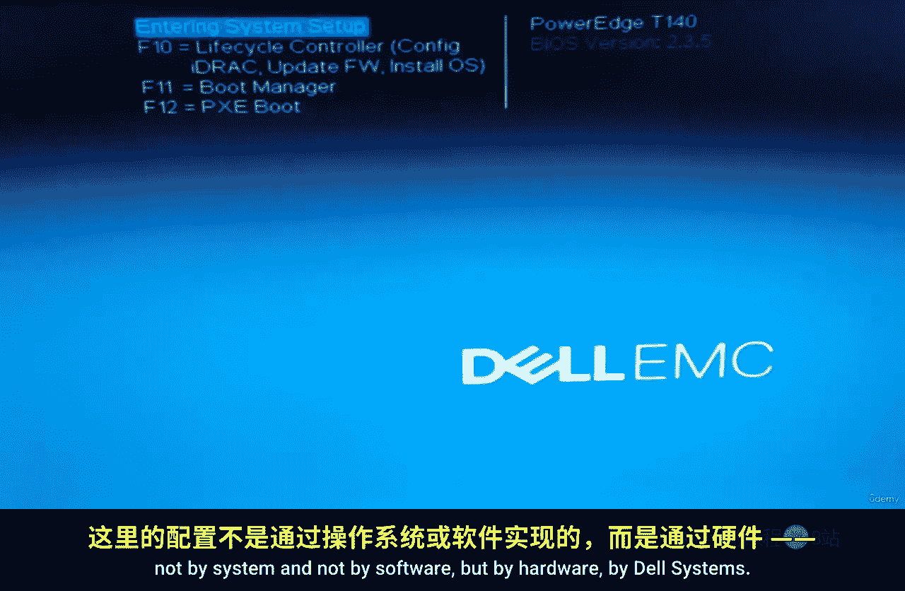
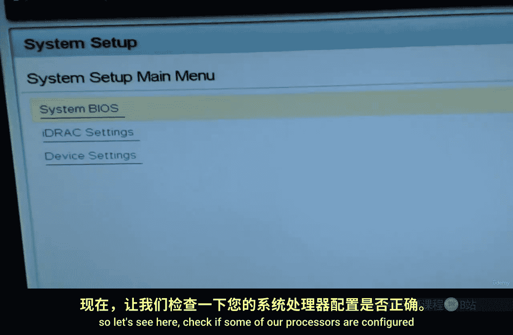
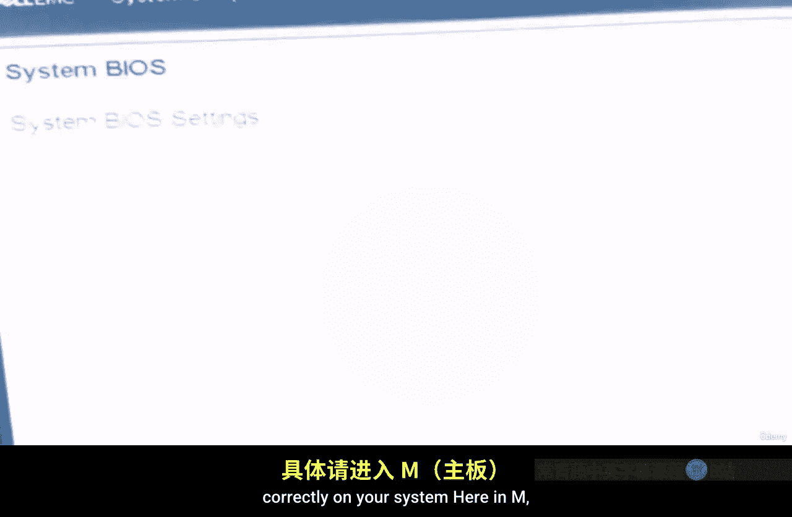
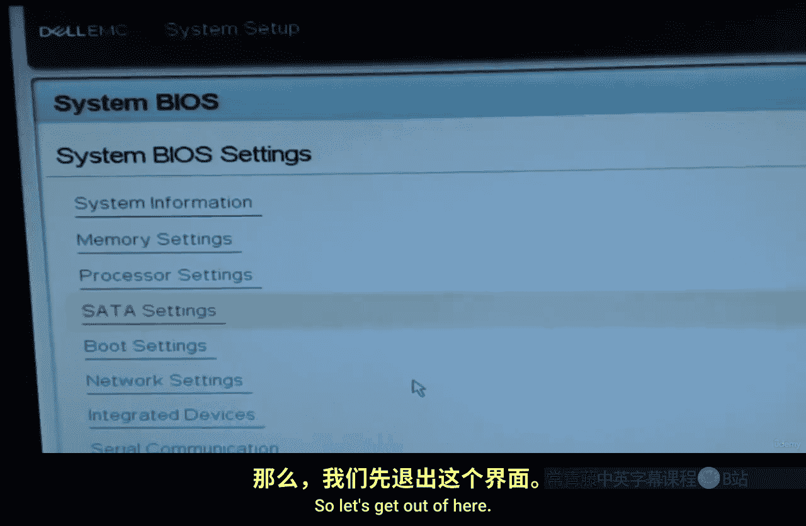
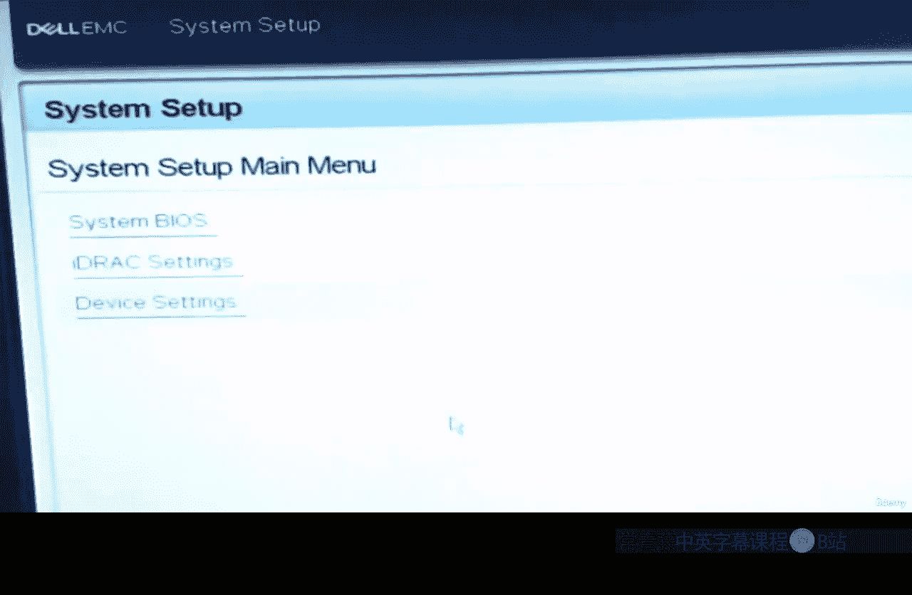
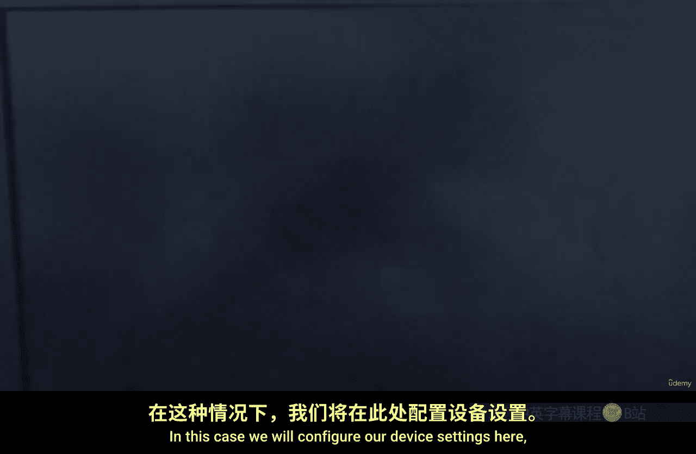
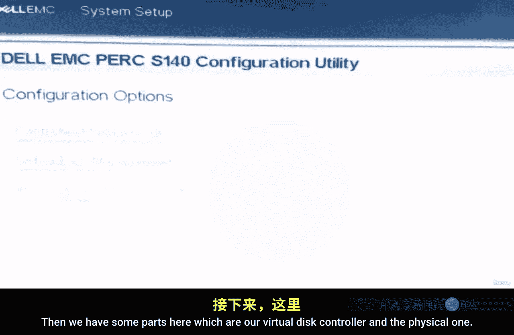
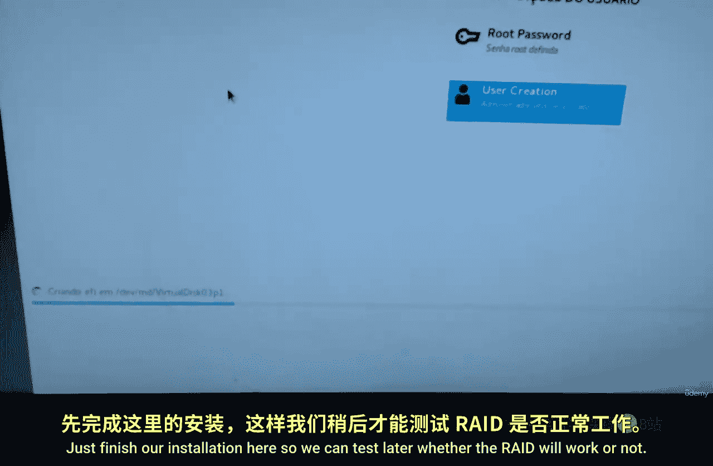
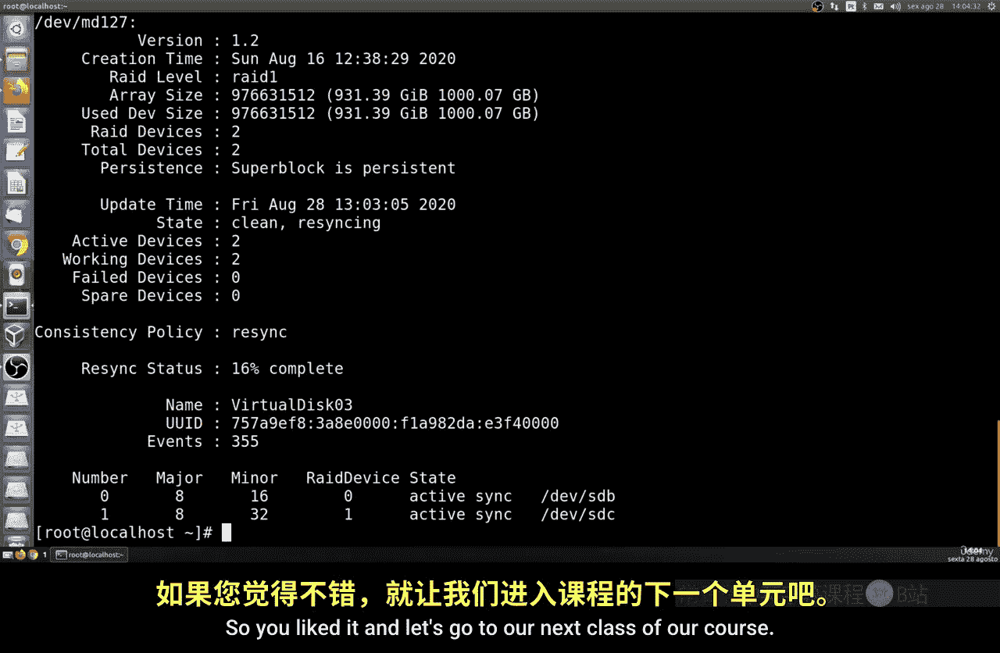

# 010：RAID 1 硬件配置 🛠️



在本节课中，我们将学习如何在戴尔服务器上通过主板BIOS配置硬件RAID 1。这是一种比软件RAID更高级的配置方式，需要两块完全相同的硬盘。我们将完成从BIOS设置到系统安装的完整流程，并学习如何在Linux系统中验证RAID状态。



## 概述





RAID 1通过镜像技术将数据同时写入两块硬盘，提供数据冗余。本节我们将通过戴尔服务器的硬件RAID控制器进行配置，这要求操作系统必须是厂商认证的版本（如CentOS、Red Hat等）。





## 进入系统设置



首先，我们需要进入服务器的BIOS设置界面。启动服务器时，按下 **F2** 键即可进入“系统设置”。

## 配置SATA模式

在系统设置中，找到与存储相关的菜单。我们需要确保SATA控制器的工作模式设置为 **RAID模式**。这是启用硬件RAID功能的前提。

## 配置物理磁盘

上一节我们进入了系统设置，本节中我们来看看如何配置物理磁盘加入RAID阵列。

1.  在“设备设置”中，选择“Dell EMC System Utility”。
2.  进入“物理磁盘管理”部分。
3.  系统会列出所有已连接的SATA硬盘。选择两块型号、容量完全相同的硬盘。
4.  将这两块硬盘的状态从“非RAID”转换为“RAID成员盘”。**注意：此操作会清除硬盘上的所有数据。**

以下是操作的核心逻辑：
```
物理磁盘状态：非RAID -> RAID成员盘
```

## 创建虚拟磁盘

物理磁盘准备就绪后，接下来我们需要创建逻辑上的虚拟磁盘，供操作系统使用。

1.  返回上级菜单，进入“虚拟磁盘管理”。
2.  选择“创建新的虚拟磁盘”。
3.  在RAID级别中选择 **RAID 1（镜像）**。
4.  选择刚才配置好的两块物理磁盘。
5.  确认虚拟磁盘的容量（通常为单块硬盘的容量），完成创建。


## 安装操作系统

虚拟磁盘创建成功后，就可以开始安装操作系统了。

1.  退出BIOS设置并重启服务器。
2.  从CentOS安装介质（如DVD或U盘）启动。
3.  在安装程序到达“安装目标位置”时，你应该能看到一个名为`mdraid`或类似标识的磁盘，这就是我们创建的RAID 1虚拟磁盘。
4.  选择该磁盘进行安装，后续步骤与普通安装无异。

## 在系统中验证RAID状态

系统安装完成后，我们需要通过命令行验证RAID的工作状态和同步进度。

首先，可以使用`cat`命令查看RAID的当前状态：

```bash
cat /proc/mdstat
```




此命令会输出RAID阵列的详细信息，包括：
*   阵列名称（如 `md127`）
*    RAID级别（`raid1`）
*   组件磁盘（`sda`, `sdb`）
*   **同步进度**（`[=============>......]` 和完成百分比）


**关键点**：初始同步需要时间。必须等待同步完成（达到100%）后，阵列才具备完整的冗余保护能力。

要获取更详细的信息，可以使用`mdadm`命令：

```bash
mdadm -D /dev/md127
```

此命令会显示阵列的详细配置、大小、设备数量以及同步的详细进度。

## 灾难恢复测试（课后作业）

当`/proc/mdstat`显示同步100%完成后，可以进行一项重要测试：
*   在系统运行期间，**物理上拔掉其中一块硬盘的SATA数据线**。
*   观察系统是否继续正常运行，数据访问是否中断。
*   重新连接硬盘后，观察阵列是否自动开始重建。

此测试能验证RAID 1的冗余功能是否真正生效。

## 重要限制说明

硬件RAID配置依赖于主板厂商的驱动和支持。以戴尔为例，通常仅正式支持以下操作系统：
*   Windows / Windows Server
*   Red Hat Enterprise Linux
*   CentOS / Rocky Linux
*   SUSE Linux Enterprise Server / openSUSE

其他发行版（如Ubuntu, Debian）可能无法直接识别硬件RAID阵列，在安装前需确认兼容性。

## 总结



本节课中我们一起学习了硬件RAID 1的完整配置流程。我们首先在戴尔服务器BIOS中将两块物理硬盘配置为RAID成员，然后创建了一个RAID 1级别的虚拟磁盘，并在此之上安装了CentOS系统。最后，我们学会了使用`cat /proc/mdstat`和`mdadm -D`命令在Linux中监控RAID的状态和同步进度。记住，硬件RAID能提供高性能和数据保护，但必须选择厂商支持的操作系统。