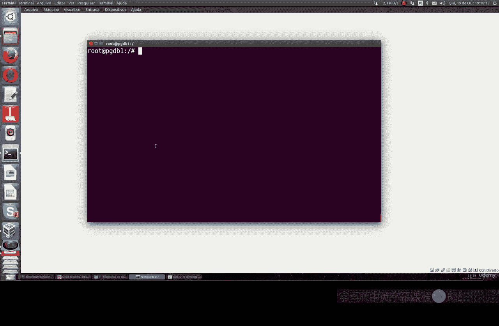

Linux命令行基础：P12：详细讲解ls命令 🗂️

在本节课中，我们将深入学习Linux系统中一个基础但至关重要的命令：`ls`命令。我们将详细探讨它的各种参数和用法，帮助你高效地列出和管理目录中的文件。

---

`ls`命令用于列出Linux目录中的文件和子目录，其功能类似于Windows系统中的`dir`命令。通过使用不同的参数，你可以获得不同格式和详细程度的信息。

以下是`ls`命令最常用的几种形式及其作用：

**1. 基本列表**
最基本的命令是直接输入`ls`。它会列出当前目录下所有可见的文件和目录名。
```bash
ls
```

**2. 显示详细信息**
使用`-l`参数可以以长格式列出详细信息，包括文件权限、所有者、所属组、大小和修改时间。
```bash
ls -l
```

**3. 显示隐藏文件**
在Linux中，以点`.`开头的文件或目录是隐藏的。使用`-a`参数可以显示所有文件，包括隐藏文件。
```bash
ls -a
```

**4. 人性化显示文件大小**
结合`-l`和`-h`参数，可以以更易读的格式（如K、M、G）显示文件大小，而不是单纯的字节数。
```bash
ls -lh
```

**5. 仅列出子目录**
使用`-d`参数并配合通配符`*/`，可以只列出当前目录下的子目录本身，而不显示其内部文件。
```bash
ls -d */
```

**6. 递归列出所有内容**
使用`-R`参数可以递归地列出当前目录及其所有子目录下的全部内容。这在需要查看整个目录树结构时非常有用。
```bash
ls -R
```

---




本节课我们一起学习了`ls`命令的核心用法。我们了解到，通过添加不同的参数，如`-l`查看详情、`-a`显示隐藏文件、`-h`人性化显示大小以及`-R`递归列出，可以极大地提升在命令行中浏览和管理文件的效率。熟练掌握`ls`命令是每一位Linux使用者或管理员的基本功。