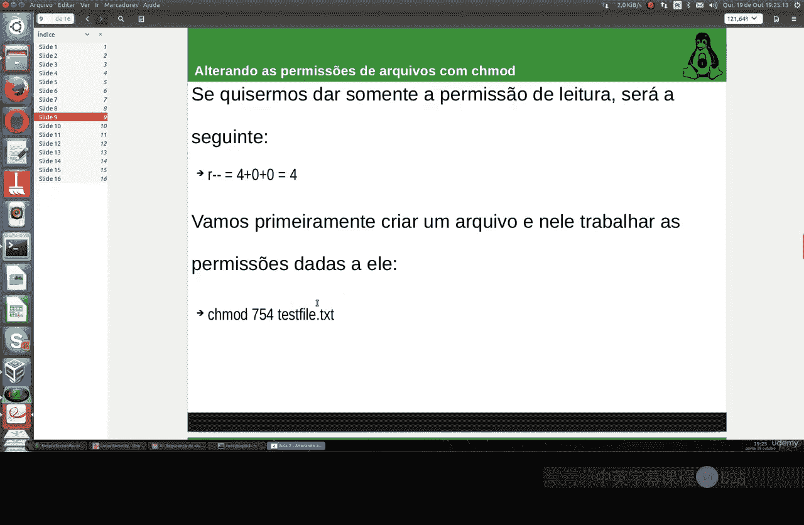
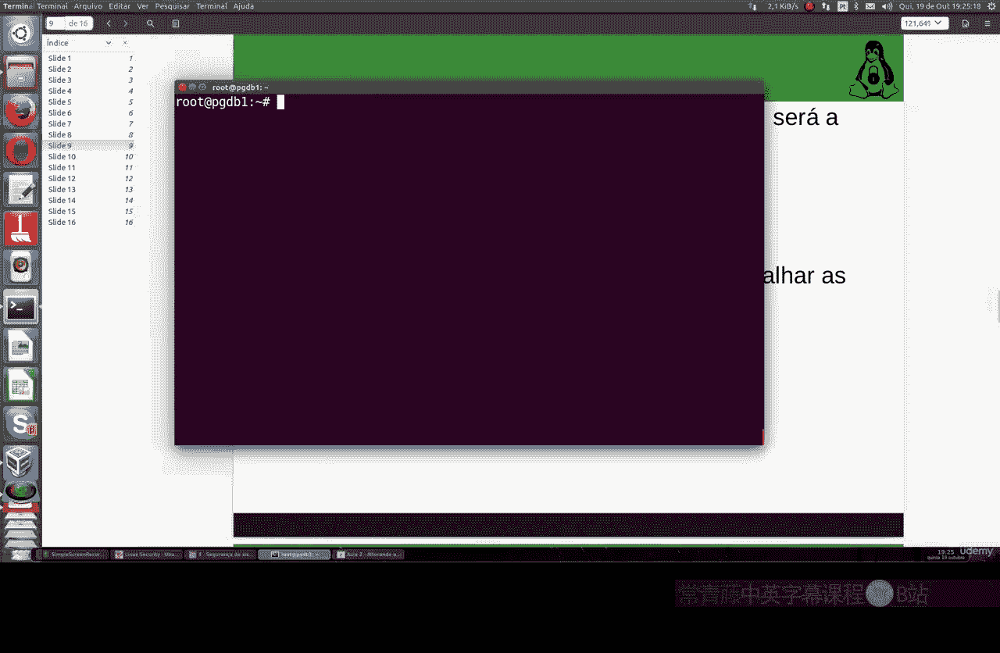
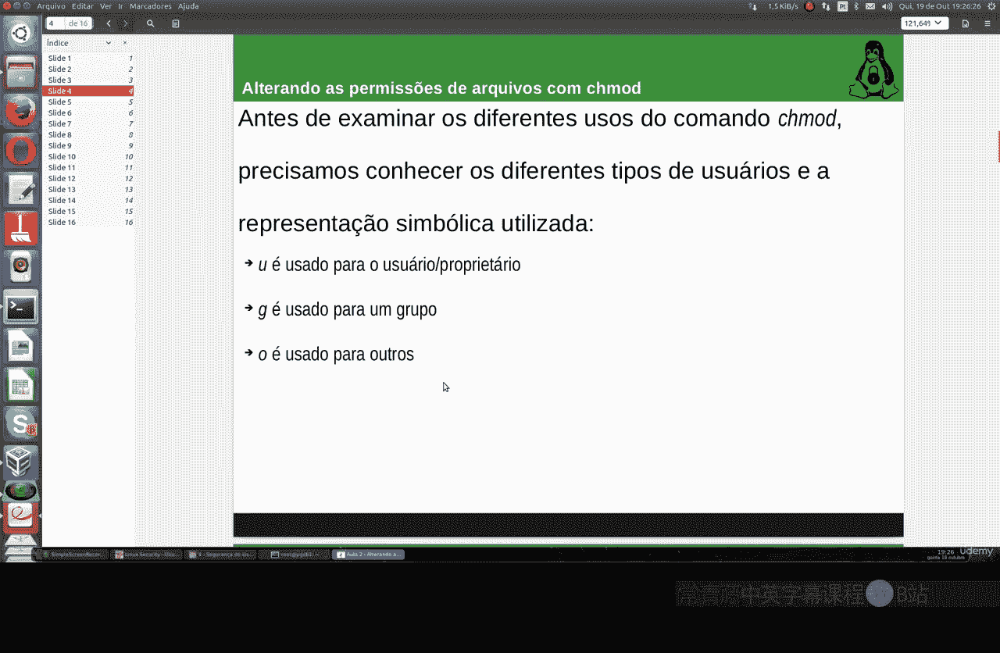
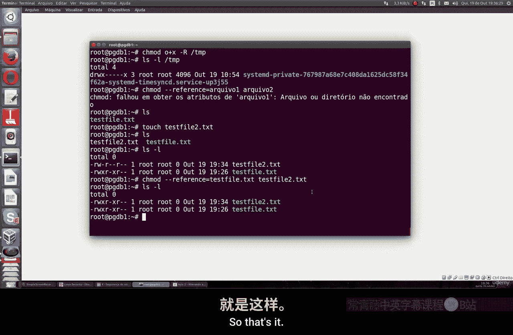

# 013：使用chmod更改文件权限 🔧

## 概述
在本节课中，我们将学习如何在Linux系统中使用`chmod`命令更改文件和目录的访问权限。理解并正确设置权限是保护系统数据安全、确保文件组织有序的关键。

---

## 权限基础理论
上一节我们介绍了Linux的基本概念，本节中我们来看看权限系统的工作原理。Linux为每个文件和目录定义了三种用户类型和三种基本权限。

### 用户类型
以下是三种用户类型及其对应的标识字母：
*   **U (User/Owner)**：文件或目录的所有者。
*   **G (Group)**：文件所属用户组的成员。
*   **O (Others)**：系统上的其他所有用户。

### 权限类型
以下是三种基本权限及其对应的标识字母和数字代码：
*   **R (Read/读取)**：允许读取文件内容或列出目录内容。数字代码为 **4**。
*   **W (Write/写入)**：允许修改文件内容或在目录内创建/删除文件。数字代码为 **2**。
*   **X (Execute/执行)**：允许将文件作为程序运行，或允许进入目录。数字代码为 **1**。

权限可以组合使用，其数字代码为各项之和。例如，读写权限 `RW` 的数字代码是 `4 + 2 = 6`。

---

## 使用符号模式修改权限
我们可以使用 `+`、`-`、`=` 符号配合 `u`、`g`、`o`、`a` 来直观地添加、移除或设置权限。





### 添加权限
使用 `+` 符号可以为指定用户添加权限。

以下是操作示例：
1.  为文件所有者添加执行权限：
    ```bash
    chmod u+x test.txt
    ```
2.  为组用户和其他用户同时添加执行权限：
    ```bash
    chmod g+x,o+x test.txt
    ```
3.  为所有用户（所有者、组、其他）添加读取权限：
    ```bash
    chmod a+r test.txt
    ```



### 移除权限
使用 `-` 符号可以为指定用户移除权限。

以下是操作示例：
1.  移除其他用户的执行权限：
    ```bash
    chmod o-x test.txt
    ```

---

## 使用数字（八进制）模式修改权限
数字模式更简洁，它用三位八进制数分别代表所有者、组和其他用户的权限总和。

### 权限数字计算
每个权限位是读(4)、写(2)、执行(1)权限的数字代码之和。
*   `7 (4+2+1)` = `rwx` (读、写、执行)
*   `6 (4+2+0)` = `rw-` (读、写)
*   `5 (4+0+1)` = `r-x` (读、执行)
*   `4 (4+0+0)` = `r--` (只读)
*   `0 (0+0+0)` = `---` (无权限)

### 应用数字权限
使用三位数字一次性设置所有用户的权限。

以下是操作示例：
1.  设置权限为：所有者可读写执行(7)，组用户可读执行(5)，其他用户只读(4)：
    ```bash
    chmod 754 test.txt
    ```
2.  设置权限为：所有者拥有全部权限(7)，组用户和其他用户无任何权限(0)：
    ```bash
    chmod 700 test.txt
    ```

---

## 高级操作与注意事项
掌握了基本修改方法后，我们来看看一些有用的高级操作和安全注意事项。

### 递归修改目录权限
使用 `-R` 选项可以递归地修改一个目录及其内部所有文件和子目录的权限。

以下是操作示例：
```bash
chmod -R 755 /path/to/directory
```

### 复制权限
使用 `--reference` 选项可以将一个文件的权限复制给另一个文件。

以下是操作示例：
```bash
chmod --reference=source_file.txt target_file.txt
```

### 安全建议
*   **遵循最小权限原则**：只授予完成工作所必需的最小权限。
*   **谨慎使用 `a+` 和 `-R`**：`chmod a+rwx` 或 `chmod -R 777` 这类命令会向所有用户开放所有权限，存在严重安全风险，应避免在重要目录上使用。
*   **保护系统关键目录**：如 `/etc`、`/bin`、`/sbin` 等，通常应只允许 `root` 用户写入。
*   **理解 `root` 用户的特殊性**：`root` 用户（超级管理员）不受普通权限限制，拥有系统的完全控制权。

---



## 总结
本节课中我们一起学习了Linux文件权限管理的核心知识。我们了解了三种用户类型（所有者、组、其他）和三种基本权限（读、写、执行）。重点掌握了使用 `chmod` 命令的两种主要方式：**符号模式**（如 `u+x`）进行直观的权限增减，以及**数字（八进制）模式**（如 `755`）进行精确的权限设置。我们还探讨了递归修改目录权限、复制权限等高级用法，并强调了遵循最小权限原则以保障系统安全的重要性。正确配置文件权限是Linux系统管理中一项基础且至关重要的技能。