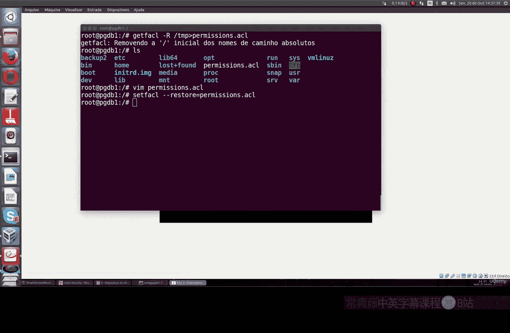

Linux命令行基础：Part 2：实施访问控制列表（ACL）🔐

在本节课中，我们将学习比 `chmod` 更高级的文件权限管理工具——访问控制列表（ACL）。ACL允许我们为特定用户或用户组设置精细的文件和目录访问权限，超越了传统的所有者、组和其他用户的三类权限模型。

---

### **检查ACL是否启用** ✅

上一节我们介绍了基本的文件权限，本节中我们来看看如何确认ACL功能是否已启用。ACL在大多数Linux发行版中默认已安装。

要检查文件或目录的ACL设置，可以使用 `getfacl` 命令。例如，我们有一个名为 `test` 的文件：

```bash
getfacl test
```

命令输出会显示文件名、所有者、所属组以及详细的权限信息。例如，输出可能显示所有者拥有读、写、执行权限，组拥有读和执行权限，而其他用户仅有读权限。这表明ACL功能已激活并可正常使用。

---

### **理解并测试ACL功能** 🧪

现在确认ACL已就绪，让我们深入理解它的作用并进行测试。ACL的核心作用是实现更精细的权限控制。例如，即使多个用户属于同一个组，我们也可以只允许其中部分用户访问某个文件。

为了演示，我们需要在系统中创建三个新用户和一个组。

以下是创建用户和组的命令：

```bash
useradd user1
passwd user1
useradd user2
passwd user2
useradd user3
passwd user3
groupadd group1
```

接着，将这三个用户都加入到 `group1` 中：

```bash
usermod -aG group1 user1
usermod -aG group1 user2
usermod -aG group1 user3
```

现在，`user1`、`user2` 和 `user3` 都属于同一个组 `group1`。

---

### **使用ACL设置精细权限** 🛠️

假设我们以 `user1` 身份登录，并在 `/tmp` 目录下创建一个名为 `accounts` 的目录。我们只希望 `user2` 能读写这个目录，而属于同组的 `user3` 则不能访问。

首先，切换到 `user1` 并创建目录：

```bash
su user1
cd /tmp
mkdir accounts
```

传统的 `chmod` 命令无法实现只针对一个组内特定用户的授权。这时就需要使用ACL。

使用 `setfacl` 命令为 `user2` 赋予对 `accounts` 目录的读写执行权限：

```bash
setfacl -m u:user2:rwx accounts
```

同时，移除其他用户（others）的所有权限：

```bash
setfacl -m o::--- accounts
```

现在，使用 `getfacl` 命令查看目录的ACL设置：

```bash
getfacl accounts
```

输出将显示 `user1` 是所有者，拥有完整权限，`user2` 被特别授予了 `rwx` 权限，而其他用户（包括 `user3`）没有任何权限。

我们可以进行测试：切换到 `user2`，可以在 `accounts` 目录内创建文件；而切换到 `user3`，则无法进入该目录，系统会提示“Permission denied”。

---

### **备份与恢复ACL权限** 💾

ACL的另一个实用功能是备份和恢复复杂的权限设置。这不同于文件内容备份，而是专门备份权限配置。

例如，要备份 `/tmp` 目录下所有文件和子目录的ACL权限，可以使用以下命令：

```bash
getfacl -R /tmp > permissions_backup.acl
```

这个命令会生成一个名为 `permissions_backup.acl` 的文件，其中包含了所有权限规则。

如果需要从备份中恢复权限，可以使用 `setfacl` 命令：

```bash
setfacl --restore=permissions_backup.acl
```

建议在系统的根目录或重要目录下进行此类操作，以确保权限恢复的准确性和一致性。

---

### **总结** 📚




本节课我们一起学习了Linux中的访问控制列表（ACL）。我们了解了如何检查ACL状态，如何创建用户和组，以及如何使用 `setfacl` 和 `getfacl` 命令为特定用户设置精细的文件和目录访问权限，从而突破了传统 `chmod` 命令的限制。此外，我们还掌握了备份和恢复ACL权限设置的方法，这对于系统管理来说是一个非常实用的技巧。通过ACL，你可以更高效、更详细地管理Linux系统的文件访问控制。