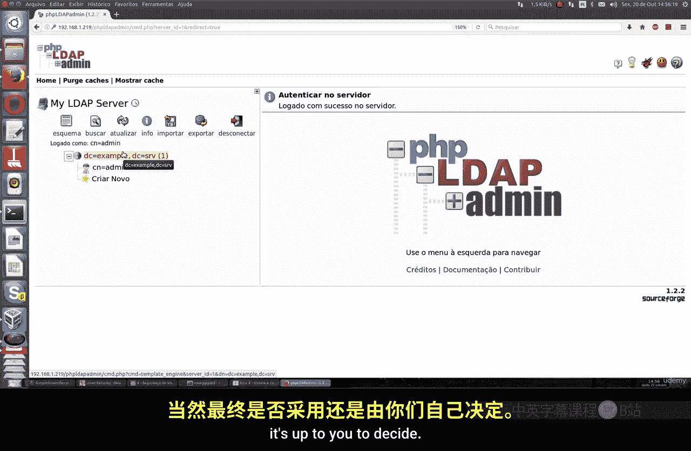

# 015：安装并配置基础LDAP服务器 🖥️

在本节课中，我们将学习如何在Linux系统上安装和配置一个基础的LDAP服务器。LDAP（轻量级目录访问协议）是一种用于访问和维护分布式目录信息服务的协议，常用于集中式用户认证和管理。

## 概述

使用LDAP服务器的主要优势在于能够以更集中的方式管理网络中对计算机的访问。将所有信息集中管理，并且如果使用Linux系统，相比使用Windows服务器进行配置，通常会更加安全。

LDAP类似于一种数据库，但其信息结构更具表现力且基于属性。如前所述，LDAP主要用于集中式身份验证，从而避免因用户未使用预定义密码而引发的各类问题，例如权限提升。由于OpenLDAP是开源的并使用加密技术，它在用户和密码传输过程中提供了额外的安全层级。

OpenLDAP可以与OpenSSL集成，确保所有传输都以加密形式进行，并支持配置密钥和数字证书。它适用于网络中的任何类型的机器，无论是Windows、Linux还是macOS。

## 安装OpenLDAP服务器

上一节我们介绍了LDAP的基本概念和优势，本节中我们来看看如何安装OpenLDAP服务器。我们将使用Ubuntu Server进行演示，但相关命令同样适用于Rocky Linux和Debian服务器。

首先，我们需要更新系统软件包仓库。

```bash
sudo apt update
```

更新完成后，运行以下命令安装OpenLDAP及其相关工具。

```bash
sudo apt install slapd ldap-utils
```

安装过程中，系统会提示你设置LDAP管理员密码。请设置一个强密码。

## 配置OpenLDAP

安装完成后，我们需要对服务器进行基础配置。我们将使用`dpkg-reconfigure`工具来重新配置`slapd`包。

```bash
sudo dpkg-reconfigure slapd
```

以下是配置过程中需要回答的几个关键步骤：

1.  当询问是否省略服务器配置时，选择 **No**。
2.  输入你的DNS域名。例如，可以使用 `example.crv`。建议避免使用 `.com`、`.org` 等真实顶级域名，以免与互联网上的现有域名冲突。
3.  设置组织名称。
4.  再次确认管理员密码。
5.  选择数据库后端时，选择 **HDB**。
6.  当询问是否清除旧数据库时，选择 **No**。
7.  选择允许使用LDAP协议版本2。

至此，OpenLDAP服务器的基本配置已经完成。如果你想重新配置，可以随时再次运行 `sudo dpkg-reconfigure slapd`。

## 安装Web管理界面

为了更直观、便捷地管理LDAP服务器，我们可以安装一个基于Web的图形化管理界面。我们将安装`phpldapadmin`。

运行以下命令进行安装：

```bash
sudo apt install phpldapadmin
```

安装完成后，需要编辑其配置文件以匹配我们的LDAP服务器设置。

使用你喜欢的文本编辑器（如`vim`或`nano`）打开配置文件：

```bash
sudo vim /etc/phpldapadmin/config.php
```

在配置文件中，找到并修改以下两个关键值：

1.  找到设置服务器地址的行，将其值修改为你Linux服务器的IP地址。你可以通过运行 `ip a` 命令来查看IP地址。
    ```php
    $servers->setValue('server','host','192.168.1.100'); // 请替换为你的实际IP
    ```
2.  找到设置基准DN（Base DN）的行，将其值修改为你之前配置的DNS域名。
    ```php
    $servers->setValue('server','base',array('dc=example,dc=crv'));
    ```

此外，默认配置中可能有一行关于“模板警告”的配置被注释掉了。你可以取消注释并启用它，以便在管理界面中隐藏模板警告。

```php
$config->custom->appearance['hide_template_warning'] = true;
```

保存并关闭配置文件。

## 访问与管理

现在，你可以通过浏览器访问phpLDAPadmin的Web界面了。

在浏览器地址栏中输入你的服务器IP地址，后跟 `/phpldapadmin`。例如：
```
http://192.168.1.100/phpldapadmin
```

在登录页面，你需要输入以下信息：
*   **登录DN**： 这基于你之前设置的域名和管理员账户。格式通常为 `cn=admin,dc=example,dc=crv`。
*   **密码**： 输入你在安装过程中设置的LDAP管理员密码。

成功登录后，你将进入管理界面。在这里，你可以创建和管理用户、组和组织单元等目录对象。通过集中配置，这些用户账户可以用于网络中Windows、Linux等各类系统的身份验证，从而提升整体安全性和管理效率。

## 总结




本节课中我们一起学习了如何在Linux系统上安装和配置一个基础的OpenLDAP服务器。我们完成了从软件安装、初始配置到安装Web管理界面的全过程。通过LDAP，你可以实现网络中用户和资源的集中式认证与管理，这通常比分散管理或使用某些其他系统方案更为安全和高效。虽然OpenLDAP功能非常复杂和强大，但本次课程为你搭建了一个可用的基础环境，供你进一步探索和实践。