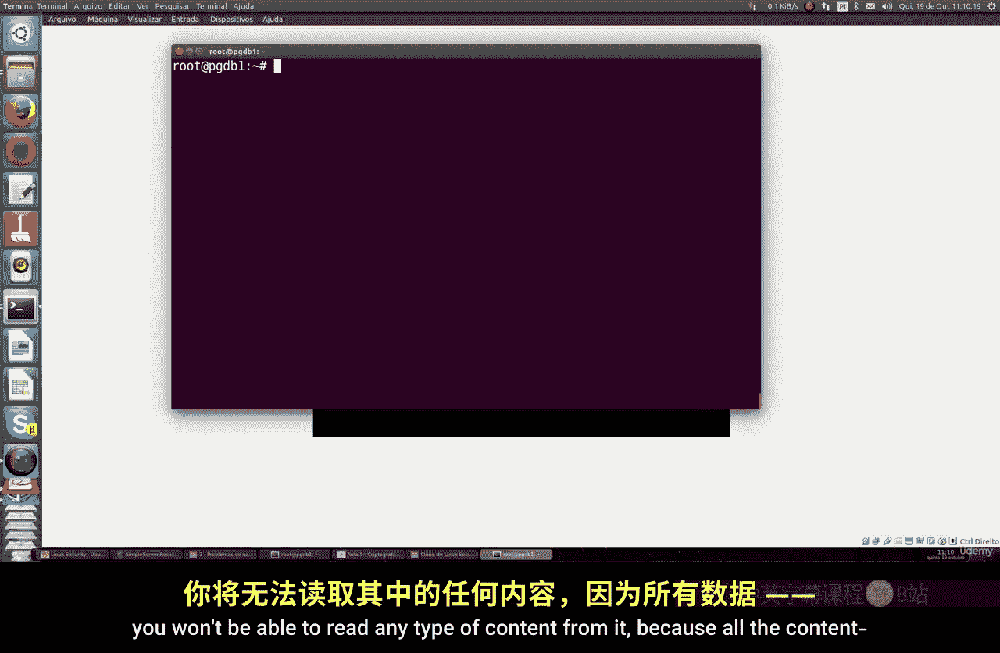

# 016：使用LUKS加密磁盘 🔐

在本节课中，我们将学习如何在Linux系统上使用LUKS（Linux Unified Key Setup）对磁盘分区进行加密。这是一种保护硬盘、U盘等存储设备上敏感数据（如私人文件、数据库、密码等）的安全方法。即使设备丢失，未经授权者也很难破解加密内容。

## 准备工作 💻

上一节我们介绍了基本的命令行操作，本节中我们来看看如何为加密操作准备一个测试环境。首先，你需要一个用于加密的磁盘分区。**注意：以下操作会完全擦除目标磁盘上的所有数据，请务必在测试环境（如虚拟机）中进行，切勿在生产环境或个人重要数据上直接操作。**

以下是创建和准备测试磁盘的步骤：

1.  **创建虚拟磁盘**：在虚拟机软件（如VirtualBox）中，为你的Linux系统添加一个新的虚拟硬盘。例如，创建一个名为`test`、大小为1GB的固定大小VHD磁盘，并确保启用“热插拔”选项。
2.  **识别新磁盘**：启动Linux系统，打开终端，使用 `lsblk` 或 `fdisk -l` 命令查看磁盘列表。新添加的磁盘通常会被识别为 `/dev/sdb`（假设你的主系统盘是 `/dev/sda`）。我们将以 `/dev/sdb` 为例进行后续操作。
3.  **安装必要工具**：在终端中运行命令安装 `cryptsetup` 工具包，这是管理LUKS加密的核心程序。
    *   **Ubuntu/Debian** 系统使用：
        ```bash
        sudo apt update && sudo apt install cryptsetup
        ```
    *   **RHEL/CentOS/Fedora** 系统使用：
        ```bash
        sudo yum install cryptsetup  # 或 sudo dnf install cryptsetup
        ```

## 加密磁盘分区 🔒

现在我们已经准备好了目标磁盘 `/dev/sdb`，接下来开始对其进行加密。

首先，使用 `cryptsetup` 命令初始化加密分区。这会擦除分区上的所有现有数据并设置加密头。

```bash
sudo cryptsetup luksFormat /dev/sdb
```
执行命令后，系统会提示你确认操作（输入大写的 `YES`），然后要求你设置并确认一个**加密密码**。请务必牢记此密码，一旦遗忘将无法恢复数据。

接着，我们需要“打开”这个加密分区，将其映射到一个虚拟设备节点，以便系统能够访问。

```bash
sudo cryptsetup open /dev/sdb backup2
```
命令中的 `backup2` 是你为这个映射起的任意名称。系统会要求输入上一步设置的密码。成功后，系统会创建一个对应的设备文件 `/dev/mapper/backup2`。

你可以使用以下命令验证映射是否成功：
```bash
ls -l /dev/mapper/backup2
```

## 格式化与使用加密分区 📂

加密分区被“打开”并映射后，其表现就像一个普通的未加密磁盘。但在存储数据前，我们需要先对其进行格式化并挂载。

首先，为了确保安全性和性能，我们用零填充整个映射设备（即加密分区内部空间）。

```bash
sudo dd if=/dev/zero of=/dev/mapper/backup2 status=progress
```
**注意**：此过程耗时取决于磁盘大小。你可以使用 `pv` 命令来显示进度（需先安装：`sudo apt install pv`），命令可改为 `sudo pv < /dev/zero | sudo dd of=/dev/mapper/backup2`。

填充完成后，为加密分区创建一个文件系统（例如ext4）。

```bash
sudo mkfs.ext4 /dev/mapper/backup2
```

现在，创建一个目录作为挂载点，并将加密分区挂载上去。

```bash
sudo mkdir /backup2
sudo mount /dev/mapper/backup2 /backup2
```

挂载后，你就可以像使用普通文件夹一样，向 `/backup2` 目录中读写文件，所有数据都会被自动加密后存入 `/dev/sdb` 物理设备。

使用 `df -h` 命令可以查看挂载情况。

## 卸载与关闭加密分区 🔓

当你不再需要使用加密分区时，正确的操作顺序是先卸载文件系统，然后关闭LUKS映射。

卸载分区：
```bash
sudo umount /backup2
```

关闭LUKS设备映射：
```bash
sudo cryptsetup close backup2
```
执行后，`/dev/mapper/backup2` 设备将消失，加密分区被锁定。此时，`/dev/sdb` 设备中的数据处于加密状态，无法直接访问。

下次需要访问时，重复 **【加密磁盘分区】** 小节中的 `cryptsetup open` 和 `mount` 命令即可。

## 其他管理操作 ⚙️

以下是几个有用的LUKS管理命令：

*   **查看加密分区状态**：
    ```bash
    sudo cryptsetup status backup2
    ```

*   **查看LUKS头信息**：
    ```bash
    sudo cryptsetup luksDump /dev/sdb
    ```

*   **修改加密密码**（需提供旧密码）：
    ```bash
    sudo cryptsetup luksChangeKey /dev/sdb
    ```

*   **添加新密钥槽**（允许多个密码打开）：
    ```bash
    sudo cryptsetup luksAddKey /dev/sdb
    ```

*   **移除密钥槽**（删除一个密码）：
    ```bash
    sudo cryptsetup luksRemoveKey /dev/sdb
    ```

## 总结 📝




本节课中我们一起学习了使用LUKS对Linux磁盘分区进行全盘加密的完整流程。关键步骤包括：**准备磁盘**、使用 `cryptsetup luksFormat` **初始化加密**、使用 `cryptsetup open` **打开映射**、**格式化并挂载**使用分区，最后**卸载并关闭**映射。掌握这些操作能有效提升你存储在可移动介质或特定分区上数据的安全性。请始终牢记你的加密密码，并在安全的测试环境中熟练此流程后再应用于实际场景。