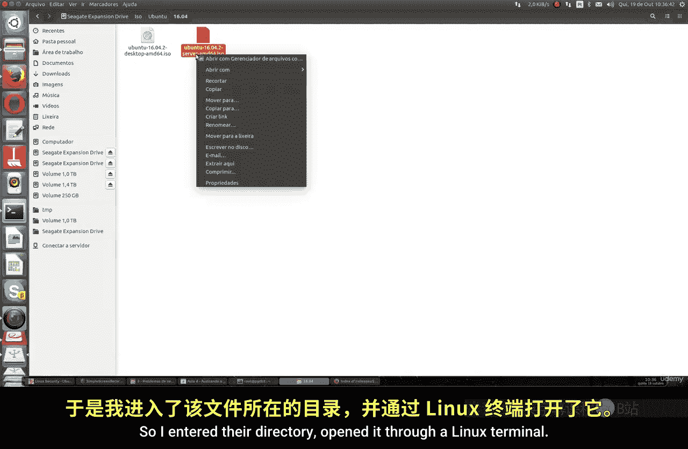
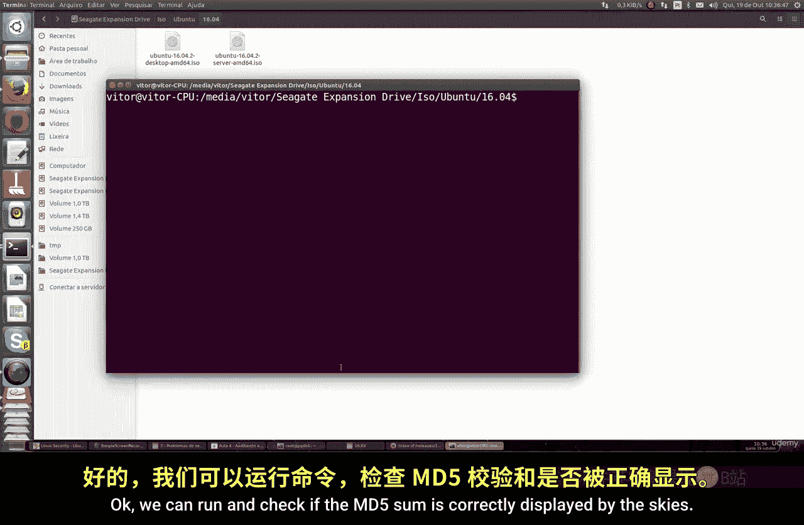
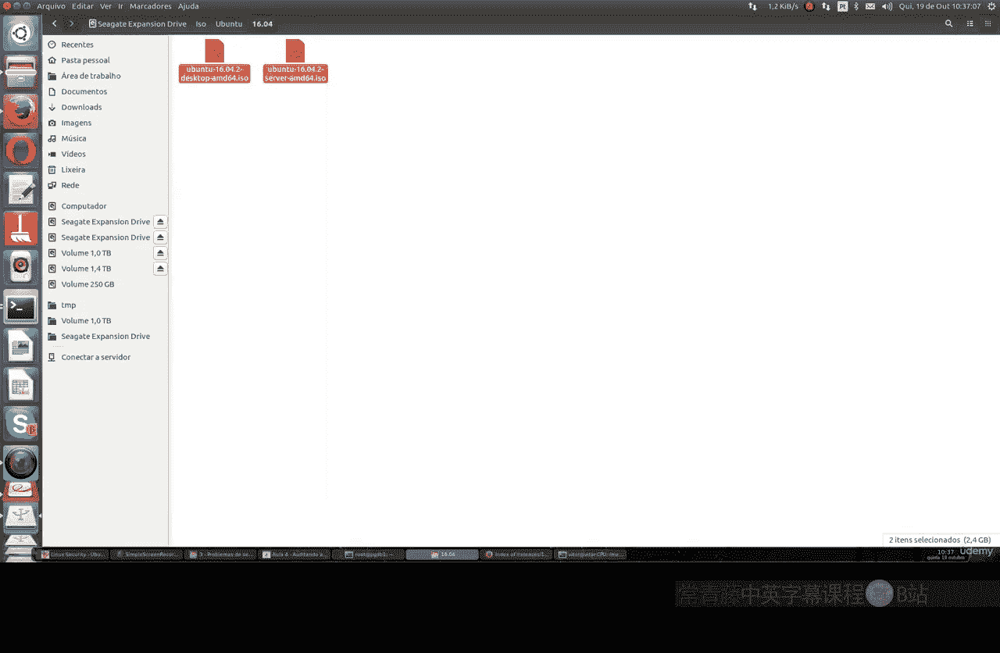
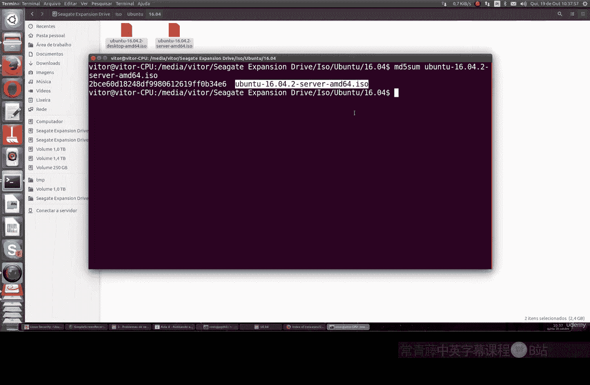
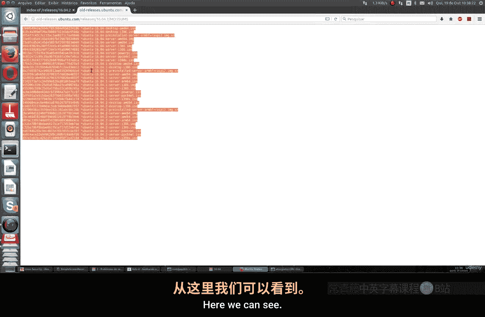
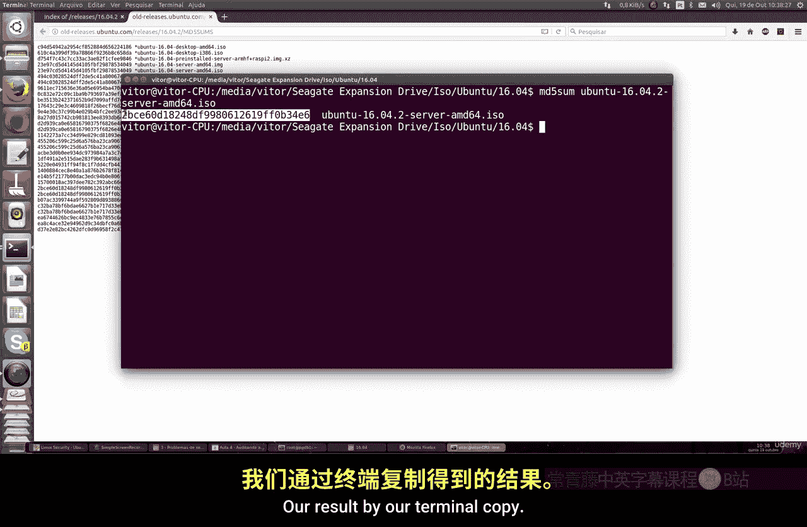
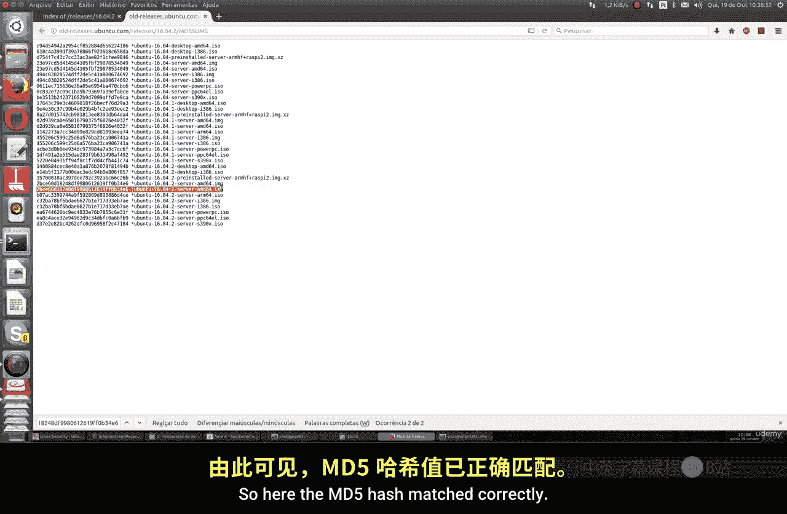
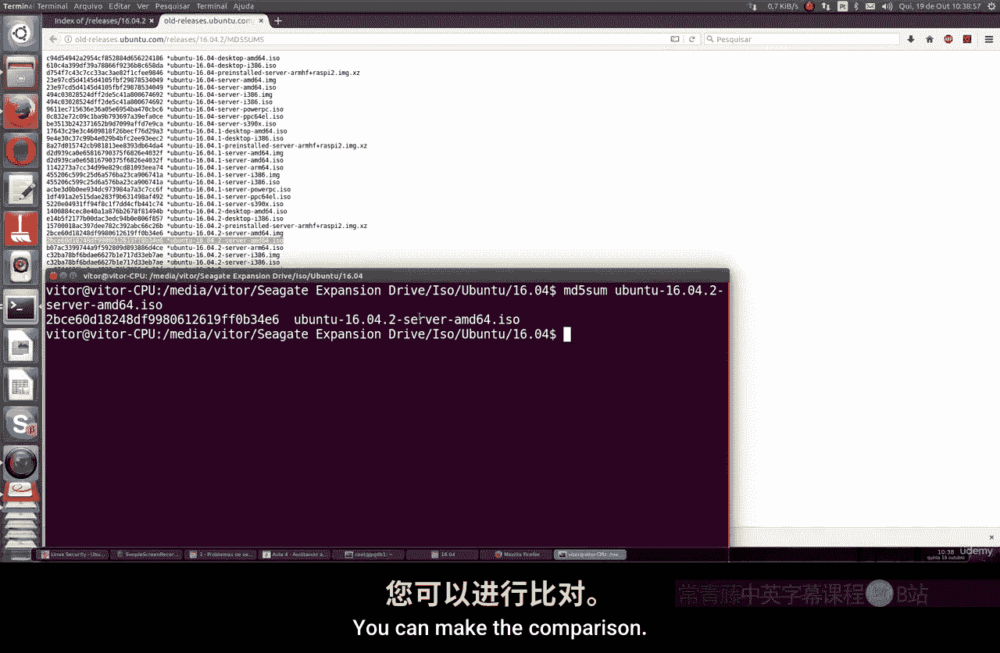
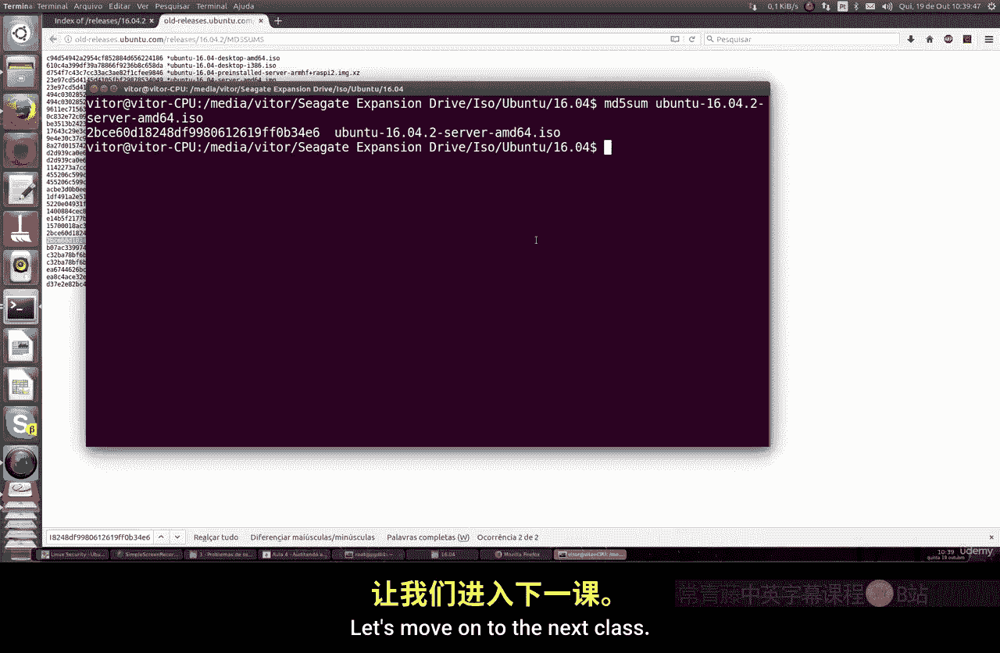

# 017：审计设施完整性 🔍

在本节课中，我们将学习一个非常实用的技能：如何验证下载的Linux系统安装镜像（ISO文件）的完整性。这是安装任何Linux系统前必须进行的第一步，以确保你安装的系统是官方原版且未被篡改或损坏的。

## 为什么需要验证ISO完整性？

上一节我们介绍了命令行的一些基本操作，本节中我们来看看一个至关重要的安全实践。历史上曾发生过Linux发行版的ISO文件被黑客篡改的事件，例如Linux Mint就曾遭遇此类攻击。如果你安装了一个被破坏的ISO镜像，那么后续的所有安全措施都将失去意义，因为整个系统从安装之初就已经不安全了。

因此，在安装任何Linux系统之前，验证ISO文件的完整性和真实性是必不可少的一步。

## 如何验证ISO文件？

验证的核心方法是比较**哈希值**。每个官方发布的ISO文件都会附带一个唯一的校验和（通常是MD5或SHA256哈希值）。你需要计算你下载的ISO文件的哈希值，并与官方网站上公布的哈希值进行比对。如果两者一致，则说明文件是完整且未被篡改的。

以下是验证ISO文件完整性的具体步骤：

1.  **获取官方哈希值**：首先，前往你下载ISO文件的官方网站，找到该版本ISO对应的MD5或SHA256校验和，并将其记录下来。
2.  **计算本地文件的哈希值**：然后，在你本地的Linux系统（可以是任何发行版，如Ubuntu、Fedora等）中，使用终端命令计算你下载的ISO文件的哈希值。
3.  **比对哈希值**：最后，将你计算出的哈希值与官方网站上公布的哈希值进行比对。如果两者完全一致，则说明ISO文件是可信的。

## 实践操作：使用`md5sum`命令

让我们以Ubuntu Server 16.04.2的ISO文件为例，进行实际操作演示。我们将使用`md5sum`这个命令来计算文件的MD5哈希值。



**命令语法如下：**
```bash
md5sum [文件名]
```



**操作流程：**
1.  打开终端，并切换到存放你下载的ISO文件的目录。
2.  运行命令 `md5sum ubuntu-16.04.2-server-amd64.iso`（请将文件名替换为你实际下载的文件名）。
3.  命令会输出一长串字符和数字，这就是该ISO文件的MD5哈希值。
4.  将此哈希值与Ubuntu官方网站上该ISO文件页面公布的MD5哈希值进行比对。



如果两个哈希值**完全相同**，如下图所示，则证明你下载的ISO文件是完整且真实的，可以放心安装。



















## 总结


本节课中我们一起学习了如何审计Linux安装镜像（ISO）的完整性。我们了解到，在安装系统前验证ISO文件是保障系统安全的基础。通过使用`md5sum`命令计算文件的哈希值，并与官方值比对，我们可以有效确保所安装的系统镜像未被篡改或损坏。这是一个简单但极其重要的安全习惯，请务必在每次安装新系统前执行此操作。